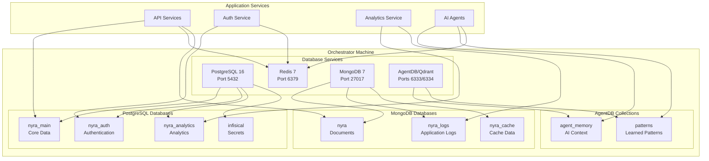
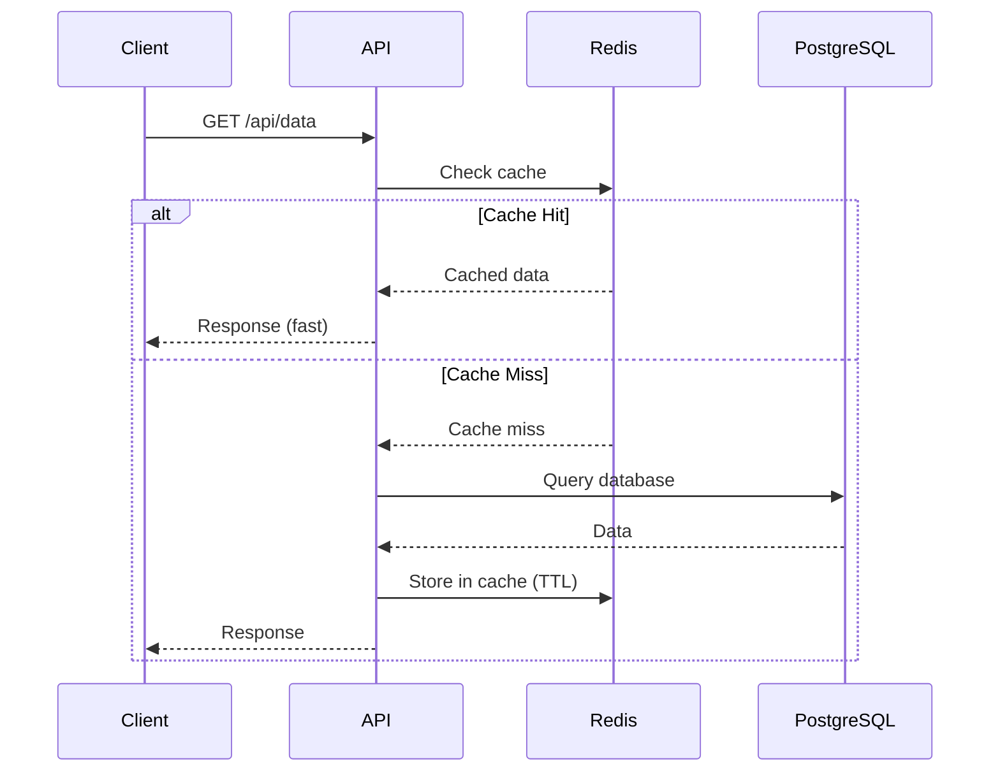
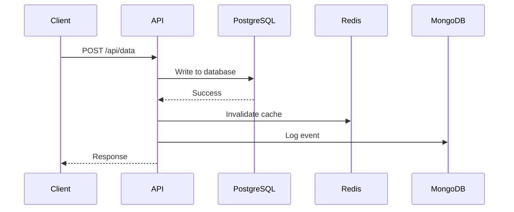
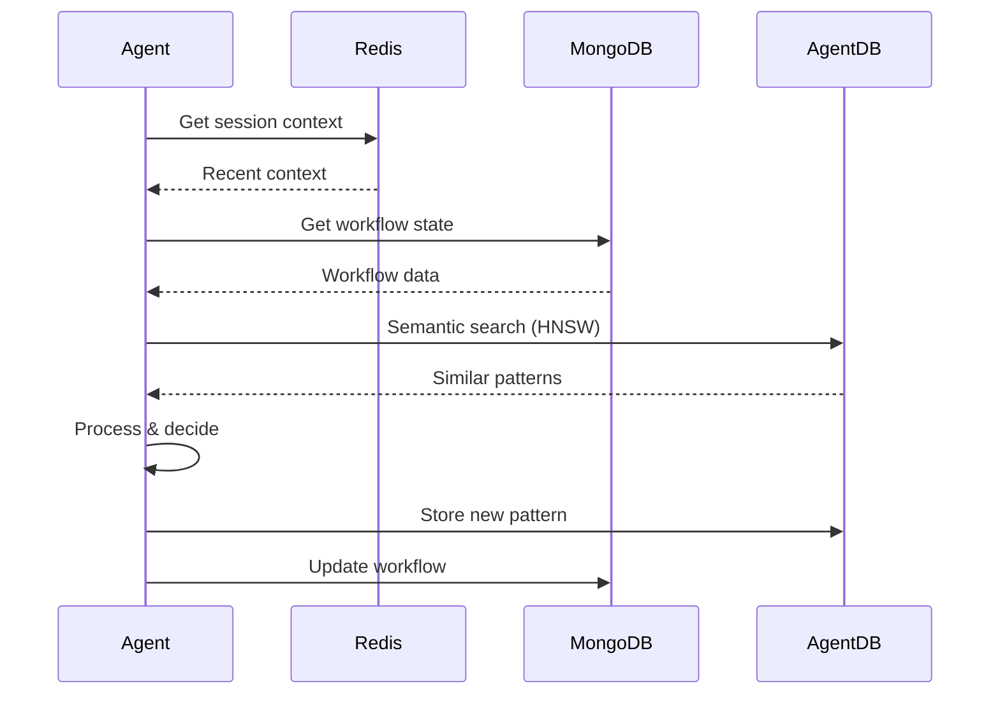

# Database Architecture - Project Nyra Orchestrator

## Overview

The Project Nyra orchestrator runs a comprehensive database infrastructure supporting all microservices. This document outlines the architecture, design decisions, and service mappings.

## Architecture Diagram

## Database Technologies

### PostgreSQL 16 (Alpine)

**Purpose**: Primary relational database for structured data

**Databases**:
- `nyra_main`: Core application data (users, properties, mortgage applications)
- `nyra_auth`: Authentication and authorization (sessions, tokens, permissions)
- `nyra_analytics`: Analytics and reporting data
- `infisical`: Secrets management backend

**Key Features**:
- ACID compliance
- Multi-database architecture with separate users per database
- Optimized for SSD with `random_page_cost = 1.1`
- Connection pooling ready (200 max connections)
- pg_stat_statements for query performance monitoring
- Extensions: uuid-ossp, pgcrypto, pg_trgm

**Resource Allocation**:
- CPU: 0.5-2.0 cores
- Memory: 512MB-2GB
- Storage: Persistent volumes with 90-day retention

### Redis 7 (Alpine)

**Purpose**: Cache layer and pub/sub messaging

**Key Features**:
- In-memory data structure store
- AOF + RDB persistence for durability
- LRU eviction policy with 512MB memory limit
- Sub-millisecond latency
- Pub/sub for real-time events
- Session storage

**Use Cases**:
- API response caching
- Session management
- Rate limiting counters
- Real-time pub/sub messaging
- Temporary data storage

**Resource Allocation**:
- CPU: 0.25-1.0 cores
- Memory: 256MB-768MB
- Storage: Persistent volumes with 7-day retention

### MongoDB 7

**Purpose**: Document store for unstructured/semi-structured data

**Databases**:
- `nyra`: Main document database
- `nyra_logs`: Application and audit logs
- `nyra_cache`: Cached document data

**Key Features**:
- Replica set configuration (single-node for dev, multi-node for prod)
- Flexible schema for evolving data models
- Capped collections for logs (1GB limit)
- TTL indexes for automatic data expiration
- BSON for efficient storage

**Collections**:
- `audit_logs`: System audit trail (capped, 1GB)
- `agent_memory`: AI agent context storage
- `workflows`: Workflow definitions and state
- `cache`: Application cache (24h TTL)
- `application_logs`: Application logs (capped, 2GB)

**Resource Allocation**:
- CPU: 0.25-1.5 cores
- Memory: 512MB-1.5GB
- Storage: Persistent volumes with 90-day retention

### AgentDB (Qdrant)

**Purpose**: Vector database for AI embeddings and semantic search

**Key Features**:
- HNSW indexing for fast similarity search (150x-12,500x faster than brute force)
- Supports high-dimensional vectors (768-1536 dimensions)
- Cosine similarity distance metric
- Quantization for 4x-8x memory reduction
- HTTP and gRPC APIs

**Collections**:
- `agent_memory`: AI agent memory (768-dimensional vectors)
- `patterns`: Learned patterns for ReasoningBank
- Custom collections per use case

**HNSW Parameters**:
- M: 16 (number of graph edges)
- ef_construct: 100 (construction quality)
- ef: 128 (search quality, adjustable per query)

**Resource Allocation**:
- CPU: 0.5-2.0 cores
- Memory: 512MB-2GB
- Storage: Persistent volumes with 90-day retention

## Service-to-Database Mapping

| Service | PostgreSQL | Redis | MongoDB | AgentDB |
|---------|-----------|-------|---------|---------|
| **RateHunter Landing** | nyra_main | ✓ | - | - |
| **Nyra Admin Panel** | nyra_main, nyra_auth | ✓ | nyra | - |
| **Quote API** | nyra_main | ✓ | - | - |
| **Auth Service** | nyra_auth | ✓ | - | - |
| **Analytics Service** | nyra_analytics | ✓ | nyra_logs | - |
| **AI Agents** | - | ✓ | agent_memory | agent_memory |
| **Claude Flow** | - | ✓ | workflows | patterns |
| **Infisical** | infisical | - | - | - |
| **Monitoring** | - | - | nyra_logs | - |

## Data Flow

### Read Path

### Write Path

### AI Agent Context Flow

## Backup Strategy

### PostgreSQL
- **Strategy**: pg_dump + WAL archiving
- **Frequency**: Daily full backup, continuous WAL archiving
- **Retention**: 90 days
- **Recovery**: Point-in-time recovery (PITR) capable

### Redis
- **Strategy**: AOF + RDB snapshots
- **Frequency**: RDB every 5-15 minutes, AOF every second
- **Retention**: 7 days
- **Recovery**: Restore from last AOF + RDB

### MongoDB
- **Strategy**: mongodump + oplog
- **Frequency**: Daily backup, continuous oplog
- **Retention**: 90 days
- **Recovery**: Point-in-time recovery with oplog replay

### AgentDB
- **Strategy**: Qdrant snapshots
- **Frequency**: Daily snapshots
- **Retention**: 30 days
- **Recovery**: Restore from snapshot

## Scaling Considerations

### Horizontal Scaling

**PostgreSQL**:
- Primary-replica replication for read scaling
- Connection pooling (PgBouncer) for connection management
- Partition tables by date for time-series data

**Redis**:
- Redis Cluster for horizontal scaling
- Sentinel for high availability
- Separate instances for cache vs. pub/sub

**MongoDB**:
- Sharding for horizontal data partitioning
- Multi-node replica set for high availability
- Read preference configuration

**AgentDB**:
- Qdrant cluster for distributed vector search
- Sharding by collection or vector space

### Vertical Scaling

- Increase memory for PostgreSQL shared_buffers
- Increase Redis maxmemory
- Increase MongoDB WiredTiger cache
- Increase AgentDB search threads

## Performance Optimization

### PostgreSQL
- Indexes on frequently queried columns
- EXPLAIN ANALYZE for query optimization
- Vacuum and analyze regularly
- Connection pooling via PgBouncer

### Redis
- Pipeline commands for batch operations
- Lua scripts for atomic operations
- Appropriate data structures (Hash vs. String)
- Memory optimization with compression

### MongoDB
- Compound indexes for common queries
- Projection to reduce data transfer
- Index intersection where applicable
- Aggregation pipeline optimization

### AgentDB
- Tune HNSW parameters (M, ef_construct)
- Use quantization for memory reduction
- Adjust ef parameter per query for quality/speed tradeoff
- Batch vector operations

## Monitoring Metrics

### Key Metrics to Monitor

**PostgreSQL**:
- Active connections
- Query latency (p50, p95, p99)
- Cache hit ratio
- Replication lag
- Disk I/O

**Redis**:
- Memory usage
- Eviction rate
- Hit/miss ratio
- Command latency
- Connected clients

**MongoDB**:
- Replica set status
- Oplog window
- Lock percentage
- Query execution time
- Connection count

**AgentDB**:
- Search latency
- Memory usage
- Collection size
- Query throughput
- Index status

## Security Architecture

### Network Security
- All databases on internal Docker network only
- No external exposure by default
- Cloudflare tunnel for secure external access
- mTLS between services (recommended for production)

### Authentication
- Strong password policies (min 32 characters)
- Separate users per service (principle of least privilege)
- API keys for AgentDB (optional)
- SSL/TLS for all connections in production

### Authorization
- Role-based access control (RBAC)
- Read-only users for analytics and reporting
- Service-specific database users
- Audit logging enabled

### Secrets Management
- Infisical for centralized secret management
- Environment variables for local development
- No secrets in version control
- Secret rotation every 90 days

## Disaster Recovery

### Recovery Time Objective (RTO)
- Target: 4 hours
- Critical databases restored first (PostgreSQL, MongoDB)
- Cache databases last (Redis can be rebuilt)

### Recovery Point Objective (RPO)
- Target: 1 hour
- WAL archiving for PostgreSQL (< 1 minute data loss)
- Oplog for MongoDB (< 1 minute data loss)
- AOF for Redis (< 1 second data loss)

### DR Procedure
1. Verify backup integrity
2. Restore PostgreSQL databases
3. Restore MongoDB databases
4. Restore Redis AOF/RDB
5. Restore AgentDB snapshots
6. Verify data consistency
7. Restart application services
8. Run smoke tests

## References

- [PostgreSQL Documentation](https://www.postgresql.org/docs/)
- [Redis Documentation](https://redis.io/documentation)
- [MongoDB Documentation](https://docs.mongodb.com/)
- [Qdrant Documentation](https://qdrant.tech/documentation/)
- [DATABASE-OPERATIONS.md](./DATABASE-OPERATIONS.md)
- [DATABASE-SECURITY.md](./DATABASE-SECURITY.md)
