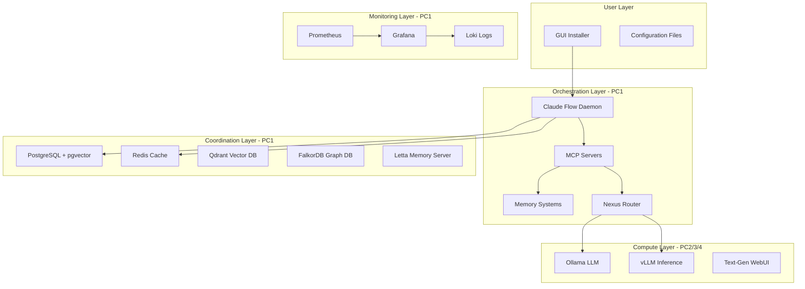
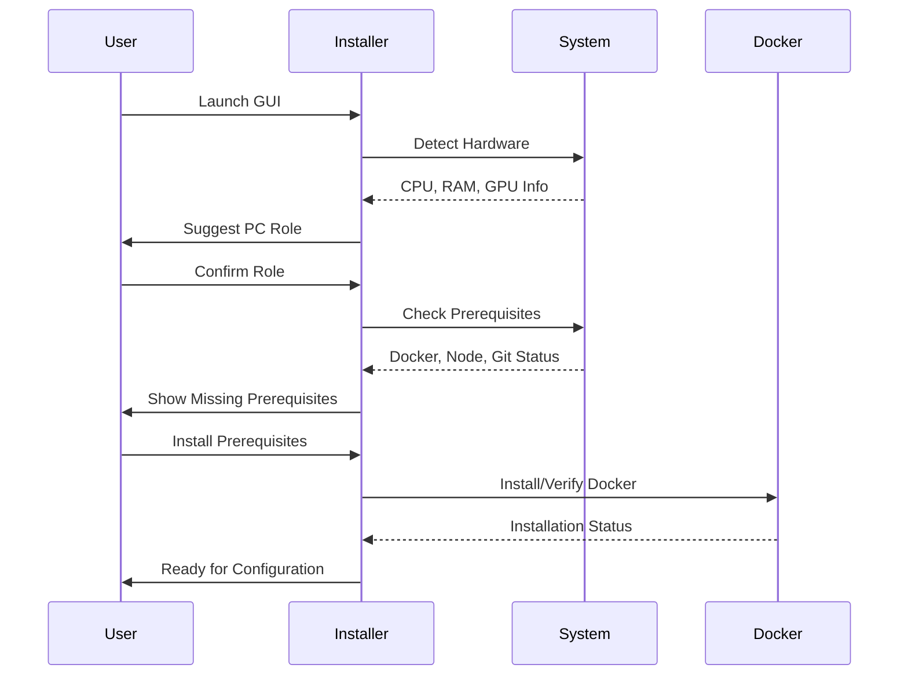
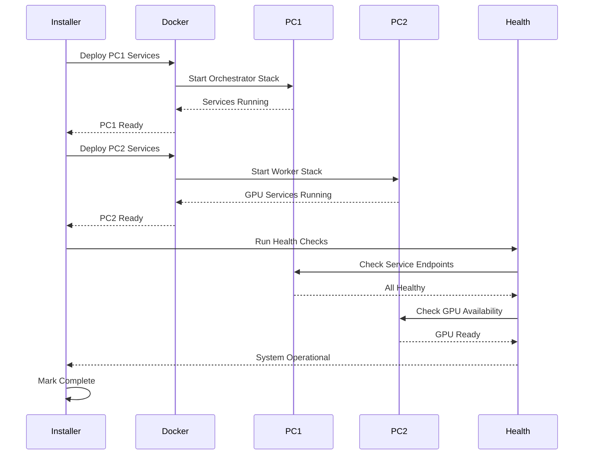
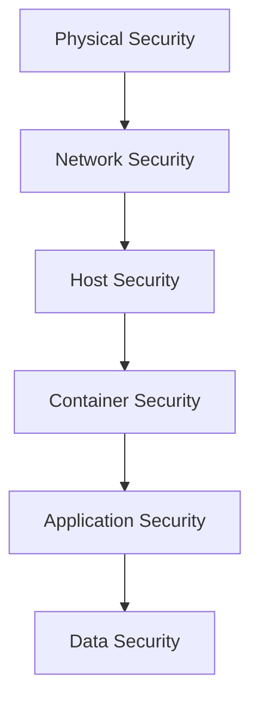
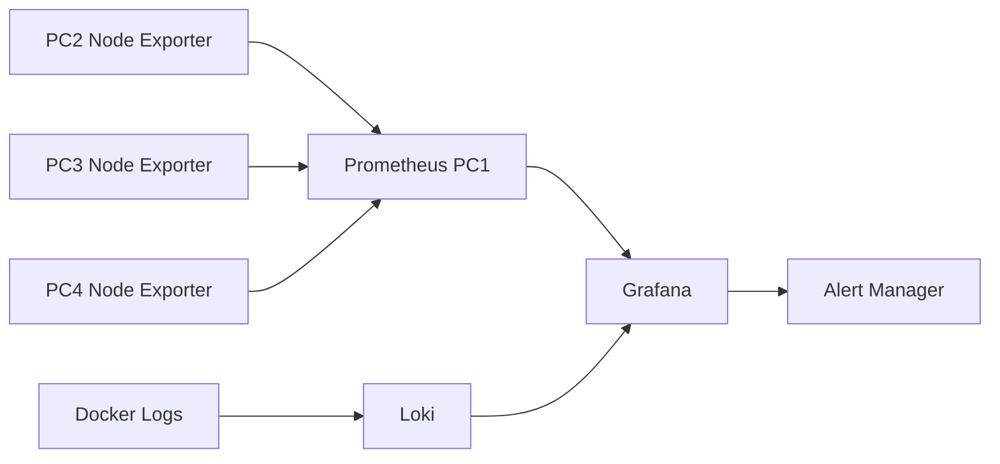

# Project Nyra Bootstrap Architecture

**Version**: 4.0.0
**Last Updated**: January 15, 2026
**Purpose**: Comprehensive architectural documentation for Project Nyra's 4-PC distributed bootstrap system

---

## 📋 Table of Contents

1. [Overview](#-overview)
2. [System Architecture](#-system-architecture)
3. [PC Roles and Distribution](#-pc-roles-and-distribution)
4. [Bootstrap Components](#-bootstrap-components)
5. [Installation Flow](#-installation-flow)
6. [Network Architecture](#-network-architecture)
7. [Service Distribution](#-service-distribution)
8. [Configuration Management](#-configuration-management)
9. [Security Architecture](#-security-architecture)
10. [Monitoring and Observability](#-monitoring-and-observability)

---

## 🎯 Overview

Project Nyra's bootstrap system is designed to automate the setup and configuration of a distributed 4-PC Windows 11 cluster optimized for AI/ML workloads and multi-agent orchestration.

### Key Design Principles

- **Automation First**: GUI-driven installer eliminates manual configuration
- **PC-Specific**: Each PC gets a tailored configuration based on its role and hardware
- **Network Isolated**: Static IPs + Tailscale VPN for secure communication
- **Service Distribution**: Optimal service placement across PCs based on resource requirements
- **Resilient**: Health checks, rollback capabilities, and disaster recovery

### Target Environment

```
Hardware Setup:
├── PC1: Minisforum UH680 (Orchestrator/Controller)
│   ├── CPU: Intel Core i7/i9
│   ├── RAM: 32GB
│   └── Storage: 1TB NVMe SSD
├── PC2: GPU Worker (RTX 4090 24GB)
├── PC3: GPU Worker (RTX 4090 24GB)
└── PC4: GPU Worker (RTX 3060 12GB)

Network Setup:
├── Static IPs: 10.0.0.1-4
├── Tailscale VPN: Mesh networking
└── DNS: Google DNS (8.8.8.8, 8.8.4.4)

Software Stack:
├── OS: Windows 11 Pro
├── Container Runtime: Docker Desktop 24.0+
├── Orchestration: Docker Compose
└── Languages: Node.js 20+, Python 3.11+
```

---

## 🏗️ System Architecture

### High-Level Architecture



### Component Distribution Strategy

| Layer | PC1 (Orchestrator) | PC2 (Worker) | PC3 (Worker) | PC4 (Worker) |
|-------|-------------------|--------------|--------------|--------------|
| **Orchestration** | Claude Flow, MCP Servers | - | - | - |
| **Data Storage** | PostgreSQL, Redis, Qdrant, FalkorDB | - | - | - |
| **Memory** | Letta, Graphiti, Mem0, AgentDB | - | - | - |
| **AI Inference** | LiteLLM Proxy | Ollama, vLLM | Ollama, vLLM | Ollama, vLLM |
| **Monitoring** | Prometheus, Grafana, Loki | Node Exporter | Node Exporter | Node Exporter |
| **Networking** | Tailscale Hub | Tailscale Client | Tailscale Client | Tailscale Client |

---

## 🖥️ PC Roles and Distribution

### PC1: Orchestrator Mini PC

**Primary Role**: Coordination, orchestration, and memory management

**Hardware Profile**:
- CPU: Intel Core i7/i9 (8+ cores)
- RAM: 32GB
- Storage: 1TB NVMe SSD
- Network: Gigabit Ethernet
- GPU: Integrated (no discrete GPU)

**Key Services**:
```yaml
Core Services:
  - postgres:15 (pgvector extension)
  - redis:7-alpine
  - qdrant/qdrant:latest
  - falkordb/falkordb:latest
  - litellm/litellm:main-latest

Memory Services:
  - letta/letta-server:latest
  - graphiti-mcp
  - mem0-mcp
  - agentdb

MCP Servers:
  - claude-flow-mcp
  - ruv-swarm-mcp
  - ruvector-mcp
  - filesystem-mcp
  - github-mcp

Monitoring:
  - prometheus:latest
  - grafana:latest
  - grafana/loki:latest
```

**Port Assignments**:
```
5432  - PostgreSQL
6379  - Redis
6333  - Qdrant HTTP
6334  - Qdrant gRPC
6380  - FalkorDB
8000  - Letta Server
4000  - LiteLLM Proxy
9090  - Prometheus
3000  - Grafana
3100  - Loki
```

**Resource Allocation**:
- Memory: PostgreSQL (4GB), Redis (2GB), Qdrant (4GB), Others (18GB)
- CPU: Distributed across all services
- Disk: 500GB for databases and logs

---

### PC2: Worker - RTX 4090 (Primary AI Worker)

**Primary Role**: Complex reasoning, multi-step planning, large context processing

**Hardware Profile**:
- CPU: High-performance processor
- RAM: 64GB+
- Storage: 2TB NVMe SSD
- GPU: NVIDIA RTX 4090 (24GB VRAM)

**Key Services**:
```yaml
AI Inference:
  - ollama/ollama:latest (CUDA enabled)
  - vllm/vllm-openai:latest
  - text-generation-webui

Monitoring:
  - prometheus/node-exporter
```

**GPU Allocation**:
```yaml
Primary Models:
  - deepseek-r1:70b (reasoning)
  - llama3.3:70b (large context)
  - mixtral:8x7b (multi-task)

Workload Priority:
  1. Strategic planning
  2. Architecture design
  3. Code review with large context
  4. Research synthesis
```

**Port Assignments**:
```
11434 - Ollama API
8001  - vLLM API
7860  - Text-Gen WebUI
9100  - Node Exporter
```

**Resource Allocation**:
- VRAM: 24GB (full GPU utilization)
- RAM: 32GB for model loading
- CPU: 16 cores for preprocessing
- Disk: 1TB for model storage

---

### PC3: Worker - RTX 4090 (Analysis Worker)

**Primary Role**: Code analysis, testing, data processing

**Hardware Profile**:
- CPU: High-performance processor
- RAM: 64GB+
- Storage: 2TB NVMe SSD
- GPU: NVIDIA RTX 4090 (24GB VRAM)

**Key Services**:
```yaml
AI Inference:
  - ollama/ollama:latest (CUDA enabled)
  - vllm/vllm-openai:latest

Monitoring:
  - prometheus/node-exporter
```

**GPU Allocation**:
```yaml
Primary Models:
  - codellama:34b (code analysis)
  - deepseek-coder-v2:16b (code generation)
  - phi-3:14b (fast inference)

Workload Priority:
  1. Code analysis and review
  2. Test generation
  3. Data transformation
  4. Security scanning
```

**Port Assignments**:
```
11435 - Ollama API (different port than PC2)
8002  - vLLM API
9100  - Node Exporter
```

---

### PC4: Worker - RTX 3060 (Coding Worker)

**Primary Role**: Code generation, editing, refactoring

**Hardware Profile**:
- CPU: Mid-range processor
- RAM: 32GB
- Storage: 1TB NVMe SSD
- GPU: NVIDIA RTX 3060 (12GB VRAM)

**Key Services**:
```yaml
AI Inference:
  - ollama/ollama:latest (CUDA enabled)

Monitoring:
  - prometheus/node-exporter
```

**GPU Allocation**:
```yaml
Primary Models:
  - deepseek-coder:6.7b (fast coding)
  - codellama:13b (code generation)
  - starcoder:7b (code completion)

Workload Priority:
  1. Code generation
  2. Bug fixes
  3. Refactoring
  4. Documentation generation
```

**Port Assignments**:
```
11436 - Ollama API
9100  - Node Exporter
```

**Resource Allocation**:
- VRAM: 12GB (optimized for smaller models)
- RAM: 16GB for model loading
- CPU: 8 cores for preprocessing
- Disk: 500GB for model storage

---

## 🧩 Bootstrap Components

### GUI Installer

**Technology Stack**:
- Framework: React 18 + TypeScript
- Bundler: Vite
- State Management: Zustand
- UI Components: Tailwind CSS
- IPC: Custom event system

**Installation Phases**:


**Phase Descriptions**:

1. **PC Selection**: Detect hardware, suggest role (orchestrator vs worker)
2. **Environment Config**: Select dev/staging/production environment
3. **Component Selection**: Choose services to install (Claude Code, Docker, etc.)
4. **MCP Servers**: Configure MCP servers and tools
5. **Docker Setup**: Install/configure Docker Desktop
6. **Configuration**: Edit .env files and settings
7. **Shim Generation**: Create MCP server wrapper scripts
8. **Deployment**: Deploy services via Docker Compose
9. **Health Check**: Validate service health and connectivity
10. **Complete**: Summary and next steps

---

### Configuration Templates

**Location**: `bootstrap/configs/`

**Structure**:
```
configs/
├── claude-code/
│   ├── .mcp.json                    # MCP server configuration
│   └── settings.json                # Claude Code settings
├── claude-desktop/
│   └── config.json                  # Claude Desktop MCP config
├── claude-flow/
│   ├── .env.claude-flow             # Environment variables
│   └── .claude/settings.json        # Flow settings
├── docker/
│   ├── daemon.json                  # Docker daemon config
│   └── compose/
│       ├── pc1-orchestrator.yml     # PC1 services
│       ├── pc2-worker-4090.yml      # PC2 services
│       ├── pc3-worker-4090.yml      # PC3 services
│       └── pc4-worker-3060.yml      # PC4 services
├── wsl/
│   └── .wslconfig                   # WSL configuration
├── infisical/
│   └── .env.infisical               # Secrets management
├── gitea/
│   ├── app.ini                      # Gitea config
│   └── docker-compose.yml           # Gitea deployment
└── nvidia/
    └── daemon.json                  # NVIDIA Container Toolkit
```

---

## 🔄 Installation Flow

### Pre-Installation Phase



### Configuration Phase

```yaml
Steps:
  1. Environment Selection:
     - Development: Local testing
     - Staging: Pre-production
     - Production: Live deployment

  2. Component Selection:
     - Required: Claude Code, Docker
     - Optional: Claude Desktop, Claude Flow, WSL, Infisical, Gitea
     - GPU Workers: NVIDIA Container Toolkit

  3. MCP Server Configuration:
     - Select MCP servers to enable
     - Configure server options
     - Set API keys and credentials

  4. Docker Configuration:
     - Verify Docker installation
     - Configure Docker daemon
     - Set up Docker Compose

  5. Configuration Editing:
     - Edit .env files
     - Configure MCP settings
     - Set up secrets management

  6. Shim Generation:
     - Create MCP server wrappers
     - Generate startup scripts
     - Configure environment paths
```

### Deployment Phase



---

## 🌐 Network Architecture

### Physical Network Topology

```
Internet Router (192.168.1.1)
        |
   Switch/Hub
        |
    +---+---+---+---+
    |   |   |   |   |
   PC1 PC2 PC3 PC4 NAS
  .101.102.103.104.105

Static IP Configuration:
├── PC1 (Orchestrator): 192.168.1.101 / 10.0.0.1 (Tailscale)
├── PC2 (Worker 4090):  192.168.1.102 / 10.0.0.2 (Tailscale)
├── PC3 (Worker 4090):  192.168.1.103 / 10.0.0.3 (Tailscale)
└── PC4 (Worker 3060):  192.168.1.104 / 10.0.0.4 (Tailscale)
```

### Docker Network Architecture

```yaml
Docker Networks:
  nyra-network:
    driver: bridge (single PC) / overlay (multi-PC)
    subnet: 172.20.0.0/16
    ipam:
      - PC1 Services: 172.20.0.10-99
      - PC2 Services: 172.20.0.100-149
      - PC3 Services: 172.20.0.150-199
      - PC4 Services: 172.20.0.200-249

  nyra-monitoring:
    driver: bridge
    subnet: 172.21.0.0/16

  nyra-storage:
    driver: bridge
    subnet: 172.22.0.0/16
```

### Tailscale VPN Mesh

```
Tailscale Network: 100.x.x.x/10

PC1 (10.0.0.1) <---> Tailscale Coordination Server
     |                        |
     +------ PC2 (10.0.0.2) --+
     |                        |
     +------ PC3 (10.0.0.3) --+
     |                        |
     +------ PC4 (10.0.0.4) --+

Advantages:
- End-to-end encryption
- Zero-configuration NAT traversal
- Automatic peer discovery
- ACL-based access control
- Remote access capability
```

---

## 📦 Service Distribution

For detailed Docker Compose configurations, see:
- **[SETUP-ORCHESTRATOR.md](SETUP-ORCHESTRATOR.md)** - PC1 service stack
- **[SETUP-WORKER-RTX4090.md](SETUP-WORKER-RTX4090.md)** - PC2/3 service stack
- **[SETUP-WORKER-RTX3060.md](SETUP-WORKER-RTX3060.md)** - PC4 service stack

---

## ⚙️ Configuration Management

### Environment Variable Strategy

**Hierarchy**:
```
1. System Environment Variables (Windows)
2. .env files (PC-specific)
3. Docker Compose environment sections
4. Infisical secrets (production)
```

### Secrets Management with Infisical

**Setup**:
```bash
# Install Infisical CLI
winget install infisical

# Login
infisical login

# Pull secrets for environment
infisical export --env=production --format=dotenv > .env.production

# Inject secrets into Docker Compose
infisical run --env=production -- docker compose up -d
```

---

## 🔒 Security Architecture

### Defense in Depth Strategy



### Security Layers

#### 1. Network Security
```yaml
Measures:
  - Tailscale VPN encryption (WireGuard)
  - Firewall rules (Windows Defender + Docker iptables)
  - Private Docker networks (no internet-facing services)
  - TLS for all inter-service communication

Implementation:
  - Tailscale: End-to-end encryption
  - Docker networks: Bridge mode with isolation
  - Services: Only expose to localhost or Tailscale
```

#### 2. Container Security
```yaml
Measures:
  - Non-root users in containers
  - Read-only root filesystems
  - Seccomp/AppArmor profiles
  - Resource limits (CPU, memory)
  - Vulnerability scanning

Implementation:
  - Use official images only
  - Scan with Trivy/Grype
  - Apply least privilege principle
  - Regular image updates
```

---

## 📊 Monitoring and Observability

### Monitoring Stack Architecture



### Metrics Collection

**Prometheus Targets**:
```yaml
# prometheus.yml
global:
  scrape_interval: 15s
  evaluation_interval: 15s

scrape_configs:
  # PC1 Services
  - job_name: 'postgres'
    static_configs:
      - targets: ['172.20.0.10:9187']

  - job_name: 'redis'
    static_configs:
      - targets: ['172.20.0.11:9121']

  # PC2 GPU Worker
  - job_name: 'pc2-node'
    static_configs:
      - targets: ['10.0.0.2:9100']

  - job_name: 'pc2-ollama'
    static_configs:
      - targets: ['10.0.0.2:11434']

  # PC3 GPU Worker
  - job_name: 'pc3-node'
    static_configs:
      - targets: ['10.0.0.3:9100']

  # PC4 GPU Worker
  - job_name: 'pc4-node'
    static_configs:
      - targets: ['10.0.0.4:9100']
```

### Grafana Dashboards

**Pre-configured Dashboards**:
1. **System Overview**: CPU, memory, disk, network for all PCs
2. **GPU Monitoring**: GPU utilization, VRAM, temperature per worker
3. **Service Health**: Uptime, response times, error rates
4. **Docker Metrics**: Container resource usage, network I/O
5. **AI Workloads**: Model inference latency, throughput, queue depth
6. **Network Performance**: Inter-PC bandwidth, latency, packet loss

**Dashboard JSON Location**: `bootstrap/configs/grafana/dashboards/`

---

## 🚀 Deployment Workflows

### Initial Deployment

```bash
# Step 1: Launch GUI Installer
cd bootstrap/installer
npm install
npm run dev

# Step 2: Follow Wizard
# - Select PC role
# - Configure network
# - Choose components
# - Set up MCP servers
# - Deploy services

# Step 3: Verify Installation
docker ps
docker compose logs -f

# Step 4: Access Services
# Grafana: http://localhost:3000
# Prometheus: http://localhost:9090
# Ollama: http://10.0.0.2:11434 (PC2)
```

### Service Updates

```bash
# Update single service
docker compose pull <service-name>
docker compose up -d <service-name>

# Update all services
docker compose pull
docker compose up -d

# View logs
docker compose logs -f <service-name>
```

### Rollback Procedure

```bash
# Automated rollback via installer
# GUI Installer -> Rollback -> Select checkpoint

# Manual rollback
docker compose down
docker compose -f docker-compose.backup.yml up -d
```

---

## 📚 Additional Resources

- **[SETUP-ORCHESTRATOR.md](SETUP-ORCHESTRATOR.md)** - PC1 setup guide
- **[SETUP-WORKER-RTX4090.md](SETUP-WORKER-RTX4090.md)** - PC2/3 setup guide
- **[SETUP-WORKER-RTX3060.md](SETUP-WORKER-RTX3060.md)** - PC4 setup guide
- **[INSTALLER-GUIDE.md](INSTALLER-GUIDE.md)** - GUI installer walkthrough
- **[TROUBLESHOOTING.md](TROUBLESHOOTING.md)** - Common issues and solutions
- **[STRUCTURE.md](STRUCTURE.md)** - Directory structure reference

---

**Last Updated**: January 15, 2026
**Maintainer**: Project Nyra Team
