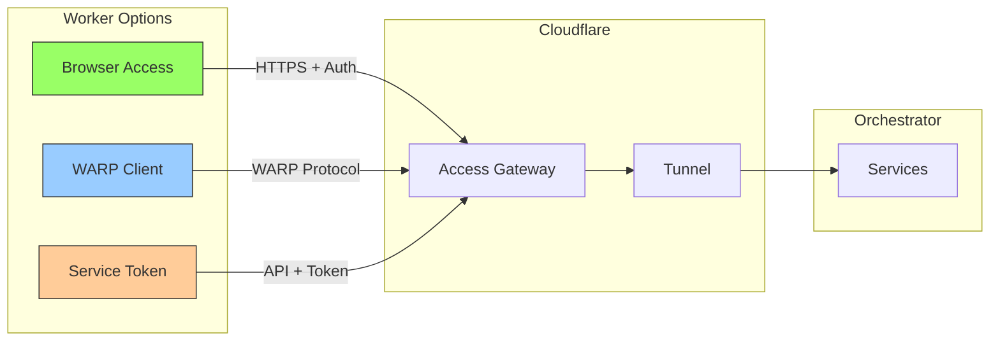
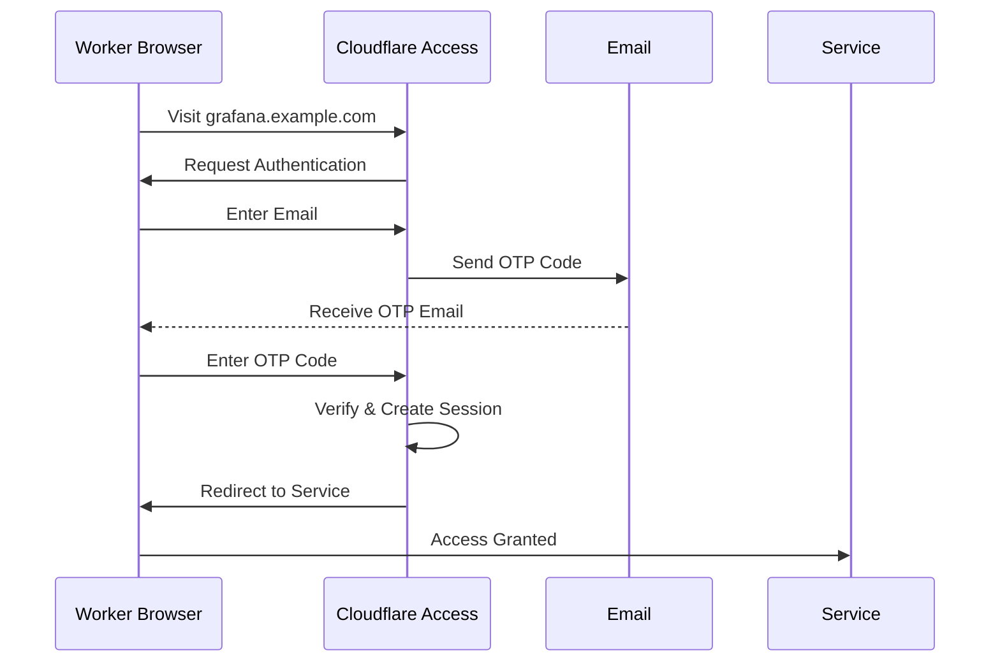

# Cloudflare Tunnel Setup - Workers

**Last Updated**: 2026-01-15
**Setup Time**: ~10 minutes per worker
**Difficulty**: Easy

---

## 📋 Table of Contents

1. [Overview](#-overview)
2. [Prerequisites](#-prerequisites)
3. [Setup Options](#-setup-options)
4. [Option A: Browser-Based Access](#-option-a-browser-based-access-recommended)
5. [Option B: cloudflared WARP Client](#-option-b-cloudflared-warp-client)
6. [Option C: Service Token Access](#-option-c-service-token-access-cicd)
7. [Access Configuration](#-access-configuration)
8. [Verification](#-verification)
9. [Troubleshooting](#-troubleshooting)

---

## 🌐 Overview

Worker laptops can access orchestrator services through Cloudflare tunnels in three ways:



### When to Use Each Option

| Option | Use Case | Pros | Cons |
|--------|----------|------|------|
| **Browser** | General development, UI access | Simple, no install | Browser-only |
| **WARP Client** | CLI tools, full network access | Seamless, all apps | Requires installation |
| **Service Token** | CI/CD, automation, APIs | Programmatic access | Token management |

---

## ✅ Prerequisites

- [ ] Orchestrator tunnel configured and running
- [ ] Worker laptop with network access
- [ ] Email address authorized in Access policies
- [ ] (Optional) Admin access to Cloudflare dashboard

---

## 🔄 Setup Options

## 📱 Option A: Browser-Based Access (Recommended)

**Best for**: General development, accessing web UIs (Grafana, n8n, etc.)

### Step 1: Test Access

**From worker laptop**, open browser:
```
https://grafana.example.com
https://n8n.example.com
https://secrets.example.com
```

### Step 2: Authenticate

**First-time access**:
1. Cloudflare Access login page appears
2. Enter your email (must be in allowlist)
3. Check email for one-time PIN
4. Enter PIN code
5. Access granted for 24 hours (configurable)



### Step 3: Session Management

**Session duration**: Configured in Access policy (default: 24 hours)

**Extend session**:
- Sessions auto-renew on activity
- Manual refresh: Re-visit service URL

**Revoke session**:
```
https://example.cloudflareaccess.com/cdn-cgi/access/logout
```

### Step 4: Bookmark Services

**Create browser bookmarks**:
```
Grafana:   https://grafana.example.com
n8n:       https://n8n.example.com
Infisical: https://secrets.example.com
API:       https://api.example.com
```

### Step 5: Developer Tools Access

**API testing from browser**:
```javascript
// From browser console (after authentication)
fetch('https://api.example.com/health')
  .then(r => r.json())
  .then(console.log)

// Response: {"status": "ok"}
```

---

## 🌐 Option B: cloudflared WARP Client

**Best for**: Full network access, CLI tools, seamless application integration

### Why Use WARP?

- Access services via CLI tools (curl, httpie, etc.)
- No browser required for API calls
- Seamless integration with development tools
- Single authentication for all services

### Step 1: Install WARP Client

#### Windows

**Download and Install**:
```powershell
# Download Cloudflare WARP
# Visit: https://1.1.1.1/

# Or via winget
winget install Cloudflare.Warp
```

#### macOS

```bash
# Download from https://1.1.1.1/
# Or via Homebrew
brew install cloudflare-warp
```

#### Linux (WSL2 or Native)

```bash
# Add Cloudflare repository
curl -fsSL https://pkg.cloudflareclient.com/pubkey.gpg | sudo gpg --yes --dearmor --output /usr/share/keyrings/cloudflare-warp-archive-keyring.gpg

echo "deb [arch=amd64 signed-by=/usr/share/keyrings/cloudflare-warp-archive-keyring.gpg] https://pkg.cloudflareclient.com/ $(lsb_release -cs) main" | sudo tee /etc/apt/sources.list.d/cloudflare-client.list

# Install
sudo apt update
sudo apt install cloudflare-warp

# Verify
warp-cli --version
```

### Step 2: Register WARP

```bash
# Register device
warp-cli register

# Expected output:
# Success. You are now registered.
```

### Step 3: Configure Zero Trust

```bash
# Set your Zero Trust organization
warp-cli teams-enroll <YOUR-TEAM-NAME>

# Find your team name:
# Dashboard → Zero Trust → Settings → Custom Pages
# Team domain: <YOUR-TEAM-NAME>.cloudflareaccess.com
```

**Interactive enrollment**:
1. Browser opens to Cloudflare Access
2. Authenticate with email + OTP
3. Device registered to Zero Trust
4. WARP client shows "Connected"

### Step 4: Connect WARP

```bash
# Connect to WARP
warp-cli connect

# Check status
warp-cli status

# Expected output:
# Status: Connected
# Account type: Team
# Network: WARP
```

### Step 5: Test Access

```bash
# Test from command line (no browser needed!)
curl https://grafana.example.com
curl https://api.example.com/health

# Use in scripts
python my_script.py  # Automatically routes through WARP

# Use with any CLI tool
http https://n8n.example.com/api/v1/workflows
```

### Step 6: WARP Settings

```bash
# Disconnect
warp-cli disconnect

# Check connection mode
warp-cli settings

# Enable/disable specific features
warp-cli set-mode warp  # Full VPN mode
warp-cli set-mode proxy # Proxy mode only

# Exclude routes (if needed)
warp-cli add-exclude-route 10.0.0.0/24
```

---

## 🔑 Option C: Service Token Access (CI/CD)

**Best for**: Automated scripts, CI/CD pipelines, programmatic access

### Step 1: Create Service Token

**In Cloudflare Dashboard**:
```
Zero Trust → Access → Service Auth → Service Tokens
→ Create Service Token
```

**Configure**:
```
Name: Worker Laptop - RTX 5090
Duration: 1 year
```

**Save credentials** (shown only once):
```
Client ID: abc123def456...
Client Secret: xyz789uvw456...
```

### Step 2: Store Token Securely

**Option 1: Environment Variables**

```bash
# Add to ~/.bashrc or ~/.zshrc
export CF_ACCESS_CLIENT_ID="abc123def456..."
export CF_ACCESS_CLIENT_SECRET="xyz789uvw456..."

# Reload shell
source ~/.bashrc
```

**Option 2: .env File**

```bash
# Create .env file (add to .gitignore!)
cat > ~/nyra/.env.cloudflare << 'EOF'
CF_ACCESS_CLIENT_ID=abc123def456...
CF_ACCESS_CLIENT_SECRET=xyz789uvw456...
EOF

# Secure permissions
chmod 600 ~/nyra/.env.cloudflare

# Load in scripts
source ~/nyra/.env.cloudflare
```

**Option 3: Secret Manager** (Recommended for CI/CD)

```yaml
# GitHub Actions example
- name: Access Nyra API
  env:
    CF_CLIENT_ID: ${{ secrets.CF_CLIENT_ID }}
    CF_CLIENT_SECRET: ${{ secrets.CF_CLIENT_SECRET }}
```

### Step 3: Use Token in Requests

**curl Example**:
```bash
curl -H "CF-Access-Client-Id: $CF_ACCESS_CLIENT_ID" \
     -H "CF-Access-Client-Secret: $CF_ACCESS_CLIENT_SECRET" \
     https://api.example.com/health
```

**Python Example**:
```python
import os
import requests

headers = {
    'CF-Access-Client-Id': os.environ['CF_ACCESS_CLIENT_ID'],
    'CF-Access-Client-Secret': os.environ['CF_ACCESS_CLIENT_SECRET'],
}

response = requests.get('https://api.example.com/health', headers=headers)
print(response.json())
```

**JavaScript/Node.js Example**:
```javascript
const fetch = require('node-fetch');

const headers = {
  'CF-Access-Client-Id': process.env.CF_ACCESS_CLIENT_ID,
  'CF-Access-Client-Secret': process.env.CF_ACCESS_CLIENT_SECRET,
};

fetch('https://api.example.com/health', { headers })
  .then(r => r.json())
  .then(console.log);
```

### Step 4: Wrapper Script (Optional)

Create helper script for easy access:

```bash
# ~/nyra/scripts/cf-curl.sh
#!/bin/bash

source ~/nyra/.env.cloudflare

curl -H "CF-Access-Client-Id: $CF_ACCESS_CLIENT_ID" \
     -H "CF-Access-Client-Secret: $CF_ACCESS_CLIENT_SECRET" \
     "$@"
```

**Usage**:
```bash
chmod +x ~/nyra/scripts/cf-curl.sh

# Use like curl
./cf-curl.sh https://api.example.com/health
./cf-curl.sh -X POST https://api.example.com/quotes -d '{"amount":500000}'
```

### Step 5: Token Rotation

**Best practice**: Rotate tokens every 90 days

```bash
# 1. Create new token in dashboard
# 2. Update environment variables
# 3. Test with new token
# 4. Revoke old token
```

**Automated rotation script**:
```bash
# ~/nyra/scripts/rotate-cf-token.sh
#!/bin/bash
# TODO: Implement automated token rotation
# - Call Cloudflare API to create new token
# - Update .env file
# - Notify team
# - Schedule old token revocation
```

---

## 🔧 Access Configuration

### Configure Access for Each Worker

**In Cloudflare Dashboard**:
```
Zero Trust → Access → Applications → Nyra Admin Services
→ Policies → Add Rule
```

**Add Worker Email**:
```yaml
Rule Name: Worker Laptop 1
Action: Allow
Include:
  - Email: developer1@example.com
```

**Or use Email Domain**:
```yaml
Rule Name: Company Employees
Action: Allow
Include:
  - Email Domain: example.com
```

### Device Posture (Optional - Paid Feature)

**Enhanced security** for sensitive services:

```
Zero Trust → Settings → Device Posture
→ Add Posture Check
```

**Checks**:
- OS version requirements
- Firewall enabled
- Disk encryption enabled
- Antivirus running

**Apply to policy**:
```yaml
Rule Name: Admin with Device Check
Action: Allow
Include:
  - Email: admin@example.com
Require:
  - Device Posture: Secure Device
```

---

## ✅ Verification

### Test Each Access Method

#### Browser Access Test

```bash
# Open browser and visit:
https://grafana.example.com

# Expected flow:
# 1. Cloudflare Access login
# 2. Email OTP authentication
# 3. Redirect to Grafana
# 4. Service loads
```

#### WARP Client Test

```bash
# Check WARP status
warp-cli status
# Should show: Connected

# Test CLI access
curl https://api.example.com/health
# Should return: {"status":"ok"} without browser authentication

# Test from Python
python -c "import requests; print(requests.get('https://api.example.com/health').json())"
```

#### Service Token Test

```bash
# Set environment variables
export CF_ACCESS_CLIENT_ID="your-client-id"
export CF_ACCESS_CLIENT_SECRET="your-client-secret"

# Test request
curl -H "CF-Access-Client-Id: $CF_ACCESS_CLIENT_ID" \
     -H "CF-Access-Client-Secret: $CF_ACCESS_CLIENT_SECRET" \
     https://api.example.com/health

# Should return: {"status":"ok"}
```

### Common Test Commands

```bash
# Test DNS resolution
nslookup grafana.example.com 1.1.1.1

# Test HTTPS
curl -I https://grafana.example.com

# Test latency
ping grafana.example.com

# Test throughput
time curl -o /dev/null https://grafana.example.com
```

---

## 🔍 Troubleshooting

### Browser Access Issues

**Problem**: "Access Denied" or "You don't have access"

**Solutions**:
1. Check email is in allowlist (Access policy)
2. Try incognito/private browsing
3. Clear browser cache and cookies
4. Check Access logs in dashboard

```
Zero Trust → Logs → Access
→ Filter by application
→ Look for blocked requests with your email
```

**Problem**: "Too many redirects"

**Solutions**:
1. Clear cookies for `*.cloudflareaccess.com`
2. Check application URL matches DNS
3. Verify SSL/TLS mode (should be "Full" or "Full (strict)")

### WARP Client Issues

**Problem**: WARP stuck on "Connecting"

**Solutions**:
```bash
# Disconnect and reconnect
warp-cli disconnect
sleep 5
warp-cli connect

# Reset WARP
warp-cli reset

# Re-register
warp-cli delete
warp-cli register
warp-cli teams-enroll <YOUR-TEAM>
```

**Problem**: "Team enrollment failed"

**Solutions**:
1. Verify team name is correct (check dashboard)
2. Ensure email is authorized in policies
3. Try enrolling from browser first
4. Check network connectivity

### Service Token Issues

**Problem**: "Invalid client credentials"

**Solutions**:
1. Verify `CF_ACCESS_CLIENT_ID` is correct
2. Verify `CF_ACCESS_CLIENT_SECRET` is correct
3. Check token hasn't expired
4. Ensure token has access to application

**Test token validity**:
```bash
# Validate token (will return 200 if valid)
curl -I -H "CF-Access-Client-Id: $CF_ACCESS_CLIENT_ID" \
        -H "CF-Access-Client-Secret: $CF_ACCESS_CLIENT_SECRET" \
        https://api.example.com/health
```

**Problem**: "Rate limited"

**Solution**: Service tokens share rate limits. Consider:
1. Creating separate tokens per use case
2. Implementing request caching
3. Increasing rate limits in policy

---

## 📊 Usage Monitoring

### View Access Logs

```
Dashboard → Zero Trust → Logs → Access
```

**Filter options**:
- Application name
- User email
- Action (allow/deny)
- Time range

### Audit Token Usage

```
Dashboard → Zero Trust → Access → Service Auth → Service Tokens
→ View usage stats for each token
```

**Monitor**:
- Request count
- Last used timestamp
- Associated applications

---

## 🎯 Next Steps

1. **Test all access methods** from your worker laptop
2. **Bookmark services** for quick access
3. **Setup development environment** with WARP for seamless CLI access
4. **Configure service tokens** for CI/CD pipelines
5. **Review troubleshooting guide** for common issues

---

## 📚 Related Documentation

- **[Overview](./CLOUDFLARE-TUNNELS.md)** - Architecture and benefits
- **[Orchestrator Setup](./CLOUDFLARE-SETUP-ORCHESTRATOR.md)** - Tunnel configuration
- **[Troubleshooting](./CLOUDFLARE-TROUBLESHOOTING.md)** - Common issues and solutions

---

**Your worker laptop is now configured for secure remote access!** 🎉
