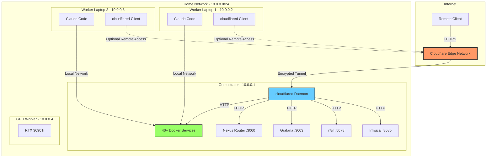
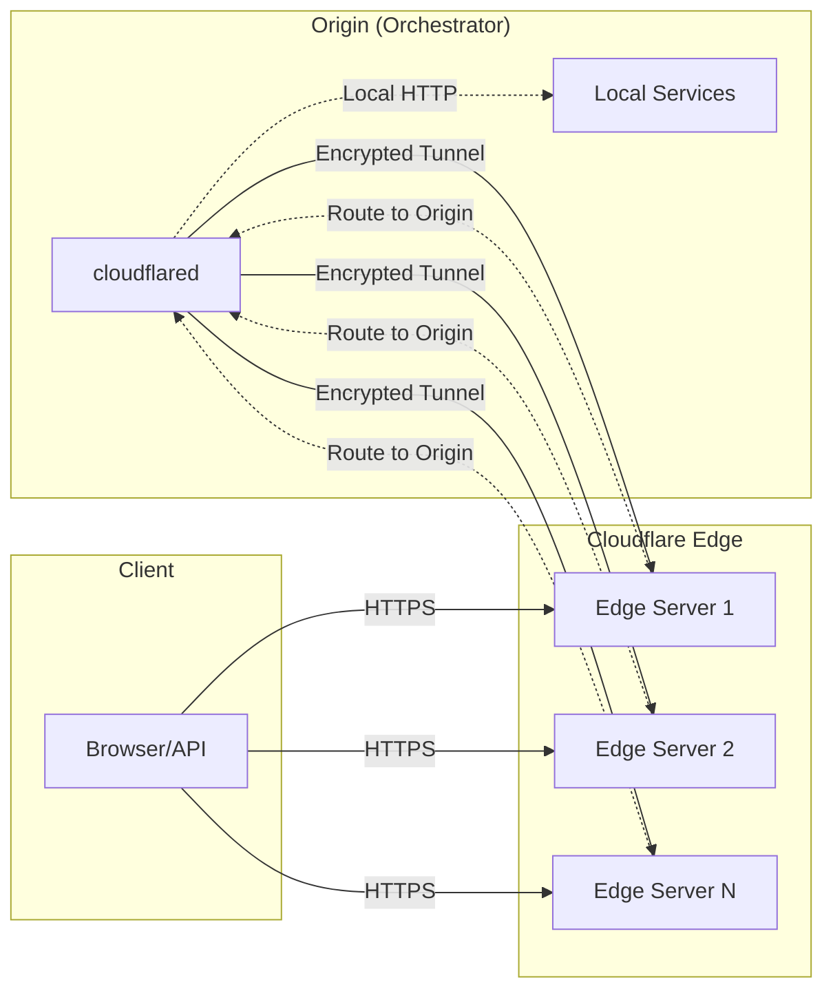
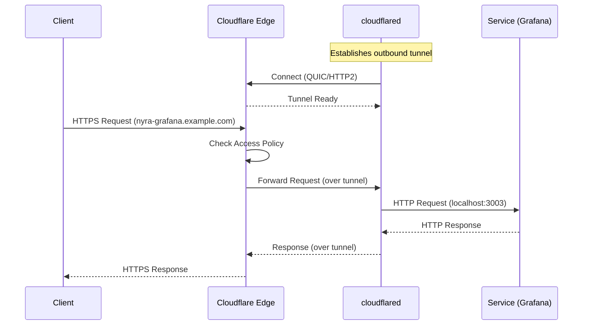
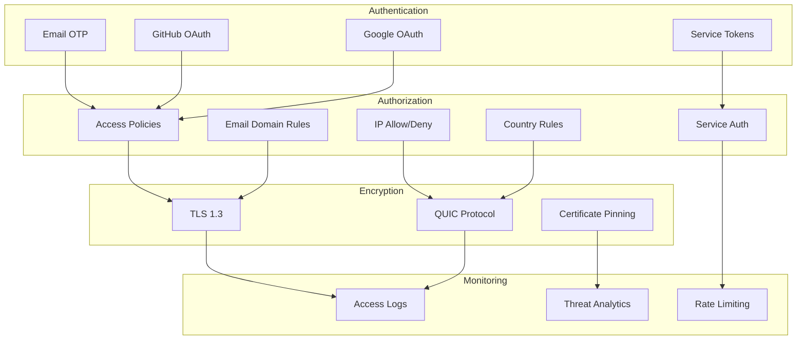
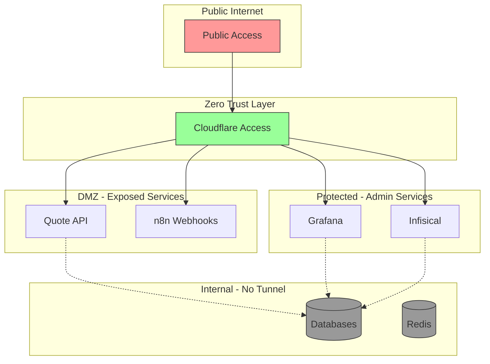
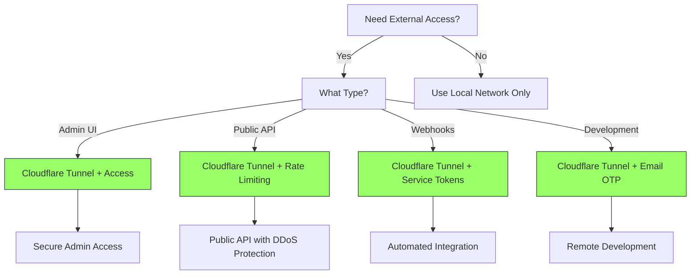

# Cloudflare Tunnels for Project Nyra

**Last Updated**: 2026-01-15
**Version**: 1.0.0
**Status**: Production-Ready

---

## 📋 Table of Contents

1. [Overview](#-overview)
2. [Architecture](#-architecture)
3. [Benefits](#-benefits)
4. [Security Model](#-security-model)
5. [Cost Considerations](#-cost-considerations)
6. [Getting Started](#-getting-started)

---

## 🌐 Overview

Cloudflare Tunnels (formerly Argo Tunnel) provide secure, outbound-only connections from your infrastructure to Cloudflare's edge network, exposing your services to the internet without opening inbound firewall ports or exposing public IP addresses.

### What is Cloudflare Tunnel?

Cloudflare Tunnel creates an encrypted tunnel between your origin server and Cloudflare's global network. All traffic is routed through Cloudflare's edge, providing:

- **Zero Trust Access** - No public IP exposure
- **DDoS Protection** - Built-in Cloudflare protection
- **SSL/TLS Termination** - Automatic HTTPS
- **Access Control** - Identity-based policies
- **Load Balancing** - Multiple origins
- **Traffic Analytics** - Real-time monitoring

### Use Cases for Project Nyra

1. **Remote Development Access** - Secure access to orchestrator from anywhere
2. **Service Exposure** - Expose specific services (Grafana, n8n, etc.)
3. **Multi-Worker Coordination** - Workers connect securely from any network
4. **External API Access** - Quote API, CRM endpoints
5. **Demo/Staging Environments** - Share work-in-progress

---

## 🏗️ Architecture

### Network Topology with Cloudflare Tunnels



### Tunnel Architecture



### Tunnel Connection Flow



---

## ✨ Benefits

### Security Benefits

| Feature | Description | Impact |
|---------|-------------|--------|
| **Zero Inbound Ports** | No firewall rules needed | Eliminates port scan/exploit risk |
| **DDoS Protection** | Cloudflare's 150+ Tbps network | Automatic mitigation at edge |
| **SSL/TLS Encryption** | End-to-end encryption | Protected data in transit |
| **Access Policies** | Identity-based access control | Granular permission management |
| **IP Masking** | Origin IP never exposed | Prevents direct attacks |
| **Certificate Management** | Automatic SSL renewal | No certificate administration |

### Operational Benefits

| Feature | Description | Impact |
|---------|-------------|--------|
| **Easy Setup** | Single daemon, simple config | < 30 minutes setup time |
| **Dynamic Routing** | Intelligent traffic routing | Lowest latency paths |
| **Load Balancing** | Multiple origin support | High availability |
| **Global CDN** | 300+ PoP locations | Fast access worldwide |
| **Monitoring** | Real-time analytics | Visibility into traffic |
| **No VPN Required** | Direct HTTPS access | Simplified connectivity |

### Development Benefits

| Feature | Description | Impact |
|---------|-------------|--------|
| **Remote Access** | Work from anywhere | True remote development |
| **Service Isolation** | Per-service tunnels | Independent deployments |
| **Staging/Demo** | Easy environment sharing | Simplified collaboration |
| **API Testing** | External API endpoints | Real-world testing |
| **Webhooks** | Public webhook endpoints | Integration testing |

---

## 🔒 Security Model

### Zero Trust Architecture



### Access Policy Layers

1. **Application Level** - Which tunnel can be accessed
2. **Identity Level** - Who can access (email, OAuth)
3. **Network Level** - Where access is allowed (IP, country)
4. **Device Level** - What devices are allowed
5. **Service Level** - Backend authentication (optional)

### Security Best Practices

#### 1. Access Policies

```yaml
# Recommended policy structure
policies:
  - name: "Admin Services"
    applications:
      - grafana
      - infisical
    rules:
      - allow:
          - email_domain: ["company.com"]
      - deny:
          - country: ["CN", "RU", "KP"]  # Block high-risk countries

  - name: "Public API"
    applications:
      - quote-api
    rules:
      - allow:
          - everyone: true
      - rate_limit:
          - requests: 1000
          - window: "1h"
```

#### 2. Service Tokens

For programmatic access (CI/CD, automation):

- Create service-specific tokens
- Rotate tokens regularly (90 days)
- Use short-lived tokens when possible
- Audit token usage via logs

#### 3. Network Segmentation



#### 4. Audit & Monitoring

Enable and review regularly:

- **Access Logs** - Who accessed what, when
- **Failed Attempts** - Blocked access attempts
- **Geographic Distribution** - Access patterns
- **Traffic Anomalies** - Unusual patterns
- **Rate Limit Hits** - Potential abuse

---

## 💰 Cost Considerations

### Cloudflare Tunnel Pricing (2026)

| Plan | Price | Tunnels | Requests | Features |
|------|-------|---------|----------|----------|
| **Free** | $0/mo | Up to 50 | Unlimited | Basic tunnels, DDoS protection |
| **Pro** | $20/mo | Unlimited | Unlimited | + Analytics, load balancing |
| **Business** | $200/mo | Unlimited | Unlimited | + Advanced DDoS, WAF |
| **Enterprise** | Custom | Unlimited | Unlimited | + Custom rules, SLA |

### Project Nyra Recommendations

#### For Development (Free Plan)

**Cost**: $0/month

**Includes**:
- 50 tunnels (far more than needed)
- Unlimited bandwidth
- Basic DDoS protection
- SSL/TLS certificates
- Access policies (via Cloudflare Access)

**Limitations**:
- Basic analytics only
- No load balancing across origins
- Community support

**Verdict**: ✅ Perfect for development setup

#### Cloudflare Access Pricing

| Plan | Price | Users | Features |
|------|-------|-------|----------|
| **Free** | $0/mo | Up to 50 | Email OTP, basic policies |
| **Teams** | $7/user/mo | Unlimited | + SSO, device posture |

**For Project Nyra**: Free plan covers all development use cases.

#### Cost Comparison: Tunnel vs Alternatives

| Solution | Monthly Cost | Setup Time | Security | Performance |
|----------|--------------|------------|----------|-------------|
| **Cloudflare Tunnel** | $0 | 30 min | Excellent | Excellent |
| VPN (WireGuard) | $0 (self-hosted) | 2-4 hours | Good | Good |
| VPN (Commercial) | $5-15 | 1 hour | Good | Varies |
| Port Forwarding | $0 | 10 min | Poor | Good |
| ngrok | $0-25 | 5 min | Good | Good |
| Tailscale | $0-18 | 30 min | Excellent | Good |

**Cloudflare Tunnel wins on**: Security, setup simplicity, DDoS protection, zero cost.

### Cost Optimization Tips

1. **Use Free Plan** - Sufficient for development/staging
2. **Selective Exposure** - Only tunnel necessary services
3. **Leverage Cloudflare Workers** - Free tier for edge logic (100k requests/day)
4. **Use Access Policies** - Avoid upgrading to paid tiers
5. **Monitor Usage** - Track bandwidth and requests

---

## 🚀 Getting Started

### Prerequisites

- Cloudflare account (free)
- Domain name (can use Cloudflare Registrar or transfer existing)
- Orchestrator running with Docker services
- 30 minutes setup time

### Quick Start Path

1. **[Setup Orchestrator](./CLOUDFLARE-SETUP-ORCHESTRATOR.md)** (20 minutes)
   - Install cloudflared
   - Create tunnel
   - Configure routing
   - Setup DNS

2. **[Setup Workers](./CLOUDFLARE-SETUP-WORKERS.md)** (10 minutes per worker)
   - Install cloudflared (optional)
   - Configure access
   - Test connectivity

3. **[Troubleshooting](./CLOUDFLARE-TROUBLESHOOTING.md)** (reference)
   - Common issues
   - Debug commands
   - Performance tuning

### Architecture Decision



---

## 📚 Related Documentation

- **[Orchestrator Setup](./CLOUDFLARE-SETUP-ORCHESTRATOR.md)** - Step-by-step tunnel setup
- **[Worker Setup](./CLOUDFLARE-SETUP-WORKERS.md)** - Worker configuration
- **[Troubleshooting](./CLOUDFLARE-TROUBLESHOOTING.md)** - Common issues
- **[Distributed Setup](../../docs/deployment/DISTRIBUTED-DEVELOPMENT-SETUP.md)** - Full distributed environment

---

## 🔗 External Resources

- [Cloudflare Tunnel Documentation](https://developers.cloudflare.com/cloudflare-one/connections/connect-apps)
- [Cloudflare Access Documentation](https://developers.cloudflare.com/cloudflare-one/policies/access)
- [cloudflared GitHub](https://github.com/cloudflare/cloudflared)
- [Zero Trust Security](https://www.cloudflare.com/learning/security/glossary/what-is-zero-trust/)

---

**Next Step**: [Setup Cloudflare Tunnel on Orchestrator →](./CLOUDFLARE-SETUP-ORCHESTRATOR.md)
