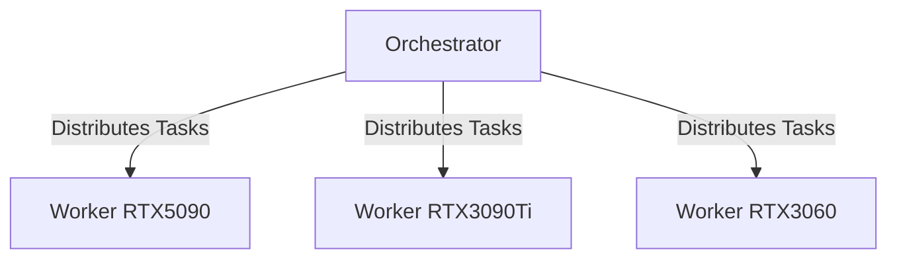

# Bootstrap Documentation

## Overview
Comprehensive documentation for the Project Nyra distributed infrastructure bootstrap system, covering setup, configuration, deployment, and operations.

## Purpose
This directory contains:
- **Architecture documentation** for the 4-PC distributed system
- **Setup guides** for each node type
- **Configuration references** and best practices
- **Operational procedures** and runbooks
- **Troubleshooting guides** and FAQs
- **API documentation** for orchestrator services

## Documentation Structure

### Architecture (`architecture/`)
- **System Architecture** - Overall distributed system design
- **Network Topology** - Inter-node communication and networking
- **Resource Allocation** - GPU and compute resource distribution
- **Security Model** - Authentication, authorization, encryption
- **Scalability Design** - Horizontal and vertical scaling strategies

### Setup Guides (`setup/`)
- **Quick Start** - 5-minute setup for development
- **Production Setup** - Complete production deployment guide
- **Worker Node Setup** - GPU worker configuration (RTX 3060, 3090Ti, 5090)
- **Orchestrator Setup** - Mac Mini orchestrator configuration
- **Network Setup** - VPN, firewall, and network configuration
- **Security Setup** - SSL/TLS, authentication, access control

### Configuration Reference (`config/`)
- **Environment Variables** - Complete variable reference
- **Docker Configuration** - Docker and Docker Compose settings
- **GPU Configuration** - CUDA, drivers, optimization settings
- **Service Configuration** - Individual service configs
- **Network Configuration** - Network policies and routing

### Operations (`operations/`)
- **Deployment Procedures** - Step-by-step deployment guides
- **Monitoring & Alerting** - Prometheus, Grafana setup
- **Backup & Recovery** - Data protection procedures
- **Scaling Operations** - Adding/removing nodes
- **Maintenance Windows** - Planned maintenance procedures
- **Incident Response** - Emergency procedures

### Troubleshooting (`troubleshooting/`)
- **Common Issues** - Frequent problems and solutions
- **GPU Troubleshooting** - GPU-specific issues
- **Network Debugging** - Connectivity problems
- **Performance Issues** - Bottleneck identification
- **Error Messages** - Error code reference
- **Recovery Procedures** - System recovery steps

### API Documentation (`api/`)
- **Orchestrator API** - REST API reference
- **Worker API** - Worker node endpoints
- **WebSocket API** - Real-time communication
- **Authentication** - API key and OAuth flows
- **Rate Limiting** - API usage limits

### Development (`development/`)
- **Development Environment** - Local dev setup
- **Testing Guide** - Unit, integration, E2E testing
- **Contribution Guidelines** - How to contribute
- **Code Standards** - Coding conventions
- **CI/CD Pipeline** - Build and deployment automation

## Quick Links

### Getting Started
1. [Quick Start Guide](setup/QUICK-START.md) - Get up and running in 5 minutes
2. [Architecture Overview](architecture/OVERVIEW.md) - Understand the system design
3. [Production Setup](setup/PRODUCTION-SETUP.md) - Deploy to production

### Common Tasks
- [Deploy a New Service](operations/DEPLOY-SERVICE.md)
- [Add a Worker Node](operations/ADD-WORKER.md)
- [Update Configuration](operations/UPDATE-CONFIG.md)
- [Monitor System Health](operations/MONITORING.md)
- [Backup and Restore](operations/BACKUP-RESTORE.md)

### Troubleshooting
- [GPU Not Detected](troubleshooting/GPU-ISSUES.md)
- [Worker Connection Failed](troubleshooting/WORKER-CONNECTION.md)
- [High Memory Usage](troubleshooting/MEMORY-ISSUES.md)
- [Network Timeout](troubleshooting/NETWORK-TIMEOUT.md)

## Document Templates

### Architecture Decision Record (ADR)
```markdown
# ADR-001: Title

## Status
Proposed | Accepted | Deprecated | Superseded

## Context
What is the issue we're trying to solve?

## Decision
What is our decision and why?

## Consequences
What becomes easier or more difficult?
```

### Setup Guide Template
```markdown
# [Component] Setup Guide

## Prerequisites
- List requirements
- System specifications
- Dependencies

## Installation Steps
1. Step-by-step instructions
2. Include commands
3. Verify each step

## Configuration
- Configuration options
- Best practices
- Examples

## Verification
- How to test
- Expected output
- Troubleshooting

## Next Steps
- What to do next
- Related documentation
```

### Troubleshooting Template
```markdown
# [Issue] Troubleshooting

## Symptoms
Describe what the user sees

## Root Cause
Explain why this happens

## Solution
Step-by-step fix

## Prevention
How to avoid in the future
```

## Documentation Standards

### Markdown Style
- Use ATX-style headers (`#` not `===`)
- One sentence per line for git diffs
- Include code blocks with language tags
- Use relative links for internal references
- Add table of contents for long documents

### Code Examples
```bash
# Always include comments explaining commands
docker-compose up -d  # Start services in background

# Show expected output
# Output: Starting worker-rtx5090...done

# Include error examples
# Error: GPU not found
# Solution: Check nvidia-smi
```

### Diagrams
Use Mermaid for diagrams:


### Versioning
- Document version in frontmatter
- Track changes in changelog
- Mark deprecated content clearly
- Update "Last Updated" dates

## Contributing to Documentation

### Process
1. Identify documentation need or gap
2. Create or update relevant document
3. Follow templates and standards
4. Test all commands and examples
5. Review for clarity and accuracy
6. Submit for review
7. Update after feedback

### Review Checklist
- [ ] Accurate technical content
- [ ] Clear and concise writing
- [ ] Working code examples
- [ ] Proper formatting
- [ ] Links tested
- [ ] Spelling and grammar checked
- [ ] Follows template structure

## Documentation Maintenance

### Regular Reviews
- **Monthly**: Review for accuracy
- **Quarterly**: Update screenshots and examples
- **Major Releases**: Comprehensive documentation update
- **Deprecations**: Mark obsolete content

### Feedback Loop
- Monitor user questions
- Track documentation issues
- Collect feedback from team
- Update based on common problems

## Search and Navigation

### Finding Information
```bash
# Search all documentation
grep -r "keyword" bootstrap/docs/

# Find by topic
find bootstrap/docs/ -name "*keyword*"

# List recent updates
find bootstrap/docs/ -type f -mtime -7
```

### Documentation Index
- [Full Index](INDEX.md) - Alphabetical listing
- [By Topic](BY-TOPIC.md) - Categorized listing
- [By Role](BY-ROLE.md) - Developer, Operator, Admin

## External Resources

### Official Documentation
- [Docker Documentation](https://docs.docker.com/)
- [Kubernetes Documentation](https://kubernetes.io/docs/)
- [NVIDIA CUDA Toolkit](https://docs.nvidia.com/cuda/)
- [Prometheus Documentation](https://prometheus.io/docs/)

### Related Project Documentation
- [Main Project README](../../README.md)
- [API Documentation](../../docs/api/)
- [Architecture Docs](../../docs/architecture/)

## Support

### Getting Help
1. Check this documentation first
2. Search existing issues
3. Ask in team chat
4. Create a documentation issue

### Documentation Issues
Report documentation problems:
```bash
# Label: documentation
# Include:
- Document path
- Issue description
- Suggested fix
```

## License
Documentation is licensed under CC BY 4.0

---

**Last Updated**: 2026-01-15
**Maintainer**: Bootstrap Team
**Version**: 1.0.0
