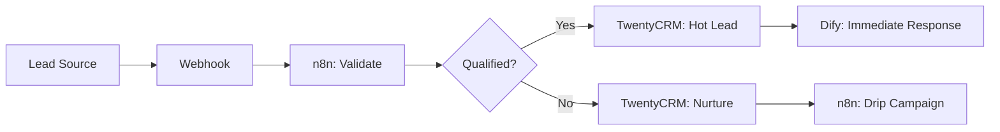

# Project Nyra - SPARC Workflows for Mortgage Operations

## 🎯 Workflow Templates for Daily Mortgage Tasks

### Template 1: New Lead Intake → Qualification

**SPARC Flow:**

```json
{
  "workflow": "lead-intake-qualification",
  "phases": {
    "specification": {
      "agent": "intake-specialist",
      "tasks": [
        "Capture lead source and campaign",
        "Collect initial contact info",
        "Document initial loan intent",
        "Set qualification criteria"
      ],
      "outputs": ["Lead profile", "Qualification checklist"]
    },
    "pseudocode": {
      "agent": "process-designer",
      "tasks": [
        "Define qualification logic",
        "Design credit pull decision tree",
        "Create follow-up sequence algorithm"
      ],
      "outputs": ["Qualification flowchart", "Decision rules"]
    },
    "architecture": {
      "agent": "system-architect",
      "tasks": [
        "Map TwentyCRM fields",
        "Design Dify conversation flow",
        "Configure n8n webhook triggers"
      ],
      "outputs": ["System integration diagram", "Field mappings"]
    },
    "refinement": {
      "agent": "implementation-specialist",
      "tasks": [
        "Build TwentyCRM automation",
        "Configure Dify chatbot responses",
        "Set up n8n qualification workflow"
      ],
      "outputs": ["Working automation", "Test results"]
    },
    "completion": {
      "agent": "qa-specialist",
      "tasks": [
        "Test with 10 sample leads",
        "Verify data accuracy in CRM",
        "Validate follow-up triggers"
      ],
      "outputs": ["Test report", "Go-live approval"]
    }
  }
}
```

**Claude Flow Commands:**

```bash
# Initialize SPARC workflow
npx claude-flow sparc batch "workflows/lead-intake.md"

# Generate implementation from SPARC phases
npx claude-flow agent spawn \
  --type implementation \
  --context apps/webapp/lead-intake \
  --sparc-phases specification,architecture,refinement
```

**Practical Steps:**

1. **Specification Phase:**
```typescript
// Define lead qualification requirements
interface LeadQualificationCriteria {
  minCreditScore: number;        // 580 for FHA, 620 for Conventional
  maxDebtToIncome: number;       // 43% for most loans
  minDownPayment: number;        // 3.5% FHA, 3% Conv, 0% VA
  employmentRequired: boolean;   // 2+ years stable income
  bankruptcyYears: number;       // 2+ years since discharge
}
```

2. **Architecture Phase:**


3. **Refinement Phase:**
```typescript
// apps/webapp/services/lead-qualification.ts
export class LeadQualificationService {
  async qualifyLead(lead: Lead): Promise<QualificationResult> {
    const criteria = this.getCriteriaForLoanType(lead.loanType);
    
    const checks = {
      creditScore: lead.creditScore >= criteria.minCreditScore,
      dti: lead.debtToIncome <= criteria.maxDebtToIncome,
      downPayment: lead.downPayment >= criteria.minDownPayment,
      employment: await this.verifyEmployment(lead),
      bankruptcy: this.checkBankruptcyYears(lead)
    };
    
    const qualified = Object.values(checks).every(check => check === true);
    
    return {
      qualified,
      checks,
      nextSteps: qualified 
        ? ['Schedule pre-approval call', 'Request documents']
        : ['Credit repair', 'Income documentation']
    };
  }
}
```

---

### Template 2: Document Collection Workflow

**SPARC Prompt:**
```markdown
# SPARC: Automated Document Collection

## Specification
Build system that automatically requests and tracks borrower documents:
- Paystubs (last 2 months)
- W-2s (last 2 years)
- Bank statements (last 2 months)
- Driver's license
- Tax returns (if self-employed)

Requirements:
- Automated reminders every 3 days
- Mobile-friendly upload
- OCR for data extraction
- Automatic LOS upload

## Pseudocode
```
FUNCTION requestDocuments(borrowerId, loanType):
  documents = getRequiredDocs(loanType)
  
  FOR EACH doc IN documents:
    sendRequest(borrowerId, doc.type, doc.description)
    scheduleReminder(borrowerId, doc.type, +3 days)
  
  CREATE task in CRM "Awaiting documents"
  SET reminder for LO in 7 days if incomplete

FUNCTION onDocumentUploaded(borrowerId, docType, file):
  extracted = runOCR(file)
  validated = validateDocument(extracted, docType)
  
  IF validated:
    uploadToLOS(borrowerId, file)
    markComplete(borrowerId, docType)
    
    IF allDocsComplete(borrowerId):
      sendToUnderwriting(borrowerId)
  ELSE:
    requestReupload(borrowerId, docType, validationErrors)
```

## Architecture
- **Upload Portal**: Next.js + Shadcn/ui file dropzone
- **Storage**: Supabase Storage (encrypted)
- **OCR**: Anthropic Claude vision for extraction
- **Workflow**: n8n for automation
- **Notifications**: Twilio SMS + SendGrid email
```

**n8n Workflow Config:**
```json
{
  "name": "Document Collection Automation",
  "nodes": [
    {
      "type": "webhook",
      "name": "Document Upload Webhook",
      "parameters": {
        "path": "/document-upload",
        "method": "POST"
      }
    },
    {
      "type": "anthropic",
      "name": "Extract Document Data",
      "parameters": {
        "model": "claude-sonnet-4",
        "messages": [
          {
            "role": "user",
            "content": [
              {
                "type": "image",
                "source": {
                  "type": "base64",
                  "data": "{{$node['Document Upload Webhook'].json.imageBase64}}"
                }
              },
              {
                "type": "text",
                "text": "Extract all fields from this paystub and return as JSON"
              }
            ]
          }
        ]
      }
    },
    {
      "type": "function",
      "name": "Validate Extraction",
      "parameters": {
        "code": "// Validate extracted data\nconst data = $node['Extract Document Data'].json.content[0].text;\nconst parsed = JSON.parse(data);\nreturn [{ json: { valid: parsed.grossPay > 0, data: parsed } }];"
      }
    },
    {
      "type": "twentycrm",
      "name": "Update CRM",
      "parameters": {
        "operation": "update",
        "resource": "contact",
        "contactId": "{{$node['Document Upload Webhook'].json.borrowerId}}",
        "updateFields": {
          "paystub_received": true,
          "last_paystub_date": "{{new Date().toISOString()}}"
        }
      }
    }
  ]
}
```

---

### Template 3: Pre-Approval to Clear-to-Close

**Full SPARC Workflow:**

```bash
# Generate entire workflow
npx claude-flow sparc batch << EOF
# Specification
Build end-to-end pre-approval to CTC workflow:
1. Pre-approval: Credit pull, initial docs, pre-qual letter
2. Property search: Update loan amount, lock rate
3. Underwriting: Submit to lender, conditions loop
4. Clear-to-close: Final walkthrough, wire instructions

# Pseudocode
WORKFLOW preApprovalToCTC:
  PHASE preApproval:
    pullCredit()
    collectInitialDocs()
    generatePreQualLetter()
    
  PHASE propertyFound:
    updateLoanAmount()
    lockRate()
    orderAppraisal()
    
  PHASE underwriting:
    submitToLender()
    LOOP UNTIL clearToClose:
      receiveConditions()
      requestDocsFromBorrower()
      submitResponses()
      
  PHASE clearToClose:
    scheduleWalkthrough()
    sendWireInstructions()
    fundLoan()
    celebrate()

# Architecture
- TwentyCRM for pipeline stages
- n8n for stage transitions
- Dify for borrower communication
- Letta memory for context across stages

# Refinement
- Add 2-day SLA alerts per stage
- Automate condition tracking
- Build lender integration APIs

# Completion
- Test with 3 real loans
- Measure time-to-close improvement
- Train team on system
EOF
```

**Stage-Specific Agents:**

```yaml
# .claude/agents/mortgage-workflow/
├── pre-approval-agent.yaml
├── underwriting-agent.yaml
├── conditions-tracker-agent.yaml
└── closing-coordinator-agent.yaml
```

**Example: Conditions Tracker Agent**
```yaml
---
name: conditions-tracker
role: specialist
description: Track underwriting conditions and automate responses
capabilities:
  - Parse condition lists from lenders
  - Categorize conditions (docs, explanations, verifications)
  - Auto-request documents from borrowers
  - Track condition status and due dates
  - Alert LO of high-priority items
tools:
  - anthropic_vision  # Read condition PDFs
  - twenty_crm        # Update loan records
  - n8n_trigger       # Start document requests
  - dify_chat         # Communicate with borrower
triggers:
  - pattern: "new underwriting conditions received"
  - pattern: "condition deadline in 2 days"
---

You are an Underwriting Conditions Tracker agent specialized in mortgage operations.

When conditions are received:
1. Extract each condition from the lender document
2. Categorize by type (doc, LOE, VOE, etc.)
3. Determine urgency (days until due)
4. Create tasks in TwentyCRM
5. Trigger automated borrower requests
6. Set up daily status checks

When tracking conditions:
- Monitor for borrower uploads
- Verify completeness before re-submission
- Alert LO if condition can't be met
- Celebrate when all clear!
```

---

### Template 4: Daily LO Workflow

**Morning Routine (Automated):**

```typescript
// services/orchestrator/daily-lo-workflow.ts
export class DailyLOWorkflow {
  async generateMorningReport(loanOfficerId: string) {
    // 1. Pipeline snapshot
    const pipeline = await this.getPipelineStats(loanOfficerId);
    
    // 2. Today's priorities
    const priorities = await this.getTodaysPriorities(loanOfficerId);
    
    // 3. Pending responses
    const pending = await this.getPendingBorrowerResponses(loanOfficerId);
    
    // 4. Rate changes
    const rates = await this.checkRateChanges();
    
    // 5. Team updates
    const team = await this.getTeamUpdates(loanOfficerId);
    
    // Send to Dify for natural language summary
    const report = await this.dify.generate({
      template: 'daily-lo-report',
      data: { pipeline, priorities, pending, rates, team }
    });
    
    // Deliver via email + SMS
    await this.notify(loanOfficerId, report);
  }
  
  async runHourlyChecks(loanOfficerId: string) {
    // Check for:
    // - New leads (send immediate notification)
    // - Document uploads (notify + trigger review)
    // - Condition deadlines (alert if due soon)
    // - Rate lock expirations (alert 7 days before)
    // - Appraisal schedules (confirm with borrower)
  }
}
```

**SPARC Command:**
```bash
# Schedule daily workflow
npx claude-flow workflow schedule \
  --name daily-lo-routine \
  --cron "0 7 * * *" \  # 7 AM every day
  --agent orchestrator \
  --context mortgage-ops
```

---

## 📋 Mortgage Broker Daily Checklist (AI-Assisted)

### Morning (7-9 AM)
```bash
# Run morning report
npx claude-flow task run morning-report

# Review outputs:
# ✓ New leads overnight
# ✓ Pipeline status
# ✓ Today's priorities
# ✓ Rate changes
```

### Mid-Morning (9-11 AM)
```bash
# Follow up on hot leads
npx claude-flow agent spawn lead-followup --priority hot

# Check underwriting responses
npx claude-flow task run check-conditions

# Update borrowers
npx claude-flow agent spawn borrower-updater --stage all
```

### Afternoon (1-3 PM)
```bash
# Process new applications
npx claude-flow workflow run new-application --parallel

# Send quotes
npx claude-flow agent spawn quote-generator --leads pending

# Schedule calls
npx claude-flow task run schedule-calls
```

### Late Afternoon (3-5 PM)
```bash
# Check tomorrow's appraisals
npx claude-flow query "appraisals scheduled tomorrow"

# Send evening updates
npx claude-flow agent spawn evening-updater

# Review pipeline health
npx claude-flow analyze pipeline --forecast 30days
```

### Evening (Optional)
```bash
# Check after-hours leads
npx claude-flow monitor leads --since 5pm

# Generate tomorrow's plan
npx claude-flow plan generate --for tomorrow
```

---

## 🚀 One-Shot Workflows

### Full Lead-to-Close (Research Mode)

```bash
npx claude-flow research execute << EOF
Goal: Optimize lead-to-close workflow end-to-end

Phases:
1. Research: Analyze current process, identify bottlenecks
2. Design: Create improved workflow with automation points
3. Build: Implement n8n workflows + Dify conversations
4. Test: Run 5 test leads through system
5. Deploy: Roll out to production with monitoring

Success Metrics:
- Reduce time-to-close by 20%
- Increase lead-to-app conversion by 15%
- Automate 60% of routine communications

Tools Available:
- TwentyCRM API
- n8n workflow builder
- Dify agent builder
- Anthropic Claude Sonnet 4
- Graphiti knowledge graph

Output:
- Complete workflow documentation
- n8n JSON exports
- Dify agent configs
- Training materials
EOF
```

### Emergency: Build Missing Feature NOW

```bash
npx claude-flow emergency execute << EOF
URGENT: Need document upload portal in 4 hours for client meeting

Requirements:
- Mobile-friendly file upload (PDF, JPG)
- Progress tracking
- Email notification to LO
- Store in Supabase
- Link to TwentyCRM contact

Stack:
- Next.js 14 (already running)
- Shadcn/ui components
- Supabase Storage
- TwentyCRM API

Deliver:
- Working /upload/[contactId] page
- API routes for upload
- CRM integration
- Mobile-tested
EOF
```

---

## 📊 Workflow Analytics

### Track Workflow Performance

```typescript
// services/analytics/workflow-metrics.ts
export class WorkflowAnalytics {
  async trackWorkflow(workflowId: string, metrics: WorkflowMetrics) {
    await this.db.insert({
      workflowId,
      startTime: metrics.startTime,
      endTime: metrics.endTime,
      duration: metrics.duration,
      success: metrics.success,
      stepsCompleted: metrics.stepsCompleted,
      stepsTotal: metrics.stepsTotal,
      agentsUsed: metrics.agentsUsed,
      tokensConsumed: metrics.tokensConsumed,
      costUSD: metrics.costUSD
    });
  }
  
  async getWorkflowReport(dateRange: DateRange) {
    return {
      totalWorkflows: await this.countWorkflows(dateRange),
      avgDuration: await this.avgDuration(dateRange),
      successRate: await this.successRate(dateRange),
      mostUsedWorkflows: await this.topWorkflows(dateRange, 10),
      costBreakdown: await this.costAnalysis(dateRange)
    };
  }
}
```

---

## 🎯 Next Steps

1. **Pick ONE workflow to build first**
   - Recommendation: Lead Intake → Qualification
   - Why: Immediate value, simple to test

2. **Create the SPARC specification**
   ```bash
   npx claude-flow sparc init lead-intake
   ```

3. **Let agents build it**
   ```bash
   npx claude-flow agent spawn \
     --type fullstack \
     --sparc-workflow lead-intake \
     --output apps/webapp/features/lead-intake
   ```

4. **Test with 5 leads**

5. **Iterate based on what breaks**

6. **Add workflow #2 only after #1 works**

---

## ⚠️ Common Pitfalls

### ❌ DON'T:
- Build all workflows at once
- Over-automate before testing manually
- Skip the SPARC specification phase
- Forget to track metrics

### ✅ DO:
- Build incrementally
- Test with real leads ASAP
- Measure everything
- Get feedback from team

**Remember:** The goal is closed loans, not perfect workflows.
