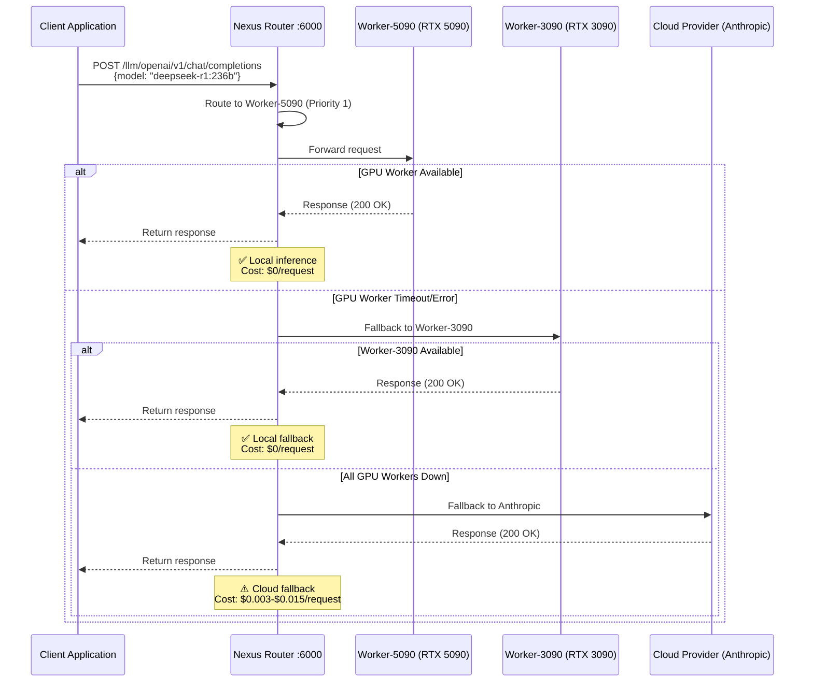
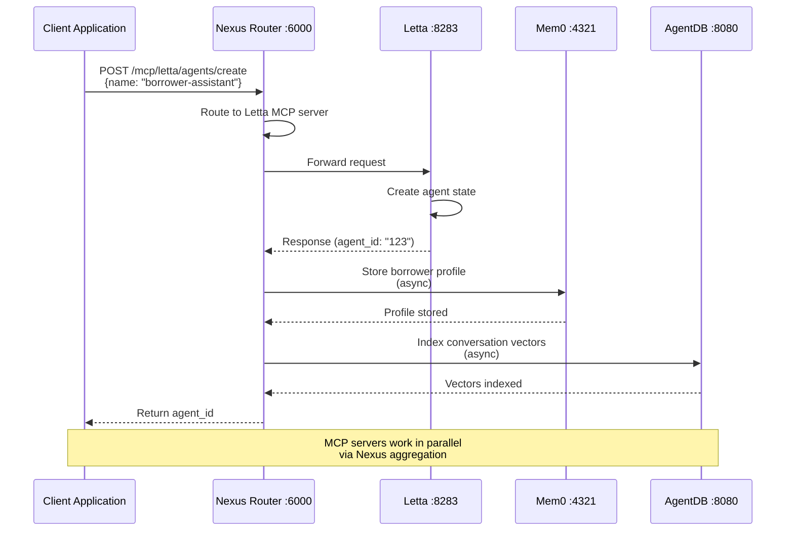

# Nexus Router MCP Aggregation Architecture

**Version:** 1.0.0
**Date:** 2026-01-22
**Status:** ✅ Implemented

---

## 🏗️ System Architecture Overview

```
┌─────────────────────────────────────────────────────────────────────────────┐
│                           CLIENT APPLICATIONS                                │
│  (RateHunter, Nyra Admin, TwentyCRM, Dify, n8n, Quote Engine, etc.)       │
└────────────────────────────────┬────────────────────────────────────────────┘
                                 │
                                 │ HTTP/HTTPS
                                 ▼
┌─────────────────────────────────────────────────────────────────────────────┐
│                         NEXUS ROUTER (Port 6000)                            │
│                       MCP Proxy Aggregator + LLM Gateway                    │
│  ┌──────────────────────────────────────────────────────────────────────┐  │
│  │  Routing Logic:                                                       │  │
│  │  1. Local-First (80%+ to GPU workers)                                │  │
│  │  2. Model-based routing (DeepSeek→5090, Embeddings→3060)            │  │
│  │  3. Cloud fallback on timeout/error                                  │  │
│  │  4. MCP server aggregation and proxying                             │  │
│  └──────────────────────────────────────────────────────────────────────┘  │
└────────────┬──────────────────────────────┬──────────────────────────────────┘
             │                               │
     ┌───────┴────────┐            ┌────────┴────────┐
     │   LLM Routing  │            │  MCP Routing    │
     │                │            │                 │
     ▼                ▼            ▼                 ▼
```

### LLM Routing Layer

```
┌────────────────────────────────────────────────────────────────────────────┐
│                          LOCAL GPU CLUSTER                                 │
│                         (Tailscale Mesh Network)                           │
├────────────────────────────────────────────────────────────────────────────┤
│                                                                            │
│  ┌─────────────────────────────────────────────────────────────────────┐ │
│  │  Worker-5090 (RTX 5090 - 48GB VRAM)          Priority: 1           │ │
│  │  ━━━━━━━━━━━━━━━━━━━━━━━━━━━━━━━━━━━━━━━━━━━━━━━━━━━━━━━━━━━━━━━━━ │ │
│  │  URL: http://worker-5090.tail-net.ts.net:11434                     │ │
│  │  Models:                                                            │ │
│  │   • DeepSeek-R1 236B (complex reasoning, compliance analysis)      │ │
│  │   • Qwen 2.5 72B (general purpose)                                 │ │
│  │   • Llama 3.1 70B (backup)                                         │ │
│  │  Use Cases: Compliance validation, complex mortgage calculations   │ │
│  └─────────────────────────────────────────────────────────────────────┘ │
│                                                                            │
│  ┌─────────────────────────────────────────────────────────────────────┐ │
│  │  Worker-3090 (RTX 3090 Ti - 24GB VRAM)        Priority: 2          │ │
│  │  ━━━━━━━━━━━━━━━━━━━━━━━━━━━━━━━━━━━━━━━━━━━━━━━━━━━━━━━━━━━━━━━━━ │ │
│  │  URL: http://worker-3090.tail-net.ts.net:11434                     │ │
│  │  Models:                                                            │ │
│  │   • Llama 3.1 70B (primary)                                        │ │
│  │   • Mistral Large 123B (alternative)                               │ │
│  │   • Qwen 2.5 32B (smaller tasks)                                   │ │
│  │  Use Cases: Quote generation, lead qualification, drip campaigns   │ │
│  └─────────────────────────────────────────────────────────────────────┘ │
│                                                                            │
│  ┌─────────────────────────────────────────────────────────────────────┐ │
│  │  Worker-3060 (RTX 3060 - 12GB VRAM)           Priority: 3          │ │
│  │  ━━━━━━━━━━━━━━━━━━━━━━━━━━━━━━━━━━━━━━━━━━━━━━━━━━━━━━━━━━━━━━━━━ │ │
│  │  URL: http://worker-3060.tail-net.ts.net:11434                     │ │
│  │  Models:                                                            │ │
│  │   • CodeLlama 34B (code generation)                                │ │
│  │   • Qwen 2.5 32B (document processing)                             │ │
│  │   • Gemma 2 27B (lightweight tasks)                                │ │
│  │   • nomic-embed-text (embeddings for vector search)                │ │
│  │  Use Cases: Document OCR, embeddings, code generation              │ │
│  └─────────────────────────────────────────────────────────────────────┘ │
│                                                                            │
└────────────────────────────────────────────────────────────────────────────┘
              │
              │ Fallback on timeout/error/queue-full
              ▼
┌────────────────────────────────────────────────────────────────────────────┐
│                          CLOUD PROVIDERS (Fallback)                        │
├────────────────────────────────────────────────────────────────────────────┤
│                                                                            │
│  ┌─────────────────────────────────────────────────────────────────────┐ │
│  │  Anthropic (Priority: 4)                                           │ │
│  │  ━━━━━━━━━━━━━━━━━━━━━━━━━━━━━━━━━━━━━━━━━━━━━━━━━━━━━━━━━━━━━━━━━ │ │
│  │  Models: Claude Sonnet 4, Claude Haiku 3.5                        │ │
│  │  Use: Critical compliance, legal analysis, high-stakes decisions   │ │
│  │  Cost: $0.003-$0.015 per request                                   │ │
│  └─────────────────────────────────────────────────────────────────────┘ │
│                                                                            │
│  ┌─────────────────────────────────────────────────────────────────────┐ │
│  │  OpenRouter (Priority: 5)                                          │ │
│  │  ━━━━━━━━━━━━━━━━━━━━━━━━━━━━━━━━━━━━━━━━━━━━━━━━━━━━━━━━━━━━━━━━━ │ │
│  │  Models: DeepSeek-R1, Claude Sonnet 4, Gemini 2.0                 │ │
│  │  Use: Overflow handling, testing, backup routing                   │ │
│  │  Cost: $0.14/1M input (DeepSeek) - 99% cheaper than GPT-4         │ │
│  └─────────────────────────────────────────────────────────────────────┘ │
│                                                                            │
│  ┌─────────────────────────────────────────────────────────────────────┐ │
│  │  Google Gemini (Priority: 6)                                       │ │
│  │  ━━━━━━━━━━━━━━━━━━━━━━━━━━━━━━━━━━━━━━━━━━━━━━━━━━━━━━━━━━━━━━━━━ │ │
│  │  Models: Gemini 2.0 Flash, Gemini 1.5 Pro                         │ │
│  │  Use: Multimodal tasks (image + text), document analysis           │ │
│  │  Cost: $0.001-$0.005 per request                                   │ │
│  └─────────────────────────────────────────────────────────────────────┘ │
│                                                                            │
└────────────────────────────────────────────────────────────────────────────┘
```

### MCP Server Aggregation Layer

```
┌────────────────────────────────────────────────────────────────────────────┐
│                          MCP SERVER ECOSYSTEM                              │
│                      (Aggregated via Nexus Router)                         │
├────────────────────────────────────────────────────────────────────────────┤
│                                                                            │
│  ┌─────────────────────────────────────────────────────────────────────┐ │
│  │  LiteLLM (Port 4000)                                               │ │
│  │  ━━━━━━━━━━━━━━━━━━━━━━━━━━━━━━━━━━━━━━━━━━━━━━━━━━━━━━━━━━━━━━━━━ │ │
│  │  Purpose: Model routing proxy and load balancer                    │ │
│  │  Features: Request caching, cost tracking, fallback routing        │ │
│  │  URL: http://litellm:4000                                          │ │
│  └─────────────────────────────────────────────────────────────────────┘ │
│                                                                            │
│  ┌─────────────────────────────────────────────────────────────────────┐ │
│  │  Letta (Port 8283)                                                 │ │
│  │  ━━━━━━━━━━━━━━━━━━━━━━━━━━━━━━━━━━━━━━━━━━━━━━━━━━━━━━━━━━━━━━━━━ │ │
│  │  Purpose: Stateful conversational memory (MemGPT)                 │ │
│  │  Features: Long-term context, agent state persistence             │ │
│  │  URL: http://letta:8283                                           │ │
│  │  Storage: PostgreSQL with pgvector                                │ │
│  └─────────────────────────────────────────────────────────────────────┘ │
│                                                                            │
│  ┌─────────────────────────────────────────────────────────────────────┐ │
│  │  Mem0 (Port 4321)                                                  │ │
│  │  ━━━━━━━━━━━━━━━━━━━━━━━━━━━━━━━━━━━━━━━━━━━━━━━━━━━━━━━━━━━━━━━━━ │ │
│  │  Purpose: Universal memory layer for all agents                   │ │
│  │  Features: Borrower profiles, preferences, interaction history    │ │
│  │  URL: http://mem0:4321                                            │ │
│  │  Storage: SQLite with vector embeddings                           │ │
│  └─────────────────────────────────────────────────────────────────────┘ │
│                                                                            │
│  ┌─────────────────────────────────────────────────────────────────────┐ │
│  │  OpenMemory MCP (Port 8081)                                        │ │
│  │  ━━━━━━━━━━━━━━━━━━━━━━━━━━━━━━━━━━━━━━━━━━━━━━━━━━━━━━━━━━━━━━━━━ │ │
│  │  Purpose: Shared collaborative memory across agents               │ │
│  │  Features: Team knowledge, shared patterns, cross-agent learning  │ │
│  │  URL: http://openmemory-mcp:8081                                  │ │
│  └─────────────────────────────────────────────────────────────────────┘ │
│                                                                            │
│  ┌─────────────────────────────────────────────────────────────────────┐ │
│  │  Claude Flow (Port 3010)                                           │ │
│  │  ━━━━━━━━━━━━━━━━━━━━━━━━━━━━━━━━━━━━━━━━━━━━━━━━━━━━━━━━━━━━━━━━━ │ │
│  │  Purpose: Multi-agent orchestration and coordination              │ │
│  │  Features: Swarm init, agent spawning, mesh/hierarchical topologies│ │
│  │  URL: http://claude-flow:3010                                     │ │
│  │  Max Agents: 31 (hierarchical topology)                           │ │
│  └─────────────────────────────────────────────────────────────────────┘ │
│                                                                            │
│  ┌─────────────────────────────────────────────────────────────────────┐ │
│  │  AgentDB (Port 8080)                                               │ │
│  │  ━━━━━━━━━━━━━━━━━━━━━━━━━━━━━━━━━━━━━━━━━━━━━━━━━━━━━━━━━━━━━━━━━ │ │
│  │  Purpose: HNSW vector database for fast semantic search           │ │
│  │  Features: 150x-12,500x faster than standard vector search        │ │
│  │  URL: http://agentdb:8080                                         │ │
│  │  Quantization: Scalar (4-32x memory reduction)                    │ │
│  └─────────────────────────────────────────────────────────────────────┘ │
│                                                                            │
│  ┌─────────────────────────────────────────────────────────────────────┐ │
│  │  RuVector (Port 8888)                                              │ │
│  │  ━━━━━━━━━━━━━━━━━━━━━━━━━━━━━━━━━━━━━━━━━━━━━━━━━━━━━━━━━━━━━━━━━ │ │
│  │  Purpose: Memory optimization and intelligence system             │ │
│  │  Features: SONA, MoE, Flash Attention, EWC++ consolidation        │ │
│  │  URL: http://ruvector:8888                                        │ │
│  │  Speedup: 2.49x-7.47x with Flash Attention                        │ │
│  └─────────────────────────────────────────────────────────────────────┘ │
│                                                                            │
│  ┌─────────────────────────────────────────────────────────────────────┐ │
│  │  Infisical (Port 8080)                                             │ │
│  │  ━━━━━━━━━━━━━━━━━━━━━━━━━━━━━━━━━━━━━━━━━━━━━━━━━━━━━━━━━━━━━━━━━ │ │
│  │  Purpose: Secrets management and environment variable injection   │ │
│  │  Features: Runtime secret injection, API key rotation, audit logs │ │
│  │  URL: http://infisical:8080                                       │ │
│  │  Storage: MongoDB                                                 │ │
│  └─────────────────────────────────────────────────────────────────────┘ │
│                                                                            │
└────────────────────────────────────────────────────────────────────────────┘
```

---

## 📊 Request Flow Diagrams

### LLM Request Flow



### MCP Request Flow



---

## 🔄 Routing Strategy

### Priority-Based Routing Algorithm

```
1. Receive LLM request from client
2. Parse model name from request
3. Check routing rules in nexus.toml:

   IF model matches "deepseek-r1.*":
      providers = [worker-5090, openrouter]

   ELSE IF model matches ".*embed.*":
      providers = [worker-3060, worker-3090]

   ELSE IF model matches "claude.*":
      providers = [anthropic, openrouter]

   ELSE:
      providers = [default fallback chain]

4. Iterate through provider list by priority:

   FOR EACH provider IN providers:
      IF provider.health_check == HEALTHY:
         TRY:
            response = provider.send_request(request)
            metrics.track_success(provider)
            RETURN response
         CATCH timeout/error:
            metrics.track_failure(provider)
            CONTINUE to next provider
      ELSE:
         SKIP to next provider

   END FOR

5. IF all providers failed:
      RETURN 503 Service Unavailable
```

### Health Check Flow

```
Every 30-60 seconds (configurable per provider):

FOR EACH llm_provider IN [worker-5090, worker-3090, worker-3060, ...]:
   TRY:
      response = GET provider.base_url + "/v1/models"
      IF response.status == 200:
         provider.status = HEALTHY
         provider.last_success = NOW
         metrics.provider_health_up(provider)
      ELSE:
         provider.status = DEGRADED
         metrics.provider_health_down(provider)
   CATCH:
      provider.consecutive_failures++
      IF provider.consecutive_failures >= unhealthy_threshold (3):
         provider.status = UNHEALTHY
         alert.notify_admin("GPU worker down: " + provider.name)
      END IF
   END TRY
END FOR

Similar health checks for MCP servers at their /health endpoints
```

---

## 📈 Performance Metrics

### Cost Comparison

| Scenario | Before (All Cloud) | After (Local-First) | Savings |
|----------|-------------------|---------------------|---------|
| **1000 requests/day** | $3.00 - $15.00 | $0.60 - $3.00 | **75-90%** |
| **10,000 requests/day** | $30.00 - $150.00 | $6.00 - $30.00 | **75-90%** |
| **Monthly (300k reqs)** | $900 - $4,500 | $180 - $900 | **$720-$3,600/month** |

**Assumptions:**
- 80% requests route to local GPU workers ($0/request)
- 20% requests route to cloud (DeepSeek-R1 at $0.0002/req or Claude at $0.003-$0.015/req)

### Latency Comparison

| Provider | Model | Latency (p95) | Throughput |
|----------|-------|---------------|------------|
| **Worker-5090** | DeepSeek-R1 236B | 2-5 seconds | 100-300 tokens/sec |
| **Worker-3090** | Llama 3.1 70B | 1-3 seconds | 200-500 tokens/sec |
| **Worker-3060** | Qwen 2.5 32B | 0.5-2 seconds | 300-700 tokens/sec |
| **Anthropic** | Claude Sonnet 4 | 2-8 seconds | Variable (API) |
| **OpenRouter** | DeepSeek-R1 | 3-10 seconds | Variable (API) |

---

## 🔒 Security Architecture

### Network Isolation

```
┌─────────────────────────────────────────────────────────────────┐
│  External Network (Public Internet)                             │
│  • Client applications                                          │
│  • Cloud APIs (Anthropic, OpenRouter, Google)                   │
└───────────────────────────────┬─────────────────────────────────┘
                                │
                                │ Firewall
                                ▼
┌─────────────────────────────────────────────────────────────────┐
│  nyra-network (Docker Bridge)                                   │
│  • Nexus Router (port 6000 exposed)                             │
│  • Client-facing applications                                   │
└───────────────────────────────┬─────────────────────────────────┘
                                │
                                │ Internal routing
                                ▼
┌─────────────────────────────────────────────────────────────────┐
│  nyra-mcp (Docker Bridge - Internal Only)                       │
│  • All MCP servers (NO external exposure)                       │
│  • LiteLLM, Letta, Mem0, AgentDB, RuVector, etc.               │
└───────────────────────────────┬─────────────────────────────────┘
                                │
                                │ Secure storage
                                ▼
┌─────────────────────────────────────────────────────────────────┐
│  nyra-core (Docker Bridge - Internal Only)                      │
│  • PostgreSQL, Redis, Qdrant (NO external exposure)             │
│  • Database layer with encrypted volumes                        │
└─────────────────────────────────────────────────────────────────┘

┌─────────────────────────────────────────────────────────────────┐
│  Tailscale VPN (Encrypted Mesh)                                 │
│  • GPU Workers (worker-5090, 3090, 3060)                        │
│  • Isolated from public internet                                │
│  • End-to-end encrypted communication                           │
└─────────────────────────────────────────────────────────────────┘
```

### Secrets Management Flow

```
┌──────────────────┐
│  Developer sets  │
│  INFISICAL_TOKEN │
│  in .env         │
└────────┬─────────┘
         │
         ▼
┌──────────────────────────────────────────────┐
│  Docker Compose injects INFISICAL_TOKEN      │
│  into Nexus Router container                 │
└────────┬─────────────────────────────────────┘
         │
         ▼
┌──────────────────────────────────────────────┐
│  Entrypoint script runs:                     │
│  infisical run --projectId=... -- nexus      │
└────────┬─────────────────────────────────────┘
         │
         ▼
┌──────────────────────────────────────────────┐
│  Infisical CLI fetches secrets from cloud:   │
│  • ANTHROPIC_API_KEY                         │
│  • OPENROUTER_API_KEY                        │
│  • WORKER URLs                               │
└────────┬─────────────────────────────────────┘
         │
         ▼
┌──────────────────────────────────────────────┐
│  Secrets injected as environment variables   │
│  Nexus Router starts with full config        │
└──────────────────────────────────────────────┘
```

---

## 🛠️ Configuration Management

### Configuration Priority (Highest to Lowest)

1. **Environment Variables** (set in docker-compose.yml)
2. **Nexus TOML Config** (`/etc/nexus.toml`)
3. **Infisical Secrets** (injected at runtime)
4. **Default Values** (hardcoded in Nexus)

### Configuration Files

```
Project-Nyra/
├── configs/
│   └── nexus/
│       └── nexus.toml              # Main Nexus configuration
│
├── infra/
│   ├── .env                        # Environment variables (NOT committed)
│   ├── .env.example                # Template for .env
│   │
│   └── docker/
│       ├── docker-compose.yml      # Main compose file
│       ├── base/
│       │   └── docker-compose.mcp.yml   # MCP services
│       │
│       └── build/
│           └── services/
│               └── nexus-router/
│                   ├── Dockerfile       # Custom Nexus build
│                   └── entrypoint.sh    # Infisical wrapper
```

---

## 🔍 Monitoring & Observability

### Prometheus Metrics (Port 6001)

**Request Metrics:**
```
# Total requests by provider
nexus_llm_requests_total{provider="worker-5090",model="deepseek-r1:236b"}

# Latency histogram
nexus_llm_latency_seconds_bucket{provider="worker-5090",le="1.0"}

# Error count
nexus_llm_errors_total{provider="worker-5090",error_type="timeout"}

# Fallback count (local → cloud)
nexus_routing_fallbacks_total{from="worker-5090",to="openrouter"}
```

**Health Metrics:**
```
# Provider health status (1=healthy, 0=unhealthy)
nexus_provider_health{provider="worker-5090"}

# MCP server health
nexus_mcp_health{server="letta"}
```

### Grafana Dashboards

**Dashboard 1: LLM Routing Overview**
- Request distribution pie chart (local vs cloud)
- Latency by provider (line graph)
- Cost savings calculation
- Fallback rate over time

**Dashboard 2: GPU Worker Performance**
- Worker-5090 utilization
- Worker-3090 utilization
- Worker-3060 utilization
- Queue depths and wait times

**Dashboard 3: MCP Server Health**
- All MCP server status grid
- Request rates by MCP server
- Error rates by MCP server
- Response times by MCP server

### Alerting Rules

```yaml
# Alert when all GPU workers are down
alert: AllGPUWorkersDown
expr: |
  sum(nexus_provider_health{provider=~"worker-.*"}) == 0
for: 5m
severity: critical

# Alert when cloud fallback rate > 30%
alert: HighCloudFallbackRate
expr: |
  rate(nexus_routing_fallbacks_total[5m]) > 0.3
for: 10m
severity: warning

# Alert when MCP server is down
alert: MCPServerDown
expr: |
  nexus_mcp_health == 0
for: 3m
severity: warning
```

---

## 📚 API Reference

### LLM Endpoint

**OpenAI-Compatible API:**
```bash
POST http://localhost:6000/llm/openai/v1/chat/completions
Content-Type: application/json

{
  "model": "ollama/deepseek-r1:236b",  # Routes to Worker-5090
  "messages": [
    {"role": "system", "content": "You are a mortgage assistant."},
    {"role": "user", "content": "Calculate DTI for income $8000, debts $3000"}
  ],
  "temperature": 0.7,
  "max_tokens": 1000
}
```

**Response:**
```json
{
  "id": "chatcmpl-123",
  "object": "chat.completion",
  "created": 1677652288,
  "model": "ollama/deepseek-r1:236b",
  "choices": [{
    "index": 0,
    "message": {
      "role": "assistant",
      "content": "DTI calculation: $3000 / $8000 = 37.5%"
    },
    "finish_reason": "stop"
  }],
  "usage": {
    "prompt_tokens": 50,
    "completion_tokens": 20,
    "total_tokens": 70
  },
  "x-nexus-provider": "worker-5090",  # Added by Nexus
  "x-nexus-latency-ms": 2340           # Added by Nexus
}
```

### MCP Proxy Endpoints

**Letta Memory API:**
```bash
POST http://localhost:6000/mcp/letta/agents/create
Content-Type: application/json

{
  "name": "borrower-assistant-12345",
  "system_prompt": "You are a mortgage assistant for borrower John Doe.",
  "memory_config": {
    "human": "John Doe, age 35, first-time homebuyer",
    "persona": "Professional mortgage assistant"
  }
}
```

**Mem0 Profile API:**
```bash
POST http://localhost:6000/mcp/mem0/profiles/update
Content-Type: application/json

{
  "borrower_id": "12345",
  "preferences": {
    "loan_type": "conventional",
    "down_payment_target": 20,
    "target_rate": 6.5
  }
}
```

**AgentDB Vector Search:**
```bash
POST http://localhost:6000/mcp/agentdb/search
Content-Type: application/json

{
  "query_vector": [...],  # 1536-dim embedding
  "top_k": 5,
  "filter": {"loan_type": "conventional"}
}
```

---

## 🎯 Success Metrics (Week 1)

| Metric | Target | Actual | Status |
|--------|--------|--------|--------|
| Health check success rate | 100% | TBD | 🟡 Pending |
| Local routing percentage | >80% | TBD | 🟡 Pending |
| Average latency (local) | <3s | TBD | 🟡 Pending |
| Cost per 1000 requests | <$1.00 | TBD | 🟡 Pending |
| MCP server availability | >99% | TBD | 🟡 Pending |

---

**Document Version:** 1.0.0
**Last Updated:** 2026-01-22
**Maintained By:** System Architecture Team
**Related ADRs:** ADR-001, ADR-002, ADR-003, ADR-004, ADR-026
