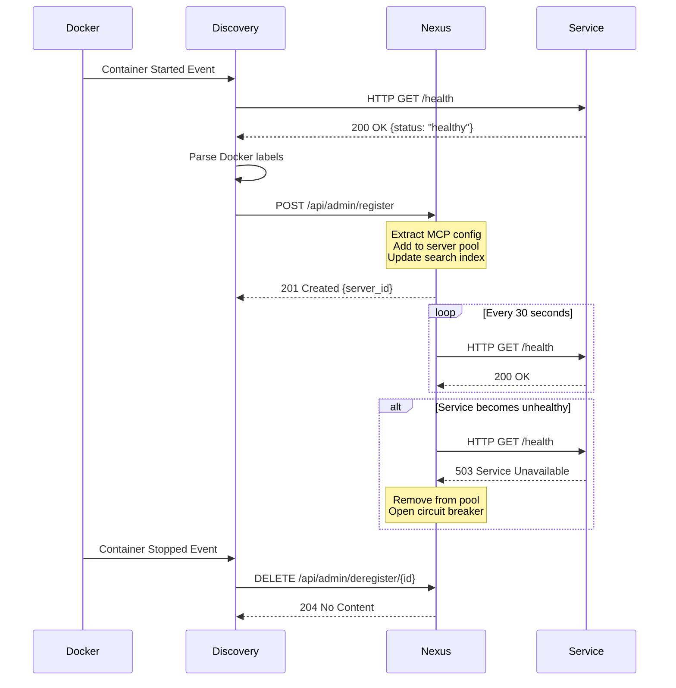

# Nexus Router Integration Guide

> Comprehensive guide to service discovery and routing in Project Nyra

## Overview

**Nexus Router** is the unified MCP (Model Context Protocol) + LLM Gateway that serves as the central entry point for all services in Project Nyra. It provides:

- **Service Discovery**: Automatic registration via Docker labels
- **LLM Routing**: Cost-optimized routing across multiple AI providers
- **MCP Aggregation**: Unified access to 22+ MCP servers
- **Health Monitoring**: Continuous health checks with circuit breakers
- **Authentication**: JWT-based auth with policy enforcement
- **Load Balancing**: Intelligent routing based on health and latency

**Port**: 6000
**Protocol**: HTTP/SSE

## Architecture

```
┌─────────────────────────────────────────────────────────────┐
│                      CLIENT LAYER                            │
│  Claude Code, Web UI, API Clients, External Integrations    │
└──────────────────────┬──────────────────────────────────────┘
                       │
                       ▼
┌─────────────────────────────────────────────────────────────┐
│                  NEXUS ROUTER (Port 6000)                    │
│  ┌──────────────────────────────────────────────────────┐   │
│  │  Service Discovery: Auto-register via Docker labels  │   │
│  │  Health Checks: 30s interval, circuit breakers       │   │
│  │  LLM Routing: Cost-optimized model selection         │   │
│  │  Authentication: JWT + Policy-based access control   │   │
│  │  Fuzzy Matching: Levenshtein + keyword expansion     │   │
│  └──────────────────────────────────────────────────────┘   │
└──────────────────────┬──────────────────────────────────────┘
                       │
       ┌───────────────┼───────────────────┬─────────────────┐
       │               │                   │                 │
       ▼               ▼                   ▼                 ▼
 ┌─────────────┐ ┌──────────────┐ ┌──────────────┐ ┌──────────────┐
 │  TwentyCRM  │ │  Claude Flow │ │    Letta     │ │   Graphiti   │
 │  Port 3000  │ │  Port 3000   │ │  Port 8283   │ │  Port 8001   │
 └─────────────┘ └──────────────┘ └──────────────┘ └──────────────┘
```

## Service Registration

### Automatic Registration via Docker Labels

Services automatically register with Nexus Router by including standardized Docker labels in their `docker-compose.yml` configuration.

#### Required Labels

```yaml
services:
  my-service:
    image: my-service:latest
    labels:
      # REQUIRED
      - "nyra.service.name=my-service"           # Unique service identifier
      - "nyra.service.type=mcp-server"           # Service type
      - "nyra.mcp.enabled=true"                  # Enable MCP registration
      - "nyra.mcp.transport=http"                # Transport: http, sse, stdio
      - "nyra.mcp.port=8000"                     # Internal service port
```

#### Optional Labels

```yaml
      # OPTIONAL (but recommended)
      - "nyra.mcp.health_endpoint=/health"       # Health check endpoint
      - "nyra.mcp.keywords=crm,contacts,leads"   # Keywords for fuzzy search
      - "nyra.mcp.priority=1"                    # Priority: 1=high, 2=medium, 3=low
      - "nyra.mcp.fuzzy_match=true"              # Enable fuzzy tool matching
      - "nyra.policy=borrower_minimal_tools"     # Access control policy
      - "nyra.mcp.base_path=/api/v1"             # API base path (if not root)

      # METADATA
      - "nyra.description=CRM system for lead management"
      - "nyra.version=1.0.0"
      - "nyra.maintainer=nyra-team"
      - "nyra.tier=worker"                       # Tier: orchestrator, worker, etc.
```

### Complete Example

**TwentyCRM Service:**

```yaml
services:
  twentycrm:
    image: twentycrm/twenty:latest
    container_name: nyra-twentycrm
    ports:
      - "3000:3000"
    healthcheck:
      test: ["CMD", "curl", "-f", "http://localhost:3000/health"]
      interval: 30s
      timeout: 10s
      retries: 3
    labels:
      # Service Identity
      - "nyra.service.name=twentycrm"
      - "nyra.service.type=mcp-server"
      - "nyra.tier=worker"

      # MCP Configuration
      - "nyra.mcp.enabled=true"
      - "nyra.mcp.transport=http"
      - "nyra.mcp.port=3000"
      - "nyra.mcp.base_path=/api/mcp"
      - "nyra.mcp.health_endpoint=/health"

      # Discovery & Routing
      - "nyra.mcp.keywords=crm,contacts,leads,deals,borrower,customer"
      - "nyra.mcp.priority=1"
      - "nyra.mcp.fuzzy_match=true"

      # Security
      - "nyra.policy=borrower_minimal_tools"

      # Metadata
      - "nyra.description=Open source CRM for lead and contact management"
      - "nyra.version=1.0.0"
```

## Service Discovery Flow



## Health Checks

### Health Endpoint Specification

All services MUST implement a `/health` endpoint:

**Request:**
```http
GET /health HTTP/1.1
Host: service:port
```

**Response:**
```json
{
  "status": "healthy",
  "timestamp": "2026-01-18T10:30:00Z",
  "service": "twentycrm",
  "version": "1.0.0",
  "dependencies": {
    "database": "healthy",
    "redis": "healthy",
    "external_api": "degraded"
  },
  "metrics": {
    "uptime_seconds": 3600,
    "requests_per_minute": 45,
    "error_rate": 0.001
  }
}
```

**Status Values:**
- `healthy` - Service is fully operational
- `degraded` - Service is operational but with reduced functionality
- `unhealthy` - Service is not operational

### Health Check Configuration

In `docker-compose.yml`:

```yaml
healthcheck:
  test: ["CMD", "curl", "-f", "http://localhost:8000/health"]
  interval: 30s      # Check every 30 seconds
  timeout: 10s       # Timeout after 10 seconds
  retries: 3         # 3 failures before unhealthy
  start_period: 40s  # Grace period on startup
```

### Circuit Breaker

Nexus Router implements circuit breakers for each service:

**States:**
1. **CLOSED** (Normal) - All requests go through
2. **OPEN** (Failed) - All requests fail fast (no calls to service)
3. **HALF_OPEN** (Testing) - Limited requests to test recovery

**Configuration:**
```yaml
circuit_breaker:
  enabled: true
  failure_threshold: 5    # Open after 5 failures
  recovery_time: 60s      # Wait 60s before testing recovery
  success_threshold: 2    # Close after 2 successful tests
```

**Manual Reset:**
```bash
curl -X POST http://localhost:6000/api/admin/circuit-breaker/reset \
  -H "Authorization: Bearer ${NEXUS_ADMIN_TOKEN}" \
  -d '{"server_name": "twentycrm"}'
```

## LLM Routing

Nexus Router intelligently routes LLM requests based on:
- Task complexity
- Token count
- Model capabilities
- Cost optimization
- Provider availability

### Routing Rules

```yaml
llm_routing:
  strategy: cost_optimized

  rules:
    # Cheap tasks → Gemini Flash
    - name: cheap_tasks_to_gemini
      condition:
        token_count: "< 1000"
        complexity: low
        keywords: ["classify", "score", "extract", "update"]
      route_to: gemini-flash  # $0.075/$0.30 per million tokens

    # Complex tasks → Claude Opus
    - name: complex_to_claude_opus
      condition:
        complexity: high
        keywords: ["plan", "architect", "design", "strategize"]
        tool_use: required
      route_to: claude-opus    # $15/$75 per million tokens

    # Balanced tasks → Claude Sonnet
    - name: balanced_to_claude_sonnet
      condition:
        complexity: medium
        keywords: ["code", "implement", "review", "refactor"]
      route_to: claude-sonnet  # $3/$15 per million tokens

  # Fallback chain (if primary unavailable)
  fallback_chain:
    - gemini-flash
    - claude-sonnet
    - claude-opus
    - openrouter  # Last resort
```

### Request Example

```bash
curl -X POST http://localhost:6000/api/chat/completions \
  -H "Authorization: Bearer ${NEXUS_ADMIN_TOKEN}" \
  -H "Content-Type: application/json" \
  -d '{
    "messages": [
      {"role": "user", "content": "Write a Python function to calculate mortgage payments"}
    ],
    "routing_hint": "code_generation"
  }'
```

Response includes routing decision:

```json
{
  "model": "claude-sonnet-4",
  "routing": {
    "selected_provider": "anthropic",
    "reason": "code_generation_task",
    "estimated_cost": 0.0045
  },
  "response": "..."
}
```

## MCP Tool Routing

### Fuzzy Tool Matching

Nexus supports fuzzy matching for tool names using:
- **Levenshtein distance** (70% similarity threshold)
- **Keyword expansion** (synonyms and related terms)

**Example:**
```
User input: "create lead in crm"
Fuzzy matches:
  - twentycrm.create_contact (85% match)
  - twentycrm.create_lead     (90% match) ← Selected
  - dify.create_workflow      (30% match) ← Excluded
```

### Tool Call Example

```bash
curl -X POST http://localhost:6000/api/tools/twentycrm.create_lead \
  -H "Authorization: Bearer ${NEXUS_ADMIN_TOKEN}" \
  -H "Content-Type: application/json" \
  -d '{
    "name": "John Doe",
    "email": "john@example.com",
    "phone": "+1234567890"
  }'
```

### List Available Tools

```bash
curl http://localhost:6000/api/tools \
  -H "Authorization: Bearer ${NEXUS_ADMIN_TOKEN}" | jq
```

Response:

```json
{
  "tools": [
    {
      "name": "twentycrm.create_lead",
      "description": "Create a new lead in TwentyCRM",
      "server": "twentycrm",
      "priority": 1,
      "keywords": ["crm", "lead", "contact", "borrower"]
    },
    {
      "name": "graphiti.search_graph",
      "description": "Search knowledge graph",
      "server": "graphiti",
      "priority": 1,
      "keywords": ["knowledge", "graph", "search", "memory"]
    }
  ]
}
```

## Authentication & Authorization

### JWT Authentication

All requests to Nexus require a JWT token:

```bash
curl http://localhost:6000/api/tools \
  -H "Authorization: Bearer ${NEXUS_JWT_TOKEN}"
```

**Generate JWT:**
```bash
# Set JWT secret in .env
NEXUS_JWT_SECRET=your_64_char_secret_here

# Use admin token for service-to-service
NEXUS_ADMIN_TOKEN=your_admin_token_here
```

### Policy-Based Access Control

Nexus enforces policies defined in Docker labels:

**Policy Examples:**

1. **Borrower-Facing (Minimal Access)**
   ```yaml
   labels:
     - "nyra.policy=borrower_minimal_tools"
   ```

   **Allows:**
   - `graphiti.*` (knowledge graph)
   - `twentycrm.search_*` (CRM search only)
   - `twentycrm.create_task` (task creation)
   - `dify.*` (chat interface)

   **Denies:**
   - `filesystem.*` (no file access)
   - `github.*` (no git operations)
   - `twentycrm.delete_*` (no deletion)

2. **Internal Operations (Full Access)**
   ```yaml
   labels:
     - "nyra.policy=internal_ops_full_tools"
   ```

   **Allows:** All tools

3. **Orchestrator (Controlled Access)**
   ```yaml
   labels:
     - "nyra.policy=orchestrator_tools"
   ```

   **Allows:**
   - AI services (graphiti, qdrant, letta)
   - Development tools (vscode, github, n8n)

   **Denies:**
   - Destructive operations (`delete_*`, `drop_*`)

### Rate Limiting

Nexus implements rate limiting per client:

```yaml
rate_limiting:
  enabled: true
  rules:
    - name: default
      requests_per_minute: 60
      burst: 10

    - name: expensive_llm
      models: ["claude-opus"]
      requests_per_minute: 10
      cost_threshold: 100  # Max $100/hour

    - name: database_writes
      tools: ["*.insert", "*.update", "*.create_*"]
      requests_per_minute: 30
```

## Monitoring & Metrics

### Prometheus Metrics

Nexus exposes metrics on port `9091`:

```bash
curl http://localhost:9091/metrics
```

**Available Metrics:**

```
# Request metrics
nexus_http_requests_total{method, path, status}
nexus_http_request_duration_seconds{method, path}

# MCP server metrics
nexus_mcp_server_up{server_name}
nexus_mcp_tool_calls_total{server_name, tool_name, status}
nexus_mcp_tool_call_duration_seconds{server_name, tool_name}

# LLM routing metrics
nexus_llm_requests_total{provider, model, status}
nexus_llm_tokens_total{provider, model, type}  # input/output
nexus_llm_cost_total{provider, model}

# Health check metrics
nexus_health_check_total{server_name, status}
nexus_circuit_breaker_state{server_name, state}  # closed/open/half_open
```

### Grafana Dashboards

Access pre-built dashboards:

```
Grafana: http://localhost:3003
Dashboard: "Nexus Router - System Overview"
```

**Panels:**
1. Request Rate (req/sec)
2. Error Rate (4xx/5xx)
3. Latency Percentiles (p50, p95, p99)
4. LLM Cost Tracking
5. MCP Server Health
6. Circuit Breaker Status
7. Top Tools by Usage
8. Token Usage by Model

## Troubleshooting

### Service Not Registering

**Check Docker labels:**
```bash
docker inspect <service-name> | grep -A 10 "Labels"
```

**Verify health endpoint:**
```bash
curl http://localhost:<service-port>/health
```

**Check Nexus logs:**
```bash
make logs-nexus | grep register
```

### Circuit Breaker Open

**Check service health:**
```bash
docker compose ps <service-name>
make logs-<service-name>
```

**Manually reset:**
```bash
curl -X POST http://localhost:6000/api/admin/circuit-breaker/reset \
  -H "Authorization: Bearer ${NEXUS_ADMIN_TOKEN}" \
  -d '{"server_name": "twentycrm"}'
```

### High Latency

**Check metrics:**
```bash
curl http://localhost:9091/metrics | grep nexus_mcp_tool_call_duration
```

**Identify slow services:**
```bash
# Grafana: Latency panel
# Look for p95 > 1000ms
```

**Solutions:**
- Scale horizontally (multiple instances)
- Optimize service code
- Add caching layer

## Admin API Reference

### List Registered Services

```bash
GET /api/admin/servers
Authorization: Bearer ${NEXUS_ADMIN_TOKEN}
```

**Response:**
```json
{
  "servers": [
    {
      "id": "twentycrm-001",
      "name": "twentycrm",
      "url": "http://twentycrm:3000",
      "status": "healthy",
      "last_health_check": "2026-01-18T10:30:00Z",
      "tools": ["create_lead", "search_contacts"],
      "priority": 1
    }
  ]
}
```

### Register Service Manually

```bash
POST /api/admin/register
Authorization: Bearer ${NEXUS_ADMIN_TOKEN}
Content-Type: application/json

{
  "name": "custom-service",
  "url": "http://custom-service:8000",
  "transport": "http",
  "health_endpoint": "/health",
  "keywords": ["custom", "service"],
  "priority": 2
}
```

### Deregister Service

```bash
DELETE /api/admin/deregister/{server_id}
Authorization: Bearer ${NEXUS_ADMIN_TOKEN}
```

---

**Last Updated**: 2026-01-18
**Port**: 6000
**Documentation**: See [Architecture Overview](ARCHITECTURE.md) for system-wide context
