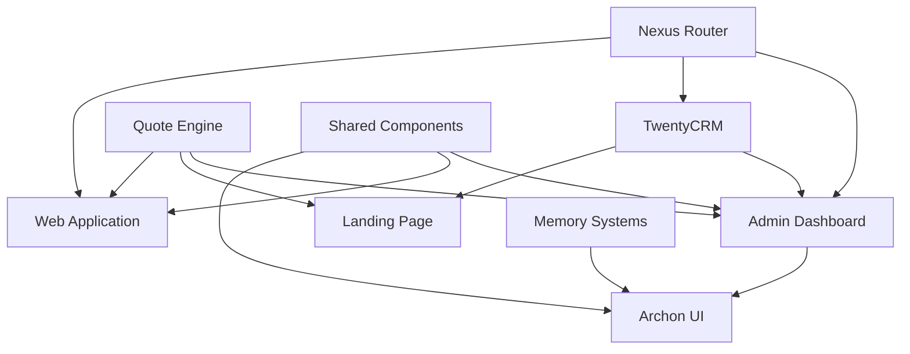

# Project Nyra - Apps Priority Matrix & Implementation Guide

## 🎯 **PRIORITY TIER 1: Critical Infrastructure (Complete First)**

### 1. **Admin Dashboard** (`/apps/admin`)
**Priority**: 🔴 **CRITICAL** - Primary operational interface
**Dependencies**: Nexus Router, TwentyCRM, Quote Engine
**Estimated Effort**: 3-4 weeks
**Features to Complete First**:
- [ ] Authentication & authorization
- [ ] Lead management grid (TwentyCRM integration)
- [ ] Quote desk with live rates
- [ ] Campaign builder with n8n integration
- [ ] Audit log viewer
- [ ] Embedded Dify chat

### 2. **Nexus Router Integration** (`/services/nexus-router`)
**Priority**: 🔴 **CRITICAL** - Gateway for all services
**Dependencies**: None (foundation service)
**Estimated Effort**: 1-2 weeks
**Features to Complete First**:
- [ ] GraphQL API gateway
- [ ] Service routing and load balancing
- [ ] Rate limiting and authentication
- [ ] Observability hooks (Grafana dashboards)

### 3. **TwentyCRM Integration** (`/apps/twenty`)
**Priority**: 🔴 **CRITICAL** - System of record
**Dependencies**: Nexus Router
**Estimated Effort**: 2-3 weeks
**Features to Complete First**:
- [ ] Lead data model integration
- [ ] Opportunity pipeline workflow
- [ ] Contact management
- [ ] Custom fields for mortgage data

---

## 🎯 **PRIORITY TIER 2: Core Platform (Complete Second)**

### 4. **Landing Page Ecosystem** (`/apps/landing`)
**Priority**: 🟡 **HIGH** - Lead generation entry point
**Dependencies**: Quote Engine, Lead Capture API
**Estimated Effort**: 1-2 weeks (already 80% complete)
**Features to Complete First**:
- [x] Ellis Andersen personal branding (COMPLETE)
- [ ] A/B testing framework
- [ ] Lead scoring integration
- [ ] Email capture optimization

### 5. **Web Application** (`/apps/webapp`)
**Priority**: 🟡 **HIGH** - Borrower-facing interface
**Dependencies**: Quote Engine, Document Management
**Estimated Effort**: 3-4 weeks
**Features to Complete First**:
- [ ] Borrower portal with authentication
- [ ] Document upload and verification
- [ ] Application progress tracking
- [ ] Real-time quote updates
- [ ] Compliance disclosure delivery

### 6. **Archon UI** (`/apps/archon-ui`)
**Priority**: 🟡 **HIGH** - Cross-session project management
**Dependencies**: Archon OS, Memory Systems
**Estimated Effort**: 2-3 weeks
**Features to Complete First**:
- [ ] Project workspace interface
- [ ] Task and workflow visualization
- [ ] Agent coordination dashboard
- [ ] Memory browser and search

---

## 🎯 **PRIORITY TIER 3: Enhancement & Optimization (Complete Third)**

### 7. **Shared Components** (`/apps/shared`)
**Priority**: 🟢 **MEDIUM** - Cross-app consistency
**Dependencies**: UI Libraries (shadcn, magicUI)
**Estimated Effort**: 1-2 weeks
**Features to Complete First**:
- [ ] Unified design system
- [ ] Reusable UI components
- [ ] Common hooks and utilities
- [ ] Shared validation schemas

### 8. **Ingestion Tools** (`/apps/ingestion`)
**Priority**: 🟢 **MEDIUM** - Data processing workflows
**Dependencies**: Research tools, Document processing
**Estimated Effort**: 2-3 weeks
**Features to Complete First**:
- [ ] Document processing pipelines
- [ ] Data transformation tools
- [ ] Export/import utilities
- [ ] Research aggregation tools

### 9. **Developer Utilities** (`/apps/utilities`)
**Priority**: 🟢 **LOW** - Developer experience
**Dependencies**: None
**Estimated Effort**: 1 week
**Features to Complete First**:
- [ ] Code generation tools
- [ ] Development scripts
- [ ] Testing utilities
- [ ] Deployment helpers

---

## 📊 **IMPLEMENTATION STRATEGY**

### Phase 1: Foundation (Weeks 1-4)
1. **Admin Dashboard** - Core UI structure + authentication
2. **Nexus Router** - Basic routing + health checks
3. **TwentyCRM** - Data model + basic CRUD

### Phase 2: Integration (Weeks 5-8)
1. **Admin Dashboard** - Lead management + quote desk
2. **Landing Page** - A/B testing + lead scoring
3. **Web Application** - Borrower portal basics

### Phase 3: Advanced Features (Weeks 9-12)
1. **Admin Dashboard** - Campaign builder + audit logs
2. **Archon UI** - Project management interface
3. **Web Application** - Document workflow + compliance

### Phase 4: Polish & Scale (Weeks 13+)
1. **Shared Components** - Design system consolidation
2. **Ingestion Tools** - Advanced data processing
3. **Performance optimization** across all apps

---

## 🔗 **FEATURE DEPENDENCY MAP**

---

## 🎨 **UI/UX CONSISTENCY STANDARDS**

### Design System Priority:
1. **shadcn/ui** - Base component library (Tier 1)
2. **magicUI** - Enhanced animations (Tier 2)
3. **Tailwind CSS** - Utility styling (All tiers)
4. **Lucide React** - Icon system (All tiers)

### Color Scheme (From Landing Page):
- **Primary**: Cyan (`#06b6d4`) for actions and links
- **Secondary**: Violet (`#8b5cf6`) for highlights
- **Background**: Dark slate (`#0f172a`, `#1e293b`)
- **Text**: Slate variants (`#f1f5f9`, `#cbd5e1`, `#64748b`)

---

## 🚀 **SUCCESS METRICS**

### Tier 1 Completion Criteria:
- [ ] Admin can manage leads end-to-end
- [ ] Quotes generate in <2 seconds
- [ ] All services route through Nexus
- [ ] Campaign deployment works via UI

### Tier 2 Completion Criteria:
- [ ] Borrowers can complete applications
- [ ] Landing page converts at 3%+
- [ ] Archon manages cross-session state
- [ ] Real-time updates work across platform

### Tier 3 Completion Criteria:
- [ ] 95%+ component reuse across apps
- [ ] Sub-second app load times
- [ ] Full compliance audit trail
- [ ] Zero-downtime deployments

---

**Last Updated**: 2026-03-10
**Next Review**: Weekly during implementation

This matrix will guide all development priorities and ensure we build the most critical functionality first while maintaining architectural consistency across all applications.
