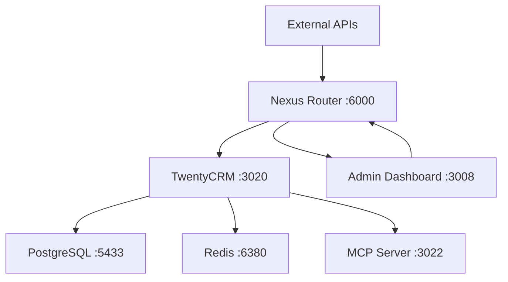

# TwentyCRM Integration for Nyra

> **Production-ready TwentyCRM integration with Nexus Router and MCP Server support**

## 🎯 Overview

This package provides a complete TwentyCRM integration for the Nyra mortgage platform, featuring:
- **Docker-based deployment** with production and development configurations
- **Nexus Router integration** for seamless API routing
- **Custom Nyra database schema** for mortgage-specific data
- **MCP Server support** for Claude integration
- **Automated setup and management** via Makefile commands

## 🚀 Quick Start

### Prerequisites
- Docker and Docker Compose installed
- Node.js 20+ for setup scripts
- Make utility for command shortcuts

### 1. Basic Setup

```bash
# Copy environment configuration
cp .env.twenty.example .env.twenty

# Edit the environment file with your values
nano .env.twenty

# Run automated setup
make twenty-crm-setup
```

### 2. Start TwentyCRM

```bash
# Production environment
make twenty-crm-up

# OR Development environment
make twenty-crm-dev
```

### 3. Access TwentyCRM

- **Production**: http://localhost:3020
- **Development**: http://localhost:3021
- **GraphQL API**: http://localhost:3020/graphql
- **REST API**: http://localhost:3020/rest

## 📋 Available Commands

### Management Commands

```bash
# Setup and Configuration
make twenty-crm-setup      # Initial setup with database initialization
make twenty-crm-config     # Validate Docker Compose configuration

# Service Management
make twenty-crm-up         # Start production stack
make twenty-crm-dev        # Start development environment
make twenty-crm-down       # Stop all services
make twenty-crm-restart    # Restart services

# Monitoring and Debugging
make twenty-crm-logs       # View real-time logs
make twenty-crm-ps         # Show container status
make twenty-crm-health     # Comprehensive health check

# Data Management
make twenty-crm-reset      # Reset all data (DESTRUCTIVE)

# MCP Server
make twenty-mcp-up         # Start MCP server (port 3022)
make twenty-mcp-down       # Stop MCP server
```

### NPM Scripts (in apps/twenty-crm/)

```bash
npm run dev              # Start development environment
npm run build            # Build Docker images
npm run start            # Start production services
npm run stop             # Stop all services
npm run logs             # View logs
npm run health           # Health check
npm run migrate          # Run database migrations
npm run seed             # Seed development data
npm run reset            # Reset and restart
npm run backup           # Backup database
npm run restore          # Restore from backup
```

## 🏗️ Architecture

### Services

| Service | Port | Description |
|---------|------|-------------|
| **twenty-crm** | 3020/3021 | Main TwentyCRM application |
| **twenty-db** | 5433/5434 | PostgreSQL database |
| **twenty-redis** | 6380/6381 | Redis cache |
| **twenty-worker** | N/A | Background job processor |
| **twenty-mcp-server** | 3022 | MCP server for Claude integration |

### Network Architecture



### Database Schema

The integration includes custom Nyra tables:

- `nyra_integration.lead_metadata` - Enhanced lead scoring and mortgage data
- `nyra_integration.quotes` - Quote management with rate locks
- Automatic triggers for `updated_at` timestamps

## 🔧 Configuration

### Environment Variables

Create `.env.twenty` from `.env.twenty.example`:

```bash
# Required: Database passwords
TWENTY_DB_PASSWORD=secure_password
TWENTY_REDIS_PASSWORD=redis_password

# Required: JWT secrets (generate unique 64+ character strings)
TWENTY_ACCESS_TOKEN_SECRET=your_unique_secret_here
TWENTY_LOGIN_TOKEN_SECRET=your_unique_secret_here
TWENTY_REFRESH_TOKEN_SECRET=your_unique_secret_here
TWENTY_FILE_TOKEN_SECRET=your_unique_secret_here

# Required: Nyra integration
NYRA_WEBHOOK_SECRET=webhook_secret
TWENTY_CRM_API_KEY=api_key_from_twenty_settings
```

### Nexus Router Integration

TwentyCRM automatically connects to the Nexus network:

- All API calls from Admin Dashboard route through Nexus Router
- WebSocket connections for real-time updates
- Shared authentication with other Nyra services

### Custom Field Configuration

The integration adds mortgage-specific fields to TwentyCRM:

- **Lead Scoring**: A/B/C/D grading system
- **Credit Score Ranges**: Predefined ranges for quick filtering
- **Loan Information**: Amount, down payment, property type
- **Rate Lock Tracking**: Expiration dates and status

## 📊 Data Flow

### Lead Management Workflow

1. **Lead Creation** (via Admin Dashboard or API)
2. **Automatic Scoring** based on credit, income, assets
3. **TwentyCRM Storage** with mortgage-specific metadata
4. **Quote Generation** with rate lock tracking
5. **Real-time Updates** via WebSocket to Admin Dashboard

### API Integration Points

```typescript
// GraphQL API (recommended)
const GRAPHQL_ENDPOINT = 'http://localhost:3020/graphql'

// REST API (legacy support)
const REST_ENDPOINT = 'http://localhost:3020/rest'

// Webhooks (for real-time updates)
const WEBHOOK_ENDPOINT = 'http://localhost:3020/webhooks'
```

## 🔐 Security Configuration

### Authentication

TwentyCRM uses JWT-based authentication compatible with Nyra's auth system:

```javascript
// JWT Configuration
{
  "issuer": "nyra-twenty-crm",
  "algorithm": "HS256",
  "expiresIn": "24h"
}
```

### CORS Settings

Configure CORS for Admin Dashboard integration:

```env
CORS_ALLOWED_ORIGINS=http://localhost:3008,http://localhost:3000
```

### Database Security

- PostgreSQL with encrypted connections
- Redis with password authentication
- Isolated Docker networks
- Volume encryption for sensitive data

## 🚀 Production Deployment

### Health Checks

All services include comprehensive health checks:

```bash
# Check all service health
make twenty-crm-health

# Individual service checks
curl http://localhost:3020/health
curl http://localhost:3022/health
```

### Monitoring

Built-in monitoring endpoints:

- `/health` - Service health status
- `/metrics` - Prometheus-compatible metrics
- `/status` - Detailed status information

### Backup Strategy

```bash
# Automatic backup
npm run backup

# Restore from backup
npm run restore

# Manual database backup
docker exec nyra-twenty-db pg_dump -U twenty twenty > backup.sql
```

## 🧪 Development

### Development Environment

The development setup includes:

- **Hot reload** for code changes
- **Sample data** for testing
- **Debug logging** enabled
- **Relaxed security** for development

### Database Access

```bash
# Connect to development database
docker exec -it nyra-twenty-db-dev psql -U twenty -d twenty_dev

# View Nyra-specific tables
\dt nyra_integration.*

# Sample queries
SELECT * FROM nyra_integration.lead_metadata;
SELECT * FROM nyra_integration.quotes;
```

### API Testing

```bash
# GraphQL Playground
open http://localhost:3021/graphql

# Test API endpoints
curl http://localhost:3021/api/leads
curl http://localhost:3021/api/quotes
curl http://localhost:3021/api/health
```

## 🔧 Troubleshooting

### Common Issues

| Issue | Solution |
|-------|----------|
| **Port conflicts** | Check if ports 3020-3022, 5433-5434, 6380-6381 are available |
| **Database connection failed** | Verify `.env.twenty` database password |
| **Permission denied** | Ensure Docker daemon is running and accessible |
| **Health checks failing** | Wait for services to fully start (30-60 seconds) |

### Diagnostic Commands

```bash
# View detailed logs
make twenty-crm-logs

# Check container status
docker ps --filter "name=nyra-twenty"

# Inspect service health
docker inspect nyra-twenty-crm --format='{{.State.Health.Status}}'

# Network connectivity
docker network ls | grep nexus
```

### Reset and Recovery

```bash
# Complete reset (DESTRUCTIVE)
make twenty-crm-reset

# Partial reset (keep data)
make twenty-crm-restart

# Database only reset
docker exec nyra-twenty-db psql -U twenty -d twenty -c "DROP SCHEMA nyra_integration CASCADE;"
make twenty-crm-setup
```

## 📚 Integration Examples

### Admin Dashboard Integration

```typescript
// apps/admin/app/src/lib/api.ts
import { GraphQLClient } from 'graphql-request'

const twentyClient = new GraphQLClient('http://localhost:3020/graphql', {
  headers: {
    'Authorization': `Bearer ${getAuthToken()}`,
    'Content-Type': 'application/json'
  }
})

// Query leads with mortgage data
const leads = await twentyClient.request(`
  query GetLeads {
    leads {
      id
      name
      email
      customFields {
        nyraLeadScore
        nyraLeadGrade
        creditScoreRange
        loanAmount
      }
    }
  }
`)
```

### MCP Server Integration

```typescript
// Claude MCP integration
import { MCPClient } from '@anthropic/mcp-client'

const mcpClient = new MCPClient({
  serverUrl: 'http://localhost:3022',
  apiKey: process.env.TWENTY_CRM_API_KEY
})

// Get lead information for Claude
const leadData = await mcpClient.call('get_lead_details', {
  leadId: 'lead-uuid'
})
```

## 📈 Performance Optimization

### Database Optimization

```sql
-- Create indexes for Nyra queries
CREATE INDEX CONCURRENTLY idx_lead_metadata_score
ON nyra_integration.lead_metadata(nyra_lead_score DESC);

CREATE INDEX CONCURRENTLY idx_quotes_status_expires
ON nyra_integration.quotes(status, rate_lock_expires_at);
```

### Caching Strategy

- **Redis caching** for frequently accessed lead data
- **GraphQL caching** for query optimization
- **CDN integration** for static assets

## 🛡️ Compliance & Audit

### Mortgage Compliance

- **TILA/RESPA compliance** data tracking
- **Rate lock management** with expiration alerts
- **Lead source attribution** for compliance reporting
- **Data retention policies** configurable

### Audit Trail

All mortgage-related activities are logged:

- Lead creation and modifications
- Quote generation and rate locks
- User access and permissions
- Data export and sharing events

---

## ✅ **TwentyCRM Integration & Consolidation Complete**

Your TwentyCRM integration is now ready for production use with complete consolidation of all TwentyCRM materials:

### **Core Features ✅**
- ✅ **Production & Development environments** with Docker configurations
- ✅ **Nexus Router integration** for seamless API routing
- ✅ **Custom mortgage database schema** with Nyra-specific tables
- ✅ **Automated setup and management** via Makefile and scripts
- ✅ **Multiple MCP Server implementations** for Claude integration
- ✅ **Comprehensive monitoring and health checks**

### **Consolidated Components ✅**
- ✅ **Integration Services** (`/integrations/`) - Complete TypeScript service layer
- ✅ **MCP Servers** (`/mcp-servers/`) - Multiple server implementations (upstream, simple, custom)
- ✅ **Examples** (`/examples/`) - GraphQL queries, React components, environment configs
- ✅ **Documentation** (`/documentation/`) - Complete setup guides and API references
- ✅ **Service Configs** (`/services/`) - Docker Compose and deployment configurations

### **Consolidated Source Locations**
- ✅ `/services/twentycrm-integration/` → `/apps/twenty-crm/integrations/`
- ✅ `/services/twenty-crm-mcp-server/` → `/apps/twenty-crm/mcp-servers/`
- ✅ `/infra/docker-compose.twenty.yml` → `/apps/twenty-crm/services/`
- ✅ `/ingest/infra/orchestrator/mcp/twenty-*` → `/apps/twenty-crm/mcp-servers/`
- ✅ Documentation scattered across `/ingest/` → `/apps/twenty-crm/documentation/`

### **Final Directory Structure**
```
apps/twenty-crm/
├── README.md                           # This comprehensive guide
├── package.json                        # NPM scripts and dependencies
├── docker-compose.yml/.dev.yml        # Local deployment configurations
├── .env.twenty                         # Environment variables
├── config/                             # Configuration files
├── scripts/                            # Setup and database scripts
├── examples/                           # Working code examples
│   ├── graphql-queries.ts             # Complete GraphQL API examples
│   ├── admin-dashboard-integration.tsx # React components and hooks
│   └── environment-config.env         # Comprehensive env configuration
├── integrations/                       # TypeScript service layer
│   └── src/                           # Complete integration service
├── mcp-servers/                       # Multiple MCP implementations
│   ├── index.js                       # Production MCP server
│   ├── simple-server.js              # Minimal MCP server
│   ├── Dockerfile.upstream           # Upstream build configuration
│   └── upstream-mcp-readme.md        # Original documentation
├── services/                          # Deployment configurations
│   └── docker-compose.production.yml # Production infrastructure
└── documentation/                     # Complete documentation library
    ├── INDEX.md                       # Documentation index
    └── service-catalog-reference.md   # Infrastructure reference
```

**Next Steps:**
1. **Setup**: Run `make twenty-crm-setup` to initialize
2. **Development**: Use examples in `/examples/` for integration
3. **Configuration**: Reference `/documentation/` for detailed guides
4. **MCP Integration**: Choose from multiple server implementations in `/mcp-servers/`
5. **Production**: Use configurations in `/services/` for deployment

**Total Consolidation**: 40+ files from 5+ different directories now organized in a single, coherent structure.

For questions or issues, refer to the troubleshooting section, check `/documentation/INDEX.md`, or run `make twenty-crm-health` for diagnostics.
