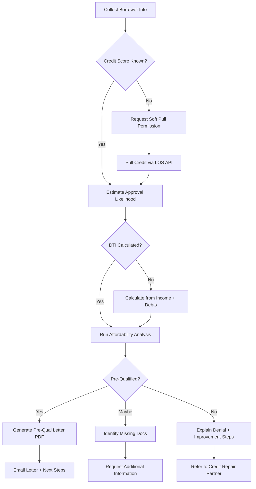

# Nyra AI Assistant - Feature Specifications

## Executive Summary
Nyra is an advanced AI-powered mortgage assistant built on Claude-Flow orchestration with Archon multi-agent coordination. Nyra serves as the intelligent interface for mortgage operations, handling lead qualification, customer support, document processing, compliance checks, and workflow automation for Ellis D Andersen LLC and West Capital Lending.

---

## System Architecture

### Core Components
```
┌─────────────────────────────────────────────────────────┐
│                    Nyra AI Assistant                     │
├─────────────────────────────────────────────────────────┤
│                                                          │
│  ┌─────────────┐  ┌─────────────┐  ┌─────────────┐   │
│  │   Claude    │  │   Archon    │  │Claude-Flow  │   │
│  │  Provider   │  │   MCP       │  │ Orchestrator│   │
│  └─────────────┘  └─────────────┘  └─────────────┘   │
│                                                          │
│  ┌─────────────┐  ┌─────────────┐  ┌─────────────┐   │
│  │   Memory    │  │   Swarm     │  │   Neural    │   │
│  │   System    │  │Coordination │  │  Patterns   │   │
│  └─────────────┘  └─────────────┘  └─────────────┘   │
│                                                          │
└─────────────────────────────────────────────────────────┘
                          │
         ┌────────────────┼────────────────┐
         │                │                │
    ┌────▼─────┐    ┌────▼─────┐    ┌────▼─────┐
    │ Open-    │    │  Loab.   │    │  Voice   │
    │ WebUI    │    │  Chat    │    │  Agent   │
    └──────────┘    └──────────┘    └──────────┘
```

---

## Feature Categories

## 1. Conversational AI & Natural Language Understanding

### F-001: Multi-Channel Communication
**Priority**: CRITICAL

#### Capabilities
- **Web Chat Interface**: Embedded on RateHunter.net via Open-WebUI/Loab.Chat
- **SMS Conversations**: Two-way messaging via Twilio integration
- **Email Understanding**: Parse and respond to email inquiries
- **Voice Integration**: Voicemod API for phone conversations with Kyutai Unmute enhancement

#### Acceptance Criteria
- [ ] Seamless context switching across channels
- [ ] Conversation history maintained in unified timeline
- [ ] Real-time response latency < 2 seconds
- [ ] Support for interruptions and clarifications
- [ ] Multilingual support (English, Spanish)

#### Example Conversation Flow
```
User: "I need to refinance my home"
Nyra: "I can definitely help with that! To give you the best options,
       I need a few details:
       1. What's your current home value?
       2. How much do you owe on your current mortgage?
       3. What's your current interest rate?
       4. What's your goal - lower payment, cash-out, or shorter term?"

User: "Home worth 500k, owe 300k, rate is 7.5%, want lower payment"
Nyra: "Great! Based on current rates, I estimate you could refinance to
       around 6.75%, saving you approximately $225/month. That's $2,700/year!

       Would you like me to:
       A) Connect you with Ellis for a detailed analysis
       B) Send you a full quote via email
       C) Answer more questions about the process"
```

---

### F-002: Intent Recognition & Slot Filling
**Priority**: HIGH

#### Intent Categories
1. **Lead Qualification**
   - First-time homebuyer inquiry
   - Refinance interest
   - Commercial property financing
   - Pre-approval request

2. **Customer Support**
   - Loan status check
   - Document requirements
   - Process timeline questions
   - Rate lock inquiries

3. **Informational**
   - Mortgage education
   - Program eligibility
   - Credit score impact
   - Market conditions

#### Slot Extraction
```typescript
interface ConversationState {
  intent: string;
  slots: {
    loan_type?: 'purchase' | 'refinance' | 'heloc' | 'commercial';
    loan_amount?: number;
    property_value?: number;
    credit_score?: string;
    down_payment?: number;
    timeframe?: string;
    zip_code?: string;
    employment_status?: string;
    income?: number;
  };
  confidence: number;
  next_question?: string;
}
```

#### Acceptance Criteria
- [ ] 95%+ intent classification accuracy
- [ ] Progressive slot filling with contextual questions
- [ ] Disambiguation for ambiguous queries
- [ ] Slot validation with helpful error messages
- [ ] Ability to correct previously provided information

---

### F-003: Context Management & Memory
**Priority**: CRITICAL

#### Memory Types
1. **Short-Term Memory**: Current conversation context (last 10 turns)
2. **Session Memory**: Full conversation history (current session)
3. **Long-Term Memory**: Customer profile, preferences, past interactions
4. **Procedural Memory**: Mortgage workflows, compliance rules, best practices

#### Implementation
```typescript
interface NyraMemory {
  conversationId: string;
  userId?: string;
  shortTerm: {
    turns: ConversationTurn[];
    currentTopic: string;
    pendingQuestions: string[];
  };
  session: {
    startTime: Date;
    channelSequence: string[]; // ['web', 'sms', 'phone']
    resolvedIntents: string[];
  };
  longTerm: {
    customerProfile?: CustomerProfile;
    pastLoans: LoanHistory[];
    preferences: UserPreferences;
    interactionCount: number;
  };
}
```

#### Acceptance Criteria
- [ ] Retain context across 50+ conversation turns
- [ ] Resume conversations after channel switch
- [ ] Access historical interactions for returning customers
- [ ] Personalize responses based on customer profile
- [ ] GDPR/CCPA compliant memory retention (30-day purge for non-leads)

---

## 2. Lead Qualification & Scoring

### F-004: Intelligent Lead Scoring
**Priority**: HIGH

#### Scoring Factors
| Factor | Weight | Scoring Logic |
|--------|--------|---------------|
| Credit Score | 25% | 800+: 100, 740-799: 85, 670-739: 70, 580-669: 50, <580: 30 |
| Loan-to-Value | 20% | <80%: 100, 80-90%: 80, 90-95%: 60, >95%: 40 |
| Debt-to-Income | 20% | <36%: 100, 36-43%: 80, 43-50%: 50, >50%: 20 |
| Timeframe | 15% | Immediate: 100, 1-3mo: 80, 3-6mo: 50, Exploratory: 20 |
| Engagement | 10% | Quick replies: 100, Responsive: 80, Slow: 50 |
| Employment | 10% | 2+ yrs: 100, 1-2yrs: 80, <1yr: 50, Unemployed: 10 |

#### Lead Classification
```typescript
enum LeadTier {
  HOT = 'hot',           // Score 85-100: Immediate follow-up
  WARM = 'warm',         // Score 70-84: 24-hour follow-up
  COLD = 'cold',         // Score 50-69: Nurture campaign
  UNQUALIFIED = 'unqual' // Score <50: Education content
}

interface LeadScore {
  overall: number;
  tier: LeadTier;
  breakdown: {
    factor: string;
    value: any;
    score: number;
    weight: number;
  }[];
  recommendations: string[];
  nextBestAction: string;
}
```

#### Acceptance Criteria
- [ ] Real-time scoring as information is collected
- [ ] Transparent scoring explanation for broker review
- [ ] Automatic CRM tagging based on tier
- [ ] Alert Ellis for HOT leads within 5 minutes
- [ ] A/B test scoring algorithm and optimize monthly

---

### F-005: Pre-Qualification Automation
**Priority**: HIGH

#### Workflow


#### Pre-Qualification Outputs
1. **Approved**:
   - Pre-qualification letter (PDF)
   - Recommended loan programs
   - Next steps: Document checklist
   - Estimated closing timeline

2. **Conditional**:
   - Missing information list
   - Additional docs required
   - Expiration date (90 days)

3. **Denied**:
   - Explanation of denial reasons
   - Credit improvement plan
   - Referral to credit counseling
   - Timeline to reapply

#### Acceptance Criteria
- [ ] 10-minute end-to-end pre-qualification
- [ ] Integration with Encompass/Calyx LOS
- [ ] Soft credit pull with borrower consent
- [ ] Automated DTI calculation with debt import
- [ ] Generate branded pre-qual letter PDF
- [ ] Email delivery with tracking

---

## 3. Document Processing & OCR

### F-006: Intelligent Document Upload
**Priority**: HIGH

#### Supported Documents
- W-2 forms (2 years)
- Pay stubs (2 recent months)
- Bank statements (2 months)
- Tax returns (2 years with schedules)
- Asset statements (401k, IRA, stocks)
- Property appraisals
- Purchase agreements
- HOA documents
- Driver's license / ID

#### OCR Capabilities
```typescript
interface DocumentExtraction {
  documentType: string;
  confidence: number;
  extractedData: {
    w2?: {
      employerName: string;
      employerEIN: string;
      wages: number;
      federalTax: number;
      year: number;
    };
    paystub?: {
      grossPay: number;
      netPay: number;
      ytdGross: number;
      payPeriodEnd: Date;
      deductions: Deduction[];
    };
    bankStatement?: {
      accountHolder: string;
      accountNumber: string;
      balance: number;
      statementDate: Date;
      transactions: Transaction[];
    };
  };
  validationErrors: string[];
  requiresHumanReview: boolean;
}
```

#### Processing Pipeline
1. **Upload**: Drag-drop or mobile camera capture
2. **Classification**: Auto-detect document type (CNN model)
3. **OCR**: Text extraction (Tesseract + AWS Textract)
4. **Validation**: Cross-reference extracted data for consistency
5. **Storage**: Encrypted S3 bucket with 7-year retention
6. **Indexing**: Full-text search in CRM

#### Acceptance Criteria
- [ ] 97%+ OCR accuracy for printed text
- [ ] Support for handwritten notes (lower accuracy acceptable)
- [ ] Auto-rotate and deskew images
- [ ] Highlight missing required documents
- [ ] Flag inconsistencies (e.g., income mismatch between W-2 and paystub)
- [ ] Redact sensitive data (SSN, account numbers) in audit logs

---

### F-007: Smart Document Checklist
**Priority**: MEDIUM

#### Dynamic Requirements
```typescript
interface DocumentChecklist {
  loanType: string;
  borrowerType: 'W2' | 'self-employed' | 'retired';
  requiredDocs: DocumentRequirement[];
  conditionalDocs: DocumentRequirement[];
  progress: number; // percentage complete
}

interface DocumentRequirement {
  name: string;
  description: string;
  examples: string[];
  status: 'missing' | 'uploaded' | 'verified' | 'rejected';
  rejectionReason?: string;
  alternatives?: string[];
}
```

#### Example Checklist for W-2 Borrower
```
Required Documents (8/10 uploaded):
✅ Driver's License
✅ 2 Recent Pay Stubs
✅ 2023 W-2
✅ 2022 W-2
✅ 2 Months Bank Statements - Checking
✅ 2 Months Bank Statements - Savings
✅ Purchase Agreement
✅ Proof of Down Payment Source
❌ Homeowners Insurance Quote (needed to proceed)
❌ HOA Financials (if applicable)

Conditional Documents:
- Gift Letter (if down payment from family)
- Explanation Letter for credit inquiries
```

#### Acceptance Criteria
- [ ] Checklist adapts based on loan type and borrower profile
- [ ] Real-time progress tracking
- [ ] Email/SMS reminders for missing documents
- [ ] Mobile-friendly upload interface
- [ ] Version control for re-uploaded documents

---

## 4. Compliance & Regulatory Automation

### F-008: Real-Time Compliance Checks
**Priority**: CRITICAL

#### Compliance Areas
1. **TILA (Truth in Lending Act)**
   - APR calculation verification
   - Finance charge accuracy
   - 3-day disclosure delivery
   - Prepayment penalty disclosure

2. **RESPA (Real Estate Settlement Procedures Act)**
   - Affiliated business disclosures
   - GFE delivery timeline
   - Kickback prohibition
   - Settlement statement accuracy

3. **Fair Lending**
   - Non-discriminatory language
   - Equal treatment verification
   - HMDA data collection
   - Adverse action notices

4. **TCPA (Telephone Consumer Protection Act)**
   - Marketing consent tracking
   - Do Not Call registry checks
   - Opt-out mechanisms

#### Automated Checks
```typescript
interface ComplianceCheck {
  checkType: string;
  rule: string;
  status: 'pass' | 'fail' | 'warning';
  details: string;
  remediation?: string;
  blockingIssue: boolean;
}

// Example checks
const complianceChecks: ComplianceCheck[] = [
  {
    checkType: 'TILA',
    rule: 'APR within 0.125% of calculated value',
    status: 'pass',
    details: 'Calculated: 6.875%, Disclosed: 6.900%',
    blockingIssue: false
  },
  {
    checkType: 'RESPA',
    rule: 'GFE delivered within 3 business days',
    status: 'warning',
    details: 'Application received 2 days ago, GFE not yet sent',
    remediation: 'Generate and email GFE today',
    blockingIssue: false
  },
  {
    checkType: 'Fair Lending',
    rule: 'HMDA data complete',
    status: 'fail',
    details: 'Missing: Ethnicity, Race',
    remediation: 'Request borrower to complete demographic questionnaire',
    blockingIssue: true
  }
];
```

#### Acceptance Criteria
- [ ] Real-time checks at each loan milestone
- [ ] Dashboard for compliance status
- [ ] Automated alerts for compliance violations
- [ ] Integration with LOS for data accuracy
- [ ] Audit trail for all compliance actions
- [ ] Monthly compliance reports for management

---

### F-009: Adverse Action Notice Automation
**Priority**: HIGH

#### Trigger Conditions
- Loan denial
- Credit limit reduction
- Rate increase above quoted
- Conditional approval (not full approval)

#### Notice Generation
```typescript
interface AdverseActionNotice {
  borrowerId: string;
  loanApplicationId: string;
  actionType: 'denial' | 'counteroffer' | 'conditional';
  reasons: AdverseActionReason[];
  creditBureauInfo: {
    name: string;
    address: string;
    phone: string;
    disputeRights: string;
  };
  generatedAt: Date;
  deliveryMethod: 'mail' | 'email';
  deliveryDate: Date;
}

interface AdverseActionReason {
  code: string;
  description: string;
  fromCreditReport: boolean;
}

// Example reasons
const commonReasons = [
  { code: 'CR1', description: 'Credit score below minimum', fromCreditReport: true },
  { code: 'DTI', description: 'Debt-to-income ratio too high', fromCreditReport: false },
  { code: 'INS', description: 'Insufficient income', fromCreditReport: false },
  { code: 'EMH', description: 'Limited employment history', fromCreditReport: false },
  { code: 'DEL', description: 'Delinquencies on credit report', fromCreditReport: true },
];
```

#### Acceptance Criteria
- [ ] Automatically detect adverse action triggers
- [ ] Generate notice within 30 days of action
- [ ] Include specific reasons (minimum 4)
- [ ] Provide credit bureau contact info
- [ ] Track delivery confirmation
- [ ] Store in secure compliance repository

---

## 5. Workflow Automation & Orchestration

### F-010: Multi-Agent Swarm Coordination
**Priority**: HIGH

#### Agent Types & Roles
```typescript
enum AgentType {
  LEAD_QUALIFIER = 'lead-qualifier',
  DOCUMENT_PROCESSOR = 'doc-processor',
  COMPLIANCE_CHECKER = 'compliance-checker',
  PRICING_ANALYST = 'pricing-analyst',
  UNDERWRITER_ASSISTANT = 'underwriter-assistant',
  CLOSING_COORDINATOR = 'closing-coordinator'
}

interface AgentCapabilities {
  type: AgentType;
  skills: string[];
  maxConcurrentTasks: number;
  averageProcessingTime: number;
  successRate: number;
}
```

#### Swarm Topologies for Mortgage Operations

##### 1. Centralized (Queen-Led) - For Complex Loans
```
                ┌───────────────┐
                │  Nyra Queen   │
                │  Coordinator  │
                └───────┬───────┘
                        │
        ┌───────────────┼───────────────┐
        │               │               │
   ┌────▼────┐    ┌────▼────┐    ┌────▼────┐
   │  Lead   │    │  Doc    │    │ Pricing │
   │Qualifier│    │Processor│    │ Analyst │
   └─────────┘    └─────────┘    └─────────┘
```
**Use Case**: Commercial loans, complex income situations

##### 2. Mesh (Peer-to-Peer) - For Standard Loans
```
┌──────────┐ ←──→ ┌──────────┐
│  Lead    │      │  Doc     │
│Qualifier │      │Processor │
└────┬─────┘ ←──→ └────┬─────┘
     │                  │
     ↓                  ↓
┌────────────┐ ←──→ ┌──────────┐
│ Compliance │      │ Pricing  │
│  Checker   │      │ Analyst  │
└────────────┘      └──────────┘
```
**Use Case**: Straightforward W-2 purchase transactions

#### Acceptance Criteria
- [ ] Auto-select topology based on loan complexity
- [ ] Dynamic agent spawning based on workload
- [ ] Byzantine fault tolerance for consensus decisions
- [ ] Real-time coordination latency < 500ms
- [ ] Graceful degradation if agent unavailable

---

### F-011: Task Orchestration & Priority Queuing
**Priority**: HIGH

#### Task Types & Priorities
```typescript
enum TaskType {
  LEAD_RESPONSE = 'lead-response',           // Priority: CRITICAL
  DOC_CLASSIFICATION = 'doc-classification', // Priority: HIGH
  COMPLIANCE_CHECK = 'compliance-check',     // Priority: CRITICAL
  QUOTE_GENERATION = 'quote-generation',     // Priority: HIGH
  FOLLOW_UP_EMAIL = 'follow-up-email',       // Priority: MEDIUM
  ANALYTICS_UPDATE = 'analytics-update'      // Priority: LOW
}

interface Task {
  id: string;
  type: TaskType;
  priority: 'critical' | 'high' | 'medium' | 'low';
  assignedAgent?: string;
  status: 'queued' | 'in-progress' | 'completed' | 'failed';
  dependencies: string[]; // Task IDs that must complete first
  createdAt: Date;
  startedAt?: Date;
  completedAt?: Date;
  result?: any;
}
```

#### Queue Management
- **CRITICAL**: < 1 minute SLA (lead responses, compliance failures)
- **HIGH**: < 5 minutes SLA (document processing, quotes)
- **MEDIUM**: < 1 hour SLA (follow-ups, notifications)
- **LOW**: < 24 hours SLA (analytics, reports)

#### Acceptance Criteria
- [ ] Priority-based task scheduling
- [ ] Dependency resolution before execution
- [ ] Retry logic for transient failures (3 attempts)
- [ ] Dead letter queue for permanent failures
- [ ] Real-time queue metrics dashboard

---

### F-012: Drip Campaign Automation
**Priority**: MEDIUM

#### Campaign Types
1. **New Lead Nurture** (7-day sequence)
   - Day 0: Welcome + quote (immediate)
   - Day 1: Educational content (Why pre-approval matters)
   - Day 3: Success story (similar customer testimonial)
   - Day 5: Rate update + CTA (limited time offer)
   - Day 7: Personal video from Ellis

2. **Pre-Approval Follow-Up** (30-day sequence)
   - Day 0: Pre-approval letter + next steps
   - Day 7: Check-in (any questions?)
   - Day 14: Rate lock reminder
   - Day 21: Realtor referral offer
   - Day 30: Expiration warning (pre-approval valid 90 days)

3. **Post-Close Delight** (12-month sequence)
   - Day 0: Thank you + review request
   - Day 30: First payment reminder
   - Day 90: Satisfaction survey
   - Day 180: Refinance opportunity check
   - Day 365: Anniversary + referral incentive

#### Dynamic Content Personalization
```typescript
interface EmailTemplate {
  id: string;
  name: string;
  subject: string; // Can include {{merge_tags}}
  body: string;    // HTML with {{merge_tags}}
  mergeTags: string[];
  sendConditions: CampaignCondition[];
}

interface CampaignCondition {
  field: string;
  operator: 'equals' | 'contains' | 'greater_than' | 'less_than';
  value: any;
}

// Example: Only send refinance email if interest rates dropped 0.5%+
const condition: CampaignCondition = {
  field: 'current_market_rate',
  operator: 'less_than',
  value: customer.locked_rate - 0.5
};
```

#### Acceptance Criteria
- [ ] Automated enrollment based on lead status
- [ ] Pause campaign if lead responds
- [ ] A/B test subject lines (50/50 split)
- [ ] Track opens, clicks, conversions
- [ ] Unsubscribe compliance (CAN-SPAM Act)
- [ ] SMS drip campaigns via Twilio

---

## 6. Voice & Phone Integration

### F-013: Voicemod + Kyutai Unmute Voice Agent
**Priority**: MEDIUM

#### Capabilities
- Inbound call handling
- Outbound call automation (for follow-ups)
- Voice-to-text transcription
- Sentiment analysis
- Real-time voice coaching for Ellis

#### Voice Flow
```
1. Inbound Call → Voicemod API
2. Nyra: "Hi! You've reached Ellis at West Capital Lending. How can I help?"
3. Caller: "I'm looking for a mortgage rate quote"
4. Nyra: "Great! I can help with that. To give you an accurate quote,
          may I ask a few quick questions?"
5. [Conversation continues with slot filling]
6. Nyra: "Based on what you shared, I estimate 6.75% APR. I'm sending
          a detailed quote to your email right now. Would you like to
          schedule a call with Ellis to discuss next steps?"
7. [Hand-off to human if requested, or end call with follow-up scheduled]
```

#### Acceptance Criteria
- [ ] Natural-sounding voice (OpenAI TTS or ElevenLabs)
- [ ] Interrupt handling (allow caller to interject)
- [ ] Background noise suppression
- [ ] Real-time transcription with <3 second latency
- [ ] Call recording for quality assurance
- [ ] Integration with CRM (log call notes)

---

## 7. Analytics & Reporting

### F-014: Nyra Performance Dashboard
**Priority**: MEDIUM

#### Key Metrics
```typescript
interface NyraMetrics {
  conversations: {
    total: number;
    byChannel: Record<string, number>;
    avgDuration: number; // seconds
    avgTurns: number;
  };
  leads: {
    captured: number;
    qualified: number;
    qualificationRate: number; // %
    avgScoreByTier: Record<LeadTier, number>;
  };
  automation: {
    tasksExecuted: number;
    successRate: number; // %
    avgProcessingTime: number; // seconds
    costSavingsEstimate: number; // USD
  };
  accuracy: {
    intentRecognition: number; // %
    ocrAccuracy: number; // %
    complianceViolations: number;
  };
  nps: {
    score: number; // -100 to 100
    responses: number;
    trend: 'up' | 'down' | 'flat';
  };
}
```

#### Visualization
- Line chart: Conversations per day
- Funnel chart: Lead → Qualified → Pre-Approved → Closed
- Heatmap: Peak conversation hours by day of week
- Word cloud: Most common customer questions

#### Acceptance Criteria
- [ ] Real-time dashboard with <10 second refresh
- [ ] Export to CSV/PDF for reports
- [ ] Custom date range selection
- [ ] Benchmarking against previous periods
- [ ] Alert thresholds (e.g., if qualification rate drops below 30%)

---

### F-015: A/B Testing Framework
**Priority**: LOW

#### Test Types
1. **Greeting Message Variants**
   - A: "Hi! I'm Nyra, Ellis's AI assistant."
   - B: "Hello! How can I help with your mortgage today?"
   - Measure: Response rate

2. **Slot Filling Order**
   - A: Ask credit score first
   - B: Ask loan amount first
   - Measure: Completion rate

3. **CTA Placement**
   - A: CTA after quote generation
   - B: CTA mid-conversation
   - Measure: Click-through rate

#### Implementation
```typescript
interface ABTest {
  id: string;
  name: string;
  variants: Variant[];
  allocation: Record<string, number>; // Variant ID → % traffic
  startDate: Date;
  endDate?: Date;
  hypothesis: string;
  primaryMetric: string;
  status: 'draft' | 'running' | 'paused' | 'completed';
}

interface Variant {
  id: string;
  name: string;
  config: any; // Variant-specific configuration
  conversions: number;
  impressions: number;
}
```

#### Acceptance Criteria
- [ ] Randomized traffic split (e.g., 50/50, 70/30)
- [ ] Statistical significance calculator
- [ ] Automatic winner declaration (95% confidence)
- [ ] Gradual rollout of winner to 100% traffic
- [ ] Historical test results archive

---

## 8. Security & Privacy

### F-016: Data Encryption & Protection
**Priority**: CRITICAL

#### Encryption Standards
- **At Rest**: AES-256 encryption for database and file storage
- **In Transit**: TLS 1.3 for all API communications
- **PII Tokenization**: Replace SSN, account numbers with tokens
- **Key Management**: AWS KMS or HashiCorp Vault

#### Access Controls
```typescript
enum Role {
  ADMIN = 'admin',             // Full access
  LOAN_OFFICER = 'loan-officer', // Customer data + loan operations
  PROCESSOR = 'processor',      // Document access, no sensitive PII
  AUDITOR = 'auditor',         // Read-only, compliance reports
  CUSTOMER = 'customer'        // Own data only
}

interface Permission {
  resource: string;
  actions: ('create' | 'read' | 'update' | 'delete')[];
}

const rolePermissions: Record<Role, Permission[]> = {
  [Role.ADMIN]: [
    { resource: '*', actions: ['create', 'read', 'update', 'delete'] }
  ],
  [Role.LOAN_OFFICER]: [
    { resource: 'leads', actions: ['create', 'read', 'update'] },
    { resource: 'loans', actions: ['create', 'read', 'update'] },
    { resource: 'documents', actions: ['create', 'read'] }
  ],
  // ... other roles
};
```

#### Acceptance Criteria
- [ ] Zero-knowledge encryption for customer data
- [ ] Multi-factor authentication for admin access
- [ ] IP whitelisting for API access
- [ ] Audit logging for all data access
- [ ] Automatic session timeout (15 minutes idle)
- [ ] Regular penetration testing (quarterly)

---

### F-017: GDPR & CCPA Compliance
**Priority**: HIGH

#### Data Subject Rights
1. **Right to Access**: Provide data export within 30 days
2. **Right to Rectification**: Allow customers to update info
3. **Right to Erasure**: Delete data upon request (with 7-year mortgage retention caveat)
4. **Right to Portability**: Export data in machine-readable format (JSON)
5. **Right to Object**: Opt-out of marketing communications

#### Implementation
```typescript
interface DataSubjectRequest {
  id: string;
  customerId: string;
  requestType: 'access' | 'rectification' | 'erasure' | 'portability' | 'objection';
  status: 'pending' | 'in-progress' | 'completed' | 'rejected';
  requestedAt: Date;
  completedAt?: Date;
  notes?: string;
}

async function handleDataErasure(customerId: string): Promise<void> {
  // Check if active loan exists
  const activeLoans = await getActiveLoans(customerId);
  if (activeLoans.length > 0) {
    throw new Error('Cannot delete data with active loans (regulatory retention)');
  }

  // Anonymize customer data
  await anonymizeCustomer(customerId);
  await deleteConversationHistory(customerId);
  await redactDocuments(customerId);
  await notifyThirdParties(customerId); // CRM, email service, etc.
}
```

#### Acceptance Criteria
- [ ] Self-service data access portal
- [ ] 30-day SLA for data export requests
- [ ] Cookie consent banner with granular controls
- [ ] Privacy policy in plain language
- [ ] DPA (Data Processing Agreement) with third-party vendors
- [ ] Annual privacy impact assessment

---

## 9. Integration Ecosystem

### F-018: LOS (Loan Origination System) Integration
**Priority**: CRITICAL

#### Supported Systems
1. **Encompass by ICE Mortgage Technology**
   - API: REST + SOAP
   - Features: Loan creation, document upload, status updates, pricing engine

2. **Calyx Point**
   - API: XML-based
   - Features: Lead import, application data, compliance checks

3. **Byte Software**
   - API: REST
   - Features: Loan pipeline, automated underwriting

#### Data Sync
```typescript
interface LOSIntegration {
  system: 'encompass' | 'calyx' | 'byte';
  syncFrequency: 'realtime' | 'hourly' | 'daily';
  endpoints: {
    createLoan: string;
    updateLoan: string;
    getLoanStatus: string;
    uploadDocument: string;
    runPricing: string;
  };
  authentication: {
    method: 'oauth2' | 'api_key' | 'basic';
    credentials: any;
  };
}

async function createLOSLoan(lead: Lead): Promise<string> {
  const loanData = {
    borrower: {
      firstName: lead.firstName,
      lastName: lead.lastName,
      email: lead.email,
      phone: lead.phone,
    },
    loanDetails: {
      amount: lead.loanAmount,
      purpose: lead.loanType,
      propertyAddress: lead.propertyAddress,
    },
    originationSource: 'RateHunter-Nyra'
  };

  const response = await losAPI.post('/loans', loanData);
  return response.data.loanId;
}
```

#### Acceptance Criteria
- [ ] Real-time lead push to LOS
- [ ] Bi-directional status sync (LOS → Nyra)
- [ ] Document upload automation
- [ ] Pricing engine integration for rate quotes
- [ ] Error handling with retry logic
- [ ] Idempotency to prevent duplicate loan creation

---

### F-019: CRM Integration
**Priority**: HIGH

#### Supported CRMs
1. **Salesforce**
2. **HubSpot**
3. **Zoho CRM**
4. **Custom PostgreSQL-based CRM**

#### Sync Operations
```typescript
interface CRMSync {
  operation: 'create' | 'update' | 'read';
  object: 'lead' | 'contact' | 'opportunity' | 'task';
  data: any;
  crmId?: string;
  nyraId: string;
  lastSyncAt: Date;
  syncStatus: 'success' | 'failed' | 'pending';
  errorMessage?: string;
}

// Example: Create lead in CRM when qualified
async function syncLeadToCRM(lead: Lead): Promise<void> {
  const crmLead = {
    FirstName: lead.firstName,
    LastName: lead.lastName,
    Email: lead.email,
    Phone: lead.phone,
    LeadSource: 'RateHunter',
    Status: 'New',
    Rating: lead.leadScore.tier,
    Custom_Fields: {
      Loan_Amount__c: lead.loanAmount,
      Loan_Type__c: lead.loanType,
      Nyra_Conversation_ID__c: lead.conversationId
    }
  };

  const response = await crmAPI.createLead(crmLead);
  await updateLeadMapping(lead.id, response.crmId);
}
```

#### Acceptance Criteria
- [ ] Automatic lead creation upon qualification
- [ ] Task creation for follow-up actions
- [ ] Activity logging (emails sent, calls made)
- [ ] Campaign attribution tracking
- [ ] Webhook listeners for CRM events
- [ ] Conflict resolution (CRM wins for manual edits)

---

## 10. Developer Experience

### F-020: Nyra API for External Integrations
**Priority**: MEDIUM

#### Public API Endpoints
```
POST   /api/v1/conversations        # Start new conversation
GET    /api/v1/conversations/:id    # Get conversation history
POST   /api/v1/conversations/:id/messages  # Send message to Nyra
GET    /api/v1/leads                # List leads (with filters)
POST   /api/v1/leads                # Create lead manually
GET    /api/v1/leads/:id/score      # Get lead score
POST   /api/v1/documents/upload     # Upload document
GET    /api/v1/documents/:id/ocr    # Get OCR results
POST   /api/v1/quotes/generate      # Generate mortgage quote
GET    /api/v1/analytics/metrics    # Get Nyra performance metrics
```

#### SDK Support
```typescript
// Node.js SDK
import { NyraClient } from 'nyra-sdk';

const nyra = new NyraClient({
  apiKey: process.env.NYRA_API_KEY,
  environment: 'production'
});

// Start conversation
const conversation = await nyra.conversations.create({
  channel: 'web',
  userId: 'user_123'
});

// Send message
const response = await nyra.conversations.sendMessage(conversation.id, {
  message: 'I want to refinance my home',
  metadata: {
    currentRate: 7.5,
    loanBalance: 300000
  }
});

console.log(response.nyraReply); // "I can help with that! To give you the best options..."
```

#### Acceptance Criteria
- [ ] RESTful API with OpenAPI 3.0 spec
- [ ] SDKs for Node.js, Python, PHP
- [ ] Webhook support for async events
- [ ] Rate limiting (1000 req/min per API key)
- [ ] API versioning (v1, v2, etc.)
- [ ] Comprehensive documentation with examples

---

## Success Metrics

### KPIs (Key Performance Indicators)
| Metric | Target | Measurement |
|--------|--------|-------------|
| Lead Qualification Rate | 70%+ | % of conversations resulting in qualified lead |
| Response Time | <2 sec | Time from user message to Nyra reply |
| Conversation Completion | 60%+ | % of conversations reaching slot-filling completion |
| NPS (Net Promoter Score) | 50+ | Customer satisfaction survey post-interaction |
| Cost Savings | $50K+/year | Estimated labor savings from automation |
| Accuracy | 95%+ | Intent recognition, OCR, compliance checks |

### Business Impact (12-Month Projections)
- **Leads Generated**: 10,000+
- **Qualified Leads**: 7,000+
- **Loans Closed**: 1,200+ (assuming 17% conversion)
- **Revenue Impact**: $1.2M+ (at $1K avg commission per loan)
- **Time Savings**: 2,000+ hours (vs manual processing)

---

## Deployment Roadmap

### Phase 1: MVP (Months 1-3)
- [x] Claude provider integration
- [x] Basic conversational AI (intent recognition, slot filling)
- [x] Web chat interface (Open-WebUI)
- [x] CRM integration (lead creation)
- [ ] Lead scoring algorithm
- [ ] Quote generation (manual rates)

### Phase 2: Automation (Months 4-6)
- [ ] Document OCR integration
- [ ] LOS integration (Encompass)
- [ ] Drip campaign automation
- [ ] SMS two-way messaging
- [ ] Voice agent (Voicemod + Kyutai Unmute)

### Phase 3: Intelligence (Months 7-9)
- [ ] Multi-agent swarm orchestration
- [ ] Neural pattern learning
- [ ] A/B testing framework
- [ ] Advanced analytics dashboard
- [ ] Self-learning from closed loans

### Phase 4: Scale (Months 10-12)
- [ ] Multi-language support
- [ ] White-label solution for other brokers
- [ ] Mobile app integration
- [ ] API marketplace launch
- [ ] 24/7 autonomous operation

---

## Related Documentation
- `RATEHUNTER_LANDING_PAGE.md` - Customer-facing interface
- `LEAD_DRIP_CAMPAIGNS.md` - Post-qualification nurturing
- `CRM_REQUIREMENTS.md` - Data management system
- `MORTGAGE_BROKER_WORKFLOWS.md` - Human-in-the-loop procedures

---

## Technical Stack

### Core AI
- **LLM Provider**: Anthropic Claude 3.5 Sonnet
- **Orchestration**: Claude-Flow v2.0.0-alpha.88
- **Multi-Agent**: Archon MCP + ruv-swarm
- **Memory**: AgentDB with HNSW indexing

### Infrastructure
- **Hosting**: AWS EC2 + Cloudflare Tunnel
- **Database**: PostgreSQL 14+ (CRM), SQLite (local state)
- **Cache**: Redis 7.0+
- **Queue**: RabbitMQ or AWS SQS
- **Storage**: AWS S3 (documents), encrypted at rest

### Integrations
- **LOS**: Encompass API, Calyx Point XML
- **OCR**: AWS Textract, Tesseract
- **SMS**: Twilio Programmable SMS
- **Voice**: Voicemod API, Kyutai Unmute
- **Email**: SendGrid, AWS SES
- **Analytics**: Google Analytics 4, Mixpanel

---

*Document Version*: 1.0
*Last Updated*: 2025-12-31
*Owner*: Ellis D Andersen LLC / West Capital Lending
