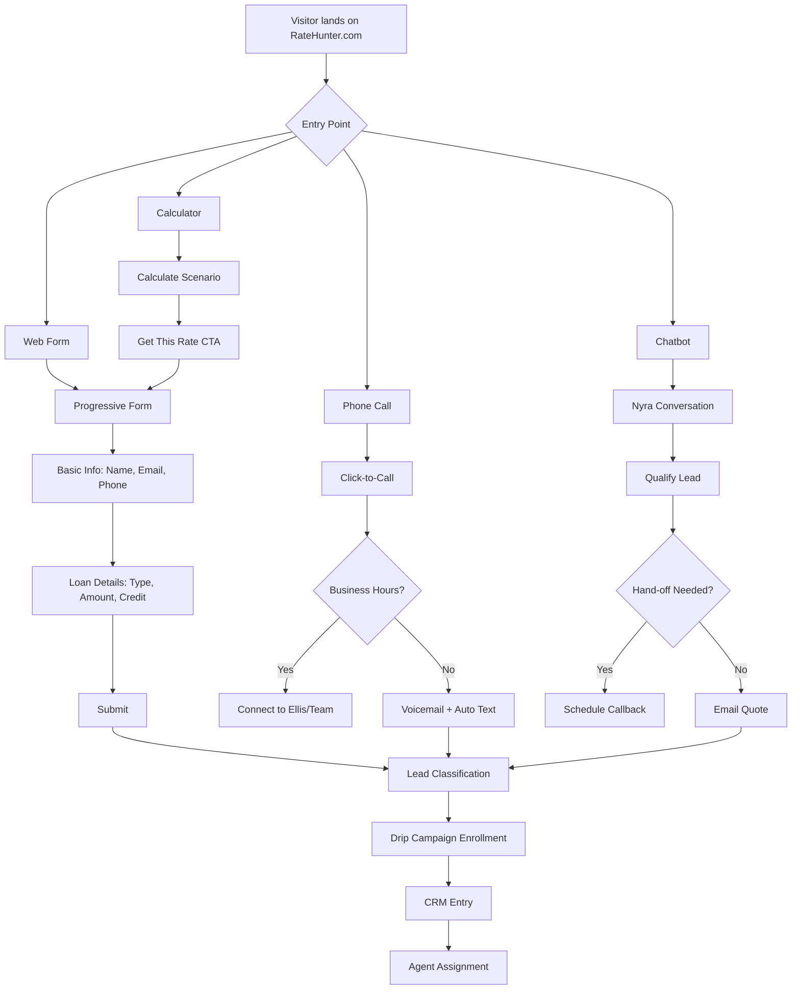
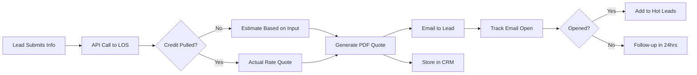

# RateHunter.com Landing Page Requirements

## Executive Summary

RateHunter.com is a mortgage lead generation platform that will serve as the primary customer-facing interface for Project-Nyra's mortgage operations. The landing page must capture leads across multiple channels (phone, SMS, email, web) and integrate with the backend drip campaign system.

---

## Business Goals

### Primary Objectives

1. **Lead Capture**: Collect qualified mortgage leads 24/7 across all channels
2. **Lead Qualification**: Automatically classify leads (Personal, Commercial, Residential)
3. **Instant Response**: Provide immediate engagement through automated systems
4. **Conversion Optimization**: Guide leads through the mortgage inquiry process
5. **Brand Positioning**: Establish Ellis D Andersen LLC as a trusted mortgage advisor

### Success Metrics

- Lead capture rate: Target 80%+ of visitors
- Lead quality score: Target 7.5/10 average
- Response time: Sub-2-minute automated response
- Conversion to consultation: Target 25%+
- Mobile conversion parity: 90%+ of desktop performance

---

## Feature Requirements

### FR-001: Multi-Channel Lead Capture

#### Priority: CRITICAL

#### Description

Comprehensive lead capture system supporting all communication channels.

#### Acceptance Criteria

- [ ] Web form with progressive disclosure (name → email → phone → loan details)
- [ ] Click-to-call phone integration with Voicemod API
- [ ] SMS text capture with two-way messaging
- [ ] Email inquiry form with file attachment support
- [ ] Chatbot integration (Open-WebUI + Loab.Chat)
- [ ] Missed call automation (auto-ping/text/email/voicemail)
- [ ] Privacy policy acceptance and TCPA compliance

#### Technical Specifications

```typescript
interface LeadCaptureForm {
  personalInfo: {
    firstName: string;
    lastName: string;
    email: string;
    phone: string;
  };
  loanDetails: {
    loanType: "personal" | "commercial" | "residential";
    loanAmount: number;
    propertyValue?: number;
    creditScore?: "300-579" | "580-669" | "670-739" | "740-799" | "800+";
    timeframe: "immediate" | "1-3-months" | "3-6-months" | "exploratory";
  };
  source: {
    channel: "web" | "phone" | "sms" | "email" | "referral";
    campaign?: string;
    referrer?: string;
  };
  consent: {
    privacyPolicy: boolean;
    tcpaConsent: boolean;
    emailMarketing: boolean;
    smsMarketing: boolean;
  };
}
```

---

### FR-002: Real-Time Quote Generation

#### Priority: HIGH

#### Description

Instant mortgage rate quotes based on lead-provided information, integrated with LOS (Loan Origination System) pricing engine.

#### Acceptance Criteria

- [ ] Dynamic rate calculator with loan amount, credit score, loan type inputs
- [ ] Integration with Encompass/Calyx LOS for real-time rates
- [ ] Display of APR, monthly payment, total interest over loan term
- [ ] Comparison of multiple loan products (30-year fixed, 15-year fixed, ARM)
- [ ] PDF quote generation with West Capital Lending branding
- [ ] Email delivery of quote to lead
- [ ] Quote valid for 7 days with expiration warning

#### Rate Display Example

```
Loan Amount: $450,000
Property Value: $500,000
Credit Score: 740-799
Loan Type: 30-Year Fixed Conventional

Estimated Rate: 6.75% APR
Monthly Payment: $2,920
Total Interest: $601,200
```

---

### FR-003: Interactive Mortgage Calculator

#### Priority: MEDIUM

#### Description

Public-facing calculator for leads to explore scenarios before submitting information.

#### Acceptance Criteria

- [ ] Loan amount slider ($50K - $5M)
- [ ] Down payment percentage selector (3%-50%)
- [ ] Loan term selector (10, 15, 20, 30 years)
- [ ] Interest rate input with market average display
- [ ] Property tax and insurance estimators by ZIP code
- [ ] PMI calculation for <20% down payment
- [ ] Amortization schedule visualization
- [ ] "Get This Rate" CTA that pre-fills lead capture form

#### Calculator Outputs

- Monthly principal + interest
- Total monthly payment (PITI)
- Loan-to-value ratio (LTV)
- Debt-to-income ratio (with income input)
- Closing cost estimates

---

### FR-004: Educational Content Hub

#### Priority: MEDIUM

#### Description

SEO-optimized content to establish authority and nurture leads through the buyer's journey.

#### Content Categories

1. **First-Time Homebuyer Guides**
   - Down payment assistance programs
   - FHA vs Conventional loans
   - Pre-approval process
   - Credit improvement tips

2. **Refinancing Resources**
   - When to refinance calculator
   - Cash-out vs rate-and-term
   - Break-even analysis tools

3. **Commercial Real Estate Financing**
   - SBA 7(a) and 504 loans
   - Bridge loans and hard money
   - Multi-family property financing

4. **Market Updates**
   - Weekly rate trends
   - Federal Reserve policy impacts
   - Local market reports (Southern California focus)

#### SEO Requirements

- Target keywords: "best mortgage rates", "VA loan California", "FHA loan down payment", "commercial real estate financing"
- Meta descriptions with CTAs
- Schema markup for articles and FAQs
- Internal linking structure to lead capture pages

---

### FR-005: Trust & Social Proof

#### Priority: HIGH

#### Description

Build credibility through testimonials, certifications, and transparency.

#### Trust Elements

- [ ] Customer testimonials with photos and loan details (with permission)
- [ ] Google Reviews integration (target 4.8+ star rating)
- [ ] NMLS license display for Ellis D Andersen (#XXXX)
- [ ] West Capital Lending company NMLS (#XXXX)
- [ ] Better Business Bureau accreditation badge
- [ ] Equal Housing Lender logo
- [ ] Partner lender logos (with agreements)
- [ ] "As Seen In" media mentions
- [ ] Years in business counter
- [ ] Loans funded counter (dynamic)

#### Testimonial Template

```markdown
"Ellis helped us secure a 6.5% rate when other lenders quoted 7.2%.
His responsiveness and expertise made our first home purchase smooth and stress-free."

— Sarah & Mike T., Pasadena, CA
Loan Amount: $625,000 | 30-Year Fixed Conventional
Closed: March 2024
```

---

### FR-006: Nyra AI Assistant Integration

#### Priority: HIGH

#### Description

Embedded chatbot interface powered by Nyra AI assistant for instant lead engagement.

#### Acceptance Criteria

- [ ] Floating chat widget (bottom-right corner, expandable)
- [ ] Greeting message: "Hi! I'm Nyra, Ellis's AI assistant. How can I help with your mortgage needs?"
- [ ] Natural language understanding of mortgage questions
- [ ] Ability to provide rate quotes based on chat inputs
- [ ] Lead qualification through conversational flow
- [ ] Seamless handoff to human agent during business hours
- [ ] After-hours message collection with 12-hour response SLA
- [ ] Multilingual support (English, Spanish)

#### Conversation Flow Example

```
Nyra: Hi! I'm Nyra, Ellis's AI assistant. How can I help with your mortgage needs?

User: I'm looking to buy my first home in Los Angeles. What rates can I get?

Nyra: Congrats on taking this step! To give you an accurate rate, I need a few details:
1. Approximate home price you're targeting?
2. How much do you plan to put down?
3. What's your credit score range (no judgment, just helps with accuracy)?

[User provides details]

Nyra: Based on that, you're looking at approximately 6.75-7.0% APR for a 30-year fixed.
Would you like me to connect you with Ellis for a detailed pre-approval, or should I email
you this quote with next steps?
```

---

### FR-007: Mobile-First Responsive Design

#### Priority: CRITICAL

#### Description

Optimized experience for mobile devices (60%+ of mortgage searches occur on mobile).

#### Mobile Requirements

- [ ] Touch-friendly buttons (minimum 44x44px tap targets)
- [ ] Simplified navigation (hamburger menu)
- [ ] One-tap phone calling
- [ ] SMS link for instant texting
- [ ] Progressive form with save-and-resume capability
- [ ] Fast load times (<3 seconds on 4G)
- [ ] Offline mode for calculator functionality
- [ ] Native mobile app integration (future phase)

#### Viewport Breakpoints

- Mobile: 320px - 767px
- Tablet: 768px - 1023px
- Desktop: 1024px+

---

### FR-008: Cloudflare Tunnel Integration

#### Priority: HIGH

#### Description

Secure, performant hosting via Cloudflare Tunnel (ratehunter.com domain).

#### Infrastructure Requirements

- [ ] Cloudflare Tunnel for origin server obfuscation
- [ ] DDoS protection via Cloudflare
- [ ] SSL/TLS encryption (Let's Encrypt certificate)
- [ ] CDN caching for static assets
- [ ] WAF (Web Application Firewall) rules
- [ ] Bot mitigation (prevent form spam)
- [ ] Rate limiting (100 requests/minute per IP)
- [ ] Geographic analytics (track lead sources by region)

#### DNS Configuration

```
ratehunter.com        A     CLOUDFLARE_TUNNEL_IP
www.ratehunter.com    CNAME ratehunter.com
api.projectnyra.com    A     CLOUDFLARE_TUNNEL_IP
```

---

## User Stories

### US-001: First-Time Homebuyer

**As a** first-time homebuyer
**I want to** quickly see if I qualify for a mortgage
**So that** I can start house hunting with confidence

**Acceptance Criteria:**

- Pre-qualification form takes <3 minutes to complete
- Instant qualification decision (approve/refer/deny)
- Recommended loan programs (FHA, Conventional, VA)
- Next steps clearly outlined

---

### US-002: Refinance Seeker

**As a** current homeowner
**I want to** check if refinancing will save me money
**So that** I can lower my monthly payments

**Acceptance Criteria:**

- Refinance calculator compares current vs new payment
- Break-even analysis shows months to recoup closing costs
- Cash-out refinance option calculator
- Ability to submit current mortgage statement for analysis

---

### US-003: Commercial Property Investor

**As a** commercial real estate investor
**I want to** get pre-approved for a multi-family property loan
**So that** I can make competitive offers

**Acceptance Criteria:**

- Separate intake form for commercial properties
- Upload capability for property financials (rent roll, expenses)
- SBA loan program information
- 24-hour pre-qualification SLA for commercial deals

---

### US-004: Referral Partner

**As a** real estate agent
**I want to** refer my clients to a reliable lender
**So that** my deals close on time

**Acceptance Criteria:**

- Partner referral portal with tracking
- Co-branded landing pages for agents
- Real-time loan status updates for referred clients
- Commission agreements and reporting

---

## Workflow Diagrams

### Lead Capture Workflow



### Quote Generation Workflow



---

## API Endpoints

### POST /api/v1/leads

Create new lead from form submission.

**Request:**

```json
{
  "firstName": "John",
  "lastName": "Doe",
  "email": "john.doe@email.com",
  "phone": "+13105551234",
  "loanType": "residential",
  "loanAmount": 450000,
  "creditScore": "740-799",
  "source": "web-form",
  "campaign": "google-ads-Q1"
}
```

**Response:**

```json
{
  "leadId": "lead_abc123",
  "status": "qualified",
  "estimatedRate": 6.75,
  "nextSteps": [
    "Check email for detailed quote",
    "Ellis will call within 24 hours",
    "Complete pre-approval application"
  ],
  "quoteUrl": "https://ratehunter.com/quotes/lead_abc123"
}
```

---

### POST /api/v1/quotes/generate

Generate real-time mortgage quote.

**Request:**

```json
{
  "loanAmount": 450000,
  "propertyValue": 500000,
  "creditScore": 750,
  "loanType": "30-year-fixed",
  "zip": "90210"
}
```

**Response:**

```json
{
  "quoteId": "quote_xyz789",
  "rate": 6.75,
  "apr": 6.89,
  "monthlyPayment": 2920,
  "totalInterest": 601200,
  "closingCosts": 12500,
  "expiresAt": "2025-01-07T23:59:59Z",
  "products": [
    {
      "name": "30-Year Fixed Conventional",
      "rate": 6.75,
      "monthlyPayment": 2920
    },
    {
      "name": "15-Year Fixed Conventional",
      "rate": 6.25,
      "monthlyPayment": 3872
    },
    {
      "name": "5/1 ARM",
      "rate": 6.1,
      "monthlyPayment": 2734
    }
  ]
}
```

---

## Database Schema Requirements

### leads table

```sql
CREATE TABLE leads (
  id UUID PRIMARY KEY DEFAULT gen_random_uuid(),
  first_name VARCHAR(100) NOT NULL,
  last_name VARCHAR(100) NOT NULL,
  email VARCHAR(255) UNIQUE NOT NULL,
  phone VARCHAR(20) NOT NULL,
  loan_type VARCHAR(50) NOT NULL, -- personal, commercial, residential
  loan_amount DECIMAL(12,2),
  property_value DECIMAL(12,2),
  credit_score_range VARCHAR(20),
  timeframe VARCHAR(50),
  source_channel VARCHAR(50), -- web, phone, sms, email, referral
  source_campaign VARCHAR(100),
  ip_address INET,
  user_agent TEXT,
  status VARCHAR(50) DEFAULT 'new', -- new, contacted, qualified, pre-approved, denied, dead
  assigned_agent VARCHAR(100),
  tags TEXT[], -- hot-lead, first-time-buyer, investor, etc
  consent_privacy BOOLEAN DEFAULT false,
  consent_tcpa BOOLEAN DEFAULT false,
  consent_email_marketing BOOLEAN DEFAULT false,
  consent_sms_marketing BOOLEAN DEFAULT false,
  created_at TIMESTAMP DEFAULT NOW(),
  updated_at TIMESTAMP DEFAULT NOW(),
  last_contact_at TIMESTAMP,
  conversion_date TIMESTAMP
);

CREATE INDEX idx_leads_email ON leads(email);
CREATE INDEX idx_leads_phone ON leads(phone);
CREATE INDEX idx_leads_status ON leads(status);
CREATE INDEX idx_leads_created ON leads(created_at DESC);
```

### quotes table

```sql
CREATE TABLE quotes (
  id UUID PRIMARY KEY DEFAULT gen_random_uuid(),
  lead_id UUID REFERENCES leads(id) ON DELETE CASCADE,
  loan_amount DECIMAL(12,2) NOT NULL,
  property_value DECIMAL(12,2),
  credit_score INTEGER,
  loan_product VARCHAR(100), -- 30-year-fixed, 15-year-fixed, ARM, etc
  interest_rate DECIMAL(5,3),
  apr DECIMAL(5,3),
  monthly_payment DECIMAL(10,2),
  total_interest DECIMAL(12,2),
  closing_costs DECIMAL(10,2),
  pdf_url VARCHAR(500),
  expires_at TIMESTAMP,
  viewed_at TIMESTAMP,
  created_at TIMESTAMP DEFAULT NOW()
);

CREATE INDEX idx_quotes_lead ON quotes(lead_id);
CREATE INDEX idx_quotes_created ON quotes(created_at DESC);
```

---

## Design Requirements

### Visual Identity

- **Primary Brand**: Ellis D Andersen LLC / West Capital Lending
- **Color Scheme**:
  - Primary: Xulbux Purple (#6C5CE7)
  - Secondary: Trust Blue (#0984E3)
  - Accent: Success Green (#00B894)
  - Neutral: Warm Gray (#636E72)
- **Typography**:
  - Headings: Inter Bold
  - Body: Inter Regular
  - Monospace (rates): IBM Plex Mono
- **Logo Placement**: Top-left corner with West Capital Lending co-branding

### UI Components

1. **Hero Section**
   - Headline: "Get Your Best Mortgage Rate in 60 Seconds"
   - Subheadline: "Trusted by 1,200+ California homebuyers"
   - CTA: "Check My Rate" (large button)
   - Background: Modern home image with gradient overlay

2. **Rate Display**
   - Large, prominent APR percentage
   - "As low as" qualifier
   - "30-Year Fixed" loan type indicator
   - "Rate valid as of [date]" disclosure

3. **Trust Bar**
   - Equal Housing Lender logo
   - NMLS license numbers
   - BBB A+ rating
   - Star rating from reviews
   - Years in business

4. **Form Design**
   - Clean, minimal fields
   - In-line validation with helpful error messages
   - Progress indicator for multi-step forms
   - Auto-complete for address fields
   - Masked input for phone numbers (XXX) XXX-XXXX

---

## Compliance & Legal Requirements

### TCPA (Telephone Consumer Protection Act)

- [ ] Explicit consent checkbox for phone/SMS marketing
- [ ] Opt-out instructions in every SMS message
- [ ] Do Not Call registry compliance
- [ ] Call recording disclosure (if applicable)

### RESPA (Real Estate Settlement Procedures Act)

- [ ] Affiliated Business Arrangement (AfBA) disclosures if referring to title/escrow
- [ ] Good Faith Estimate (GFE) delivery within 3 business days of application

### TILA (Truth in Lending Act)

- [ ] APR disclosure on all rate quotes
- [ ] Finance charge calculations
- [ ] Total of payments disclosure
- [ ] Prepayment penalty disclosure (if applicable)

### Fair Lending Laws

- [ ] Equal Housing Opportunity statement
- [ ] Non-discriminatory language in all materials
- [ ] Accessible design (WCAG 2.1 AA compliance)

### Privacy Policy

- [ ] GDPR compliance (for international visitors)
- [ ] CCPA compliance (California Consumer Privacy Act)
- [ ] Cookie consent banner
- [ ] Data retention and deletion policies
- [ ] Third-party data sharing disclosures

---

## Performance Requirements

### Load Time Targets

- First Contentful Paint (FCP): <1.5 seconds
- Largest Contentful Paint (LCP): <2.5 seconds
- Cumulative Layout Shift (CLS): <0.1
- First Input Delay (FID): <100ms

### Uptime & Reliability

- Uptime SLA: 99.9% (< 8.77 hours downtime/year)
- Disaster recovery: <1 hour RTO (Recovery Time Objective)
- Backup frequency: Hourly incremental, daily full

### Scalability

- Concurrent users: 500+
- Requests per second: 100+
- Database connections: Pool of 50-200
- Auto-scaling: Trigger at 70% CPU utilization

---

## Integration Points

### Upstream Services

1. **LOS (Loan Origination System)**: Encompass or Calyx
   - Real-time rate pricing
   - Credit pull integration (soft pull for quotes)
   - Pre-qualification automation

2. **CRM**: Salesforce / HubSpot / Custom
   - Lead creation via API
   - Campaign attribution
   - Task assignments

3. **Email Service**: SendGrid / AWS SES
   - Transactional emails (quote delivery)
   - Marketing emails (drip campaigns)
   - Open/click tracking

4. **SMS Gateway**: Twilio
   - Two-way messaging
   - Missed call notifications
   - Appointment reminders

5. **Analytics**: Google Analytics 4 / Mixpanel
   - Conversion funnel tracking
   - A/B test management
   - Cohort analysis

---

## Testing Requirements

### Unit Tests

- Form validation logic
- Quote calculation accuracy
- API request/response handling

### Integration Tests

- LOS API connectivity
- CRM lead creation
- Email delivery
- SMS sending

### End-to-End Tests

- Complete lead submission flow
- Quote generation and delivery
- Chat conversation to lead conversion
- Mobile responsiveness

### Performance Tests

- Load testing (100 concurrent users)
- Stress testing (burst to 500 users)
- Soak testing (sustained load for 24 hours)

### Security Tests

- Penetration testing
- SQL injection prevention
- XSS vulnerability scanning
- CSRF token validation

---

## Deployment Plan

### Phase 1: MVP (Weeks 1-4)

- [ ] Basic web form lead capture
- [ ] Static quote calculator
- [ ] Cloudflare Tunnel setup
- [ ] CRM integration
- [ ] Compliance pages (Privacy, Terms)

### Phase 2: Enhancement (Weeks 5-8)

- [ ] Nyra chatbot integration
- [ ] Real-time LOS rate quotes
- [ ] Email drip campaign setup
- [ ] Mobile optimization
- [ ] A/B testing framework

### Phase 3: Advanced Features (Weeks 9-12)

- [ ] SMS two-way messaging
- [ ] Voicemod voice integration
- [ ] Educational content hub
- [ ] Referral partner portal
- [ ] Advanced analytics dashboard

---

## Success Criteria

### Launch Readiness

- [ ] All critical features (FR-001, FR-002, FR-003) implemented
- [ ] Security audit passed
- [ ] Compliance review approved by legal
- [ ] Load testing validated at 3x expected traffic
- [ ] Backup and disaster recovery tested
- [ ] Monitoring and alerting configured

### Post-Launch Metrics (30-Day)

- 1,000+ leads captured
- 30%+ conversion from visitor to lead
- 4.5+ star average from customer satisfaction survey
- <5% form abandonment rate
- 20%+ mobile traffic

---

## Maintenance & Support

### Ongoing Tasks

- Weekly rate updates (manual or automated via LOS)
- Monthly content updates (blog posts, market insights)
- Quarterly compliance audits
- Annual security penetration tests
- Daily database backups with 30-day retention

### Support Channels

- Technical support: tech@ratehunter.com
- Lead inquiries: ellis@ratehunter.com
- Escalations: Ellis D Andersen direct line

---

## References

### Related Documents

- `NYRA_ASSISTANT_FEATURES.md` - Chatbot integration details
- `LEAD_DRIP_CAMPAIGNS.md` - Post-capture nurturing workflows
- `CRM_REQUIREMENTS.md` - Lead management system specs
- `MORTGAGE_BROKER_WORKFLOWS.md` - Operational procedures

### External Resources

- Encompass LOS API Documentation
- Cloudflare Tunnel Setup Guide
- NMLS Compliance Resources
- CFPB Mortgage Disclosure Requirements
