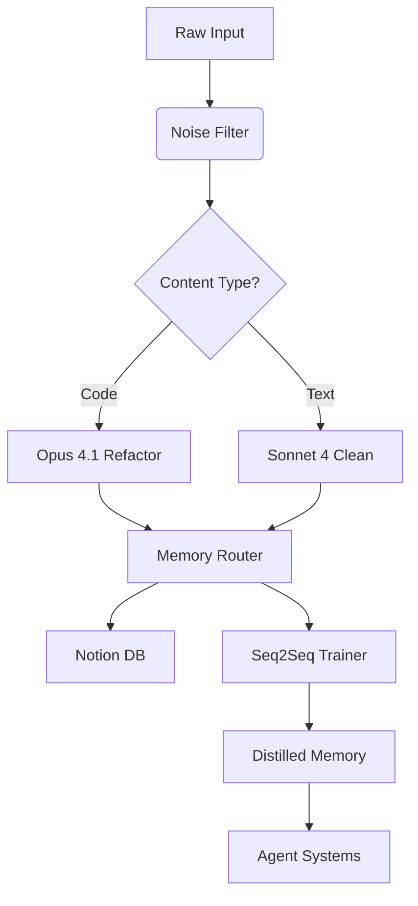
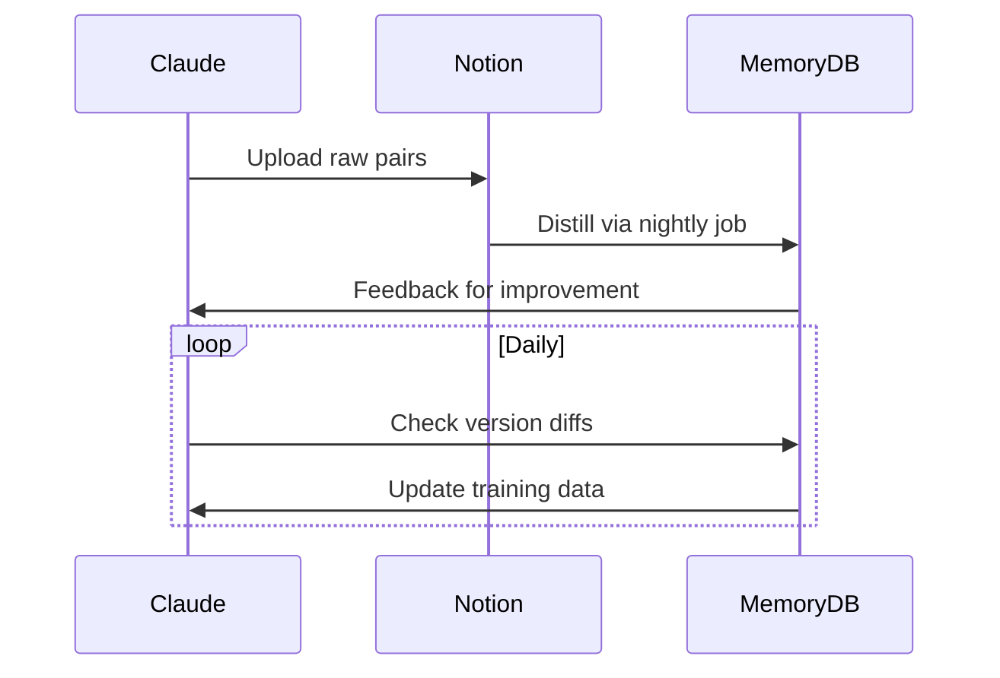

https://github.com/ygsgdbd/github-repo-radar

			 Settings — GitExtensions 5.2 documentation
https://git-extensions-documentation.readthedocs.io/en/release-5.2/settings.html#author-images-avatar-provider

rgburke/grv: GRV is a terminal interface for viewing git repositories
https://github.com/rgburke/grv

sourcegit-scm/sourcegit: Windows/macOS/Linux GUI client for GIT users
https://github.com/sourcegit-scm/sourcegit

Install - Infisical
https://infisical.com/docs/cli/overview
			sourcegit-scm/sourcegit: Windows/macOS/Linux GUI client for GIT users
https://github.com/sourcegit-scm/sourcegit

Releases · awaescher/RepoZ
https://github.com/awaescher/RepoZ/releases

			   (https://github.com/katanemo/archgw)


				   sourcegit-scm + GitHub Repo Radar


		please review my work flow process and help me determine which areas Nyra can assist me so that we can properly map out everything that we want from her as far as features. From mapping things out, i need you to research all available AI/AGI tools and GitHub repos or opensource material (ideally unless something cant be replaced physically or quality wise, i still want all of my options on the table so that i know what the long term best options are once i can afford the best options if they do cost money), so we shoot for free or extremely cheap options. i know there are opensource GitHub repositories that take over the functions of things such as Zapier,  then i believe we could also use RestAPI or Swagger GitHub repos just to give you a start. i need all of the best possible options picked for each category, feature, tool/tooling, code, software, etc., that we could ever want for or need implemented into our Nyra end build. Any pre-existing code or software or repositories that makes our job easier is ideal. Just remember that we will first be brainstorming ALL features that could benefit me, take workload off of my plate, increase my lead to close percentage ratio and/or inicome from closing mortgages and loans, better help my borrowers in process, help close my deals, assist my processors or underwriters, etc. Nyra should only be contacting people outside of my company via voice, but she could also help ,me respond to my outlook emails and such. i believe i am using lenderprice to compare multiple lenders and investors for my quotes that benefit from this (the URL is actually "https://wcl.digitallending.com/#/app/company/63cb119e519151000101b22f/quick-pricer", i believe they may have an API available, or at least they used to, perhaps Nyra could structure my quotes for me if possible?)   upon receiving an incoming lead, i have a well featured and coded excel spreadsheed in which i copy the  incoming lead email that i receive in my work emails outlooks inbox (i know i said bonzo, that runs on bonzo.com, pulls new leads from leadmailbox.com, but most lead suppliers also allow me to send the lead info directly to my email address as well), i copy paste the new leads info into my excel spreadsheet and it auto formats. the spreadsheet is set up to move the borrowers qualifying fields into the correct fields to populate a pricing/rate quote template that is ready for me to price out their loan (most loans are either conventional/fha/va/HELOAN's which i always get the best pricing from Rocket mortgage for), i input 1-3 different types of loans, each with 3 rate and cost options and payment options before screenshottting and sending the quote to each borrowers text message inboxes, emails, etc.              perhaps we focus on getting Nyra set up as my assistant who will make calls for me to request documents from my new leads that come in from places such as lendingtree.com and freerateupdate.com and are inputted into my leadmailbox.com lead inbox(this is where i believe Bonzo pulls the new lead trigger  from along with the leads information so that Bonzo can create the new lead in Bonzo and add each borrower to my call/text/email/voicemail campaign until they reply or reach back out and open contact with me (this is Bonzo's entire purpose, to establish contact so i can take it from there and get my quote Infront of them, old leads, borrowers in process, clients who want to proceed with my quote and need to be given a list of required documents or potentially need to be reminded of said documents or reminded to submit their documents to me and/or Nyra, leads/client whom i have yet to get into contact with through personal or my Bonzo campaigns automated calling(just fake missed call pings that are followed up with my pre-recorded voicemails to make it appear as if i have just attempted to call them and left a voicemail), texting, emails, etc. that are being sent out automatically by Bonzo attempting to open first contact with them and get them to respond to establish communication and be able to more effectively listen to their goals and/or what type of loan or mortgage they are looking for, what their concerns are, explain the process to them, take an application or direct them to my online application form or my other online resources such as my secure encrypted document upload portal, the NMLS websites lookup confirmations of my NMLS ID number and my companies NMLS id number to confirm we are both licensed mortgage loan originators/mortgage broker/real estate agent/branch manager at west capital lending in Irvine, CA. The leads that i pay for and receive consist of my borrowers loan inquiries that contain all of their personal information, address of subject property, residence address, desired loan type (conventional/VA/FHA/Non-QM/Hard cash money loan/ HELOC/HELOAN/30 year/15 year/ interest only/etc.), desired loan amount, desired cash out if applicable, properties current home value (i typically confirm on zillow/redfin/realtor.com/etc.), borrowers names, borrowers credit scores, etc. so that i can prequalify them and produce a soft quote by using their FICO's lower center median qualifying score, loan to value ratio, borrowers income(so i can calculate their debt to income ratio and make sure its within conforming limits for their desired loan). Once i sent the soft quote, i am utilizing it as bait to get them interested in calling me back. as a broker, i have much lower rates than just about every other direct lender or bank at the moment since i  get to shop around for my borrowers loans through my list of several hundred approved lenders and investors to find my borrowers the best loans with the lowest rates for the lowest costs. from there i push them to fill out the universal residential mortgage loan application either online on their end or by me questioning them and filling it out on my end  so t hat i can structure the loan in lendingpad.com and subsequently produce a valid mortgage loan estimate for them and generate disclosures. the only additional information that I need from them. From the point of receiving the lead intake is their date of births and social security numbers, if not already supplied, so that I can complete the hardened query mortgage credit report and find the lower center median of both borrower scores or the center median of a single borrower score, which would be the qualifying score when utilizing a lender's direct pricing quote and producing a subsequent loan estimate. from there its just follow up with them to see if they've gotten any competitive loan estimates, if things are close then i consider cutting some of my compensation to get them a lower rate or a lower cost loan to get the deal closed and into process. Once I close them on the deal, I request all of their documents and have them email them to me or upload them through my secure and encrypted document upload portal, at which point I make sure that the borrower's loan application is completed, that I select a rate and structure loan, which I then disclose and send out the proprietary mortgage loan disclosure application. Then from there, I take all of their documents they uploaded and double-check all of the information that I have inputted into the loan application, double-check all of the income numbers, and pre-underwrite the loan file to ensure that debt-to-income ratios are within limits as well as loan-to-value ratios are within limits, at which point the loan is ready to submit to processing and underwriting as soon as the borrowers have signed or electronically signed their mortgage loan disclosures online through the borrower portal. At that point, I can either process the loan myself, but typically will pay one of my assistants or processors or independent processors to work on the back end on the file to free up my front end so that I can get more loans. And have more time to pitch more deals and talk to more borrowers. Stay in contact with the borrowers from start to finish of the process as we go through different stages in underwriting, such as conditional approval, where more documents are likely to be requested and processing may need help retrieving them, or issues might come up in underwriting, at which point I might need to request other documents from the borrowers or restructure a loan to get it to work. All the way until the appraisal is completed, the values come back and are hopefully within the range that we determined they would be in from jillow.com, realtor.com, and redfin.com. If all is well, then we get a final approval in underwriting and can send out the closing disclosures, which the borrowers will then need to also final sign, at which point the final three-day waiting period is triggered before we can have them sign with the notary who will meet them at their house for a hard copy, a wet signing of all of their mortgage loan disclosures and mortgage loan application and loan estimate and closing disclosures. They have two days to rescind the loan, and if the loan is not rescinded, the loan is closed and my funding team will wire all of the money out to the corresponding recipients and match everything up on the closing disclosures to make sure everything is lined up and all the credits and debits check out, and at that point the loan is funded. once we have all of these other features structured out (unless its efficient enough to have multiple agent instances running and working on separate Nyra aspects at once in which case we could still potentially work on all aspects of Nyras goals at once). So we would essentially focus on all mortgage broker assistant tasks first before moving the main focus to copying the automation power of Bonzo. we still neeed all of the end goals mapped out in order of whats most important, whats to be completed first/later/last/etc., by what gives me the most benefit the fastest. i need you to research any tools or utilities or opensource material or paid material, WHATEVER OPTIONS ARE BEST, to help me map out the front end and back end code of websites such as Bonzo. I want to pull the absolute most useful code and information from bonzo.com and/or other things that i may also need to map out for efficiency. would it be better to have nyra pull new lead info from email or leadmailbox.com and how, what will we use or build for this feature? i love your final build features recommendations so far, lets add to the list of whats best, most useful, and most important/efficient/ and rich utility wise, as well as THE ABSOLUTE MOST REALISTIC AND FASTEST ON THE VOICE END OF THINGS. remember, im shootting for the most realistic voice and phone conversations possible out of modern day AI and AGI. i like the idea of utilizing voicemod API, i want to test its usefulness for the most part, we can always utilized other methods down the road such as using voicemod to record desires voices and recording the voice diagnostic information to then input into the AI system. i need you to help me get as much of a baseeline and starting package done as possible so that we have the utmost most solid roots to get this Nyra Reborn process on the road! Guide me with step by step instructions. 


Need to add AI_RULES.md to my project folder for comprehensive guidelines and rules as well as an outline of the tech stack and forbidden practices for the Nyra Mortgage Suite/WebApp/Website/AgentDashboardGUI/etc.

# Chat Title: 0701T16

**Summary**: Initial NYRA architecture layout, repo linking strategies, and file structure setup

---

**[E.Apotheosis | 0701T16]**
Hey, I’m working on NYRA’s initial nyra architecture layout, repo linking strategies, and file structure setup. What’s the cleanest approach for that?

**[ChatGPT]**
To accomplish this, you should consider using a modular agent architecture that allows for endpoint abstraction...

**[E.Apotheosis]**
Should I call that from a Voicemod API wrapper, or keep it isolated?

**[ChatGPT]**
If Voicemod is tightly integrated, use a middleware layer between your NYRA voice agent and the Voicemod API...

**Code Block:**
```python
def route_lead_to_task_module(input_voice):
    return parse_voice_to_action(input_voice)
```

**[E.Apotheosis]**
Okay, keep going. What about compliance on the mortgage side?

**[ChatGPT]**
Ensure NYRA follows all TCPA + RESPA rules during interaction logging. Consider embedding Swagger API docs for audit trace.

---

**Timestamp**: Simulated from prior messages
**Tags**: #NYRA #AI #Voicemod #Bonzo #LeoAI #MortgageAssistant


# 🧬 NYRA Memory Forge v5.1 (Seq2Seq Enhanced)

## 🧩 CORE COMPONENTS


## 🏷️ ENHANCED TAGGING (Add these)
- #Seq2SeqTraining: Input/output pairs for memory distillation
- #MemoryDistillation: Compressed knowledge bundles
- #FeedbackLoop: Agent improvement cycles
- #VersionedMemory: v1, v2, etc. for iterative updates

## 🧠 SEQ2SEQ MEMORY RULES
```yaml
seq2seq_routing:
  input_triggers: ["#problem", "#error_log", "#debug_session"]
  output_triggers: ["#solution", "#fixed", "#optimized"]
  pair_rules:
    max_context_gap: 3 messages
    allowed_formats: [Q&A, Problem/Solution, Before/After]
  distillation:
    model: "phind-codellama-34b"
    compression_ratio: 4:1
    validation: "opus-4.1"
```

## 🗂️ NOTION UPLOAD PROTOCOL
1. Create database relations:
   ```notion
   /relation MemoryPairs {
     "Input": link_to InputsDB,
     "Output": link_to SolutionsDB,
     "Distillation": link_to MemoryCore
   }
   ```
2. Add version control property:
   ```yaml
   properties:
     MemoryVersion:
       type: "select"
       options: [v0.1, v0.2, v1.0]
   ```
3. Enable cross-database rollups:
   ```notion
   /rollup AgentPerformance = AgentDB.SuccessRate
   ```

## 🔄 IMPROVED FEEDBACK LOOP
```python
def process_feedback(chunk):
    if needs_distillation(chunk):
        distilled = claude.memory_distill(
            chunk, 
            ratio=4,
            format="jsonl"
        )
        notion.insert(distilled)
        lmcache.cache(distilled['key'])
    
    if requires_seq2seq(chunk):
        pair = find_io_pair(chunk)
        seq_trainer.add(pair)
        graph_memory.link(pair.input, pair.output)
```


# NYRA Quick Processor

Process uploaded files for Project NYRA. Create artifacts for substantial content.

## Clean:
- Remove timestamps, speaker labels, "User:"/"Assistant:" 
- Merge duplicate content
- Fix formatting

## Tag each section:
**Core:** `#DevBuild` `#MortgageAssistant` `#Experimental`  
**Memory:** `#Memory` `#GraphMemory` `#VectorDB` `#ClaudeMemory`  
**Tech:** `#MCP` `#UI` `#Config` `#AgentRoles` `#LLM`  
**Special:** `#RateHunter` `#VoiceTTV` `#NotionSync`  
**Phases:** `#Phase1` `#Phase2` `#Phase3`

## Output:
1. **Notion Page** (Markdown) per major component
2. **Memory formats** if applicable:
   - memOS → short-term snippets
   - Graphiti → graph relationships  
   - LlamaIndex → vector-ready
3. **Index** listing all processed content

## Priority Order:
1. Configs & schemas first
2. Agent definitions
3. Architecture docs
4. Implementation details
5. Experimental features

**Start with:** "Processing NYRA docs..." then begin.


# 🚀 NYRA System Implementation Guide

## 📦 File Structure
```
nyra_core/
├── prompts/
│   ├── master_prompt.md
│   └── validation_rules/
├── memory_configs/
│   ├── router.yaml
│   └── schemas/
├── notion_templates/
│   ├── database_schema.md
│   └── relations.md
└── processing_scripts/
    ├── validate_json.py
    └── notion_upload.js
```

## 🛠️ Setup Steps
1. **Master Prompt**  
   Copy entire `nyra_master_prompt_v5` into Claude's system prompt field
   
2. **Memory Configuration**  
   Place `memory_router_v3.yaml` in `/memory_configs`  
   Run: `python init_memory.py --config memory_router_v3.yaml`
   
3. **Validation Setup**  
   Install dependencies:  
   ```bash
   pip install jsonschema semantic-version
   ```
   Test validation:  
   ```python
   python processing_scripts/validate_json.py -s seq2seq_schema.json -d sample_data.json
   ```

## 🔄 Processing Workflow
1. Upload raw docs to Claude with:
   ```markdown
   [NYRA PROCESSING MODE]
   Operation: full_clean_and_tag
   Output: notion_v2
   Seq2Seq: enable
   ```
2. Monitor memory router outputs
3. Weekly: Run `memory_health_check.js`

## 🧩 Seq2Seq Implementation



	   # Agentic Coding MCPs

## Overview

Powered by composio this MCP.json provides detailed information on Model Context Protocol (MCP) integration capabilities and enables seamless agent workflows by connecting to more than 80 servers.

It covers development, AI, data management, productivity, cloud storage, e-commerce, finance, communication, and design. Each server offers specialized tools, allowing agents to securely access, automate, and manage external services through a unified and modular system. This approach supports building dynamic, scalable, and intelligent workflows with minimal setup and maximum flexibility.

## Install via NPM
```
npx create-sparc init --force
```
---

## Available MCP Servers

### 🛠️ Development & Coding

|  | Service       | Description                        |
|:------|:--------------|:-----------------------------------|
| 🐙    | GitHub         | Repository management, issues, PRs |
| 🦊    | GitLab         | Repo management, CI/CD pipelines   |
| 🧺    | Bitbucket      | Code collaboration, repo hosting   |
| 🐳    | DockerHub      | Container registry and management |
| 📦    | npm            | Node.js package registry          |
| 🐍    | PyPI           | Python package index              |
| 🤗    | HuggingFace Hub| AI model repository               |
| 🧠    | Cursor         | AI-powered code editor            |
| 🌊    | Windsurf       | AI development platform           |

---

### 🤖 AI & Machine Learning

|  | Service       | Description                        |
|:------|:--------------|:-----------------------------------|
| 🔥    | OpenAI         | GPT models, DALL-E, embeddings      |
| 🧩    | Perplexity AI  | AI search and question answering   |
| 🧠    | Cohere         | NLP models                         |
| 🧬    | Replicate      | AI model hosting                   |
| 🎨    | Stability AI   | Image generation AI                |
| 🚀    | Groq           | High-performance AI inference      |
| 📚    | LlamaIndex     | Data framework for LLMs            |
| 🔗    | LangChain      | Framework for LLM apps             |
| ⚡    | Vercel AI      | AI SDK, fast deployment            |
| 🛠️    | AutoGen        | Multi-agent orchestration          |
| 🧑‍🤝‍🧑 | CrewAI         | Agent team framework               |
| 🧠    | Huggingface    | Model hosting and APIs             |

---

### 📈 Data & Analytics

|  | Service        | Description                        |
|:------|:---------------|:-----------------------------------|
| 🛢️   | Supabase        | Database, Auth, Storage backend   |
| 🔍   | Ahrefs          | SEO analytics                     |
| 🧮   | Code Interpreter| Code execution and data analysis  |

---

### 📅 Productivity & Collaboration

|  | Service        | Description                        |
|:------|:---------------|:-----------------------------------|
| ✉️    | Gmail           | Email service                     |
| 📹    | YouTube         | Video sharing platform            |
| 👔    | LinkedIn        | Professional network              |
| 📰    | HackerNews      | Tech news discussions             |
| 🗒️   | Notion          | Knowledge management              |
| 💬    | Slack           | Team communication                |
| ✅    | Asana           | Project management                |
| 📋    | Trello          | Kanban boards                     |
| 🛠️    | Jira            | Issue tracking and projects       |
| 🎟️   | Zendesk         | Customer service                  |
| 🎮    | Discord         | Community messaging               |
| 📲    | Telegram        | Messaging app                     |

---

### 🗂️ File Storage & Management

|  | Service        | Description                        |
|:------|:---------------|:-----------------------------------|
| ☁️    | Google Drive    | Cloud file storage                 |
| 📦    | Dropbox         | Cloud file sharing                 |
| 📁    | Box             | Enterprise file storage            |
| 🪟    | OneDrive        | Microsoft cloud storage            |
| 🧠    | Mem0            | Knowledge storage, notes           |

---

### 🔎 Search & Web Information

|  | Service         | Description                      |
|:------|:----------------|:---------------------------------|
| 🌐   | Composio Search  | Unified web search for agents    |

---

### 🛒 E-commerce & Finance

|  | Service        | Description                        |
|:------|:---------------|:-----------------------------------|
| 🛍️   | Shopify         | E-commerce platform               |
| 💳    | Stripe          | Payment processing                |
| 💰    | PayPal          | Online payments                   |
| 📒    | QuickBooks      | Accounting software               |
| 📈    | Xero            | Accounting and finance            |
| 🏦    | Plaid           | Financial data APIs               |

---

### 📣 Marketing & Communications

|  | Service        | Description                        |
|:------|:---------------|:-----------------------------------|
| 🐒    | MailChimp       | Email marketing platform          |
| ✉️    | SendGrid        | Email delivery service            |
| 📞    | Twilio          | SMS and calling APIs              |
| 💬    | Intercom        | Customer messaging                |
| 🎟️   | Freshdesk       | Customer support                  |

---

### 🛜 Social Media & Publishing

|  | Service        | Description                        |
|:------|:---------------|:-----------------------------------|
| 👥    | Facebook        | Social networking                 |
| 📷    | Instagram       | Photo sharing                     |
| 🐦    | Twitter         | Microblogging platform            |
| 👽    | Reddit          | Social news aggregation           |
| ✍️    | Medium          | Blogging platform                 |
| 🌐   | WordPress       | Website and blog publishing       |
| 🌎   | Webflow         | Web design and hosting            |

---

### 🎨 Design & Digital Assets

|  | Service        | Description                        |
|:------|:---------------|:-----------------------------------|
| 🎨    | Figma           | Collaborative UI design           |
| 🎞️   | Adobe           | Creative tools and software       |

---

### 🗓️ Scheduling & Events

|  | Service        | Description                        |
|:------|:---------------|:-----------------------------------|
| 📆    | Calendly        | Appointment scheduling            |
| 🎟️   | Eventbrite      | Event management and tickets      |
| 📅    | Calendar Google | Google Calendar Integration       |
| 📅    | Calendar Outlook| Outlook Calendar Integration      |

---

## 🧩 Using MCP Tools

To use an MCP server:
1. Connect to the desired MCP endpoint or install server (e.g., Supabase via `npx`).
2. Authenticate with your credentials.
3. Trigger available actions through Roo workflows.
4. Maintain security and restrict only necessary permissions.
 


