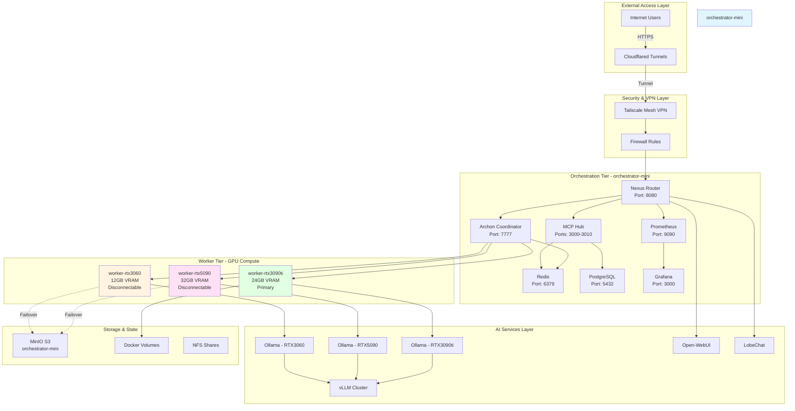
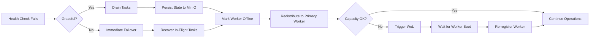

# Project-Nyra Infrastructure Design

## Executive Summary

Project-Nyra is a distributed AI infrastructure spanning 4 PCs with heterogeneous GPU compute resources, designed for high-availability AI workload orchestration with intelligent failover and dynamic resource allocation.

## Infrastructure Overview



## Hardware Specifications

### orchestrator-mini (Control Plane)
- **Role**: Centralized orchestration and coordination
- **CPU**: Multi-core (minimum 8 cores recommended)
- **RAM**: 32GB minimum (64GB recommended)
- **Storage**: 1TB NVMe SSD
- **Network**: Gigabit Ethernet
- **GPU**: None (CPU-only)
- **Availability**: 24/7 always-on
- **OS**: Ubuntu 22.04 LTS / Windows 11 Pro with WSL2

### worker-rtx3060 (Disconnectable Laptop)
- **Role**: Secondary GPU compute, development UI
- **GPU**: NVIDIA RTX 3060 (12GB VRAM)
- **CPU**: 6-8 cores
- **RAM**: 16GB minimum
- **Storage**: 512GB SSD
- **Network**: WiFi 6 / Gigabit Ethernet
- **Availability**: On-demand (disconnectable)
- **Services**: Ollama, Open-WebUI
- **Wake-on-LAN**: Enabled

### worker-rtx5090 (Disconnectable Laptop)
- **Role**: High-performance GPU compute, chat UI
- **GPU**: NVIDIA RTX 5090 (32GB VRAM)
- **CPU**: 8-12 cores
- **RAM**: 32GB minimum
- **Storage**: 1TB SSD
- **Network**: WiFi 6 / Gigabit Ethernet
- **Availability**: On-demand (disconnectable)
- **Services**: Ollama, vLLM, LobeChat
- **Wake-on-LAN**: Enabled

### worker-rtx3090ti (Primary Worker)
- **Role**: Primary always-on GPU compute
- **GPU**: NVIDIA RTX 3090 Ti (24GB VRAM)
- **CPU**: 8-12 cores
- **RAM**: 32GB minimum
- **Storage**: 1TB NVMe SSD
- **Network**: Gigabit Ethernet
- **Availability**: 24/7 always-on
- **Services**: Ollama, vLLM, background training

## Network Architecture

### 1. External Access Layer

**Cloudflared Tunnels**
- **Purpose**: Secure external access without port forwarding
- **Configuration**:
  - Main tunnel: `nyra.yoursubdomain.com`
  - API tunnel: `api.nyra.yoursubdomain.com`
  - UI tunnel: `ui.nyra.yoursubdomain.com`
- **SSL/TLS**: Managed by Cloudflare (auto-renewal)
- **DDoS Protection**: Cloudflare's network
- **Access Control**: Cloudflare Zero Trust policies

**DNS Configuration**:
```
nyra.yoursubdomain.com       -> Cloudflared Tunnel -> Nexus Router
api.nyra.yoursubdomain.com   -> Cloudflared Tunnel -> Nexus Router -> Archon
ui.nyra.yoursubdomain.com    -> Cloudflared Tunnel -> Nexus Router -> Open-WebUI/LobeChat
```

### 2. Internal Mesh Network (Tailscale)

**Tailscale VPN Mesh**
- **Purpose**: Secure peer-to-peer connectivity between all nodes
- **IP Range**: 100.64.0.0/10 (CGNAT space)
- **DNS**: MagicDNS enabled
- **ACL Policy**: Role-based access control

**Node Assignments**:
```
orchestrator-mini:  100.64.1.1    (nyra-orchestrator)
worker-rtx3060:     100.64.1.10   (nyra-worker-1)
worker-rtx5090:     100.64.1.20   (nyra-worker-2)
worker-rtx3090ti:   100.64.1.30   (nyra-worker-primary)
```

**Tailscale ACL Policy**:
```json
{
  "acls": [
    {
      "action": "accept",
      "src": ["nyra-orchestrator"],
      "dst": ["nyra-worker-1:*", "nyra-worker-2:*", "nyra-worker-primary:*"]
    },
    {
      "action": "accept",
      "src": ["nyra-worker-*"],
      "dst": ["nyra-orchestrator:6379", "nyra-orchestrator:5432", "nyra-orchestrator:8080"]
    }
  ]
}
```

### 3. LAN Connectivity

**Local Network**
- **Subnet**: 192.168.1.0/24 (example)
- **Gateway**: 192.168.1.1
- **DHCP**: Static IPs for all Nyra nodes
- **MTU**: 9000 (Jumbo Frames for high-speed transfer)

**Static IP Assignments**:
```
orchestrator-mini:  192.168.1.100
worker-rtx3060:     192.168.1.110
worker-rtx5090:     192.168.1.120
worker-rtx3090ti:   192.168.1.130
```

**Network Performance**:
- LAN transfers: 1Gbps (125MB/s theoretical)
- Tailscale overlay: ~500-800Mbps (encrypted)
- Cloudflared: 100-300Mbps (depends on internet connection)

### 4. Wake-on-LAN Configuration

**Purpose**: Automatically wake disconnectable laptop workers on-demand

**Implementation**:
```bash
# Store MAC addresses in orchestrator-mini
# worker-rtx3060: AA:BB:CC:DD:EE:01
# worker-rtx5090: AA:BB:CC:DD:EE:02

# Wake command (from orchestrator-mini)
wakeonlan AA:BB:CC:DD:EE:01  # Wake RTX3060
wakeonlan AA:BB:CC:DD:EE:02  # Wake RTX5090
```

**Integration with Archon**:
- Health check detects offline worker
- Archon triggers WoL packet
- Wait 60-90 seconds for boot
- Re-register worker in service registry
- Resume task distribution

## Service Distribution Strategy

### orchestrator-mini Services

**Core Orchestration**:
- **Nexus Router** (Port 8080): API gateway, load balancer, request routing
- **Archon Coordinator** (Port 7777): Task distribution, worker management, failover
- **MCP Hub** (Ports 3000-3010): Model Context Protocol servers
- **Redis** (Port 6379): In-memory cache, session store, task queue
- **PostgreSQL** (Port 5432): Persistent storage, configuration, audit logs
- **Prometheus** (Port 9090): Metrics collection, alerting
- **Grafana** (Port 3000): Monitoring dashboards, visualization
- **MinIO S3** (Port 9000): Object storage for models, artifacts

**Why orchestrator-mini**:
- Always-on availability required
- Central coordination point
- No GPU needed (CPU orchestration)
- High memory for Redis caching
- Fast storage for PostgreSQL

### worker-rtx3060 Services

**AI Workloads**:
- **Ollama** (Port 11434): LLM inference (12GB models)
- **Open-WebUI** (Port 8080): Web-based chat interface
- **Ollama Models**: llama2-7b, mistral-7b, phi-3-mini

**Characteristics**:
- Disconnectable (laptop usage)
- Moderate VRAM (12GB)
- Development-focused
- Battery-powered portability

**Failover Strategy**:
- Graceful shutdown detection
- In-flight requests migrated to RTX3090ti
- Model cache synchronized to MinIO
- State persisted to PostgreSQL before disconnect
- Auto-reconnect on laptop return

### worker-rtx5090 Services

**AI Workloads**:
- **Ollama** (Port 11434): LLM inference (32GB models)
- **vLLM** (Port 8000): High-performance inference engine
- **LobeChat** (Port 3210): Advanced chat interface
- **Ollama Models**: llama2-70b, mixtral-8x7b, gpt-j-6b

**Characteristics**:
- Disconnectable (laptop usage)
- High VRAM (32GB) for large models
- Peak performance workstation
- Power-hungry (350W TDP)

**Failover Strategy**:
- Large model offloading to distributed inference
- Request rerouting to RTX3090ti for smaller models
- vLLM cluster rebalancing
- State snapshot to MinIO before disconnect

### worker-rtx3090ti Services

**AI Workloads**:
- **Ollama** (Port 11434): LLM inference (24GB models)
- **vLLM** (Port 8000): Primary inference engine
- **Background Training**: Fine-tuning pipelines
- **Ollama Models**: llama2-13b, codellama-34b, mixtral-8x7b

**Characteristics**:
- Always-on primary worker
- High VRAM (24GB)
- Reliable for 24/7 operations
- Fallback target for disconnectable workers

**Role**:
- Primary inference backend
- Failover destination
- Background task processor
- Model training workloads

## Capacity Planning

### Compute Capacity

**Total GPU Compute**:
- **Total VRAM**: 68GB (12+32+24)
- **Total CUDA Cores**: ~30,000 (approximate)
- **Total Tensor Cores**: ~900
- **Peak TFLOPs**: ~150 FP16

**Workload Distribution**:
```
worker-rtx3060:   20% capacity (development, small models)
worker-rtx5090:   50% capacity (large models, high-demand)
worker-rtx3090ti: 30% capacity (primary + failover)
```

### Memory Capacity

**Orchestrator Memory**:
- Redis: 16GB allocation
- PostgreSQL: 8GB allocation
- System: 8GB allocation
- Total: 32GB minimum (64GB recommended)

**Worker Memory**:
- Model loading: 50% of VRAM as system RAM
- System overhead: 8GB
- Docker overhead: 4GB

### Storage Capacity

**Orchestrator Storage**:
- Docker images: 50GB
- PostgreSQL data: 100GB
- MinIO object storage: 500GB
- Logs & metrics: 50GB
- Total: 700GB minimum (1TB recommended)

**Worker Storage**:
- Ollama models: 200-500GB per worker
- Docker images: 30GB
- Cache: 50GB
- Total: 512GB-1TB per worker

### Network Capacity

**Bandwidth Requirements**:
- LAN inter-node: 1Gbps (saturated during model transfer)
- Tailscale overlay: 500Mbps (typical AI inference)
- Cloudflared ingress: 100Mbps (external API traffic)

**Latency Targets**:
- LAN: <1ms
- Tailscale: <10ms (same geographic region)
- Cloudflared: <50ms (internet round-trip)

## Scaling Strategies

### Horizontal Scaling

**Adding Worker Nodes**:
1. Deploy Tailscale on new node
2. Install Docker + NVIDIA Container Toolkit
3. Register with Archon coordinator
4. Configure health checks
5. Add to load balancer pool

**Capacity Triggers**:
- Average GPU utilization > 80% for 10 minutes
- Request queue depth > 50 tasks
- P95 latency > 5 seconds

### Vertical Scaling

**GPU Upgrade Path**:
- RTX 3060 -> RTX 4070 (12GB -> 12GB, higher throughput)
- RTX 5090 -> Retain (already top-tier)
- RTX 3090 Ti -> RTX 4090 (24GB -> 24GB, higher efficiency)

**Memory Upgrade Path**:
- orchestrator-mini: 32GB -> 64GB -> 128GB
- Workers: 16GB -> 32GB -> 64GB

### Geographic Scaling

**Multi-Region Deployment**:
- Deploy regional orchestrator clusters
- Federate via Archon mesh coordination
- Route users to nearest region
- Replicate models to regional MinIO

**Data Sovereignty**:
- EU cluster: GDPR compliance
- US cluster: HIPAA compliance
- Asia cluster: Local data residency

### Workload-Based Scaling

**Auto-Scaling Rules**:
```yaml
scale_up:
  - metric: gpu_utilization
    threshold: 80%
    duration: 10m
    action: wake_on_lan_worker

  - metric: queue_depth
    threshold: 50
    duration: 5m
    action: spawn_cloud_worker

scale_down:
  - metric: gpu_utilization
    threshold: 20%
    duration: 30m
    action: graceful_shutdown_worker
```

## High Availability Design

### Orchestrator Redundancy

**PostgreSQL High Availability**:
- Primary/replica setup (orchestrator-mini + cloud replica)
- Automatic failover with pg_auto_failover
- Point-in-time recovery (PITR)
- Daily backups to MinIO

**Redis High Availability**:
- Redis Sentinel for automatic failover
- 3-node cluster (orchestrator-mini + 2 workers)
- Asynchronous replication
- Disk persistence with AOF

### Worker Failover

**Detection**:
- Health checks every 30 seconds
- 3 consecutive failures = offline
- Graceful vs abrupt disconnect detection

**Failover Flow**:


### Data Durability

**Backup Strategy**:
- PostgreSQL: Daily full backup, hourly incremental
- Redis: RDB snapshots every 15 minutes + AOF
- MinIO: Versioning enabled, lifecycle policies
- Docker volumes: Weekly snapshots

**Disaster Recovery**:
- RTO (Recovery Time Objective): 15 minutes
- RPO (Recovery Point Objective): 1 hour
- Backup retention: 30 days local, 90 days cloud

## Security Architecture

### Network Security

**Firewall Rules (orchestrator-mini)**:
```bash
# Allow Cloudflared tunnel (outbound only)
ALLOW OUT tcp/443 to cloudflare.com

# Allow Tailscale mesh (UDP)
ALLOW IN/OUT udp/41641 from tailscale-subnet

# Allow worker connections (internal)
ALLOW IN tcp/6379 from tailscale-subnet  # Redis
ALLOW IN tcp/5432 from tailscale-subnet  # PostgreSQL
ALLOW IN tcp/8080 from tailscale-subnet  # Nexus Router

# Block all other inbound
DENY IN all
```

**Firewall Rules (Workers)**:
```bash
# Allow Tailscale mesh
ALLOW IN/OUT udp/41641 from tailscale-subnet

# Allow Ollama API (from orchestrator only)
ALLOW IN tcp/11434 from 100.64.1.1

# Allow vLLM API (from orchestrator only)
ALLOW IN tcp/8000 from 100.64.1.1

# Block all other inbound
DENY IN all
```

### Application Security

**Authentication**:
- Nexus Router: JWT tokens (RS256)
- PostgreSQL: Certificate-based auth
- Redis: ACL with strong passwords
- Docker: TLS for daemon API

**Authorization**:
- RBAC (Role-Based Access Control)
- Service accounts for inter-service communication
- Least privilege principle

**Secrets Management**:
- Environment variables for runtime secrets
- Docker secrets for sensitive data
- Vault integration (optional)
- No hardcoded credentials

### Data Security

**Encryption at Rest**:
- PostgreSQL: Transparent Data Encryption (TDE)
- MinIO: Server-Side Encryption (SSE)
- Docker volumes: LUKS encryption

**Encryption in Transit**:
- Cloudflared: TLS 1.3
- Tailscale: WireGuard encryption
- Internal services: mTLS (optional)

## Monitoring & Observability

### Metrics Collection

**Prometheus Exporters**:
- Node Exporter: System metrics (CPU, RAM, disk)
- NVIDIA GPU Exporter: GPU metrics (utilization, temperature, memory)
- Redis Exporter: Cache hit rate, connections
- PostgreSQL Exporter: Query performance, connections
- Docker Exporter: Container metrics

**Custom Metrics**:
```
nyra_requests_total{worker="rtx3090ti",model="llama2-13b"}
nyra_inference_duration_seconds{worker="rtx5090",model="mixtral-8x7b"}
nyra_gpu_utilization{worker="rtx3060",gpu="0"}
nyra_worker_health{worker="rtx5090",status="online"}
nyra_failover_events_total{from="rtx3060",to="rtx3090ti"}
```

### Alerting Rules

**Critical Alerts**:
```yaml
- alert: WorkerOffline
  expr: nyra_worker_health{status="offline"} == 1
  for: 2m
  severity: critical

- alert: GPUOverheating
  expr: nyra_gpu_temperature > 85
  for: 5m
  severity: critical

- alert: OrchestratorDown
  expr: up{job="orchestrator"} == 0
  for: 1m
  severity: critical
```

**Warning Alerts**:
```yaml
- alert: HighGPUUtilization
  expr: nyra_gpu_utilization > 90
  for: 15m
  severity: warning

- alert: DiskSpaceLow
  expr: node_filesystem_avail_bytes / node_filesystem_size_bytes < 0.1
  for: 10m
  severity: warning
```

### Logging Strategy

**Log Aggregation**:
- Fluentd/Fluent Bit for log collection
- Elasticsearch for log storage (optional)
- Grafana Loki (lightweight alternative)
- 7-day retention for debug logs, 30-day for audit logs

**Log Levels**:
- ERROR: Critical failures, immediate action required
- WARN: Degraded performance, potential issues
- INFO: Normal operations, state changes
- DEBUG: Detailed troubleshooting information

### Dashboards

**Grafana Dashboards**:
1. **Infrastructure Overview**: All nodes, health status, resource usage
2. **GPU Performance**: Utilization, temperature, memory, inference throughput
3. **Service Health**: Nexus Router, Archon, Ollama, vLLM status
4. **Request Analytics**: Request rate, latency distribution, error rate
5. **Capacity Planning**: Resource trends, growth projections

## Cost Analysis

### Hardware Costs (One-Time)

```
orchestrator-mini:  $1,500 (NUC/mini PC + RAM + SSD)
worker-rtx3060:     $1,200 (Laptop with RTX 3060)
worker-rtx5090:     $3,500 (High-end laptop with RTX 5090)
worker-rtx3090ti:   $2,200 (Desktop + RTX 3090 Ti)
Total Hardware:     $8,400
```

### Operational Costs (Monthly)

```
Electricity:
- orchestrator-mini: 50W x 24h x 30d = 36 kWh = $4
- worker-rtx3090ti: 400W x 24h x 30d = 288 kWh = $29
- worker-rtx3060: 150W x 8h x 30d = 36 kWh = $4 (part-time)
- worker-rtx5090: 350W x 8h x 30d = 84 kWh = $8 (part-time)
Total Electricity: $45/month

Internet:
- Gigabit fiber: $80/month

Cloudflare:
- Tunnels: Free tier (sufficient for moderate traffic)
- Zero Trust: $7/user/month (optional)

Tailscale:
- Personal use: Free (up to 100 devices)
- Team plan: $10/user/month (optional)

Total Monthly: ~$125-150
```

### Cloud Comparison

**Equivalent AWS Infrastructure**:
```
- g5.12xlarge (4x A10G GPUs): $5.67/hour = $4,082/month
- RDS PostgreSQL: $300/month
- ElastiCache Redis: $150/month
- ALB + CloudFront: $100/month
Total Monthly: ~$4,632/month

Annual Savings: $54,984 vs $1,800 (local) = $53,184 saved
```

## Deployment Roadmap

### Phase 1: Foundation (Week 1)
- Deploy orchestrator-mini
- Install Docker + PostgreSQL + Redis
- Configure Tailscale mesh
- Set up Cloudflared tunnels
- Deploy Nexus Router

### Phase 2: Worker Integration (Week 2)
- Configure worker-rtx3090ti (primary)
- Install Ollama + vLLM
- Deploy Archon Coordinator
- Implement health checks
- Test failover mechanisms

### Phase 3: Secondary Workers (Week 3)
- Configure worker-rtx3060
- Configure worker-rtx5090
- Deploy Open-WebUI + LobeChat
- Implement Wake-on-LAN
- Test disconnectable laptop failover

### Phase 4: Observability (Week 4)
- Deploy Prometheus + Grafana
- Configure alerting rules
- Set up log aggregation
- Create dashboards
- Performance tuning

### Phase 5: Production Hardening (Week 5)
- Security audit
- Backup/restore testing
- Disaster recovery drills
- Load testing
- Documentation

## Technology Stack

### Orchestration Layer
- **Nexus Router**: Custom Go-based API gateway
- **Archon Coordinator**: Rust-based task orchestration
- **MCP Hub**: TypeScript/Node.js Model Context Protocol servers

### Data Layer
- **PostgreSQL 16**: Relational database with pgvector extension
- **Redis 7**: In-memory cache + message broker
- **MinIO**: S3-compatible object storage

### AI/ML Stack
- **Ollama**: LLM inference engine
- **vLLM**: High-performance LLM serving
- **Open-WebUI**: Web-based chat interface
- **LobeChat**: Advanced chat UI

### Monitoring Stack
- **Prometheus**: Metrics collection
- **Grafana**: Visualization + alerting
- **Node Exporter**: System metrics
- **NVIDIA GPU Exporter**: GPU metrics

### Networking
- **Tailscale**: Mesh VPN (WireGuard-based)
- **Cloudflared**: Secure tunneling
- **Docker Networking**: Overlay networks

### Container Platform
- **Docker 24+**: Container runtime
- **Docker Compose**: Multi-container orchestration
- **NVIDIA Container Toolkit**: GPU passthrough

## Conclusion

This infrastructure design provides:
- **High Availability**: Automatic failover for disconnectable workers
- **Scalability**: Horizontal and vertical scaling paths
- **Security**: Multi-layer defense with VPN mesh and encrypted tunnels
- **Cost Efficiency**: Local GPU compute vs cloud alternatives
- **Observability**: Comprehensive monitoring and alerting
- **Flexibility**: Support for disconnectable laptop workers

The architecture balances always-on reliability (orchestrator-mini + worker-rtx3090ti) with on-demand performance (disconnectable laptop workers), creating a robust distributed AI infrastructure.
