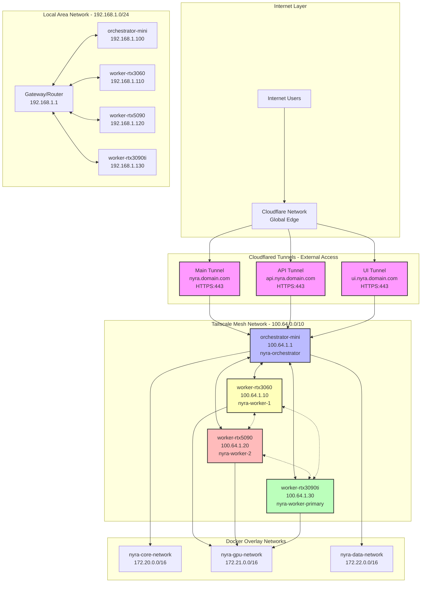
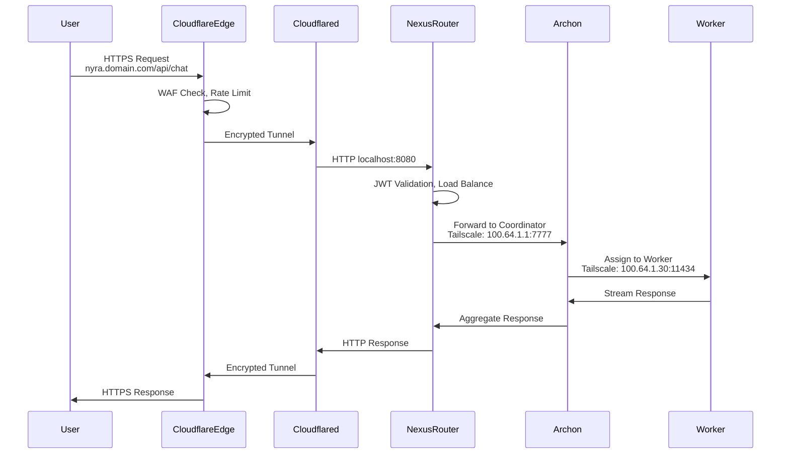
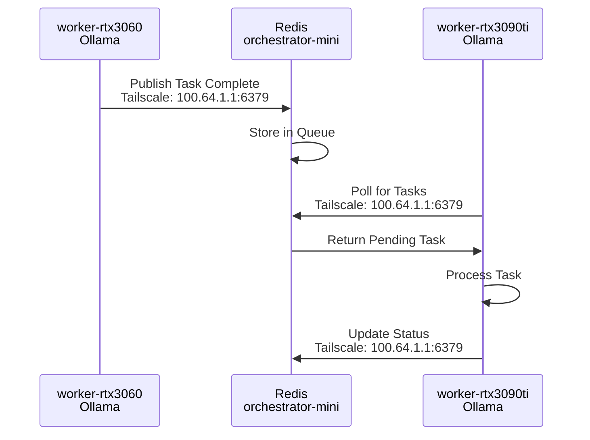
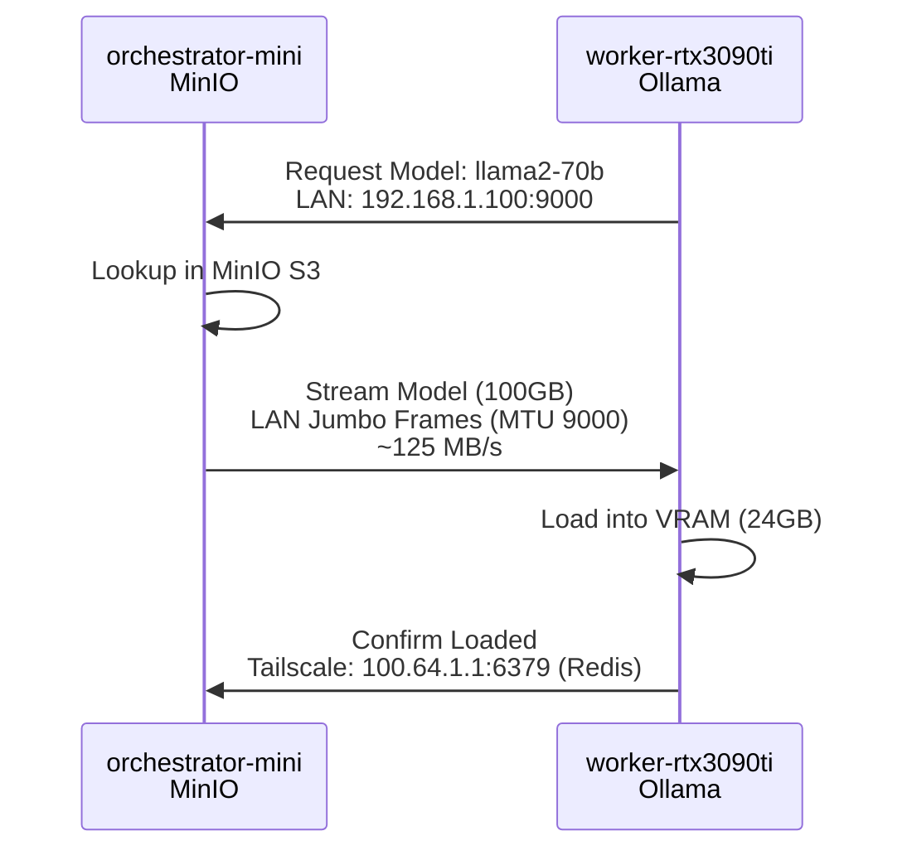
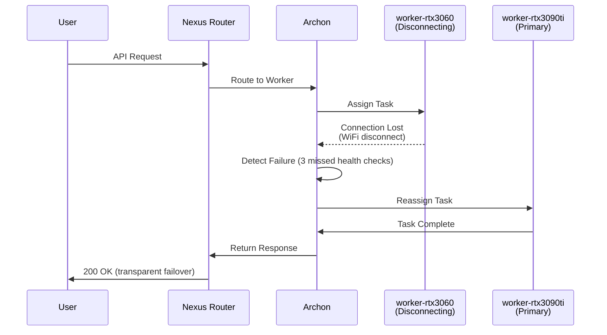
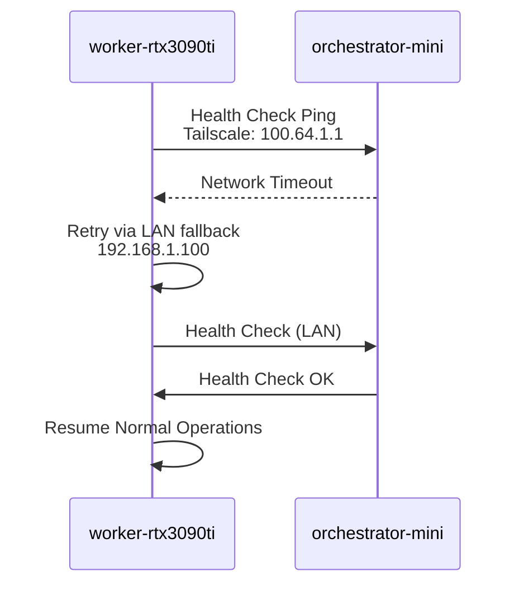

# Project-Nyra Network Topology

## Overview

Project-Nyra implements a multi-layered network architecture with three distinct networking planes:
1. **External Access Plane**: Cloudflared tunnels for internet-facing services
2. **Internal Secure Plane**: Tailscale mesh VPN for inter-node communication
3. **High-Speed Plane**: LAN connectivity for bulk data transfer

## Network Topology Diagram



## Network Layers Detail

### Layer 1: External Access (Cloudflared)

#### Purpose
- Provide secure HTTPS access to internal services without exposing public IP
- Eliminate need for port forwarding and dynamic DNS
- Leverage Cloudflare's global CDN and DDoS protection
- Terminate SSL/TLS at edge for improved security

#### Configuration

**Cloudflared Installation (orchestrator-mini)**:
```bash
# Install cloudflared
curl -L https://github.com/cloudflare/cloudflared/releases/latest/download/cloudflared-linux-amd64 -o /usr/local/bin/cloudflared
chmod +x /usr/local/bin/cloudflared

# Authenticate
cloudflared tunnel login

# Create tunnel
cloudflared tunnel create nyra-main
```

**Tunnel Configuration** (`/etc/cloudflared/config.yml`):
```yaml
tunnel: nyra-main
credentials-file: /root/.cloudflared/nyra-main.json

ingress:
  # Main entrypoint - Nexus Router
  - hostname: nyra.yourdomain.com
    service: http://localhost:8080
    originRequest:
      connectTimeout: 30s
      noTLSVerify: false

  # API-specific tunnel
  - hostname: api.nyra.yourdomain.com
    service: http://localhost:7777
    originRequest:
      connectTimeout: 60s
      httpHostHeader: api.nyra.internal

  # UI tunnel - load balanced to available UI
  - hostname: ui.nyra.yourdomain.com
    service: http://localhost:8080/ui
    originRequest:
      connectTimeout: 30s

  # Catch-all rule (required)
  - service: http_status:404
```

**DNS Records (Cloudflare Dashboard)**:
```
Type  Name              Content
CNAME nyra              nyra-main.cfargotunnel.com
CNAME api.nyra          nyra-main.cfargotunnel.com
CNAME ui.nyra           nyra-main.cfargotunnel.com
```

**Systemd Service** (`/etc/systemd/system/cloudflared.service`):
```ini
[Unit]
Description=Cloudflare Tunnel
After=network.target

[Service]
Type=simple
User=root
ExecStart=/usr/local/bin/cloudflared tunnel --config /etc/cloudflared/config.yml run
Restart=on-failure
RestartSec=5s

[Install]
WantedBy=multi-user.target
```

#### Security Features
- **Zero Trust Access**: Cloudflare Access for authentication
- **Rate Limiting**: 100 req/min per IP (configurable)
- **WAF Rules**: Block SQL injection, XSS, common exploits
- **Bot Management**: Challenge suspicious traffic
- **SSL/TLS**: TLS 1.3 with strong cipher suites

#### Traffic Flow
```
User Browser
  |
  v
HTTPS (TLS 1.3)
  |
  v
Cloudflare Edge (DDoS protection, WAF)
  |
  v
Cloudflared Tunnel (Encrypted)
  |
  v
orchestrator-mini:8080 (Nexus Router)
  |
  v
Internal Service Routing
```

#### Performance Characteristics
- **Latency**: +10-30ms (Cloudflare edge processing)
- **Bandwidth**: Limited by upload bandwidth (typically 10-100 Mbps)
- **Availability**: 99.99% SLA (Cloudflare network)
- **Geographic Distribution**: Automatic routing to nearest edge

### Layer 2: Tailscale Mesh VPN

#### Purpose
- Secure peer-to-peer connectivity between all Nyra nodes
- Automatic NAT traversal (no port forwarding required)
- Encrypted overlay network (WireGuard protocol)
- Persistent connections even when laptops roam networks

#### Architecture

**Mesh Topology**:
```
orchestrator-mini (100.64.1.1)
    |
    +-- Direct connection --> worker-rtx3090ti (100.64.1.30)
    |
    +-- Relayed connection --> worker-rtx3060 (100.64.1.10) [WiFi]
    |
    +-- Relayed connection --> worker-rtx5090 (100.64.1.20) [WiFi]

worker-rtx3060 <---> worker-rtx5090 (peer-to-peer when on same LAN)
worker-rtx5090 <---> worker-rtx3090ti (peer-to-peer when on same LAN)
```

**MagicDNS Resolution**:
```
nyra-orchestrator.tail-scale.ts.net  -> 100.64.1.1
nyra-worker-1.tail-scale.ts.net      -> 100.64.1.10
nyra-worker-2.tail-scale.ts.net      -> 100.64.1.20
nyra-worker-primary.tail-scale.ts.net -> 100.64.1.30
```

#### Installation & Configuration

**Install Tailscale (All Nodes)**:
```bash
# Ubuntu/Debian
curl -fsSL https://tailscale.com/install.sh | sh

# Start and authenticate
sudo tailscale up --advertise-tags=tag:nyra-node

# Verify connection
tailscale status
```

**ACL Configuration** (Tailscale Admin Console):
```json
{
  "tagOwners": {
    "tag:nyra-orchestrator": ["admin@yourdomain.com"],
    "tag:nyra-worker": ["admin@yourdomain.com"]
  },

  "acls": [
    {
      "action": "accept",
      "src": ["tag:nyra-orchestrator"],
      "dst": [
        "tag:nyra-worker:*"
      ]
    },
    {
      "action": "accept",
      "src": ["tag:nyra-worker"],
      "dst": [
        "tag:nyra-orchestrator:6379",
        "tag:nyra-orchestrator:5432",
        "tag:nyra-orchestrator:8080",
        "tag:nyra-orchestrator:7777"
      ]
    },
    {
      "action": "accept",
      "src": ["tag:nyra-worker"],
      "dst": ["tag:nyra-worker:11434"]
    }
  ],

  "ssh": [
    {
      "action": "accept",
      "src": ["tag:nyra-orchestrator"],
      "dst": ["tag:nyra-worker"],
      "users": ["autogroup:admin"]
    }
  ]
}
```

**Static IP Assignment** (Tailscale Admin Console):
```
Device               Tag                    Static IP
orchestrator-mini    tag:nyra-orchestrator  100.64.1.1
worker-rtx3060       tag:nyra-worker        100.64.1.10
worker-rtx5090       tag:nyra-worker        100.64.1.20
worker-rtx3090ti     tag:nyra-worker        100.64.1.30
```

#### Connection Types

**Direct Connection** (Best Performance):
- Peer-to-peer UDP hole-punching
- Latency: <5ms (LAN) or <20ms (same region)
- Bandwidth: ~500-800 Mbps
- Used when both nodes behind non-restrictive NAT

**DERP Relay** (Fallback):
- Proxied through Tailscale relay servers
- Latency: +20-50ms
- Bandwidth: ~100-300 Mbps
- Used when direct connection impossible (strict NAT, firewall)

**Subnet Routing** (Optional):
- Expose entire LAN subnet (192.168.1.0/24) via Tailscale
- Enable on orchestrator-mini: `tailscale up --advertise-routes=192.168.1.0/24`
- Allows remote access to non-Tailscale devices

#### Performance Characteristics
- **Encryption**: ChaCha20-Poly1305 (WireGuard)
- **MTU**: 1280 bytes (standard), 1420 bytes (optimized)
- **Keepalive**: 25 seconds
- **Handshake**: Every 2 minutes
- **CPU Overhead**: <5% per connection
- **Memory**: ~20MB per device

#### Failure Scenarios

**Worker Goes Offline**:
```
1. Tailscale detects missed keepalives (75 seconds)
2. Marks peer as offline in status
3. Archon health check fails (parallel detection)
4. Traffic automatically reroutes to online workers
5. On reconnect, Tailscale re-establishes in <5 seconds
```

**Orchestrator Reboot**:
```
1. Tailscale daemon starts on boot (systemd)
2. Authenticates with stored credentials
3. Re-establishes mesh within 10-20 seconds
4. Workers reconnect via DERP relay if needed
5. Direct connections re-established after NAT traversal
```

### Layer 3: Local Area Network (LAN)

#### Purpose
- High-speed bulk data transfer (model files, datasets)
- Low-latency coordination traffic
- Fallback when Tailscale connectivity issues
- Network boot and Wake-on-LAN

#### Configuration

**Static IP Assignment** (Router DHCP or `/etc/netplan/`):
```yaml
# /etc/netplan/01-netcfg.yaml (orchestrator-mini)
network:
  version: 2
  ethernets:
    eth0:
      addresses:
        - 192.168.1.100/24
      gateway4: 192.168.1.1
      nameservers:
        addresses:
          - 1.1.1.1
          - 8.8.8.8
      mtu: 9000  # Jumbo frames for high-speed transfer
```

**Jumbo Frames Configuration** (All Nodes):
```bash
# Verify support
ip link show eth0 | grep mtu

# Set MTU
sudo ip link set eth0 mtu 9000

# Make persistent
echo "MTU=9000" | sudo tee -a /etc/network/interfaces.d/eth0
```

**Network Performance Tuning** (`/etc/sysctl.conf`):
```bash
# Increase buffer sizes for high-throughput
net.core.rmem_max = 134217728
net.core.wmem_max = 134217728
net.ipv4.tcp_rmem = 4096 87380 67108864
net.ipv4.tcp_wmem = 4096 65536 67108864

# Enable TCP window scaling
net.ipv4.tcp_window_scaling = 1

# Increase connection backlog
net.core.somaxconn = 4096
net.core.netdev_max_backlog = 5000
```

#### Bandwidth Allocation

**Traffic Prioritization** (QoS on Router):
```
Priority 1 (Highest): Archon coordination traffic (port 7777)
Priority 2: Ollama/vLLM inference traffic (ports 11434, 8000)
Priority 3: Database queries (PostgreSQL 5432, Redis 6379)
Priority 4: Model file transfers (large bulk transfers)
Priority 5 (Lowest): Web UI traffic, monitoring
```

**Expected Throughput**:
```
Model Transfer (100GB):
  Without Jumbo Frames: ~110 MB/s = 15 minutes
  With Jumbo Frames:    ~125 MB/s = 13 minutes

Inference API Traffic:
  Typical: 1-10 MB/s per request
  Burst: Up to 100 MB/s

Coordination Traffic:
  Typical: <1 MB/s (mostly small messages)
```

#### Wake-on-LAN Configuration

**Enable WoL (Worker Nodes BIOS)**:
1. Enter BIOS/UEFI setup
2. Navigate to Power Management
3. Enable "Wake on LAN" or "Wake on PCIe"
4. Save and exit

**Network Interface Configuration**:
```bash
# Enable WoL on network interface (persist across reboots)
sudo ethtool -s eth0 wol g

# Verify WoL is enabled
sudo ethtool eth0 | grep "Wake-on"
# Should show: Wake-on: g

# Make persistent (Ubuntu/systemd)
cat << EOF | sudo tee /etc/systemd/system/wol-enable.service
[Unit]
Description=Enable Wake-on-LAN
After=network.target

[Service]
Type=oneshot
ExecStart=/sbin/ethtool -s eth0 wol g

[Install]
WantedBy=multi-user.target
EOF

sudo systemctl enable wol-enable.service
```

**WoL Script (orchestrator-mini)**:
```bash
#!/bin/bash
# /usr/local/bin/nyra-wake-worker.sh

WORKER_NAME=$1

case $WORKER_NAME in
  rtx3060)
    MAC="AA:BB:CC:DD:EE:01"
    IP="192.168.1.110"
    ;;
  rtx5090)
    MAC="AA:BB:CC:DD:EE:02"
    IP="192.168.1.120"
    ;;
  *)
    echo "Unknown worker: $WORKER_NAME"
    exit 1
    ;;
esac

echo "Waking $WORKER_NAME ($MAC)..."
wakeonlan $MAC

# Wait for boot and ping
for i in {1..60}; do
  if ping -c 1 -W 1 $IP &>/dev/null; then
    echo "$WORKER_NAME is online after $i seconds"
    exit 0
  fi
  sleep 1
done

echo "WARNING: $WORKER_NAME did not respond after 60 seconds"
exit 1
```

**Integration with Archon**:
```javascript
// Archon health check with auto-wake
async function checkWorkerHealth(workerName) {
  const worker = getWorker(workerName);

  if (!worker.isOnline) {
    logger.warn(`Worker ${workerName} is offline, attempting WoL...`);

    if (worker.supportsWoL) {
      exec(`/usr/local/bin/nyra-wake-worker.sh ${workerName}`);

      // Wait for boot (90 seconds timeout)
      await waitForWorkerOnline(workerName, 90000);

      if (worker.isOnline) {
        logger.info(`Worker ${workerName} successfully woken`);
        return true;
      }
    }

    logger.error(`Worker ${workerName} failed to wake, redistributing tasks`);
    redistributeTasks(workerName);
    return false;
  }

  return true;
}
```

### Layer 4: Docker Overlay Networks

#### Purpose
- Isolate container traffic by function
- Enable service discovery between containers
- Support multi-host container networking
- Provide network-level security boundaries

#### Network Definitions

**nyra-core-network** (172.20.0.0/16):
- **Purpose**: Orchestration and coordination services
- **Services**: Nexus Router, Archon, MCP Hub, Redis, PostgreSQL
- **Isolation**: No direct GPU worker access
- **MTU**: 1500 (default)

**nyra-gpu-network** (172.21.0.0/16):
- **Purpose**: GPU compute services
- **Services**: Ollama, vLLM on all workers
- **Routing**: Can communicate with nyra-core-network
- **MTU**: 9000 (jumbo frames for model transfer)

**nyra-data-network** (172.22.0.0/16):
- **Purpose**: Data layer services
- **Services**: PostgreSQL, Redis, MinIO
- **Isolation**: Only accessible from core and GPU networks
- **Encryption**: Optional IPSec overlay

#### Docker Network Commands

**Create Networks (orchestrator-mini)**:
```bash
# Core orchestration network
docker network create \
  --driver overlay \
  --subnet=172.20.0.0/16 \
  --gateway=172.20.0.1 \
  --attachable \
  nyra-core-network

# GPU compute network
docker network create \
  --driver overlay \
  --subnet=172.21.0.0/16 \
  --gateway=172.21.0.1 \
  --opt com.docker.network.driver.mtu=9000 \
  --attachable \
  nyra-gpu-network

# Data layer network
docker network create \
  --driver overlay \
  --subnet=172.22.0.0/16 \
  --gateway=172.22.0.1 \
  --attachable \
  nyra-data-network
```

**Service IP Assignments**:
```
nyra-core-network:
  172.20.0.10: nexus-router
  172.20.0.20: archon-coordinator
  172.20.0.30-39: mcp-hub-* (10 MCP servers)
  172.20.0.50: prometheus
  172.20.0.51: grafana

nyra-gpu-network:
  172.21.1.10: ollama-rtx3060
  172.21.1.11: vllm-rtx3060
  172.21.2.10: ollama-rtx5090
  172.21.2.11: vllm-rtx5090
  172.21.3.10: ollama-rtx3090ti
  172.21.3.11: vllm-rtx3090ti

nyra-data-network:
  172.22.0.10: postgresql
  172.22.0.20: redis
  172.22.0.30: minio
```

## Network Communication Flows

### External User Request Flow



### Internal Worker-to-Worker Communication



### Model Transfer Flow (LAN)



## Network Failover Scenarios

### Scenario 1: Worker Laptop Disconnects (WiFi)



### Scenario 2: Orchestrator Network Hiccup



## Network Security Hardening

### Firewall Rules (iptables)

**orchestrator-mini** (`/etc/iptables/rules.v4`):
```bash
*filter
:INPUT DROP [0:0]
:FORWARD DROP [0:0]
:OUTPUT ACCEPT [0:0]

# Allow loopback
-A INPUT -i lo -j ACCEPT

# Allow established connections
-A INPUT -m state --state RELATED,ESTABLISHED -j ACCEPT

# Allow Tailscale
-A INPUT -i tailscale0 -j ACCEPT

# Allow SSH from Tailscale only
-A INPUT -p tcp --dport 22 -i tailscale0 -j ACCEPT

# Allow Docker networks
-A INPUT -i docker0 -j ACCEPT
-A INPUT -i br-+ -j ACCEPT

# Allow ICMP (ping)
-A INPUT -p icmp -j ACCEPT

# Log dropped packets
-A INPUT -j LOG --log-prefix "iptables-dropped: "

COMMIT
```

**worker-rtx3090ti** (`/etc/iptables/rules.v4`):
```bash
*filter
:INPUT DROP [0:0]
:FORWARD DROP [0:0]
:OUTPUT ACCEPT [0:0]

# Allow loopback
-A INPUT -i lo -j ACCEPT

# Allow established connections
-A INPUT -m state --state RELATED,ESTABLISHED -j ACCEPT

# Allow Tailscale
-A INPUT -i tailscale0 -j ACCEPT

# Allow Ollama API from orchestrator only
-A INPUT -p tcp --dport 11434 -s 100.64.1.1 -j ACCEPT

# Allow vLLM API from orchestrator only
-A INPUT -p tcp --dport 8000 -s 100.64.1.1 -j ACCEPT

# Allow LAN for model transfers
-A INPUT -p tcp -s 192.168.1.0/24 -j ACCEPT

# Block everything else
-A INPUT -j DROP

COMMIT
```

### Docker Network Policies

**Restrict Inter-Container Communication**:
```yaml
# docker-compose.yml
services:
  nexus-router:
    networks:
      nyra-core-network:
        ipv4_address: 172.20.0.10
    # Only core network access

  ollama-rtx3090ti:
    networks:
      nyra-gpu-network:
        ipv4_address: 172.21.3.10
    # Only GPU network access

  postgresql:
    networks:
      nyra-data-network:
        ipv4_address: 172.22.0.10
    # Only data network access
```

### Network Encryption

**Tailscale Encryption**:
- Protocol: WireGuard (ChaCha20-Poly1305)
- Key Rotation: Automatic every 2 minutes
- Authentication: Centralized via Tailscale control plane

**Cloudflared Encryption**:
- TLS 1.3 tunnel to Cloudflare edge
- Mutual TLS (mTLS) for tunnel authentication
- Certificate auto-rotation

**Docker Network Encryption** (Optional):
```bash
# Enable IPSec encryption for Docker overlay networks
docker network create \
  --driver overlay \
  --opt encrypted=true \
  --subnet=172.22.0.0/16 \
  nyra-data-network-encrypted
```

## Network Monitoring

### Prometheus Network Metrics

**Collected Metrics**:
```
# Network throughput
node_network_receive_bytes_total{device="eth0"}
node_network_transmit_bytes_total{device="eth0"}

# Tailscale metrics
tailscale_direct_connections{peer="worker-rtx3090ti"}
tailscale_relay_connections{peer="worker-rtx3060"}
tailscale_latency_ms{peer="worker-rtx5090"}

# Docker network metrics
docker_network_rx_bytes{network="nyra-gpu-network"}
docker_network_tx_bytes{network="nyra-gpu-network"}
```

### Grafana Dashboard Panels

1. **Network Throughput**: Line graph of RX/TX bytes per interface
2. **Tailscale Connectivity**: Status of direct vs relay connections
3. **Latency Heatmap**: P50/P95/P99 latency between nodes
4. **Packet Loss**: Error rate by interface
5. **Firewall Drops**: Blocked connection attempts

## Network Troubleshooting

### Common Issues

**Issue 1: Tailscale Peer Not Reachable**
```bash
# Check Tailscale status
tailscale status

# Check if using DERP relay
tailscale netcheck

# Force re-authentication
sudo tailscale up --force-reauth
```

**Issue 2: High Latency on LAN**
```bash
# Check for packet loss
ping -c 100 192.168.1.100

# Check MTU mismatch
tracepath 192.168.1.100

# Verify jumbo frames
ip link show eth0 | grep mtu
```

**Issue 3: Docker Container Network Isolation**
```bash
# Verify network connectivity from container
docker exec ollama-rtx3090ti ping -c 3 172.22.0.10

# Check Docker network routes
docker network inspect nyra-gpu-network

# Restart Docker network
docker network disconnect nyra-gpu-network ollama-rtx3090ti
docker network connect nyra-gpu-network ollama-rtx3090ti
```

## Capacity Planning

### Bandwidth Requirements

**Baseline (Normal Operation)**:
```
API Traffic:           10 Mbps (average)
Monitoring/Metrics:    5 Mbps
Inter-Worker Comms:    20 Mbps
Total Baseline:        35 Mbps
```

**Peak Load**:
```
API Traffic:           100 Mbps (burst)
Model Transfer:        1000 Mbps (1 Gbps saturated)
Dataset Sync:          500 Mbps
Total Peak:            1600 Mbps (requires Gigabit LAN)
```

### Scaling Considerations

**Adding 5th Worker Node**:
- Tailscale: No configuration change (automatic mesh)
- LAN: Assign static IP 192.168.1.140
- Cloudflared: No change (internal only)
- Docker Networks: Automatic IPAM assignment

**Geographic Distribution**:
- Deploy regional orchestrator clusters
- Use Tailscale subnet routing for inter-region
- Replicate models to regional MinIO instances
- Route users to nearest region via GeoDNS

## Conclusion

This network topology provides:
- **Defense in Depth**: Multiple security layers (Cloudflare, Tailscale, firewall)
- **High Availability**: Automatic failover across network planes
- **Performance**: LAN for bulk transfer, Tailscale for coordination, Cloudflared for external access
- **Flexibility**: Support for disconnectable laptop workers with automatic reconnection
- **Scalability**: Easy addition of new nodes to mesh network
- **Security**: Encrypted tunnels, zero-trust access, network isolation

The multi-plane architecture ensures that Nyra remains operational even if one network layer fails, while optimizing traffic routing based on performance requirements.
