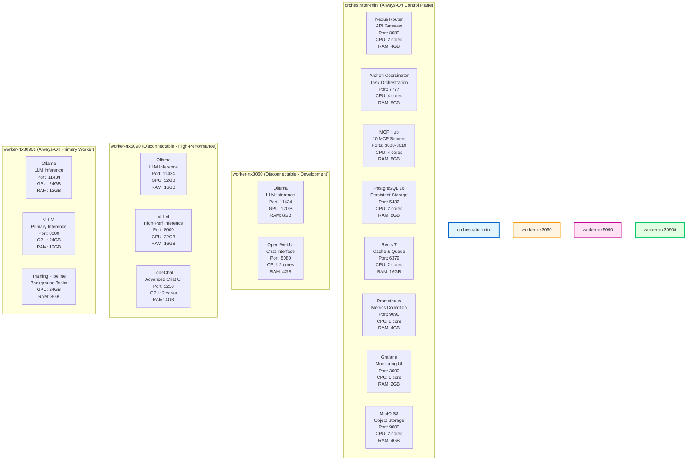
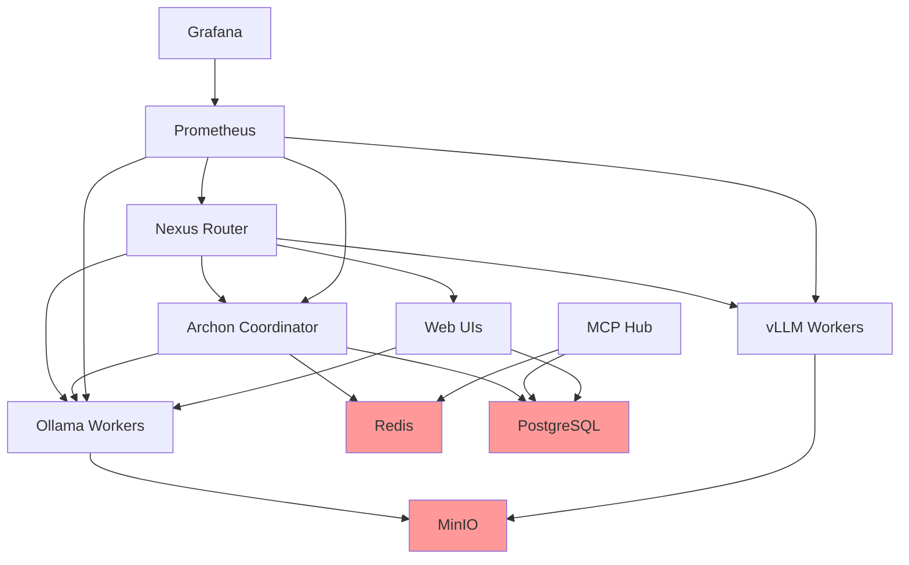

# Project-Nyra Service Distribution

## Overview

This document details the distribution of all services across the 4-PC Project-Nyra infrastructure, including service dependencies, resource allocation, failover strategies, and operational considerations.

## Service Distribution Matrix



## Detailed Service Specifications

### orchestrator-mini Services

#### 1. Nexus Router (API Gateway)

**Purpose**: Centralized entry point for all external and internal API requests

**Technology Stack**:
- Language: Go 1.21+
- Framework: Gin (HTTP router)
- Proxy: nginx (optional reverse proxy)

**Configuration**:
```yaml
# nexus-router.yaml
server:
  host: 0.0.0.0
  port: 8080

routing:
  # Route to Archon for task management
  - path: /api/v1/tasks/*
    backend: http://archon-coordinator:7777
    timeout: 60s

  # Route to Ollama workers (load balanced)
  - path: /api/v1/chat
    backends:
      - http://100.64.1.30:11434  # RTX3090ti (primary)
      - http://100.64.1.20:11434  # RTX5090 (if online)
      - http://100.64.1.10:11434  # RTX3060 (if online)
    strategy: least-connections
    health_check_interval: 30s

  # Route to vLLM workers
  - path: /api/v1/completions
    backends:
      - http://100.64.1.30:8000   # RTX3090ti (primary)
      - http://100.64.1.20:8000   # RTX5090 (if online)
    strategy: round-robin

  # Route to UI services
  - path: /ui/openwebui/*
    backend: http://100.64.1.10:8080

  - path: /ui/lobechat/*
    backend: http://100.64.1.20:3210

middleware:
  - jwt-auth         # JWT token validation
  - rate-limiting    # 100 req/min per IP
  - cors             # Cross-origin headers
  - compression      # gzip response compression
  - logging          # Request logging

security:
  jwt_secret_env: NEXUS_JWT_SECRET
  allowed_origins:
    - https://nyra.yourdomain.com
    - https://ui.nyra.yourdomain.com
```

**Resource Allocation**:
- CPU: 2 cores (burstable to 4)
- Memory: 4GB
- Disk: 10GB (logs)
- Network: 1Gbps LAN

**Health Check**:
```bash
# Endpoint: GET /health
curl http://localhost:8080/health
# Expected: {"status": "healthy", "uptime": 86400, "version": "1.0.0"}
```

**Failure Mode**:
- No failover (single point of failure - consider active/passive HA in future)
- Cloudflared will show error page if Nexus is down
- Monitoring alerts on consecutive failed health checks

---

#### 2. Archon Coordinator (Task Orchestration)

**Purpose**: Intelligent task distribution, worker management, and failover orchestration

**Technology Stack**:
- Language: Rust 1.75+
- Framework: Tokio (async runtime)
- Communication: gRPC + Redis Pub/Sub

**Configuration**:
```toml
# archon.toml
[server]
host = "0.0.0.0"
port = 7777

[redis]
url = "redis://redis:6379"
pool_size = 20

[workers]
health_check_interval = 30  # seconds
health_check_timeout = 10
max_retries = 3

[[workers.nodes]]
name = "worker-rtx3090ti"
address = "100.64.1.30:11434"
gpu_vram = 24576  # MB
capabilities = ["ollama", "vllm", "training"]
priority = 1  # Highest priority (always-on)

[[workers.nodes]]
name = "worker-rtx5090"
address = "100.64.1.20:11434"
gpu_vram = 32768
capabilities = ["ollama", "vllm"]
priority = 2
disconnectable = true
wake_on_lan_mac = "AA:BB:CC:DD:EE:02"

[[workers.nodes]]
name = "worker-rtx3060"
address = "100.64.1.10:11434"
gpu_vram = 12288
capabilities = ["ollama"]
priority = 3
disconnectable = true
wake_on_lan_mac = "AA:BB:CC:DD:EE:01"

[scheduling]
strategy = "least-vram-usage"  # Options: round-robin, least-connections, least-vram-usage
enable_auto_wake = true
failover_timeout = 5  # seconds

[models]
cache_location = "s3://minio/models"
auto_download = true
```

**Core Functions**:

1. **Worker Health Monitoring**:
```rust
async fn health_check_loop() {
    loop {
        for worker in workers.iter() {
            let health = check_worker_health(worker).await;

            if !health.is_ok() {
                handle_worker_failure(worker).await;
            }
        }

        tokio::time::sleep(Duration::from_secs(30)).await;
    }
}
```

2. **Intelligent Task Routing**:
```rust
async fn route_task(task: Task) -> Result<Worker> {
    // Filter workers by capability
    let capable_workers = workers
        .iter()
        .filter(|w| w.has_capability(&task.required_capability))
        .filter(|w| w.is_online())
        .collect();

    // Check VRAM requirements
    let suitable_workers = capable_workers
        .iter()
        .filter(|w| w.available_vram() >= task.required_vram)
        .collect();

    // Select by strategy (least VRAM usage)
    let selected = suitable_workers
        .iter()
        .min_by_key(|w| w.current_vram_usage())
        .ok_or(NoAvailableWorker)?;

    // Fallback: Wake disconnected worker if needed
    if suitable_workers.is_empty() && config.enable_auto_wake {
        wake_best_worker(&task).await?;
    }

    Ok(selected)
}
```

3. **Graceful Failover**:
```rust
async fn handle_worker_failure(worker: &Worker) {
    logger::warn!("Worker {} is offline", worker.name);

    // Mark worker as offline
    worker.set_status(WorkerStatus::Offline);

    // Retrieve in-flight tasks
    let tasks = get_tasks_for_worker(worker).await;

    // Redistribute tasks
    for task in tasks {
        let fallback_worker = find_fallback_worker(&task).await?;
        reschedule_task(task, fallback_worker).await?;
        logger::info!("Rescheduled task {} from {} to {}",
                      task.id, worker.name, fallback_worker.name);
    }

    // Update metrics
    metrics::increment_failover_count(worker.name);
}
```

**Resource Allocation**:
- CPU: 4 cores
- Memory: 8GB
- Disk: 20GB
- Network: 1Gbps LAN

**Health Check**:
```bash
# Endpoint: gRPC HealthCheck service
grpcurl -plaintext localhost:7777 grpc.health.v1.Health/Check
```

**Failure Mode**:
- Critical service (no automatic failover currently)
- All task distribution stops if Archon fails
- Manual restart required
- Future: Active/passive HA with leader election

---

#### 3. MCP Hub (Model Context Protocol Servers)

**Purpose**: Host 10+ MCP servers for specialized AI agent capabilities

**Technology Stack**:
- Language: TypeScript/Node.js 20+
- Framework: Express.js
- Protocol: Model Context Protocol (MCP)

**Deployed MCP Servers** (Ports 3000-3010):
```yaml
mcp_servers:
  - name: filesystem-mcp
    port: 3000
    capabilities: [file-read, file-write, directory-list]

  - name: database-mcp
    port: 3001
    capabilities: [sql-query, schema-inspect]
    db_connection: postgresql://postgres:5432

  - name: web-search-mcp
    port: 3002
    capabilities: [search, scrape, summarize]

  - name: code-analysis-mcp
    port: 3003
    capabilities: [ast-parse, lint, format]

  - name: docker-mcp
    port: 3004
    capabilities: [container-list, exec, logs]

  - name: git-mcp
    port: 3005
    capabilities: [commit, branch, diff]

  - name: slack-mcp
    port: 3006
    capabilities: [send-message, read-channel]

  - name: calendar-mcp
    port: 3007
    capabilities: [create-event, list-events]

  - name: email-mcp
    port: 3008
    capabilities: [send-email, search-inbox]

  - name: analytics-mcp
    port: 3009
    capabilities: [log-event, query-metrics]
```

**Configuration Example** (filesystem-mcp):
```typescript
// filesystem-mcp.ts
import { MCPServer } from '@modelcontextprotocol/sdk';

const server = new MCPServer({
  name: 'filesystem-mcp',
  version: '1.0.0',
  capabilities: ['file-read', 'file-write', 'directory-list']
});

server.tool('read-file', async (params) => {
  const { path } = params;
  const content = await fs.readFile(path, 'utf-8');
  return { content };
});

server.tool('write-file', async (params) => {
  const { path, content } = params;
  await fs.writeFile(path, content);
  return { success: true };
});

server.listen(3000);
```

**Resource Allocation**:
- CPU: 4 cores (distributed across all MCP servers)
- Memory: 8GB (800MB per MCP server)
- Disk: 10GB
- Network: 1Gbps LAN

**Health Check**:
```bash
# Check all MCP servers
for port in {3000..3009}; do
  curl http://localhost:$port/health
done
```

**Failure Mode**:
- Individual MCP server failures isolated
- Nexus Router returns 503 for unavailable MCP capabilities
- Auto-restart on crash (systemd)

---

#### 4. PostgreSQL 16 (Persistent Storage)

**Purpose**: Relational database for configuration, task history, audit logs, and user data

**Configuration**:
```yaml
# postgresql.conf (key settings)
max_connections = 200
shared_buffers = 2GB
effective_cache_size = 6GB
maintenance_work_mem = 512MB
checkpoint_completion_target = 0.9
wal_buffers = 16MB
default_statistics_target = 100
random_page_cost = 1.1  # SSD optimization
effective_io_concurrency = 200
work_mem = 10MB
min_wal_size = 1GB
max_wal_size = 4GB

# Enable pg_stat_statements for query analysis
shared_preload_libraries = 'pg_stat_statements'

# Enable pgvector for embeddings (future)
# shared_preload_libraries = 'pg_stat_statements,vector'
```

**Schema Design**:
```sql
-- Workers table
CREATE TABLE workers (
    id SERIAL PRIMARY KEY,
    name VARCHAR(255) UNIQUE NOT NULL,
    address VARCHAR(255) NOT NULL,
    gpu_model VARCHAR(100),
    gpu_vram_mb INTEGER,
    status VARCHAR(50) DEFAULT 'offline',
    last_health_check TIMESTAMP,
    created_at TIMESTAMP DEFAULT NOW()
);

-- Tasks table
CREATE TABLE tasks (
    id UUID PRIMARY KEY DEFAULT gen_random_uuid(),
    type VARCHAR(100) NOT NULL,
    payload JSONB NOT NULL,
    assigned_worker_id INTEGER REFERENCES workers(id),
    status VARCHAR(50) DEFAULT 'pending',
    created_at TIMESTAMP DEFAULT NOW(),
    started_at TIMESTAMP,
    completed_at TIMESTAMP,
    result JSONB
);

CREATE INDEX idx_tasks_status ON tasks(status);
CREATE INDEX idx_tasks_worker ON tasks(assigned_worker_id);

-- Models table
CREATE TABLE models (
    id SERIAL PRIMARY KEY,
    name VARCHAR(255) UNIQUE NOT NULL,
    size_gb NUMERIC(8,2),
    s3_path VARCHAR(500),
    loaded_on_workers INTEGER[] DEFAULT '{}',
    created_at TIMESTAMP DEFAULT NOW()
);

-- Request logs (audit trail)
CREATE TABLE request_logs (
    id BIGSERIAL PRIMARY KEY,
    endpoint VARCHAR(255),
    method VARCHAR(10),
    user_id VARCHAR(255),
    ip_address INET,
    response_code INTEGER,
    latency_ms INTEGER,
    created_at TIMESTAMP DEFAULT NOW()
);

CREATE INDEX idx_logs_created_at ON request_logs(created_at DESC);
```

**Backup Strategy**:
```bash
# Automated backup script (runs daily via cron)
#!/bin/bash
# /usr/local/bin/pg-backup.sh

BACKUP_DIR="/var/backups/postgresql"
DATE=$(date +%Y%m%d-%H%M%S)

# Full backup
pg_dump -U postgres -F c -f "$BACKUP_DIR/nyra-$DATE.dump" nyra

# Upload to MinIO
aws s3 cp "$BACKUP_DIR/nyra-$DATE.dump" s3://backups/postgresql/

# Retain 30 days locally
find $BACKUP_DIR -name "*.dump" -mtime +30 -delete
```

**Resource Allocation**:
- CPU: 2 cores
- Memory: 8GB
- Disk: 100GB (SSD)
- Network: 1Gbps LAN

**Health Check**:
```bash
pg_isready -U postgres -d nyra
```

**Failure Mode**:
- Critical data loss risk
- Enable WAL archiving for point-in-time recovery
- Future: Streaming replication to standby (orchestrator-mini-replica)

---

#### 5. Redis 7 (Cache & Message Broker)

**Purpose**: In-memory cache for session data, task queue, and pub/sub messaging

**Configuration**:
```conf
# redis.conf
bind 0.0.0.0
port 6379
requirepass "STRONG_PASSWORD_HERE"

# Memory management
maxmemory 16gb
maxmemory-policy allkeys-lru

# Persistence (RDB + AOF)
save 900 1
save 300 10
save 60 10000
appendonly yes
appendfsync everysec

# Replication (optional for HA)
# replicaof orchestrator-mini-replica 6379

# Performance tuning
tcp-backlog 511
timeout 0
tcp-keepalive 300
```

**Data Structures**:
```
# Task queue (list)
RPUSH nyra:tasks:pending "{task_json}"
BLPOP nyra:tasks:pending 30

# Worker status (hash)
HSET nyra:worker:rtx3090ti status online
HSET nyra:worker:rtx3090ti vram_used 12000
HGETALL nyra:worker:rtx3090ti

# Session cache (string with TTL)
SETEX nyra:session:abc123 3600 "{user_data}"
GET nyra:session:abc123

# Pub/Sub (for real-time updates)
PUBLISH nyra:events:worker-status "{worker: 'rtx3060', status: 'offline'}"
SUBSCRIBE nyra:events:*
```

**Resource Allocation**:
- CPU: 2 cores
- Memory: 16GB
- Disk: 10GB (persistence files)
- Network: 1Gbps LAN

**Health Check**:
```bash
redis-cli -a "$REDIS_PASSWORD" PING
```

**Failure Mode**:
- High availability with Redis Sentinel (future)
- AOF file corruption recovery: `redis-check-aof --fix`

---

#### 6. Prometheus (Metrics Collection)

**Purpose**: Time-series database for metrics, alerting, and observability

**Configuration**:
```yaml
# prometheus.yml
global:
  scrape_interval: 15s
  evaluation_interval: 15s
  external_labels:
    cluster: 'nyra-production'

alerting:
  alertmanagers:
    - static_configs:
        - targets: ['localhost:9093']

scrape_configs:
  # Orchestrator-mini services
  - job_name: 'nexus-router'
    static_configs:
      - targets: ['nexus-router:8080']

  - job_name: 'archon-coordinator'
    static_configs:
      - targets: ['archon-coordinator:7777']

  # Node exporters (system metrics)
  - job_name: 'node-exporter'
    static_configs:
      - targets:
        - '100.64.1.1:9100'    # orchestrator-mini
        - '100.64.1.10:9100'   # worker-rtx3060
        - '100.64.1.20:9100'   # worker-rtx5090
        - '100.64.1.30:9100'   # worker-rtx3090ti

  # GPU exporters (NVIDIA metrics)
  - job_name: 'nvidia-gpu'
    static_configs:
      - targets:
        - '100.64.1.10:9445'   # worker-rtx3060
        - '100.64.1.20:9445'   # worker-rtx5090
        - '100.64.1.30:9445'   # worker-rtx3090ti

  # Database exporters
  - job_name: 'postgresql'
    static_configs:
      - targets: ['postgres-exporter:9187']

  - job_name: 'redis'
    static_configs:
      - targets: ['redis-exporter:9121']
```

**Resource Allocation**:
- CPU: 1 core
- Memory: 4GB
- Disk: 50GB (time-series data)
- Network: 1Gbps LAN

**Retention Policy**:
- 15-day local retention
- 90-day retention in external Prometheus (future)

---

#### 7. Grafana (Monitoring Dashboards)

**Purpose**: Visualization and alerting interface for Prometheus metrics

**Pre-configured Dashboards**:
1. Infrastructure Overview
2. GPU Performance
3. Service Health
4. Request Analytics
5. Capacity Planning

**Resource Allocation**:
- CPU: 1 core
- Memory: 2GB
- Disk: 10GB
- Network: 1Gbps LAN

---

#### 8. MinIO (S3-Compatible Object Storage)

**Purpose**: Store model files, artifacts, backups, and large datasets

**Configuration**:
```yaml
# minio.env
MINIO_ROOT_USER=admin
MINIO_ROOT_PASSWORD=STRONG_PASSWORD
MINIO_VOLUMES="/mnt/data"
MINIO_OPTS="--console-address :9001"
```

**Bucket Structure**:
```
nyra-models/          # LLM model files
  ├── llama2-7b/
  ├── llama2-13b/
  ├── llama2-70b/
  └── mixtral-8x7b/

nyra-datasets/        # Training datasets
  ├── fine-tuning/
  └── evaluation/

nyra-backups/         # Database backups
  ├── postgresql/
  └── redis/

nyra-artifacts/       # Training artifacts
  ├── checkpoints/
  └── logs/
```

**Resource Allocation**:
- CPU: 2 cores
- Memory: 4GB
- Disk: 500GB (expandable)
- Network: 1Gbps LAN

---

### worker-rtx3060 Services (Disconnectable)

#### 1. Ollama (LLM Inference)

**Purpose**: Serve small-to-medium LLMs (7B-13B parameters)

**Configuration**:
```yaml
# ollama-config.yaml
server:
  host: 0.0.0.0
  port: 11434

models:
  - name: llama2-7b
    vram_required: 8000  # MB
  - name: mistral-7b
    vram_required: 8000
  - name: phi-3-mini
    vram_required: 4000

gpu:
  device: 0  # RTX 3060
  max_vram_mb: 12288
  compute_capability: 8.6
```

**Resource Allocation**:
- GPU: RTX 3060 (12GB VRAM)
- CPU: 4 cores
- Memory: 8GB
- Disk: 200GB (model storage)

**Failover Target**: worker-rtx3090ti

---

#### 2. Open-WebUI (Chat Interface)

**Purpose**: Provide web-based chat UI for AI interactions

**Configuration**:
```env
# open-webui.env
OLLAMA_API_BASE_URL=http://localhost:11434
WEBUI_AUTH=True
WEBUI_JWT_SECRET_KEY=secret
```

**Resource Allocation**:
- CPU: 2 cores
- Memory: 4GB
- Disk: 10GB

**Failover**: None (client reconnects to orchestrator-mini if worker offline)

---

### worker-rtx5090 Services (Disconnectable)

#### 1. Ollama (LLM Inference)

**Purpose**: Serve large LLMs (70B+ parameters)

**Configuration**:
```yaml
models:
  - name: llama2-70b
    vram_required: 28000  # MB
  - name: mixtral-8x7b
    vram_required: 24000

gpu:
  device: 0  # RTX 5090
  max_vram_mb: 32768
  compute_capability: 9.0
```

**Resource Allocation**:
- GPU: RTX 5090 (32GB VRAM)
- CPU: 6 cores
- Memory: 16GB
- Disk: 500GB

**Failover Target**: Distribute to worker-rtx3090ti (smaller models) or cloud (future)

---

#### 2. vLLM (High-Performance Inference)

**Purpose**: High-throughput LLM serving with optimizations

**Configuration**:
```yaml
# vllm-config.yaml
model: meta-llama/Llama-2-70b-chat-hf
tensor_parallel_size: 1
gpu_memory_utilization: 0.9
max_num_seqs: 256
```

**Resource Allocation**:
- GPU: RTX 5090 (32GB VRAM)
- CPU: 6 cores
- Memory: 16GB

---

#### 3. LobeChat (Advanced Chat UI)

**Purpose**: Feature-rich chat interface with plugin support

**Configuration**:
```env
NEXT_PUBLIC_OLLAMA_URL=http://localhost:11434
DATABASE_URL=postgresql://postgres:5432/lobechat
```

**Resource Allocation**:
- CPU: 2 cores
- Memory: 4GB
- Disk: 10GB

---

### worker-rtx3090ti Services (Always-On Primary)

#### 1. Ollama (LLM Inference)

**Purpose**: Primary inference backend, failover target

**Configuration**:
```yaml
models:
  - name: llama2-13b
    vram_required: 14000
  - name: codellama-34b
    vram_required: 20000
  - name: mixtral-8x7b
    vram_required: 24000
```

**Resource Allocation**:
- GPU: RTX 3090 Ti (24GB VRAM)
- CPU: 6 cores
- Memory: 12GB
- Disk: 500GB

---

#### 2. vLLM (Primary Inference Engine)

**Purpose**: Primary high-performance inference, always available

**Resource Allocation**:
- GPU: RTX 3090 Ti (24GB VRAM)
- CPU: 6 cores
- Memory: 12GB

---

#### 3. Training Pipeline (Background Tasks)

**Purpose**: Fine-tuning, model training, background batch processing

**Configuration**:
```yaml
training:
  framework: pytorch
  distributed: false
  checkpointing: true
  checkpoint_dir: s3://nyra-artifacts/checkpoints
```

**Resource Allocation**:
- GPU: RTX 3090 Ti (24GB VRAM) - scheduled during low-usage periods
- CPU: 4 cores
- Memory: 8GB

---

## Service Dependencies



**Critical Dependencies** (Service cannot start without these):
- Archon → Redis, PostgreSQL
- MCP Hub → PostgreSQL
- Ollama → MinIO (for model downloads)
- Web UIs → PostgreSQL

**Soft Dependencies** (Service degrades gracefully):
- Nexus Router → Prometheus (metrics collection fails)
- Archon → Disconnectable workers (falls back to primary worker)

---

## Failover Strategies

### Scenario 1: worker-rtx3060 Disconnects (WiFi)

**Detection**:
- Archon health check fails (3 consecutive timeouts)
- Tailscale reports peer offline

**Action**:
1. Mark worker-rtx3060 as offline in Redis
2. Retrieve in-flight tasks assigned to rtx3060
3. Reassign tasks to worker-rtx3090ti
4. Update Nexus Router load balancer to exclude rtx3060
5. Return error to Open-WebUI clients (reconnect to orchestrator)

**Recovery**:
- Laptop reconnects to WiFi
- Tailscale re-establishes mesh connection
- Archon detects online status
- Re-add to load balancer pool
- Resume normal operations

**Estimated Downtime**: 5-10 seconds (transparent to users)

---

### Scenario 2: worker-rtx5090 Disconnects (Battery Power)

**Detection**:
- Same as Scenario 1

**Action**:
1. Mark worker-rtx5090 as offline
2. Large model requests (70B) → Fail or queue for wake
3. Medium model requests (8x7b) → Reassign to worker-rtx3090ti
4. vLLM requests → Failover to worker-rtx3090ti vLLM
5. LobeChat → Return 503 error (user switches to Open-WebUI)

**Wake-on-LAN Trigger** (if high demand):
```bash
# Archon detects queue depth > 50 for large models
if queue_depth("llama2-70b") > 50 && !worker_online("rtx5090"):
    send_wol_packet("AA:BB:CC:DD:EE:02")
    wait_for_online("rtx5090", timeout=90)
```

**Recovery**:
- Manual laptop power-on or WoL trigger
- 60-90 second boot time
- Services auto-start (systemd)
- Archon re-registers worker
- Resume large model inference

**Estimated Downtime**: 90-120 seconds (for WoL scenario)

---

### Scenario 3: orchestrator-mini Failure (Critical)

**Detection**:
- Prometheus alerts on orchestrator down
- Workers lose connection to Archon, Redis, PostgreSQL
- External users see Cloudflare error page

**Action**:
1. **Immediate**: All task distribution stops
2. **Manual**: Admin investigates orchestrator-mini (hardware failure, power loss)
3. **Recovery**: Restart orchestrator-mini or failover to backup (future HA setup)

**Mitigation** (Future Enhancements):
- Deploy orchestrator-mini-replica on worker-rtx3090ti
- Enable PostgreSQL streaming replication
- Redis Sentinel for automatic failover
- Keepalived for VIP failover

**Estimated Downtime**: 5-15 minutes (manual recovery)

---

### Scenario 4: worker-rtx3090ti Failure (Primary Worker)

**Detection**:
- Archon health check fails
- All tasks assigned to rtx3090ti timeout

**Action**:
1. Attempt to wake worker-rtx3060 and worker-rtx5090 (if offline)
2. Redistribute tasks across available workers
3. Alert admin (critical worker down)
4. Reduce service capacity (reject new requests if insufficient capacity)

**Mitigation**:
- Always-on UPS for worker-rtx3090ti
- Auto-restart on crash (systemd)
- Hardware monitoring (temperature, disk health)

**Estimated Downtime**: 2-5 minutes (auto-restart) or 10-20 minutes (manual intervention)

---

## Operational Procedures

### Adding a New Worker Node

1. **Hardware Setup**:
   - Install Ubuntu 22.04 LTS
   - Install NVIDIA drivers + CUDA toolkit
   - Install Docker + NVIDIA Container Toolkit

2. **Network Configuration**:
   - Assign static IP (e.g., 192.168.1.140)
   - Install Tailscale: `curl -fsSL https://tailscale.com/install.sh | sh`
   - Join mesh: `sudo tailscale up --advertise-tags=tag:nyra-worker`

3. **Service Deployment**:
   ```bash
   # Deploy Ollama
   docker run -d --gpus all \
     --name ollama-rtx4090 \
     -p 11434:11434 \
     -v /models:/root/.ollama \
     ollama/ollama
   ```

4. **Register with Archon**:
   - Update `archon.toml` with new worker definition
   - Restart Archon: `docker restart archon-coordinator`
   - Verify: `curl http://100.64.1.1:7777/api/v1/workers`

---

### Scaling Model Capacity

**When to Scale**:
- Average GPU utilization > 80% for 10+ minutes
- Request queue depth > 50 tasks
- P95 latency > 5 seconds

**Options**:
1. **Add Worker Node**: Follow "Adding a New Worker Node" procedure
2. **Upgrade GPU**: Replace RTX 3060 → RTX 4070
3. **Cloud Burst**: Spin up AWS g5.xlarge instance, register with Archon
4. **Optimize Models**: Use quantization (8-bit, 4-bit) to reduce VRAM usage

---

### Disaster Recovery Drill

**Quarterly Test**:
1. Simulate orchestrator-mini failure (shutdown VM)
2. Measure detection time (should be <2 minutes)
3. Restore from PostgreSQL backup
4. Verify service resumption
5. Document recovery time and improvements

---

## Capacity Planning

### Current Capacity (4-PC Setup)

**GPU Compute**:
- Total VRAM: 68GB
- Concurrent 7B models: ~6-8 instances
- Concurrent 13B models: ~4-5 instances
- Concurrent 70B models: 1-2 instances (requires RTX5090)

**Request Throughput**:
- Ollama: ~20 requests/second (across all workers)
- vLLM: ~50 requests/second (optimized inference)

**Storage**:
- Model storage: 1TB total (across workers)
- Object storage: 500GB (MinIO on orchestrator-mini)
- Database: 100GB (PostgreSQL)

### Scaling Targets (6-Month Projection)

**Growth Assumptions**:
- 3x increase in request volume
- 2x increase in model count
- 50% increase in user base

**Required Additions**:
- +2 worker nodes (RTX 4090 or equivalent)
- +500GB MinIO storage expansion
- +200GB PostgreSQL storage
- +1 orchestrator-mini replica (HA)

---

## Conclusion

This service distribution provides:
- **Centralized Control**: orchestrator-mini as single control plane
- **Distributed Compute**: GPU workers for parallel inference
- **High Availability**: Automatic failover for disconnectable workers
- **Scalability**: Easy addition of new worker nodes
- **Operational Simplicity**: Docker Compose for deployment
- **Cost Efficiency**: Local GPU compute vs cloud alternatives

The architecture balances always-on reliability with on-demand high-performance compute, creating a flexible distributed AI infrastructure.
