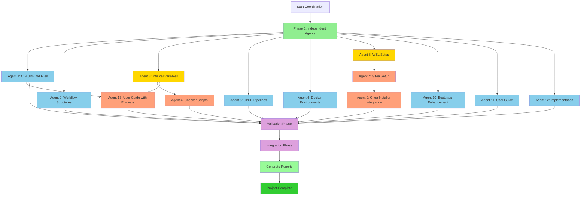

# Project-Nyra: Agent Dependency Graph

## Visual Workflow



## Dependency Matrix

| Agent | Depends On | Blocks | Phase | Priority |
|-------|------------|--------|-------|----------|
| 1 | None | 13 | 1 | High |
| 2 | None | - | 1 | Medium |
| 3 | None | 4, 13 | 1 | Critical |
| 4 | 3 | - | 2 | Medium |
| 5 | None | - | 1 | High |
| 6 | None | - | 1 | High |
| 7 | 8 | 9 | 2 | High |
| 8 | None | 7 | 1 | Critical |
| 9 | 7 | - | 2 | Medium |
| 10 | None | - | 1 | Medium |
| 11 | None | - | 1 | Medium |
| 12 | None | - | 1 | High |
| 13 | 1, 3 | - | 2 | High |

## Critical Path Analysis

**Critical Path**: Start → Agent 3 → Agent 4 → Validation → Integration → Complete
**Critical Path**: Start → Agent 8 → Agent 7 → Agent 9 → Validation → Integration → Complete
**Critical Path**: Start → Agent 1 → Agent 13 → Validation → Integration → Complete

**Estimated Duration**:
- Phase 1: 15-20 minutes (parallel execution)
- Phase 2: 10-15 minutes (sequential with some parallelism)
- Validation: 5 minutes
- Integration: 5 minutes
- **Total**: 35-45 minutes

## Parallel Execution Groups

### Group 1 (Can Run Simultaneously)
- Agent 1, 2, 3, 5, 6, 8, 10, 11, 12

### Group 2 (After Group 1 Specific Agents)
- Agent 4 (after Agent 3)
- Agent 7 (after Agent 8)
- Agent 13 (after Agents 1 & 3)

### Group 3 (After Group 2)
- Agent 9 (after Agent 7)

## Conflict Prevention

### No Directory Overlap
```
apps/            → Agents 1, 12 (different files: CLAUDE.md vs implementation)
docs/            → Agents 2, 11, 13 (different subdirectories)
bootstrap/       → Agents 7, 8, 9, 10 (different subdirectories)
config/          → Agent 3 only
scripts/         → Agent 4 only
.github/         → Agent 5 only
docker/          → Agent 6 only
```

### File Access Strategy
- **Exclusive Write**: Each agent has exclusive write access to its assigned files
- **Read Access**: All agents can read completed outputs from other agents
- **Memory Coordination**: Status updates via memory, not file polling

## Integration Points

### Agent 3 → Agent 4
**Data Transfer**: Infisical variable definitions
**Format**: JSON schema of all secrets
**Validation**: Agent 4 validates all secrets have checkers

### Agent 8 → Agent 7
**Data Transfer**: WSL installation scripts and paths
**Format**: Shell scripts and configuration
**Validation**: Agent 7 verifies WSL is bootstrapped correctly

### Agent 7 → Agent 9
**Data Transfer**: Gitea installation procedures
**Format**: Installation scripts and GUI integration hooks
**Validation**: Agent 9 ensures GUI installer can invoke Gitea setup

### Agent 1 & 3 → Agent 13
**Data Transfer**:
- CLAUDE.md environment variable sections (from Agent 1)
- Infisical variable documentation (from Agent 3)
**Format**: Markdown documentation
**Validation**: Agent 13 creates comprehensive env var guide

## Monitoring Strategy

### Phase 1 Checkpoints
- **T+0**: All agents spawned
- **T+5**: First status updates received
- **T+10**: 50% completion expected
- **T+15**: 80% completion expected
- **T+20**: Phase 1 complete

### Phase 2 Checkpoints
- **T+22**: Agent 4 starts (after Agent 3)
- **T+22**: Agent 7 starts (after Agent 8)
- **T+25**: Agent 13 starts (after Agents 1 & 3)
- **T+30**: Agent 9 starts (after Agent 7)
- **T+35**: Phase 2 complete

### Validation Checkpoints
- File count validation
- Dependency resolution check
- Conflict detection
- Quality assessment

## Recovery Procedures

### Agent Failure
1. Check logs for failure reason
2. Verify dependencies were met
3. Retry agent with same parameters
4. If persistent failure, spawn backup agent
5. Document failure in coordination report

### Integration Failure
1. Identify conflicting outputs
2. Manually resolve conflicts
3. Re-run integration validation
4. Update dependency graph if needed

### Critical Failures
If any critical agent (3, 8, or 1) fails:
1. Pause phase 2 execution
2. Manually verify outputs
3. Fix issues before proceeding
4. Document resolution strategy

---

**Graph Status**: ACTIVE
**Monitoring**: ENABLED
**Next Update**: After Phase 1 completion
