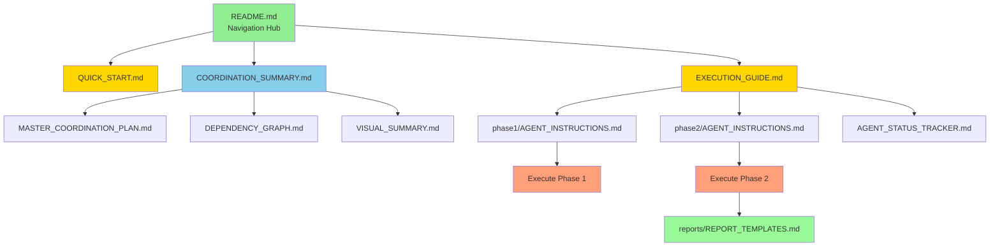

# Project-Nyra: Coordination Files Index

**Total Files Created**: 11 coordination documents
**Total Size**: ~70 KB of documentation
**Session**: nyra-swarm-001

---

## 📋 All Coordination Files

### Core Documentation (Root Level)

1. **README.md** (6.7 KB)
   - **Purpose**: Navigation hub for all coordination documents
   - **Use Case**: Start here to understand file structure
   - **Priority**: ⭐⭐⭐

2. **QUICK_START.md** (5.7 KB)
   - **Purpose**: One-page quick reference card
   - **Use Case**: Fast execution guide, 3-step process
   - **Priority**: ⭐⭐⭐

3. **EXECUTION_GUIDE.md** (8.3 KB)
   - **Purpose**: Detailed step-by-step execution instructions
   - **Use Case**: Follow for comprehensive execution with troubleshooting
   - **Priority**: ⭐⭐⭐

4. **COORDINATION_SUMMARY.md** (9.2 KB)
   - **Purpose**: Executive summary of entire coordination strategy
   - **Use Case**: Complete overview of all agents, phases, and deliverables
   - **Priority**: ⭐⭐⭐

5. **MASTER_COORDINATION_PLAN.md** (6.6 KB)
   - **Purpose**: Complete strategic plan with protocols and success criteria
   - **Use Case**: Detailed planning reference
   - **Priority**: ⭐⭐

6. **DEPENDENCY_GRAPH.md** (5.9 KB)
   - **Purpose**: Visual dependency graph with Mermaid diagrams
   - **Use Case**: Understand agent dependencies and critical paths
   - **Priority**: ⭐⭐

7. **AGENT_STATUS_TRACKER.md** (5.6 KB)
   - **Purpose**: Real-time progress tracking template
   - **Use Case**: Monitor agent completion status during execution
   - **Priority**: ⭐⭐

8. **VISUAL_SUMMARY.md** (Latest)
   - **Purpose**: Visual representations of topology, timeline, deliverables
   - **Use Case**: Graphical overview of coordination
   - **Priority**: ⭐⭐

### Phase-Specific Instructions

9. **phase1/AGENT_INSTRUCTIONS.md** (Detailed)
   - **Purpose**: Complete instructions for 9 Phase 1 agents
   - **Contains**:
     - Agent 1: CLAUDE.md Files
     - Agent 2: Workflow Structures
     - Agent 3: Infisical Variables
     - Agent 5: CI/CD Pipelines
     - Agent 6: Docker Environments
     - Agent 8: WSL Setup
     - Agent 10: Bootstrap Enhancement
     - Agent 11: User Guide
     - Agent 12: Implementation
   - **Use Case**: Reference for Phase 1 execution
   - **Priority**: ⭐⭐⭐

10. **phase2/AGENT_INSTRUCTIONS.md** (Detailed)
    - **Purpose**: Complete instructions for 4 Phase 2 agents
    - **Contains**:
      - Agent 4: Checker Scripts (depends on Agent 3)
      - Agent 7: Gitea Setup (depends on Agent 8)
      - Agent 9: Gitea Installer Integration (depends on Agent 7)
      - Agent 13: User Guide with Env Vars (depends on Agents 1, 3)
    - **Use Case**: Reference for Phase 2 execution
    - **Priority**: ⭐⭐⭐

### Report Templates

11. **reports/REPORT_TEMPLATES.md** (Detailed)
    - **Purpose**: Templates for all final reports
    - **Contains**:
      - IMPLEMENTATION_STATUS.md template
      - NEXT_STEPS.md template
      - AGENT_COORDINATION_REPORT.md template
      - PROJECT_READY_CHECKLIST.md template
    - **Use Case**: Generate reports after all agents complete
    - **Priority**: ⭐⭐

---

## 📁 Directory Structure

```
C:\Users\edane\coordination\
│
├── 📄 README.md                          (Navigation hub)
├── 📄 QUICK_START.md                     (Quick reference)
├── 📄 EXECUTION_GUIDE.md                 (Detailed execution)
├── 📄 COORDINATION_SUMMARY.md            (Executive summary)
├── 📄 MASTER_COORDINATION_PLAN.md        (Strategic plan)
├── 📄 DEPENDENCY_GRAPH.md                (Visual dependencies)
├── 📄 AGENT_STATUS_TRACKER.md            (Progress tracking)
├── 📄 VISUAL_SUMMARY.md                  (Graphical overview)
├── 📄 FILE_INDEX.md                      (This file)
│
├── 📂 phase1/
│   └── 📄 AGENT_INSTRUCTIONS.md          (9 agents, independent)
│
├── 📂 phase2/
│   └── 📄 AGENT_INSTRUCTIONS.md          (4 agents, dependent)
│
└── 📂 reports/
    └── 📄 REPORT_TEMPLATES.md            (Final report templates)
```

---

## 🗺️ Document Navigation Map

### For Quick Execution
```
START → QUICK_START.md → Execute Phase 1 → Execute Phase 2 → DONE
```

### For Detailed Understanding
```
START → README.md → COORDINATION_SUMMARY.md → EXECUTION_GUIDE.md → Execute
```

### For Visual Learners
```
START → VISUAL_SUMMARY.md → DEPENDENCY_GRAPH.md → Execute
```

### For Strategic Planning
```
START → MASTER_COORDINATION_PLAN.md → DEPENDENCY_GRAPH.md →
        phase1/AGENT_INSTRUCTIONS.md → phase2/AGENT_INSTRUCTIONS.md → Execute
```

---

## 📖 Document Relationships



---

## 🎯 Use Cases by Role

### As Project Manager
1. Read **COORDINATION_SUMMARY.md** for overview
2. Review **MASTER_COORDINATION_PLAN.md** for strategy
3. Monitor **AGENT_STATUS_TRACKER.md** for progress
4. Review final reports for completion status

### As Executor
1. Start with **QUICK_START.md**
2. Follow **EXECUTION_GUIDE.md** step-by-step
3. Use **phase1/AGENT_INSTRUCTIONS.md** for Phase 1
4. Use **phase2/AGENT_INSTRUCTIONS.md** for Phase 2

### As Technical Lead
1. Review **DEPENDENCY_GRAPH.md** for architecture
2. Study **MASTER_COORDINATION_PLAN.md** for protocols
3. Examine **phase1/** and **phase2/** for technical details
4. Use **reports/REPORT_TEMPLATES.md** for final assessment

### As Visual Learner
1. Start with **VISUAL_SUMMARY.md**
2. Review **DEPENDENCY_GRAPH.md** Mermaid diagrams
3. Follow visual progress in **AGENT_STATUS_TRACKER.md**
4. Use **QUICK_START.md** for at-a-glance reference

---

## 📊 Content Breakdown

### Planning Documents (40%)
- MASTER_COORDINATION_PLAN.md
- DEPENDENCY_GRAPH.md
- COORDINATION_SUMMARY.md
- VISUAL_SUMMARY.md

### Execution Documents (40%)
- QUICK_START.md
- EXECUTION_GUIDE.md
- phase1/AGENT_INSTRUCTIONS.md
- phase2/AGENT_INSTRUCTIONS.md

### Monitoring & Reporting (20%)
- AGENT_STATUS_TRACKER.md
- reports/REPORT_TEMPLATES.md

---

## 🔍 Search Guide

### Looking for...

**Quick execution steps**
→ QUICK_START.md

**Detailed execution instructions**
→ EXECUTION_GUIDE.md

**Agent dependencies**
→ DEPENDENCY_GRAPH.md

**What each agent does**
→ phase1/AGENT_INSTRUCTIONS.md + phase2/AGENT_INSTRUCTIONS.md

**Visual diagrams**
→ VISUAL_SUMMARY.md + DEPENDENCY_GRAPH.md

**Complete strategy**
→ MASTER_COORDINATION_PLAN.md

**Progress tracking**
→ AGENT_STATUS_TRACKER.md

**Final reporting**
→ reports/REPORT_TEMPLATES.md

**Everything at once**
→ COORDINATION_SUMMARY.md

---

## ✅ Document Checklist

- [x] Navigation hub created (README.md)
- [x] Quick start guide created (QUICK_START.md)
- [x] Detailed execution guide created (EXECUTION_GUIDE.md)
- [x] Executive summary created (COORDINATION_SUMMARY.md)
- [x] Master plan documented (MASTER_COORDINATION_PLAN.md)
- [x] Dependencies visualized (DEPENDENCY_GRAPH.md)
- [x] Progress tracker ready (AGENT_STATUS_TRACKER.md)
- [x] Visual summary created (VISUAL_SUMMARY.md)
- [x] Phase 1 instructions detailed (phase1/AGENT_INSTRUCTIONS.md)
- [x] Phase 2 instructions detailed (phase2/AGENT_INSTRUCTIONS.md)
- [x] Report templates prepared (reports/REPORT_TEMPLATES.md)
- [x] File index created (FILE_INDEX.md - this file)

**All Documentation**: ✅ COMPLETE

---

## 🚀 Quick Links for Execution

1. **Start Here**: [`QUICK_START.md`](./QUICK_START.md)
2. **Phase 1 Instructions**: [`phase1/AGENT_INSTRUCTIONS.md`](./phase1/AGENT_INSTRUCTIONS.md)
3. **Phase 2 Instructions**: [`phase2/AGENT_INSTRUCTIONS.md`](./phase2/AGENT_INSTRUCTIONS.md)
4. **Monitor Progress**: [`AGENT_STATUS_TRACKER.md`](./AGENT_STATUS_TRACKER.md)

---

## 📈 Metrics

- **Total Documents**: 11 files
- **Total Directories**: 3 (phase1, phase2, reports)
- **Estimated Reading Time**: 45-60 minutes (all documents)
- **Estimated Quick-Read Time**: 10-15 minutes (QUICK_START + EXECUTION_GUIDE)
- **Agents Documented**: 14 agents across 5 swarms
- **Dependencies Mapped**: 5 critical dependencies
- **Execution Phases**: 2 phases + validation

---

## 🎊 Coordination Status

**Documentation**: ✅ 100% Complete
**Planning**: ✅ 100% Complete
**Instructions**: ✅ 100% Complete
**Templates**: ✅ 100% Complete
**Ready for Execution**: ✅ YES

**Next Action**: Execute Phase 1 agents

---

**Last Updated**: 2025-12-31
**Session**: nyra-swarm-001
**Coordinator**: Strategic Planning Agent
