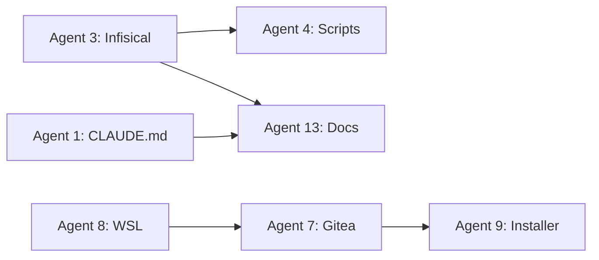

# Project-Nyra: Quick Start Card

**⚡ READY TO EXECUTE | 14 Agents | 5 Swarms | 35-45 Minutes**

---

## 🎯 What This Does

Orchestrates 14 concurrent agents to build complete Project-Nyra infrastructure:
- ✅ CLAUDE.md files for all apps
- ✅ Infisical secret management
- ✅ CI/CD pipelines (GitHub Actions)
- ✅ Docker containerization
- ✅ WSL + Gitea local Git server
- ✅ Bootstrap package enhancement
- ✅ Complete documentation
- ✅ Validation scripts

---

## 🚀 Execute Now (3 Steps)

### Step 1: Phase 1 (15-20 min)
Execute 9 independent agents in parallel:

```
Request: "Execute all Phase 1 agents for Project-Nyra following
         coordination/phase1/AGENT_INSTRUCTIONS.md"
```

**Agents**: 1, 2, 3, 5, 6, 8, 10, 11, 12

### Step 2: Phase 2 (10-15 min)
After Phase 1 completes, execute 4 dependent agents:

```
Request: "Execute all Phase 2 agents for Project-Nyra following
         coordination/phase2/AGENT_INSTRUCTIONS.md"
```

**Agents**: 4, 7, 9, 13

### Step 3: Validate (5-10 min)
Generate final reports:

```
Request: "Generate final coordination reports using templates in
         coordination/reports/REPORT_TEMPLATES.md"
```

---

## 📊 Agent Overview

| Phase | Agents | Duration | Can Run Parallel |
|-------|--------|----------|------------------|
| 1 | 9 | 15-20 min | ✅ Yes |
| 2 | 4 | 10-15 min | ⚠️ Conditional |
| Total | 14 | 35-45 min | - |

---

## 🔗 Critical Dependencies



**Wait for these before Phase 2:**
- Agent 3 complete → Run Agents 4, 13
- Agent 8 complete → Run Agent 7
- Agent 1 complete → Run Agent 13
- Agent 7 complete → Run Agent 9

---

## 📁 What Gets Created

```
apps/*/CLAUDE.md              (Agent 1)
docs/workflows/               (Agent 2)
docs/ENVIRONMENT_VARIABLES.md (Agent 13)
docs/USER_GUIDE.md            (Agent 11)
config/infisical/             (Agent 3)
scripts/                      (Agent 4)
.github/workflows/            (Agent 5)
docker/                       (Agent 6)
bootstrap/orchestrator-mini/wsl/       (Agent 8)
bootstrap/orchestrator-mini/wsl/gitea/ (Agent 7)
bootstrap/GUI-Installer/      (Agent 9)
bootstrap/                    (Agent 10)
apps/                         (Agent 12)
```

**Total**: 100+ files across project structure

---

## ✅ Success Indicators

### Phase 1 Done When:
- [ ] All 9 agents report "complete"
- [ ] 50+ files created
- [ ] No file conflicts

### Phase 2 Done When:
- [ ] All 4 agents report "complete"
- [ ] Dependencies verified
- [ ] Integration validated

### Project Done When:
- [ ] All 14 agents complete
- [ ] 100+ files created
- [ ] All reports generated
- [ ] Ready for deployment

---

## 🔍 Monitor Progress

```bash
# Check agent status
npx claude-flow@alpha memory retrieve --key "nyra/agent-1/status"

# View status tracker
cat coordination/AGENT_STATUS_TRACKER.md

# Check current phase
npx claude-flow@alpha memory retrieve --key "nyra/coordination/phase"
```

---

## 📋 Detailed Documentation

| Document | Purpose |
|----------|---------|
| [README.md](./README.md) | Navigation hub |
| [COORDINATION_SUMMARY.md](./COORDINATION_SUMMARY.md) | Executive summary |
| [EXECUTION_GUIDE.md](./EXECUTION_GUIDE.md) | Detailed execution steps |
| [MASTER_COORDINATION_PLAN.md](./MASTER_COORDINATION_PLAN.md) | Complete strategy |
| [DEPENDENCY_GRAPH.md](./DEPENDENCY_GRAPH.md) | Visual dependencies |
| [phase1/AGENT_INSTRUCTIONS.md](./phase1/AGENT_INSTRUCTIONS.md) | Phase 1 details |
| [phase2/AGENT_INSTRUCTIONS.md](./phase2/AGENT_INSTRUCTIONS.md) | Phase 2 details |

---

## 🎓 Coordination Protocol

Every agent must:

**Pre-Task:**
```bash
npx claude-flow@alpha hooks pre-task --description "Agent N: [task]"
npx claude-flow@alpha hooks session-restore --session-id "nyra-swarm-001"
```

**Post-Task:**
```bash
npx claude-flow@alpha hooks post-task --task-id "agent-N"
npx claude-flow@alpha memory store --key "nyra/agent-N/status" --value "complete"
```

---

## 🆘 Troubleshooting

### Agent Fails
1. Check: `npx claude-flow@alpha memory retrieve --key "nyra/agent-N/status"`
2. Retry: Re-run agent with same instructions
3. Manual: Complete task manually if needed

### Dependency Not Met
1. Verify: Check blocking agent completed
2. Wait: Phase 2 needs Phase 1 dependencies
3. Validate: Ensure outputs exist before proceeding

### File Conflicts
1. Check: `git status` and `git diff`
2. Resolve: Merge conflicts manually
3. Validate: Test affected functionality

---

## 📈 After Completion

**Generated Reports:**
1. `IMPLEMENTATION_STATUS.md` - What was done
2. `NEXT_STEPS.md` - What to do next
3. `AGENT_COORDINATION_REPORT.md` - How it went
4. `PROJECT_READY_CHECKLIST.md` - Ready for deployment?

**Next Actions:**
- Configure Infisical secrets
- Test development environment
- Run validation scripts
- Deploy to staging

---

## 🎯 Execute Now

**Command**: Start Phase 1 by requesting execution of all Phase 1 agents following `coordination/phase1/AGENT_INSTRUCTIONS.md`

**Expected**: 35-45 minutes total execution time

**Result**: Complete Project-Nyra infrastructure ready for deployment

---

**Session ID**: nyra-swarm-001
**Status**: ✅ READY
**Coordinator**: Strategic Planning Agent

*For detailed instructions, see [EXECUTION_GUIDE.md](./EXECUTION_GUIDE.md)*
