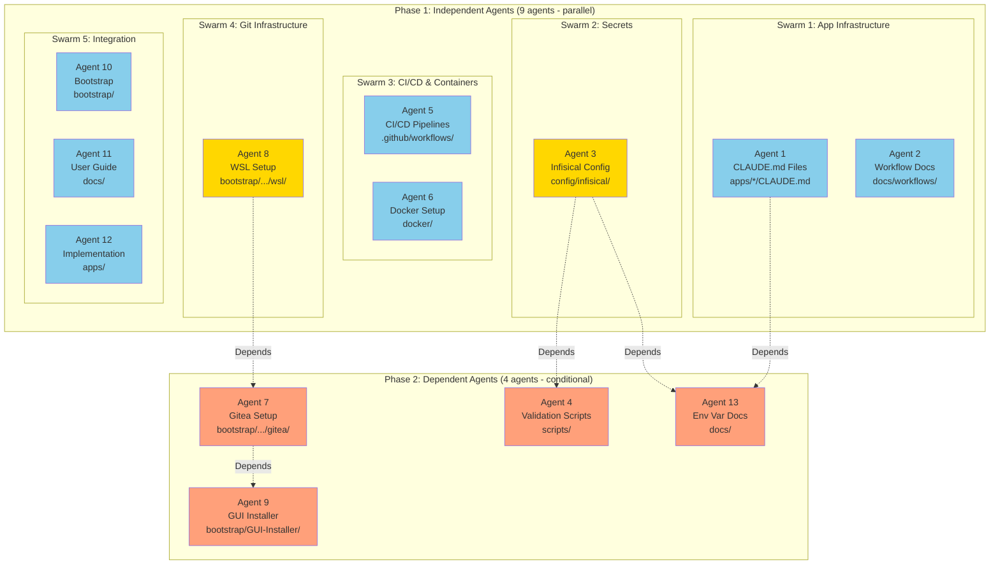
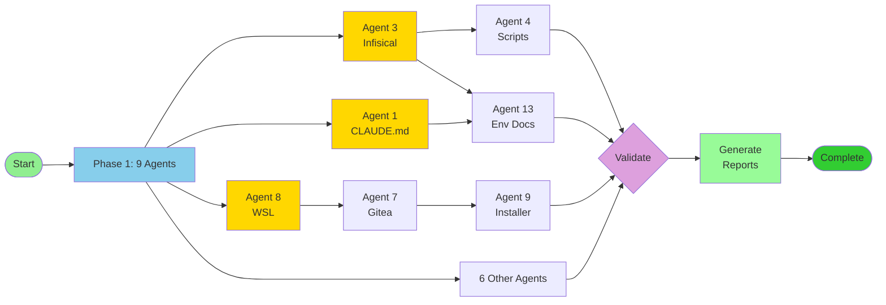

# Project-Nyra: Visual Coordination Summary

**🎯 Mission**: Orchestrate 14 concurrent agents to build complete Project-Nyra infrastructure

---

## 🗺️ Agent Topology



**Legend**:
- 🔵 Blue: Independent agents (Phase 1)
- 🟡 Gold: Critical path agents (Phase 1)
- 🟠 Orange: Dependent agents (Phase 2)
- ➡️ Solid lines: Parallel execution
- ⋯➡️ Dotted lines: Dependencies

---

## 📊 Execution Timeline

```
Time    Phase 1                          Phase 2                 Validation
0:00    ├─ Start Phase 1
0:01    ├─ Agent 1 (CLAUDE.md)
0:01    ├─ Agent 2 (Workflows)
0:01    ├─ Agent 3 (Infisical) ───┐
0:01    ├─ Agent 5 (CI/CD)        │
0:01    ├─ Agent 6 (Docker)       │
0:01    ├─ Agent 8 (WSL) ─────┐   │
0:01    ├─ Agent 10 (Bootstrap)│   │
0:01    ├─ Agent 11 (Docs)     │   │
0:01    └─ Agent 12 (Apps)     │   │
        │                      │   │
0:15    All agents working...  │   │
        │                      │   │
0:20    Phase 1 Complete! ─────┼───┴─> Agent 4 (Scripts)
                               │    └─> Agent 13 (Env Docs)
                               │
0:20                           └────> Agent 7 (Gitea) ───┐
0:30                                                       │
0:35                                   Agent 9 (Installer)┘

0:40                                              Validate All
0:45                                              Generate Reports
0:50    ✅ COMPLETE
```

**Duration**: 35-45 minutes total

---

## 📦 Deliverables Overview

```
📁 Project-Nyra/
│
├── 📂 apps/
│   ├── 📄 app1/CLAUDE.md ................ Agent 1
│   ├── 📄 app2/CLAUDE.md ................ Agent 1
│   └── 💻 */implementation .............. Agent 12
│
├── 📂 docs/
│   ├── 📂 workflows/ .................... Agent 2
│   ├── 📄 USER_GUIDE.md ................. Agent 11
│   ├── 📄 ENVIRONMENT_VARIABLES.md ...... Agent 13
│   └── 📄 INSTALLATION.md ............... Agent 11
│
├── 📂 config/
│   └── 📂 infisical/ .................... Agent 3
│       ├── 📄 schema.json
│       └── 📄 environments.json
│
├── 📂 scripts/ .......................... Agent 4
│   ├── 📄 check-secrets.sh
│   └── 📄 validate-config.js
│
├── 📂 .github/
│   └── 📂 workflows/ .................... Agent 5
│       ├── 📄 ci.yml
│       └── 📄 cd-production.yml
│
├── 📂 docker/ ........................... Agent 6
│   ├── 📄 Dockerfile.base
│   └── 📄 docker-compose.yml
│
└── 📂 bootstrap/
    ├── 📂 orchestrator-mini/
    │   └── 📂 wsl/
    │       ├── 📄 install-wsl.ps1 ....... Agent 8
    │       └── 📂 gitea/
    │           └── 📄 install-gitea.sh .. Agent 7
    └── 📂 GUI-Installer/ ................ Agent 9
```

**Total**: 100+ files across entire project structure

---

## 🔄 Dependency Flow



---

## 📈 Progress Tracking

### Phase 1 Milestones

| Milestone | Agents Complete | Files Created | Status |
|-----------|----------------|---------------|--------|
| 25% | 3/9 | ~25 | ⏳ Pending |
| 50% | 5/9 | ~50 | ⏳ Pending |
| 75% | 7/9 | ~75 | ⏳ Pending |
| 100% | 9/9 | ~100 | ⏳ Pending |

### Phase 2 Milestones

| Milestone | Agents Complete | Dependencies Met | Status |
|-----------|----------------|------------------|--------|
| Batch 1 Start | 0/3 | ✅ Yes | ⏳ Pending |
| Batch 1 Done | 3/3 | N/A | ⏳ Pending |
| Batch 2 Start | 0/1 | ✅ Yes | ⏳ Pending |
| Batch 2 Done | 1/1 | N/A | ⏳ Pending |

### Overall Progress

```
[██████████░░░░░░░░░░░░░░░░░░░░] 20% (Planning Complete)
```

- ✅ Planning: 100%
- ⏳ Phase 1: 0%
- ⏳ Phase 2: 0%
- ⏳ Validation: 0%

**Next**: Execute Phase 1 agents

---

## 🎯 Success Criteria Checklist

### Infrastructure ✅
- [ ] CLAUDE.md files for all apps
- [ ] Infisical configuration complete
- [ ] CI/CD pipelines operational
- [ ] Docker environments ready
- [ ] WSL + Gitea installed
- [ ] Bootstrap package enhanced

### Documentation ✅
- [ ] User guide comprehensive
- [ ] Environment variables documented
- [ ] Workflow documentation complete
- [ ] Troubleshooting guide available

### Integration ✅
- [ ] All agents coordinated successfully
- [ ] No file conflicts
- [ ] All dependencies resolved
- [ ] Validation scripts functional

### Quality ✅
- [ ] 100+ files created
- [ ] All templates populated
- [ ] Reports generated
- [ ] Project ready for deployment

---

## 🚀 Execution Commands

### Start Phase 1
```
"Execute Phase 1 agents following coordination/phase1/AGENT_INSTRUCTIONS.md"
```

### Start Phase 2 (after Phase 1)
```
"Execute Phase 2 agents following coordination/phase2/AGENT_INSTRUCTIONS.md"
```

### Generate Reports (after Phase 2)
```
"Generate coordination reports using coordination/reports/REPORT_TEMPLATES.md"
```

---

## 🔍 Monitoring Commands

### Check Agent Status
```bash
npx claude-flow@alpha memory retrieve --key "nyra/agent-N/status"
```

### View Progress
```bash
cat coordination/AGENT_STATUS_TRACKER.md
```

### Check Phase
```bash
npx claude-flow@alpha memory retrieve --key "nyra/coordination/phase"
```

---

## 📚 Documentation Index

| Priority | Document | Purpose |
|----------|----------|---------|
| ⭐⭐⭐ | QUICK_START.md | Start here - one page |
| ⭐⭐⭐ | EXECUTION_GUIDE.md | Step-by-step execution |
| ⭐⭐ | COORDINATION_SUMMARY.md | Complete overview |
| ⭐⭐ | DEPENDENCY_GRAPH.md | Visual dependencies |
| ⭐ | MASTER_COORDINATION_PLAN.md | Detailed strategy |
| ⭐ | phase1/AGENT_INSTRUCTIONS.md | Phase 1 details |
| ⭐ | phase2/AGENT_INSTRUCTIONS.md | Phase 2 details |

---

## ✨ What Makes This Coordination Special

### Intelligent Dependency Management
- Automatic phase separation
- Conditional execution
- No manual dependency tracking needed

### Conflict Prevention
- Directory segregation
- Memory-based coordination
- Validation at every step

### Real-Time Monitoring
- Status tracking via memory
- Progress visualization
- Comprehensive reporting

### Scalable Architecture
- 14 agents coordinated seamlessly
- Parallel execution where possible
- Sequential when dependencies exist

---

## 🎊 Ready to Execute

**Status**: 🟢 ALL SYSTEMS GO

**Agents**: 14 ready to deploy

**Expected Duration**: 35-45 minutes

**Expected Output**: 100+ files, complete infrastructure

**Next Action**: Execute Phase 1

---

**Coordinator**: Strategic Planning Agent
**Session**: nyra-swarm-001
**Date**: 2025-12-31
**Status**: ✅ COORDINATION COMPLETE
