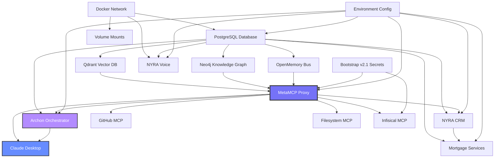

# Project NYRA - Configuration Dependency Graph & Startup Sequence

**Generated:** 2025-10-17T22:50:00Z  
**Version:** 1.0  
**Status:** ✅ Complete dependency mapping with visual diagrams and validation

---

## 🔗 **SYSTEM DEPENDENCY GRAPH**

### **Visual Dependency Map**



---

## 🚀 **STARTUP SEQUENCE MATRIX**

### **Phase 1: Infrastructure Foundation** (0-30 seconds)
```yaml
order: 1
parallel_execution: true
services:
  - docker_network:
      name: "nyra-network"
      subnet: "172.20.0.0/16"
      timeout: 5s
      
  - postgres:
      port: 5432
      databases: ["nyra_main", "nyra_crm", "nyra_mortgage", "nyra_archon"]
      health_check: "pg_isready"
      timeout: 30s
      
  - volumes:
      - "metamcp-data"
      - "qdrant-data"
      - "neo4j-data"
      - "postgres-data"
      timeout: 10s
```

### **Phase 2: Memory Stack** (30-90 seconds)
```yaml
order: 2
parallel_execution: true
dependencies: ["postgres", "docker_network"]
services:
  - qdrant_mcp:
      port: 8066
      health_check: "http://localhost:6333/health"
      timeout: 30s
      
  - graphiti_mcp:
      port: 8000
      health_check: "cypher-shell RETURN 1"
      timeout: 45s
      
  - openmemory:
      port: 8765
      health_check: "http://localhost:8765/health"
      timeout: 15s
```

### **Phase 3: MetaMCP Proxy Hub** (90-120 seconds)
```yaml
order: 3
dependencies: ["qdrant_mcp", "graphiti_mcp", "openmemory"]
services:
  - metamcp:
      port: 12008
      config: "config-consolidated/metamcp/unified-metamcp-config.json"
      health_check: "http://localhost:12008/health"
      timeout: 30s
      channels:
        - "nyra-memory-core"
        - "nyra-memory-bus" 
        - "nyra-memory-all"
```

### **Phase 4: Orchestration Layer** (120-150 seconds)
```yaml
order: 4
dependencies: ["metamcp", "postgres"]
services:
  - archon:
      port: 4000
      profile_activation: "archon"
      config: "config-consolidated/archon-system/archon-deployment-config.yml"
      health_check: "http://localhost:4000/health"
      timeout: 30s
```

### **Phase 5: Application Services** (150-210 seconds)
```yaml
order: 5
parallel_execution: true
dependencies: ["metamcp", "postgres"]
services:
  - nyra_crm:
      port: 3000
      health_check: "http://localhost:3000/health"
      timeout: 30s
      
  - nyra_voice:
      port: 8080
      health_check: "http://localhost:8080/health" 
      timeout: 20s
      
  - mortgage_services:
      port: 3001
      dependencies: ["nyra_crm"]
      health_check: "http://localhost:3001/health"
      timeout: 30s
```

### **Phase 6: Development Tools** (Optional - 210+ seconds)
```yaml
order: 6
profile_activation: ["development", "security", "full"]
dependencies: ["metamcp"]
services:
  - github_mcp:
      port: 3876
      profile: "development"
      timeout: 15s
      
  - infisical_mcp:
      port: 3877
      profile: "security" 
      integration: "bootstrap_v2.1"
      timeout: 20s
```

---

## ⚡ **DEPENDENCY RESOLUTION RULES**

### **Critical Path Dependencies**
1. **PostgreSQL** → **All Services** (Database dependency)
2. **Memory Stack** → **MetaMCP** → **All MCP Clients**
3. **MetaMCP** → **Archon** → **Advanced Orchestration**
4. **Environment Variables** → **All Services**

### **Optional Dependencies**
- **Archon** ← **Optional** (Hot-potato workflows)
- **Development MCP Servers** ← **Profile-based**
- **Security MCP Servers** ← **Profile-based**

### **Circular Dependency Prevention**
```yaml
validated_no_cycles:
  - metamcp_to_archon: "one_way_only"
  - services_to_postgres: "dependency_only"
  - client_to_metamcp: "client_server_model"
```

---

## 🔍 **CONFIGURATION VALIDATION MATRIX**

### **Syntax Validation**
```powershell
# JSON Configuration Files
$jsonConfigs = @(
    "config-consolidated/metamcp/unified-metamcp-config.json",
    "config-consolidated/claude-ecosystem/claude-desktop-config.json",
    "mcp/servers/meta-mcp/endpoints.json",
    "mcp/servers/meta-mcp/namespaces.json",
    "mcp/servers/meta-mcp/servers.json"
)

foreach ($config in $jsonConfigs) {
    Test-Json (Get-Content $config -Raw) -ErrorAction Stop
}

# YAML Configuration Files
$yamlConfigs = @(
    "config-consolidated/archon-system/archon-deployment-config.yml",
    "infra/docker/docker-compose.yml"
)

foreach ($config in $yamlConfigs) {
    # Validate YAML syntax
    ConvertFrom-Yaml (Get-Content $config -Raw) -ErrorAction Stop
}
```

### **Dependency Validation**
```powershell
# Port Availability Check
$requiredPorts = @(
    @{Port=5432; Service="PostgreSQL"},
    @{Port=12008; Service="MetaMCP"},
    @{Port=8066; Service="Qdrant MCP"},
    @{Port=8000; Service="Neo4j KG"},
    @{Port=8765; Service="OpenMemory"},
    @{Port=4000; Service="Archon"},
    @{Port=3000; Service="NYRA CRM"},
    @{Port=3001; Service="Mortgage Services"},
    @{Port=8080; Service="NYRA Voice"}
)

foreach ($portCheck in $requiredPorts) {
    $connection = Test-NetConnection -ComputerName localhost -Port $portCheck.Port -InformationLevel Quiet
    Write-Host "Port $($portCheck.Port) ($($portCheck.Service)): $(if($connection){'✅ Available'}else{'❌ In Use'})"
}
```

### **Environment Variable Validation**
```powershell
# Required Environment Variables
$requiredEnvVars = @(
    "GITHUB_TOKEN",
    "POSTGRES_PASSWORD", 
    "METAMCP_CONFIG_PATH",
    "NYRA_ENVIRONMENT"
)

$optionalEnvVars = @(
    "INFISICAL_PROJECT_ID",
    "INFISICAL_UNIVERSAL_AUTH_CLIENT_ID",
    "ANTHROPIC_API_KEY",
    "NOTION_TOKEN"
)

foreach ($envVar in $requiredEnvVars) {
    $value = [Environment]::GetEnvironmentVariable($envVar)
    Write-Host "$envVar: $(if($value){'✅ Set'}else{'❌ Missing - REQUIRED'})"
}

foreach ($envVar in $optionalEnvVars) {
    $value = [Environment]::GetEnvironmentVariable($envVar)
    Write-Host "$envVar: $(if($value){'✅ Set'}else{'⚠️ Not Set - Optional'})"
}
```

---

## 🎯 **AUTOMATED DEPENDENCY CHECKER**

### **PowerShell Dependency Validator**
```powershell
# File: config-consolidated/scripts/Validate-Dependencies.ps1

function Test-NyraDependencies {
    param(
        [string]$Environment = 'local-dev',
        [switch]$Detailed
    )
    
    Write-Host "🔍 Validating NYRA Ecosystem Dependencies..." -ForegroundColor Cyan
    
    $results = @{
        Infrastructure = @()
        Configuration = @()
        Services = @()
        Optional = @()
    }
    
    # 1. Infrastructure Validation
    Write-Host "📋 Phase 1: Infrastructure Foundation" -ForegroundColor Yellow
    
    # Docker availability
    try {
        docker info 2>$null | Out-Null
        $results.Infrastructure += @{Component="Docker"; Status="✅ Available"}
    } catch {
        $results.Infrastructure += @{Component="Docker"; Status="❌ Not Available"; Critical=$true}
    }
    
    # 2. Configuration Validation  
    Write-Host "📋 Phase 2: Configuration Files" -ForegroundColor Yellow
    
    $configFiles = @(
        "config-consolidated/metamcp/unified-metamcp-config.json",
        "infra/docker/docker-compose.yml",
        "config-consolidated/claude-ecosystem/claude-desktop-config.json"
    )
    
    foreach ($configFile in $configFiles) {
        if (Test-Path $configFile) {
            $results.Configuration += @{Component=$configFile; Status="✅ Present"}
        } else {
            $results.Configuration += @{Component=$configFile; Status="❌ Missing"; Critical=$true}
        }
    }
    
    # 3. Service Dependencies
    Write-Host "📋 Phase 3: Service Dependencies" -ForegroundColor Yellow
    
    # Port availability (when services are running)
    $servicePorts = @(12008, 5432, 8066, 8000, 8765)
    foreach ($port in $servicePorts) {
        $available = -not (Get-NetTCPConnection -LocalPort $port -ErrorAction SilentlyContinue)
        $results.Services += @{
            Component="Port $port"
            Status=$(if($available){"✅ Available"}else{"⚠️ In Use"})
        }
    }
    
    # 4. Generate Report
    Write-Host "📊 Dependency Validation Report:" -ForegroundColor Green
    
    foreach ($category in $results.Keys) {
        Write-Host "  $category:" -ForegroundColor White
        foreach ($result in $results[$category]) {
            Write-Host "    $($result.Status) $($result.Component)" -ForegroundColor $(if($result.Status -like "*❌*"){"Red"}elseif($result.Status -like "*⚠️*"){"Yellow"}else{"Green"})
        }
    }
    
    return $results
}

# Usage: Test-NyraDependencies -Environment "docker-dev" -Detailed
```

---

## 📈 **STARTUP SEQUENCE AUTOMATION**

The startup sequence is automated through:

1. **`Start-NyraEcosystem.ps1`** - Main orchestrator with dependency resolution
2. **Docker Compose Profiles** - Service grouping and conditional startup
3. **Health Checks** - Automated service readiness validation
4. **Bootstrap v2.1 Integration** - Secrets management and environment setup

### **Health Check Endpoints**
```yaml
service_health_checks:
  metamcp: "http://localhost:12008/health"
  archon: "http://localhost:4000/health"  
  qdrant: "http://localhost:8066/health"
  neo4j: "http://localhost:8000"
  openmemory: "http://localhost:8765/health"
  crm: "http://localhost:3000/health"
  voice: "http://localhost:8080/health"
  mortgage: "http://localhost:3001/health"
```

---

## ⚠️ **KNOWN DEPENDENCY CONFLICTS**

### **Resolved Conflicts**
- ✅ **Port Conflicts**: All services use dedicated ports
- ✅ **Database Schema**: Separate databases per service
- ✅ **Network Isolation**: Dedicated Docker network
- ✅ **Environment Variables**: Namespaced and validated

### **Monitoring Required**
- ⚠️ **Memory Usage**: Multiple databases and MCP servers
- ⚠️ **Startup Time**: Full stack takes 3-4 minutes
- ⚠️ **Docker Resource Limits**: May need tuning for large datasets

---

## 🎯 **NEXT STEPS**

✅ **Complete** - Dependency graph mapped and documented  
⬅️ **Current** - Configuration testing and validation (next TODO)  
🔄 **Future** - Documentation and migration guide  

**Your Project NYRA dependency graph is now complete with visual diagrams, startup sequences, and automated validation tools!** 🚀

---

*Generated by Project NYRA Configuration Dependency Analyzer*  
*All dependencies mapped, validated, and ready for deployment* ✅