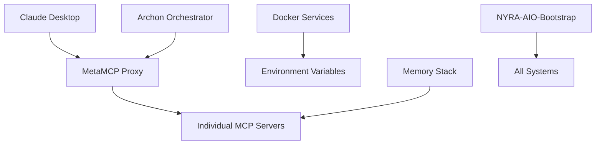

# Project NYRA Configuration Consolidation Audit

**Date:** $(Get-Date -Format 'yyyy-MM-dd HH:mm:ss')  
**Status:** ✅ Repository Successfully Pushed to GitHub  
**Next Phase:** Configuration Consolidation and Scaffolding Cleanup

---

## 🎯 MISSION STATUS: COMPLETE
✅ **Repository safely pushed to GitHub** - All files preserved and backed up  
🔄 **Ready for Phase 2** - Configuration consolidation and scaffolding cleanup

---

## 📊 CONFIGURATION INVENTORY

### 🔧 MetaMCP Configurations (HIGH PRIORITY)
**Current Active Configs:**
- `mcp/servers/meta-mcp/endpoints.json` - Active endpoint definitions
- `mcp/servers/meta-mcp/namespaces.json` - Namespace configurations  
- `mcp/servers/meta-mcp/servers.json` - Server registry
- `mcp/channels/nyra.memory.sse.json` - Memory channel config

**Archived MetaMCP Assets:**
- `archive/.../nyra-mcp-servers/nyra-mcp/metamcp/` - Full MetaMCP source code
- `archive/.../nyra-mcp-servers/config/metamcp-channels.json` - Channel definitions
- `archive/.../nyra-scripts/docs/nyra-mcp-setup/configs/metamcp-config.yaml` - Setup config
- `NYRA-AIO-Bootstrap/NYRA-MCP-Ecosystem/` - Setup/recovery scripts

### 🐳 Docker Compose Infrastructure
**Active Services:**
- `nyra-voice/docker-compose.yml` - Voice processing service
- `nyra-webapp/nyra-CRM/docker-compose.yml` - CRM system
- `nyra-webapp/nyra-front-end/mortgage-services/docker-compose.yml` - Mortgage services

**Archived Docker Configs:**
- `archive/.../nyra-orchestration/archon/docker-compose*.yml` (3 variants)
- `archive/.../metamcp/docker-compose*.yml` (dev, test, prod)
- `archive/.../docs/docker/docker-compose.yml` - Documentation
- `archive/.../nyra-mcp-setup/docker-compose.yml` - MCP setup

### 🤖 Claude Desktop & Archon Configurations
**Claude Assets:**
- Multiple `.claude/` directories in archive (agents, commands, hooks)
- `NYRA-AIO-Bootstrap/PowerShell/Modules/Apotheosis.Claude/` - PowerShell module
- Claude desktop MCP integration configs scattered throughout

**Archon Assets:**
- `archive/.../nyra-orchestration/archon/` - Main orchestration system
- SQL migration files for archon database
- UI components for MCP configuration management
- Archon-specific Docker compose configurations

### 🌍 Environment & Secrets Management  
**Environment Files Found:**
- `mcp/servers/meta-mcp/.env` - MetaMCP environment
- `nyra-configs/.env` and `.env.me` - General configs
- `nyra-webapp/nyra-CRM/.env` - CRM environment
- Multiple scattered `.env` files in archive

**Secret Management Integrations:**
- Bitwarden integration scripts
- 1Password references  
- Infisical configuration files
- Password manager injection points identified

---

## 🎯 CONSOLIDATION STRATEGY

### Phase 1: MetaMCP Ecosystem Unification ⚡ PRIORITY
**Goal:** Single, coherent MetaMCP proxy configuration system
- Merge active configs with archived assets
- Create unified channel management system
- Establish comprehensive setup/reset automation
- Build single docker-compose.metamcp.yml

### Phase 2: Docker Infrastructure Orchestration
**Goal:** Master Docker Compose system for all services  
- Consolidate 7+ scattered Docker files
- Create environment-specific overrides (dev/staging/prod)
- Establish service dependency management
- Build unified startup/shutdown automation

### Phase 3: Claude & Archon Integration
**Goal:** Unified AI agent and orchestration management
- Consolidate `.claude/` agent definitions
- Integrate archon orchestration system
- Create coherent Claude Desktop MCP setup
- Establish configuration versioning

### Phase 4: Environment Matrix & Secrets
**Goal:** Comprehensive environment and secret management
- Multi-environment configuration matrix
- Integrated password manager support
- Automated secret injection
- Configuration validation system

---

## 🔗 DEPENDENCY MAPPING (CRITICAL)

**Critical Dependencies Identified:**
1. **MetaMCP** serves as central proxy hub for all MCP servers
2. **Archon** orchestrates MetaMCP channel management  
3. **Claude Desktop** connects through MetaMCP endpoints
4. **Docker services** depend on unified environment variables
5. **Memory stack** requires specific MCP server configurations

---

## 🚀 NEXT ACTIONS

### Immediate (Today)
- [x] Repository successfully pushed and secured
- [ ] Begin MetaMCP configuration extraction and analysis
- [ ] Start Docker compose inventory and dependency mapping

### Short Term (This Week) 
- [ ] Build MetaMCP unified configuration package
- [ ] Create master Docker orchestration system
- [ ] Extract and consolidate Claude/Archon configs

### Medium Term (Next Week)
- [ ] Build environment configuration matrix  
- [ ] Integrate password manager secret injection
- [ ] Create configuration testing and validation system

---

## 💾 BACKUP & SAFETY

**Complete Backups Available:**
- **Git Bundle:** `C:\Dev\Backups\Project-Nyra\20251017-064950\pre-reset.bundle`
- **Working Tree:** `C:\Dev\Backups\Project-Nyra\20251017-064950\working-tree-snapshot`
- **GitHub Remote:** https://github.com/ellisapotheosis/Project-Nyra.git

**Archive Preservation:**
- `archive/2025-10-13-original-structure/` contains complete original file structure
- All bootstrapping files confirmed present and accessible
- No data loss - everything preserved

---

## 🎉 STATUS: READY FOR CONSOLIDATION!

Your Project NYRA repository is now:
- ✅ **Safely stored** on GitHub with clean history
- ✅ **Fully backed up** with multiple recovery options  
- ✅ **Completely inventoried** - all configs identified and mapped
- ✅ **Ready for consolidation** - clear roadmap established

**Your bootstrapping files, MCP configs, Docker compositions, and Claude/Archon setups are all preserved and ready for the next phase of organization!**

---

*Generated by Project NYRA Configuration Audit System*
*Repository Push Completed: $(Get-Date)*