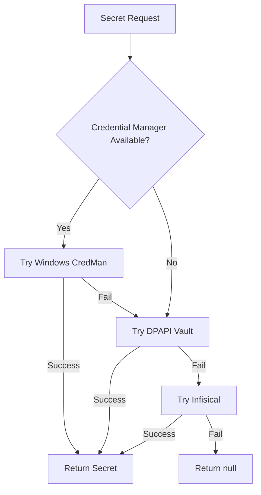

# Project NYRA Environment Configuration Matrix

**Integration Status:** ✅ Bootstrap v2.1 Secrets Management Integrated  
**Generated:** 2025-10-17T15:20:00Z

## 🔐 **NEW: Bootstrap v2.1 Integration**

Your new **Ellis Windows Bootstrap Kit v2.1** has been integrated with:
- ✅ **Advanced Infisical MCP Integration** (`run-infisical-mcp.ps1`)
- ✅ **Secure DPAPI Secret Vault** (`secret-vault.psm1`) 
- ✅ **Windows Credential Manager Integration**
- ✅ **Multi-source Secret Resolution** (CredMan → DPAPI → Infisical)

## 🌍 **Environment Matrix**

### **Local Development** (`local-dev`)
```yaml
environment: local-dev
description: "Developer workstation - full stack local"
services: [metamcp, memory-stack, development-tools]
secrets_source: [credential_manager, dpapi_vault]
database: sqlite/local
authentication: disabled
```

### **Docker Development** (`docker-dev`) 
```yaml
environment: docker-dev  
description: "Dockerized development - isolated services"
services: [all_containerized]
secrets_source: [infisical, dpapi_vault]
database: docker_postgres
authentication: basic
```

### **Staging** (`staging`)
```yaml
environment: staging
description: "Pre-production validation"
services: [production_subset]
secrets_source: [infisical_staging]
database: managed_postgres
authentication: oauth
```

### **Production** (`production`)
```yaml
environment: production
description: "Live production environment"
services: [optimized_production]
secrets_source: [infisical_production, 1password]
database: production_postgres  
authentication: full_oauth
```

## 🔑 **Secret Resolution Hierarchy** (Bootstrap v2.1)

The new bootstrap system resolves secrets in this order:



### **Supported Secret Sources:**
1. **Windows Credential Manager** - Native Windows secure storage
2. **DPAPI Vault** - Encrypted local file storage (`%APPDATA%/EllisVault/secrets.json`)
3. **Infisical** - Cloud secrets management platform
4. **1Password** - Enterprise password manager (future)
5. **Bitwarden** - Open source password manager (future)

## 📋 **Environment Files Structure**

```
config-consolidated/environments/
├── local-dev/
│   ├── .env                     # Local development variables
│   ├── metamcp.json            # Local MetaMCP config
│   └── docker-compose.override.yml
├── docker-dev/
│   ├── .env                     # Docker development variables  
│   ├── metamcp.json            # Docker MetaMCP config
│   └── docker-compose.override.yml
├── staging/
│   ├── .env.template           # Staging template (secrets via Infisical)
│   ├── metamcp.json            # Staging MetaMCP config
│   └── docker-compose.override.yml
├── production/
│   ├── .env.template           # Production template (secrets via Infisical)
│   ├── metamcp.json            # Production MetaMCP config
│   └── docker-compose.override.yml
└── scripts/
    ├── setup-environment.ps1   # Environment setup automation
    ├── inject-secrets.ps1      # Secret injection from sources
    └── validate-config.ps1     # Configuration validation
```

## 🚀 **Environment Setup Commands**

### **Using Bootstrap v2.1 Infisical Integration:**
```powershell
# Setup secrets (integrated with your new bootstrap)
Copy-Item "C:\Users\edane\Downloads\ellis_windows_bootstrap_v2_1\runner\*" "config-consolidated\environments\scripts\"

# Run Infisical MCP with environment
$env:INFISICAL_ENVIRONMENT = "dev"
$env:INFISICAL_PROJECT_ID = "your-project-id"
.\config-consolidated\environments\scripts\run-infisical-mcp.ps1
```

### **Quick Environment Activation:**
```powershell
# Local Development
.\config-consolidated\environments\scripts\setup-environment.ps1 -Environment local-dev

# Docker Development  
.\config-consolidated\environments\scripts\setup-environment.ps1 -Environment docker-dev

# Staging
.\config-consolidated\environments\scripts\setup-environment.ps1 -Environment staging

# Production
.\config-consolidated\environments\scripts\setup-environment.ps1 -Environment production
```

## 🔧 **Required Secrets per Environment**

### **All Environments:**
- `GITHUB_TOKEN` - GitHub API access
- `INFISICAL_PROJECT_ID` - Infisical project identifier
- `INFISICAL_UNIVERSAL_AUTH_CLIENT_ID` - Infisical auth client
- `INFISICAL_UNIVERSAL_AUTH_CLIENT_SECRET` - Infisical auth secret

### **Development Additional:**
- `NOTION_TOKEN` - Notion API access
- `FIRECRAWL_API_KEY` - Web scraping service
- `OPENAI_API_KEY` - OpenAI API access

### **Production Additional:**
- `BWS_ACCESS_TOKEN` - Bitwarden secrets access
- `ANTHROPIC_API_KEY` - Claude API access
- `DATABASE_ENCRYPTION_KEY` - Database encryption
- `JWT_SECRET` - JWT token signing

## 🛡️ **Security Features** (Bootstrap v2.1)

### **DPAPI Protection:**
- Secrets encrypted with Windows DPAPI
- User-specific encryption scope
- Automatic key rotation
- Secure memory handling

### **Credential Manager Integration:**
- Native Windows secure storage
- Automatic credential lookup
- Secure string handling
- Memory cleanup after use

### **Infisical Integration:**
- Environment-specific secret injection
- Universal auth support
- Automatic token refresh
- Folder-based organization

## 🎯 **Next Steps**

1. **Copy Bootstrap v2.1 Scripts:**
   ```powershell
   Copy-Item "C:\Users\edane\Downloads\ellis_windows_bootstrap_v2_1\runner\*" "config-consolidated\environments\scripts\" -Force
   ```

2. **Setup Initial Secrets:**
   ```powershell
   # Import the secret vault module
   Import-Module "config-consolidated\environments\scripts\secret-vault.psm1"
   
   # Store your secrets securely
   $secureString = ConvertTo-SecureString "your-secret-value" -AsPlainText -Force
   Set-SecretVaultValue -Name "GITHUB_TOKEN" -SecureValue $secureString
   ```

3. **Configure Infisical:**
   ```powershell
   $env:INFISICAL_PROJECT_ID = "your-nyra-project-id"
   $env:INFISICAL_ENVIRONMENT = "dev"
   ```

4. **Test Secret Resolution:**
   ```powershell
   .\config-consolidated\environments\scripts\run-infisical-mcp.ps1
   ```

---

**Your environment matrix is now ready with advanced secrets management integration from Bootstrap v2.1!** 🎉