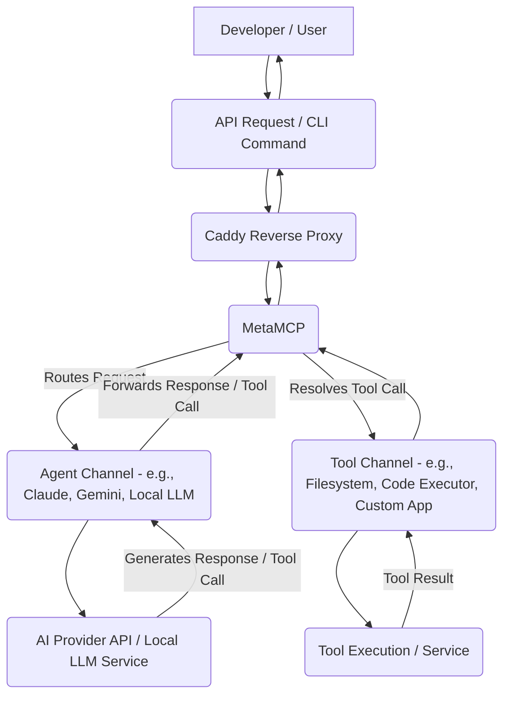

# Project Nyra Architecture

This document outlines the core architecture of Project Nyra, a decentralized, local-first AI orchestration platform.

## 1. Overview

Project Nyra unifies various AI models (local and cloud) and services into a cohesive, interoperable system. It leverages a mesh network for secure communication, Docker for containerization, and MetaMCP for intelligent routing and orchestration of AI agents and tools.

## 2. Network Topology (Tailscale Mesh)

All machines participating in Project Nyra form a secure mesh network using **Tailscale**.

*   **Zero-Config VPN:** Tailscale establishes secure, encrypted connections between devices, regardless of their physical network location (home, cloud, mobile).
*   **Persistent IP Addresses:** Each device gets a stable IP address within the Tailscale network, simplifying service discovery and inter-service communication.
*   **Decentralized Access:** Any authorized device can directly communicate with any other authorized device, forming a truly distributed backbone.

```mermaid
graph TD
    A[Main Orchestrator Node (Linux/Windows)] -- Tailscale --> B[GPU Workstation 1 (Linux)]
    A -- Tailscale --> C[GPU Workstation 2 (Linux)]
    A -- Tailscale --> D[Cloud VM (Linux)]
    B -- Tailscale --> C
    C -- Tailscale --> D
    SubGraph Tailscale Network
        A
        B
        C
        D
    End
```

## 3. Core Components

The following components are deployed via Docker on the **Main Orchestrator Node** and interact across the Tailscale network.

### 3.1. MetaMCP (Meta Multi-Channel Proxy)

*   **Role:** The central nervous system of Project Nyra. MetaMCP acts as an intelligent router, orchestrator, and universal adapter for AI agents and services.
*   **Functionality:**
    *   **Channel Management:** Defines and manages communication channels between agents, LLMs, and tools.
    *   **Agent Orchestration:** Routes prompts, tool calls, and responses between various AI agents (e.g., Claude, Gemini, local LLMs).
    *   **Tool Gateway:** Exposes local and remote tools to AI agents in a standardized manner.
    *   **A2A/ANP Adherence:** Designed to facilitate A2A (Agent-to-Agent) and ANP (Agent Network Protocol) interactions.
*   **Deployment:** Docker container.

### 3.2. Caddy Server (Reverse Proxy & TLS)

*   **Role:** Provides secure access to MetaMCP and other web services within the Nyra ecosystem, handling TLS termination and routing.
*   **Functionality:**
    *   **Automatic HTTPS:** Caddy automatically provisions and renews TLS certificates using Let's Encrypt, securing all traffic.
    *   **Reverse Proxy:** Routes incoming requests to the appropriate backend services (e.g., MetaMCP API).
    *   **Authentication (Optional):** Can be configured to add basic authentication layers.
*   **Deployment:** Docker container.

### 3.3. Project Nyra Agent / Tools (Custom Applications)

*   **Role:** Custom-built applications or services that provide specific tools or agentic capabilities to the MetaMCP network.
*   **Examples:**
    *   **Local LLM Inference:** A service running `ollama` or `vllm` exposed as an endpoint.
    *   **Specialized Tools:** Applications that perform specific tasks (e.g., code analysis, file system operations, web scraping).
    *   **Stateful Memory:** A service providing persistent memory for agents.
*   **Deployment:** Can be Docker containers or native processes, exposed via Caddy or directly to MetaMCP (within Tailscale).

## 4. AI Provider Integration

Project Nyra integrates various AI models, treating them as interchangeable "brains" for its agents.

### 4.1. Claude-Flow / Anthropic Claude

*   **Integration:** Accessed via a dedicated MetaMCP channel.
*   **Capabilities:** Advanced reasoning, large context windows, code understanding, ideal for complex development tasks and orchestration.
*   **Strategy:** Claude is often used as the "orchestrator of orchestrators" or for high-level reasoning tasks due to its strong performance in complex scenarios.

### 4.2. Google Gemini

*   **Integration:** Accessed via a dedicated MetaMCP channel.
*   **Capabilities:** Multimodal understanding, strong coding capabilities, tool use, potential for rapid iteration.
*   **Strategy:** Gemini complements Claude, often used for code generation, data analysis, or multimodal tasks where its strengths are paramount.

### 4.3. Local LLMs (Ollama, vLLM, etc.)

*   **Integration:** Run locally on GPU-enabled workstations (or the orchestrator), exposed via an API and integrated into MetaMCP.
*   **Capabilities:** Privacy-preserving, low-latency, customizable. Ideal for tasks that don't require external API calls or sensitive data processing.
*   **Strategy:** Used for internal reasoning, rapid prototyping, or tasks where data privacy is paramount.

## 5. Data Flow & Communication



**Explanation of Flow:**

1.  **User Interaction:** A user (developer) sends a request, either through a custom CLI, an API call, or an agent interface, which is directed at Project Nyra.
2.  **Caddy Proxy:** The request first hits the Caddy server, which handles TLS and forwards it to MetaMCP.
3.  **MetaMCP Ingestion:** MetaMCP receives the request and, based on its internal `channels.json` configuration, identifies the appropriate AI agent or orchestrator channel.
4.  **AI Agent Interaction:** MetaMCP forwards the prompt to the selected AI provider (e.g., Claude, Gemini, or a local LLM).
5.  **AI Response / Tool Call:** The AI provider processes the request. It might generate a direct response or make a "tool call" (e.g., "read file", "execute code", "query database").
6.  **MetaMCP Tool Resolution:** If a tool call is made, MetaMCP intercepts it. It then routes the tool call to the appropriate "Tool Channel" based on its configuration.
7.  **Tool Execution:** The designated tool (e.g., the `ngrok-filesys` tool for file operations, a code execution service) performs the requested action.
8.  **Tool Result to AI:** The result of the tool execution is sent back to MetaMCP, which then forwards it to the original AI agent for further processing or response formulation.
9.  **Final Response:** The AI agent formulates a final response based on the tool results and its reasoning, which is sent back through MetaMCP and Caddy to the user.

## 6. Directory Structure (`THE-TRUTH`)

The `THE-TRUTH` directory serves as the definitive guide and bootstrap for Project Nyra.

```
THE-TRUTH/
├── MANIFESTO.md              # High-level vision, mission, and core principles.
├── ARCHITECTURE.md           # Detailed system architecture, components, and data flow.
├── CONFIG/                   # All configuration files for bootstrapping.
│   ├── docker-compose.yml    # Docker Compose definition for core services.
│   ├── channels.json         # MetaMCP channel definitions for AI providers and tools.
│   └── Caddyfile             # Caddy server configuration.
├── LAN-INTEGRATION/          # Guide and scripts for setting up the main orchestrator.
│   ├── README.md             # Step-by-step instructions for main node setup.
│   └── bootstrap.sh          # Automated script for initial setup.
├── NEWGPU-INTEGRATION/       # Guide for adding additional GPU workstations.
│   └── README.md             # Instructions for integrating a new GPU machine.
├── CLAUDE.md                 # Deep dive into Claude integration and strategic use.
└── GEMINI.md                 # Deep dive into Gemini integration and strategic use.
```

This comprehensive structure ensures that Project Nyra can be understood, set up, and maintained by anyone or any AI agent by simply reviewing the contents of this directory.
