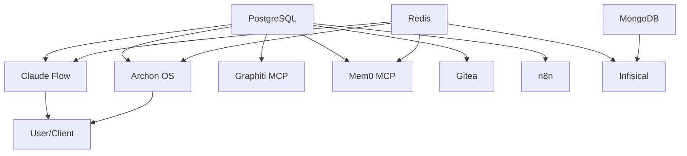

# Project Nyra - Docker Deployment Guide

Comprehensive Docker-based deployment for the unified bootstrap system with all MCP servers, databases, and automation tools.

## Table of Contents

- [Quick Start](#quick-start)
- [Architecture](#architecture)
- [Services](#services)
- [Configuration](#configuration)
- [Usage](#usage)
- [Development](#development)
- [Production](#production)
- [Testing](#testing)
- [Monitoring](#monitoring)
- [Backup & Recovery](#backup--recovery)
- [Troubleshooting](#troubleshooting)
- [Security](#security)

## Quick Start

### Prerequisites

- Docker 24+ and Docker Compose 2.20+
- 8GB RAM minimum (16GB recommended for production)
- 50GB disk space minimum
- Linux, macOS, or Windows with WSL2

### Initial Setup

```bash
# 1. Copy environment template
cp .env.example .env

# 2. Edit .env with your API keys and passwords
nano .env  # or use your preferred editor

# 3. Generate secure passwords (production)
make init-prod

# 4. Build and start all services
make setup

# 5. Check service health
make health
```

That's it! All services will be running and accessible.

## Architecture

### Network Topology

```
┌─────────────────────────────────────────────────────────────┐
│                    Docker Bridge Network                     │
│                     (nyra-network)                          │
├─────────────────────────────────────────────────────────────┤
│                                                              │
│  ┌──────────────┐  ┌──────────────┐  ┌──────────────┐     │
│  │ Claude Flow  │  │   Archon OS  │  │  PostgreSQL  │     │
│  │  (MCP Mode)  │  │   (Python)   │  │  (Database)  │     │
│  └──────────────┘  └──────────────┘  └──────────────┘     │
│                                                              │
│  ┌──────────────┐  ┌──────────────┐  ┌──────────────┐     │
│  │ Graphiti MCP │  │  Mem0 MCP   │  │   Infisical  │     │
│  │  (Knowledge) │  │  (Memory)    │  │  (Secrets)   │     │
│  └──────────────┘  └──────────────┘  └──────────────┘     │
│                                                              │
│  ┌──────────────┐  ┌──────────────┐  ┌──────────────┐     │
│  │    Gitea     │  │     n8n      │  │    Redis     │     │
│  │  (Git Repo)  │  │ (Workflows)  │  │   (Cache)    │     │
│  └──────────────┘  └──────────────┘  └──────────────┘     │
│                                                              │
└─────────────────────────────────────────────────────────────┘
```

### Service Dependencies



## Services

### Core Services

| Service | Port | Description | Health Check |
|---------|------|-------------|--------------|
| **PostgreSQL** | 5432 | Primary database | `pg_isready` |
| **Redis** | 6379 | Caching and queues | `redis-cli ping` |
| **MongoDB** | 27017 | Infisical database | `mongosh ping` |

### Application Services

| Service | Port | Description | Documentation |
|---------|------|-------------|---------------|
| **Claude Flow** | 3000 | Multi-agent orchestration (MCP mode) | [Docs](../../submodules/claude-flow/README.md) |
| **Archon OS** | 8000 | AI operating system framework | [Docs](../../tools/archon-os/README.md) |

### MCP Servers

| Service | Port | Description | Purpose |
|---------|------|-------------|---------|
| **Graphiti MCP** | 8001 | Knowledge graph memory | Long-term knowledge storage |
| **Mem0 MCP** | 8002 | Persistent memory | Agent memory management |
| **Infisical** | 8080 | Secret management | Secure credential storage |

### Tools

| Service | Port | Description | Default Credentials |
|---------|------|-------------|---------------------|
| **Gitea** | 3001 (HTTP), 2222 (SSH) | Self-hosted Git | Setup on first access |
| **n8n** | 5678 | Workflow automation | admin / (see .env) |

### Development Tools (dev mode only)

| Service | Port | Description |
|---------|------|-------------|
| **Adminer** | 8082 | Database management UI |
| **Redis Commander** | 8081 | Redis management UI |
| **Mailhog** | 8025 | Email testing |

### Production Monitoring (prod mode only)

| Service | Port | Description |
|---------|------|-------------|
| **Prometheus** | 9090 | Metrics collection |
| **Grafana** | 3002 | Metrics visualization |
| **Loki** | 3100 | Log aggregation |

## Configuration

### Environment Variables

See `.env.example` for all available configuration options.

**Critical Variables (REQUIRED)**:

```bash
# API Keys
ANTHROPIC_API_KEY=sk-ant-your-key-here

# Database Passwords
POSTGRES_PASSWORD=secure-password-here
REDIS_PASSWORD=secure-password-here
MONGO_ROOT_PASSWORD=secure-password-here

# Infisical (generate with: openssl rand -hex 32)
INFISICAL_ENCRYPTION_KEY=
INFISICAL_JWT_SECRET=

# n8n
N8N_BASIC_AUTH_PASSWORD=secure-password-here
```

### Volume Persistence

Data is persisted in named Docker volumes:

```bash
# Database volumes
postgres_data      # PostgreSQL data
redis_data         # Redis persistence
mongo_data         # MongoDB data

# Application volumes
claude_flow_data   # Claude Flow state
archon_data        # Archon OS data
graphiti_data      # Graphiti knowledge graph
mem0_data          # Mem0 memory
infisical_data     # Infisical secrets

# Tool volumes
gitea_data         # Git repositories
n8n_data           # n8n workflows
```

## Usage

### Using Makefile (Recommended)

```bash
# View all available commands
make help

# Development
make dev                  # Start development environment
make dev-logs            # View development logs

# Production
make prod                # Start production environment
make prod-logs           # View production logs

# Service management
make restart-claude-flow # Restart specific service
make logs-postgres       # View logs for specific service
make shell-claude-flow   # Open shell in container

# Database operations
make db-backup           # Backup PostgreSQL
make db-restore FILE=backup.sql
make db-shell            # Open PostgreSQL shell
make redis-cli           # Open Redis CLI

# Testing
make test                # Run all tests
make test-health         # Health checks only
make test-security       # Security scan only

# Maintenance
make clean               # Clean up Docker resources
make update              # Pull latest images and rebuild
```

### Using Docker Compose Directly

```bash
# Development
docker-compose -f docker-compose.yml -f docker-compose.dev.yml up -d
docker-compose -f docker-compose.yml -f docker-compose.dev.yml logs -f

# Production
docker-compose -f docker-compose.yml -f docker-compose.prod.yml up -d
docker-compose -f docker-compose.yml -f docker-compose.prod.yml logs -f

# Stop services
docker-compose -f docker-compose.yml -f docker-compose.dev.yml down
```

## Development

### Hot Reload

In development mode, source code is mounted for hot reload:

- **Claude Flow**: `pnpm run dev` with nodemon
- **Archon OS**: `uvicorn --reload` for FastAPI
- **MCP Servers**: Source mounted read-only

### Debug Ports

Development mode exposes debugger ports:

- **Claude Flow**: Port 9229 (Node.js inspector)
- **Archon OS**: Port 5678 (Python debugpy)

#### VS Code Debug Configuration

```json
{
  "version": "0.2.0",
  "configurations": [
    {
      "name": "Attach to Claude Flow",
      "type": "node",
      "request": "attach",
      "port": 9229,
      "address": "localhost",
      "restart": true,
      "sourceMaps": true
    },
    {
      "name": "Attach to Archon",
      "type": "python",
      "request": "attach",
      "connect": {
        "host": "localhost",
        "port": 5678
      },
      "pathMappings": [
        {
          "localRoot": "${workspaceFolder}/tools/archon-os",
          "remoteRoot": "/app"
        }
      ]
    }
  ]
}
```

### Development Tools Access

- **Adminer** (Database): http://localhost:8082
- **Redis Commander**: http://localhost:8081
- **Mailhog** (Email): http://localhost:8025

## Production

### Production Optimizations

The production compose file includes:

- **Resource Limits**: CPU and memory constraints
- **Replicas**: Load balancing for Claude Flow and Archon
- **Health Checks**: Comprehensive service monitoring
- **Security**: Read-only filesystems, no-new-privileges
- **Logging**: JSON logging with rotation
- **Restart Policies**: Automatic recovery on failure

### Monitoring Stack

Production includes full observability:

- **Prometheus**: http://localhost:9090 (metrics)
- **Grafana**: http://localhost:3002 (dashboards)
- **Loki**: http://localhost:3100 (logs)

### Scaling Services

```bash
# Scale Claude Flow to 4 instances
docker-compose -f docker-compose.yml -f docker-compose.prod.yml up -d --scale claude-flow=4

# Scale Archon to 3 instances
docker-compose -f docker-compose.yml -f docker-compose.prod.yml up -d --scale archon=3
```

## Testing

### Health Checks

```bash
# Run all health checks
make test-health

# Or manually
bash tests/health-check-tests.sh
```

### Integration Tests

```bash
# Run integration tests
make test-integration

# Or manually
bash tests/integration-tests.sh
```

### Security Tests

```bash
# Run security scan
make test-security

# Or manually
bash tests/security-tests.sh
```

## Backup & Recovery

### Automated Backups

```bash
# Backup PostgreSQL
make db-backup

# Backup all volumes
docker run --rm -v postgres_data:/data -v $(pwd)/backups:/backup \
  alpine tar czf /backup/postgres-$(date +%Y%m%d).tar.gz /data
```

### Restore from Backup

```bash
# Restore PostgreSQL
make db-restore FILE=backups/postgres_20260115_120000.sql

# Restore volume
docker run --rm -v postgres_data:/data -v $(pwd)/backups:/backup \
  alpine tar xzf /backup/postgres-20260115.tar.gz -C /
```

### Backup Schedule (Recommended)

Set up a cron job for automated backups:

```bash
# Daily backup at 2 AM
0 2 * * * cd /path/to/bootstrap/docker && make db-backup
```

## Troubleshooting

### Common Issues

#### Services won't start

```bash
# Check logs
make logs

# Check specific service
make logs-postgres

# Validate configuration
make validate
```

#### Port conflicts

```bash
# Check what's using a port
lsof -i :3000  # Linux/Mac
netstat -ano | findstr :3000  # Windows

# Change port in .env
CLAUDE_FLOW_MCP_PORT=3100
```

#### Out of memory

```bash
# Check resource usage
make stats

# Adjust limits in docker-compose.prod.yml
deploy:
  resources:
    limits:
      memory: 8G
```

#### Database connection issues

```bash
# Check database health
make health

# Connect to database
make db-shell

# Reset database (WARNING: data loss!)
docker-compose down -v
docker-compose up -d
```

### Getting Help

1. Check service logs: `make logs-<service>`
2. Verify health: `make health`
3. Review configuration: `docker-compose config`
4. Run diagnostics: `make test`

## Security

### Security Checklist

#### Before Production Deployment

- [ ] Change all default passwords
- [ ] Generate secure encryption keys
- [ ] Enable HTTPS (use reverse proxy)
- [ ] Configure firewall rules
- [ ] Enable audit logging
- [ ] Regular security scans
- [ ] Backup encryption
- [ ] API key rotation policy
- [ ] Network segmentation
- [ ] Monitoring alerts

### Security Scanning

```bash
# Scan for vulnerabilities
make security

# Comprehensive audit
make security-audit
```

### Secret Management

Use Infisical (included) for production secrets:

1. Access Infisical: http://localhost:8080
2. Create project and environments
3. Configure service connections
4. Rotate keys regularly

### Network Security

```bash
# Restrict external access (production)
# In docker-compose.prod.yml, remove port mappings
# Use reverse proxy (Nginx/Traefik) with SSL

# Example: Only expose reverse proxy
ports:
  - "443:443"   # HTTPS only
  - "80:80"     # Redirect to HTTPS
```

## Performance Tuning

### Database Optimization

PostgreSQL is pre-configured with optimized settings in `docker-compose.prod.yml`:

- Connection pooling: 200 connections
- Shared buffers: 256MB
- Effective cache: 1GB
- Parallel workers: 4

### Redis Optimization

- Memory limit: 1GB (configurable)
- Eviction policy: allkeys-lru
- Persistence: AOF + RDB snapshots

### Application Scaling

Scale horizontally for high load:

```bash
# Scale Claude Flow
docker-compose -f docker-compose.yml -f docker-compose.prod.yml up -d --scale claude-flow=4

# Add load balancer (Nginx example)
upstream claude_flow {
    least_conn;
    server claude-flow:3000;
}
```

## License

Part of Project Nyra - See main repository LICENSE

## Support

- Documentation: [Project Nyra Docs](../../docs/)
- Issues: [GitHub Issues](https://github.com/projectnyra/nyra/issues)
- Claude Flow: [Claude Flow Docs](https://github.com/ruvnet/claude-flow)

---

**Version**: 1.0.0
**Last Updated**: 2026-01-15
**Maintainer**: Project Nyra Team
