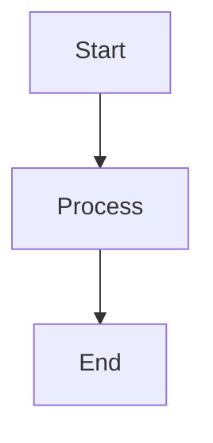

# Project Documentation - CLAUDE.md

**Profile**: documentation
**Generated**: 2026-01-09

## 🎯 Project Overview

Project documentation, guides, architecture diagrams, and reports

## 🏗️ Architecture

**Tech Stack**: Markdown, Mermaid, PlantUML
**Port**: N/A
**Type**: Documentation

## 📋 Development Commands

```bash
# Development
N/A

# Build
N/A

# Test
markdownlint **/*.md

# Lint
markdownlint **/*.md
```

## 🧠 Claude Flow Integration

### Available Agents

- researcher
- reviewer
- system-architect

### Recommended Workflows

- Documentation updates
- Architecture diagrams
- API documentation
- User guides

---

## 🛠️ Tech Stack Specific Guidelines

## Documentation Guidelines

### Structure
- README.md in every major directory
- Architecture Decision Records (ADRs)
- API documentation
- User guides
- Troubleshooting guides

### Markdown Best Practices
- Use proper heading hierarchy (H1 → H2 → H3)
- Code blocks with language specification
- Tables for structured data
- Links for cross-references
- Images with alt text

### Diagrams


### Code Examples
- Runnable code snippets
- Expected outputs
- Error handling examples
- Configuration examples

### API Documentation
- OpenAPI/Swagger specifications
- Request/response examples
- Authentication details
- Rate limiting information

### Change Management
- Keep changelog updated
- Document breaking changes
- Version migration guides
- Deprecation notices

### Best Practices
- Write for your audience
- Keep documentation up-to-date
- Use consistent terminology
- Include troubleshooting sections
- Add search functionality
- Regular documentation reviews


---

## 📝 Notes

- Auto-generated by Project Nyra Batch CLAUDE.md System
- For manual customization, edit this file directly
- To regenerate, run: `node scripts/batch-claude-md/batch-template-engine.js`
