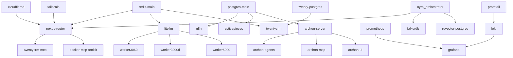

# Project Nyra — Canonical Infra Consolidation Plan (Maximalist / No-Loss)

## Executive Decisions

- Keep **`/infra` as the sole canonical runtime source**, but formalize it into machine-aware layers (`base`, `profiles`, `hosts`, `archive-index`) so startup/shutdown is modular without deleting any existing assets.
- Keep **all historical infra untouched in `/infra-archived/infra-20260206-1551`**; add an index/mapping layer so every legacy compose/service/env can be traced to canonical equivalents.
- Standardize orchestration around **profile-driven Docker Compose** with exact per-machine `COMPOSE_PROFILES` presets to reduce orchestrator RAM load.
- Move stateful but low-latency-tolerant services (workflow/UI/CRM/observability long-term storage) to **Oracle VM**, while keeping GPU inference + local caches on workers.
- Split databases by concern and pin non-overlapping ports for `main postgres`, `twenty postgres`, `ruvector postgres`, `letta postgres`, optional `dify postgres`.
- Integrate MCP through **Nexus Router as the MCP control plane**; add docker MCP hub exposure (desktop commander/fetch/tavily/dockerhub/supabase/bitwarden/infisical/etc.) behind gateway profile.
- Finalize Archon as a **five-container bundle** (`archon-ui`, `archon-server`, `archon-mcp`, `archon-agents`, optional `archon-agent-work-orders`) with fixed URLs and profile toggles.

---

## 1) Canonical infra folder structure proposal (no-loss)

```text
infra/
  compose/
    base/
      docker-compose.core.yml
      docker-compose.datastores.yml
      docker-compose.gateway.yml
      docker-compose.mcp.yml
      docker-compose.observability.yml
      docker-compose.workflows.yml
      docker-compose.apps.yml
      docker-compose.archon.yml
    hosts/
      docker-compose.orchestrator.yml
      docker-compose.oracle-vps.yml
      docker-compose.worker-rtx3060.yml
      docker-compose.worker-rtx3090ti.yml
      docker-compose.worker-rtx5090.yml
      docker-compose.dev-laptop.yml
    overrides/
      docker-compose.orchestrator.override.yml
      docker-compose.worker-rtx3060.override.yml
      docker-compose.worker-rtx3090ti.override.yml
      docker-compose.worker-rtx5090.override.yml
  env/
    shared/.env.shared.example
    hosts/.env.orchestrator.example
    hosts/.env.oracle-vps.example
    hosts/.env.worker-rtx3060.example
    hosts/.env.worker-rtx3090ti.example
    hosts/.env.worker-rtx5090.example
    services/
      n8n.env.example
      activepieces.env.example
      twenty.env.example
      archon.env.example
      nexus-router.env.example
  configs/
    archon/
    infisical/
    litellm/
    loki/
    prometheus/
    nexus-router/
  scripts/
    compose-up.sh
    compose-down.sh
    compose-validate.sh
    service-catalog-export.py
  archive-index/
    archived-service-map.md
    archived-port-map.md
    archived-env-key-map.md
```

### Rationale

- Preserves modularity from existing stack variants while converging execution entrypoints.
- Separates **what a service is** (base compose) from **where it runs** (host compose) and **how it is tuned** (override/env).
- Avoids accidental loss by keeping archived references explicit under `archive-index`.

---

## 2) Complete service catalog (canonical target)

> Legend: Profile tags = `core`, `secrets`, `workflow`, `observability`, `edge`, `vector`, `apps`, `ui`, `devtools`, `archon`, `workers`.

| Service                             | Image / Build                          | Ports (host:container)                | Dependencies                              | Data volumes         | Env groups    | Profiles       | Machine                                 | On-demand?                |
| ----------------------------------- | -------------------------------------- | ------------------------------------- | ----------------------------------------- | -------------------- | ------------- | -------------- | --------------------------------------- | ------------------------- |
| postgres-main                       | `postgres:16-alpine`                   | `5432:5432`                           | -                                         | `postgres_data`      | db-main       | core           | Orchestrator (or Oracle if centralized) | No                        |
| redis-main                          | `redis:7-alpine`                       | `6379:6379`                           | -                                         | `redis_data`         | cache-core    | core           | Orchestrator                            | No                        |
| ruvector-postgres                   | `ruvnet/ruvector-postgres:latest`      | `5436:5432`                           | -                                         | `ruvector_pg_data`   | db-vector     | vector         | Oracle VPS preferred                    | No                        |
| twenty-postgres                     | `postgres:16`                          | `5433:5432`                           | -                                         | `twenty_pg_data`     | db-twenty     | crm            | Oracle VPS preferred                    | No                        |
| letta-postgres                      | `postgres:16`                          | `5435:5432`                           | -                                         | `letta_pg_data`      | db-letta      | apps           | Oracle VPS                              | No                        |
| falkordb                            | `falkordb/falkordb:latest`             | `6381:6379`                           | -                                         | `falkordb_data`      | vector-store  | vector         | Oracle VPS                              | No                        |
| nexus-router                        | `infra/docker/nexus-router/Dockerfile` | `7000:7000`, `8080:8080`, `9091:9091` | redis-main, litellm                       | `nexus_data`         | gateway/mcp   | edge,gateway   | Orchestrator                            | No                        |
| docker-mcp-toolkit                  | `docker/mcp-toolkit:latest`            | `8811:8811`                           | nexus-router                              | stateless            | mcp-docker    | devtools,mcp   | Orchestrator                            | Yes                       |
| github/git mcp                      | external image(s)                      | `88xx` range reserved                 | nexus-router                              | optional             | mcp-git       | devtools,mcp   | Oracle/Orchestrator                     | Yes                       |
| bitwarden-mcp                       | archived compose image                 | `88xx` reserved                       | nexus-router                              | optional             | mcp-bitwarden | secrets,mcp    | Oracle                                  | Yes                       |
| infisical-mcp                       | archived compose image                 | `88xx` reserved                       | infisical, nexus-router                   | optional             | mcp-infisical | secrets,mcp    | Oracle                                  | Yes                       |
| supabase/fetch/tavily mcp           | docker desktop MCP servers             | routed through nexus                  | nexus-router                              | external             | mcp-external  | devtools,mcp   | Orchestrator                            | Yes                       |
| litellm                             | `ghcr.io/berriai/litellm:main-stable`  | `4000:4000`                           | redis-main                                | `litellm_logs`       | llm-router    | core,workers   | Orchestrator                            | No                        |
| n8n                                 | `n8nio/n8n:latest`                     | `5678:5678`                           | postgres-main, nexus-router               | `n8n_data`           | workflow-n8n  | workflow       | Oracle VPS                              | Optional (business hours) |
| activepieces                        | `activepieces/activepieces:latest`     | `8082:80`                             | postgres-main, redis-main                 | `activepieces_data`  | workflow-ap   | workflow       | Oracle VPS                              | Optional                  |
| twentycrm                           | `twentycrm/twenty:latest`              | `3000:3000`                           | twenty-postgres, redis-main, nexus-router | `twenty_data`        | crm           | apps,crm       | Oracle VPS                              | Optional                  |
| twentycrm-mcp                       | `ghcr.io/jezweb/twenty-crm-mcp:latest` | `8082:8082` (move to `8182`)          | twentycrm, nexus-router                   | stateless            | crm-mcp       | crm,mcp        | Oracle VPS                              | Yes                       |
| gitea                               | `gitea/gitea:1.22-rootless`            | `3001:3000`, `2222:2222`              | postgres-main                             | `gitea_data`         | scm           | apps,devtools  | Oracle VPS                              | Optional                  |
| gitea-runner                        | `gitea/act_runner:latest`              | -                                     | gitea                                     | `gitea_runner_data`  | scm-runner    | devtools       | Worker/Orchestrator                     | On demand                 |
| claude-flow                         | local build                            | `8085:8080`                           | litellm, redis-main, nexus-router         | `claude_flow_data`   | agent-orch    | core           | Orchestrator                            | No                        |
| claude-flow-dashboard               | local build                            | `3003:3003`                           | claude-flow-event-server                  | stateless            | ui-dashboard  | ui             | Orchestrator/Oracle                     | Optional                  |
| claude-flow-event-server            | local build                            | `3004:3004`, `3005:3005`              | redis-main                                | `event_data`         | events        | core           | Orchestrator                            | No                        |
| nyra_orchestrator                   | local build                            | `8010:8010`                           | nexus-router, vector stores               | `orchestrator_state` | orchestration | core           | Orchestrator                            | No                        |
| archon-ui                           | local build                            | `3737:3737`                           | archon-server                             | `archon_ui_data`     | archon-ui     | archon,ui      | Orchestrator                            | Optional                  |
| archon-server                       | local build                            | `8181:8181`                           | postgres-main                             | `archon_docs`        | archon-server | archon         | Orchestrator                            | No                        |
| archon-mcp                          | local build                            | `8051:8051`                           | archon-server                             | stateless            | archon-mcp    | archon,mcp     | Orchestrator                            | Optional                  |
| archon-agents                       | local build                            | `8052:8052`                           | archon-server, postgres-main              | `archon_agents_data` | archon-agents | archon         | Worker-5090/Orchestrator                | Optional                  |
| archon-agent-work-orders            | local build / optional                 | `8053:8053`                           | archon-agents                             | `archon_work_orders` | archon-work   | archon         | Worker-5090 preferred                   | On demand                 |
| openwebui                           | `ghcr.io/open-webui/open-webui:main`   | `8088:8080`                           | nexus-router                              | `openwebui_data`     | ui-chat       | ui,apps        | Oracle VPS                              | Optional                  |
| openclaw chat/web                   | local build                            | `9000:9000`                           | litellm, nexus-router                     | `openclaw_data`      | claw-ui       | apps,ui        | Oracle VPS                              | Optional                  |
| moltbot + moltbot-web               | local build                            | `9011:9000` / web port                | redis-main                                | app-specific         | bots          | apps           | Oracle VPS                              | Optional                  |
| grafana                             | `grafana/grafana:latest`               | `3006:3000`                           | prometheus,loki                           | `grafana_data`       | obs-ui        | observability  | Oracle VPS                              | No                        |
| prometheus                          | `prom/prometheus:latest`               | `9090:9090`                           | exporters                                 | `prometheus_data`    | obs-metrics   | observability  | Oracle VPS                              | No                        |
| loki                                | `grafana/loki:latest`                  | `3100:3100`                           | -                                         | `loki_data`          | obs-logs      | observability  | Oracle VPS                              | No                        |
| promtail                            | `grafana/promtail:latest`              | -                                     | loki                                      | host logs            | obs-agent     | observability  | all machines                            | No                        |
| cadvisor/node-exporter/gpu-exporter | standard images                        | `8081`, `9100`, `9835`                | -                                         | stateless            | exporters     | observability  | per-node                                | No                        |
| cloudflared                         | `cloudflare/cloudflared:latest`        | tunnel only                           | upstream services                         | `cloudflared`        | edge-tunnel   | edge           | Orchestrator + Oracle                   | No                        |
| tailscale / tailscale-worker        | `ghcr.io/tailscale/tailscale`          | mesh                                  | -                                         | `tailscale_state`    | network       | edge           | all nodes                               | No                        |
| worker-3060-ollama                  | `ollama/ollama:latest`                 | `11434:11434`                         | tailscale-worker                          | `ollama_3060_data`   | worker-ollama | workers        | worker-rtx3060                          | No                        |
| worker-3090ti-vllm                  | `vllm/vllm-openai:latest`              | `8100:8000`                           | tailscale-worker                          | model cache          | worker-vllm   | workers        | worker-rtx3090ti                        | No                        |
| worker-5090-vllm                    | `vllm/vllm-openai:latest`              | `8101:8000`                           | tailscale-worker,lmcache                  | model cache          | worker-vllm   | workers        | worker-rtx5090                          | No                        |
| lmcache                             | lmcache image (archived refs)          | `8110:8110`                           | redis-main                                | `lmcache_data`       | cache-llm     | workers,vector | worker-5090                             | No                        |

### Archived-only/unknown services discovered (must remain cataloged)

Archived inventory contains **113 services not currently present in active `/infra`** and should be mapped in `archive-index/archived-service-map.md` before any deprecation. Includes: `agentic-flow`, `agentdb`, `composio-mcp`, `metamcp*`, `neo4j*`, `qdrant*`, `postgres-mcp`, `redis-mcp`, `dozzle`, `portainer`, `wake-on-lan`, `zep-mcp`, `serena-mcp`, `github-mcp`, `git-mcp`, `bitwarden-mcp`, `infisical-mcp`, and more.

---

## 3) Final port allocation plan (collision-free)

| Domain         | Service                  | Port  |
| -------------- | ------------------------ | ----- |
| Databases      | postgres-main            | 5432  |
| Databases      | twenty-postgres          | 5433  |
| Databases      | dify-postgres (optional) | 5434  |
| Databases      | letta-postgres           | 5435  |
| Databases      | ruvector-postgres        | 5436  |
| Caches/Vector  | redis-main               | 6379  |
| Caches/Vector  | falkordb                 | 6381  |
| LLM endpoints  | litellm                  | 4000  |
| LLM endpoints  | worker-3090ti-vllm       | 8100  |
| LLM endpoints  | worker-5090-vllm         | 8101  |
| LLM endpoints  | worker-3060-ollama       | 11434 |
| Gateway/MCP    | nexus-router API         | 7000  |
| Gateway/MCP    | nexus-router MCP ingress | 8080  |
| Gateway/MCP    | nexus metrics            | 9091  |
| Gateway/MCP    | docker-mcp-toolkit       | 8811  |
| Workflow       | n8n                      | 5678  |
| Workflow       | activepieces             | 8082  |
| CRM/App        | twentycrm ui             | 3000  |
| CRM/App        | gitea                    | 3001  |
| Archon         | archon-ui                | 3737  |
| Archon         | archon-server            | 8181  |
| Archon         | archon-mcp               | 8051  |
| Archon         | archon-agents            | 8052  |
| Archon         | archon-agent-work-orders | 8053  |
| Observability  | prometheus               | 9090  |
| Observability  | grafana                  | 3006  |
| Observability  | loki                     | 3100  |
| Node telemetry | cadvisor                 | 8081  |
| Node telemetry | node-exporter            | 9100  |
| Node telemetry | nvidia-gpu-exporter      | 9835  |

**Reserved ranges**

- `8800-8899`: MCP adapters behind nexus router.
- `8100-8199`: GPU worker model servers.
- `5400-5499`: future postgres-compatible stores.

---

## 4) Profiles strategy (exact per-machine sets)

### Canonical profile names

`core,secrets,workflow,observability,edge,vector,apps,ui,devtools,archon,workers,mcp,crm,oracle,orchestrator`

### COMPOSE_PROFILES by machine

- **orchestrator (24/7 minimal)**  
  `COMPOSE_PROFILES=core,edge,gateway,mcp,archon,orchestrator`
- **worker-rtx3060**  
  `COMPOSE_PROFILES=workers,edge,observability,worker-3060`
- **worker-rtx5090**  
  `COMPOSE_PROFILES=workers,edge,observability,worker-5090,vector`
- **worker-rtx3090ti**  
  `COMPOSE_PROFILES=workers,edge,observability,worker-3090ti`
- **oracle VPS**  
  `COMPOSE_PROFILES=oracle,workflow,apps,crm,observability,edge,secrets`
- **dev laptop**  
  `COMPOSE_PROFILES=core,apps,ui,devtools,mcp`

### Always-on vs on-demand

- **Always-on:** postgres-main, redis-main, litellm, nexus-router, cloudflared, tailscale, worker inference endpoints, prometheus/loki/grafana.
- **On-demand:** gitea-runner, twentycrm-mcp, docker-mcp-toolkit extras, archon-work-orders, openwebui, openclaw/moltbot UIs, n8n/activepieces during low-load windows.

---

## 5) Secret strategy (Infisical)

### Path ownership model

- `/nyra/shared` → global APIs + cross-service URLs
- `/nyra/nodes/orchestrator` → orchestrator-only runtime and routing secrets
- `/nyra/nodes/oracle` → VPS workflows/apps/CRM secrets
- `/nyra/nodes/worker-rtx3060` → ollama worker secrets
- `/nyra/nodes/worker-rtx3090ti` → vllm worker secrets
- `/nyra/nodes/worker-rtx5090` → vllm + lmcache worker secrets
- `/nyra/services/<service-name>` → service-specific credentials and tokens

### Exact env var ownership

- **`/nyra/shared`**: `ANTHROPIC_API_KEY`, `OPENAI_API_KEY`, `OPENROUTER_API_KEY`, `GOOGLE_API_KEY`, `HF_TOKEN`, `NEXUS_ROUTER_URL`, `ORCHESTRATOR_URL`, `PUBLIC_*`, `TWILIO_*`, `SENDGRID_*`.
- **`/nyra/services/postgres-main`**: `POSTGRES_HOST`, `POSTGRES_PORT`, `POSTGRES_USER`, `POSTGRES_PASSWORD`, `POSTGRES_DB`, `POSTGRES_URL`.
- **`/nyra/services/twenty`**: `TWENTY_API_KEY`, `TWENTY_URL`, `TWENTY_WORKSPACE_ID`, `TWENTY_APP_SECRET`, `TWENTY_SERVER_URL`, `TWENTY_FRONTEND_URL`, `TWENTY_PG_DATABASE_URL`, `TWENTY_REDIS_URL`.
- **`/nyra/services/n8n`**: `N8N_HOST`, `N8N_PORT`, `N8N_WEBHOOK_URL`, `N8N_BASIC_AUTH_*`, `N8N_ENCRYPTION_KEY`.
- **`/nyra/services/activepieces`**: `AP_DB_TYPE`, `AP_POSTGRES_*`, `AP_REDIS_*`, `AP_ENCRYPTION_KEY`, `AP_JWT_SECRET`, `AP_FRONTEND_URL`.
- **`/nyra/services/cloudflare`**: `CF_*`, `CLOUDFLARE_*`, `CLOUDFLARE_TUNNEL_TOKEN`.
- **`/nyra/nodes/orchestrator`**: `ORCHESTRATOR_TAILSCALE_IP`, `CF_TUNNEL_ID_ORCHESTRATOR`, `EVENT_SERVER_*`, `VITE_*`, `METRICS_ENABLED`, `LOG_LEVEL`.
- **`/nyra/nodes/worker-rtx3060`**: `OLLAMA_*`, `NVIDIA_VISIBLE_DEVICES`, `NVIDIA_DRIVER_CAPABILITIES`.
- **`/nyra/nodes/worker-rtx5090`**: `VLLM_*`, `NVIDIA_VISIBLE_DEVICES`, `VLLM_GPU_MEMORY_UTILIZATION`, `VLLM_MAX_MODEL_LEN`.
- **`/nyra/services/archon`**: `ARCHON_*`, reranker/provider keys, job queue credentials.

---

## 6) Offload strategy (Oracle vs orchestrator)

### Move to Oracle free tier (target)

- Workflow + business apps: `n8n`, `activepieces`, `twentycrm`, `gitea`, optional web UIs.
- Observability persistence: `prometheus`, `loki`, `grafana` (with retention tuning).
- Vector/control-plane support that is not GPU-critical: `ruvector-postgres`, `falkordb`, `twenty-postgres`, `letta-postgres`.
- Secrets hosting: self-hosted `infisical` (if free-tier API limits are concern), plus `infisical-mcp`.

### Keep on orchestrator

- Minimal routing/control: `nexus-router`, `litellm`, `nyra_orchestrator`, core redis/postgres (unless fully centralized), cloudflare/tailscale endpoints.
- Short-lived orchestration UIs only when needed.

### DB implications

- **Option A (recommended):** central DBs on Oracle, workers connect over tailscale/private tunnel.
- **Option B:** keep latency-critical cache (`redis-main`) local on orchestrator; store-of-record DBs on Oracle.
- **Option C:** dual-write avoided; use single writer with read replicas only if needed.

---

## 7) Archon setup finalization

### Container matrix

| Service                      | Container Name             | URL                     | Purpose                                 |
| ---------------------------- | -------------------------- | ----------------------- | --------------------------------------- |
| Web Interface                | `archon-ui`                | `http://localhost:3737` | Main dashboard and controls             |
| API Service                  | `archon-server`            | `http://localhost:8181` | Web crawling, doc processing            |
| MCP Server                   | `archon-mcp`               | `http://localhost:8051` | MCP interface                           |
| Agents Service               | `archon-agents`            | `http://localhost:8052` | AI/ML ops, reranking                    |
| Agent Work Orders (optional) | `archon-agent-work-orders` | `http://localhost:8053` | Workflow execution with Claude Code CLI |

### What goes into Archon

- Shared knowledge corpus: SOPs, runbooks, infra manifests, service ownership maps.
- Persistent task graph: migration tasks, rollout states, rollback recipes.
- Agent playbooks: onboarding flows, incident response templates, compose profile recipes.
- MCP registry metadata for discoverability (`provider`, `auth mode`, `latency class`, `cost class`).

### Runtime recommendation

- Keep `archon-server` always-on; run `archon-ui`, `archon-mcp`, and `archon-agent-work-orders` as profile-based on-demand unless actively used.

---

## Dependency graph (canonical)



---

## 8) Step-by-step migration plan (with checkpoints)

1. **Phase 0 — Inventory freeze**
   - Actions: export current `/infra` + `/infra-archived` service/port/env catalogs; hash compose files.
   - Safety check: service count parity recorded; unknown services list generated.
   - Rollback: none (read-only).
   - Acceptance: signed inventory baseline.

2. **Phase 1 — Canonical compose layering**
   - Actions: introduce `compose/base + compose/hosts + env` layout without removing old files.
   - Safety check: `docker compose config` succeeds for each host profile set.
   - Rollback: keep old entrypoint compose files unchanged.
   - Acceptance: all host stacks render valid merged config.

3. **Phase 2 — Port normalization**
   - Actions: apply fixed DB/LLM/MCP ports from final map.
   - Safety check: automated collision scan (`ss -ltn` + compose rendered ports).
   - Rollback: per-service port reversion via env overrides.
   - Acceptance: zero host-level collisions.

4. **Phase 3 — Secrets cutover to Infisical paths**
   - Actions: create `/nyra/shared`, `/nyra/nodes/*`, `/nyra/services/*`; wire agents/CLI templates.
   - Safety check: dry-run env render equals previous non-secret values.
   - Rollback: fallback to existing `.env.*` files.
   - Acceptance: all core services boot with Infisical-injected env.

5. **Phase 4 — Oracle offload wave**
   - Actions: migrate workflow/apps/CRM/observability stateful services to Oracle.
   - Safety check: DB connectivity + p95 latency checks from orchestrator/workers.
   - Rollback: DNS/tunnel switchback and compose up on orchestrator.
   - Acceptance: orchestrator RAM reduced; Oracle services stable 24h.

6. **Phase 5 — Archon finalization**
   - Actions: deploy 5 Archon containers with profiles; ingest shared corpus and task graph.
   - Safety check: endpoint health checks on `3737/8181/8051/8052/8053`.
   - Rollback: disable `archon*` profiles.
   - Acceptance: Archon UI/API/MCP/Agents operational.

7. **Phase 6 — MCP hub expansion**
   - Actions: onboard docker desktop MCP servers via nexus-router (desktop commander alt/fetch/tavily/dockerhub/supabase/bitwarden/infisical).
   - Safety check: per-adapter auth test + namespace isolation.
   - Rollback: disable adapter profile.
   - Acceptance: tools discoverable and routable through nexus.

8. **Phase 7 — Production hardening**
   - Actions: retention limits, backups, alert rules, startup order policies.
   - Safety check: chaos restart test + restore drill.
   - Rollback: previous retention/backup policy snapshots.
   - Acceptance: RPO/RTO targets met and documented.
