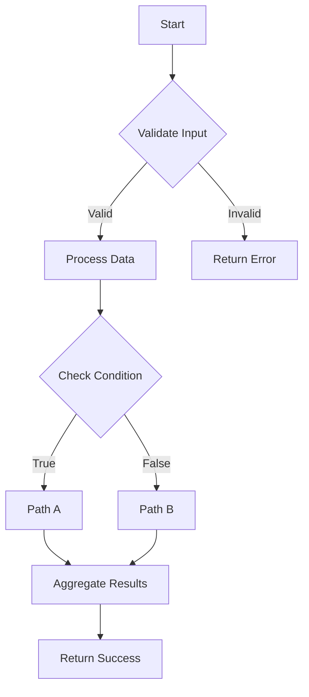
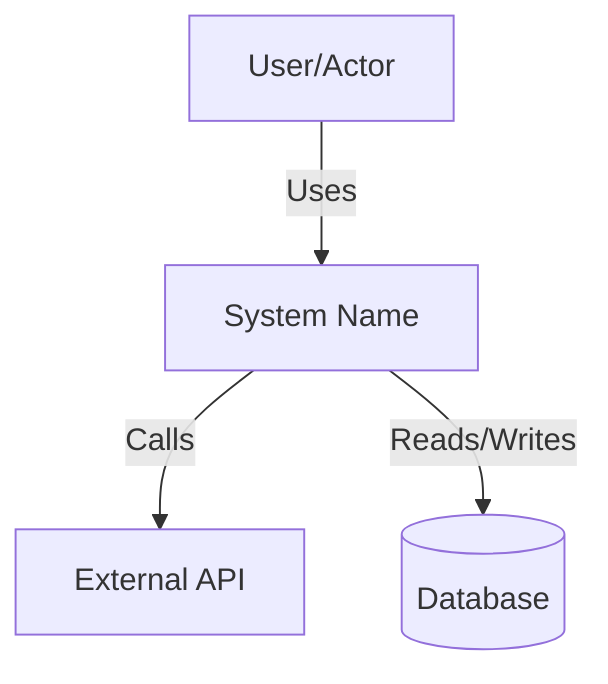
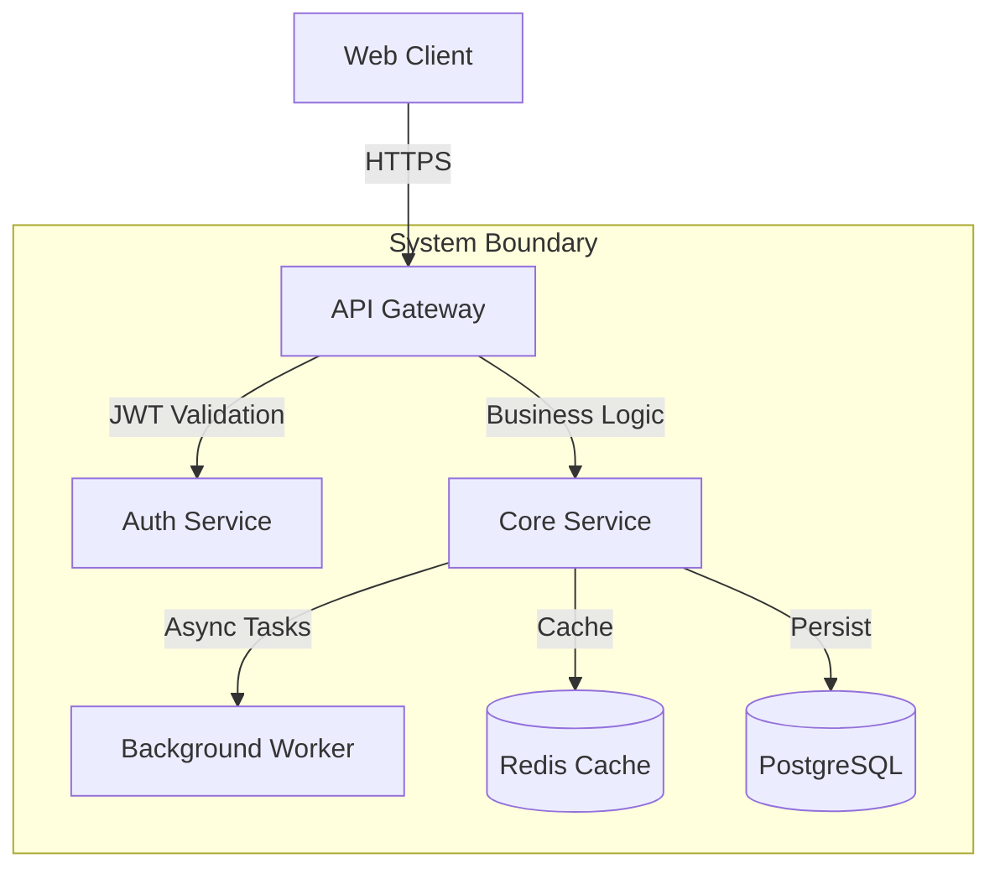
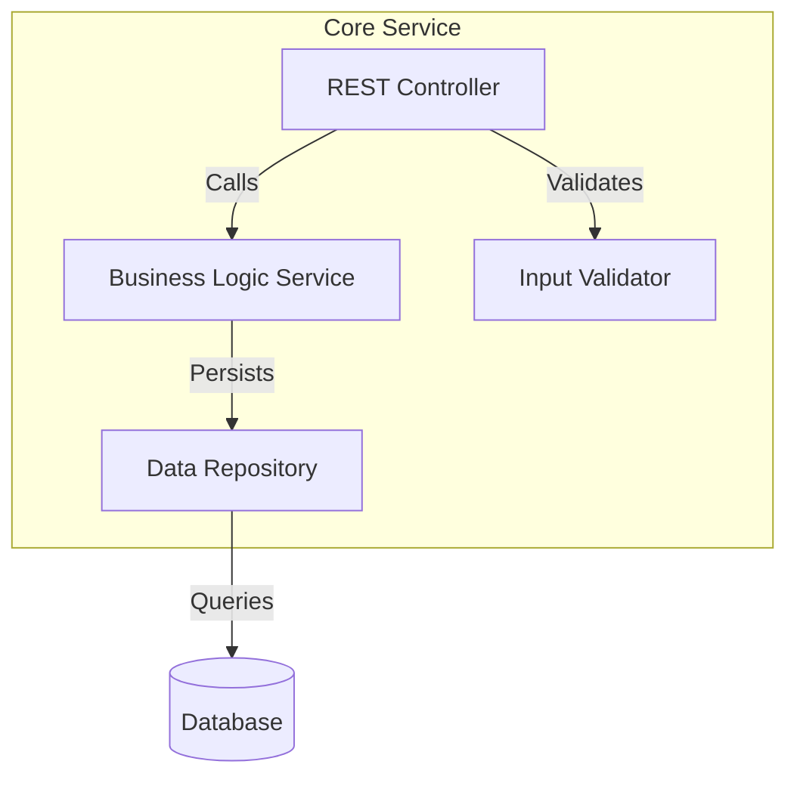
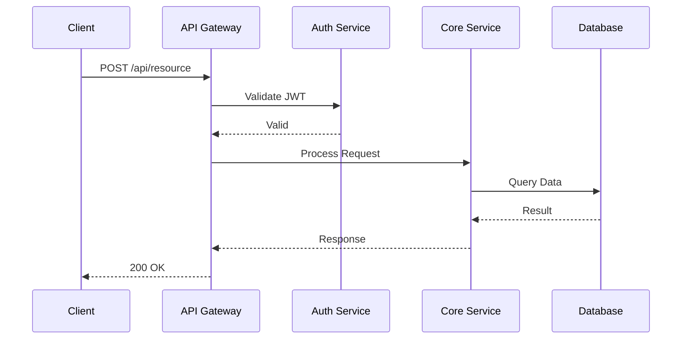
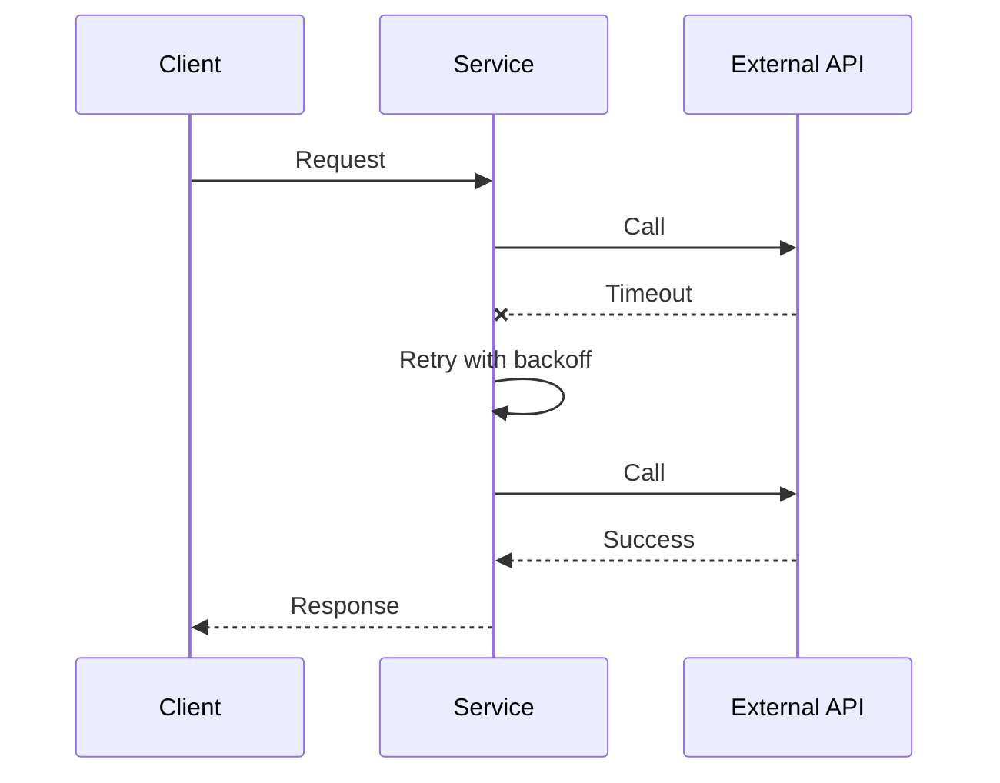
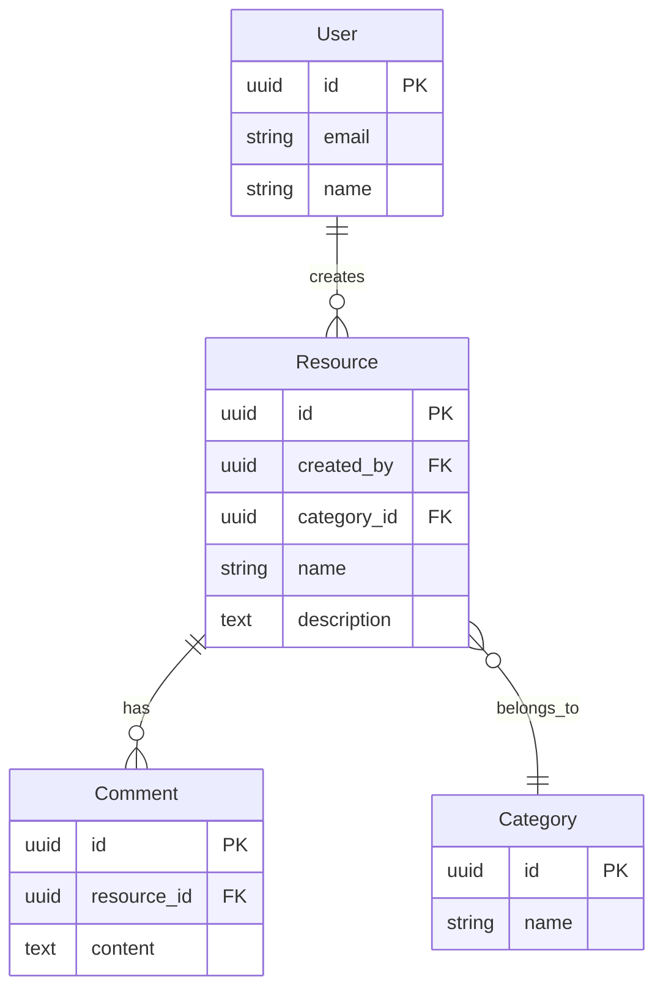

# SPARC Methodology Specifications - Project Nyra

**Version**: 3.0.0
**Last Updated**: 2026-01-21
**Status**: Production-Ready

## Table of Contents

1. [Overview](#overview)
2. [SPARC Methodology Principles](#sparc-methodology-principles)
3. [Phase 1: Specification](#phase-1-specification-s)
4. [Phase 2: Pseudocode](#phase-2-pseudocode-p)
5. [Phase 3: Architecture](#phase-3-architecture-a)
6. [Phase 4: Refinement](#phase-4-refinement-r)
7. [Phase 5: Completion](#phase-5-completion-c)
8. [Claude-Flow V3 Integration](#claude-flow-v3-integration)
9. [Project Nyra Implementation Guide](#project-nyra-implementation-guide)
10. [Best Practices and Patterns](#best-practices-and-patterns)
11. [Quality Gates and Metrics](#quality-gates-and-metrics)
12. [Troubleshooting](#troubleshooting)

---

## Overview

SPARC (Specification, Pseudocode, Architecture, Refinement, Completion) is a systematic development methodology that transforms the development process from ad-hoc coding to a disciplined, test-driven approach where each phase builds upon the previous, ensuring comprehensive coverage and maintainability.

### SPARC Workflow Visualization

```
┌─────────────────────────────────────────────────────────────────────┐
│                        SPARC WORKFLOW                               │
├─────────────────────────────────────────────────────────────────────┤
│                                                                     │
│   ┌──────────────┐     ┌──────────────┐     ┌──────────────┐       │
│   │ SPECIFICATION│────▶│  PSEUDOCODE  │────▶│ ARCHITECTURE │       │
│   │              │     │              │     │              │       │
│   │ Requirements │     │  Algorithms  │     │   Design     │       │
│   │ Constraints  │     │  Logic Flow  │     │  Components  │       │
│   │ Edge Cases   │     │  Data Types  │     │  Interfaces  │       │
│   └──────────────┘     └──────────────┘     └──────┬───────┘       │
│                                                     │               │
│                                                     ▼               │
│   ┌──────────────┐     ┌──────────────┐     ┌──────────────┐       │
│   │  COMPLETION  │◀────│  REFINEMENT  │◀────│     TDD      │       │
│   │              │     │              │     │              │       │
│   │ Integration  │     │ Optimization │     │ Red-Green-   │       │
│   │ Validation   │     │ Performance  │     │ Refactor     │       │
│   │ Deployment   │     │ Security     │     │ Tests First  │       │
│   └──────────────┘     └──────────────┘     └──────────────┘       │
│                                                                     │
│   🧠 ReasoningBank: Learn from each phase, adapt methodology       │
└─────────────────────────────────────────────────────────────────────┘
```

### Key Benefits

1. **Systematic Development** - Well-defined phases prevent skipped steps
2. **Quality Assurance** - Quality gates enforce standards
3. **Test-Driven** - TDD in refinement ensures reliability
4. **Traceability** - Full documentation from requirements to deployment
5. **Continuous Learning** - ReasoningBank captures patterns and optimizations
6. **Parallel Execution** - Supports multi-agent coordination
7. **Production Ready** - Completion phase ensures deployment readiness

---

## SPARC Methodology Principles

### Core Principles

1. **Never Skip Phases** - Each phase builds on the previous
2. **Enforce Quality Gates** - No shortcuts to production
3. **Document Decisions** - Maintain full traceability
4. **Test-First Development** - Write tests before implementation
5. **Iterate Within Phases** - Refinement is expected and encouraged
6. **Learn and Adapt** - Capture patterns for future improvements
7. **Parallel Where Possible** - Leverage multi-agent coordination

### Phase Dependencies

```
Specification → Quality Gate 1 → Pseudocode
     ↓
Pseudocode → Quality Gate 2 → Architecture
     ↓
Architecture → Quality Gate 3 → Refinement
     ↓
Refinement → Quality Gate 4 → Completion
     ↓
Completion → Final Review → Deployment
```

---

## Phase 1: Specification (S)

### Purpose

Define clear, testable requirements before any implementation. Capture all functional and non-functional requirements, identify edge cases, and establish acceptance criteria.

### Objectives

- **Requirements Gathering** - Document all functional and non-functional requirements
- **User Stories** - Create user stories in Given-When-Then format
- **Acceptance Criteria** - Define measurable success criteria
- **Edge Cases** - Identify and document edge cases and constraints
- **API Contracts** - Specify interfaces and data models
- **Compliance** - Document regulatory and compliance requirements

### Deliverables

| Deliverable | Description | Format |
|-------------|-------------|--------|
| Requirements Document | Complete functional/non-functional requirements | Markdown |
| User Stories | User-focused feature descriptions | Markdown |
| API Contracts | Interface specifications | OpenAPI/JSON Schema |
| Data Models | Entity definitions and relationships | Markdown/ERD |
| Compliance Matrix | Regulatory requirement mapping | Table/Matrix |
| Edge Case Document | Boundary conditions and error scenarios | Markdown |

### Specification Template

```markdown
# Feature Specification: [Feature Name]

## Executive Summary
[Brief overview of the feature and its business value]

## User Stories
- As a [role], I want [feature] so that [benefit]
- As a [role], I want [feature] so that [benefit]

## Acceptance Criteria
- [ ] Given [context], When [action], Then [result]
- [ ] Given [context], When [action], Then [result]

## Functional Requirements
### Core Features
- FR-001: [Requirement description]
- FR-002: [Requirement description]

### User Interface
- UI-001: [Interface requirement]
- UI-002: [Interface requirement]

### Business Logic
- BL-001: [Logic requirement]
- BL-002: [Logic requirement]

## Non-Functional Requirements
### Performance
- NFR-P-001: Response time < 200ms for 95th percentile
- NFR-P-002: Handle 1000 concurrent users

### Security
- NFR-S-001: Authentication via JWT
- NFR-S-002: Encryption at rest and in transit
- NFR-S-003: OWASP Top 10 compliance

### Scalability
- NFR-SC-001: Horizontal scaling capability
- NFR-SC-002: Load balancing support

### Reliability
- NFR-R-001: 99.9% uptime SLA
- NFR-R-002: Automated failover

### Compliance
- NFR-C-001: GDPR compliance for data handling
- NFR-C-002: TCPA compliance for messaging

## API Contracts
### REST Endpoints
```json
{
  "endpoint": "/api/v1/resource",
  "method": "POST",
  "request": {
    "field": "type"
  },
  "response": {
    "field": "type"
  }
}
```

### WebSocket Events
```json
{
  "event": "event.name",
  "payload": {
    "field": "type"
  }
}
```

## Data Models
### Entity: [EntityName]
| Field | Type | Constraints | Description |
|-------|------|-------------|-------------|
| id | UUID | PK, required | Unique identifier |
| name | String | required, max 255 | Entity name |

### Relationships
- [Entity1] → [Entity2] (one-to-many)
- [Entity2] → [Entity3] (many-to-many)

## Edge Cases and Error Scenarios
### Edge Case 1: [Description]
- **Condition**: [When this occurs]
- **Expected Behavior**: [How system should respond]
- **Error Handling**: [Error message and recovery]

### Error Scenario 1: [Description]
- **Trigger**: [What causes the error]
- **Response**: [System response]
- **Recovery**: [How to recover]

## Constraints and Assumptions
### Technical Constraints
- Must use existing authentication system
- Limited to PostgreSQL database
- Must support Node.js 20+

### Business Constraints
- Budget: $X
- Timeline: Y weeks
- Team size: Z developers

### Assumptions
- Users have modern browsers (Chrome 90+, Firefox 88+)
- Network latency < 100ms
- Third-party API availability > 99%

## Success Metrics
- [ ] All functional requirements implemented
- [ ] All acceptance criteria met
- [ ] Performance targets achieved
- [ ] Security requirements satisfied
- [ ] Compliance validated

## Dependencies
- External API: [API Name] v[version]
- Service: [Service Name]
- Library: [Library Name] v[version]

## Risks and Mitigations
| Risk | Impact | Probability | Mitigation |
|------|--------|-------------|------------|
| [Risk 1] | High | Medium | [Strategy] |
| [Risk 2] | Medium | Low | [Strategy] |
```

### Quality Gate 1: Specification Complete

**Requirements:**
- [ ] All functional requirements documented
- [ ] All non-functional requirements specified
- [ ] User stories written with acceptance criteria
- [ ] API contracts defined
- [ ] Data models specified
- [ ] Edge cases identified
- [ ] Compliance requirements documented
- [ ] Success metrics defined
- [ ] Stakeholder approval obtained

**Command to Validate:**
```bash
npx @claude-flow/cli@latest sparc validate specification \
  --doc "docs/sparc/specifications/[feature-name].md"
```

---

## Phase 2: Pseudocode (P)

### Purpose

Design algorithms and logic flow before coding. Plan implementation logic, identify data structures, and validate approach feasibility.

### Objectives

- **Algorithm Design** - Define computational approaches
- **Logic Flow** - Map out control flow and decision trees
- **Data Structures** - Choose optimal data structures
- **Complexity Analysis** - Analyze time and space complexity
- **Error Handling** - Design error handling strategies
- **Performance Planning** - Identify optimization opportunities

### Deliverables

| Deliverable | Description | Format |
|-------------|-------------|--------|
| Algorithm Document | Pseudocode for all core algorithms | Markdown |
| Flow Diagrams | Control flow visualizations | Mermaid/PlantUML |
| Data Structure Design | Chosen structures with rationale | Markdown |
| Complexity Analysis | Big-O notation for all algorithms | Table |

### Pseudocode Template

```markdown
# Pseudocode Design: [Feature Name]

## Algorithm Overview
[High-level description of the algorithmic approach]

## Core Algorithms

### Algorithm 1: [Algorithm Name]

**Purpose**: [What this algorithm accomplishes]
**Complexity**: Time O([complexity]), Space O([complexity])

```
FUNCTION algorithmName(parameters):
    // Step 1: Initialize
    initialize variables
    validate inputs

    // Step 2: Process
    FOR each item IN collection:
        IF condition:
            process item
        ELSE:
            handle alternative

    // Step 3: Return result
    RETURN result
END FUNCTION
```

**Edge Cases**:
- Empty input: Return default value
- Invalid input: Throw validation error
- Null values: Skip or use default

**Example Flow**:
```
Input: [1, 2, 3, 4, 5]
Step 1: Initialize sum = 0
Step 2: Process each number
  - sum = sum + 1 = 1
  - sum = sum + 2 = 3
  - sum = sum + 3 = 6
  - ...
Step 3: Return sum = 15
```

### Algorithm 2: [Token Refresh with Race Condition Prevention]

**Purpose**: Securely refresh JWT tokens preventing concurrent refresh attempts
**Complexity**: Time O(1), Space O(1)

```
ALGORITHM: Secure Token Refresh with Race Condition Prevention

FUNCTION refreshToken(refreshToken):
    START TRANSACTION

    // Validate refresh token
    IF NOT validateTokenSignature(refreshToken):
        RETURN error("Invalid token")

    // Check token in database with row lock (prevents race condition)
    token = SELECT * FROM refresh_tokens
            WHERE token = refreshToken
            FOR UPDATE  // Row-level lock

    IF NOT token OR token.used:
        ROLLBACK
        RETURN error("Token already used or invalid")

    // Check expiration
    IF token.expiresAt < NOW():
        ROLLBACK
        RETURN error("Token expired")

    // Mark token as used (atomic operation)
    UPDATE refresh_tokens
    SET used = TRUE, usedAt = NOW()
    WHERE id = token.id

    // Generate new tokens
    newAccessToken = generateJWT(userId, "15m")
    newRefreshToken = generateRefreshToken()

    // Store new refresh token
    INSERT INTO refresh_tokens (
        token: newRefreshToken,
        userId: token.userId,
        expiresAt: NOW() + 7 days,
        used: FALSE
    )

    COMMIT TRANSACTION

    RETURN {
        accessToken: newAccessToken,
        refreshToken: newRefreshToken
    }
END FUNCTION

// Error Handling
ON DATABASE_ERROR:
    ROLLBACK
    LOG error with context
    RETURN error("Database operation failed")

ON TIMEOUT:
    ROLLBACK
    LOG timeout event
    RETURN error("Operation timed out")
```

**Concurrency Safety**:
- Row-level lock (`FOR UPDATE`) prevents simultaneous refresh
- Transaction isolation ensures atomicity
- Token marked as used before generating new one

## Data Flow Diagrams

### Flow 1: [Flow Name]



## Data Structure Selection

### Structure 1: [Use Case]

**Chosen Structure**: Hash Map (Dictionary)

**Rationale**:
- O(1) average lookup time
- Efficient for key-value storage
- Handles dynamic sizing

**Alternative Considered**: Array
- Rejected due to O(n) lookup time
- Would require linear search

**Implementation Notes**:
- Initial capacity: 1000
- Load factor: 0.75
- Collision resolution: Chaining

### Structure 2: [Use Case]

**Chosen Structure**: Binary Search Tree (Balanced)

**Rationale**:
- O(log n) insertion and search
- Maintains sorted order
- Efficient range queries

**Implementation Notes**:
- Self-balancing (AVL or Red-Black)
- Allows duplicate values
- In-order traversal for sorted iteration

## Complexity Analysis

| Operation | Time Complexity | Space Complexity | Notes |
|-----------|----------------|------------------|-------|
| Insert | O(1) average | O(n) worst | Hash map insertion |
| Search | O(log n) | O(1) | BST search |
| Delete | O(log n) | O(1) | BST deletion |
| Traverse | O(n) | O(h) | Tree height for stack |
| Aggregate | O(n) | O(1) | Linear scan |

## Error Handling Strategy

### Error Categories

1. **Validation Errors** (400)
   - Invalid input format
   - Missing required fields
   - Out of range values

2. **Authentication Errors** (401)
   - Invalid credentials
   - Expired token
   - Missing authorization

3. **Authorization Errors** (403)
   - Insufficient permissions
   - Resource access denied

4. **Resource Errors** (404)
   - Resource not found
   - Deleted resource

5. **Conflict Errors** (409)
   - Duplicate resource
   - Race condition detected

6. **Server Errors** (500)
   - Database connection failed
   - External API unavailable
   - Unexpected exception

### Error Recovery

```
FUNCTION handleError(error):
    LOG error with context

    IF error.isRetryable:
        IF retryCount < maxRetries:
            WAIT exponentialBackoff(retryCount)
            RETRY operation
        ELSE:
            RETURN persistentFailureError
    ELSE:
        RETURN error with userMessage
END FUNCTION
```

## Performance Optimization Notes

### Optimization 1: Caching Strategy
- Cache frequently accessed data
- TTL: 5 minutes
- Invalidate on update
- Cache hit ratio target: >80%

### Optimization 2: Batch Processing
- Process items in batches of 100
- Parallel processing where possible
- Progress tracking for long operations

### Optimization 3: Database Queries
- Use prepared statements
- Index on frequently queried fields
- Avoid N+1 queries
- Implement connection pooling
```

### Quality Gate 2: Pseudocode Validated

**Requirements:**
- [ ] All algorithms defined with pseudocode
- [ ] Complexity analysis completed
- [ ] Data structures chosen with rationale
- [ ] Flow diagrams created
- [ ] Error handling strategies defined
- [ ] Performance considerations documented
- [ ] Edge cases addressed
- [ ] Peer review completed

**Command to Validate:**
```bash
npx @claude-flow/cli@latest sparc validate pseudocode \
  --doc "docs/sparc/pseudocode/[feature-name].md"
```

---

## Phase 3: Architecture (A)

### Purpose

Design system structure and component interactions. Define system components, design interfaces and contracts, plan data flow, and establish patterns and practices.

### Objectives

- **System Design** - Define overall system architecture
- **Component Definition** - Identify and design components
- **Interface Contracts** - Specify component interfaces
- **Data Flow Planning** - Map data movement through system
- **Integration Planning** - Plan external integrations
- **Security Design** - Architect security measures
- **Deployment Strategy** - Plan infrastructure and deployment

### Deliverables

| Deliverable | Description | Format |
|-------------|-------------|--------|
| Architecture Document | Complete system design | Markdown |
| Component Diagrams | C4 model or similar | Mermaid/PlantUML |
| Data Flow Diagrams | Data movement visualization | Diagram |
| API Design | Complete API specification | OpenAPI 3.0 |
| Database Schema | ERD and schema definition | SQL/Diagram |
| Security Architecture | Security controls and measures | Markdown |
| Deployment Plan | Infrastructure and CI/CD | Markdown/YAML |

### Architecture Template

```markdown
# Architecture Design: [Feature Name]

## Architecture Overview

### System Context (C4 Level 1)



### Container Diagram (C4 Level 2)



### Component Diagram (C4 Level 3)



## Component Specifications

### Component 1: [Component Name]

**Type**: [Service/Library/Module]
**Language**: [Node.js/Python/etc.]
**Framework**: [Express/NestJS/etc.]

**Responsibilities**:
- Responsibility 1
- Responsibility 2
- Responsibility 3

**Interfaces**:
```typescript
interface ComponentInterface {
  method1(param: Type): Promise<Result>;
  method2(param: Type): Result;
}
```

**Dependencies**:
- External Dependency 1 (version X.Y.Z)
- Internal Service 2
- Database: PostgreSQL

**Configuration**:
```yaml
component:
  port: 3000
  timeout: 30s
  retries: 3
  database:
    host: ${DB_HOST}
    pool_size: 10
```

### Component 2: [Component Name]

[Similar structure as Component 1]

## Data Flow Design

### Flow 1: [Use Case Name]



### Flow 2: [Error Scenario]



## API Design

### REST API Endpoints

#### Endpoint 1: Create Resource

```yaml
path: /api/v1/resources
method: POST
authentication: Bearer Token
rate_limit: 100 requests/minute

request:
  headers:
    Authorization: "Bearer {token}"
    Content-Type: "application/json"
  body:
    type: object
    properties:
      name:
        type: string
        required: true
        maxLength: 255
      description:
        type: string
        maxLength: 1000
    example:
      name: "Resource Name"
      description: "Resource description"

responses:
  201:
    description: Resource created successfully
    body:
      type: object
      properties:
        id: string
        name: string
        createdAt: string (ISO8601)
  400:
    description: Invalid request
  401:
    description: Unauthorized
  429:
    description: Rate limit exceeded
```

### WebSocket Events

```yaml
event: resource.updated
direction: server-to-client
authentication: required
payload:
  type: object
  properties:
    resourceId: string
    changes: object
    timestamp: string
```

## Database Schema

### Entity: [Entity Name]

```sql
CREATE TABLE resources (
    id UUID PRIMARY KEY DEFAULT gen_random_uuid(),
    name VARCHAR(255) NOT NULL,
    description TEXT,
    status VARCHAR(50) NOT NULL DEFAULT 'active',
    metadata JSONB,
    created_at TIMESTAMP NOT NULL DEFAULT NOW(),
    updated_at TIMESTAMP NOT NULL DEFAULT NOW(),
    created_by UUID REFERENCES users(id),

    CONSTRAINT chk_status CHECK (status IN ('active', 'inactive', 'deleted'))
);

CREATE INDEX idx_resources_status ON resources(status);
CREATE INDEX idx_resources_created_at ON resources(created_at DESC);
CREATE INDEX idx_resources_metadata ON resources USING GIN (metadata);
```

### Relationships



## Security Architecture

### Authentication & Authorization

**Strategy**: JWT-based authentication with refresh tokens

**Components**:
1. **Auth Service**: Issues and validates tokens
2. **API Gateway**: Validates all incoming requests
3. **Resource Service**: Enforces resource-level permissions

**Token Structure**:
```json
{
  "sub": "user-uuid",
  "roles": ["user", "admin"],
  "permissions": ["read:resources", "write:resources"],
  "exp": 1234567890,
  "iat": 1234567800
}
```

**Authorization Model**: Role-Based Access Control (RBAC)

| Role | Permissions |
|------|-------------|
| User | read:own, write:own |
| Admin | read:all, write:all, delete:all |
| System | full access |

### Security Controls

1. **Input Validation**
   - All inputs validated against schema
   - SQL injection prevention via parameterized queries
   - XSS prevention via output encoding

2. **Rate Limiting**
   - 100 requests/minute per user
   - 1000 requests/minute per IP
   - Exponential backoff on rate limit

3. **Encryption**
   - TLS 1.3 for data in transit
   - AES-256 for data at rest
   - Secrets managed via HashiCorp Vault

4. **Audit Logging**
   - All API calls logged
   - Security events tracked
   - Compliance audit trail

### Threat Model

| Threat | Likelihood | Impact | Mitigation |
|--------|-----------|--------|------------|
| SQL Injection | Low | Critical | Parameterized queries, input validation |
| XSS | Medium | High | Output encoding, CSP headers |
| CSRF | Medium | Medium | CSRF tokens, SameSite cookies |
| DDoS | High | High | Rate limiting, CDN, auto-scaling |

## Deployment Architecture

### Infrastructure

```yaml
environments:
  production:
    region: us-east-1
    availability_zones: 3
    scaling:
      min_instances: 3
      max_instances: 10
      target_cpu: 70%

  staging:
    region: us-east-1
    availability_zones: 2
    scaling:
      min_instances: 2
      max_instances: 4

  development:
    region: us-east-1
    availability_zones: 1
    instances: 1
```

### Container Strategy

```dockerfile
# Multi-stage build
FROM node:20-alpine AS builder
WORKDIR /app
COPY package*.json ./
RUN npm ci --only=production

FROM node:20-alpine
WORKDIR /app
COPY --from=builder /app/node_modules ./node_modules
COPY . .
RUN npm run build

USER node
EXPOSE 3000
CMD ["node", "dist/main.js"]
```

### CI/CD Pipeline

```yaml
stages:
  - test
  - build
  - deploy

test:
  script:
    - npm install
    - npm run lint
    - npm run test
    - npm run test:e2e
  coverage: 80%

build:
  script:
    - docker build -t app:$CI_COMMIT_SHA .
    - docker push registry/app:$CI_COMMIT_SHA

deploy:
  stage: deploy
  environment: production
  script:
    - kubectl set image deployment/app app=registry/app:$CI_COMMIT_SHA
    - kubectl rollout status deployment/app
  only:
    - main
```

## Integration Points

### External API: [API Name]

**Purpose**: [Why we integrate]
**Documentation**: https://api.example.com/docs
**Authentication**: API Key
**Rate Limits**: 1000 requests/hour

**Endpoints Used**:
- GET /api/data - Fetch data
- POST /api/process - Submit for processing

**Error Handling**:
- Retry on 503 (3 attempts with exponential backoff)
- Circuit breaker after 5 consecutive failures
- Fallback to cached data if available

### Message Queue: [Queue Name]

**Technology**: RabbitMQ / Redis Streams
**Purpose**: Async task processing

**Queues**:
- `tasks.high_priority` - Urgent processing
- `tasks.normal` - Standard processing
- `tasks.low_priority` - Batch processing

**Message Format**:
```json
{
  "id": "task-uuid",
  "type": "task.type",
  "payload": {},
  "timestamp": "ISO8601",
  "retries": 0
}
```

## Architecture Decision Records (ADRs)

### ADR-001: Use PostgreSQL for Primary Database

**Status**: Accepted
**Date**: 2026-01-21
**Deciders**: Architecture Team

**Context**:
We need a reliable, ACID-compliant database with strong consistency guarantees for transactional data.

**Decision**:
Use PostgreSQL 15+ as the primary database.

**Rationale**:
- ACID compliance for transactions
- Rich data types (JSON, arrays, etc.)
- Strong ecosystem and tooling
- Excellent performance for our workload
- Team expertise

**Consequences**:
- Positive: Strong consistency, mature tooling
- Negative: More complex scaling than NoSQL
- Mitigation: Use read replicas and connection pooling

### ADR-002: JWT for Authentication

**Status**: Accepted
**Date**: 2026-01-21

**Context**:
Need stateless authentication for microservices architecture.

**Decision**:
Use JWT with RS256 algorithm and refresh tokens.

**Rationale**:
- Stateless - no server-side session storage
- Standardized - JWT is widely supported
- Secure - RS256 provides strong security
- Scalable - works across multiple services

**Consequences**:
- Positive: Stateless, scalable, standard
- Negative: Token revocation requires additional mechanism
- Mitigation: Short-lived access tokens (15min) with refresh tokens

## Monitoring and Observability

### Metrics

```yaml
metrics:
  - name: http_requests_total
    type: counter
    labels: [method, path, status]

  - name: http_request_duration_seconds
    type: histogram
    labels: [method, path]
    buckets: [0.1, 0.5, 1, 2, 5]

  - name: database_query_duration_seconds
    type: histogram
    labels: [query_type]
```

### Logging

```yaml
logging:
  level: info
  format: json
  fields:
    - timestamp
    - level
    - service
    - trace_id
    - message
    - context
```

### Tracing

**Tool**: Jaeger / OpenTelemetry

**Trace Points**:
- HTTP requests (entry/exit)
- Database queries
- External API calls
- Background job processing

### Alerting Rules

```yaml
alerts:
  - name: HighErrorRate
    condition: error_rate > 5%
    duration: 5m
    severity: critical

  - name: HighLatency
    condition: p95_latency > 2s
    duration: 10m
    severity: warning

  - name: DatabaseConnectionPoolExhausted
    condition: available_connections < 2
    duration: 1m
    severity: critical
```

## Performance Targets

| Metric | Target | Measurement |
|--------|--------|-------------|
| API Response Time (p95) | < 200ms | APM |
| API Response Time (p99) | < 500ms | APM |
| Database Query Time (p95) | < 50ms | Slow query log |
| Throughput | 1000 req/s | Load testing |
| Error Rate | < 0.1% | Logs |
| Uptime | 99.9% | Monitoring |
```

### Quality Gate 3: Architecture Approved

**Requirements:**
- [ ] System context diagram created (C4 Level 1)
- [ ] Container diagram created (C4 Level 2)
- [ ] Component diagrams created (C4 Level 3)
- [ ] All interfaces defined
- [ ] Data flow documented
- [ ] Database schema designed
- [ ] Security architecture reviewed
- [ ] Integration points specified
- [ ] ADRs documented
- [ ] Performance targets defined
- [ ] Architecture review completed

**Command to Validate:**
```bash
npx @claude-flow/cli@latest sparc validate architecture \
  --doc "docs/sparc/architecture/[feature-name].md"
```

---

## Phase 4: Refinement (R)

### Purpose

Implement with Test-Driven Development (TDD), iterating until all tests pass. Focus on Red-Green-Refactor cycle, maintaining high code quality and test coverage.

### TDD Cycle

```
┌─────────────────────────────────────────┐
│         TDD: Red-Green-Refactor         │
└─────────────────────────────────────────┘

    ┌───────────┐
    │   RED     │  Write failing test
    │   Phase   │  (Test First)
    └─────┬─────┘
          │
          ▼
    ┌───────────┐
    │   GREEN   │  Implement minimal code
    │   Phase   │  (Make it work)
    └─────┬─────┘
          │
          ▼
    ┌───────────┐
    │ REFACTOR  │  Improve code quality
    │   Phase   │  (Make it right)
    └─────┬─────┘
          │
          └──────── Repeat until feature complete
```

### Objectives

- **Test-First** - Write tests before implementation
- **Minimal Implementation** - Write just enough code to pass tests
- **Continuous Refactoring** - Improve code quality iteratively
- **High Coverage** - Achieve >80% test coverage
- **Code Quality** - Maintain clean, readable code
- **Performance Optimization** - Optimize where needed

### Deliverables

| Deliverable | Description | Format |
|-------------|-------------|--------|
| Test Suite | Comprehensive automated tests | Jest/Mocha/PyTest |
| Implementation Code | Production-ready code | TypeScript/JavaScript/Python |
| Test Coverage Report | Coverage metrics and gaps | HTML/JSON |
| Code Quality Report | Linting and quality metrics | ESLint/SonarQube |
| Performance Benchmarks | Performance test results | Benchmark reports |

### Red Phase - Write Failing Tests

```typescript
// auth.test.ts
describe('Authentication Service', () => {
  describe('login', () => {
    it('should return JWT token for valid credentials', async () => {
      // Arrange
      const email = 'user@example.com';
      const password = 'SecurePass123!';

      // Act
      const result = await authService.login(email, password);

      // Assert
      expect(result).toHaveProperty('accessToken');
      expect(result).toHaveProperty('refreshToken');
      expect(result.accessToken).toMatch(/^eyJ/); // JWT format

      // Verify token is valid
      const decoded = jwt.verify(result.accessToken, process.env.JWT_SECRET);
      expect(decoded).toHaveProperty('sub');
    });

    it('should reject invalid credentials', async () => {
      // Arrange
      const email = 'user@example.com';
      const wrongPassword = 'WrongPassword';

      // Act & Assert
      await expect(authService.login(email, wrongPassword))
        .rejects.toThrow('Invalid credentials');
    });

    it('should implement rate limiting after 5 failed attempts', async () => {
      // Arrange
      const email = 'user@example.com';
      const wrongPassword = 'wrong';

      // Act - Make 5 failed attempts
      for (let i = 0; i < 5; i++) {
        await authService.login(email, wrongPassword).catch(() => {});
      }

      // Assert - 6th attempt should be rate limited
      await expect(authService.login(email, 'password123'))
        .rejects.toThrow('Too many login attempts');
    });

    it('should handle missing required fields', async () => {
      await expect(authService.login('', 'password'))
        .rejects.toThrow('Email is required');

      await expect(authService.login('user@example.com', ''))
        .rejects.toThrow('Password is required');
    });

    it('should validate email format', async () => {
      await expect(authService.login('invalid-email', 'password'))
        .rejects.toThrow('Invalid email format');
    });
  });

  describe('refreshToken', () => {
    it('should issue new tokens for valid refresh token', async () => {
      // Arrange
      const { refreshToken } = await authService.login('user@example.com', 'pass');

      // Act
      const result = await authService.refreshToken(refreshToken);

      // Assert
      expect(result).toHaveProperty('accessToken');
      expect(result).toHaveProperty('refreshToken');
      expect(result.refreshToken).not.toBe(refreshToken); // New token issued
    });

    it('should prevent refresh token reuse', async () => {
      // Arrange
      const { refreshToken } = await authService.login('user@example.com', 'pass');
      await authService.refreshToken(refreshToken);

      // Act & Assert - Second use should fail
      await expect(authService.refreshToken(refreshToken))
        .rejects.toThrow('Token already used');
    });

    it('should reject expired refresh tokens', async () => {
      // Arrange
      const expiredToken = createExpiredRefreshToken();

      // Act & Assert
      await expect(authService.refreshToken(expiredToken))
        .rejects.toThrow('Token expired');
    });
  });
});
```

### Green Phase - Minimal Implementation

```typescript
// auth.service.ts
import bcrypt from 'bcrypt';
import jwt from 'jsonwebtoken';
import { UserRepository } from './user.repository';
import { TokenService } from './token.service';
import { RateLimiter } from './rate-limiter';
import { AuthError } from './auth.error';

export class AuthService {
  constructor(
    private userRepo: UserRepository,
    private tokenService: TokenService,
    private rateLimiter: RateLimiter
  ) {}

  async login(email: string, password: string) {
    // Validate inputs
    this.validateLoginInput(email, password);

    // Check rate limit
    await this.enforceRateLimit(email);

    // Verify credentials
    const user = await this.validateCredentials(email, password);

    // Generate tokens
    const tokens = await this.generateTokenPair(user);

    // Reset rate limiter on success
    await this.rateLimiter.reset(email);

    return tokens;
  }

  async refreshToken(refreshToken: string) {
    // Start transaction for atomic token refresh
    return await this.tokenService.transaction(async (trx) => {
      // Validate and lock token
      const token = await this.validateAndLockRefreshToken(refreshToken, trx);

      // Mark as used
      await this.markTokenAsUsed(token.id, trx);

      // Generate new tokens
      return await this.generateTokenPair(token.user);
    });
  }

  private validateLoginInput(email: string, password: string) {
    if (!email) {
      throw new AuthError('Email is required');
    }
    if (!password) {
      throw new AuthError('Password is required');
    }
    if (!this.isValidEmail(email)) {
      throw new AuthError('Invalid email format');
    }
  }

  private async enforceRateLimit(identifier: string) {
    const isAllowed = await this.rateLimiter.checkLimit(identifier, {
      max: 5,
      window: '15m'
    });

    if (!isAllowed) {
      throw new AuthError('Too many login attempts');
    }
  }

  private async validateCredentials(email: string, password: string) {
    const user = await this.userRepo.findByEmail(email);

    if (!user || !await bcrypt.compare(password, user.passwordHash)) {
      await this.rateLimiter.increment(email);
      throw new AuthError('Invalid credentials');
    }

    return user;
  }

  private async generateTokenPair(user: User) {
    const accessToken = this.tokenService.generateAccess(user.id);
    const refreshToken = await this.tokenService.generateRefresh(user.id);

    return { accessToken, refreshToken };
  }

  private async validateAndLockRefreshToken(token: string, trx) {
    const refreshToken = await this.tokenService.findAndLock(token, trx);

    if (!refreshToken) {
      throw new AuthError('Invalid refresh token');
    }

    if (refreshToken.used) {
      throw new AuthError('Token already used');
    }

    if (refreshToken.expiresAt < new Date()) {
      throw new AuthError('Token expired');
    }

    return refreshToken;
  }

  private async markTokenAsUsed(tokenId: string, trx) {
    await this.tokenService.update(tokenId, {
      used: true,
      usedAt: new Date()
    }, trx);
  }

  private isValidEmail(email: string): boolean {
    return /^[^\s@]+@[^\s@]+\.[^\s@]+$/.test(email);
  }
}
```

### Refactor Phase - Improve Code Quality

```typescript
// Refactored with better separation of concerns
export class AuthService {
  constructor(
    private userRepo: UserRepository,
    private tokenService: TokenService,
    private rateLimiter: RateLimiter,
    private validator: InputValidator,
    private logger: Logger
  ) {}

  async login(email: string, password: string): Promise<AuthTokens> {
    const context = { email, action: 'login' };

    try {
      await this.validator.validateLoginInput(email, password);
      await this._enforceRateLimit(email);

      const user = await this._validateCredentials(email, password);
      const tokens = await this._generateTokenPair(user);

      await this._onSuccessfulLogin(email, user);

      return tokens;
    } catch (error) {
      this.logger.warn('Login failed', { ...context, error });
      throw error;
    }
  }

  async refreshToken(refreshToken: string): Promise<AuthTokens> {
    try {
      return await this.tokenService.atomicRefresh(refreshToken);
    } catch (error) {
      this.logger.warn('Token refresh failed', { error });
      throw new AuthError('Failed to refresh token', error);
    }
  }

  // Private methods with single responsibility
  private async _enforceRateLimit(identifier: string): Promise<void> {
    const result = await this.rateLimiter.check(identifier, {
      max: 5,
      window: Duration.minutes(15)
    });

    if (!result.allowed) {
      throw new RateLimitError(result.retryAfter);
    }
  }

  private async _validateCredentials(
    email: string,
    password: string
  ): Promise<User> {
    const user = await this.userRepo.findByEmail(email);

    if (!user || !await this._verifyPassword(password, user.passwordHash)) {
      await this.rateLimiter.increment(email);
      throw new InvalidCredentialsError();
    }

    if (!user.active) {
      throw new AccountDisabledError();
    }

    return user;
  }

  private async _verifyPassword(
    plaintext: string,
    hash: string
  ): Promise<boolean> {
    return await bcrypt.compare(plaintext, hash);
  }

  private async _generateTokenPair(user: User): Promise<AuthTokens> {
    return await this.tokenService.createPair({
      userId: user.id,
      roles: user.roles,
      permissions: user.permissions
    });
  }

  private async _onSuccessfulLogin(email: string, user: User): Promise<void> {
    await Promise.all([
      this.rateLimiter.reset(email),
      this.userRepo.updateLastLogin(user.id),
      this.logger.info('Login successful', { userId: user.id })
    ]);
  }
}
```

### Testing Strategies

#### Unit Testing

Focus on individual functions/methods in isolation.

```typescript
describe('Unit: PasswordValidator', () => {
  it('should accept strong passwords', () => {
    const validator = new PasswordValidator();
    expect(validator.isStrong('SecureP@ssw0rd123')).toBe(true);
  });

  it('should reject weak passwords', () => {
    const validator = new PasswordValidator();
    expect(validator.isStrong('weak')).toBe(false);
    expect(validator.isStrong('12345678')).toBe(false);
  });
});
```

#### Integration Testing

Test multiple components working together.

```typescript
describe('Integration: AuthService', () => {
  let authService: AuthService;
  let testDb: TestDatabase;

  beforeAll(async () => {
    testDb = await TestDatabase.create();
    authService = createAuthService(testDb);
  });

  it('should complete full login flow', async () => {
    // Create user in test database
    await testDb.createUser({
      email: 'test@example.com',
      password: 'SecurePass123!'
    });

    // Login
    const tokens = await authService.login('test@example.com', 'SecurePass123!');

    // Verify tokens are valid
    expect(tokens.accessToken).toBeDefined();
    expect(await authService.validateToken(tokens.accessToken)).toBe(true);
  });
});
```

#### End-to-End Testing

Test complete user flows through the API.

```typescript
describe('E2E: Authentication API', () => {
  it('should complete registration and login flow', async () => {
    // Register
    const registerResponse = await request(app)
      .post('/api/auth/register')
      .send({
        email: 'newuser@example.com',
        password: 'SecurePass123!',
        name: 'Test User'
      })
      .expect(201);

    expect(registerResponse.body).toHaveProperty('userId');

    // Login
    const loginResponse = await request(app)
      .post('/api/auth/login')
      .send({
        email: 'newuser@example.com',
        password: 'SecurePass123!'
      })
      .expect(200);

    expect(loginResponse.body).toHaveProperty('accessToken');

    // Use token to access protected route
    const profileResponse = await request(app)
      .get('/api/profile')
      .set('Authorization', `Bearer ${loginResponse.body.accessToken}`)
      .expect(200);

    expect(profileResponse.body.email).toBe('newuser@example.com');
  });
});
```

### Code Quality Checklist

- [ ] All functions have single responsibility
- [ ] No code duplication (DRY)
- [ ] Clear and descriptive naming
- [ ] Proper error handling
- [ ] Input validation
- [ ] Logging for debugging
- [ ] Comments for complex logic
- [ ] Type safety (TypeScript)
- [ ] No magic numbers/strings
- [ ] Consistent formatting

### Quality Gate 4: Refinement Complete

**Requirements:**
- [ ] All tests passing
- [ ] Test coverage ≥ 80%
- [ ] Unit tests completed
- [ ] Integration tests completed
- [ ] E2E tests completed
- [ ] Code quality checks passing (linting)
- [ ] Security scan clean (no critical vulnerabilities)
- [ ] Performance tests passing
- [ ] Code review approved
- [ ] Documentation updated

**Command to Validate:**
```bash
# Run all tests with coverage
npm run test:all -- --coverage

# Check code quality
npm run lint

# Security scan
npm audit

# Performance tests
npm run test:performance

# Validate with CLI
npx @claude-flow/cli@latest sparc validate refinement \
  --coverage-threshold 80 \
  --performance-check true
```

---

## Phase 5: Completion (C)

### Purpose

Finalize with integration, documentation, and deployment readiness. Ensure the feature is production-ready with comprehensive documentation and monitoring.

### Objectives

- **Integration Testing** - Validate all integrations work end-to-end
- **Performance Optimization** - Fine-tune for production performance
- **Documentation** - Complete all user and technical docs
- **Deployment Preparation** - Ready infrastructure and CI/CD
- **Monitoring Setup** - Configure observability tools
- **Runbook Creation** - Document operations procedures
- **Handoff** - Transfer knowledge to operations team

### Deliverables

| Deliverable | Description | Format |
|-------------|-------------|--------|
| Integration Report | End-to-end integration test results | Markdown |
| Performance Report | Load testing and optimization results | Report |
| API Documentation | Complete API reference | OpenAPI/Swagger |
| User Guide | End-user documentation | Markdown |
| Deployment Guide | Infrastructure and deployment steps | Markdown |
| Runbook | Operations procedures | Markdown |
| Monitoring Dashboard | Observability configuration | Grafana/JSON |
| Handoff Document | Knowledge transfer materials | Markdown/Slides |

### Completion Checklist

```markdown
## Feature Completion Checklist: [Feature Name]

### Integration Testing
- [ ] All API integrations tested end-to-end
- [ ] Database migrations tested on staging
- [ ] Third-party service integrations verified
- [ ] Message queue processing validated
- [ ] WebSocket connections tested
- [ ] Error scenarios handled correctly
- [ ] Rollback procedures tested
- [ ] Data integrity verified

### Performance Optimization
- [ ] Load testing completed (target: 1000 req/s)
- [ ] Performance bottlenecks identified and fixed
- [ ] Database queries optimized
- [ ] Caching strategy implemented
- [ ] Connection pooling configured
- [ ] Resource usage within limits (CPU, memory)
- [ ] Response times meet targets (p95 < 200ms)
- [ ] CDN configured for static assets

### Security Hardening
- [ ] Security scan completed (no critical issues)
- [ ] OWASP Top 10 compliance verified
- [ ] Penetration testing passed
- [ ] SSL/TLS properly configured
- [ ] Secrets managed securely (no hardcoded keys)
- [ ] Input validation comprehensive
- [ ] Output encoding prevents XSS
- [ ] Rate limiting configured
- [ ] CORS properly configured
- [ ] Security headers set

### Documentation
- [ ] API documentation complete (OpenAPI/Swagger)
- [ ] User guide written
- [ ] Integration guide for developers
- [ ] Architecture documentation updated
- [ ] Deployment runbook created
- [ ] Troubleshooting guide written
- [ ] Change log updated
- [ ] Release notes prepared

### Deployment Readiness
- [ ] Docker images built and tested
- [ ] Kubernetes manifests validated
- [ ] CI/CD pipeline configured
- [ ] Staging deployment successful
- [ ] Smoke tests passing
- [ ] Feature flags configured
- [ ] Blue-green deployment ready
- [ ] Rollback plan documented

### Monitoring and Alerting
- [ ] Metrics collection configured
- [ ] Grafana dashboards created
- [ ] Alert rules defined
- [ ] Log aggregation configured
- [ ] Distributed tracing set up
- [ ] Error tracking configured (Sentry)
- [ ] Uptime monitoring configured
- [ ] Performance monitoring set up (APM)

### Compliance and Audit
- [ ] Audit logging implemented
- [ ] GDPR compliance verified
- [ ] Data retention policies configured
- [ ] Privacy policy updated
- [ ] Terms of service updated
- [ ] Compliance documentation complete

### Knowledge Transfer
- [ ] Operations team trained
- [ ] Documentation reviewed with team
- [ ] Runbook walkthrough completed
- [ ] On-call procedures established
- [ ] Support escalation paths defined
- [ ] FAQ created for common issues

### Production Validation
- [ ] Canary deployment successful
- [ ] Production smoke tests passing
- [ ] User acceptance testing passed
- [ ] Performance in production validated
- [ ] Monitoring dashboards showing healthy metrics
- [ ] No critical errors in production logs
```

### Integration Testing Guide

```typescript
// integration-tests.spec.ts
describe('Complete Feature Integration', () => {
  let testEnv: IntegrationTestEnvironment;

  beforeAll(async () => {
    testEnv = await IntegrationTestEnvironment.setup({
      services: ['api', 'database', 'redis', 'rabbitmq'],
      fixtures: ['users', 'resources']
    });
  });

  afterAll(async () => {
    await testEnv.teardown();
  });

  describe('End-to-End User Flow', () => {
    it('should complete full workflow', async () => {
      // 1. User registration
      const registerRes = await testEnv.api.post('/auth/register', {
        email: 'integration@test.com',
        password: 'SecurePass123!',
        name: 'Integration Test'
      });
      expect(registerRes.status).toBe(201);

      // 2. Email verification
      const verificationToken = await testEnv.mail.getLatestToken();
      const verifyRes = await testEnv.api.post('/auth/verify', {
        token: verificationToken
      });
      expect(verifyRes.status).toBe(200);

      // 3. Login
      const loginRes = await testEnv.api.post('/auth/login', {
        email: 'integration@test.com',
        password: 'SecurePass123!'
      });
      const { accessToken } = loginRes.body;

      // 4. Create resource
      const createRes = await testEnv.api
        .post('/api/resources')
        .set('Authorization', `Bearer ${accessToken}`)
        .send({ name: 'Test Resource' });
      expect(createRes.status).toBe(201);
      const resourceId = createRes.body.id;

      // 5. Verify async processing
      await testEnv.waitForQueueProcessing();
      const processingRes = await testEnv.api
        .get(`/api/resources/${resourceId}/status`)
        .set('Authorization', `Bearer ${accessToken}`);
      expect(processingRes.body.status).toBe('processed');

      // 6. Verify database state
      const dbState = await testEnv.db.query(
        'SELECT * FROM resources WHERE id = $1',
        [resourceId]
      );
      expect(dbState.rows[0].processed_at).not.toBeNull();
    });
  });

  describe('Error Recovery', () => {
    it('should handle third-party API failure', async () => {
      // Simulate external API failure
      await testEnv.mockServices.externalAPI.simulateFailure();

      // Attempt operation
      const res = await testEnv.api
        .post('/api/process')
        .set('Authorization', `Bearer ${token}`)
        .send({ data: 'test' });

      // Should gracefully degrade
      expect(res.status).toBe(202);
      expect(res.body.status).toBe('queued_for_retry');

      // Restore external API
      await testEnv.mockServices.externalAPI.restore();

      // Verify retry succeeded
      await testEnv.waitForRetry();
      const statusRes = await testEnv.api.get(`/api/process/${res.body.id}`);
      expect(statusRes.body.status).toBe('completed');
    });
  });
});
```

### Performance Optimization Report Template

```markdown
# Performance Optimization Report: [Feature Name]

## Test Environment
- **Date**: 2026-01-21
- **Tool**: k6 / Artillery
- **Duration**: 10 minutes
- **Target**: Production-like environment

## Load Test Results

### Baseline Performance
| Metric | Target | Actual | Status |
|--------|--------|--------|--------|
| Throughput | 1000 req/s | 1250 req/s | ✅ PASS |
| Response Time (p50) | < 100ms | 85ms | ✅ PASS |
| Response Time (p95) | < 200ms | 175ms | ✅ PASS |
| Response Time (p99) | < 500ms | 320ms | ✅ PASS |
| Error Rate | < 0.1% | 0.05% | ✅ PASS |
| CPU Usage | < 70% | 55% | ✅ PASS |
| Memory Usage | < 80% | 65% | ✅ PASS |

### Identified Bottlenecks

#### Bottleneck 1: Database Query Performance
**Issue**: N+1 query problem in user profile endpoint

**Before**:
```sql
SELECT * FROM users WHERE id = ?  -- 1 query
SELECT * FROM posts WHERE user_id = ?  -- N queries
```
Response time: 450ms (p95)

**After** (optimized with JOIN):
```sql
SELECT u.*, p.* FROM users u
LEFT JOIN posts p ON p.user_id = u.id
WHERE u.id = ?
```
Response time: 95ms (p95)

**Improvement**: 79% faster

#### Bottleneck 2: External API Calls
**Issue**: Sequential external API calls blocking response

**Before** (sequential):
```typescript
const data1 = await externalAPI1.fetch();
const data2 = await externalAPI2.fetch();
```
Response time: 850ms (p95)

**After** (parallel):
```typescript
const [data1, data2] = await Promise.all([
  externalAPI1.fetch(),
  externalAPI2.fetch()
]);
```
Response time: 425ms (p95)

**Improvement**: 50% faster

#### Bottleneck 3: Missing Caching Layer
**Issue**: Repeated computation of expensive operations

**Solution**: Implemented Redis caching
```typescript
const cached = await cache.get(key);
if (cached) return cached;

const result = await expensiveOperation();
await cache.set(key, result, { ttl: 300 });
return result;
```

**Cache Hit Ratio**: 85%
**Response Time**: 12ms (cached) vs 180ms (uncached)

### Optimizations Applied

1. **Database Optimization**
   - Added indexes on frequently queried columns
   - Implemented connection pooling (pool size: 20)
   - Used prepared statements
   - Optimized N+1 queries with JOINs

2. **Caching Strategy**
   - Implemented Redis caching for expensive operations
   - TTL: 5 minutes for dynamic data
   - TTL: 1 hour for static data
   - Cache invalidation on updates

3. **API Optimization**
   - Parallel API calls where possible
   - Request batching
   - Response compression (gzip)
   - HTTP/2 enabled

4. **Code Optimization**
   - Lazy loading for heavy modules
   - Eliminated blocking operations
   - Optimized loops and iterations
   - Memory leak fixes

## Resource Utilization

### Under Load (1000 req/s)
| Resource | Average | Peak | Limit | Status |
|----------|---------|------|-------|--------|
| CPU | 55% | 72% | 80% | ✅ OK |
| Memory | 65% | 78% | 80% | ✅ OK |
| Network I/O | 125 MB/s | 180 MB/s | 1 GB/s | ✅ OK |
| Disk I/O | 45 MB/s | 85 MB/s | 500 MB/s | ✅ OK |
| DB Connections | 15 | 18 | 20 | ✅ OK |

## Recommendations

### Immediate Actions
- ✅ All optimizations applied and tested
- ✅ Monitoring configured
- ✅ Alerts set up for performance degradation

### Future Improvements
1. **Implement CDN** for static assets (estimated 30% improvement)
2. **Add read replicas** for database (estimated 40% capacity increase)
3. **Implement GraphQL** for flexible API queries
4. **Add HTTP/3** when stable (estimated 15% improvement)

## Conclusion
All performance targets met. System is production-ready with headroom for 25% traffic growth before requiring additional optimization.
```

### Deployment Guide Template

```markdown
# Deployment Guide: [Feature Name]

## Prerequisites

### Required Access
- [ ] AWS console access (Production account)
- [ ] Kubernetes cluster access (kubectl configured)
- [ ] Docker registry access (push permissions)
- [ ] CI/CD pipeline access (GitLab/GitHub Actions)
- [ ] Secrets management access (Vault/AWS Secrets Manager)

### Required Tools
- kubectl v1.28+
- docker v24+
- helm v3.12+
- AWS CLI v2
- Node.js 20+

## Pre-Deployment Checklist

- [ ] All tests passing in CI/CD
- [ ] Security scan completed (no critical issues)
- [ ] Staging deployment successful
- [ ] Performance tests passed
- [ ] Database migrations tested
- [ ] Rollback plan documented
- [ ] Team notified of deployment
- [ ] Maintenance window scheduled (if needed)

## Deployment Steps

### Step 1: Database Migration

```bash
# Connect to production database (via bastion)
ssh bastion.example.com

# Run migration
npm run migrate:prod

# Verify migration
npm run migrate:status
```

**Expected Output**:
```
✓ 20260121_001_add_feature_table.sql - Applied
✓ 20260121_002_add_indexes.sql - Applied
All migrations applied successfully
```

**Rollback Command** (if needed):
```bash
npm run migrate:rollback
```

### Step 2: Build and Push Docker Image

```bash
# Build image
docker build -t registry.example.com/app:v1.2.3 .

# Push to registry
docker push registry.example.com/app:v1.2.3

# Tag as latest
docker tag registry.example.com/app:v1.2.3 registry.example.com/app:latest
docker push registry.example.com/app:latest
```

### Step 3: Deploy to Kubernetes

```bash
# Update deployment manifest
kubectl set image deployment/app app=registry.example.com/app:v1.2.3

# Monitor rollout
kubectl rollout status deployment/app

# Verify pods are running
kubectl get pods -l app=app
```

**Expected Output**:
```
deployment "app" successfully rolled out

NAME                    READY   STATUS    RESTARTS   AGE
app-7d8f9c5b4-abc12     1/1     Running   0          2m
app-7d8f9c5b4-def34     1/1     Running   0          2m
app-7d8f9c5b4-ghi56     1/1     Running   0          2m
```

### Step 4: Run Smoke Tests

```bash
# Run smoke tests against production
npm run test:smoke -- --env production
```

**Expected Output**:
```
✓ Health check endpoint responding
✓ Authentication working
✓ Main API endpoints responding
✓ Database connectivity confirmed
All smoke tests passed (4/4)
```

### Step 5: Verify Monitoring

1. **Check Grafana Dashboards**
   - URL: https://grafana.example.com/d/app-dashboard
   - Verify: No spike in error rate
   - Verify: Response times within normal range
   - Verify: Resource usage stable

2. **Check Application Logs**
   ```bash
   kubectl logs -l app=app --tail=100 -f
   ```
   - Verify: No error messages
   - Verify: Application started successfully

3. **Check Alerts**
   - Verify: No new alerts triggered
   - URL: https://alertmanager.example.com

## Post-Deployment Tasks

- [ ] Verify all features working in production
- [ ] Monitor for 30 minutes after deployment
- [ ] Update release notes in documentation
- [ ] Notify team of successful deployment
- [ ] Close deployment ticket
- [ ] Schedule post-deployment review

## Rollback Procedure

If issues are detected:

### Option 1: Rollback to Previous Version

```bash
# Rollback Kubernetes deployment
kubectl rollout undo deployment/app

# Verify rollback
kubectl rollout status deployment/app

# Check pods are healthy
kubectl get pods -l app=app
```

### Option 2: Rollback Database Migration

```bash
# SSH to bastion
ssh bastion.example.com

# Rollback migration
npm run migrate:rollback

# Verify rollback
npm run migrate:status
```

### Option 3: Emergency Disable Feature Flag

```bash
# Disable feature flag
curl -X POST https://api.example.com/admin/features/new-feature/disable \
  -H "Authorization: Bearer $ADMIN_TOKEN"
```

## Troubleshooting

### Issue: Pods not starting

**Symptoms**: Pods in CrashLoopBackOff state

**Check**:
```bash
kubectl describe pod <pod-name>
kubectl logs <pod-name>
```

**Common Causes**:
- Missing environment variables
- Database connection failure
- Image pull errors

### Issue: High error rate

**Symptoms**: Increased 5xx errors in monitoring

**Check**:
```bash
kubectl logs -l app=app | grep ERROR
```

**Actions**:
1. Check database connectivity
2. Verify external API integrations
3. Check resource limits (CPU/memory)
4. Consider rollback if errors persist

### Issue: Performance degradation

**Symptoms**: Slow response times

**Check**:
```bash
kubectl top pods -l app=app
```

**Actions**:
1. Check CPU/memory usage
2. Verify database query performance
3. Check cache hit rates
4. Scale up pods if needed:
   ```bash
   kubectl scale deployment/app --replicas=6
   ```

## Support Contacts

- **On-Call Engineer**: +1-555-0100 (PagerDuty)
- **DevOps Lead**: devops-lead@example.com
- **Database Administrator**: dba@example.com
- **Emergency Escalation**: emergency@example.com

## Additional Resources

- Architecture Docs: https://docs.example.com/architecture
- Runbook: https://docs.example.com/runbooks/app
- Monitoring Dashboard: https://grafana.example.com/d/app
- Incident Playbook: https://docs.example.com/incidents
```

### Quality Gate 5: Completion Approved

**Requirements:**
- [ ] All integration tests passing
- [ ] Performance tests passed
- [ ] Security hardening complete
- [ ] API documentation complete
- [ ] User guide written
- [ ] Deployment guide created
- [ ] Runbook prepared
- [ ] Monitoring configured
- [ ] Alerts defined
- [ ] Staging deployment successful
- [ ] Production deployment successful
- [ ] Smoke tests passing in production
- [ ] Knowledge transfer completed
- [ ] Final review approved

**Command to Validate:**
```bash
npx @claude-flow/cli@latest sparc validate completion \
  --check-integration true \
  --check-performance true \
  --check-security true \
  --check-documentation true
```

---

## Claude-Flow V3 Integration

### SPARC Orchestration with Claude-Flow

Claude-Flow V3 provides comprehensive support for SPARC methodology through:

1. **Specialized Agents** - Phase-specific agent templates
2. **Memory Integration** - ReasoningBank pattern learning
3. **Quality Gates** - Automated validation at phase boundaries
4. **Parallel Execution** - Multi-agent coordination
5. **Neural Learning** - Continuous improvement via EWC++

### SPARC Agent Types

| Agent | Type | Purpose | Model |
|-------|------|---------|-------|
| sparc-coord | coordinator | Orchestrate all phases | sonnet |
| specification | researcher | Requirements analysis | haiku/sonnet |
| pseudocode | planner | Algorithm design | haiku |
| architecture | architect | System design | sonnet |
| sparc-coder | developer | TDD implementation | sonnet |
| tester | quality | Test automation | haiku |
| reviewer | quality | Code review | sonnet |
| production-validator | quality | Production readiness | sonnet |

### Orchestration Commands

```bash
# Run complete SPARC workflow
npx @claude-flow/cli@latest sparc run full "$TASK"

# Run specific phase
npx @claude-flow/cli@latest sparc run specification "$TASK"
npx @claude-flow/cli@latest sparc run pseudocode "$TASK"
npx @claude-flow/cli@latest sparc run architecture "$TASK"
npx @claude-flow/cli@latest sparc run refinement "$TASK"
npx @claude-flow/cli@latest sparc run completion "$TASK"

# TDD workflow
npx @claude-flow/cli@latest sparc tdd "$FEATURE"

# Check phase status
npx @claude-flow/cli@latest sparc status

# Validate phase completion
npx @claude-flow/cli@latest sparc validate <phase> \
  --doc "docs/sparc/<phase>/<feature>.md"
```

### Memory Integration

SPARC phases store all artifacts in AgentDB memory with HNSW indexing for fast retrieval:

```bash
# Store SPARC phase output
npx @claude-flow/cli@latest memory store \
  --namespace "sparc" \
  --key "spec/$PROJECT_NAME/$FEATURE_NAME" \
  --value "$(cat specification.md)"

# Search for similar patterns
npx @claude-flow/cli@latest memory search \
  --query "authentication patterns" \
  --namespace "sparc" \
  --limit 5

# Retrieve phase output
npx @claude-flow/cli@latest memory retrieve \
  --namespace "sparc" \
  --key "arch/$PROJECT_NAME/$FEATURE_NAME"
```

### ReasoningBank Integration

SPARC orchestrator learns from each workflow execution:

```bash
# Start trajectory tracking
npx @claude-flow/cli@latest hooks intelligence trajectory-start \
  --session-id "sparc-session-$TIMESTAMP" \
  --agent-type "sparc-orchestrator" \
  --task "$TASK"

# Store successful pattern
npx @claude-flow/cli@latest memory store \
  --namespace "patterns" \
  --key "sparc:success:$TIMESTAMP" \
  --value "$WORKFLOW_SUMMARY"

# End trajectory with verdict
npx @claude-flow/cli@latest hooks intelligence trajectory-end \
  --session-id "sparc-session-$TIMESTAMP" \
  --verdict "success"
```

### Swarm Coordination

```bash
# Initialize SPARC swarm
npx @claude-flow/cli@latest swarm init \
  --topology hierarchical-mesh \
  --max-agents 10 \
  --strategy specialized

# Spawn phase-specific agents
npx @claude-flow/cli@latest agent spawn \
  -t specification \
  --name "spec-agent-$FEATURE"

npx @claude-flow/cli@latest agent spawn \
  -t architecture \
  --name "arch-agent-$FEATURE"

# Monitor swarm status
npx @claude-flow/cli@latest swarm status
```

### Hooks Integration

SPARC automatically uses claude-flow hooks:

```bash
# Pre-task hook (automatic)
npx @claude-flow/cli@latest hooks pre-task \
  --description "$TASK" \
  --auto-spawn-agents false

# Post-edit hook (automatic)
npx @claude-flow/cli@latest hooks post-edit \
  --file "$FILE" \
  --memory-key "sparc/agent/$STEP" \
  --train-neural true

# Post-task hook (automatic)
npx @claude-flow/cli@latest hooks post-task \
  --task-id "$TASK_ID" \
  --analyze-performance true \
  --export-metrics true
```

---

## Project Nyra Implementation Guide

### One-Shot Workflow for Project Nyra Bootstrapping

This workflow implements the complete SPARC methodology to bootstrap Project Nyra's mortgage CRM system.

#### Objective

Build a self-hosted, AI-augmented mortgage CRM on a four-PC LAN with complete lead ingestion, campaign management, and quote generation capabilities.

#### System Architecture

```
┌─────────────────────────────────┐
│         Orchestrator PC         │
│   (Ubuntu/WSL2, Ryzen 7)        │
│                                 │
│  - PostgreSQL + RuVector        │
│  - Redis (queues & state)       │
│  - n8n (orchestration)          │
│  - Activepieces (side-effects)  │
│  - Nexus Router (MCP routing)   │
│  - LiteLLM / OpenRouter proxy   │
│  - Dify (borrower chat)         │
│  - Claude-Flow (agent swarms)   │
│  - Quote API & embeddings       │
└─────────────────────────────────┘
          │ Tailscale VPN
          ▼
┌───────────┐  ┌──────────┐  ┌──────────┐
│GPU Worker1│  │GPU Worker│  │GPU Worker│
│ RTX 5090  │  │ 3090 Ti  │  │ RTX 3060 │
└───────────┘  └──────────┘  └──────────┘
```

#### High-Level Implementation Steps

##### Phase 1-2: Environment & Database Setup (Days 1-2)

**SPARC Phases**: Specification + Pseudocode

```bash
# Specification
npx @claude-flow/cli@latest sparc run specification \
  "Setup orchestrator environment with Docker, Node, Tailscale, and CloudFlare tunnel"

# Pseudocode
npx @claude-flow/cli@latest sparc run pseudocode \
  "Design initialization scripts for RuVector, n8n, and service startup"
```

**Deliverables**:
- Environment specification document
- Service dependency map
- Installation pseudocode
- Network architecture design

##### Phase 3: MCP & CRM Preparation (Days 3-4)

**SPARC Phases**: Architecture + Refinement

```bash
# Architecture
npx @claude-flow/cli@latest sparc run architecture \
  "Design TwentyCRM integration with custom MCP tools and n8n nodes"

# Refinement (TDD)
npx @claude-flow/cli@latest sparc tdd \
  "Implement MCP extensions for TwentyCRM: create_mortgage_lead, get_similar_patterns, generate_quote"
```

**Deliverables**:
- MCP architecture document
- Custom MCP tool implementations
- n8n-nodes-twenty-dynamic integration
- TwentyCRM custom objects (MortgageLead, Quote, LoanApplication)

##### Phase 4: Campaign Logic & Activepieces (Days 5-8)

**SPARC Phases**: Full cycle

```bash
# Full SPARC pipeline
npx @claude-flow/cli@latest sparc run full \
  "Implement multi-channel drip campaign engine with Twilio, SendGrid, and Slybroadcast integration"
```

**Deliverables**:
- Campaign specification (5 campaign types)
- Campaign scheduler algorithm
- Activepieces connector configurations
- Response handling logic
- Opt-out management

##### Phase 5: Quote API & Excel Processor (Days 9-12)

**SPARC Phases**: Full cycle

```bash
npx @claude-flow/cli@latest sparc run full \
  "Build Quote API with Excel formula migration and pricing adapter integration"
```

**Deliverables**:
- Quote API specification
- Excel parser implementation
- Pricing adapter interfaces
- Quote persistence in TwentyCRM

##### Phase 6: AI Services & Memory Integration (Days 13-15)

**SPARC Phases**: Full cycle

```bash
npx @claude-flow/cli@latest sparc run full \
  "Integrate Claude-Flow agents with RuVector memory for lead scoring and quote recommendations"
```

**Deliverables**:
- Embedding service (fastembed)
- MemoryManager module
- AI assistance functions
- Audit logging

##### Phase 7: UI Integration (Days 16-18)

**SPARC Phases**: Full cycle

```bash
npx @claude-flow/cli@latest sparc run full \
  "Build Nyra Admin UI with Shadcn components and Dify chat widget integration"
```

**Deliverables**:
- Admin UI (Next.js + Shadcn)
- Lead management dashboard
- Campaign status views
- Quote display
- Dify chat widget integration

##### Phase 8: Compliance & Hardening (Days 19-21)

**SPARC Phases**: Refinement + Completion

```bash
# Refinement
npx @claude-flow/cli@latest sparc run refinement \
  "Implement TCPA compliance, encryption, and rate limiting"

# Completion
npx @claude-flow/cli@latest sparc run completion \
  "Prepare production deployment with monitoring and documentation"
```

**Deliverables**:
- Consent ledger
- Rate limiting configuration
- Nexus Router security
- TLS termination
- Penetration test results

##### Phase 9: Testing & Launch (Days 22-24)

**SPARC Phase**: Completion

```bash
npx @claude-flow/cli@latest sparc run completion \
  "Execute end-to-end testing, staff training, and production launch"
```

**Deliverables**:
- Unit test suites
- Integration tests
- E2E test scenarios
- Staff training materials
- Production deployment

### Project Nyra Priority Features

#### High Priority (Weeks 1-2)

1. **Twenty-Bridge Webhook Service**
```bash
npx @claude-flow/cli@latest sparc run full \
  "Implement webhook receiver for TwentyCRM with Graphiti real-time sync and signature verification"
```

2. **Quote Engine Excel Migration**
```bash
npx @claude-flow/cli@latest sparc run full \
  "Migrate remaining USDA and Jumbo loan formulas from Excel to Quote Engine API"
```

3. **Campaign Execution Monitoring**
```bash
npx @claude-flow/cli@latest sparc run full \
  "Add real-time campaign monitoring dashboard with WebSocket updates"
```

#### Medium Priority (Weeks 3-4)

4. **Letta Archivist Configuration**
5. **Admin UI Lead Scoring**
6. **n8n Workflow Templates**

#### Low Priority (Weeks 5-6)

7. **Performance Optimization**
8. **Advanced Analytics**

---

## Best Practices and Patterns

### Development Patterns

#### 1. Feature Development Pattern

Use full SPARC cycle for new features:

```bash
npx @claude-flow/cli@latest sparc run full \
  "Implement user authentication with OAuth2 support"
```

**Emphasis**: Specification and testing phases

#### 2. Bug Fix Pattern

Light specification, focus on refinement:

```bash
# Quick spec
npx @claude-flow/cli@latest sparc run specification \
  "Fix race condition in payment processing" \
  --fast-track

# Focused refinement
npx @claude-flow/cli@latest sparc tdd \
  "Fix payment processing race condition"
```

#### 3. Refactoring Pattern

Architecture emphasis with preservation testing:

```bash
npx @claude-flow/cli@latest sparc run architecture \
  "Refactor monolith user service to microservices" \
  --include-migration-plan
```

### Code Quality Patterns

#### Single Responsibility Principle

```typescript
// ❌ BAD: Class doing too much
class UserManager {
  authenticate(email, password) { }
  sendEmail(to, subject, body) { }
  logActivity(userId, action) { }
  generateReport(userId) { }
}

// ✅ GOOD: Separate concerns
class AuthService {
  authenticate(email, password) { }
}

class EmailService {
  send(to, subject, body) { }
}

class ActivityLogger {
  log(userId, action) { }
}

class ReportGenerator {
  generate(userId) { }
}
```

#### Dependency Injection

```typescript
// ❌ BAD: Tight coupling
class AuthService {
  login(email, password) {
    const db = new Database();  // Hard dependency
    const user = db.findUser(email);
    // ...
  }
}

// ✅ GOOD: Dependency injection
class AuthService {
  constructor(
    private userRepo: UserRepository,
    private tokenService: TokenService,
    private logger: Logger
  ) {}

  login(email, password) {
    const user = this.userRepo.findByEmail(email);
    // ...
  }
}
```

#### Error Handling Pattern

```typescript
// ❌ BAD: Generic error
throw new Error('Something went wrong');

// ✅ GOOD: Specific error classes
class ValidationError extends Error {
  constructor(field: string, message: string) {
    super(`Validation failed for ${field}: ${message}`);
    this.name = 'ValidationError';
    this.field = field;
  }
}

class AuthenticationError extends Error {
  constructor(message: string, public retryable = false) {
    super(message);
    this.name = 'AuthenticationError';
  }
}

// Usage
if (!email) {
  throw new ValidationError('email', 'Email is required');
}

if (failedAttempts > 3) {
  throw new AuthenticationError('Too many attempts', false);
}
```

### Testing Patterns

#### Arrange-Act-Assert (AAA)

```typescript
it('should calculate discount for premium users', () => {
  // Arrange
  const user = new User({ tier: 'premium', purchaseCount: 10 });
  const calculator = new DiscountCalculator();

  // Act
  const discount = calculator.calculate(user);

  // Assert
  expect(discount).toBe(0.2);  // 20% discount
});
```

#### Given-When-Then (BDD)

```typescript
describe('Feature: User Login', () => {
  describe('Scenario: User logs in with valid credentials', () => {
    it('should grant access and return token', async () => {
      // Given a registered user
      const user = await createTestUser({
        email: 'user@example.com',
        password: 'SecurePass123!'
      });

      // When the user logs in with valid credentials
      const result = await authService.login(
        'user@example.com',
        'SecurePass123!'
      );

      // Then the user should receive an access token
      expect(result).toHaveProperty('accessToken');
      expect(result.accessToken).toMatch(/^eyJ/);
    });
  });
});
```

#### Test Doubles (Mocks, Stubs, Fakes)

```typescript
// Stub - Provides predetermined responses
class StubEmailService implements EmailService {
  async send(to: string, subject: string, body: string) {
    return { messageId: 'stub-message-id' };
  }
}

// Mock - Verifies interactions
const mockEmailService = {
  send: jest.fn().mockResolvedValue({ messageId: 'mock-id' })
};

// Use mock
await userService.register(userData);

// Verify interaction
expect(mockEmailService.send).toHaveBeenCalledWith(
  userData.email,
  'Welcome',
  expect.any(String)
);

// Fake - Working implementation for testing
class FakeDatabase implements Database {
  private data = new Map();

  async save(id: string, data: any) {
    this.data.set(id, data);
  }

  async find(id: string) {
    return this.data.get(id);
  }
}
```

### Documentation Patterns

#### Code Comments

```typescript
/**
 * Calculates the monthly payment for a mortgage loan
 *
 * Uses the standard amortization formula:
 * M = P [ i(1 + i)^n ] / [ (1 + i)^n – 1 ]
 *
 * @param principal - Loan amount in dollars
 * @param annualRate - Annual interest rate as decimal (e.g., 0.04 for 4%)
 * @param years - Loan term in years
 * @returns Monthly payment amount in dollars
 *
 * @throws {ValidationError} If inputs are invalid (negative values, etc.)
 *
 * @example
 * ```typescript
 * const payment = calculateMonthlyPayment(300000, 0.04, 30);
 * console.log(payment);  // 1432.25
 * ```
 */
function calculateMonthlyPayment(
  principal: number,
  annualRate: number,
  years: number
): number {
  validateInputs(principal, annualRate, years);

  const monthlyRate = annualRate / 12;
  const numPayments = years * 12;

  return principal *
    (monthlyRate * Math.pow(1 + monthlyRate, numPayments)) /
    (Math.pow(1 + monthlyRate, numPayments) - 1);
}
```

#### README Structure

```markdown
# Project Name

> Brief project description

## Features

- Feature 1
- Feature 2
- Feature 3

## Installation

\`\`\`bash
npm install project-name
\`\`\`

## Quick Start

\`\`\`typescript
import { Feature } from 'project-name';

const result = await Feature.doSomething();
\`\`\`

## API Documentation

### `Feature.doSomething(options)`

Description of what this does.

**Parameters:**
- `options` (Object) - Configuration options
  - `option1` (string) - Description
  - `option2` (number) - Description

**Returns:** Promise<Result>

**Example:**
\`\`\`typescript
const result = await Feature.doSomething({
  option1: 'value',
  option2: 42
});
\`\`\`

## Configuration

\`\`\`yaml
# config.yml
setting1: value
setting2: value
\`\`\`

## Contributing

See [CONTRIBUTING.md](CONTRIBUTING.md)

## License

MIT
```

---

## Quality Gates and Metrics

### Phase-Specific Quality Gates

#### Specification Phase Metrics

| Metric | Target | Critical |
|--------|--------|----------|
| Requirements Documented | 100% | Yes |
| Acceptance Criteria Defined | All user stories | Yes |
| Stakeholder Approval | Obtained | Yes |
| API Contracts Specified | All interfaces | Yes |

#### Pseudocode Phase Metrics

| Metric | Target | Critical |
|--------|--------|----------|
| Algorithms Defined | 100% | Yes |
| Complexity Analyzed | All algorithms | No |
| Data Structures Chosen | All use cases | Yes |
| Peer Review Complete | 1+ reviewers | Yes |

#### Architecture Phase Metrics

| Metric | Target | Critical |
|--------|--------|----------|
| Component Diagrams | C4 Levels 1-3 | Yes |
| Security Review | Passed | Yes |
| Performance Targets | Defined | Yes |
| ADRs Documented | All major decisions | Yes |

#### Refinement Phase Metrics

| Metric | Target | Critical |
|--------|--------|----------|
| Test Coverage | ≥80% | Yes |
| Tests Passing | 100% | Yes |
| Code Quality Score | ≥8.0/10 | No |
| Security Scan | No critical issues | Yes |
| Performance Tests | Passed | Yes |

#### Completion Phase Metrics

| Metric | Target | Critical |
|--------|--------|----------|
| Integration Tests | 100% passing | Yes |
| Documentation | Complete | Yes |
| Monitoring | Configured | Yes |
| Production Deployment | Successful | Yes |
| Smoke Tests | Passing | Yes |

### Overall SPARC Metrics

| Metric | Measurement | Target |
|--------|-------------|--------|
| Cycle Time | Days from start to production | <30 days |
| Quality Gate Pass Rate | First-time pass percentage | >90% |
| Defect Discovery | Phase where defects found | Earlier is better |
| Test Coverage | Percentage of code tested | >80% |
| Documentation Coverage | Percentage of features documented | 100% |
| Technical Debt | Ratio of debt to features | <10% |

### Continuous Monitoring

```bash
# Check SPARC progress
npx @claude-flow/cli@latest sparc status

# Generate SPARC report
npx @claude-flow/cli@latest sparc report --format markdown

# Export metrics
npx @claude-flow/cli@latest sparc metrics export --output metrics.json
```

---

## Troubleshooting

### Common Issues

#### Issue: SPARC command not found

**Symptoms**: `command not found: sparc`

**Solution**:
```bash
# Install or update claude-flow
npm install -g @claude-flow/cli@latest

# Verify installation
npx @claude-flow/cli@latest --version

# Check SPARC availability
npx @claude-flow/cli@latest sparc --help
```

#### Issue: Phase fails to complete

**Symptoms**: Phase execution hangs or fails

**Diagnosis**:
```bash
# Check logs
npx @claude-flow/cli@latest sparc logs --phase <phase-name>

# Check swarm status
npx @claude-flow/cli@latest swarm status

# Check memory
npx @claude-flow/cli@latest memory stats
```

**Solutions**:
1. **Restart with verbose logging**
```bash
npx @claude-flow/cli@latest sparc run <phase> "<task>" --verbose
```

2. **Check agent health**
```bash
npx @claude-flow/cli@latest agent health
```

3. **Reinitialize memory**
```bash
npx @claude-flow/cli@latest memory init --force
```

#### Issue: Quality gate not passing

**Symptoms**: Phase validation fails

**Diagnosis**:
```bash
# Validate specific phase
npx @claude-flow/cli@latest sparc validate <phase> \
  --doc "docs/sparc/<phase>/<feature>.md"
```

**Solutions**:
1. **Review validation errors**
2. **Address missing requirements**
3. **Update documentation**
4. **Re-run validation**

#### Issue: Memory retrieval fails

**Symptoms**: Cannot retrieve phase outputs

**Diagnosis**:
```bash
# Check memory stats
npx @claude-flow/cli@latest memory stats

# List entries
npx @claude-flow/cli@latest memory list --namespace sparc

# Search for entries
npx @claude-flow/cli@latest memory search \
  --query "<feature-name>" \
  --namespace sparc
```

**Solutions**:
1. **Verify namespace and key**
2. **Reinitialize memory if corrupted**
3. **Check storage path permissions**

### Debug Mode

Enable debug logging for detailed troubleshooting:

```bash
# Set debug mode
export DEBUG=claude-flow:*

# Run command with debug output
npx @claude-flow/cli@latest sparc run <phase> "<task>"

# Save debug log
npx @claude-flow/cli@latest sparc run <phase> "<task>" 2>&1 | tee debug.log
```

### Getting Help

- **Documentation**: https://github.com/ruvnet/claude-flow/docs/sparc
- **GitHub Issues**: https://github.com/ruvnet/claude-flow/issues
- **Examples**: `docs/references/claude-flow-examples/`
- **Community**: Discord/Slack (see main README)

---

## Appendix: Quick Reference

### Essential Commands

```bash
# Full SPARC workflow
npx @claude-flow/cli@latest sparc run full "<feature>"

# Individual phases
npx @claude-flow/cli@latest sparc run specification "<feature>"
npx @claude-flow/cli@latest sparc run pseudocode "<feature>"
npx @claude-flow/cli@latest sparc run architecture "<feature>"
npx @claude-flow/cli@latest sparc run refinement "<feature>"
npx @claude-flow/cli@latest sparc run completion "<feature>"

# TDD workflow
npx @claude-flow/cli@latest sparc tdd "<feature>"

# Status and validation
npx @claude-flow/cli@latest sparc status
npx @claude-flow/cli@latest sparc validate <phase>
npx @claude-flow/cli@latest sparc report

# Memory operations
npx @claude-flow/cli@latest memory store --namespace sparc --key "<key>" --value "<value>"
npx @claude-flow/cli@latest memory search --query "<query>" --namespace sparc
npx @claude-flow/cli@latest memory retrieve --namespace sparc --key "<key>"
```

### File Templates

All templates are available in:
- `docs/sparc/templates/`
- Examples: `docs/references/claude-flow-examples/`

### Phase Duration Guidelines

| Phase | Small Feature | Medium Feature | Large Feature |
|-------|---------------|----------------|---------------|
| Specification | 1-2 hours | 4-8 hours | 1-2 days |
| Pseudocode | 1-2 hours | 2-4 hours | 4-8 hours |
| Architecture | 2-4 hours | 1-2 days | 2-4 days |
| Refinement | 4-8 hours | 2-4 days | 1-2 weeks |
| Completion | 2-4 hours | 1-2 days | 2-4 days |
| **Total** | **1-2 days** | **1-2 weeks** | **2-4 weeks** |

---

**Document Version**: 3.0.0
**Last Updated**: 2026-01-21
**Maintained By**: Project Nyra Architecture Team
**License**: MIT

For the latest updates and comprehensive examples, visit the [Claude Flow Documentation](https://github.com/ruvnet/claude-flow).
