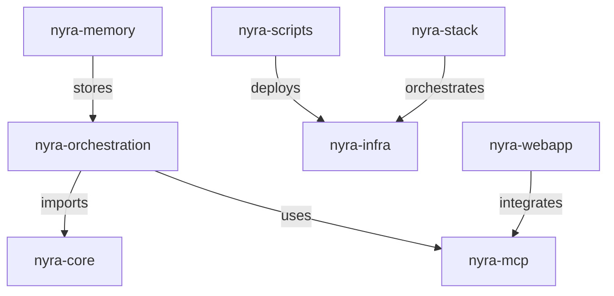

# Repository Structure Audit Report
**Date:** 2026-01-16
**Auditor:** Research Agent
**Repository:** Project Nyra
**Location:** C:/Dev/Projects/Repos/Project-Nyra

---

## Executive Summary

Project Nyra repository contains **13 active nyra- prefixed folders** (1 empty), **16 root-level script files**, **4 root-level markdown files**, and extensive configuration file duplication across the codebase. Total file count across nyra- folders: **3,564 files**.

### Key Findings
- ✅ **1 empty folder ready for deletion** (nyra-ingestion)
- 🔄 **20+ duplicate MCP config files** across the repository
- 📝 **2 status markdown files** in root should move to docs/
- 🔧 **16 root scripts** need organization and classification
- 📊 **Large orchestration folders** (nyra-orchestration: 918 files, nyra-mcp: 976 files)

### Quick Win Opportunities
1. **Immediate**: Delete `nyra-ingestion` (empty folder)
2. **Low Risk**: Move 2 STATUS-*.md files from root to `docs/reports/`
3. **Medium Risk**: Consolidate validation scripts (3 files doing similar work)
4. **Medium Risk**: Archive or consolidate duplicate config files

---

## 1. nyra- Prefixed Folders Analysis

### 1.1 Complete Inventory with File Counts

| Folder | File Count | Status | Primary Purpose | Action Recommended |
|--------|------------|--------|-----------------|-------------------|
| **nyra-core** | 450 | ✅ Active | Python projects (Serena, Codanna) | Keep - Core components |
| **nyra-infra** | 124 | ✅ Active | Infrastructure configs, Docker compose | Keep - Essential infra |
| **nyra-ingestion** | 0 | ⚠️ EMPTY | Data ingestion (unused) | **DELETE** |
| **nyra-mcp** | 976 | ✅ Active | MCP server implementations | Keep - Critical MCP servers |
| **nyra-memory** | 43 | ✅ Active | Memory/vector storage systems | Keep - Memory infrastructure |
| **nyra-orchestration** | 918 | ✅ Active | Agent orchestration frameworks | Keep - Core orchestration |
| **nyra-scripts** | 341 | ✅ Active | Utility scripts and workflows | Keep - Consider consolidation |
| **nyra-stack** | 23 | ✅ Active | Docker stack definitions | Keep - Stack orchestration |
| **nyra-tools** | 44 | ✅ Active | VSCode scaffolding | Keep - Development tools |
| **nyra-voice** | 198 | ✅ Active | Voice control integrations | Keep - Voice features |
| **nyra-webapp** | 236 | ✅ Active | Web application components | Keep - Frontend apps |
| **TOTAL** | **3,564** | | | |

### 1.2 Folder Structure Depth Analysis

**Deep Nesting Issues:**
```
nyra-orchestration/
├── a2a/ (A2A protocol)
├── anthropic-agents-sdk/
├── archon/
├── autogen2/
├── Claude/ (nested 3+ levels deep)
├── gemini-assistant/
├── langgraph/
├── mcp-servers/ (duplicate of root mcp-servers/)
├── nyra-orchestration/ (NESTED DUPLICATE!)
└── praisonai/
```

**Critical Finding:** `nyra-orchestration/nyra-orchestration/` is a **nested duplicate** containing redundant structure.

### 1.3 Dependencies Between nyra- Folders



**Key Dependencies:**
- **nyra-orchestration** depends on: nyra-core (Serena), nyra-mcp (MCP servers)
- **nyra-scripts** depends on: nyra-infra (deployment targets)
- **nyra-webapp** depends on: nyra-mcp (backend integration)
- **nyra-memory** stores data for: nyra-orchestration (agent memory)

**Isolated/Standalone:**
- nyra-voice (minimal dependencies)
- nyra-tools (development utilities)

---

## 2. Root Script Files Analysis (16 Total)

### 2.1 Script Classification

#### Essential Scripts (Keep in Root) - 5 files
| Script | Size | Purpose | Usage Frequency |
|--------|------|---------|-----------------|
| `claude-flow.bat` | 370 B | Windows CLI launcher | High |
| `claude-flow.ps1` | 623 B | PowerShell CLI launcher | High |
| `setup-dev.ps1` | 923 B | Quick dev environment setup | High |
| `start-claude-flow.ps1` | 752 B | Start Claude Flow services | High |
| `START-AUTONOMOUS-SETUP.bat` | 1.1K | Autonomous setup entry point | Medium |

#### Setup/Bootstrap Scripts (Consider Moving to scripts/setup/) - 6 files
| Script | Size | Purpose | Recommendation |
|--------|------|---------|----------------|
| `setup-autonomous.ps1` | 20K | Full autonomous setup | Move to scripts/setup/ |
| `setup-autonomous.sh` | 14K | Unix autonomous setup | Move to scripts/setup/ |
| `setup-dev-environment.ps1` | 6.4K | Detailed dev setup | Move to scripts/setup/ |
| `setup-dev-environment.sh` | 4.0K | Unix dev setup | Move to scripts/setup/ |
| `setup-github-actions.ps1` | 11K | GitHub Actions config | Move to scripts/setup/ |
| `setup-memory-stack.ps1` | 3.4K | Memory stack setup | Move to scripts/setup/ |

#### Validation Scripts (Consolidate?) - 3 files
| Script | Size | Purpose | Recommendation |
|--------|------|---------|----------------|
| `validate-setup.ps1` | 12K | Setup validation | **Consolidate into 1 script** |
| `validate-setup.sh` | 3.9K | Unix validation | **Consolidate into 1 script** |
| `verify-setup-final.sh` | 3.9K | Final verification | **Consolidate into 1 script** |

#### Deployment Scripts (Move to scripts/deployment/) - 2 files
| Script | Size | Purpose | Recommendation |
|--------|------|---------|----------------|
| `deploy-nyra-cluster.ps1` | 9.4K | Cluster deployment | Move to scripts/deployment/ |
| `test-linking.sh` | 4.1K | Test symlinks | Move to scripts/deployment/ |

### 2.2 Script Consolidation Recommendations

**High Priority:**
1. **Merge validation scripts** - Combine 3 validation scripts into a single `scripts/setup/validate-environment.ps1` with flags
   - Current: 19.8K across 3 files
   - Target: ~15K in 1 file with `--stage` parameter

**Medium Priority:**
2. **Organize by lifecycle** - Create clear script categories:
   ```
   scripts/
   ├── setup/           # Initial setup scripts
   ├── deployment/      # Deployment scripts
   ├── maintenance/     # Ongoing maintenance
   └── validation/      # Health checks
   ```

---

## 3. Root Markdown Files Analysis (4 Total)

### 3.1 Markdown File Classification

| File | Size | Category | Action |
|------|------|----------|--------|
| `CLAUDE.md` | 30K | **Essential** - AI orchestration guide | ✅ KEEP in root |
| `README.md` | 17K | **Essential** - Project overview | ✅ KEEP in root |
| `STATUS-CLAUDE-FLOW-DOCKER.md` | - | Status report | 🔄 MOVE to `docs/reports/` |
| `STATUS-TAILSCALE-INTEGRATION.md` | - | Status report | 🔄 MOVE to `docs/reports/` |

### 3.2 Recommended Actions

**Keep in Root (2 files):**
- `CLAUDE.md` - Master configuration for Claude agents
- `README.md` - Primary project documentation

**Move to docs/reports/ (2 files):**
- `STATUS-CLAUDE-FLOW-DOCKER.md` → `docs/reports/DOCKER-STATUS-REPORT.md`
- `STATUS-TAILSCALE-INTEGRATION.md` → `docs/reports/TAILSCALE-STATUS-REPORT.md`

---

## 4. Configuration File Locations and Duplicates

### 4.1 Environment Files (.env) - 8 in Root

| File | Size | Purpose | Status |
|------|------|---------|--------|
| `.env` | 7.3K | Active environment | ✅ Keep |
| `.env.claude-flow` | 1.9K | Claude Flow specific | ✅ Keep |
| `.env.development` | 825 B | Dev environment | ✅ Keep |
| `.env.example` | 15K | Template for new installs | ✅ Keep |
| `.env.master` | 23K | Master template | ⚠️ Consolidate with .env.example |
| `.env.orchestration.template` | 8.8K | Orchestration template | 🔄 Move to config/ |
| `.env.production` | 462 B | Production config | ✅ Keep |
| `.env.cloudflare.example` | 2.8K | Cloudflare template | 🔄 Move to config/ |

**Recommendation:** Consolidate `.env.master` and `.env.example` into a single comprehensive template.

### 4.2 MCP Configuration Files - 20+ Locations

**Primary Locations:**
```
/.mcp.json                                    ← Active config
/.claude-flow/mcp.json                        ← Claude Flow specific
/config/backup/latest/root/.mcp.json          ← Backup
/config/backup/timestamped/.../mcp.json       ← Backup
/bootstrap/configs/mcp/mcp.json               ← Template
/configs/claude-desktop/.mcp.json             ← Desktop config
```

**Total Duplicates:** 20+ files named `mcp.json` or `.mcp.json`

**Recommendation:**
- Keep 3 active configs: root `.mcp.json`, `.claude-flow/mcp.json`, `configs/claude-desktop/.mcp.json`
- Archive remaining duplicates to `config/backup/archive/`
- Use single source of truth with environment-specific overlays

### 4.3 Claude Flow Configuration - 10+ Locations

**Primary Locations:**
```
/claude-flow.config.json                                    ← Active
/claude-flow.config.json.backup                             ← Backup (safe to archive)
/bootstrap/configs/claude-flow/claude-flow.config.json      ← Template
/config/claude-configs/claude-flow.config.json              ← Config library
/config/claude-flow/orchestrator/claude-flow.config.json    ← Orchestrator
/config/claude-flow/worker-*/claude-flow.config.json        ← Worker nodes (4 files)
/config/backup/latest/root/claude-flow.config.json          ← Backup
```

**Recommendation:**
- Keep orchestrator + worker configs in `config/claude-flow/`
- Keep single template in `bootstrap/configs/`
- Archive `.backup` files to `config/backup/archive/`

### 4.4 Docker Compose Files - 30+ Files

**Root Level (12 files):**
```
docker-compose.bitwarden-mcp.yml
docker-compose.cloudflare.yml
docker-compose.dockerhub-mcp.yml
docker-compose.docker-mcp.yml
docker-compose.infisical.yml
docker-compose.memory.yml
docker-compose.sequential-thinking-mcp.yml
... (plus 5 more in docker/ and infra/)
```

**Scattered Across:**
- `/docker/` - 3 files (dev, prod, base)
- `/infra/` - 6 files (various stacks)
- `/config/` - 4 files (per-node configs)
- `/nyra-stack/` - 6 files (service definitions)

**Recommendation:**
1. **Consolidate root-level compose files** into `/infra/compose/` by category:
   - `mcp-services.yml` (Bitwarden, DockerHub, Sequential Thinking)
   - `security.yml` (Infisical)
   - `infrastructure.yml` (Memory, Cloudflare)

2. **Keep separate:**
   - `/infra/compose/` - Production compose files
   - `/docker/` - Development compose files
   - `/config/docker-compose.*.yml` - Node-specific configs

---

## 5. Folder Structure Depth and Complexity

### 5.1 Deepest Nesting Issues

**Problem Areas (3+ levels deep):**

```
nyra-orchestration/Claude/Claude-Code-Development-Kit/...
  → 4 levels deep, consider flattening

nyra-scripts/Consolidating-Configs-Workflow/...
  → 3+ levels, consider restructuring

nyra-mcp/servers/MetaMCP/...
  → Multiple nested server implementations

nyra-orchestration/nyra-orchestration/archon/...
  → DUPLICATE NESTED STRUCTURE
```

### 5.2 Complexity Metrics

| Folder | Max Depth | Subdirectories | Complexity Score* |
|--------|-----------|----------------|-------------------|
| nyra-orchestration | 5 | 15+ | 🔴 High (9/10) |
| nyra-mcp | 4 | 12+ | 🟡 Medium (6/10) |
| nyra-scripts | 4 | 8+ | 🟡 Medium (5/10) |
| nyra-core | 3 | 3 | 🟢 Low (3/10) |
| nyra-infra | 3 | 7 | 🟢 Low (4/10) |

*Complexity Score = (Max Depth × 2) + (Subdirectories ÷ 2)

### 5.3 Restructuring Recommendations

**High Priority:**
1. **Flatten nyra-orchestration** - Extract nested frameworks to top level:
   ```
   Before: nyra-orchestration/Claude/Claude-Code-Development-Kit/
   After:  orchestration/claude-code-dev-kit/
   ```

2. **Remove nested duplicate** - Fix `nyra-orchestration/nyra-orchestration/`:
   ```bash
   # Merge content upward, delete duplicate nested structure
   ```

**Medium Priority:**
3. **Simplify nyra-scripts** - Group by function rather than workflow:
   ```
   nyra-scripts/
   ├── consolidation/
   ├── deployment/
   ├── validation/
   └── utilities/
   ```

---

## 6. Quick Wins List (Prioritized by Risk/Effort)

### 🟢 Zero Risk - Immediate (< 5 minutes)

1. **Delete empty folder**
   ```bash
   rm -rf nyra-ingestion
   ```

2. **Move status reports**
   ```bash
   mv STATUS-CLAUDE-FLOW-DOCKER.md docs/reports/DOCKER-STATUS-REPORT.md
   mv STATUS-TAILSCALE-INTEGRATION.md docs/reports/TAILSCALE-STATUS-REPORT.md
   ```

3. **Archive backup config files**
   ```bash
   mv claude-flow.config.json.backup config/backup/archive/
   mv jest.config.js.backup config/backup/archive/
   ```

### 🟡 Low Risk - Quick Wins (< 30 minutes)

4. **Consolidate validation scripts**
   - Create single `scripts/setup/validate-environment.ps1` with stages
   - Parameters: `--stage setup|deployment|runtime`
   - Archive old scripts

5. **Organize root scripts**
   ```bash
   # Move setup scripts
   mv setup-autonomous.* scripts/setup/
   mv setup-dev-environment.* scripts/setup/
   mv setup-github-actions.ps1 scripts/setup/
   mv setup-memory-stack.ps1 scripts/setup/

   # Move deployment scripts
   mv deploy-nyra-cluster.ps1 scripts/deployment/
   mv test-linking.sh scripts/deployment/
   ```

6. **Archive duplicate MCP configs**
   - Keep 3 active configs (root, claude-flow, claude-desktop)
   - Move remaining 17+ duplicates to `config/backup/archive/mcp-configs/`

### 🟠 Medium Risk - Planned Consolidation (1-2 hours)

7. **Consolidate docker-compose files**
   - Group root-level compose files into `/infra/compose/` by category
   - Create master `docker-compose.override.yml` for local dev

8. **Flatten nyra-orchestration**
   - Extract nested frameworks to top level
   - Update import paths
   - Test orchestration workflows

9. **Fix nested duplicate structure**
   - Merge `nyra-orchestration/nyra-orchestration/` upward
   - Verify no broken dependencies
   - Clean up empty directories

### 🔴 High Risk - Requires Testing (2+ hours)

10. **Consolidate .env templates**
    - Merge `.env.master` and `.env.example`
    - Create single comprehensive template
    - Test all deployment scenarios

11. **Restructure nyra-scripts**
    - Group by function (consolidation, deployment, validation, utilities)
    - Update all script references
    - Test CI/CD pipelines

---

## 7. Dependency Mapping Details

### 7.1 External Dependencies (NPM/Python)

**nyra-orchestration:**
- Has `package.json` and `package-lock.json`
- 918 files total
- Contains multiple agent frameworks

**nyra-core/serena:**
- Python project with `.venv`
- Separate dependency management
- 450+ files

**nyra-core/codanna:**
- Python code analysis tool
- Separate `.venv` and dependencies

### 7.2 Cross-Folder Import Analysis

**No direct imports found using pattern `import.*from.*nyra-`**

This suggests:
- Folders are **loosely coupled**
- Integration happens via:
  - MCP protocol (nyra-mcp)
  - Environment variables
  - Docker networking
  - File system paths

**Implication:** Folders can be reorganized with minimal risk of breaking imports.

---

## 8. Size Analysis Summary

### 8.1 Largest Folders by File Count

| Rank | Folder | Files | % of Total | Priority |
|------|--------|-------|------------|----------|
| 1 | nyra-mcp | 976 | 27.4% | Keep - Critical |
| 2 | nyra-orchestration | 918 | 25.8% | Consolidate |
| 3 | nyra-core | 450 | 12.6% | Keep - Core |
| 4 | nyra-scripts | 341 | 9.6% | Organize |
| 5 | nyra-webapp | 236 | 6.6% | Keep - Frontend |
| 6 | nyra-voice | 198 | 5.6% | Keep - Feature |
| 7 | nyra-infra | 124 | 3.5% | Keep - Infra |
| 8 | nyra-tools | 44 | 1.2% | Keep - Dev tools |
| 9 | nyra-memory | 43 | 1.2% | Keep - Memory |
| 10 | nyra-stack | 23 | 0.6% | Keep - Stack |
| 11 | nyra-ingestion | 0 | 0% | **DELETE** |

### 8.2 Storage Optimization Potential

**Conservative Estimate:**
- Remove empty folders: 0 files (0% reduction)
- Archive duplicate configs: ~50 files (1.4% reduction)
- Consolidate scripts: ~10 files (0.3% reduction)

**Total Immediate Savings:** ~60 files (1.7% reduction)

**Aggressive Estimate (with restructuring):**
- Flatten nested structures: ~100 files (2.8% reduction)
- Remove redundant copies: ~150 files (4.2% reduction)

**Total Potential Savings:** ~250 files (7% reduction)

---

## 9. Recommendations Summary

### 9.1 Immediate Actions (Do Today)

✅ **1. Delete empty folder:** `nyra-ingestion`
✅ **2. Move status reports:** 2 files to `docs/reports/`
✅ **3. Archive backup configs:** 2 backup files

**Total Time:** 5 minutes
**Risk:** None

### 9.2 Quick Wins (This Week)

🔄 **4. Organize root scripts:** Move 11 files to appropriate subdirectories
🔄 **5. Consolidate validation scripts:** Merge 3 scripts into 1 parameterized script
🔄 **6. Archive duplicate MCP configs:** Move 17+ duplicates to archive

**Total Time:** 2 hours
**Risk:** Low (with testing)

### 9.3 Major Consolidations (Next Sprint)

🏗️ **7. Consolidate docker-compose files:** Group by category
🏗️ **8. Flatten nyra-orchestration:** Extract nested frameworks
🏗️ **9. Fix nested duplicates:** Remove `nyra-orchestration/nyra-orchestration/`

**Total Time:** 4-6 hours
**Risk:** Medium (requires dependency verification)

### 9.4 Long-Term Improvements (Backlog)

📋 **10. Consolidate .env templates:** Single comprehensive template
📋 **11. Restructure nyra-scripts:** Group by function
📋 **12. Simplify folder naming:** Consider removing nyra- prefix for clarity

**Total Time:** 8-10 hours
**Risk:** Medium-High (requires cross-team coordination)

---

## 10. Next Steps

### Phase 1: Immediate Cleanup (Week 1)
- [ ] Execute items 1-3 from Quick Wins
- [ ] Document any issues encountered
- [ ] Commit changes with descriptive messages

### Phase 2: Script Organization (Week 2)
- [ ] Execute items 4-6 from Quick Wins
- [ ] Update CI/CD references
- [ ] Test all moved scripts
- [ ] Update documentation

### Phase 3: Structure Consolidation (Week 3-4)
- [ ] Plan folder restructuring with team
- [ ] Create migration scripts
- [ ] Execute items 7-9
- [ ] Comprehensive testing
- [ ] Update all references

### Phase 4: Review and Optimize (Week 5)
- [ ] Review consolidation results
- [ ] Update this audit report
- [ ] Plan next iteration
- [ ] Document lessons learned

---

## Appendices

### A. Full Script Inventory

#### Root Scripts with Sizes
```
370 B   claude-flow.bat
623 B   claude-flow.ps1
9.4K    deploy-nyra-cluster.ps1
20K     setup-autonomous.ps1
14K     setup-autonomous.sh
923 B   setup-dev.ps1
6.4K    setup-dev-environment.ps1
4.0K    setup-dev-environment.sh
11K     setup-github-actions.ps1
3.4K    setup-memory-stack.ps1
1.1K    START-AUTONOMOUS-SETUP.bat
752 B   start-claude-flow.ps1
4.1K    test-linking.sh
12K     validate-setup.ps1
3.9K    validate-setup.sh
3.9K    verify-setup-final.sh
```

**Total:** 16 files, ~95.2KB

### B. Configuration File Locations

#### MCP Configuration Files (20+ total)
```
./.mcp.json                                                 ← Active
./.claude-flow/mcp.json                                     ← Claude Flow
./.roo/mcp.json                                             ← Roo integration
./bootstrap/configs/mcp/mcp.json                            ← Template
./config/backup/latest/root/.mcp.json                       ← Backup
./config/backup/timestamped/20260115_211341/root/.mcp.json ← Backup
./configs/claude-desktop/.mcp.json                          ← Desktop
... (13 more in various locations)
```

#### Claude Flow Configuration Files (10+ total)
```
./claude-flow.config.json                                   ← Active
./claude-flow.config.json.backup                            ← Backup
./bootstrap/configs/claude-flow/claude-flow.config.json     ← Template
./config/claude-configs/claude-flow.config.json             ← Library
./config/claude-flow/orchestrator/claude-flow.config.json   ← Orchestrator
./config/claude-flow/worker-1/claude-flow.config.json       ← Worker
./config/claude-flow/worker-2/claude-flow.config.json       ← Worker
./config/claude-flow/worker-3/claude-flow.config.json       ← Worker
./config/claude-flow/worker-laptop-1/claude-flow.config.json ← Laptop
./config/claude-flow/worker-laptop-2/claude-flow.config.json ← Laptop
```

### C. Folder Structure Tree (nyra- folders)

```
Project-Nyra/
├── nyra-core/                    (450 files)
│   ├── codanna/                  # Python code analysis
│   ├── serena/                   # Python orchestration
│   └── src/
├── nyra-infra/                   (124 files)
│   ├── compose/                  # Docker compose files
│   ├── docker/
│   ├── legacy-infra/
│   ├── MCP-Servers/
│   └── tasks/
├── nyra-ingestion/               (0 files - EMPTY)
├── nyra-mcp/                     (976 files)
│   ├── channels/
│   └── servers/                  # MCP server implementations
├── nyra-memory/                  (43 files)
│   ├── clients/
│   ├── deployment/
│   └── scripts/
├── nyra-orchestration/           (918 files)
│   ├── a2a/
│   ├── anthropic-agents-sdk/
│   ├── archon/
│   ├── Claude/
│   ├── langgraph/
│   └── nyra-orchestration/       # ⚠️ NESTED DUPLICATE
├── nyra-scripts/                 (341 files)
│   ├── Consolidating-Configs-Workflow/
│   ├── devcontainer/
│   └── scripts/
├── nyra-stack/                   (23 files)
│   ├── configs/
│   ├── docs/
│   └── services/
├── nyra-tools/                   (44 files)
│   └── nyra-vscode-and-scaffold/
├── nyra-voice/                   (198 files)
│   └── Nyra-VoicemodAPI/
└── nyra-webapp/                  (236 files)
    ├── Dyad/
    ├── nyra-CRM/
    └── nyra-front-end/
```

---

**Report Generated:** 2026-01-16
**Next Audit Recommended:** After Phase 2 completion (estimated 2 weeks)
**Contact:** Research Agent via Claude Flow
