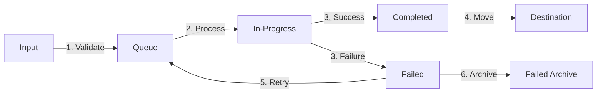

# Apps/ Folder Architecture Design

## Architecture Decision Record (ADR)

**Status:** Proposed
**Date:** 2026-01-18
**Decision Maker:** System Architecture Team
**Version:** 1.0.0

---

## Executive Summary

This document defines the canonical folder structure for Project-Nyra's `apps/` directory, establishing clear separation of concerns, naming conventions, and integration patterns for all application components.

---

## Table of Contents

1. [Context and Problem Statement](#context-and-problem-statement)
2. [Design Principles](#design-principles)
3. [Canonical Folder Structure](#canonical-folder-structure)
4. [Naming Conventions](#naming-conventions)
5. [Application Categories](#application-categories)
6. [Integration Approach](#integration-approach)
7. [Ingestion Folder Specification](#ingestion-folder-specification)
8. [Build System Integration](#build-system-integration)
9. [Migration Strategy](#migration-strategy)
10. [Decision Rationale](#decision-rationale)

---

## Context and Problem Statement

### Current State

- 14 applications in `apps/` with inconsistent organization
- Mix of frontend apps, assets, docs, and data files
- No clear separation between production apps and utilities
- Unclear relationship between apps and services

### Requirements

1. Clear separation of concerns (frontend/backend/shared)
2. Scalable structure for future applications
3. Support for monorepo tooling (Turborepo, pnpm workspaces)
4. Integration with existing services layer
5. Ingestion area for processing historical/external content
6. Clear naming conventions and documentation

---

## Design Principles

### 1. Separation of Concerns

**Principle:** Each app has a single, well-defined purpose

**Application:**

- Frontend apps in `apps/web/`
- Backend apps/APIs in `apps/api/`
- CLI tools in `apps/cli/`
- Desktop apps in `apps/desktop/`
- Utilities in `apps/utilities/`

### 2. Domain-Driven Organization

**Principle:** Organize by business domain, not technical layer

**Application:**

- Mortgage domain: mortgage-assistant, ratehunter
- Admin domain: nexus-dashboard, nyra-admin
- Marketing domain: landing pages, marketing sites

### 3. Discoverability

**Principle:** Structure should be self-documenting

**Application:**

- Clear folder names that describe purpose
- README.md in every app directory
- CLAUDE.md for AI agent integration

### 4. Scalability

**Principle:** Support growth without restructuring

**Application:**

- Flat structure within categories (avoid deep nesting)
- Category-based organization allows adding new apps easily
- Shared code in `packages/` not `apps/`

### 5. Build System Integration

**Principle:** Work seamlessly with Turborepo and pnpm

**Application:**

- Each app is a workspace package
- Clear dependency declarations
- Consistent build scripts across apps

---

## Canonical Folder Structure

```
apps/
├── web/                          # Frontend Web Applications
│   ├── mortgage-assistant/       # Main loan officer dashboard (Port: 3000)
│   │   ├── src/
│   │   │   ├── app/             # Next.js 14 App Router
│   │   │   ├── components/      # React components
│   │   │   ├── lib/             # Utilities and helpers
│   │   │   └── styles/          # Global styles
│   │   ├── public/              # Static assets
│   │   ├── package.json
│   │   ├── tsconfig.json
│   │   ├── next.config.js
│   │   ├── tailwind.config.js
│   │   ├── README.md
│   │   └── CLAUDE.md
│   │
│   ├── ratehunter/              # Rate comparison tool (Port: 3009)
│   ├── nexus-dashboard/         # System monitoring (Port: 3002)
│   ├── nyra-admin/              # Admin panel (Port: 3003)
│   ├── crm/                     # CRM application
│   ├── crm-dashboard/           # CRM analytics dashboard
│   ├── webapp/                  # General web application
│   └── README.md
│
├── landing/                      # Marketing & Landing Pages
│   ├── ratehunter-landing/      # RateHunter marketing site (Port: 3001)
│   ├── main-landing/            # Main Nyra landing page
│   └── README.md
│
├── desktop/                      # Desktop Applications
│   ├── installer/               # Bootstrap GUI installer
│   └── README.md
│
├── cli/                          # Command-Line Interface Tools
│   ├── nyra-cli/                # Main CLI tool
│   ├── deployment-cli/          # Deployment scripts
│   └── README.md
│
├── mobile/                       # Mobile Applications (Future)
│   ├── ios/                     # iOS application
│   ├── android/                 # Android application
│   └── README.md
│
├── utilities/                    # Development & Internal Tools
│   ├── shadcn-tweakcn/          # Component development tool
│   ├── design-system/           # Design system documentation
│   └── README.md
│
├── ingestion/                    # Content Processing & Migration
│   ├── historical/              # Historical data from archive
│   │   ├── configs/             # Old configuration files
│   │   ├── docs/                # Historical documentation
│   │   ├── backups/             # Old backup files
│   │   └── metadata.json        # Ingestion metadata
│   │
│   ├── external/                # External content sources
│   │   ├── uploads/             # User uploads to process
│   │   ├── imports/             # Data imports
│   │   └── metadata.json
│   │
│   ├── processing/              # Active processing area
│   │   ├── queue/               # Files queued for processing
│   │   ├── in-progress/         # Currently processing
│   │   ├── completed/           # Successfully processed
│   │   └── failed/              # Failed processing attempts
│   │
│   ├── scripts/                 # Processing scripts
│   │   ├── migrate-configs.js   # Configuration migration
│   │   ├── process-docs.js      # Document processing
│   │   └── validate.js          # Validation scripts
│   │
│   ├── README.md                # Ingestion documentation
│   ├── PROCESSING.md            # Processing workflow guide
│   └── .gitignore               # Ignore processed files
│
├── shared/                       # Shared Application Resources
│   ├── assets/                  # Shared static assets
│   │   ├── images/
│   │   ├── icons/
│   │   ├── fonts/
│   │   └── videos/
│   │
│   ├── data/                    # Shared static data
│   │   ├── seed-data/           # Database seed data
│   │   ├── fixtures/            # Test fixtures
│   │   └── schemas/             # JSON schemas
│   │
│   ├── docs/                    # Application documentation
│   │   ├── guides/              # User guides
│   │   ├── screenshots/         # Application screenshots
│   │   └── demos/               # Demo videos/content
│   │
│   └── README.md
│
├── .templates/                   # App Templates (Hidden)
│   ├── nextjs-app/              # Next.js app template
│   ├── cli-app/                 # CLI app template
│   └── README.md
│
├── package.json                  # Workspace root package
└── README.md                     # Apps directory overview
```

---

## Naming Conventions

### Directory Names

**Format:** `kebab-case` (all lowercase, hyphen-separated)

**Examples:**

- ✅ `mortgage-assistant`
- ✅ `ratehunter-landing`
- ✅ `nexus-dashboard`
- ❌ `MortgageAssistant`
- ❌ `rateHunter_Landing`

**Rationale:** Consistent with URL routing, npm package naming, and cross-platform compatibility

### Package Names

**Format:** `@nyra/app-{name}` or `@nyra/{category}-{name}`

**Examples:**

```json
{
  "name": "@nyra/mortgage-assistant",
  "name": "@nyra/web-nexus-dashboard",
  "name": "@nyra/cli-deployment"
}
```

**Rationale:** Scoped packages prevent naming conflicts and provide clear ownership

### File Names

**Components:** PascalCase

```
Button.tsx
ApplicationCard.tsx
```

**Utilities:** camelCase

```
formatCurrency.ts
validateEmail.ts
```

**Config Files:** kebab-case or standard names

```
next.config.js
tsconfig.json
tailwind.config.js
```

---

## Application Categories

### 1. Web Applications (`apps/web/`)

**Purpose:** User-facing web applications built with React/Next.js

**Characteristics:**

- Port allocation: 3000-3099
- Built with Next.js 14+
- TypeScript required
- Tailwind CSS for styling
- Responsive design (mobile-first)

**Standard Structure:**

```
{app-name}/
├── src/
│   ├── app/              # Next.js App Router
│   ├── components/       # React components
│   ├── lib/              # Utilities
│   └── styles/           # Styles
├── public/               # Static assets
├── tests/                # Test files
├── package.json
├── tsconfig.json
├── next.config.js
├── README.md
└── CLAUDE.md
```

**Current Apps:**

- `mortgage-assistant` - Main loan officer dashboard
- `ratehunter` - Rate comparison tool
- `nexus-dashboard` - System monitoring
- `nyra-admin` - Admin panel
- `crm` - CRM application
- `crm-dashboard` - CRM analytics
- `webapp` - General web app

### 2. Landing Pages (`apps/ratehunter/`)

**Purpose:** Marketing and promotional websites

**Characteristics:**

- Port allocation: 3100-3199
- SEO optimized
- Fast page loads (<2s)
- Analytics integration
- Lead capture forms

**Standard Structure:**

```
{landing-name}/
├── src/
│   ├── app/
│   ├── components/
│   └── lib/
├── public/
├── package.json
└── README.md
```

**Current Apps:**

- `ratehunter-landing` - RateHunter marketing site
- `main-landing` - Main Nyra landing page (future)

### 3. Desktop Applications (`apps/desktop/`)

**Purpose:** Electron-based desktop applications

**Characteristics:**

- Cross-platform (Windows, macOS, Linux)
- Native OS integration
- Offline capability
- Auto-update support

**Standard Structure:**

```
{desktop-app}/
├── src/
│   ├── main/             # Electron main process
│   ├── renderer/         # React renderer
│   └── preload/          # Preload scripts
├── assets/
├── build/                # Build resources
├── package.json
└── README.md
```

**Current Apps:**

- `installer` - Bootstrap GUI installer (from bootstrap/)

### 4. CLI Tools (`apps/cli/`)

**Purpose:** Command-line interface applications

**Characteristics:**

- Node.js based
- Commander.js or similar
- Rich terminal UI (Ink/blessed)
- Cross-platform

**Standard Structure:**

```
{cli-name}/
├── src/
│   ├── commands/         # CLI commands
│   ├── lib/              # Utilities
│   └── index.ts          # Entry point
├── bin/                  # Executable scripts
├── package.json
└── README.md
```

**Future Apps:**

- `nyra-cli` - Main CLI tool
- `deployment-cli` - Deployment automation

### 5. Mobile Applications (`apps/mobile/`)

**Purpose:** Native mobile applications (future)

**Characteristics:**

- React Native or native
- iOS and Android
- Offline-first
- Push notifications

**Standard Structure:**

```
ios/
├── src/
├── ios/                  # Xcode project
└── package.json

android/
├── src/
├── android/              # Android Studio project
└── package.json
```

### 6. Utilities (`apps/utilities/`)

**Purpose:** Internal development tools

**Characteristics:**

- Development-only
- Not deployed to production
- Support other apps
- May be monorepo-specific

**Current Apps:**

- `shadcn-tweakcn` - Component development tool
- `design-system` - Design system docs (future)

### 7. Ingestion (`apps/ingestion/`)

**Purpose:** Content processing and migration

**Characteristics:**

- Temporary staging area
- Processing workflows
- Historical data migration
- External content imports

**See:** [Ingestion Folder Specification](#ingestion-folder-specification)

### 8. Shared (`apps/shared/`)

**Purpose:** Resources shared across multiple apps

**Characteristics:**

- Not a runnable application
- Assets, data, documentation
- Imported by other apps
- Version controlled

**Contents:**

- `assets/` - Images, icons, fonts, videos
- `data/` - Seed data, fixtures, schemas
- `docs/` - Guides, screenshots, demos

---

## Ingestion Folder Specification

### Purpose

The `apps/ingestion/` folder serves as a **temporary staging area** for:

1. **Historical Content Migration**
   - Archived configurations from `_archive/ingestion-historical-2026-01-18/`
   - Old documentation and guides
   - Legacy backup files
   - Migrating to new structure

2. **External Content Processing**
   - User uploads (documents, images, data)
   - Third-party data imports
   - Bulk content ingestion
   - API data imports

3. **Processing Workflows**
   - Validation and sanitization
   - Format conversion
   - Content extraction
   - Metadata generation

### Organization

```
apps/ingestion/
├── historical/              # Historical data from archive
│   ├── configs/             # Old configuration files
│   │   ├── v1/
│   │   ├── v2/
│   │   └── legacy/
│   ├── docs/                # Historical documentation
│   ├── backups/             # Old backup files
│   └── metadata.json        # Tracking what's been processed
│
├── external/                # External content sources
│   ├── uploads/             # User uploads to process
│   ├── imports/             # Data imports
│   ├── api-data/            # API imported data
│   └── metadata.json
│
├── processing/              # Active processing area
│   ├── queue/               # Files queued for processing
│   ├── in-progress/         # Currently processing
│   ├── completed/           # Successfully processed
│   ├── failed/              # Failed processing attempts
│   └── logs/                # Processing logs
│
├── scripts/                 # Processing scripts
│   ├── migrate-configs.js   # Configuration migration
│   ├── process-docs.js      # Document processing
│   ├── validate.js          # Validation scripts
│   ├── transform.js         # Data transformation
│   └── index.js             # Main processing orchestrator
│
├── schemas/                 # Validation schemas
│   ├── config.schema.json
│   ├── document.schema.json
│   └── metadata.schema.json
│
├── outputs/                 # Processed outputs (temporary)
│   ├── configs/             # Migrated configs
│   ├── docs/                # Processed docs
│   └── data/                # Transformed data
│
├── README.md                # Ingestion documentation
├── PROCESSING.md            # Processing workflow guide
├── package.json             # Processing dependencies
└── .gitignore               # Ignore large/temp files
```

### Processing Workflow



**Workflow Steps:**

1. **Intake**
   - Content arrives in `historical/` or `external/`
   - Metadata file created/updated
   - Validation against schemas

2. **Queue**
   - Move validated content to `processing/queue/`
   - Assign processing priority
   - Create processing record

3. **Process**
   - Move to `processing/in-progress/`
   - Run transformation scripts
   - Generate output
   - Log all operations

4. **Complete**
   - On success: Move to `processing/completed/`
   - On failure: Move to `processing/failed/` with logs
   - Update metadata

5. **Distribute**
   - Move completed outputs to destination
     - Configs → `configs/`
     - Docs → `docs/`
     - Data → `data/` or database
   - Remove from ingestion folder
   - Archive if needed

### Retention Policy

**Temporary Files:**

- `queue/`: 7 days
- `in-progress/`: 24 hours (auto-cleanup if stale)
- `completed/`: 30 days (then archive or delete)
- `failed/`: 90 days (review and retry)

**Permanent Archival:**

- Successfully processed items can be archived
- Failed items reviewed quarterly
- Large files compressed before archival

### Processing Scripts

**migrate-configs.js**

```javascript
// Migrate old configuration files to new format
// Validate against schema
// Update references
// Store in appropriate location
```

**process-docs.js**

```javascript
// Convert documentation formats
// Update internal links
// Extract metadata
// Generate table of contents
```

**validate.js**

```javascript
// Validate against JSON schemas
// Check file integrity
// Verify required fields
// Report validation errors
```

### Access Control

**Gitignore Strategy:**

```gitignore
# apps/ingestion/.gitignore

# Ignore all content by default
/*

# Allow structure and configs
!/README.md
!/PROCESSING.md
!/package.json
!/scripts/
!/schemas/
!/.gitkeep

# Allow tracking of metadata
!/**/metadata.json

# Never commit these
processing/in-progress/*
processing/queue/*
outputs/*
```

**Rationale:**

- Ingestion content is temporary
- Don't bloat git repository
- Track structure and processing logic
- Metadata helps with recovery

---

## Integration Approach

### 1. App-to-App Communication

**Pattern:** API Gateway + Event Bus

```
┌─────────────┐      ┌─────────────┐      ┌─────────────┐
│  Web App    │─────▶│ API Gateway │─────▶│  Service    │
└─────────────┘      └─────────────┘      └─────────────┘
       │                    │                     │
       │              ┌─────▼─────┐              │
       └──────────────│Event Bus  │◀─────────────┘
                      └───────────┘
```

**Implementation:**

- Apps call backend via REST/GraphQL APIs
- Services publish events to message bus
- Apps subscribe to relevant events
- No direct app-to-app calls

### 2. Shared Configuration

**Location:** `configs/`

**Structure:**

```
configs/
├── shared/
│   ├── api-endpoints.json
│   ├── feature-flags.json
│   └── environments.json
├── app-specific/
│   ├── mortgage-assistant.json
│   ├── ratehunter.json
│   └── nexus-dashboard.json
└── README.md
```

**Usage:**

```typescript
// apps/web/mortgage-assistant/src/lib/config.ts
import sharedConfig from "@/configs/shared/api-endpoints.json";
import appConfig from "@/configs/app-specific/mortgage-assistant.json";

export const config = {
  ...sharedConfig,
  ...appConfig,
};
```

### 3. Shared Packages

**Location:** `packages/`

**Usage:**

```typescript
// Import from shared packages
import { Button, Card } from "@nyra/ui";
import { formatCurrency } from "@nyra/utils";
import { User } from "@nyra/types";
import { useAuth } from "@nyra/hooks";
```

**Available Packages:**

- `@nyra/ui` - Shared UI components
- `@nyra/utils` - Utility functions
- `@nyra/types` - TypeScript types
- `@nyra/hooks` - React hooks
- `@nyra/core` - Core business logic
- `@nyra/database` - Database client

### 4. Service Integration

**Pattern:** Backend services in `services/`

**Apps consume services via:**

```typescript
// Service client
import { ApplicationService } from "@nyra/services-client";

const appService = new ApplicationService({
  baseURL: process.env.NEXT_PUBLIC_API_URL,
});

const applications = await appService.getAll();
```

**Service Mapping:**

```
apps/web/mortgage-assistant  → services/mortgage-assistant-api
apps/web/ratehunter         → services/ratehunter-api
apps/web/nexus-dashboard    → services/nexus-router
apps/web/nyra-admin         → services/auth-service
```

### 5. Docker Integration

**Compose Structure:**

```yaml
# docker-compose.yml
services:
  mortgage-assistant:
    build: ./apps/web/mortgage-assistant
    ports:
      - "3000:3000"
    environment:
      - NEXT_PUBLIC_API_URL=http://api:3100
    depends_on:
      - api

  ratehunter:
    build: ./apps/web/ratehunter
    ports:
      - "3009:3009"

  api:
    build: ./services/mortgage-assistant-api
    ports:
      - "3100:3100"
```

**Dockerfile Template:**

```dockerfile
# apps/web/{app-name}/Dockerfile
FROM node:20-alpine AS base
WORKDIR /app

FROM base AS deps
COPY package.json pnpm-lock.yaml ./
RUN npm install -g pnpm && pnpm install --frozen-lockfile

FROM base AS builder
COPY --from=deps /app/node_modules ./node_modules
COPY . .
RUN pnpm build

FROM base AS runner
ENV NODE_ENV production
COPY --from=builder /app/.next/standalone ./
COPY --from=builder /app/.next/static ./.next/static
COPY --from=builder /app/public ./public

EXPOSE 3000
CMD ["node", "server.js"]
```

### 6. Environment Configuration

**Pattern:** Environment-specific .env files

```
apps/web/mortgage-assistant/
├── .env.local              # Local development (gitignored)
├── .env.development        # Development
├── .env.staging            # Staging
├── .env.production         # Production
└── .env.example            # Template (committed)
```

**Environment Variables:**

```bash
# .env.example
NEXT_PUBLIC_API_URL=http://localhost:3100
NEXT_PUBLIC_WS_URL=ws://localhost:4500
NEXT_PUBLIC_ENABLE_ANALYTICS=false
```

---

## Build System Integration

### Turborepo Configuration

**File:** `turbo.json`

```json
{
  "pipeline": {
    "build": {
      "dependsOn": ["^build"],
      "outputs": ["dist/**", ".next/**"]
    },
    "dev": {
      "cache": false,
      "persistent": true
    },
    "test": {
      "dependsOn": ["^build"],
      "inputs": ["src/**", "tests/**"]
    }
  }
}
```

### Workspace Configuration

**File:** `pnpm-workspace.yaml`

```yaml
packages:
  - "apps/web/*"
  - "apps/ratehunter/*"
  - "apps/desktop/*"
  - "apps/cli/*"
  - "apps/mobile/*"
  - "apps/utilities/*"
  - "apps/ingestion"
  - "packages/*"
  - "services/*"
```

### Package Scripts

**Root package.json:**

```json
{
  "scripts": {
    "dev": "turbo run dev",
    "dev:web": "turbo run dev --filter='./apps/web/*'",
    "dev:landing": "turbo run dev --filter='./apps/ratehunter/*'",
    "build": "turbo run build",
    "build:web": "turbo run build --filter='./apps/web/*'",
    "test": "turbo run test",
    "test:web": "turbo run test --filter='./apps/web/*'",
    "clean": "turbo run clean",
    "lint": "turbo run lint"
  }
}
```

**App package.json:**

```json
{
  "name": "@nyra/mortgage-assistant",
  "version": "1.0.0",
  "scripts": {
    "dev": "next dev -p 3000",
    "build": "next build",
    "start": "next start -p 3000",
    "test": "jest",
    "test:watch": "jest --watch",
    "lint": "eslint .",
    "type-check": "tsc --noEmit"
  },
  "dependencies": {
    "@nyra/ui": "workspace:*",
    "@nyra/utils": "workspace:*",
    "@nyra/types": "workspace:*",
    "next": "^14.0.0",
    "react": "^18.0.0"
  }
}
```

### Build Targets

**Development:**

```bash
# Start all web apps
pnpm dev:web

# Start specific app
pnpm --filter @nyra/mortgage-assistant dev

# Start app with specific port
pnpm --filter @nyra/mortgage-assistant dev -- -p 3000
```

**Production:**

```bash
# Build all apps
pnpm build

# Build specific category
pnpm build:web

# Build and start
pnpm build && pnpm start
```

**Testing:**

```bash
# Test all apps
pnpm test

# Test specific app
pnpm --filter @nyra/mortgage-assistant test

# Test with coverage
pnpm test -- --coverage
```

---

## Migration Strategy

### Phase 1: Assessment (Week 1)

**Goal:** Understand current state and plan migration

**Tasks:**

1. ✅ Inventory all current apps
2. ✅ Identify dependencies between apps
3. ✅ Determine migration order
4. ✅ Create migration plan

**Deliverables:**

- Apps inventory document
- Dependency graph
- Migration timeline
- Risk assessment

### Phase 2: Structure Creation (Week 1-2)

**Goal:** Create new folder structure without moving apps

**Tasks:**

1. Create new folder structure
   ```bash
   mkdir -p apps/{web,landing,desktop,cli,mobile,utilities,ingestion,shared}
   ```
2. Create README.md in each category
3. Create .templates/ with app templates
4. Update root README.md

**Deliverables:**

- New folder structure (empty)
- Documentation for each category
- App templates

### Phase 3: App Migration (Week 2-4)

**Goal:** Move apps to new structure one by one

**Priority Order:**

1. Utilities (lowest risk)
   - `shadcn-tweakcn` → `apps/utilities/`
2. Landing pages
   - `ratehunter-landing` → `apps/ratehunter/`
3. Web apps (one at a time)
   - `mortgage-assistant` → `apps/web/`
   - `ratehunter` → `apps/web/`
   - `nexus-dashboard` → `apps/web/`
   - `nyra-admin` → `apps/web/`
   - `crm` → `apps/web/`
   - `crm-dashboard` → `apps/web/`
   - `webapp` → `apps/web/`
4. Desktop apps
   - Move from `bootstrap/installer` → `apps/desktop/installer`
5. Shared resources
   - `assets` → `apps/shared/assets/`
   - `data` → `apps/shared/data/`
   - `docs` → `apps/shared/docs/`

**Migration Script:**

```bash
#!/bin/bash
# migrate-app.sh

APP_NAME=$1
SOURCE_PATH="apps/$APP_NAME"
DEST_CATEGORY=$2  # web, landing, desktop, cli, utilities
DEST_PATH="apps/$DEST_CATEGORY/$APP_NAME"

echo "Migrating $APP_NAME from $SOURCE_PATH to $DEST_PATH"

# 1. Create destination
mkdir -p "$DEST_PATH"

# 2. Copy files
cp -r "$SOURCE_PATH"/* "$DEST_PATH"/

# 3. Update package.json name
sed -i "s/\"name\": \"$APP_NAME\"/\"name\": \"@nyra\/$APP_NAME\"/" "$DEST_PATH/package.json"

# 4. Update imports in source files
find "$DEST_PATH/src" -type f -name "*.ts" -o -name "*.tsx" | xargs sed -i "s/@\//@\//g"

# 5. Test build
cd "$DEST_PATH"
pnpm install
pnpm build

# 6. If successful, remove old location
if [ $? -eq 0 ]; then
  echo "✅ Migration successful"
  rm -rf "$SOURCE_PATH"
else
  echo "❌ Migration failed, keeping original"
fi
```

**Per-App Checklist:**

- [ ] Move app to new location
- [ ] Update package.json name
- [ ] Update internal imports
- [ ] Update configs (tsconfig, next.config, etc.)
- [ ] Update CI/CD pipelines
- [ ] Update Docker files
- [ ] Test build
- [ ] Test runtime
- [ ] Update documentation
- [ ] Remove old location

### Phase 4: Ingestion Setup (Week 3)

**Goal:** Set up ingestion folder and processing

**Tasks:**

1. Create ingestion folder structure
2. Write processing scripts
3. Create validation schemas
4. Move archive content to `ingestion/historical/`
5. Set up processing workflow
6. Test with sample content

**Deliverables:**

- Functional ingestion system
- Processing scripts
- Documentation

### Phase 5: Integration Updates (Week 4)

**Goal:** Update all integration points

**Tasks:**

1. Update Docker Compose files
2. Update CI/CD pipelines
3. Update environment configs
4. Update deployment scripts
5. Update monitoring/logging
6. Update documentation

**Deliverables:**

- Updated integration configs
- Updated deployment pipelines
- Updated documentation

### Phase 6: Validation & Cleanup (Week 4)

**Goal:** Verify everything works and clean up

**Tasks:**

1. Full system test
2. Performance testing
3. Security audit
4. Documentation review
5. Remove old structure (if empty)
6. Archive old backups

**Deliverables:**

- Test results
- Performance report
- Security report
- Final documentation
- Clean repository

---

## Decision Rationale

### Why Category-Based Organization?

**Decision:** Organize by app type (web, landing, cli, etc.) not by domain

**Rationale:**

1. **Technical Similarity:** Apps in the same category share tech stack, build process, and deployment patterns
2. **Scalability:** Easy to add new apps to existing categories
3. **Build Optimization:** Turborepo can cache more effectively
4. **Team Structure:** Teams often specialize by technology
5. **Tooling:** Easier to apply category-specific tools

**Alternative Considered:** Domain-based (mortgage/, admin/, marketing/)

**Rejected Because:**

- Creates confusion when apps span domains
- Harder to apply consistent tooling
- Build system becomes more complex
- Team boundaries become blurred

### Why Separate Ingestion Folder?

**Decision:** Create `apps/ingestion/` for content processing

**Rationale:**

1. **Temporary Nature:** Content is temporary, shouldn't pollute other folders
2. **Processing Workflow:** Needs special structure (queue, in-progress, completed)
3. **Version Control:** Most content shouldn't be committed
4. **Discoverability:** Clear place for all ingestion activities
5. **Isolation:** Problems in ingestion don't affect production apps

**Alternative Considered:** Process directly in destination folders

**Rejected Because:**

- Clutters production directories
- No clear workflow tracking
- Harder to rollback failed processing
- Version control becomes messy

### Why Shared Folder vs Packages?

**Decision:** Use `apps/shared/` for assets/data, `packages/` for code

**Rationale:**

**apps/shared/**

- Static resources (images, fonts, data files)
- Not executable code
- Referenced by path imports
- Can be large binary files

**packages/**

- Reusable code (components, utilities, types)
- Versioned and published
- TypeScript/JavaScript
- Imported as npm packages

**Example:**

```typescript
// Using shared assets
import logo from "@/apps/shared/assets/images/logo.png";

// Using shared packages
import { Button } from "@nyra/ui";
```

### Why Flat Structure Within Categories?

**Decision:** Avoid deep nesting (e.g., `apps/web/mortgage/assistant/`)

**Rationale:**

1. **Discoverability:** Easy to find apps
2. **Path Length:** Shorter import paths
3. **Flexibility:** Apps can change purpose without moving
4. **Simplicity:** Easier to understand and navigate

**Acceptable Depth:** Max 2 levels

```
apps/web/mortgage-assistant/  ✅
apps/web/mortgage/assistant/  ❌
```

### Why Port Ranges by Category?

**Decision:** Allocate port ranges to categories

**Ranges:**

- Web apps: 3000-3099
- Landing pages: 3100-3199
- Desktop apps: 3200-3299
- CLI tools: N/A (no ports)
- Services: 3300-3999
- Infrastructure: 4000-4999

**Rationale:**

1. **Predictability:** Easy to remember and find
2. **Scalability:** Room for growth
3. **Organization:** Clear separation
4. **Firewall Rules:** Easy to configure
5. **Debugging:** Quick identification

---

## Quality Attributes

### Scalability

- **Target:** Support 50+ apps without restructuring
- **Measure:** Can add new app in <15 minutes
- **Achievement:** Category-based structure, templates

### Maintainability

- **Target:** New developers productive in <1 day
- **Measure:** Time to understand structure
- **Achievement:** Clear organization, comprehensive docs

### Performance

- **Target:** Build all apps in <10 minutes
- **Measure:** Turborepo build time
- **Achievement:** Optimal caching, parallel builds

### Security

- **Target:** No secrets in repository
- **Measure:** Secret scanning passes
- **Achievement:** .env.example pattern, .gitignore

### Developer Experience

- **Target:** Consistent commands across all apps
- **Measure:** Script consistency percentage
- **Achievement:** Standard package.json scripts

---

## Success Metrics

### Migration Success

- [ ] All apps migrated without breaking changes
- [ ] All tests pass
- [ ] All builds succeed
- [ ] No production downtime
- [ ] Documentation complete

### Structural Quality

- [ ] Every app has README.md
- [ ] Every app has CLAUDE.md
- [ ] Consistent package.json structure
- [ ] No duplicate code across apps
- [ ] Clear dependency graph

### Developer Productivity

- [ ] <15 min to add new app
- [ ] <5 min to start development
- [ ] <1 day onboarding time
- [ ] Zero "where does this go?" questions

---

## Next Steps

### Immediate Actions

1. Review and approve this architecture design
2. Create new folder structure (empty)
3. Begin Phase 2: Structure Creation

### Week 1-2

1. Complete folder structure
2. Create documentation
3. Create app templates
4. Begin app migration (utilities first)

### Week 3-4

1. Continue app migration
2. Set up ingestion system
3. Update integrations
4. Validate and test

### Week 5+

1. Monitor for issues
2. Iterate based on feedback
3. Update documentation
4. Train team on new structure

---

## References

- [System Architecture](./system-architecture.md)
- [Turborepo Architecture](./turborepo-architecture.md)
- [Monorepo Best Practices](https://monorepo.tools/)
- [Next.js Project Structure](https://nextjs.org/docs/getting-started/project-structure)
- [C4 Model](https://c4model.com/)

---

## Appendix

### A. Current App Inventory

| App                | Current Location | New Location                   | Port | Status      |
| ------------------ | ---------------- | ------------------------------ | ---- | ----------- |
| mortgage-assistant | `apps/`          | `apps/web/`                    | 3000 | Production  |
| ratehunter         | `apps/`          | `apps/web/`                    | 3009 | Production  |
| ratehunter-landing | `apps/`          | `apps/ratehunter/`             | 3001 | Production  |
| nexus-dashboard    | `apps/`          | `apps/web/`                    | 3002 | Production  |
| nyra-admin         | `apps/`          | `apps/web/`                    | 3003 | Production  |
| crm                | `apps/`          | `apps/web/`                    | 3004 | Development |
| crm-dashboard      | `apps/`          | `apps/web/`                    | 3005 | Development |
| webapp             | `apps/`          | `apps/web/`                    | 3006 | Development |
| shadcn-tweakcn     | `apps/`          | `apps/utilities/`              | N/A  | Development |
| landing            | `apps/`          | `apps/ratehunter/main-landing` | 3100 | Planning    |
| installer          | `bootstrap/`     | `apps/desktop/`                | N/A  | Production  |
| assets             | `apps/`          | `apps/shared/assets/`          | N/A  | Shared      |
| data               | `apps/`          | `apps/shared/data/`            | N/A  | Shared      |
| docs               | `apps/`          | `apps/shared/docs/`            | N/A  | Shared      |

### B. Dependency Graph

```mermaid
graph TD
    MA[mortgage-assistant] --> UI[@nyra/ui]
    MA --> UTILS[@nyra/utils]
    MA --> TYPES[@nyra/types]
    MA --> API[mortgage-assistant-api]

    RH[ratehunter] --> UI
    RH --> UTILS
    RH --> TYPES
    RH --> RHAPI[ratehunter-api]

    ND[nexus-dashboard] --> UI
    ND --> UTILS
    ND --> ROUTER[nexus-router]

    NA[nyra-admin] --> UI
    NA --> UTILS
    NA --> AUTH[auth-service]
```

### C. Port Allocation Table

| Range     | Category             | Count | Examples                                 |
| --------- | -------------------- | ----- | ---------------------------------------- |
| 3000-3099 | Web Apps             | 10    | mortgage-assistant:3000, ratehunter:3009 |
| 3100-3199 | Landing Pages        | 10    | ratehunter-landing:3001                  |
| 3200-3299 | Desktop Apps         | 10    | Reserved                                 |
| 3300-3399 | API Services         | 20    | mortgage-api:3300                        |
| 3400-3499 | Integration Services | 20    | auth-service:3400                        |
| 3500-3599 | AI Services          | 20    | serena-mcp:3500                          |
| 3600-3999 | Reserved Services    | 50    | Reserved for growth                      |
| 4000-4499 | Infrastructure       | 50    | postgres:5432, redis:6379                |
| 4500-4999 | WebSocket/Realtime   | 50    | websocket-hub:4500                       |

---

**Document Version:** 1.0.0
**Created:** 2026-01-18
**Last Updated:** 2026-01-18
**Owner:** System Architecture Team
**Status:** Proposed - Awaiting Approval
**Review Date:** 2026-01-25
