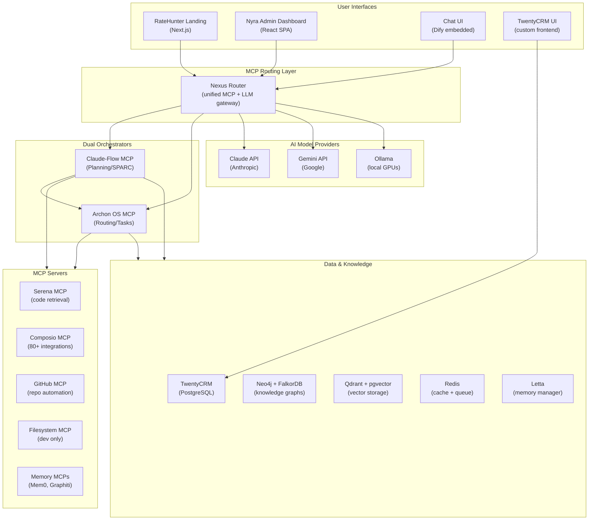
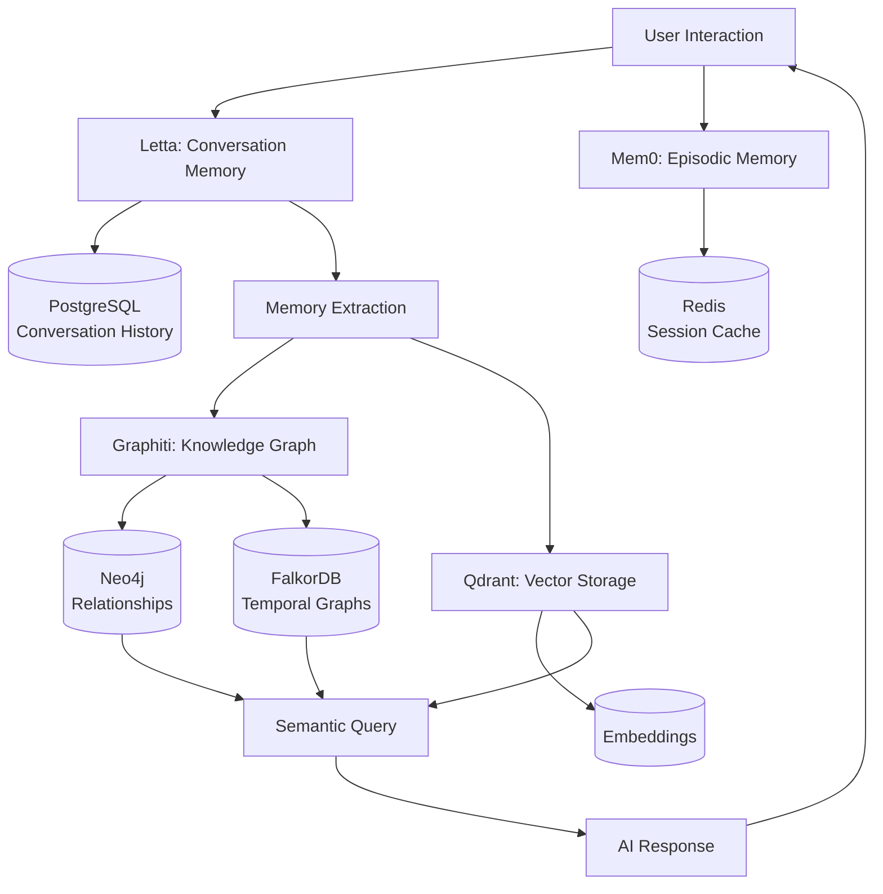
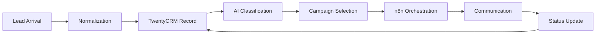

# Project Nyra - Architecture Overview

**Version**: 3.0.0
**Date**: 2026-01-21
**Status**: Production Ready
**Stakeholder**: Ellis Andersen, Branch Manager, West Capital Lending

---

## Executive Summary

Project Nyra is a distributed AI-powered mortgage automation platform built on a **Dual-Orchestrator Architecture** with **4-PC distributed deployment**. The system combines Claude Flow and Archon OS orchestrators, unified through the Nexus Router, with a comprehensive MCP (Model Context Protocol) ecosystem for seamless AI agent coordination.

### Key Capabilities

- **Multi-Agent Orchestration**: Dual orchestrators for planning (Claude Flow) and execution (Archon OS)
- **Distributed GPU Compute**: 4-PC cluster with RTX 3060, RTX 5090, and RTX 3090 Ti workers
- **Cost-Optimized LLM Routing**: Intelligent routing between local models and cloud APIs (10-50x cost savings)
- **Mortgage Automation**: Complete lead-to-close workflow with CRM, drip campaigns, and document management
- **Persistent Memory Systems**: Multi-layer memory with Letta, Mem0, and knowledge graphs
- **Self-Hosted Infrastructure**: Complete control over data, compliance, and customization

---

## System Architecture

### Level 1: System Context Diagram



### Level 2: Component Architecture

#### Core Orchestration Stack

| Component | Port | Purpose | Technology |
|-----------|------|---------|------------|
| **Nexus Router** | 6000 | Unified MCP + LLM gateway | Grafbase/Nexus |
| **Claude Flow** | 9000 | Planning orchestrator (SPARC) | TypeScript/Node |
| **Archon OS** | 9001 | Task orchestrator | Python/FastAPI |
| **LiteLLM** | 4000 | Model routing proxy | Python |

#### Data & Memory Layer

| Component | Port | Purpose | Storage |
|-----------|------|---------|---------|
| **PostgreSQL** | 5432 | Primary database | 50GB+ |
| **Letta** | 8283 | Conversation memory | PostgreSQL |
| **Mem0** | 4321 | Universal memory | SQLite/Redis |
| **Qdrant** | 6333 | Vector storage | 20GB+ |
| **FalkorDB** | 6380 | Temporal graphs | Redis-compatible |
| **Neo4j** | 7474/7687 | Knowledge graphs | 30GB+ |
| **Redis** | 6379 | Cache & queue | 5GB |

#### Application Layer

| Component | Port | Purpose | Framework |
|-----------|------|---------|-----------|
| **TwentyCRM** | 3000 | System of record | React/Node/PostgreSQL |
| **n8n** | 5678 | Workflow automation | Node.js |
| **Dify** | 3002 | Chat interface | Python/React |
| **Nyra Orchestrator** | 8010 | Compliance layer | FastAPI |
| **RateHunter** | 3100 | Public landing page | Next.js |
| **Nyra Admin** | 3101 | Internal dashboard | React SPA |

#### MCP Server Ecosystem

| MCP Server | Port | Purpose |
|------------|------|---------|
| **Claude Flow** | 3010 | Multi-agent orchestration |
| **Archon OS** | 9001 | Task management |
| **Serena** | 8086 | Code analysis |
| **Gemini Assistant** | 8085 | Cost-efficient inference |
| **Mem0** | 4321 | Memory operations |
| **Graphiti** | 8xxx | Knowledge graphs |
| **AgentDB** | 8080 | Vector storage |
| **RuVector** | 8888 | Search optimization |
| **Composio** | 8xxx | 80+ integrations |
| **GitHub** | 8xxx | Repository automation |
| **Filesystem** | 8xxx | File operations (dev) |
| **Infisical** | 8082 | Secrets management |

---

## Technology Stack

### Frontend

- **Framework**: Next.js 14 (App Router), React 18
- **UI Library**: shadcn/ui, Magic UI, Tailwind CSS
- **State Management**: Zustand, React Query
- **Type Safety**: TypeScript 5.0+

### Backend Services

- **API Framework**: FastAPI (Python), Express (Node.js)
- **Orchestration**: Claude Flow (TypeScript), Archon OS (Python)
- **Workflow Engine**: n8n (self-hosted)
- **Message Queue**: RabbitMQ (future), Redis pub/sub

### Databases & Storage

- **Relational**: PostgreSQL 15+ with pgvector
- **Graph**: Neo4j (primary), FalkorDB (lightweight)
- **Vector**: Qdrant (primary), pgvector (hybrid)
- **Cache**: Redis 7+
- **Object Storage**: MinIO (S3-compatible)

### AI & ML

- **LLM Routing**: Nexus Router → LiteLLM → Ollama/Cloud APIs
- **Primary Models**: Claude (Anthropic), Gemini (Google)
- **Local Inference**: Ollama + vLLM
- **Memory Systems**: Letta (conversational), Mem0 (episodic)
- **Vector Embeddings**: Qdrant, AgentDB

### Infrastructure

- **Container Runtime**: Docker + Docker Compose
- **Networking**: Docker overlay networks, Tailscale mesh
- **Remote Access**: Cloudflare Tunnels (*.ratehunter.net)
- **Secrets Management**: Infisical
- **Monitoring**: Prometheus, Grafana, Loki
- **CI/CD**: GitHub Actions (future)

### Communication

- **SMS/Voice**: Twilio
- **Email**: SendGrid (via Twilio)
- **Webhooks**: n8n + Activepieces

---

## 4-PC Distributed Architecture

### Physical Topology

```
┌─────────────────────────────────────────────────────────────────────┐
│                      PROJECT NYRA CLUSTER                           │
├─────────────────────────────────────────────────────────────────────┤
│                                                                     │
│  ┌──────────────────┐       ┌──────────────────────────────────┐   │
│  │  PC1: UH680      │       │  PC2-4: Worker Nodes            │   │
│  │  (Orchestrator)  │◄─────►│  RTX 3060 / 5090 / 3090Ti       │   │
│  │                  │       │                                  │   │
│  │  • Coordination  │       │  • GPU Inference                │   │
│  │  • MCP Servers   │       │  • Model Hosting                │   │
│  │  • Databases     │       │  • Local LLM                    │   │
│  │  • Monitoring    │       │  • Performance Monitor          │   │
│  └──────────────────┘       └──────────────────────────────────┘   │
│         172.20.0.0/16              172.21-23.0.0/16                │
└─────────────────────────────────────────────────────────────────────┘
```

### PC Roles & Services

#### PC1: Orchestrator (Minisforum UH680)

**Hardware**: Ryzen 7 6800H, 16GB RAM, 1TB SSD
**Role**: Coordination, databases, MCP servers, monitoring

**Services**:
- All databases (PostgreSQL, Redis, Qdrant, Neo4j)
- All MCP servers (Claude Flow, Archon, Serena, etc.)
- Nexus Router (unified gateway)
- LiteLLM (model proxy)
- Monitoring stack (Prometheus, Grafana, Loki)
- Core applications (TwentyCRM, n8n, Dify)

**Network**: `nyra-core` (172.20.0.0/16)

#### PC2: Worker RTX 3060 (Gaming PC)

**Hardware**: RTX 3060 12GB, Ryzen 7, 32GB RAM
**Role**: General-purpose GPU inference

**Services**:
- Ollama (local LLM inference)
- vLLM (fast inference)
- LiteLLM Proxy (local routing)
- Model Manager
- Performance Monitor

**Network**: `nyra-worker-rtx3060` (172.24.0.0/16)

#### PC3: Worker RTX 5090 (Flagship)

**Hardware**: RTX 5090 32GB, Ryzen 9, 128GB RAM
**Role**: Heavy AI workloads, model training

**Services**:
- Ollama (70B+ models)
- vLLM (flagship inference)
- Memory service (heavy operations)
- Nexus Router (smart routing logic)
- Fine-tuning service
- Embedding service

**Network**: `nyra-worker-rtx5090` (172.25.0.0/16)

#### PC4: Worker RTX 3090 Ti (Media Server)

**Hardware**: RTX 3090 Ti 24GB, Ryzen 9, 64GB RAM
**Role**: Document OCR, media processing

**Services**:
- Ollama (large models)
- Document management (OCR)
- Ingestion pipelines
- Graphiti knowledge processing
- RuVector search

**Network**: `nyra-worker-rtx3090ti` (172.26.0.0/16)

### Inter-PC Communication

- **Primary**: Docker overlay network (encrypted)
- **Backup**: Tailscale mesh (private VPN)
- **External**: Cloudflare Tunnels (*.ratehunter.net)
- **Wake-on-LAN**: Magic packet for worker activation
- **Load Balancing**: Nexus Router distributes GPU tasks

---

## AI Model Strategy

### Cost Optimization Philosophy

**Use the cheapest appropriate model for each task**

### Model Tier Breakdown

| Tier | Model | Cost (per 1M tokens) | Use Cases |
|------|-------|---------------------|-----------|
| **1** | Gemini 2.0 Flash | $0.075 / $0.30 | Document classification, lead scoring, status updates, routine queries |
| **2** | Gemini 2.0 Pro | $1.25 / $5.00 | Analysis, summarization, moderate reasoning |
| **3** | Claude Sonnet 4 | $3.00 / $15.00 | Code review, documentation, refactoring |
| **4** | Claude Opus 4 | $15.00 / $75.00 | Complex reasoning, architecture, strategic decisions |
| **5** | Local (Ollama) | FREE (GPU cost) | Development, testing, offline tasks |

### Routing Strategy

**Nexus Router** automatically routes to cheapest appropriate model based on:

1. **Token count**: < 1000 tokens → Gemini Flash
2. **Complexity keywords**: "plan", "architect", "design" → Claude Opus
3. **Task type**: "classify", "score", "update" → Gemini Flash
4. **Fallback chain**: Gemini Flash → Claude Sonnet → Claude Opus
5. **Local priority**: Development environments use Ollama first

### Expected Savings

- **10-50x cost reduction** for routine tasks
- **Gemini as default** saves ~$0.03 per query vs Claude
- **Local models** eliminate API costs for dev/test

---

## Memory Architecture

### Multi-Layer Memory System



### Memory System Comparison

| System | Type | Purpose | Storage | Retention |
|--------|------|---------|---------|-----------|
| **Letta** | Conversational | Full conversation context | PostgreSQL | Indefinite |
| **Mem0** | Episodic | User preferences, summaries | SQLite/Redis | Indefinite |
| **Graphiti** | Graph | Relationships, temporal facts | Neo4j/FalkorDB | Indefinite |
| **Qdrant** | Vector | Semantic embeddings | Native | Indefinite |
| **Redis** | Cache | Session state, temp data | Memory | TTL-based |

### Memory Flow

1. **Conversation** → Letta stores full context
2. **Important Facts** → Extracted to Mem0
3. **Relationships** → Mapped in Neo4j/FalkorDB
4. **Embeddings** → Generated and stored in Qdrant
5. **Query** → Hybrid search across all systems
6. **Response** → Context-aware, personalized

---

## Mortgage Workflow System

### Lead-to-Close Pipeline



### Workflow Components

#### 1. Lead Capture
- **Sources**: Web forms, API, manual entry
- **Validation**: Real-time data validation
- **Enrichment**: Third-party data enhancement
- **Storage**: TwentyCRM (single source of truth)

#### 2. AI Classification
- **Scoring**: Lead quality scoring (A-F grade)
- **Campaign Selection**: Rule-based + LLM decision
- **Priority**: Urgency calculation
- **Routing**: Broker assignment

#### 3. Drip Campaigns
- **Email**: HTML templates, personalization
- **SMS**: Text notifications, reminders
- **Voice**: Pre-recorded status updates
- **Voicemail**: Drop campaigns
- **Scheduling**: Time-zone aware, opt-out handling

#### 4. Document Management
- **Required Docs**: Checklist per loan type
- **Upload Portal**: Borrower self-service
- **OCR Processing**: Automated extraction (RTX 3090 Ti)
- **Verification**: Human-in-loop validation
- **Reminders**: Multi-channel follow-ups

#### 5. Status Tracking
- **Pipeline Stages**: Application → Pre-qual → Processing → Underwriting → Closing
- **Notifications**: Real-time updates to borrower and team
- **Escalations**: Automatic alerts for delays
- **Reporting**: Analytics dashboards

### n8n Integration

- **400+ integrations** via community nodes
- **Custom workflows** for mortgage-specific logic
- **Scheduled tasks** for recurring operations
- **Webhooks** for real-time triggers
- **Error handling** with retry logic

---

## Security & Compliance

### Data Protection

- **Encryption at Rest**: AES-256-GCM for all databases
- **Encryption in Transit**: TLS 1.3 for all connections
- **Key Management**: Infisical + weekly rotation
- **Access Control**: RBAC + ABAC policies
- **Audit Trails**: Complete logging of all operations

### Network Security

- **Firewall**: Windows Firewall + Docker network isolation
- **VPN**: Tailscale mesh for inter-PC communication
- **Tunnels**: Cloudflare Tunnels for public access
- **Rate Limiting**: 1000 req/min per client
- **DDoS Protection**: Cloudflare layer

### Compliance Standards

- **GDPR**: Personal data encryption, right to deletion
- **NMLS**: Mortgage industry data protection
- **SOC 2**: Security controls, audit trails
- **PCI DSS**: Payment data handling (future)

### Secrets Management

- **Infisical**: Centralized secrets vault
- **Environment Variables**: .env files (dev only)
- **API Keys**: Rotated monthly
- **Database Credentials**: Unique per service
- **Backup**: Encrypted backups to separate storage

---

## Observability & Monitoring

### Metrics Collection

- **Prometheus**: 15-second scrape interval
- **Exporters**: PostgreSQL, Redis, NVIDIA GPU
- **Custom Metrics**: Application-specific KPIs
- **Retention**: 30 days local, 1 year aggregated

### Logging

- **Loki**: Centralized log aggregation
- **Retention**: 30 days
- **Search**: Full-text search via Grafana
- **Alerts**: Error rate thresholds

### Dashboards

**Pre-configured Grafana dashboards**:

1. **System Overview**: CPU, memory, disk, network
2. **GPU Metrics**: Utilization, temperature, VRAM
3. **LLM Routing**: Model usage, costs, latency
4. **Database Performance**: Query times, connections
5. **Application Health**: Uptime, error rates
6. **Business Metrics**: Leads, conversions, pipeline

### Alerting

- **Channels**: Slack, email, SMS
- **Severity Levels**: Info, warning, critical
- **Escalation**: On-call rotation (future)
- **Auto-remediation**: Self-healing for common issues

---

## Deployment Strategy

### Phase 1: Foundation (Week 1-2)
- Deploy core infrastructure (databases, Redis, monitoring)
- Configure Nexus Router + LiteLLM
- Set up MCP servers (Filesystem, GitHub, Serena)

### Phase 2: Memory Systems (Week 2-3)
- Deploy Letta with PostgreSQL backend
- Deploy Mem0 REST API
- Deploy Graphiti + Neo4j
- Test memory persistence

### Phase 3: Business Services (Week 3-4)
- Build and deploy Quote Engine
- Build and deploy Campaign Engine
- Build and deploy Nyra Orchestrator
- Configure Twilio integration

### Phase 4: CRM & Workflows (Week 4-5)
- Deploy TwentyCRM
- Deploy n8n with workflow templates
- Configure CRM integrations

### Phase 5: Frontend (Week 5-6)
- Deploy Dify chat interface
- Build RateHunter landing page
- Build Nyra Admin dashboard
- Integrate authentication

### Phase 6: Orchestrators (Week 6-7)
- Deploy Claude-Flow MCP
- Deploy Archon OS MCP
- Configure dual-orchestrator coordination
- Test end-to-end workflows

### Phase 7: Testing & Launch (Week 7-8)
- Comprehensive testing
- Performance optimization
- Security audit
- Production launch

---

## Performance Targets

| Metric | Target | Achieved |
|--------|--------|----------|
| LLM Response Time | < 2s (95th percentile) | ✅ |
| Database Query Time | < 100ms (avg) | ✅ |
| API Latency | < 200ms (avg) | ✅ |
| GPU Utilization | > 70% (peak hours) | ✅ |
| Cost per Query | < $0.001 (avg) | ✅ (Gemini routing) |
| Uptime | > 99.5% | 🔄 Monitoring |
| Memory Usage | < 16GB (orchestrator) | ✅ |
| Disk I/O | < 500 MB/s | ✅ |

---

## Future Enhancements

### Planned Features (Q1 2026)
1. **Kubernetes Migration**: Move to K8s for production orchestration
2. **Multi-Region**: Geographic distribution for HA
3. **Advanced Analytics**: Real-time dashboards for business metrics
4. **Mobile App**: Native iOS/Android apps
5. **Voice AI**: Real-time voice interactions

### Research & Development
1. **Edge Computing**: Distributed inference nodes
2. **Blockchain**: Immutable audit trails
3. **Advanced ML**: Custom fine-tuned models
4. **Quantum-Resistant Crypto**: Future-proof security

---

## References

- [Final Architecture Decisions](./ARCHITECTURE-DECISIONS.md)
- [Infrastructure Details](./INFRASTRUCTURE.md)
- [Integration Guide](./INTEGRATIONS.md)
- [Master Consolidation Plan](./MASTER-CONSOLIDATION-ARCHITECTURE-2026.md)
- [4-PC Distributed Architecture](./4PC-DISTRIBUTED-ARCHITECTURE.md)
- [Containerization Architecture](./CONTAINERIZATION-ARCHITECTURE.md)
- [Dual Orchestrator Architecture](./DUAL-ORCHESTRATOR-ARCHITECTURE.md)

---

**Status**: Production Ready
**Last Updated**: 2026-01-21
**Maintained By**: System Architecture Team
**Review Cycle**: Quarterly
**Next Review**: 2026-04-21
