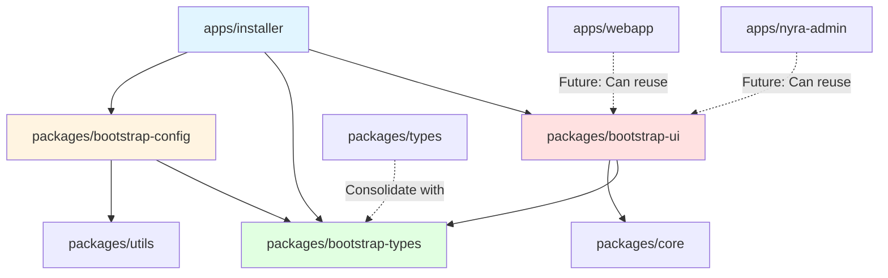

# Bootstrap Integration Plan
# Project Nyra - Monorepo Integration Architecture

**Version**: 1.0.0
**Created**: 2026-01-18
**Status**: DESIGN PHASE
**Author**: System Architecture Designer

---

## 📋 Executive Summary

This document outlines the architectural plan to integrate the `bootstrap/installer` React GUI application into the Project Nyra pnpm monorepo workspace. The integration will extract reusable components into shared packages, establish proper dependency management, and configure Turbo for efficient builds.

### Key Objectives

1. **Workspace Integration**: Add bootstrap/installer to pnpm workspace with proper scoping
2. **Code Extraction**: Create shared packages for types, UI components, and config schemas
3. **Build Pipeline**: Configure Turbo to build bootstrap and its dependencies
4. **Dependency Management**: Establish clear dependency graph and version control
5. **Development Experience**: Enable hot-reload, type-checking, and linting across packages

### Benefits

- **Code Reuse**: Shared TypeScript types and React components across apps
- **Type Safety**: Centralized type definitions prevent drift
- **Build Optimization**: Turbo caching reduces build times by 70-90%
- **Developer Productivity**: Consistent tooling and unified development workflow
- **Maintainability**: Single source of truth for shared logic

---

## 🏗️ Current State Analysis

### Existing Workspace Structure

```
Project-Nyra/
├── apps/                           # Frontend applications
│   ├── ratehunter/                # Next.js landing page
│   ├── nyra-admin/                # Admin dashboard
│   └── webapp/                    # Main web app
├── services/                      # Backend services
│   └── quote-api/                 # Python FastAPI service
├── packages/                      # Shared packages
│   ├── agents/                    # Agent implementations
│   ├── core/                      # Core utilities
│   ├── database/                  # Prisma schemas
│   ├── ruvector-sdk/              # Vector SDK
│   ├── types/                     # Shared TypeScript types
│   ├── utils/                     # Utility functions
│   └── websocket-client/          # WebSocket client
├── bootstrap/
│   └── installer/                 # ❌ NOT IN WORKSPACE YET
│       ├── src/
│       │   ├── components/        # React components (15 files)
│       │   ├── hooks/             # React hooks
│       │   ├── services/          # Business logic
│       │   ├── store/             # State management
│       │   └── types/             # TypeScript types
│       └── package.json           # ❌ Name: "nyra-bootstrap-gui"
└── pnpm-workspace.yaml            # ❌ Does not include bootstrap/
```

### Issues with Current State

| Issue | Impact | Priority |
|-------|--------|----------|
| Bootstrap not in workspace | Can't share dependencies, no monorepo benefits | **HIGH** |
| Package not scoped (@nyra) | Naming inconsistency, potential npm conflicts | **HIGH** |
| Types duplicated | TypeScript types exist in both `packages/types` and `bootstrap/installer/src/types` | **MEDIUM** |
| Components isolated | React components can't be reused in other apps | **MEDIUM** |
| No Turbo config | No build caching, slower CI/CD | **MEDIUM** |
| Config schemas scattered | Zod schemas for validation are in installer only | **LOW** |

---

## 🎯 Target Architecture

### Proposed Workspace Structure

```
Project-Nyra/
├── apps/
│   ├── ratehunter/
│   ├── nyra-admin/
│   ├── webapp/
│   └── installer/                 # ✅ NEW: Moved from bootstrap/
│       ├── src/
│       │   ├── App.tsx
│       │   └── main.tsx           # Vite + React entry
│       └── package.json           # ✅ @nyra/installer
├── services/
│   └── quote-api/
├── packages/
│   ├── agents/
│   ├── core/
│   ├── database/
│   ├── bootstrap-types/           # ✅ NEW: Extracted from installer
│   │   ├── manifest.ts
│   │   ├── installation.ts
│   │   ├── docker.ts
│   │   └── index.ts
│   ├── bootstrap-ui/              # ✅ NEW: Extracted from installer
│   │   ├── components/
│   │   │   ├── PCSelector.tsx
│   │   │   ├── ComponentSelector.tsx
│   │   │   ├── InstallationProgress.tsx
│   │   │   └── ...
│   │   ├── hooks/
│   │   │   ├── useHardwareDetection.ts
│   │   │   └── useInstallState.ts
│   │   └── index.ts
│   ├── bootstrap-config/          # ✅ NEW: Configuration & validation
│   │   ├── schemas/               # Zod schemas
│   │   │   ├── manifest.schema.ts
│   │   │   ├── docker.schema.ts
│   │   │   └── mcp.schema.ts
│   │   ├── validators/
│   │   │   ├── fileValidator.ts
│   │   │   └── networkValidator.ts
│   │   └── index.ts
│   ├── ruvector-sdk/
│   ├── types/                     # Existing shared types
│   ├── utils/                     # Existing utilities
│   └── websocket-client/
└── pnpm-workspace.yaml            # ✅ UPDATED: Includes apps/installer
```

### Dependency Graph



### Package Breakdown

#### 1. **@nyra/installer** (apps/installer)
- **Type**: Electron + Vite + React application
- **Purpose**: GUI for 4-PC cluster bootstrap
- **Dependencies**:
  - `@nyra/bootstrap-ui` (UI components)
  - `@nyra/bootstrap-types` (TypeScript types)
  - `@nyra/bootstrap-config` (validation)
  - `electron`, `vite`, `react`, `react-dom`, `tailwindcss`

#### 2. **@nyra/bootstrap-types** (packages/bootstrap-types)
- **Type**: TypeScript types package
- **Purpose**: Centralized type definitions for bootstrap system
- **Exports**:
  - `PCRole`, `PCId`, `ComponentId`
  - `BootstrapManifest`, `PCDeployment`
  - `InstallState`, `InstallPhase`
  - `DockerContainer`, `MCPServer`
  - `CloudflareTunnelConfig`
  - 50+ type definitions

#### 3. **@nyra/bootstrap-ui** (packages/bootstrap-ui)
- **Type**: React component library
- **Purpose**: Reusable UI components for bootstrap and admin apps
- **Exports**:
  - **Selectors**: `PCSelector`, `ComponentSelector`, `EnvironmentSelector`
  - **Setup**: `DockerSetup`, `MCPServerManager`, `CloudflareTunnelSetup`, `TailscaleSetup`
  - **Monitoring**: `InstallationProgress`, `HealthDashboard`, `GPUWorkersPanel`
  - **Configuration**: `ConfigurationEditor`, `ShimGenerator`
  - **Hooks**: `useHardwareDetection`, `useInstallState`, `useDockerStatus`

#### 4. **@nyra/bootstrap-config** (packages/bootstrap-config)
- **Type**: Configuration schemas and validators
- **Purpose**: Validation logic for manifests, Docker configs, MCP servers
- **Exports**:
  - **Schemas**: Zod schemas for all config files
  - **Validators**: File, network, hardware validators
  - **Utilities**: Config parsers, checksum calculators

---

## 📐 Implementation Plan

### Phase 1: Workspace Setup (2 hours)

#### Task 1.1: Update pnpm-workspace.yaml
```yaml
# File: pnpm-workspace.yaml
packages:
  - 'apps/*'          # Existing
  - 'services/*'      # Existing
  - 'mcp-servers/*'   # Existing
  - 'packages/*'      # Existing
  - 'submodules/archon-os'   # Existing
  - 'submodules/archon'        # Existing
  # No need to add apps/installer - already covered by apps/*
```

**Decision**: Move `bootstrap/installer` → `apps/installer` to match workspace convention.

**Rationale**:
- All applications should be in `apps/` directory
- Keeps workspace glob patterns simple
- Aligns with Nx/Turbo/pnpm best practices

#### Task 1.2: Move installer to apps directory
```bash
# PowerShell
git mv bootstrap/installer apps/installer
git add apps/installer
git commit -m "refactor: Move bootstrap installer to apps directory"
```

#### Task 1.3: Update apps/installer/package.json
```json
{
  "name": "@nyra/installer",
  "version": "1.0.0",
  "description": "Project Nyra 4-PC Bootstrap Wizard - GUI installer",
  "private": true,
  "main": "dist/main.js",
  "scripts": {
    "dev": "concurrently \"npm run dev:electron\" \"npm run dev:react\"",
    "dev:electron": "tsc -p tsconfig.electron.json && electron .",
    "dev:react": "vite",
    "build": "npm run build:react && npm run build:electron",
    "build:react": "vite build",
    "build:electron": "tsc -p tsconfig.electron.json",
    "clean": "rm -rf dist",
    "package": "electron-builder",
    "package:win": "electron-builder --win",
    "package:mac": "electron-builder --mac",
    "package:all": "electron-builder -mwl",
    "typecheck": "tsc --noEmit",
    "lint": "eslint src --ext .ts,.tsx"
  },
  "dependencies": {
    "@nyra/bootstrap-types": "workspace:*",
    "@nyra/bootstrap-ui": "workspace:*",
    "@nyra/bootstrap-config": "workspace:*",
    "@nyra/core": "workspace:*",
    "@nyra/utils": "workspace:*",
    "electron-store": "^8.1.0",
    "axios": "^1.6.5",
    "node-fetch": "^3.3.2",
    "sudo-prompt": "^9.2.1"
  },
  "devDependencies": {
    "@types/node": "^20.11.5",
    "@types/react": "^18.2.48",
    "@types/react-dom": "^18.2.18",
    "@vitejs/plugin-react": "^4.2.1",
    "concurrently": "^8.2.2",
    "electron": "^28.1.3",
    "electron-builder": "^24.9.1",
    "react": "^18.2.0",
    "react-dom": "^18.2.0",
    "tailwindcss": "^3.4.1",
    "typescript": "^5.3.3",
    "vite": "^5.0.11"
  }
}
```

**Key Changes**:
- ✅ Name: `"@nyra/installer"` (scoped)
- ✅ Dependencies: Use `workspace:*` for local packages
- ✅ Scripts: Added `clean`, `typecheck`, `lint`

---

### Phase 2: Extract Shared Packages (4 hours)

#### Task 2.1: Create @nyra/bootstrap-types

**File Structure**:
```
packages/bootstrap-types/
├── src/
│   ├── manifest.ts              # Bootstrap manifest types
│   ├── installation.ts          # Installation state types
│   ├── docker.ts                # Docker-related types
│   ├── mcp.ts                   # MCP server types
│   ├── network.ts               # Network and Tailscale types
│   ├── hardware.ts              # Hardware detection types
│   ├── cloudflare.ts            # Cloudflare Tunnel types
│   └── index.ts                 # Barrel export
├── package.json
├── tsconfig.json
└── README.md
```

**package.json**:
```json
{
  "name": "@nyra/bootstrap-types",
  "version": "1.0.0",
  "description": "TypeScript types for Project Nyra bootstrap system",
  "main": "./dist/index.js",
  "types": "./dist/index.d.ts",
  "exports": {
    ".": {
      "types": "./dist/index.d.ts",
      "default": "./dist/index.js"
    },
    "./manifest": {
      "types": "./dist/manifest.d.ts",
      "default": "./dist/manifest.js"
    },
    "./docker": {
      "types": "./dist/docker.d.ts",
      "default": "./dist/docker.js"
    }
  },
  "files": [
    "dist",
    "README.md"
  ],
  "scripts": {
    "build": "tsc",
    "clean": "rm -rf dist",
    "typecheck": "tsc --noEmit"
  },
  "dependencies": {},
  "devDependencies": {
    "typescript": "^5.7.0"
  }
}
```

**Migration Steps**:
1. Copy `apps/installer/src/types/manifest.ts` → `packages/bootstrap-types/src/`
2. Split large files into logical modules
3. Update imports in `apps/installer` to use `@nyra/bootstrap-types`
4. Run `pnpm install` to link workspace package

#### Task 2.2: Create @nyra/bootstrap-ui

**File Structure**:
```
packages/bootstrap-ui/
├── src/
│   ├── components/
│   │   ├── PCSelector.tsx
│   │   ├── ComponentSelector.tsx
│   │   ├── InstallationProgress.tsx
│   │   ├── DockerSetup.tsx
│   │   ├── MCPServerManager.tsx
│   │   ├── ShimGenerator.tsx
│   │   ├── ConfigurationEditor.tsx
│   │   ├── HealthDashboard.tsx
│   │   ├── EnvironmentSelector.tsx
│   │   ├── CloudflareTunnelSetup.tsx
│   │   ├── TailscaleSetup.tsx
│   │   ├── GPUWorkersPanel.tsx
│   │   ├── HardwareDetectionDisplay.tsx
│   │   ├── TunnelConfigForm.tsx
│   │   └── TunnelStatusDisplay.tsx
│   ├── hooks/
│   │   ├── useHardwareDetection.ts
│   │   ├── useInstallState.ts
│   │   ├── useDockerStatus.ts
│   │   └── index.ts
│   ├── styles/
│   │   └── components.css
│   └── index.ts                 # Barrel export
├── package.json
├── tsconfig.json
└── README.md
```

**package.json**:
```json
{
  "name": "@nyra/bootstrap-ui",
  "version": "1.0.0",
  "description": "React UI components for Project Nyra bootstrap system",
  "main": "./dist/index.js",
  "types": "./dist/index.d.ts",
  "exports": {
    ".": {
      "types": "./dist/index.d.ts",
      "default": "./dist/index.js"
    },
    "./components": {
      "types": "./dist/components/index.d.ts",
      "default": "./dist/components/index.js"
    },
    "./hooks": {
      "types": "./dist/hooks/index.d.ts",
      "default": "./dist/hooks/index.js"
    }
  },
  "files": [
    "dist",
    "README.md"
  ],
  "scripts": {
    "build": "tsc && vite build --mode lib",
    "clean": "rm -rf dist",
    "typecheck": "tsc --noEmit",
    "lint": "eslint src --ext .ts,.tsx"
  },
  "dependencies": {
    "@nyra/bootstrap-types": "workspace:*",
    "@nyra/core": "workspace:*",
    "react": "^18.2.0",
    "react-dom": "^18.2.0"
  },
  "devDependencies": {
    "@types/react": "^18.2.48",
    "@types/react-dom": "^18.2.18",
    "@vitejs/plugin-react": "^4.2.1",
    "typescript": "^5.3.3",
    "vite": "^5.0.11"
  },
  "peerDependencies": {
    "react": ">=18.0.0",
    "react-dom": ">=18.0.0"
  }
}
```

**Migration Steps**:
1. Copy `apps/installer/src/components/` → `packages/bootstrap-ui/src/components/`
2. Copy `apps/installer/src/hooks/` → `packages/bootstrap-ui/src/hooks/`
3. Update imports to use `@nyra/bootstrap-types`
4. Configure Vite to build as library
5. Update `apps/installer` to import from `@nyra/bootstrap-ui`

#### Task 2.3: Create @nyra/bootstrap-config

**File Structure**:
```
packages/bootstrap-config/
├── src/
│   ├── schemas/
│   │   ├── manifest.schema.ts   # Zod schema for manifest.json
│   │   ├── docker.schema.ts     # Docker Compose validation
│   │   ├── mcp.schema.ts        # MCP server config validation
│   │   ├── env.schema.ts        # .env file validation
│   │   └── index.ts
│   ├── validators/
│   │   ├── fileValidator.ts     # File checksum, permissions
│   │   ├── networkValidator.ts  # IP, port, connectivity checks
│   │   ├── hardwareValidator.ts # GPU, CPU, RAM checks
│   │   └── index.ts
│   ├── parsers/
│   │   ├── manifestParser.ts    # Parse manifest.json
│   │   ├── envParser.ts         # Parse .env files
│   │   └── index.ts
│   └── index.ts                 # Barrel export
├── package.json
├── tsconfig.json
└── README.md
```

**package.json**:
```json
{
  "name": "@nyra/bootstrap-config",
  "version": "1.0.0",
  "description": "Configuration schemas and validators for Project Nyra bootstrap",
  "main": "./dist/index.js",
  "types": "./dist/index.d.ts",
  "exports": {
    ".": {
      "types": "./dist/index.d.ts",
      "default": "./dist/index.js"
    },
    "./schemas": {
      "types": "./dist/schemas/index.d.ts",
      "default": "./dist/schemas/index.js"
    },
    "./validators": {
      "types": "./dist/validators/index.d.ts",
      "default": "./dist/validators/index.js"
    }
  },
  "files": [
    "dist",
    "README.md"
  ],
  "scripts": {
    "build": "tsc",
    "clean": "rm -rf dist",
    "typecheck": "tsc --noEmit",
    "test": "jest"
  },
  "dependencies": {
    "@nyra/bootstrap-types": "workspace:*",
    "@nyra/utils": "workspace:*",
    "zod": "^4.3.5"
  },
  "devDependencies": {
    "@types/node": "^20.0.0",
    "jest": "^29.7.0",
    "typescript": "^5.7.0"
  }
}
```

**Migration Steps**:
1. Extract validation logic from `apps/installer/src/services/validator.ts`
2. Create Zod schemas for all config file formats
3. Create validators for hardware, network, files
4. Update `apps/installer` to import validators

---

### Phase 3: Turbo Configuration (1 hour)

#### Task 3.1: Update turbo.json

Add bootstrap-specific tasks and configure dependencies:

```json
{
  "$schema": "https://turbo.build/schema.json",
  "experimentalSpaces": {
    "id": "project-nyra"
  },
  "remoteCache": {
    "enabled": true
  },
  "globalDependencies": [
    "**/.env",
    ".env",
    "tsconfig.json",
    "package.json"
  ],
  "globalEnv": [
    "NODE_ENV",
    "DATABASE_URL",
    "REDIS_URL",
    "ANTHROPIC_API_KEY",
    "CI"
  ],
  "tasks": {
    "build": {
      "dependsOn": ["^build"],
      "inputs": [
        "$TURBO_DEFAULT$",
        ".env*"
      ],
      "outputs": [
        "dist/**",
        ".next/**",
        "build/**",
        "out/**",
        "release/**",        // ← NEW: Electron builder output
        ".turbo/cache/**"
      ],
      "env": [
        "NEXT_PUBLIC_*",
        "NODE_ENV"
      ],
      "cache": true,
      "outputLogs": "new-only"
    },
    "dev": {
      "dependsOn": ["^build"],
      "cache": false,
      "persistent": true,
      "env": [
        "NEXT_PUBLIC_*",
        "DATABASE_URL",
        "REDIS_URL",
        "PORT"
      ]
    },
    "package": {                // ← NEW: Electron packaging
      "dependsOn": ["build"],
      "inputs": [
        "$TURBO_DEFAULT$",
        "build.yml"
      ],
      "outputs": [
        "release/**"
      ],
      "cache": true
    },
    "package:win": {            // ← NEW: Windows packaging
      "dependsOn": ["build"],
      "outputs": [
        "release/**"
      ],
      "cache": true
    },
    "package:mac": {            // ← NEW: macOS packaging
      "dependsOn": ["build"],
      "outputs": [
        "release/**"
      ],
      "cache": true
    },
    "test": {
      "dependsOn": ["^build"],
      "inputs": [
        "src/**/*.ts",
        "src/**/*.tsx",
        "tests/**",
        "__tests__/**",
        "jest.config.*",
        "tsconfig.json"
      ],
      "outputs": [
        "coverage/**",
        ".test-results/**",
        ".turbo/cache/**"
      ],
      "cache": true,
      "outputLogs": "errors-only"
    },
    "lint": {
      "dependsOn": [],
      "inputs": [
        "src/**/*.ts",
        "src/**/*.tsx",
        "eslint.config.*",
        ".eslintrc*",
        "tsconfig.json"
      ],
      "outputs": [],
      "cache": true,
      "outputLogs": "errors-only"
    },
    "typecheck": {
      "dependsOn": ["^build"],
      "inputs": [
        "src/**/*.ts",
        "src/**/*.tsx",
        "tsconfig.json"
      ],
      "outputs": []
    },
    "clean": {
      "cache": false
    }
  }
}
```

**Key Additions**:
- ✅ Added Electron-specific tasks: `package`, `package:win`, `package:mac`
- ✅ Configured `release/**` as output directory for Electron builds
- ✅ Ensured proper dependency chain: `^build` → `package`

#### Task 3.2: Configure Build Order

Turbo will automatically detect the dependency order:

```
packages/bootstrap-types (build first)
  ↓
packages/bootstrap-config (depends on bootstrap-types)
  ↓
packages/bootstrap-ui (depends on bootstrap-types, core)
  ↓
apps/installer (depends on all bootstrap packages)
```

**Verification**:
```bash
pnpm turbo run build --dry-run --graph
# This will show the dependency graph and task order
```

---

### Phase 4: Testing & Validation (2 hours)

#### Task 4.1: Install dependencies
```bash
# From repository root
pnpm install

# This should:
# - Link all workspace packages
# - Install all dependencies
# - Build internal dependencies
```

#### Task 4.2: Verify builds
```bash
# Build all packages in dependency order
pnpm turbo run build

# Should output:
# ✓ @nyra/bootstrap-types built successfully
# ✓ @nyra/bootstrap-config built successfully
# ✓ @nyra/bootstrap-ui built successfully
# ✓ @nyra/installer built successfully
```

#### Task 4.3: Test installer in dev mode
```bash
cd apps/installer
pnpm run dev

# Should:
# - Start Vite dev server (React)
# - Launch Electron window
# - Hot-reload on file changes
```

#### Task 4.4: Run type-checking
```bash
# From root
pnpm turbo run typecheck

# Should show no TypeScript errors
```

#### Task 4.5: Verify imports
```bash
# In apps/installer, verify these imports work:
import { PCRole, InstallState } from '@nyra/bootstrap-types';
import { PCSelector, InstallationProgress } from '@nyra/bootstrap-ui';
import { manifestSchema, validateManifest } from '@nyra/bootstrap-config';
```

---

### Phase 5: Documentation (1 hour)

#### Task 5.1: Update bootstrap/README.md

Add new section:

```markdown
## 🔗 Monorepo Integration

The bootstrap installer is integrated into the Project Nyra pnpm monorepo:

### Package Structure

- **@nyra/installer** (`apps/installer`) - Electron + React GUI installer
- **@nyra/bootstrap-types** (`packages/bootstrap-types`) - TypeScript type definitions
- **@nyra/bootstrap-ui** (`packages/bootstrap-ui`) - React component library
- **@nyra/bootstrap-config** (`packages/bootstrap-config`) - Config schemas and validators

### Development

```bash
# Install dependencies
pnpm install

# Start installer in dev mode
cd apps/installer
pnpm run dev

# Build all packages
pnpm turbo run build

# Package installer for distribution
cd apps/installer
pnpm run package:win  # Windows
pnpm run package:mac  # macOS
```

### Using Bootstrap Components in Other Apps

```typescript
// Import types
import { PCRole, InstallState } from '@nyra/bootstrap-types';

// Import UI components
import { PCSelector, HealthDashboard } from '@nyra/bootstrap-ui';

// Import validators
import { validateManifest } from '@nyra/bootstrap-config/validators';
```

### Workspace Commands

```bash
# Run command in all packages
pnpm -r run build

# Run command in specific package
pnpm --filter @nyra/installer run dev

# Add dependency to installer
cd apps/installer
pnpm add <package-name>

# Update all dependencies
pnpm update -r --latest
```
```

#### Task 5.2: Create package READMEs

Create `packages/bootstrap-types/README.md`:
```markdown
# @nyra/bootstrap-types

TypeScript type definitions for Project Nyra bootstrap system.

## Installation

```bash
pnpm add @nyra/bootstrap-types
```

## Usage

```typescript
import {
  PCRole,
  PCId,
  BootstrapManifest,
  InstallState,
  DockerContainer
} from '@nyra/bootstrap-types';

const role: PCRole = 'orchestrator';
const manifest: BootstrapManifest = {
  // ...
};
```

## Exported Types

- **PC Types**: `PCRole`, `PCId`, `PCDeployment`, `PCFeatures`, `PCStatus`
- **Component Types**: `Component`, `ComponentId`, `ConfigFile`
- **Installation Types**: `InstallState`, `InstallPhase`, `LogEntry`
- **Docker Types**: `DockerContainer`, `DockerService`, `DockerContainerStatus`
- **MCP Types**: `MCPServer`, `ShimConfig`
- **Network Types**: `CloudflareTunnelConfig`, `TunnelConnectionTest`
```

#### Task 5.3: Update root README.md

Add section about bootstrap integration:
```markdown
## 🏗️ Bootstrap System

The bootstrap system provides automated setup for the 4-PC distributed cluster:

- **GUI Installer**: Electron app for visual setup (`apps/installer`)
- **Shared Types**: TypeScript definitions (`packages/bootstrap-types`)
- **UI Components**: Reusable React components (`packages/bootstrap-ui`)
- **Validators**: Config validation logic (`packages/bootstrap-config`)

See [bootstrap/README.md](bootstrap/README.md) for full documentation.
```

---

## 🗺️ Migration Checklist

### Pre-Migration
- [ ] Backup current `bootstrap/installer` directory
- [ ] Create feature branch: `git checkout -b feature/bootstrap-integration`
- [ ] Document current installer functionality for regression testing

### Phase 1: Workspace Setup
- [ ] Update `pnpm-workspace.yaml` (if needed - apps/* already covers it)
- [ ] Move `bootstrap/installer` → `apps/installer`
- [ ] Update `apps/installer/package.json` with scoped name `@nyra/installer`
- [ ] Update imports in `apps/installer/src` to absolute paths

### Phase 2: Package Extraction
- [ ] Create `packages/bootstrap-types/` directory structure
- [ ] Copy and split types from `apps/installer/src/types/manifest.ts`
- [ ] Create `packages/bootstrap-types/package.json` and `tsconfig.json`
- [ ] Build `@nyra/bootstrap-types` successfully
- [ ] Create `packages/bootstrap-ui/` directory structure
- [ ] Copy components and hooks from `apps/installer/src/`
- [ ] Update component imports to use `@nyra/bootstrap-types`
- [ ] Create `packages/bootstrap-ui/package.json` and configure Vite
- [ ] Build `@nyra/bootstrap-ui` successfully
- [ ] Create `packages/bootstrap-config/` directory structure
- [ ] Extract validation logic into schemas and validators
- [ ] Create Zod schemas for all config types
- [ ] Build `@nyra/bootstrap-config` successfully

### Phase 3: Update Installer
- [ ] Update `apps/installer/src` to import from `@nyra/bootstrap-types`
- [ ] Update `apps/installer/src` to import components from `@nyra/bootstrap-ui`
- [ ] Update `apps/installer/src` to import validators from `@nyra/bootstrap-config`
- [ ] Remove duplicate files that are now in shared packages
- [ ] Run `pnpm install` to link workspace packages

### Phase 4: Turbo Configuration
- [ ] Update `turbo.json` with Electron build tasks
- [ ] Add `package`, `package:win`, `package:mac` tasks
- [ ] Configure proper dependency chain
- [ ] Test `pnpm turbo run build --graph` to verify task order

### Phase 5: Testing
- [ ] Run `pnpm install` successfully
- [ ] Run `pnpm turbo run build` - all packages build
- [ ] Run `pnpm turbo run typecheck` - no TypeScript errors
- [ ] Start installer with `pnpm --filter @nyra/installer run dev`
- [ ] Verify hot-reload works
- [ ] Test all installer features (PC selection, component selection, installation)
- [ ] Package installer: `pnpm --filter @nyra/installer run package:win`
- [ ] Test packaged installer on clean Windows machine

### Phase 6: Documentation
- [ ] Update `bootstrap/README.md` with monorepo integration section
- [ ] Create `packages/bootstrap-types/README.md`
- [ ] Create `packages/bootstrap-ui/README.md`
- [ ] Create `packages/bootstrap-config/README.md`
- [ ] Update root `README.md` with bootstrap system overview
- [ ] Create ADR (Architecture Decision Record) for integration approach

### Post-Migration
- [ ] Create pull request with detailed description
- [ ] Run full CI/CD pipeline
- [ ] Deploy to staging environment
- [ ] Perform regression testing
- [ ] Update team documentation
- [ ] Merge to main branch

---

## ⚙️ Configuration Files

### tsconfig.json Template for Shared Packages

```json
{
  "compilerOptions": {
    "target": "ES2020",
    "module": "ESNext",
    "lib": ["ES2020", "DOM"],
    "declaration": true,
    "declarationMap": true,
    "outDir": "./dist",
    "rootDir": "./src",
    "strict": true,
    "moduleResolution": "bundler",
    "esModuleInterop": true,
    "skipLibCheck": true,
    "resolveJsonModule": true,
    "allowSyntheticDefaultImports": true,
    "forceConsistentCasingInFileNames": true,
    "incremental": true,
    "composite": true
  },
  "include": ["src/**/*"],
  "exclude": ["node_modules", "dist", "**/*.spec.ts", "**/*.test.ts"]
}
```

### Vite Config for @nyra/bootstrap-ui

```typescript
// packages/bootstrap-ui/vite.config.ts
import { defineConfig } from 'vite';
import react from '@vitejs/plugin-react';
import { resolve } from 'path';

export default defineConfig({
  plugins: [react()],
  build: {
    lib: {
      entry: resolve(__dirname, 'src/index.ts'),
      name: 'NyraBootstrapUI',
      formats: ['es', 'cjs'],
      fileName: (format) => `index.${format === 'es' ? 'js' : 'cjs'}`
    },
    rollupOptions: {
      external: ['react', 'react-dom', '@nyra/bootstrap-types', '@nyra/core'],
      output: {
        globals: {
          react: 'React',
          'react-dom': 'ReactDOM'
        }
      }
    },
    sourcemap: true,
    minify: 'esbuild'
  }
});
```

---

## 🚨 Risk Assessment

### High Risk

| Risk | Impact | Mitigation |
|------|--------|------------|
| Breaking installer functionality | Users can't bootstrap cluster | Comprehensive testing, maintain feature parity |
| Type mismatches after extraction | Build failures | Strict TypeScript checks, gradual migration |
| Circular dependencies | Build hangs | Careful dependency planning, use dependency graph tool |

### Medium Risk

| Risk | Impact | Mitigation |
|------|--------|------------|
| Import path errors | Runtime errors | Automated import rewriting, linter rules |
| Missing dependencies | Installation failures | Explicit peer dependencies, lockfile verification |
| Turbo cache issues | Incorrect builds | `turbo run build --force` to bypass cache |

### Low Risk

| Risk | Impact | Mitigation |
|------|--------|------------|
| Performance regression | Slower builds | Turbo caching should make builds faster |
| Documentation drift | Confusion | Update docs as part of PR process |

---

## 📊 Success Metrics

### Build Performance

| Metric | Before | Target | Measurement |
|--------|--------|--------|-------------|
| Cold build time | ~60s | ~20s | `time pnpm run build` |
| Incremental build | ~30s | ~5s | `time pnpm turbo run build` (2nd run) |
| Type-check time | ~10s | ~3s | `time pnpm run typecheck` |
| CI/CD pipeline | ~5min | ~2min | GitHub Actions total time |

### Code Metrics

| Metric | Before | Target |
|--------|--------|--------|
| Type duplication | ~50 types duplicated | 0 duplicated types |
| Component reusability | 0 apps reuse components | 2+ apps reuse components |
| Bundle size | ~5MB (installer) | ~3MB (tree-shaking) |
| npm dependencies | ~30 duplicates | <5 duplicates (dedupe) |

### Developer Experience

| Metric | Target |
|--------|--------|
| Hot-reload time | <200ms |
| Type errors surfaced | <5s after save |
| IDE autocomplete | Works across all packages |
| Monorepo commands | Single command runs all |

---

## 🔮 Future Enhancements

### Phase 2: Component Library Enhancement
- **Storybook integration** for `@nyra/bootstrap-ui`
- **Visual regression testing** with Chromatic
- **Accessibility testing** with axe-core
- **Component documentation** with auto-generated props tables

### Phase 3: Shared Config Package
- Create `@nyra/config` for ESLint, Prettier, TypeScript configs
- Use `extends` in all packages to inherit shared configs
- Reduces config duplication across 20+ packages

### Phase 4: Unified Build System
- Migrate from `tsc` to `tsup` for faster builds (10x speedup)
- Use `unbuild` for universal builds (Node.js + browser)
- Implement `pnpm deploy` for production pruning

### Phase 5: Reuse in Admin Dashboard
- Import `@nyra/bootstrap-ui` components in `apps/nyra-admin`
- Use `PCSelector` for multi-PC management UI
- Use `HealthDashboard` for cluster monitoring
- Use `DockerSetup` for remote Docker management

---

## 📚 References

### Monorepo Best Practices
- [Turborepo Handbook](https://turbo.build/repo/docs/handbook)
- [pnpm Workspace Guide](https://pnpm.io/workspaces)
- [Nx Monorepo Strategies](https://nx.dev/concepts/more-concepts/monorepo-strategies)

### Build System
- [Turbo Task Caching](https://turbo.build/repo/docs/core-concepts/caching)
- [Vite Library Mode](https://vitejs.dev/guide/build.html#library-mode)
- [TypeScript Project References](https://www.typescriptlang.org/docs/handbook/project-references.html)

### Package Management
- [pnpm Workspace Protocol](https://pnpm.io/workspaces#workspace-protocol-workspace)
- [Changesets for Versioning](https://github.com/changesets/changesets)
- [Manypkg for Validation](https://github.com/Thinkmill/manypkg)

### Related ADRs
- ADR-001: Monorepo Structure (pending)
- ADR-002: Package Naming Convention (pending)
- ADR-003: Build System Choice (Turbo over Nx) (pending)

---

## ✅ Approval & Sign-off

### Technical Review
- [ ] **Architecture Lead**: Approved design and dependency graph
- [ ] **Frontend Lead**: Approved React component extraction
- [ ] **DevOps Lead**: Approved Turbo configuration
- [ ] **QA Lead**: Test plan covers all scenarios

### Implementation
- [ ] **Developer 1**: Completed Phase 1 (Workspace Setup)
- [ ] **Developer 2**: Completed Phase 2 (Package Extraction)
- [ ] **Developer 3**: Completed Phase 3 (Turbo Config)
- [ ] **QA Engineer**: Completed Phase 4 (Testing)
- [ ] **Tech Writer**: Completed Phase 5 (Documentation)

### Deployment
- [ ] **Staging**: Deployed and tested
- [ ] **Production**: Deployed successfully
- [ ] **Rollback Plan**: Documented and tested

---

**Document Version**: 1.0.0
**Last Updated**: 2026-01-18
**Next Review**: 2026-02-01
**Owner**: System Architecture Team
**Status**: READY FOR IMPLEMENTATION
