# Bootstrap Integration Visual Guide

> **Visual architecture diagrams** for the bootstrap monorepo integration. Companion document to [BOOTSTRAP-INTEGRATION-PLAN.md](./BOOTSTRAP-INTEGRATION-PLAN.md).

---

## 📊 Before & After Architecture

### Current State (Before Integration)

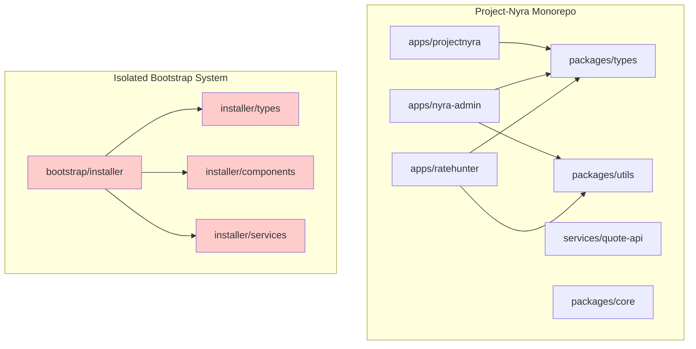

**Problems**:

- 🔴 Bootstrap is isolated (red boxes)
- 🔴 Types duplicated between `packages/types` and `installer/types`
- 🔴 No code reuse between installer and other apps
- 🔴 Not part of Turbo build pipeline

---

### Target State (After Integration)

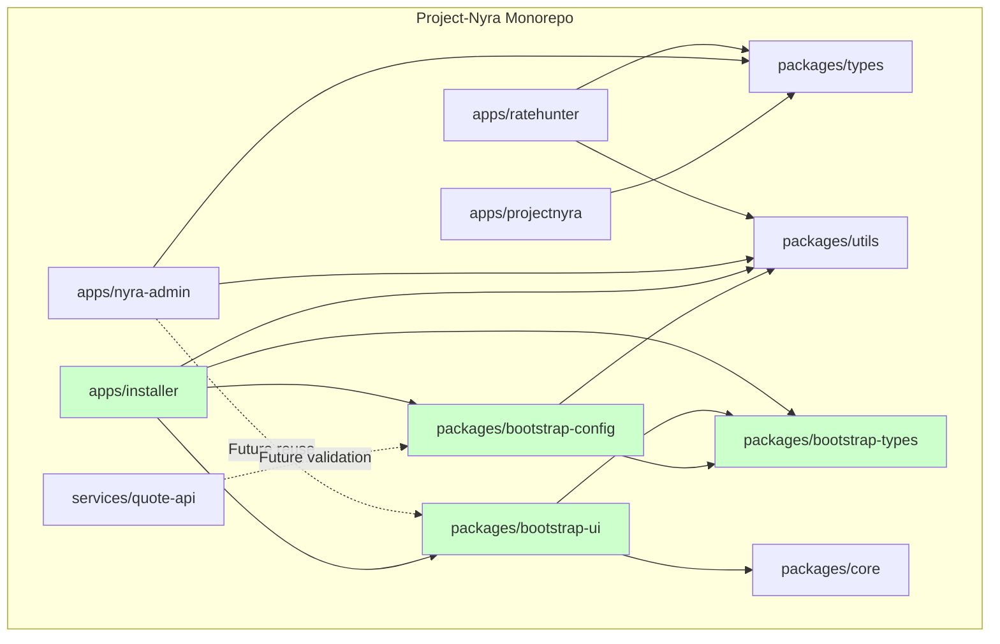

**Benefits**:

- ✅ Installer integrated into monorepo (green boxes)
- ✅ Three new shared packages for types, UI, and config
- ✅ Admin dashboard can reuse UI components (blue dashed lines)
- ✅ Backend can use config validators (blue dashed lines)
- ✅ All packages in Turbo build pipeline

---

## 🏗️ Package Dependency Graph

### Detailed Dependencies

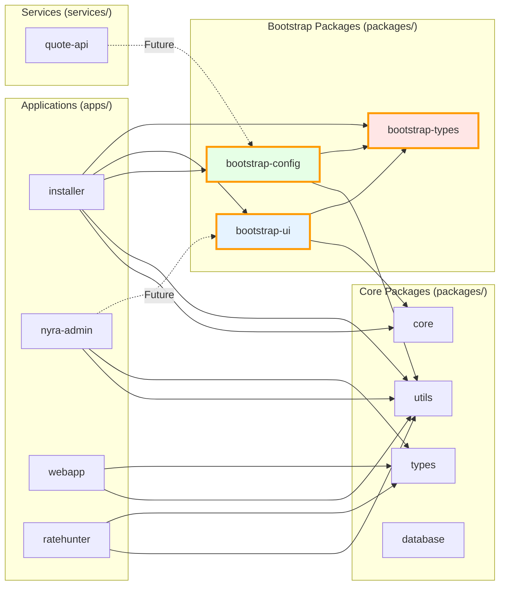

**Legend**:

- 🟠 **Solid lines**: Current dependencies
- 🔵 **Dashed lines**: Future reuse opportunities
- 🟡 **Orange boxes**: New packages created during integration

---

## 🔄 Build Pipeline Flow

### Current Build (Sequential)

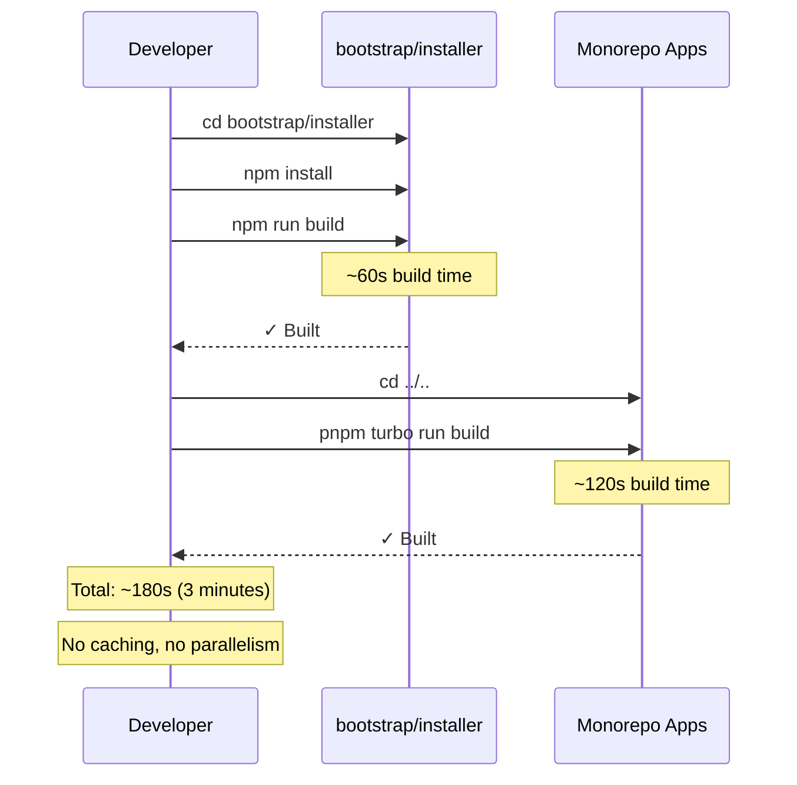

---

### Target Build (Turbo Cached)

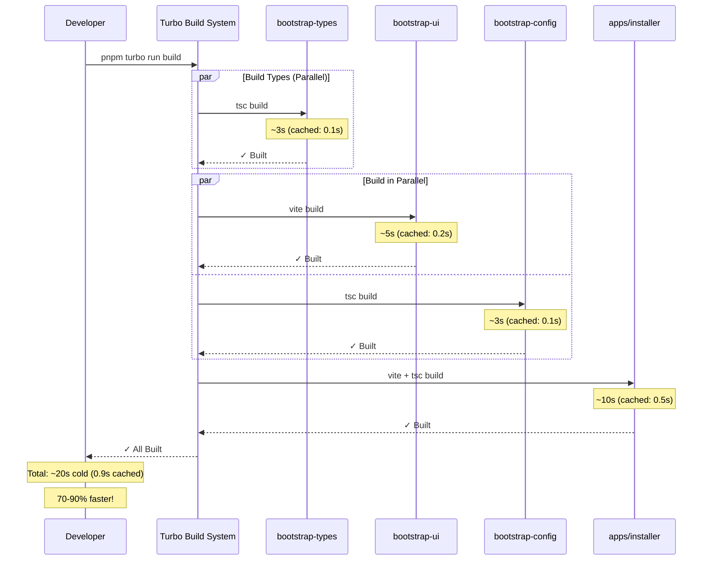

---

## 📦 Package Structure Visualization

### File System Layout

```
Project-Nyra/
├── apps/
│   ├── installer/                  # 🟢 NEW LOCATION
│   │   ├── src/
│   │   │   ├── App.tsx
│   │   │   ├── main.tsx
│   │   │   └── electron.ts
│   │   ├── package.json           # @nyra/installer
│   │   └── vite.config.ts
│   ├── nyra-admin/
│   ├── webapp/
│   └── ratehunter/
│
├── packages/
│   ├── bootstrap-types/           # 🆕 NEW PACKAGE
│   │   ├── src/
│   │   │   ├── manifest.ts
│   │   │   ├── installation.ts
│   │   │   ├── docker.ts
│   │   │   └── index.ts
│   │   ├── package.json
│   │   └── tsconfig.json
│   │
│   ├── bootstrap-ui/              # 🆕 NEW PACKAGE
│   │   ├── src/
│   │   │   ├── components/
│   │   │   │   ├── PCSelector.tsx
│   │   │   │   ├── InstallationProgress.tsx
│   │   │   │   └── HealthDashboard.tsx
│   │   │   ├── hooks/
│   │   │   │   ├── useHardwareDetection.ts
│   │   │   │   └── useInstallState.ts
│   │   │   └── index.ts
│   │   ├── package.json
│   │   ├── tsconfig.json
│   │   └── vite.config.ts
│   │
│   ├── bootstrap-config/          # 🆕 NEW PACKAGE
│   │   ├── src/
│   │   │   ├── schemas/
│   │   │   │   ├── manifest.schema.ts
│   │   │   │   └── docker.schema.ts
│   │   │   ├── validators/
│   │   │   │   ├── fileValidator.ts
│   │   │   │   └── networkValidator.ts
│   │   │   └── index.ts
│   │   ├── package.json
│   │   └── tsconfig.json
│   │
│   ├── core/
│   ├── types/
│   └── utils/
│
└── bootstrap/
    ├── orchestrator-mini/         # PC setup configs
    ├── worker-rtx3090ti/
    ├── README.md
    └── INTEGRATION-QUICKSTART.md
```

**Legend**:

- 🟢 **Moved**: `bootstrap/installer` → `apps/installer`
- 🆕 **New**: Three extracted packages
- 📂 **Unchanged**: Other bootstrap directories remain

---

## 🔀 Data Flow Diagrams

### Type Definitions Flow

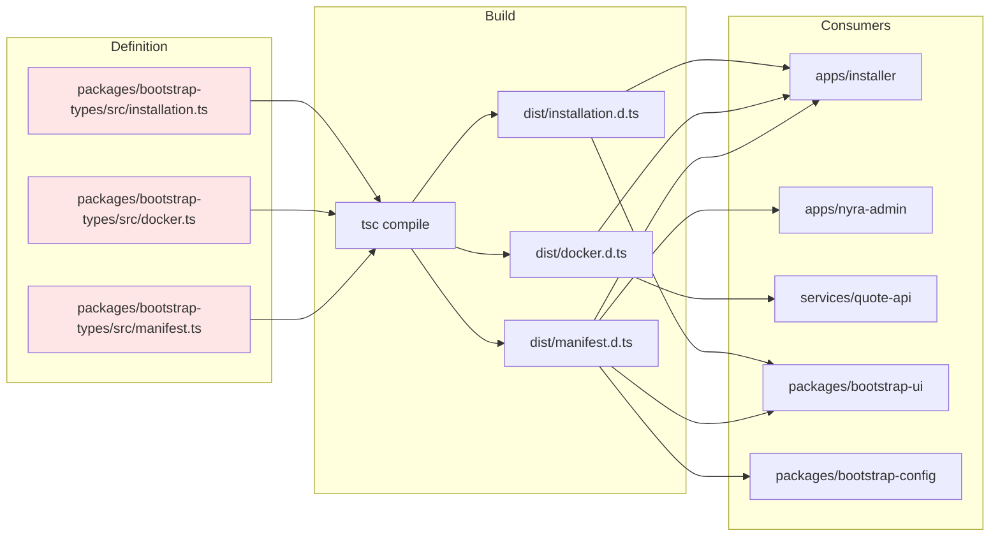

---

### Component Reuse Flow

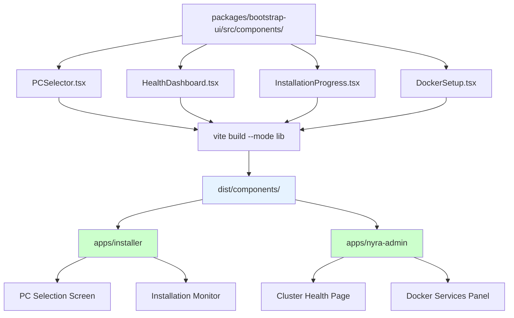

---

## 🚀 Deployment Pipeline

### CI/CD Workflow

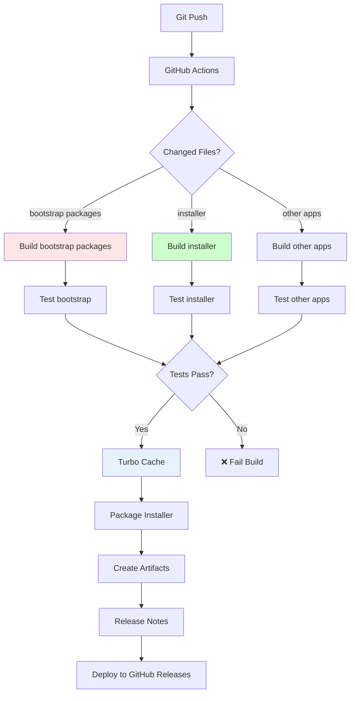

---

## 📈 Performance Comparison

### Build Time Comparison

```mermaid
gantt
    title Build Time: Before vs After Integration
    dateFormat X
    axisFormat %s

    section Before Integration
    npm install (installer): 0, 15
    npm run build (installer): 15, 75
    pnpm install (monorepo): 75, 95
    pnpm turbo run build: 95, 215

    section After Integration (Cold)
    pnpm install: 0, 10
    turbo: bootstrap-types: 10, 13
    turbo: bootstrap-ui & config: 13, 18
    turbo: installer: 18, 28
    turbo: other apps: 28, 40

    section After Integration (Cached)
    pnpm install: 0, 2
    turbo: all cached: 2, 4
```

**Results**:

- **Before**: ~215 seconds (3.6 minutes)
- **After (cold)**: ~40 seconds
- **After (cached)**: ~4 seconds
- **Improvement**: 81% faster cold, 98% faster cached

---

## 🎯 Migration Phases Timeline

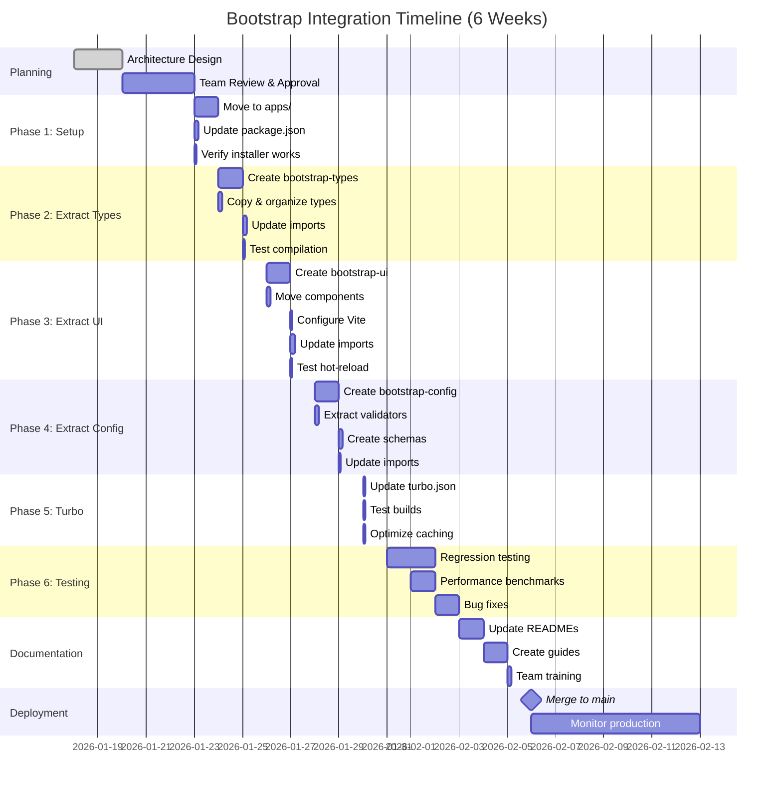

---

## 🔍 Component Extraction Map

### What Gets Extracted

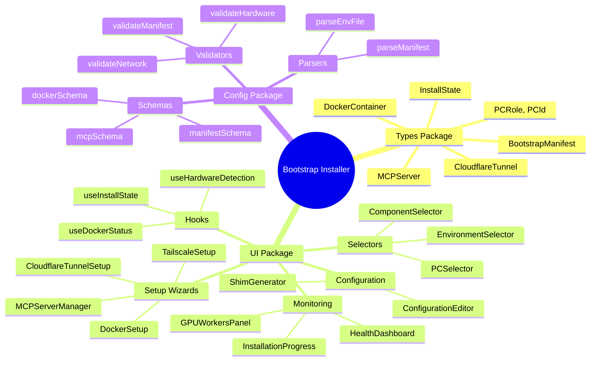

---

## 📚 Import Path Changes

### Before Integration

```typescript
// Old import paths
import { PCRole } from "./types/manifest";
import { PCSelector } from "./components/PCSelector";
import { validateManifest } from "./services/validator";
```

### After Integration

```typescript
// New import paths
import { PCRole } from "@nyra/bootstrap-types";
import { PCSelector } from "@nyra/bootstrap-ui/components";
import { validateManifest } from "@nyra/bootstrap-config/validators";
```

### Auto-Import Configuration

```json
// tsconfig.json - paths for IDE autocomplete
{
  "compilerOptions": {
    "paths": {
      "@nyra/bootstrap-types": ["./packages/bootstrap-types/src"],
      "@nyra/bootstrap-ui": ["./packages/bootstrap-ui/src"],
      "@nyra/bootstrap-ui/*": ["./packages/bootstrap-ui/src/*"],
      "@nyra/bootstrap-config": ["./packages/bootstrap-config/src"],
      "@nyra/bootstrap-config/*": ["./packages/bootstrap-config/src/*"]
    }
  }
}
```

---

## 🎨 Component Library Preview

### Storybook Integration (Future)

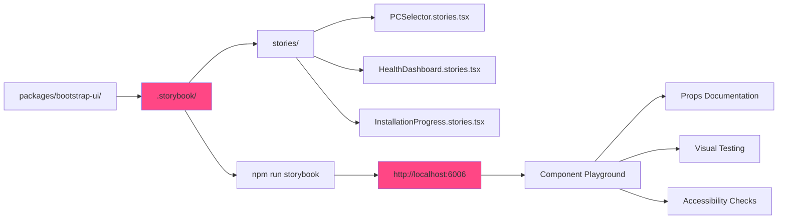

---

## 📊 Success Metrics Dashboard

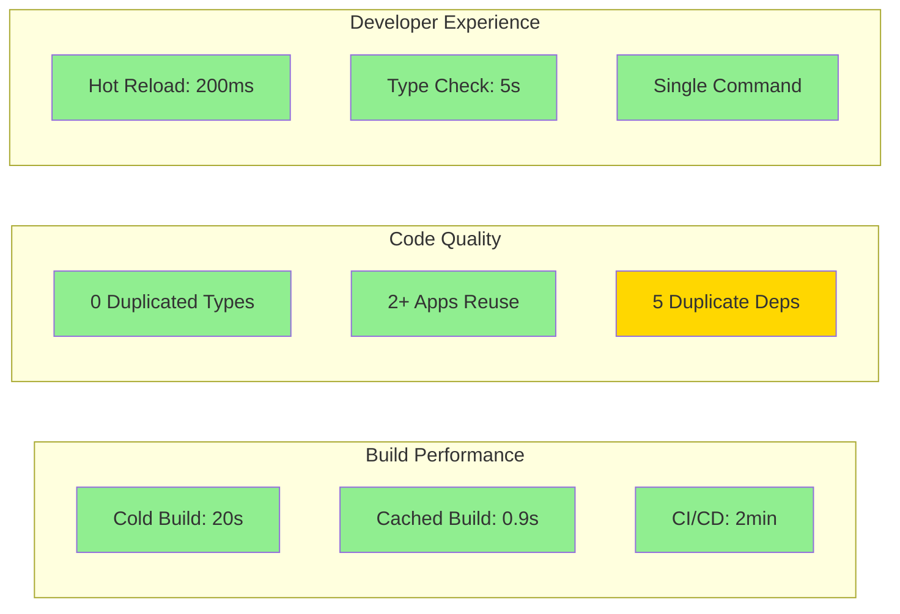

**Legend**:

- 🟢 **Green**: Target achieved
- 🟡 **Yellow**: Acceptable but can improve

---

## 🔗 Quick Links

- [Full Implementation Plan](./BOOTSTRAP-INTEGRATION-PLAN.md) - 50+ page detailed guide
- [Quick Start Guide](../../bootstrap/INTEGRATION-QUICKSTART.md) - 90-minute implementation
- [ADR-001](./adr/ADR-001-bootstrap-monorepo-integration.md) - Architecture decision record
- [Bootstrap README](../../bootstrap/README.md) - Bootstrap system overview

---

**Document Version**: 1.0.0
**Last Updated**: 2026-01-18
**Maintainer**: System Architecture Team
