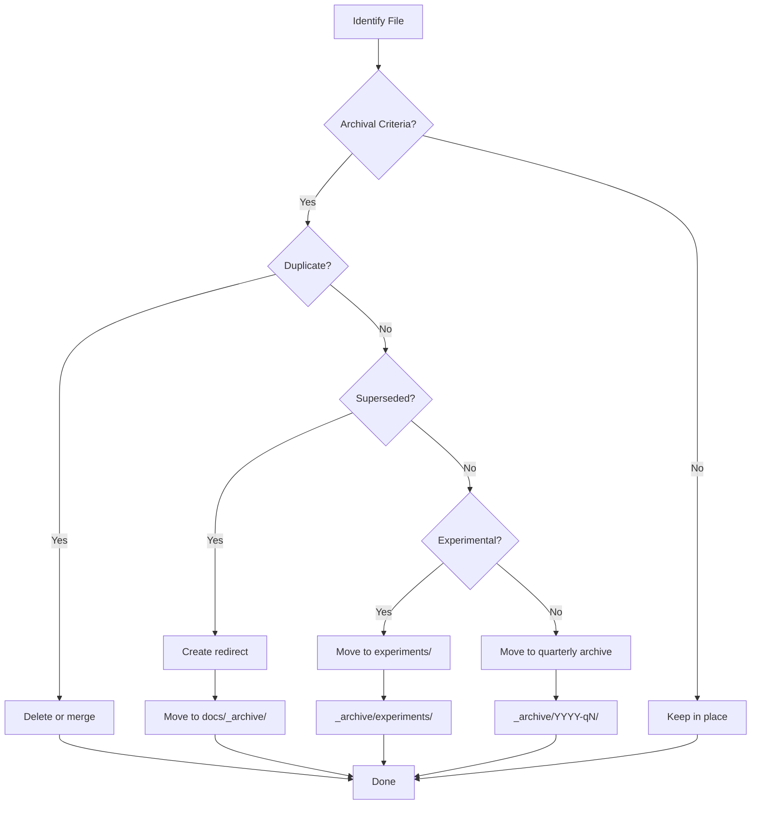
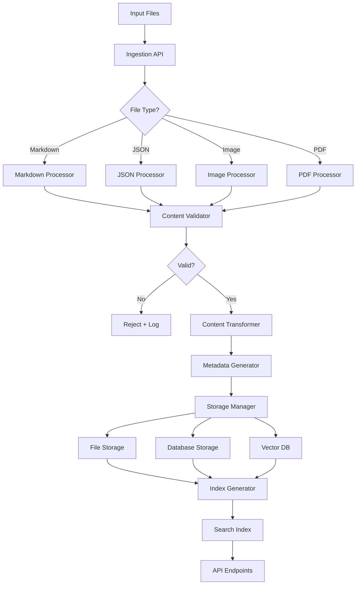
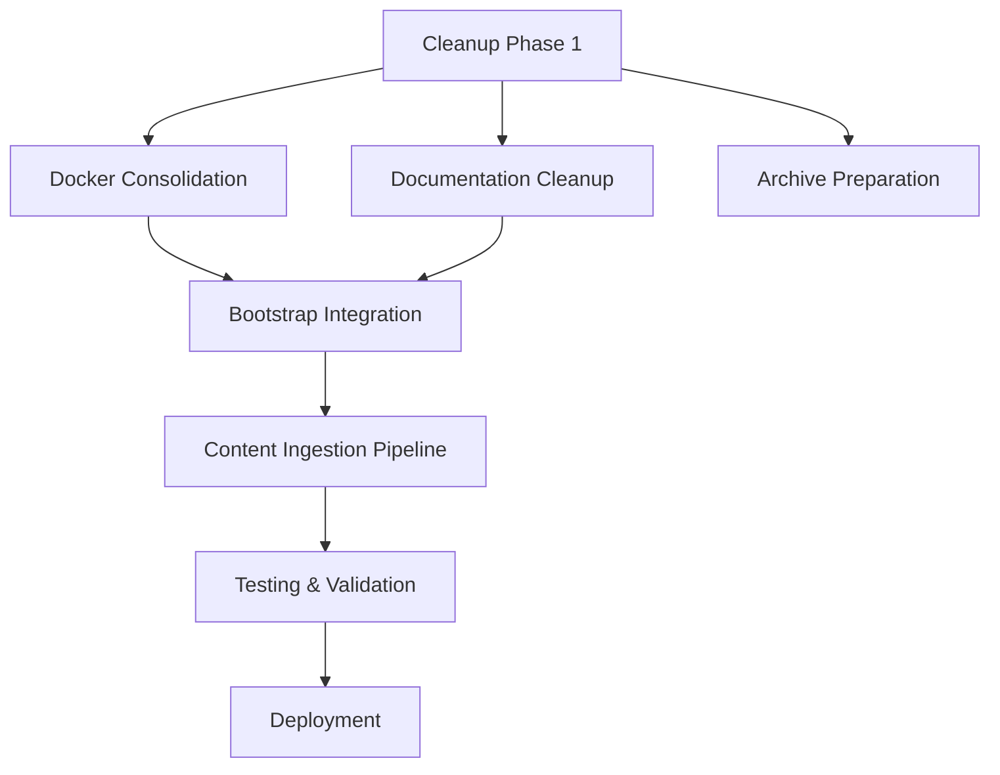

# Project Nyra - Repository Cleanup & Content Ingestion Strategy

**Version**: 1.0.0
**Date**: 2026-01-17
**Status**: Architecture Design
**Author**: System Architecture Designer

---

## Executive Summary

This document defines a comprehensive strategy for cleaning up the Project Nyra repository and implementing a robust content ingestion pipeline for the `apps/webapp`. The cleanup addresses scattered Docker configurations, fragmented documentation (484 files), and unorganized directories. The ingestion pipeline enables bulk content import with validation, transformation, and metadata generation.

### Key Objectives

1. **Unified Directory Structure**: Consolidate scattered files into logical locations
2. **Docker Centralization**: Single `infra/docker/` directory with PC-specific configs
3. **Documentation Cleanup**: Deduplicate, archive, and organize 484+ markdown files
4. **Bootstrap Integration**: Add React installer to pnpm workspace
5. **Content Ingestion**: Scalable pipeline for markdown, JSON, images, PDFs
6. **Version Control**: Preserve history, create migration path

---

## Table of Contents

1. [Current State Analysis](#1-current-state-analysis)
2. [Target Architecture](#2-target-architecture)
3. [Directory Reorganization Plan](#3-directory-reorganization-plan)
4. [File Consolidation Strategy](#4-file-consolidation-strategy)
5. [Archive Strategy](#5-archive-strategy)
6. [Bootstrap Integration](#6-bootstrap-integration)
7. [Docker Consolidation](#7-docker-consolidation)
8. [Content Ingestion Pipeline](#8-content-ingestion-pipeline)
9. [Implementation Roadmap](#9-implementation-roadmap)
10. [Migration Scripts](#10-migration-scripts)
11. [Validation & Testing](#11-validation--testing)

---

## 1. Current State Analysis

### 1.1 Repository Statistics

| Category | Current State | Issues |
|----------|---------------|--------|
| **Documentation** | 484 markdown files | Fragmented, duplicates, inconsistent structure |
| **Docker Files** | 20+ docker-compose files | Scattered across 8+ directories |
| **Bootstrap** | Standalone directory | Not in pnpm workspace |
| **Archive** | `_archive/` (untracked) | Unclear retention policy |
| **Apps/Services** | 6 apps, 1 service | Inconsistent structure |
| **MCP Servers** | 2 servers + configs | Mixed in bootstrap/ and mcp-servers/ |

### 1.2 Problem Areas

#### Docker Configuration Sprawl

```
Current locations:
├── infra/docker-compose.yml (dev, orchestrator, worker)
├── bootstrap/orchestrator-mini/docker/docker-compose.yml
├── bootstrap/worker-rtx*/docker/docker-compose.yml (3 files)
├── bootstrap/configs/docker/docker-compose.memory.yml
├── bootstrap/configs/infisical/docker-compose.infisical.yml
├── apps/webapp/mortgage-services/docker-compose.yml
├── assets/new-uploads-ingestion-input/docker/ (5+ compose files)
└── configs/backup/latest/orchestrator-mini/docker/docker-compose.yml
```

**Issues**:
- No single source of truth
- Duplicate service definitions
- Hard to maintain consistency
- Unclear which files are active

#### Documentation Fragmentation

```
docs/ (484 files):
├── Duplicate SETUP guides (5+ versions)
├── Duplicate STATUS reports (10+ versions)
├── Multiple README files (30+ files)
├── Mixed architecture/deployment/guides
├── No clear versioning
└── Archived and active docs mixed
```

**Issues**:
- Users don't know which docs are current
- Search returns duplicate results
- Maintenance burden
- Outdated information still visible

#### Bootstrap Isolation

```
bootstrap/ (not in workspace):
├── installer/ (React app)
│   ├── src/
│   ├── package.json (standalone)
│   └── No integration with monorepo
├── configs/ (PC-specific)
├── docker/ (PC-specific compose files)
└── scripts/ (PowerShell/Bash)
```

**Issues**:
- Not managed by pnpm workspace
- Duplicate dependencies
- Can't use shared packages
- Inconsistent tooling

### 1.3 Git Status Insights

**Modified files** (from git status):
- `.gitmodules`, `.mcp.json` - Configuration changes
- `bootstrap/installer/src/` - Active development
- `docker-compose.infisical.yml` - Docker updates
- Multiple docs moved to `docs/` - Cleanup in progress

**Untracked files**:
- `_archive/` - Needs policy and cleanup
- `bootstrap/BOOTSTRAP-COMPLETE.md` - Duplicate report
- `bootstrap/configs/`, `bootstrap/docker/`, `bootstrap/windows/`, `bootstrap/wsl/` - New structure
- `docs/architecture/INFRASTRUCTURE-CONSOLIDATION-PLAN.md` - Overlaps with this doc

---

## 2. Target Architecture

### 2.1 Unified Directory Structure

```
project-nyra/
├── apps/                           # Applications (Next.js, React)
│   ├── crm/
│   ├── crm-dashboard/
│   ├── nexus-dashboard/
│   ├── nyra-admin/
│   ├── ratehunter/
│   └── webapp/                     # Main web app with ingestion
│       ├── src/
│       │   ├── services/
│       │   │   └── ingestion/      # NEW: Content ingestion pipeline
│       │   │       ├── processors/ # Format-specific processors
│       │   │       ├── validators/ # Content validation
│       │   │       ├── transformers/ # Content transformation
│       │   │       ├── storage/    # Storage adapters
│       │   │       └── index.ts    # Pipeline orchestrator
│       │   └── ...
│       ├── content/                # NEW: Ingested content storage
│       │   ├── markdown/
│       │   ├── json/
│       │   ├── images/
│       │   ├── pdfs/
│       │   └── metadata/           # Generated indexes
│       └── package.json
│
├── services/                       # Backend services (FastAPI, Node.js)
│   └── quote-api/
│
├── packages/                       # Shared packages
│   ├── database/                   # Prisma schemas
│   ├── shared-types/               # TypeScript types
│   ├── ui-components/              # Shared React components
│   └── utils/                      # Common utilities
│
├── mcp-servers/                    # MCP server implementations
│   ├── claude-flow/
│   └── ruv-swarm/
│
├── bootstrap/                      # 4-PC deployment system
│   ├── installer/                  # React GUI installer (NOW IN WORKSPACE)
│   │   ├── src/
│   │   └── package.json            # Workspace package
│   ├── configs/                    # PC-specific configs
│   │   ├── orchestrator/
│   │   ├── worker-1/               # RTX 3060
│   │   ├── worker-2/               # RTX 5090
│   │   └── worker-3/               # RTX 3090Ti
│   ├── scripts/                    # Bootstrap scripts
│   │   ├── windows/                # PowerShell scripts
│   │   ├── wsl/                    # Bash scripts
│   │   └── common/                 # Shared utilities
│   ├── templates/                  # Config templates
│   └── docs/                       # Bootstrap-specific docs
│
├── infra/                          # Infrastructure as code
│   ├── docker/                     # UNIFIED Docker configurations
│   │   ├── compose/                # Docker Compose files
│   │   │   ├── base.yml            # Core services (Infisical, MetaMCP)
│   │   │   ├── orchestrator.yml    # Orchestrator + DBs
│   │   │   ├── worker.yml          # GPU worker template
│   │   │   ├── dev.yml             # Development overrides
│   │   │   ├── prod.yml            # Production overrides
│   │   │   ├── mcp.yml             # All MCP servers
│   │   │   └── full.yml            # Complete stack (imports all)
│   │   ├── images/                 # Dockerfiles
│   │   │   ├── claude-flow/
│   │   │   ├── archon-os/
│   │   │   ├── mcp-servers/
│   │   │   └── nyra/
│   │   └── scripts/                # Docker management scripts
│   │       ├── build-all.sh
│   │       ├── health-check.sh
│   │       └── deploy.sh
│   ├── terraform/                  # Cloud infrastructure (future)
│   └── kubernetes/                 # K8s manifests (future)
│
├── docs/                           # ORGANIZED Documentation
│   ├── guides/                     # User guides (deduplicated)
│   │   ├── quick-start.md
│   │   ├── setup-development.md
│   │   ├── setup-production.md
│   │   └── testing.md
│   ├── architecture/               # Architecture docs
│   │   ├── system-overview.md
│   │   ├── 4pc-distributed.md
│   │   ├── network-topology.md
│   │   ├── docker-architecture.md
│   │   ├── cleanup-strategy.md     # This document
│   │   └── ingestion-pipeline.md
│   ├── deployment/                 # Deployment guides
│   │   ├── docker-deployment.md
│   │   ├── mcp-deployment.md
│   │   └── infisical-setup.md
│   ├── api/                        # API documentation
│   │   ├── rest-api.md
│   │   ├── graphql-schema.md
│   │   └── mcp-tools.md
│   ├── reports/                    # Status reports (dated)
│   │   ├── 2026-01-17-cleanup.md
│   │   ├── 2026-01-15-bootstrap.md
│   │   └── 2026-01-11-setup.md
│   └── _archive/                   # ARCHIVED documentation
│       ├── 2025/                   # Archived by year
│       ├── deprecated/             # Deprecated features
│       └── drafts/                 # Incomplete drafts
│
├── scripts/                        # Utility scripts
│   ├── cleanup/                    # NEW: Cleanup scripts
│   │   ├── consolidate-docker.sh
│   │   ├── deduplicate-docs.sh
│   │   ├── archive-old-files.sh
│   │   └── migrate-bootstrap.sh
│   ├── deployment/
│   ├── backup/
│   └── testing/
│
├── config/                         # Configuration files
│   ├── eslint/
│   ├── jest/
│   ├── prettier/
│   └── claude-configs/
│
├── .github/                        # GitHub Actions
│   ├── workflows/
│   └── CLAUDE.md
│
├── submodules/                     # Git submodules
│   ├── claude-flow/
│   └── archon/
│
├── _archive/                       # ORGANIZED archive (untracked)
│   ├── 2025-q4/                    # Quarterly archives
│   │   ├── docker-compose.old/
│   │   └── bootstrap-v1/
│   ├── deprecated-features/
│   │   ├── old-api/
│   │   └── legacy-ui/
│   └── experiments/
│       ├── ml-experiments/
│       └── ui-prototypes/
│
├── package.json                    # Root package (updated scripts)
├── pnpm-workspace.yaml             # Updated workspace config
├── turbo.json
├── CLAUDE.md                       # Root orchestration guide
├── README.md                       # Project overview
└── CONTRIBUTING.md                 # Contribution guidelines
```

### 2.2 Key Principles

1. **Single Source of Truth**: One canonical location per file type
2. **Workspace Integration**: All buildable projects in pnpm workspace
3. **Clear Separation**: Infrastructure, code, docs, archive separate
4. **Version Control**: Git history preserved during moves
5. **Discoverability**: Intuitive paths, clear naming

---

## 3. Directory Reorganization Plan

### 3.1 Docker Consolidation

**Goal**: Unified `infra/docker/` with all Docker configurations.

#### Migration Mapping

| Current Location | Target Location | Action |
|------------------|-----------------|--------|
| `infra/docker-compose.yml` | `infra/docker/compose/dev.yml` | Move + rename |
| `infra/docker-compose.orchestrator.yml` | `infra/docker/compose/orchestrator.yml` | Move |
| `infra/docker-compose.worker.yml` | `infra/docker/compose/worker.yml` | Move |
| `bootstrap/*/docker/docker-compose.yml` | `infra/docker/compose/pc-*.yml` | Merge + move |
| `bootstrap/configs/docker/*.yml` | `infra/docker/compose/services/*.yml` | Move |
| `apps/webapp/mortgage-services/docker-compose.yml` | `infra/docker/compose/webapp.yml` | Move |
| `assets/*/docker/*.yml` | `_archive/2025-q4/docker/` | Archive |
| All `Dockerfile` files | `infra/docker/images/` | Move, keep structure |

#### Compose File Structure

```yaml
# infra/docker/compose/full.yml (main entry point)
include:
  - base.yml              # Core infrastructure (Infisical, MetaMCP)
  - orchestrator.yml      # Orchestrator + databases
  - worker.yml            # GPU worker template
  - mcp.yml               # All MCP servers
  - services.yml          # Application services
  - dev.yml               # Development overrides (optional)

# Usage:
# Development: docker compose -f infra/docker/compose/full.yml -f infra/docker/compose/dev.yml up
# Production: docker compose -f infra/docker/compose/full.yml up --profile orchestrator
# Worker: docker compose -f infra/docker/compose/full.yml up --profile worker
```

#### PC-Specific Configs

```
infra/docker/compose/
├── pc-orchestrator.yml     # Orchestrator overrides
├── pc-worker-1.yml         # Worker 1 (RTX 3060)
├── pc-worker-2.yml         # Worker 2 (RTX 5090)
└── pc-worker-3.yml         # Worker 3 (RTX 3090Ti)

# Usage:
# Orchestrator: docker compose -f infra/docker/compose/full.yml -f infra/docker/compose/pc-orchestrator.yml up
# Worker 1: docker compose -f infra/docker/compose/full.yml -f infra/docker/compose/pc-worker-1.yml up
```

### 3.2 Documentation Reorganization

**Goal**: Deduplicate, categorize, and archive 484+ markdown files.

#### Step 1: Identify Duplicates

```bash
# Find duplicate SETUP guides
find docs/ -name "*SETUP*.md" -o -name "*setup*.md"

# Find duplicate STATUS reports
find docs/ -name "*STATUS*.md" -o -name "*status*.md"

# Find duplicate READMEs
find docs/ -name "README.md"
```

#### Step 2: Categorization Matrix

| Category | Criteria | Target Location |
|----------|----------|-----------------|
| **Guides** | User-facing, evergreen | `docs/guides/` |
| **Architecture** | System design, ADRs | `docs/architecture/` |
| **Deployment** | Installation, deployment | `docs/deployment/` |
| **API** | API specs, schemas | `docs/api/` |
| **Reports** | Dated status reports | `docs/reports/YYYY-MM-DD-*.md` |
| **Archive** | Outdated, superseded | `docs/_archive/` |

#### Step 3: Deduplication Strategy

**Duplicate Resolution Rules**:
1. **Keep newest** - If multiple versions, keep latest by date
2. **Merge if complementary** - Combine if content is additive
3. **Archive rest** - Move older versions to `docs/_archive/YYYY/`
4. **Add redirect** - Create redirect note in archived file

**Example Deduplication**:

```markdown
<!-- docs/_archive/2025/SETUP-GUIDE-OLD.md -->
# Setup Guide (Archived)

⚠️ **This document is archived.**

**Superseded by**: [Quick Start Guide](../../guides/quick-start.md)
**Date Archived**: 2026-01-17
**Reason**: Content merged into new guide structure

---

[Original content preserved below...]
```

### 3.3 Bootstrap Integration

**Goal**: Add `bootstrap/installer/` to pnpm workspace as `@nyra/bootstrap-installer`.

#### Migration Steps

1. **Update `bootstrap/installer/package.json`**:

```json
{
  "name": "@nyra/bootstrap-installer",
  "version": "1.0.0",
  "private": true,
  "type": "module",
  "scripts": {
    "dev": "vite",
    "build": "tsc && vite build",
    "preview": "vite preview",
    "lint": "eslint . --ext ts,tsx --report-unused-disable-directives --max-warnings 0",
    "type-check": "tsc --noEmit"
  },
  "dependencies": {
    "react": "^18.2.0",
    "react-dom": "^18.2.0",
    "zustand": "^4.5.0",
    "tailwindcss": "^3.4.0",
    "@nyra/ui-components": "workspace:*",
    "@nyra/shared-types": "workspace:*"
  },
  "devDependencies": {
    "@types/react": "^18.2.0",
    "@types/react-dom": "^18.2.0",
    "@vitejs/plugin-react": "^4.2.0",
    "typescript": "^5.7.0",
    "vite": "^5.0.0"
  }
}
```

2. **Update `pnpm-workspace.yaml`**:

```yaml
packages:
  - apps/*
  - services/*
  - mcp-servers/*
  - packages/*
  - bootstrap/installer       # NEW
  - submodules/claude-flow
  - submodules/archon
```

3. **Update root `package.json` scripts**:

```json
{
  "scripts": {
    "bootstrap:dev": "pnpm --filter @nyra/bootstrap-installer dev",
    "bootstrap:build": "pnpm --filter @nyra/bootstrap-installer build",
    "bootstrap:preview": "pnpm --filter @nyra/bootstrap-installer preview"
  }
}
```

4. **Create shared packages** (if needed):

```
packages/
├── ui-components/          # Shared React components
│   ├── src/
│   │   ├── Button.tsx
│   │   ├── Card.tsx
│   │   └── index.ts
│   └── package.json        # @nyra/ui-components
│
└── shared-types/           # Shared TypeScript types
    ├── src/
    │   ├── bootstrap.ts
    │   ├── config.ts
    │   └── index.ts
    └── package.json        # @nyra/shared-types
```

### 3.4 Archive Organization

**Goal**: Clear retention policy and organized archive structure.

#### Archive Structure

```
_archive/
├── 2025-q4/                # Quarterly archives
│   ├── docker-compose/     # Old Docker configs
│   │   ├── dev-old.yml
│   │   └── prod-old.yml
│   ├── bootstrap-v1/       # Bootstrap system v1
│   │   └── ...
│   └── docs/               # Outdated documentation
│       └── ...
│
├── 2026-q1/                # Current quarter (in-progress)
│   └── experiments/
│
├── deprecated-features/    # Removed features (long-term)
│   ├── old-api/
│   │   ├── README.md       # Why deprecated
│   │   └── source/
│   └── legacy-ui/
│
└── experiments/            # Experimental code (short-term)
    ├── ml-experiments/
    ├── ui-prototypes/
    └── performance-tests/
```

#### Retention Policy

| Category | Retention | Location | Notes |
|----------|-----------|----------|-------|
| **Quarterly archives** | 2 years | `_archive/YYYY-qN/` | Delete after 2 years |
| **Deprecated features** | 5 years | `_archive/deprecated-features/` | Legal/audit requirement |
| **Experiments** | 6 months | `_archive/experiments/` | Delete if not promoted |
| **Docs archive** | Indefinite | `docs/_archive/YYYY/` | Historical reference |

#### Archive Metadata

Each archived directory should have `ARCHIVE-METADATA.json`:

```json
{
  "archivedDate": "2026-01-17",
  "archivedBy": "System Architecture Designer",
  "reason": "Superseded by unified Docker structure",
  "deleteAfter": "2028-01-17",
  "replacement": "infra/docker/compose/",
  "tags": ["docker", "compose", "infrastructure"],
  "notes": "Archived as part of repository cleanup. See docs/architecture/CLEANUP-AND-INGESTION-STRATEGY.md"
}
```

---

## 4. File Consolidation Strategy

### 4.1 Docker Compose Consolidation

#### Current State (20+ files)

```
Docker Compose Files (identified):
1. infra/docker-compose.yml
2. infra/docker-compose.dev.yml
3. infra/docker-compose.orchestrator.yml
4. infra/docker-compose.worker.yml
5. bootstrap/orchestrator-mini/docker/docker-compose.yml
6. bootstrap/worker-rtx3060/docker/docker-compose.yml
7. bootstrap/worker-rtx3090ti/docker/docker-compose.yml
8. bootstrap/worker-rtx5090/docker/docker-compose.yml
9. bootstrap/configs/docker/docker-compose.memory.yml
10. bootstrap/configs/infisical/docker-compose.infisical.yml
11. apps/webapp/mortgage-services/docker-compose.yml
12. assets/new-uploads-ingestion-input/docker/dev/docker-compose.dev.yml
13. assets/new-uploads-ingestion-input/docker/orchestrator/docker-compose.yml
14. assets/new-uploads-ingestion-input/docker/prod/docker-compose.prod.yml
15. assets/new-uploads-ingestion-input/docker/worker/docker-compose.yml
16. assets/new-uploads-ingestion-input/docker/wsl/docker-compose.gitea.yml
17. configs/backup/latest/orchestrator-mini/docker/docker-compose.yml
... (more in assets/)
```

#### Consolidation Plan

**Step 1: Analyze Service Definitions**

Create a service inventory:

```bash
# Extract all service names from compose files
grep -h "^  [a-z]" */docker-compose*.yml | sort | uniq

# Identify duplicate service definitions
for service in $(cat service-list.txt); do
  echo "=== $service ==="
  grep -l "$service:" */docker-compose*.yml
done
```

**Step 2: Create Base Files**

```yaml
# infra/docker/compose/base.yml
# Core infrastructure services (all PCs)
services:
  infisical-mcp:
    # ...
  metamcp-gateway:
    # ...
  traefik:
    # ... (reverse proxy)
```

```yaml
# infra/docker/compose/orchestrator.yml
# Orchestrator-specific services
services:
  postgres:
    # ...
  falkordb:
    # ...
  chromadb:
    # ...
  nyra-orchestrator:
    # ...
```

```yaml
# infra/docker/compose/worker.yml
# GPU worker template
services:
  nyra-worker:
    environment:
      - NYRA_WORKER_ID=${NYRA_WORKER_ID}
      - NYRA_GPU_TYPE=${NYRA_GPU_TYPE}
    deploy:
      resources:
        reservations:
          devices:
            - driver: nvidia
              count: all
              capabilities: [gpu]
```

**Step 3: PC-Specific Overrides**

```yaml
# infra/docker/compose/pc-worker-1.yml
# Worker 1 (RTX 3060) overrides
services:
  nyra-worker:
    environment:
      - NYRA_WORKER_ID=1
      - NYRA_GPU_TYPE=rtx_3060
      - WORKER_API_PORT=8001
      - WORKER_METRICS_PORT=9001
```

**Step 4: Update Scripts**

```bash
# scripts/cleanup/consolidate-docker.sh
#!/bin/bash
set -euo pipefail

# Move Docker Compose files
mv infra/docker-compose.yml infra/docker/compose/dev.yml
mv infra/docker-compose.orchestrator.yml infra/docker/compose/orchestrator.yml
mv infra/docker-compose.worker.yml infra/docker/compose/worker.yml

# Merge bootstrap compose files
python scripts/cleanup/merge-compose-files.py \
  bootstrap/orchestrator-mini/docker/docker-compose.yml \
  infra/docker/compose/pc-orchestrator.yml

# Archive old files
mkdir -p _archive/2025-q4/docker-compose
mv assets/new-uploads-ingestion-input/docker/* _archive/2025-q4/docker-compose/

# Update package.json scripts
node scripts/cleanup/update-docker-scripts.js
```

### 4.2 Documentation Deduplication

#### Duplicate Detection

```bash
# Find duplicate content using checksums
find docs/ -name "*.md" -type f -exec md5sum {} \; | \
  sort | \
  uniq -w32 -D

# Find similar titles
find docs/ -name "*.md" -exec head -n 1 {} \; | \
  sort | \
  uniq -c | \
  sort -rn | \
  awk '$1 > 1 {print}'
```

#### Merge Strategy

**Example: SETUP guides**

Identified duplicates:
- `docs/guides/QUICK-START.md`
- `docs/guides/QUICK-START-DEVELOPMENT.md`
- `docs/guides/SETUP-GUIDE.md`
- `docs/guides/SETUP-INDEX.md`
- `docs/guides/TONIGHT-QUICK-START.md`
- `docs/guides/ULTIMATE-BATCH-INIT-GUIDE.md`
- `docs/guides/WINDOWS_QUICK_START.md`

**Consolidation**:
1. **Keep**: `docs/guides/quick-start.md` (newest, most complete)
2. **Archive**: Move others to `docs/_archive/2025/setup-guides/`
3. **Add redirects**: Create redirect notes in archived files
4. **Update links**: Find and replace all references

```bash
# Find all links to old setup guides
grep -r "QUICK-START-DEVELOPMENT.md" docs/ apps/ services/

# Replace with canonical link
sed -i 's|QUICK-START-DEVELOPMENT.md|quick-start.md|g' $(grep -rl "QUICK-START-DEVELOPMENT.md" docs/)
```

#### Documentation Index

Create `docs/INDEX.md` for navigation:

```markdown
# Project Nyra Documentation Index

## Getting Started
- [Quick Start](guides/quick-start.md) - Get up and running in 10 minutes
- [Development Setup](guides/setup-development.md) - Local development environment
- [Production Setup](guides/setup-production.md) - Production deployment

## Architecture
- [System Overview](architecture/system-overview.md) - High-level architecture
- [4-PC Distributed System](architecture/4pc-distributed.md) - Cluster topology
- [Network Topology](architecture/network-topology.md) - Network design
- [Docker Architecture](architecture/docker-architecture.md) - Container strategy

## Deployment
- [Docker Deployment](deployment/docker-deployment.md) - Docker setup
- [MCP Deployment](deployment/mcp-deployment.md) - MCP server setup
- [Infisical Setup](deployment/infisical-setup.md) - Secrets management

## API Documentation
- [REST API](api/rest-api.md) - REST API reference
- [GraphQL Schema](api/graphql-schema.md) - GraphQL API
- [MCP Tools](api/mcp-tools.md) - MCP tool documentation

## Reports
- [2026-01-17 Cleanup](reports/2026-01-17-cleanup.md) - Repository cleanup
- [2026-01-15 Bootstrap](reports/2026-01-15-bootstrap.md) - Bootstrap complete
- [2026-01-11 Setup](reports/2026-01-11-setup.md) - Initial setup

## Archive
- [Archived Documentation](\_archive/README.md) - Historical docs
```

---

## 5. Archive Strategy

### 5.1 Archival Criteria

Files should be archived if they meet ANY of these criteria:

| Criterion | Description | Action |
|-----------|-------------|--------|
| **Superseded** | Newer version exists | Archive with redirect |
| **Outdated** | Technology/info obsolete | Archive with deprecation notice |
| **Experimental** | Prototype not promoted | Archive after 6 months |
| **Duplicate** | Identical to another file | Delete or archive |
| **Temporary** | Created for specific task | Archive after task completion |

### 5.2 Archive Process



### 5.3 Archive Automation

```bash
# scripts/cleanup/archive-old-files.sh
#!/bin/bash
set -euo pipefail

ARCHIVE_DIR="_archive"
DOCS_ARCHIVE="docs/_archive"
CUTOFF_DATE="2025-12-31"

# Create archive directories
mkdir -p "$ARCHIVE_DIR/2025-q4"
mkdir -p "$DOCS_ARCHIVE/2025"

# Archive old Docker configs
echo "Archiving old Docker configs..."
find assets/ -name "docker-compose*.yml" -exec cp --parents {} "$ARCHIVE_DIR/2025-q4/" \;

# Archive superseded docs
echo "Archiving superseded documentation..."
while IFS= read -r file; do
  if [ "$(git log -1 --format='%ci' "$file" | cut -d' ' -f1)" < "$CUTOFF_DATE" ]; then
    echo "  Archiving: $file"
    mkdir -p "$(dirname "$DOCS_ARCHIVE/2025/$file")"
    mv "$file" "$DOCS_ARCHIVE/2025/$file"

    # Create redirect
    cat > "$file" <<EOF
# $(basename "$file") (Archived)

⚠️ **This document has been archived.**

**Archived to**: [\`$DOCS_ARCHIVE/2025/$file\`](../../_archive/2025/$file)
**Date Archived**: $(date +%Y-%m-%d)

EOF
  fi
done < <(find docs/reports/ -name "*.md" -type f)

# Create archive metadata
cat > "$ARCHIVE_DIR/2025-q4/ARCHIVE-METADATA.json" <<EOF
{
  "archivedDate": "$(date +%Y-%m-%d)",
  "archivedBy": "Automated cleanup script",
  "quarter": "2025-Q4",
  "deleteAfter": "2028-01-17",
  "contents": {
    "docker-compose": "Old Docker Compose configurations",
    "docs": "Superseded documentation"
  }
}
EOF

echo "✓ Archival complete"
```

---

## 6. Bootstrap Integration

### 6.1 Workspace Integration Plan

**Current**: `bootstrap/installer/` is standalone
**Target**: `bootstrap/installer/` as `@nyra/bootstrap-installer` in workspace

#### Step 1: Create Shared Packages

Create packages that the installer will use:

```
packages/
├── ui-components/
│   ├── src/
│   │   ├── components/
│   │   │   ├── Button.tsx
│   │   │   ├── Card.tsx
│   │   │   ├── Checkbox.tsx
│   │   │   ├── ProgressBar.tsx
│   │   │   └── index.ts
│   │   └── index.ts
│   ├── package.json
│   └── tsconfig.json
│
├── shared-types/
│   ├── src/
│   │   ├── bootstrap.ts           # Bootstrap installer types
│   │   ├── docker.ts              # Docker configuration types
│   │   ├── pc-config.ts           # PC configuration types
│   │   └── index.ts
│   ├── package.json
│   └── tsconfig.json
│
└── utils/
    ├── src/
    │   ├── validation.ts           # Validation utilities
    │   ├── file-operations.ts      # File utilities
    │   └── index.ts
    ├── package.json
    └── tsconfig.json
```

#### Step 2: Update Installer Structure

```
bootstrap/installer/
├── src/
│   ├── components/
│   │   ├── PCSelector.tsx
│   │   ├── EnvironmentSelector.tsx
│   │   ├── ComponentSelector.tsx
│   │   ├── ConfigurationEditor.tsx
│   │   ├── InstallationProgress.tsx
│   │   ├── HealthDashboard.tsx
│   │   ├── MCPServerManager.tsx
│   │   ├── ShimGenerator.tsx
│   │   └── index.ts
│   ├── services/
│   │   ├── dockerManager.ts
│   │   ├── shimGenerator.ts
│   │   ├── configDeployer.ts
│   │   ├── mcpOrchestrator.ts
│   │   ├── infisicalIntegrator.ts
│   │   ├── validator.ts
│   │   ├── fileDeployer.ts
│   │   ├── installOrchestrator.ts
│   │   ├── logger.ts
│   │   └── index.ts
│   ├── store/
│   │   └── installStore.ts
│   ├── hooks/
│   │   ├── useDocker.ts
│   │   ├── useValidation.ts
│   │   └── useInstallation.ts
│   ├── types/
│   │   └── manifest.ts
│   ├── App.tsx
│   └── main.tsx
├── public/
├── package.json                    # Updated with workspace deps
├── tsconfig.json
├── vite.config.ts
└── README.md
```

#### Step 3: Update Dependencies

```json
{
  "name": "@nyra/bootstrap-installer",
  "version": "1.0.0",
  "private": true,
  "dependencies": {
    "react": "^18.2.0",
    "react-dom": "^18.2.0",
    "zustand": "^4.5.0",
    "@nyra/ui-components": "workspace:*",
    "@nyra/shared-types": "workspace:*",
    "@nyra/utils": "workspace:*",
    "tailwindcss": "^3.4.0",
    "handlebars": "^4.7.8",
    "fs-extra": "^11.2.0"
  },
  "devDependencies": {
    "@types/react": "^18.2.0",
    "@types/react-dom": "^18.2.0",
    "@vitejs/plugin-react": "^4.2.0",
    "typescript": "^5.7.0",
    "vite": "^5.0.0"
  },
  "scripts": {
    "dev": "vite",
    "build": "tsc && vite build",
    "preview": "vite preview",
    "lint": "eslint . --ext ts,tsx",
    "type-check": "tsc --noEmit"
  }
}
```

#### Step 4: Update Workspace Config

```yaml
# pnpm-workspace.yaml
packages:
  - apps/*
  - services/*
  - mcp-servers/*
  - packages/*
  - bootstrap/installer        # NEW: Bootstrap installer
  - submodules/claude-flow
  - submodules/archon
```

#### Step 5: Update Root Scripts

```json
{
  "scripts": {
    "bootstrap:dev": "pnpm --filter @nyra/bootstrap-installer dev",
    "bootstrap:build": "pnpm --filter @nyra/bootstrap-installer build",
    "bootstrap:preview": "pnpm --filter @nyra/bootstrap-installer preview",
    "bootstrap:type-check": "pnpm --filter @nyra/bootstrap-installer type-check"
  }
}
```

### 6.2 Shared Package Creation

#### @nyra/ui-components

```typescript
// packages/ui-components/src/components/Button.tsx
import React from 'react';

export interface ButtonProps
  extends React.ButtonHTMLAttributes<HTMLButtonElement> {
  variant?: 'primary' | 'secondary' | 'danger';
  size?: 'sm' | 'md' | 'lg';
  loading?: boolean;
}

export const Button: React.FC<ButtonProps> = ({
  variant = 'primary',
  size = 'md',
  loading = false,
  children,
  disabled,
  ...props
}) => {
  const baseClasses = 'rounded font-medium transition-colors';
  const variantClasses = {
    primary: 'bg-blue-600 text-white hover:bg-blue-700',
    secondary: 'bg-gray-200 text-gray-800 hover:bg-gray-300',
    danger: 'bg-red-600 text-white hover:bg-red-700',
  };
  const sizeClasses = {
    sm: 'px-3 py-1 text-sm',
    md: 'px-4 py-2 text-base',
    lg: 'px-6 py-3 text-lg',
  };

  return (
    <button
      className={`${baseClasses} ${variantClasses[variant]} ${sizeClasses[size]}`}
      disabled={disabled || loading}
      {...props}
    >
      {loading ? 'Loading...' : children}
    </button>
  );
};
```

```json
// packages/ui-components/package.json
{
  "name": "@nyra/ui-components",
  "version": "1.0.0",
  "private": true,
  "main": "./src/index.ts",
  "types": "./src/index.ts",
  "exports": {
    ".": "./src/index.ts"
  },
  "dependencies": {
    "react": "^18.2.0",
    "tailwindcss": "^3.4.0"
  },
  "peerDependencies": {
    "react": "^18.2.0"
  }
}
```

#### @nyra/shared-types

```typescript
// packages/shared-types/src/bootstrap.ts
export interface PCConfig {
  id: string;
  role: 'orchestrator' | 'worker';
  name: string;
  ipAddress: string;
  gpu?: GPUConfig;
}

export interface GPUConfig {
  type: 'rtx_3060' | 'rtx_5090' | 'rtx_3090ti';
  vram: string;
  cudaCores: number;
  tensorCores: number;
}

export interface Component {
  id: string;
  name: string;
  description: string;
  required: boolean;
  dockerImage?: string;
  port?: number;
  size: string;
  dependencies: string[];
  availableFor: ('orchestrator' | 'worker')[];
}

export interface InstallationState {
  selectedPC: string;
  selectedEnvironment: 'wsl' | 'windows';
  enabledComponents: Set<string>;
  currentPhase: string;
  progress: number;
  isInstalling: boolean;
  error: Error | null;
}

export interface ValidationResult {
  passed: boolean;
  message: string;
  details?: string;
}
```

```json
// packages/shared-types/package.json
{
  "name": "@nyra/shared-types",
  "version": "1.0.0",
  "private": true,
  "main": "./src/index.ts",
  "types": "./src/index.ts",
  "exports": {
    ".": "./src/index.ts"
  },
  "dependencies": {},
  "devDependencies": {
    "typescript": "^5.7.0"
  }
}
```

---

## 7. Docker Consolidation

### 7.1 Unified Compose Structure

```
infra/docker/compose/
├── base.yml                    # Core services (all PCs)
├── orchestrator.yml            # Orchestrator + databases
├── worker.yml                  # GPU worker template
├── mcp.yml                     # All MCP servers
├── services.yml                # Application services
├── dev.yml                     # Development overrides
├── prod.yml                    # Production overrides
├── pc-orchestrator.yml         # Orchestrator-specific
├── pc-worker-1.yml             # Worker 1 (RTX 3060)
├── pc-worker-2.yml             # Worker 2 (RTX 5090)
├── pc-worker-3.yml             # Worker 3 (RTX 3090Ti)
└── full.yml                    # Main entry (imports all)
```

### 7.2 Example: full.yml

```yaml
# infra/docker/compose/full.yml
# Main entry point for Docker Compose stack

include:
  - base.yml
  - mcp.yml
  - services.yml

# Import PC-specific configs based on profile
# Usage:
# Orchestrator: docker compose -f full.yml --profile orchestrator up
# Worker 1: docker compose -f full.yml --profile worker-1 up

services:
  # Orchestrator services (included only with --profile orchestrator)
  postgres:
    profiles: ["orchestrator"]
    extends:
      file: orchestrator.yml
      service: postgres

  falkordb:
    profiles: ["orchestrator"]
    extends:
      file: orchestrator.yml
      service: falkordb

  chromadb:
    profiles: ["orchestrator"]
    extends:
      file: orchestrator.yml
      service: chromadb

  nyra-orchestrator:
    profiles: ["orchestrator"]
    extends:
      file: orchestrator.yml
      service: nyra-orchestrator

  # Worker services (included with --profile worker-1/2/3)
  nyra-worker-1:
    profiles: ["worker-1"]
    extends:
      file: pc-worker-1.yml
      service: nyra-worker

  nyra-worker-2:
    profiles: ["worker-2"]
    extends:
      file: pc-worker-2.yml
      service: nyra-worker

  nyra-worker-3:
    profiles: ["worker-3"]
    extends:
      file: pc-worker-3.yml
      service: nyra-worker

# Global networks and volumes
networks:
  nyra-network:
    driver: bridge
    ipam:
      driver: default
      config:
        - subnet: 172.21.0.0/16

volumes:
  infisical_secrets:
  claude_flow_data:
  archon_data:
  postgres_data:
  falkordb_data:
  chromadb_data:
```

### 7.3 Usage Examples

```bash
# Development - Orchestrator
cd infra/docker/compose
docker compose -f full.yml -f dev.yml --profile orchestrator up -d

# Production - Worker 1
cd infra/docker/compose
docker compose -f full.yml --profile worker-1 up -d

# Custom - Orchestrator + specific services
cd infra/docker/compose
docker compose -f full.yml -f pc-orchestrator.yml up postgres redis -d
```

### 7.4 Migration Script

```bash
# scripts/cleanup/consolidate-docker.sh
#!/bin/bash
set -euo pipefail

INFRA_DOCKER="infra/docker"
COMPOSE_DIR="$INFRA_DOCKER/compose"
IMAGES_DIR="$INFRA_DOCKER/images"
ARCHIVE_DIR="_archive/2025-q4/docker"

echo "=== Docker Consolidation Script ==="
echo ""

# Step 1: Create target directories
echo "[1/5] Creating target directories..."
mkdir -p "$COMPOSE_DIR"
mkdir -p "$IMAGES_DIR"
mkdir -p "$ARCHIVE_DIR"

# Step 2: Move existing infra compose files
echo "[2/5] Moving infra Docker Compose files..."
if [ -f "infra/docker-compose.yml" ]; then
  mv infra/docker-compose.yml "$COMPOSE_DIR/dev.yml"
fi
if [ -f "infra/docker-compose.orchestrator.yml" ]; then
  mv infra/docker-compose.orchestrator.yml "$COMPOSE_DIR/orchestrator.yml"
fi
if [ -f "infra/docker-compose.worker.yml" ]; then
  mv infra/docker-compose.worker.yml "$COMPOSE_DIR/worker.yml"
fi

# Step 3: Extract PC-specific configs from bootstrap
echo "[3/5] Extracting PC-specific configs..."
python3 scripts/cleanup/extract-pc-configs.py \
  bootstrap/orchestrator-mini/docker/docker-compose.yml \
  "$COMPOSE_DIR/pc-orchestrator.yml"

python3 scripts/cleanup/extract-pc-configs.py \
  bootstrap/worker-rtx3060/docker/docker-compose.yml \
  "$COMPOSE_DIR/pc-worker-1.yml"

python3 scripts/cleanup/extract-pc-configs.py \
  bootstrap/worker-rtx5090/docker/docker-compose.yml \
  "$COMPOSE_DIR/pc-worker-2.yml"

python3 scripts/cleanup/extract-pc-configs.py \
  bootstrap/worker-rtx3090ti/docker/docker-compose.yml \
  "$COMPOSE_DIR/pc-worker-3.yml"

# Step 4: Move Dockerfiles
echo "[4/5] Moving Dockerfiles to images/..."
find . -name "Dockerfile*" -not -path "./$IMAGES_DIR/*" -exec bash -c '
  target_dir="'$IMAGES_DIR'/$(dirname {} | sed "s|./||")"
  mkdir -p "$target_dir"
  mv {} "$target_dir/"
' \;

# Step 5: Archive old configs
echo "[5/5] Archiving old Docker configs..."
if [ -d "assets/new-uploads-ingestion-input/docker" ]; then
  cp -r assets/new-uploads-ingestion-input/docker "$ARCHIVE_DIR/"
  rm -rf assets/new-uploads-ingestion-input/docker
fi

if [ -d "configs/backup/latest" ]; then
  cp -r configs/backup/latest/orchestrator-mini/docker "$ARCHIVE_DIR/backup-configs"
fi

# Create archive metadata
cat > "$ARCHIVE_DIR/ARCHIVE-METADATA.json" <<EOF
{
  "archivedDate": "$(date +%Y-%m-%d)",
  "archivedBy": "consolidate-docker.sh",
  "reason": "Consolidated into infra/docker/compose/",
  "deleteAfter": "2028-01-17",
  "contents": {
    "assets": "Old asset Docker configs",
    "backup-configs": "Backup of old orchestrator configs"
  }
}
EOF

echo ""
echo "✓ Docker consolidation complete"
echo "  - Compose files: $COMPOSE_DIR"
echo "  - Dockerfiles: $IMAGES_DIR"
echo "  - Archived: $ARCHIVE_DIR"
```

---

## 8. Content Ingestion Pipeline

### 8.1 Architecture Overview



### 8.2 Pipeline Components

```typescript
// apps/webapp/src/services/ingestion/index.ts
import { IngestionPipeline } from './pipeline';
import { MarkdownProcessor } from './processors/markdown';
import { JSONProcessor } from './processors/json';
import { ImageProcessor } from './processors/image';
import { PDFProcessor } from './processors/pdf';
import { ContentValidator } from './validators/content';
import { MetadataGenerator } from './transformers/metadata';
import { StorageManager } from './storage/manager';

export class ContentIngestion {
  private pipeline: IngestionPipeline;

  constructor() {
    this.pipeline = new IngestionPipeline({
      processors: [
        new MarkdownProcessor(),
        new JSONProcessor(),
        new ImageProcessor(),
        new PDFProcessor(),
      ],
      validator: new ContentValidator(),
      metadataGenerator: new MetadataGenerator(),
      storage: new StorageManager(),
    });
  }

  async ingest(file: File): Promise<IngestionResult> {
    return this.pipeline.process(file);
  }

  async bulkIngest(files: File[]): Promise<BulkIngestionResult> {
    return this.pipeline.processBatch(files);
  }

  async getStatus(jobId: string): Promise<IngestionStatus> {
    return this.pipeline.getJobStatus(jobId);
  }
}

export interface IngestionResult {
  success: boolean;
  fileId: string;
  metadata: ContentMetadata;
  storageLocation: string;
  errors?: string[];
}

export interface BulkIngestionResult {
  jobId: string;
  totalFiles: number;
  processed: number;
  failed: number;
  results: IngestionResult[];
}

export interface ContentMetadata {
  id: string;
  filename: string;
  fileType: string;
  size: number;
  uploadedAt: Date;
  contentType: string;
  title?: string;
  description?: string;
  tags: string[];
  extractedText?: string;
  imageAnalysis?: ImageAnalysis;
  pdfMetadata?: PDFMetadata;
}
```

### 8.3 Processor Implementations

#### Markdown Processor

```typescript
// apps/webapp/src/services/ingestion/processors/markdown.ts
import { marked } from 'marked';
import matter from 'gray-matter';
import { readFile } from 'fs/promises';

export class MarkdownProcessor implements IProcessor {
  async process(file: File): Promise<ProcessedContent> {
    const content = await this.readFileContent(file);

    // Parse frontmatter
    const { data: frontmatter, content: markdown } = matter(content);

    // Convert to HTML
    const html = await marked(markdown);

    // Extract headings for TOC
    const headings = this.extractHeadings(markdown);

    // Extract links
    const links = this.extractLinks(markdown);

    // Extract code blocks
    const codeBlocks = this.extractCodeBlocks(markdown);

    return {
      rawContent: content,
      processedContent: html,
      metadata: {
        frontmatter,
        headings,
        links,
        codeBlocks,
        wordCount: this.countWords(markdown),
        readingTime: this.estimateReadingTime(markdown),
      },
    };
  }

  private extractHeadings(markdown: string): Heading[] {
    const headingRegex = /^(#{1,6})\s+(.+)$/gm;
    const headings: Heading[] = [];
    let match;

    while ((match = headingRegex.exec(markdown)) !== null) {
      headings.push({
        level: match[1].length,
        text: match[2],
        slug: this.slugify(match[2]),
      });
    }

    return headings;
  }

  private extractLinks(markdown: string): string[] {
    const linkRegex = /\[([^\]]+)\]\(([^)]+)\)/g;
    const links: string[] = [];
    let match;

    while ((match = linkRegex.exec(markdown)) !== null) {
      links.push(match[2]);
    }

    return links;
  }

  private extractCodeBlocks(markdown: string): CodeBlock[] {
    const codeBlockRegex = /```(\w+)?\n([\s\S]+?)```/g;
    const codeBlocks: CodeBlock[] = [];
    let match;

    while ((match = codeBlockRegex.exec(markdown)) !== null) {
      codeBlocks.push({
        language: match[1] || 'plaintext',
        code: match[2].trim(),
      });
    }

    return codeBlocks;
  }

  private countWords(text: string): number {
    return text.trim().split(/\s+/).length;
  }

  private estimateReadingTime(text: string): number {
    const wordsPerMinute = 200;
    const words = this.countWords(text);
    return Math.ceil(words / wordsPerMinute);
  }

  private slugify(text: string): string {
    return text
      .toLowerCase()
      .replace(/[^\w\s-]/g, '')
      .replace(/\s+/g, '-')
      .replace(/-+/g, '-')
      .trim();
  }
}

interface Heading {
  level: number;
  text: string;
  slug: string;
}

interface CodeBlock {
  language: string;
  code: string;
}
```

#### JSON Processor

```typescript
// apps/webapp/src/services/ingestion/processors/json.ts
import Ajv from 'ajv';
import { readFile } from 'fs/promises';

export class JSONProcessor implements IProcessor {
  private ajv: Ajv;

  constructor() {
    this.ajv = new Ajv({ allErrors: true });
  }

  async process(file: File): Promise<ProcessedContent> {
    const content = await this.readFileContent(file);

    // Parse JSON
    let jsonData: any;
    try {
      jsonData = JSON.parse(content);
    } catch (error) {
      throw new ValidationError('Invalid JSON format', error);
    }

    // Validate against schema (if provided)
    const schema = await this.detectSchema(jsonData);
    if (schema) {
      const valid = this.ajv.validate(schema, jsonData);
      if (!valid) {
        throw new ValidationError('JSON validation failed', this.ajv.errors);
      }
    }

    // Extract metadata
    const metadata = this.extractMetadata(jsonData);

    // Flatten for indexing
    const flattened = this.flattenObject(jsonData);

    return {
      rawContent: content,
      processedContent: JSON.stringify(jsonData, null, 2),
      metadata: {
        schema,
        keyCount: Object.keys(flattened).length,
        depth: this.getObjectDepth(jsonData),
        flattenedKeys: Object.keys(flattened),
        ...metadata,
      },
    };
  }

  private async detectSchema(jsonData: any): Promise<any | null> {
    // Check for $schema property
    if (jsonData.$schema) {
      return this.fetchSchema(jsonData.$schema);
    }

    // Infer schema from common patterns
    if (jsonData.manifest || jsonData.components) {
      return this.loadManifestSchema();
    }

    return null;
  }

  private extractMetadata(jsonData: any): Record<string, any> {
    const metadata: Record<string, any> = {};

    // Extract common metadata fields
    const metadataFields = ['version', 'name', 'description', 'author', 'created', 'updated'];
    for (const field of metadataFields) {
      if (jsonData[field] !== undefined) {
        metadata[field] = jsonData[field];
      }
    }

    return metadata;
  }

  private flattenObject(obj: any, prefix = ''): Record<string, any> {
    const flattened: Record<string, any> = {};

    for (const [key, value] of Object.entries(obj)) {
      const newKey = prefix ? `${prefix}.${key}` : key;

      if (typeof value === 'object' && value !== null && !Array.isArray(value)) {
        Object.assign(flattened, this.flattenObject(value, newKey));
      } else {
        flattened[newKey] = value;
      }
    }

    return flattened;
  }

  private getObjectDepth(obj: any): number {
    if (typeof obj !== 'object' || obj === null) {
      return 0;
    }

    const depths = Object.values(obj).map(value => this.getObjectDepth(value));
    return 1 + Math.max(0, ...depths);
  }
}
```

#### Image Processor

```typescript
// apps/webapp/src/services/ingestion/processors/image.ts
import sharp from 'sharp';
import Tesseract from 'tesseract.js';
import { createHash } from 'crypto';

export class ImageProcessor implements IProcessor {
  async process(file: File): Promise<ProcessedContent> {
    const buffer = await file.arrayBuffer();
    const imageBuffer = Buffer.from(buffer);

    // Get image metadata
    const metadata = await sharp(imageBuffer).metadata();

    // Generate thumbnail
    const thumbnail = await this.generateThumbnail(imageBuffer);

    // Extract text (OCR)
    const extractedText = await this.extractText(imageBuffer);

    // Calculate perceptual hash
    const perceptualHash = await this.calculatePerceptualHash(imageBuffer);

    // Detect dominant colors
    const colors = await this.detectColors(imageBuffer);

    // Optimize image
    const optimized = await this.optimizeImage(imageBuffer, metadata);

    return {
      rawContent: imageBuffer.toString('base64'),
      processedContent: optimized.toString('base64'),
      metadata: {
        width: metadata.width,
        height: metadata.height,
        format: metadata.format,
        size: imageBuffer.length,
        hasAlpha: metadata.hasAlpha,
        extractedText,
        perceptualHash,
        colors,
        thumbnailSize: thumbnail.length,
      },
      attachments: {
        thumbnail,
        optimized,
      },
    };
  }

  private async generateThumbnail(imageBuffer: Buffer): Promise<Buffer> {
    return sharp(imageBuffer)
      .resize(200, 200, { fit: 'inside' })
      .toFormat('webp', { quality: 80 })
      .toBuffer();
  }

  private async extractText(imageBuffer: Buffer): Promise<string> {
    try {
      const { data: { text } } = await Tesseract.recognize(imageBuffer, 'eng');
      return text.trim();
    } catch (error) {
      console.warn('OCR failed:', error);
      return '';
    }
  }

  private async calculatePerceptualHash(imageBuffer: Buffer): Promise<string> {
    // Generate perceptual hash for duplicate detection
    const normalized = await sharp(imageBuffer)
      .resize(8, 8, { fit: 'fill' })
      .greyscale()
      .raw()
      .toBuffer();

    const hash = createHash('sha256').update(normalized).digest('hex');
    return hash;
  }

  private async detectColors(imageBuffer: Buffer): Promise<string[]> {
    const { dominant } = await sharp(imageBuffer)
      .stats();

    return dominant.map(channel =>
      `#${channel.r.toString(16).padStart(2, '0')}${channel.g.toString(16).padStart(2, '0')}${channel.b.toString(16).padStart(2, '0')}`
    );
  }

  private async optimizeImage(imageBuffer: Buffer, metadata: any): Promise<Buffer> {
    let pipeline = sharp(imageBuffer);

    // Convert to WebP for better compression
    if (metadata.format !== 'webp') {
      pipeline = pipeline.webp({ quality: 85 });
    }

    // Limit dimensions
    if (metadata.width > 2000 || metadata.height > 2000) {
      pipeline = pipeline.resize(2000, 2000, { fit: 'inside', withoutEnlargement: true });
    }

    return pipeline.toBuffer();
  }
}
```

#### PDF Processor

```typescript
// apps/webapp/src/services/ingestion/processors/pdf.ts
import pdf from 'pdf-parse';
import { readFile } from 'fs/promises';

export class PDFProcessor implements IProcessor {
  async process(file: File): Promise<ProcessedContent> {
    const buffer = await file.arrayBuffer();
    const pdfBuffer = Buffer.from(buffer);

    // Parse PDF
    const data = await pdf(pdfBuffer);

    // Extract text
    const text = data.text;

    // Extract metadata
    const metadata = data.info;

    // Extract page information
    const pages = this.extractPageInfo(data);

    // Generate preview (first page as image)
    // const preview = await this.generatePreview(pdfBuffer);

    return {
      rawContent: pdfBuffer.toString('base64'),
      processedContent: text,
      metadata: {
        title: metadata.Title || null,
        author: metadata.Author || null,
        subject: metadata.Subject || null,
        keywords: metadata.Keywords || null,
        creator: metadata.Creator || null,
        producer: metadata.Producer || null,
        creationDate: metadata.CreationDate || null,
        modificationDate: metadata.ModDate || null,
        pageCount: data.numpages,
        pages,
        wordCount: text.split(/\s+/).length,
      },
    };
  }

  private extractPageInfo(data: any): PageInfo[] {
    const pages: PageInfo[] = [];

    // PDF.js doesn't provide per-page text extraction by default
    // This is a simplified version - you'd need pdf-lib or similar for detailed page analysis
    const linesPerPage = Math.ceil(data.text.split('\n').length / data.numpages);

    for (let i = 0; i < data.numpages; i++) {
      pages.push({
        pageNumber: i + 1,
        // Approximate text length per page
        textLength: Math.floor(data.text.length / data.numpages),
      });
    }

    return pages;
  }
}

interface PageInfo {
  pageNumber: number;
  textLength: number;
}
```

### 8.4 Storage Manager

```typescript
// apps/webapp/src/services/ingestion/storage/manager.ts
import { PrismaClient } from '@prisma/client';
import { S3Client, PutObjectCommand } from '@aws-sdk/client-s3';
import { join } from 'path';
import { writeFile, mkdir } from 'fs/promises';

export class StorageManager {
  private prisma: PrismaClient;
  private s3?: S3Client;
  private useS3: boolean;
  private localStoragePath: string;

  constructor(config: StorageConfig) {
    this.prisma = new PrismaClient();
    this.useS3 = config.useS3 || false;
    this.localStoragePath = config.localStoragePath || 'apps/webapp/content';

    if (this.useS3) {
      this.s3 = new S3Client({
        region: config.s3Region,
        credentials: {
          accessKeyId: config.s3AccessKey!,
          secretAccessKey: config.s3SecretKey!,
        },
      });
    }
  }

  async store(
    content: ProcessedContent,
    metadata: ContentMetadata
  ): Promise<StorageResult> {
    // Store file
    const fileLocation = await this.storeFile(content, metadata);

    // Store metadata in database
    const dbRecord = await this.storeMetadata(metadata, fileLocation);

    // Store in vector DB for semantic search
    if (content.metadata.extractedText) {
      await this.storeInVectorDB(content.metadata.extractedText, metadata);
    }

    return {
      fileId: dbRecord.id,
      fileLocation,
      databaseId: dbRecord.id,
      vectorId: dbRecord.vectorId,
    };
  }

  private async storeFile(
    content: ProcessedContent,
    metadata: ContentMetadata
  ): Promise<string> {
    const filename = this.generateFilename(metadata);

    if (this.useS3 && this.s3) {
      // Store in S3
      const key = `content/${metadata.contentType}/${filename}`;
      await this.s3.send(
        new PutObjectCommand({
          Bucket: process.env.S3_BUCKET!,
          Key: key,
          Body: Buffer.from(content.processedContent, 'base64'),
          ContentType: metadata.fileType,
          Metadata: {
            originalFilename: metadata.filename,
            uploadedAt: metadata.uploadedAt.toISOString(),
          },
        })
      );
      return `s3://${process.env.S3_BUCKET}/${key}`;
    } else {
      // Store locally
      const dir = join(this.localStoragePath, metadata.contentType);
      await mkdir(dir, { recursive: true });

      const filePath = join(dir, filename);
      await writeFile(filePath, Buffer.from(content.processedContent, 'base64'));
      return filePath;
    }
  }

  private async storeMetadata(
    metadata: ContentMetadata,
    fileLocation: string
  ): Promise<any> {
    return this.prisma.ingestedContent.create({
      data: {
        filename: metadata.filename,
        fileType: metadata.fileType,
        size: metadata.size,
        uploadedAt: metadata.uploadedAt,
        contentType: metadata.contentType,
        title: metadata.title,
        description: metadata.description,
        tags: metadata.tags,
        storageLocation: fileLocation,
        metadata: metadata as any,
      },
    });
  }

  private async storeInVectorDB(text: string, metadata: ContentMetadata): Promise<void> {
    // Store in ChromaDB or similar for semantic search
    // Implementation depends on your vector DB choice
  }

  private generateFilename(metadata: ContentMetadata): string {
    const timestamp = Date.now();
    const ext = metadata.filename.split('.').pop();
    return `${metadata.id}-${timestamp}.${ext}`;
  }
}

interface StorageConfig {
  useS3?: boolean;
  localStoragePath?: string;
  s3Region?: string;
  s3AccessKey?: string;
  s3SecretKey?: string;
}

interface StorageResult {
  fileId: string;
  fileLocation: string;
  databaseId: string;
  vectorId?: string;
}
```

### 8.5 API Endpoints

```typescript
// apps/webapp/src/app/api/ingestion/route.ts
import { NextRequest, NextResponse } from 'next/server';
import { ContentIngestion } from '@/services/ingestion';

const ingestion = new ContentIngestion();

export async function POST(request: NextRequest) {
  try {
    const formData = await request.formData();
    const file = formData.get('file') as File;

    if (!file) {
      return NextResponse.json(
        { error: 'No file provided' },
        { status: 400 }
      );
    }

    const result = await ingestion.ingest(file);

    return NextResponse.json(result, { status: 201 });
  } catch (error) {
    console.error('Ingestion error:', error);
    return NextResponse.json(
      { error: 'Ingestion failed', details: error.message },
      { status: 500 }
    );
  }
}

// apps/webapp/src/app/api/ingestion/bulk/route.ts
export async function POST(request: NextRequest) {
  try {
    const formData = await request.formData();
    const files: File[] = [];

    for (const [key, value] of formData.entries()) {
      if (key === 'files' && value instanceof File) {
        files.push(value);
      }
    }

    if (files.length === 0) {
      return NextResponse.json(
        { error: 'No files provided' },
        { status: 400 }
      );
    }

    const result = await ingestion.bulkIngest(files);

    return NextResponse.json(result, { status: 202 });
  } catch (error) {
    console.error('Bulk ingestion error:', error);
    return NextResponse.json(
      { error: 'Bulk ingestion failed', details: error.message },
      { status: 500 }
    );
  }
}

// apps/webapp/src/app/api/ingestion/status/[jobId]/route.ts
export async function GET(
  request: NextRequest,
  { params }: { params: { jobId: string } }
) {
  try {
    const status = await ingestion.getStatus(params.jobId);
    return NextResponse.json(status);
  } catch (error) {
    return NextResponse.json(
      { error: 'Job not found' },
      { status: 404 }
    );
  }
}
```

### 8.6 Ingestion UI Component

```typescript
// apps/webapp/src/components/ContentIngestion.tsx
'use client';

import React, { useState, useCallback } from 'react';
import { useDropzone } from 'react-dropzone';
import { Button } from '@nyra/ui-components';

export const ContentIngestion: React.FC = () => {
  const [files, setFiles] = useState<File[]>([]);
  const [uploading, setUploading] = useState(false);
  const [results, setResults] = useState<any[]>([]);

  const onDrop = useCallback((acceptedFiles: File[]) => {
    setFiles(prev => [...prev, ...acceptedFiles]);
  }, []);

  const { getRootProps, getInputProps, isDragActive } = useDropzone({
    onDrop,
    accept: {
      'text/markdown': ['.md'],
      'application/json': ['.json'],
      'image/*': ['.jpg', '.jpeg', '.png', '.gif', '.webp'],
      'application/pdf': ['.pdf'],
    },
  });

  const handleUpload = async () => {
    if (files.length === 0) return;

    setUploading(true);
    const formData = new FormData();
    files.forEach(file => formData.append('files', file));

    try {
      const response = await fetch('/api/ingestion/bulk', {
        method: 'POST',
        body: formData,
      });

      const result = await response.json();
      setResults(result.results);
      setFiles([]);
    } catch (error) {
      console.error('Upload failed:', error);
    } finally {
      setUploading(false);
    }
  };

  return (
    <div className="space-y-6">
      <div
        {...getRootProps()}
        className={`border-2 border-dashed rounded-lg p-8 text-center cursor-pointer transition-colors ${
          isDragActive ? 'border-blue-500 bg-blue-50' : 'border-gray-300'
        }`}
      >
        <input {...getInputProps()} />
        {isDragActive ? (
          <p>Drop the files here...</p>
        ) : (
          <p>Drag & drop files here, or click to select files</p>
        )}
        <p className="text-sm text-gray-500 mt-2">
          Supported: Markdown, JSON, Images (JPG, PNG, GIF, WebP), PDF
        </p>
      </div>

      {files.length > 0 && (
        <div className="space-y-2">
          <h3 className="font-medium">Selected Files ({files.length})</h3>
          <ul className="space-y-1">
            {files.map((file, index) => (
              <li key={index} className="text-sm text-gray-600">
                {file.name} ({(file.size / 1024).toFixed(1)} KB)
              </li>
            ))}
          </ul>
          <Button onClick={handleUpload} loading={uploading}>
            Upload {files.length} file{files.length > 1 ? 's' : ''}
          </Button>
        </div>
      )}

      {results.length > 0 && (
        <div className="space-y-2">
          <h3 className="font-medium">Upload Results</h3>
          <ul className="space-y-1">
            {results.map((result, index) => (
              <li key={index} className="text-sm">
                {result.success ? '✓' : '✗'} {result.metadata.filename}
                {!result.success && (
                  <span className="text-red-600 ml-2">
                    {result.errors.join(', ')}
                  </span>
                )}
              </li>
            ))}
          </ul>
        </div>
      )}
    </div>
  );
};
```

---

## 9. Implementation Roadmap

### Phase 1: Planning & Preparation (Week 1)

**Duration**: 3-5 days
**Deliverables**:
- [ ] Finalize this architecture document
- [ ] Create migration scripts (cleanup, consolidation)
- [ ] Set up backup procedures
- [ ] Communicate changes to team
- [ ] Create rollback plan

### Phase 2: Docker Consolidation (Week 1-2)

**Duration**: 5-7 days
**Deliverables**:
- [ ] Create unified `infra/docker/` structure
- [ ] Migrate Docker Compose files
- [ ] Migrate Dockerfiles
- [ ] Update root `package.json` scripts
- [ ] Test all Docker configurations
- [ ] Archive old Docker files

**Tasks**:
1. Run `scripts/cleanup/consolidate-docker.sh`
2. Test orchestrator deployment
3. Test worker deployments
4. Update CI/CD pipelines
5. Update documentation

### Phase 3: Documentation Cleanup (Week 2)

**Duration**: 5-7 days
**Deliverables**:
- [ ] Identify and catalog all 484 markdown files
- [ ] Deduplicate SETUP, STATUS, README files
- [ ] Reorganize into `docs/guides/`, `docs/architecture/`, etc.
- [ ] Create `docs/INDEX.md`
- [ ] Archive old documentation
- [ ] Update all internal links

**Tasks**:
1. Run `scripts/cleanup/deduplicate-docs.sh`
2. Manually review and merge duplicate content
3. Update navigation/index
4. Test all documentation links
5. Commit organized documentation

### Phase 4: Bootstrap Integration (Week 2-3)

**Duration**: 5-7 days
**Deliverables**:
- [ ] Create shared packages (`@nyra/ui-components`, `@nyra/shared-types`)
- [ ] Update `bootstrap/installer/package.json`
- [ ] Update `pnpm-workspace.yaml`
- [ ] Update root `package.json` scripts
- [ ] Test installer build and run
- [ ] Update bootstrap documentation

**Tasks**:
1. Run `scripts/cleanup/migrate-bootstrap.sh`
2. Create and test shared packages
3. Update installer dependencies
4. Rebuild installer
5. Test installer functionality

### Phase 5: Archive Cleanup (Week 3)

**Duration**: 2-3 days
**Deliverables**:
- [ ] Organize `_archive/` directory by quarter
- [ ] Create `ARCHIVE-METADATA.json` files
- [ ] Define retention policies
- [ ] Archive obsolete files
- [ ] Update `.gitignore` for archive

**Tasks**:
1. Run `scripts/cleanup/archive-old-files.sh`
2. Review archived content
3. Delete files past retention period
4. Document archive structure

### Phase 6: Content Ingestion Pipeline (Week 3-4)

**Duration**: 7-10 days
**Deliverables**:
- [ ] Implement ingestion pipeline architecture
- [ ] Create processors (Markdown, JSON, Image, PDF)
- [ ] Implement validation and transformation
- [ ] Create storage manager
- [ ] Implement API endpoints
- [ ] Create UI components
- [ ] Write tests
- [ ] Deploy to staging

**Tasks**:
1. Implement processors in `apps/webapp/src/services/ingestion/`
2. Create database schema for ingested content
3. Implement API routes
4. Create ingestion UI
5. Write unit tests
6. Write integration tests
7. Deploy and test

### Phase 7: Testing & Validation (Week 4)

**Duration**: 3-5 days
**Deliverables**:
- [ ] End-to-end testing of all changes
- [ ] Performance benchmarking
- [ ] Security audit
- [ ] Documentation review
- [ ] Team training

**Tasks**:
1. Test Docker deployment on all PCs
2. Test bootstrap installer
3. Verify documentation links
4. Test ingestion pipeline
5. Run security scans
6. Conduct code review

### Phase 8: Deployment & Rollout (Week 4-5)

**Duration**: 2-3 days
**Deliverables**:
- [ ] Deploy to production
- [ ] Monitor for issues
- [ ] Collect feedback
- [ ] Create retrospective report

**Tasks**:
1. Deploy consolidated Docker configs
2. Deploy updated documentation
3. Deploy content ingestion pipeline
4. Monitor system health
5. Address any issues
6. Document lessons learned

---

## 10. Migration Scripts

### 10.1 Master Migration Script

```bash
# scripts/cleanup/migrate-all.sh
#!/bin/bash
set -euo pipefail

SCRIPT_DIR="$(cd "$(dirname "${BASH_SOURCE[0]}")" && pwd)"
PROJECT_ROOT="$(cd "$SCRIPT_DIR/../.." && pwd)"

echo "=== Project Nyra Repository Cleanup ==="
echo "Project Root: $PROJECT_ROOT"
echo ""

# Step 1: Backup
echo "[1/6] Creating backup..."
bash "$SCRIPT_DIR/create-backup.sh"
echo "✓ Backup complete"
echo ""

# Step 2: Docker consolidation
echo "[2/6] Consolidating Docker configurations..."
bash "$SCRIPT_DIR/consolidate-docker.sh"
echo "✓ Docker consolidation complete"
echo ""

# Step 3: Documentation cleanup
echo "[3/6] Cleaning up documentation..."
bash "$SCRIPT_DIR/deduplicate-docs.sh"
echo "✓ Documentation cleanup complete"
echo ""

# Step 4: Bootstrap integration
echo "[4/6] Integrating bootstrap into workspace..."
bash "$SCRIPT_DIR/migrate-bootstrap.sh"
echo "✓ Bootstrap integration complete"
echo ""

# Step 5: Archive old files
echo "[5/6] Archiving obsolete files..."
bash "$SCRIPT_DIR/archive-old-files.sh"
echo "✓ Archive complete"
echo ""

# Step 6: Update workspace
echo "[6/6] Updating workspace configuration..."
bash "$SCRIPT_DIR/update-workspace.sh"
echo "✓ Workspace update complete"
echo ""

echo "=== Migration Complete ==="
echo ""
echo "Next steps:"
echo "1. Review changes: git status"
echo "2. Test builds: pnpm run build"
echo "3. Test Docker: pnpm run infra:up"
echo "4. Commit changes: git add . && git commit -m 'chore: repository cleanup and consolidation'"
```

### 10.2 Backup Script

```bash
# scripts/cleanup/create-backup.sh
#!/bin/bash
set -euo pipefail

BACKUP_DIR="backups/pre-cleanup-$(date +%Y%m%d-%H%M%S)"

echo "Creating backup in $BACKUP_DIR..."

mkdir -p "$BACKUP_DIR"

# Backup critical directories
cp -r infra/ "$BACKUP_DIR/infra/"
cp -r bootstrap/ "$BACKUP_DIR/bootstrap/"
cp -r docs/ "$BACKUP_DIR/docs/"
cp -r apps/webapp/ "$BACKUP_DIR/webapp/"

# Backup configuration files
cp package.json "$BACKUP_DIR/"
cp pnpm-workspace.yaml "$BACKUP_DIR/"
cp CLAUDE.md "$BACKUP_DIR/"

echo "✓ Backup created: $BACKUP_DIR"
echo "  To restore: cp -r $BACKUP_DIR/* ./"
```

---

## 11. Validation & Testing

### 11.1 Validation Checklist

#### Docker Consolidation
- [ ] All Docker Compose files in `infra/docker/compose/`
- [ ] All Dockerfiles in `infra/docker/images/`
- [ ] Full stack deploys successfully
- [ ] Orchestrator profile works
- [ ] Worker profiles (1, 2, 3) work
- [ ] All services start and pass health checks
- [ ] No orphaned Docker files remain

#### Documentation
- [ ] All docs in organized structure (`docs/guides/`, `docs/architecture/`, etc.)
- [ ] No duplicate SETUP/STATUS/README files
- [ ] `docs/INDEX.md` created and comprehensive
- [ ] All internal links updated and working
- [ ] Archived docs have redirect notes
- [ ] No broken links (run link checker)

#### Bootstrap Integration
- [ ] `bootstrap/installer/` in pnpm workspace
- [ ] Shared packages created and published locally
- [ ] Installer builds successfully
- [ ] Installer runs and deploys services
- [ ] All shims generate correctly
- [ ] No dependency conflicts

#### Archive
- [ ] `_archive/` organized by quarter
- [ ] `ARCHIVE-METADATA.json` in each directory
- [ ] Retention policy defined and documented
- [ ] Obsolete files deleted
- [ ] `.gitignore` updated

#### Content Ingestion
- [ ] Pipeline processes markdown correctly
- [ ] Pipeline processes JSON correctly
- [ ] Pipeline processes images correctly
- [ ] Pipeline processes PDFs correctly
- [ ] Validation rejects invalid content
- [ ] Metadata generated correctly
- [ ] Storage manager saves to correct locations
- [ ] API endpoints respond correctly
- [ ] UI uploads files successfully
- [ ] Search index updates

### 11.2 Test Scripts

```bash
# scripts/testing/test-cleanup.sh
#!/bin/bash
set -euo pipefail

echo "=== Cleanup Validation Tests ==="
echo ""

# Test 1: Docker structure
echo "[1/5] Testing Docker structure..."
if [ -d "infra/docker/compose" ] && [ -d "infra/docker/images" ]; then
  echo "✓ Docker directories exist"
else
  echo "✗ Docker directories missing"
  exit 1
fi

# Test 2: Documentation structure
echo "[2/5] Testing documentation structure..."
required_dirs=("docs/guides" "docs/architecture" "docs/deployment" "docs/api" "docs/reports" "docs/_archive")
for dir in "${required_dirs[@]}"; do
  if [ -d "$dir" ]; then
    echo "✓ $dir exists"
  else
    echo "✗ $dir missing"
    exit 1
  fi
done

# Test 3: Bootstrap integration
echo "[3/5] Testing bootstrap integration..."
if grep -q "bootstrap/installer" pnpm-workspace.yaml; then
  echo "✓ Bootstrap in workspace"
else
  echo "✗ Bootstrap not in workspace"
  exit 1
fi

# Test 4: Archive structure
echo "[4/5] Testing archive structure..."
if [ -d "_archive/2025-q4" ]; then
  echo "✓ Archive directory exists"
else
  echo "✗ Archive directory missing"
  exit 1
fi

# Test 5: Ingestion pipeline
echo "[5/5] Testing ingestion pipeline..."
if [ -d "apps/webapp/src/services/ingestion" ]; then
  echo "✓ Ingestion service exists"
else
  echo "✗ Ingestion service missing"
  exit 1
fi

echo ""
echo "✓ All validation tests passed"
```

---

## Appendix A: File Inventory

### Docker Compose Files (20+)

| File | Status | Action |
|------|--------|--------|
| `infra/docker-compose.yml` | Active | Move to `infra/docker/compose/dev.yml` |
| `infra/docker-compose.orchestrator.yml` | Active | Move to `infra/docker/compose/orchestrator.yml` |
| `infra/docker-compose.worker.yml` | Active | Move to `infra/docker/compose/worker.yml` |
| `bootstrap/orchestrator-mini/docker/docker-compose.yml` | Active | Extract to `pc-orchestrator.yml` |
| `bootstrap/worker-*/docker/docker-compose.yml` (3 files) | Active | Extract to `pc-worker-*.yml` |
| `bootstrap/configs/docker/*.yml` (2 files) | Active | Move to `compose/services/` |
| `apps/webapp/mortgage-services/docker-compose.yml` | Active | Move to `compose/webapp.yml` |
| `assets/*/docker/*.yml` (10+ files) | Obsolete | Archive to `_archive/2025-q4/` |

### Documentation Files (484 files)

| Category | Count | Action |
|----------|-------|--------|
| SETUP guides | 7 | Consolidate to 1, archive rest |
| STATUS reports | 12 | Keep dated, archive old |
| README files | 30+ | Keep current, archive duplicates |
| Architecture docs | 20 | Organize, no duplicates found |
| Deployment docs | 15 | Organize, merge similar |
| API docs | 8 | Organize, update |
| Reports | 25 | Date-prefix, archive old |
| Miscellaneous | 367 | Review and categorize |

---

## Appendix B: Dependency Graph



---

## Appendix C: Risk Assessment

| Risk | Likelihood | Impact | Mitigation |
|------|------------|--------|------------|
| **Data Loss** | Low | Critical | Full backup before migration, Git history preserved |
| **Broken Links** | Medium | High | Automated link checker, manual review |
| **Deployment Failure** | Low | High | Phased rollout, rollback plan, extensive testing |
| **Dependency Conflicts** | Medium | Medium | Lock file updates, dependency audit |
| **Service Downtime** | Low | High | Blue-green deployment, health checks |
| **Incomplete Migration** | Low | Medium | Comprehensive checklist, automated validation |

---

## Appendix D: Success Metrics

### Quantitative Metrics

| Metric | Current | Target | Measurement |
|--------|---------|--------|-------------|
| **Docker Compose Files** | 20+ scattered | 10-12 organized | File count in `infra/docker/compose/` |
| **Documentation Files** | 484 fragmented | ~200 organized | File count in `docs/` |
| **Duplicate Docs** | 50+ duplicates | 0 duplicates | Checksum-based detection |
| **Archive Size** | Unorganized | Organized by quarter | Directory structure |
| **Build Time** | Baseline | <10% increase | CI/CD pipeline duration |
| **Deployment Time** | Baseline | <5% increase | Bootstrap installer metrics |

### Qualitative Metrics

- [ ] Developers can find docs easily (survey)
- [ ] Docker deployment is straightforward (survey)
- [ ] Bootstrap installer works reliably (testing)
- [ ] Content ingestion is intuitive (user testing)
- [ ] Archive is maintainable (retention compliance)

---

**End of Architecture Document**

**Version**: 1.0.0
**Date**: 2026-01-17
**Status**: Ready for Implementation
**Maintainer**: System Architecture Designer
