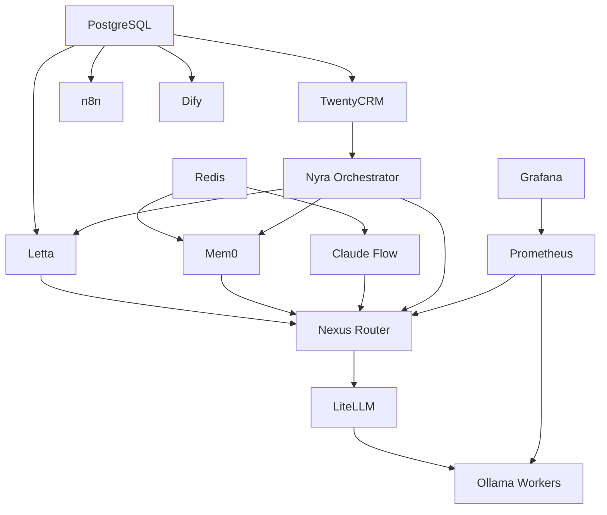

# Project Nyra - Infrastructure Architecture

**Version**: 2.0.0
**Date**: 2026-01-21
**Status**: Production Deployment
**Infrastructure Type**: Hybrid (4-PC Local + Cloud Services)

---

## Table of Contents

1. [Physical Infrastructure](#physical-infrastructure)
2. [Network Architecture](#network-architecture)
3. [Docker Compose Organization](#docker-compose-organization)
4. [Port Allocation Standard](#port-allocation-standard)
5. [Volume Management & Storage](#volume-management--storage)
6. [Environment Configuration](#environment-configuration)
7. [Deployment Procedures](#deployment-procedures)
8. [Monitoring & Observability](#monitoring--observability)
9. [Backup & Disaster Recovery](#backup--disaster-recovery)
10. [Security Configuration](#security-configuration)

---

## Physical Infrastructure

### Hardware Specifications

#### PC1: Orchestrator (Minisforum UH680)

**Role**: Coordination, databases, MCP servers, monitoring

**Specifications**:
- **CPU**: AMD Ryzen 7 6800H (8 cores, 16 threads)
- **RAM**: 16GB DDR5-4800
- **Storage**: 1TB NVMe SSD (PCIe 4.0)
- **Network**: Gigabit Ethernet (static IP: 192.168.1.100)
- **OS**: Windows 11 Pro + WSL2 (Ubuntu 22.04)
- **Power**: 65W TDP (low power consumption)

**Deployed Services** (25 containers):
```yaml
# Infrastructure Layer
- postgres (PostgreSQL 15 + pgvector)
- postgres-letta (Letta database)
- postgres-twenty (TwentyCRM database)
- postgres-n8n (n8n database)
- postgres-dify (Dify database)
- redis (Cache + queue)
- qdrant (Vector storage)
- falkordb (Graph database)
- neo4j (Knowledge graphs)

# MCP Layer
- nexus-router (Unified gateway)
- litellm (Model proxy)
- letta (Memory server)
- mem0 (Universal memory)
- archon-os (Orchestrator)
- ruvector (Vector storage)
- ruvector (Search optimization)
- infisical (Secrets vault)
- infisical-mongo (Secrets metadata)

# Application Layer
- twenty (CRM)
- n8n (Workflows)
- dify-web (Chat UI)
- dify-api (Chat backend)
- openwebui (Dev chat)
- nyra-orchestrator (Compliance)

# Monitoring
- prometheus (Metrics)
- grafana (Dashboards)
- loki (Logs)
- alertmanager (Alerts)
- cloudflared (Tunnels)
```

**Storage Allocation**:
- OS: 100GB
- Docker volumes: 250GB
- Databases: 150GB
- Logs & monitoring: 50GB
- Free space: 450GB

---

#### PC2: Worker RTX 3060 (Gaming PC)

**Role**: General-purpose GPU inference

**Specifications**:
- **GPU**: NVIDIA RTX 3060 12GB GDDR6
- **CPU**: AMD Ryzen 7 5800X (8 cores, 16 threads)
- **RAM**: 32GB DDR4-3600
- **Storage**: 1TB NVMe SSD
- **Network**: Gigabit Ethernet (static IP: 192.168.1.101)
- **OS**: Windows 11 Pro + WSL2
- **Power**: 350W TDP (GPU + CPU)

**Deployed Services** (5 containers):
```yaml
- ollama (Local LLM inference)
- litellm-proxy (Local routing)
- model-manager (Model lifecycle)
- perf-monitor (GPU metrics)
- redis-worker (Local cache)
```

**GPU Models**:
- Llama 3.1 8B (Code)
- CodeLlama 13B
- Mistral 7B
- DeepSeek Coder 6.7B

---

#### PC3: Worker RTX 5090 (Flagship)

**Role**: Heavy AI workloads, model training

**Specifications**:
- **GPU**: NVIDIA RTX 5090 32GB GDDR7 (FLAGSHIP)
- **CPU**: AMD Ryzen 9 7950X (16 cores, 32 threads)
- **RAM**: 128GB DDR5-6000
- **Storage**: 4TB NVMe SSD (PCIe 5.0)
- **Network**: 10Gb Ethernet (static IP: 192.168.1.102)
- **OS**: Windows 11 Pro + WSL2
- **Power**: 600W TDP (flagship GPU)

**Deployed Services** (8 containers):
```yaml
- ollama (70B+ models)
- vllm (Fast inference)
- litellm-proxy
- model-manager
- perf-monitor
- memory-service (Heavy operations)
- fine-tuning-service (Model training)
- embedding-service
```

**GPU Models**:
- Llama 3.1 70B
- Qwen 2.5 72B
- Mixtral 8x22B
- CodeLlama 70B
- Custom fine-tuned models

---

#### PC4: Worker RTX 3090 Ti (Media Server)

**Role**: Document OCR, media processing

**Specifications**:
- **GPU**: NVIDIA RTX 3090 Ti 24GB GDDR6X
- **CPU**: AMD Ryzen 9 5950X (16 cores, 32 threads)
- **RAM**: 64GB DDR4-3600
- **Storage**: 2TB NVMe SSD + 10TB HDD (media)
- **Network**: 2.5Gb Ethernet (static IP: 192.168.1.103)
- **OS**: Windows 11 Pro + WSL2
- **Power**: 450W TDP (GPU + CPU)

**Deployed Services** (7 containers):
```yaml
- ollama (Large models)
- litellm-proxy
- model-manager
- perf-monitor
- doc-management (OCR)
- ingestion (Data pipelines)
- letta-knowledge (Graph processing)
```

**GPU Models**:
- Llama 3.1 8B/13B
- Phi 3 Medium
- Gemma 2 9B
- CodeLlama 13B

---

### Cloud Services (External)

| Service | Provider | Purpose | Cost |
|---------|----------|---------|------|
| **DNS** | Cloudflare | Domain management (ratehunter.net) | Free |
| **CDN** | Cloudflare | Static asset caching | Free |
| **Tunnels** | Cloudflare | Secure remote access | Free |
| **Anthropic** | Claude API | Primary LLM (Opus/Sonnet) | Pay-per-use |
| **Google** | Gemini API | Cost-efficient LLM | Pay-per-use |
| **OpenRouter** | Various models | Fallback routing | Pay-per-use |
| **Twilio** | SMS/Voice/Email | Communication | Pay-per-use |
| **GitHub** | Code hosting | Repository + CI/CD | Free (public repos) |
| **Koyeb** | Cloud VPS | Optional cloud burst | Optional |

---

## Network Architecture

### Topology Overview

```
┌─────────────────────────────────────────────────────────────────────┐
│                        Docker Network Topology                       │
├─────────────────────────────────────────────────────────────────────┤
│                                                                     │
│  nyra-core (172.20.0.0/16)          [Infrastructure Layer]         │
│    ├─ postgres (5432)                                              │
│    ├─ redis (6379)                                                 │
│    ├─ qdrant (6333)                                                │
│    ├─ falkordb (6380)                                              │
│    └─ neo4j (7474, 7687)                                           │
│                                                                     │
│  nyra-mcp (172.21.0.0/16)           [MCP Server Layer]            │
│    ├─ nexus-router (6000)                                          │
│    ├─ litellm (4000)                                               │
│    ├─ letta (8283)                                                 │
│    ├─ mem0 (4321)                                                  │
│    ├─ archon-os (3010)                                           │
│    ├─ ruvector (8080)                                               │
│    ├─ ruvector (8888)                                              │
│    └─ infisical (8082)                                             │
│                                                                     │
│  nyra-apps (172.22.0.0/16)          [Application Layer]           │
│    ├─ twenty (3000)                                                │
│    ├─ n8n (5678)                                                   │
│    ├─ dify-web (3002)                                              │
│    ├─ openwebui (8080)                                             │
│    └─ nyra-orchestrator (8010)                                     │
│                                                                     │
│  nyra-orchestrator (172.23.0.0/16)  [Coordination Layer]          │
│    ├─ prometheus (9090)                                            │
│    ├─ grafana (3005)                                               │
│    ├─ loki (3100)                                                  │
│    └─ cloudflared (tunnel)                                         │
│                                                                     │
│  nyra-worker-rtx3060 (172.24.0.0/16) [Worker 1]                   │
│  nyra-worker-rtx5090 (172.25.0.0/16) [Worker 2]                   │
│  nyra-worker-rtx3090ti (172.26.0.0/16) [Worker 3]                 │
│    ├─ ollama (11434)                                               │
│    ├─ litellm-proxy (4001)                                         │
│    ├─ model-manager (8081)                                         │
│    ├─ perf-monitor (9001)                                          │
│    └─ redis-worker (6380)                                          │
│                                                                     │
└─────────────────────────────────────────────────────────────────────┘
```

### Network Configuration

#### Docker Networks

```yaml
networks:
  nyra-core:
    driver: bridge
    ipam:
      config:
        - subnet: 172.20.0.0/16
    internal: false  # Needs external for backups

  nyra-mcp:
    driver: bridge
    ipam:
      config:
        - subnet: 172.21.0.0/16
    internal: false  # Needs external for API calls

  nyra-apps:
    driver: bridge
    ipam:
      config:
        - subnet: 172.22.0.0/16
    internal: true  # No direct external access

  nyra-orchestrator:
    driver: bridge
    ipam:
      config:
        - subnet: 172.23.0.0/16
    internal: false  # Needs external for alerting

  nyra-worker-rtx3060:
    driver: bridge
    ipam:
      config:
        - subnet: 172.24.0.0/16
    internal: true  # LAN only, no internet

  nyra-worker-rtx5090:
    driver: bridge
    ipam:
      config:
        - subnet: 172.25.0.0/16
    internal: true  # LAN only, no internet

  nyra-worker-rtx3090ti:
    driver: bridge
    ipam:
      config:
        - subnet: 172.26.0.0/16
    internal: true  # LAN only, no internet
```

#### LAN Configuration

| PC | Role | IP Address | Subnet | Gateway |
|----|------|------------|--------|---------|
| PC1 | Orchestrator | 192.168.1.100 | 255.255.255.0 | 192.168.1.1 |
| PC2 | Worker RTX3060 | 192.168.1.101 | 255.255.255.0 | 192.168.1.1 |
| PC3 | Worker RTX5090 | 192.168.1.102 | 255.255.255.0 | 192.168.1.1 |
| PC4 | Worker RTX3090Ti | 192.168.1.103 | 255.255.255.0 | 192.168.1.1 |

**DNS Servers**: 1.1.1.1, 8.8.8.8
**Wake-on-LAN**: Enabled (broadcast 192.168.1.255)

#### Cloudflare Tunnel Mappings

```yaml
# Public access via Cloudflare Tunnels
tunnels:
  nyra-orchestrator-tunnel:
    - hostname: "ratehunter.net"
      service: "http://localhost:3100"  # RateHunter landing

    - hostname: "nyra.ratehunter.net"
      service: "http://localhost:3002"  # Dify (borrower chat)

    - hostname: "crm.ratehunter.net"
      service: "http://localhost:3000"  # TwentyCRM

    - hostname: "n8n.ratehunter.net"
      service: "http://localhost:5678"  # n8n workflows

    - hostname: "grafana.ratehunter.net"
      service: "http://localhost:3005"  # Grafana monitoring

    - hostname: "api.ratehunter.net"
      service: "http://localhost:6000"  # Nexus Router API
```

#### Tailscale VPN

- **Purpose**: Secure inter-PC communication, remote access
- **Network**: 100.64.0.0/10 (CGNAT range)
- **Encryption**: WireGuard protocol
- **Access Control**: ACL-based permissions
- **Exit Node**: PC1 Orchestrator (optional)

---

## Docker Compose Organization

### Directory Structure

```
Project-Nyra/
├── infra/docker/
│   ├── docker-compose.yml              # Master composition (includes all)
│   │
│   ├── base/
│   │   ├── docker-compose.core.yml     # Infrastructure (postgres, redis, qdrant)
│   │   └── docker-compose.mcp.yml      # MCP servers (nexus, letta, mem0, etc.)
│   │
│   ├── apps/
│   │   └── docker-compose.apps.yml     # Applications (twenty, n8n, dify)
│   │
│   ├── orchestrator/
│   │   └── docker-compose.orchestrator.yml  # Coordination (prometheus, grafana)
│   │
│   └── workers/
│       ├── docker-compose.worker-rtx3060.yml   # Worker 1
│       ├── docker-compose.worker-rtx5090.yml   # Worker 2
│       └── docker-compose.worker-rtx3090ti.yml # Worker 3
│
└── .env.orchestrator          # PC1 environment
    .env.worker-3060           # PC2 environment
    .env.worker-5090           # PC3 environment
    .env.worker-3090ti         # PC4 environment
```

### Deployment Modes

#### Mode 1: Full Stack (Orchestrator + All Workers)

```bash
cd C:\Dev\Projects\Repos\Project-Nyra\infra\docker
docker-compose up -d
```

#### Mode 2: Orchestrator Only (PC1)

```bash
docker-compose -f base/docker-compose.core.yml \
               -f base/docker-compose.mcp.yml \
               -f apps/docker-compose.apps.yml \
               -f orchestrator/docker-compose.orchestrator.yml \
               up -d
```

#### Mode 3: Worker Only (PC2)

```bash
docker-compose -f workers/docker-compose.worker-rtx3060.yml up -d
```

#### Mode 4: Selective Services (Development)

```bash
# Core infrastructure only
docker-compose -f base/docker-compose.core.yml up -d

# Add MCP layer
docker-compose -f base/docker-compose.mcp.yml up -d

# Add applications
docker-compose -f apps/docker-compose.apps.yml up -d
```

### Service Dependencies



---

## Port Allocation Standard

### Orchestrator Ports (PC1)

| Port | Service | Protocol | Purpose | External |
|------|---------|----------|---------|----------|
| 3000 | TwentyCRM | HTTP | CRM interface | Via Tunnel |
| 3001 | Dify API | HTTP | Chat API (internal) | No |
| 3002 | Dify Web | HTTP | Chat interface | Via Tunnel |
| 3005 | Grafana | HTTP | Monitoring UI | Via Tunnel |
| 3010 | Claude Flow | HTTP | Orchestrator | Via MCP |
| 3100 | Loki | HTTP | Log aggregation | No |
| 4000 | LiteLLM | HTTP | Model proxy | No |
| 4321 | Mem0 | HTTP | Universal memory | No |
| 5432 | PostgreSQL | TCP | Primary database | No |
| 5433 | TwentyCRM PG | TCP | CRM database | No |
| 5434 | Dify PG | TCP | Chat database | No |
| 5435 | n8n PG | TCP | Workflow database | No |
| 5436 | Letta PG | TCP | Memory database | No |
| 5678 | n8n | HTTP | Workflows | Via Tunnel |
| 6000 | Nexus Router | HTTP | LLM gateway | Via Tunnel |
| 6333 | Qdrant | HTTP | Vector database | No |
| 6334 | Qdrant gRPC | gRPC | Vector sync | No |
| 6379 | Redis | TCP | Cache | No |
| 6380 | FalkorDB | TCP | Graph database | No |
| 7474 | Neo4j Browser | HTTP | Graph UI | Via Tunnel |
| 7687 | Neo4j Bolt | Bolt | Graph queries | No |
| 8010 | Nyra Orchestrator | HTTP | Coordination | No |
| 8080 | ruvector | HTTP | Vector storage | No |
| 8080 | OpenWebUI | HTTP | LLM chat UI | Via Tunnel |
| 8082 | Infisical | HTTP | Secrets vault | Via Tunnel |
| 8283 | Letta | HTTP | Memory server | No |
| 8284 | Letta Admin | HTTP | Memory admin | Via Tunnel |
| 8888 | RuVector | HTTP | Optimization | No |
| 9090 | Prometheus | HTTP | Metrics | Via Tunnel |
| 9093 | Alertmanager | HTTP | Alerts | Via Tunnel |

### Worker Ports (PC2-4 - Same on each)

| Port | Service | Protocol | Purpose | External |
|------|---------|----------|---------|----------|
| 4001 | LiteLLM Proxy | HTTP | Local LLM proxy | LAN Only |
| 6380 | Redis Worker | TCP | Local cache | No |
| 8081 | Model Manager | HTTP | Model lifecycle | LAN Only |
| 8091 | Health Check | HTTP | Worker health | LAN Only |
| 9001 | Performance Monitor | HTTP | GPU metrics | LAN Only |
| 11434 | Ollama | HTTP | LLM inference | LAN Only |

**Worker Access** (from orchestrator via LAN IP):
- `http://192.168.1.101:4001` (RTX 3060)
- `http://192.168.1.102:4001` (RTX 5090)
- `http://192.168.1.103:4001` (RTX 3090Ti)

---

## Volume Management & Storage

### Volume Allocation

| Volume Name | Service | Size | Backup Priority | Purpose |
|-------------|---------|------|-----------------|---------|
| postgres-data | PostgreSQL | 50GB | CRITICAL | All app databases |
| letta-pg-data | Letta Postgres | 20GB | HIGH | Conversation memory |
| twenty-pg-data | TwentyCRM Postgres | 30GB | CRITICAL | CRM lead data |
| n8n-pg-data | n8n Postgres | 10GB | HIGH | Workflow definitions |
| dify-pg-data | Dify Postgres | 15GB | MEDIUM | Chat history |
| redis-data | Redis | 5GB | MEDIUM | Cache (ephemeral) |
| qdrant-data | Qdrant | 20GB | HIGH | Vector embeddings |
| falkordb-data | FalkorDB | 10GB | HIGH | Knowledge graphs |
| neo4j-data | Neo4j | 30GB | HIGH | Advanced graphs |
| letta-data | Letta | 5GB | HIGH | Memory state |
| mem0-data | Mem0 | 10GB | HIGH | Universal memory |
| infisical-data | Infisical | 1GB | CRITICAL | Secrets vault |
| prometheus-data | Prometheus | 100GB | MEDIUM | Metrics (30d) |
| grafana-data | Grafana | 5GB | MEDIUM | Dashboard configs |
| loki-data | Loki | 50GB | MEDIUM | Logs (30d) |
| ollama-models-rtx3060 | Ollama (W1) | 50GB | LOW | Model cache |
| ollama-models-rtx5090 | Ollama (W2) | 50GB | LOW | Model cache |
| ollama-models-rtx3090ti | Ollama (W3) | 50GB | LOW | Model cache |

**Total Storage Requirements**:
- **Orchestrator (PC1)**: ~400GB (databases + monitoring)
- **Worker (PC2-4)**: ~60GB each (models + cache)
- **Total Cluster**: ~580GB

### Backup Strategy

```yaml
backup_schedule:
  critical:  # PostgreSQL, Infisical
    frequency: hourly
    retention: 7 days
    method: pg_dump, volume snapshot

  high:  # Qdrant, ruvector, Memory systems
    frequency: daily
    retention: 30 days
    method: volume snapshot

  medium:  # Monitoring, logs, cache
    frequency: weekly
    retention: 14 days
    method: volume snapshot

  low:  # Ephemeral, model cache
    frequency: none
    retention: 0 days
    method: none
```

### Backup Script

```powershell
# C:\Dev\Projects\Repos\Project-Nyra\scripts\backup-all.ps1

# PostgreSQL backup (all databases)
docker exec nyra-postgres pg_dumpall -U nyra > backup_$(Get-Date -Format yyyy-MM-dd).sql

# Qdrant backup (vector data)
docker exec nyra-qdrant curl -X POST http://localhost:6333/snapshots

# Redis backup (RDB snapshot)
docker exec nyra-redis redis-cli BGSAVE

# Infisical backup (secrets)
infisical export --projectId="${INFISICAL_PROJECT_ID}" --env="production" > secrets_backup_$(Get-Date -Format yyyy-MM-dd).json

# Volume snapshots (Windows)
wsl --export nyra-postgres postgres_backup_$(Get-Date -Format yyyy-MM-dd).tar
```

---

## Environment Configuration

### Environment File Hierarchy

```
Project-Nyra/
├── .env                          # Global defaults
├── .env.orchestrator             # PC1 specific
├── .env.worker-3060              # PC2 specific
├── .env.worker-5090              # PC3 specific
├── .env.worker-3090ti            # PC4 specific
│
└── infra/
    ├── .env                      # Infra overrides
    └── docker/
        ├── .env                  # Docker overrides
        ├── base/.env             # Core layer
        ├── apps/.env             # App layer
        ├── orchestrator/.env     # Orchestrator layer
        └── workers/
            ├── .env.rtx3060
            ├── .env.rtx5090
            └── .env.rtx3090ti
```

### Critical Environment Variables

#### Global Configuration (.env)

```bash
# Project identification
COMPOSE_PROJECT_NAME=nyra
NYRA_ENVIRONMENT=production
NYRA_PC_ROLE=orchestrator  # or worker

# Infisical secrets management
INFISICAL_PROJECT_ID=8374cea9-e5e8-4050-bda4-b91f25ab30ef
INFISICAL_UNIVERSAL_AUTH_CLIENT_ID=<secret>
INFISICAL_UNIVERSAL_AUTH_CLIENT_SECRET=<secret>

# Docker configuration
DOCKER_BUILDKIT=1
COMPOSE_DOCKER_CLI_BUILD=1
```

#### LLM API Keys (.env.orchestrator)

```bash
ANTHROPIC_API_KEY=<secret>
OPENROUTER_API_KEY=<secret>
GOOGLE_GEMINI_API_KEY=<secret>
OPENAI_API_KEY=<secret>
```

#### Database Credentials (.env.orchestrator)

```bash
# PostgreSQL
POSTGRES_PASSWORD=<secret>
POSTGRES_USER=nyra
POSTGRES_DB=nyra
POSTGRES_PORT=5432

# Redis
REDIS_PASSWORD=<secret>
REDIS_PORT=6379
REDIS_MAXMEMORY=2gb

# Neo4j
NEO4J_PASSWORD=<secret>
NEO4J_AUTH=neo4j/${NEO4J_PASSWORD}
```

#### Worker Configuration (.env.worker-*)

```bash
# Worker identification
WORKER_ID=worker-rtx3060  # or rtx5090 or rtx3090ti
GPU_TYPE=rtx_3060  # or rtx_5090 or rtx_3090ti
VRAM_GB=12  # or 32 or 24

# Ollama
NVIDIA_VISIBLE_DEVICES=0
OLLAMA_HOST=0.0.0.0
OLLAMA_KEEP_ALIVE=5m
OLLAMA_MAX_LOADED_MODELS=2

# Orchestrator connection
ORCHESTRATOR_URL=http://192.168.1.100:8080
PROMETHEUS_PUSH_GATEWAY=http://192.168.1.100:9091
```

### Secrets Management with Infisical

```bash
# Infisical path structure
/nyra/orchestrator/production
/nyra/orchestrator/staging
/nyra/orchestrator/development

/nyra/worker-3060/production
/nyra/worker-5090/production
/nyra/worker-3090ti/production

/nyra/shared/production  # Shared secrets (API keys)

# Inject secrets at runtime
infisical run --projectId="8374cea9-e5e8-4050-bda4-b91f25ab30ef" \
  --env="production" \
  --path="/nyra/orchestrator" \
  -- docker-compose up -d
```

---

## Deployment Procedures

### Initial Deployment Checklist

#### Pre-Deployment
- [ ] All PCs have Docker + Docker Compose installed
- [ ] Network connectivity between all PCs verified
- [ ] GPU drivers installed (NVIDIA Container Toolkit)
- [ ] Storage volumes created on each PC
- [ ] Environment files configured (.env for each PC)
- [ ] Infisical secrets synced
- [ ] Port conflict check passed (`scripts/check-ports.ps1`)

#### Deployment Steps

**Step 1: Deploy Core Infrastructure (PC1)**

```bash
cd C:\Dev\Projects\Repos\Project-Nyra\infra\docker

# Start databases first
docker-compose -f base/docker-compose.core.yml up -d postgres redis qdrant neo4j

# Wait for health checks (30 seconds)
Start-Sleep -Seconds 30

# Verify database health
docker ps --filter "name=nyra-postgres"
docker logs nyra-postgres --tail=20
```

**Step 2: Deploy MCP Layer (PC1)**

```bash
# Start MCP servers
docker-compose -f base/docker-compose.mcp.yml up -d

# Verify MCP health
docker ps --filter "name=nyra-nexus"
curl http://localhost:6000/health
```

**Step 3: Deploy Applications (PC1)**

```bash
# Start applications
docker-compose -f apps/docker-compose.apps.yml up -d

# Verify app health
curl http://localhost:3000/health  # TwentyCRM
curl http://localhost:5678/healthz # n8n
curl http://localhost:3002/health  # Dify
```

**Step 4: Deploy Monitoring (PC1)**

```bash
# Start monitoring stack
docker-compose -f orchestrator/docker-compose.orchestrator.yml up -d

# Verify monitoring
curl http://localhost:9090/-/healthy  # Prometheus
curl http://localhost:3005/api/health # Grafana
```

**Step 5: Deploy Workers (PC2-4)**

```bash
# On PC2 (RTX 3060)
docker-compose -f workers/docker-compose.worker-rtx3060.yml up -d

# On PC3 (RTX 5090)
docker-compose -f workers/docker-compose.worker-rtx5090.yml up -d

# On PC4 (RTX 3090 Ti)
docker-compose -f workers/docker-compose.worker-rtx3090ti.yml up -d

# Verify worker health
curl http://192.168.1.101:8091/health
curl http://192.168.1.102:8091/health
curl http://192.168.1.103:8091/health
```

**Step 6: Verify Cross-PC Connectivity**

```bash
# Test worker registration
docker exec nyra-nexus curl http://192.168.1.101:4001/health
docker exec nyra-nexus curl http://192.168.1.102:4001/health
docker exec nyra-nexus curl http://192.168.1.103:4001/health
```

**Step 7: Configure Cloudflare Tunnels**

```bash
# Start cloudflared
docker-compose -f orchestrator/docker-compose.orchestrator.yml up -d cloudflared

# Verify tunnel status
docker logs nyra-cloudflared --tail=50
cloudflared tunnel list
```

### Post-Deployment Validation

```bash
# Run smoke tests
.\scripts\smoke-test.ps1

# Check all services
.\scripts\health-check.ps1

# Verify Grafana dashboards
Start-Process "http://grafana.ratehunter.net"

# Test end-to-end workflow
curl -X POST http://localhost:6000/api/v1/chat \
  -H "Content-Type: application/json" \
  -d '{"message": "Hello, test query"}'
```

---

## Monitoring & Observability

### Metrics Collection

**Prometheus Scrape Configuration** (`configs/observability/prometheus.yml`):

```yaml
scrape_configs:
  - job_name: 'nexus-router'
    static_configs:
      - targets: ['nexus-router:6000']
    scrape_interval: 15s

  - job_name: 'archon-os'
    static_configs:
      - targets: ['archon-os:3010']
    scrape_interval: 30s

  - job_name: 'workers'
    static_configs:
      - targets:
        - '192.168.1.101:9001'  # Worker RTX3060
        - '192.168.1.102:9001'  # Worker RTX5090
        - '192.168.1.103:9001'  # Worker RTX3090Ti
    scrape_interval: 10s

  - job_name: 'postgres'
    static_configs:
      - targets: ['postgres-exporter:9187']
    scrape_interval: 30s

  - job_name: 'redis'
    static_configs:
      - targets: ['redis-exporter:9121']
    scrape_interval: 30s
```

### Grafana Dashboards

**Pre-configured dashboards**:

1. **System Overview**: CPU, memory, disk, network
2. **GPU Metrics**: Utilization, temperature, VRAM
3. **LLM Routing**: Model usage, costs, latency
4. **Database Performance**: Query times, connections
5. **Application Health**: Uptime, error rates
6. **Business Metrics**: Leads, conversions, pipeline

### Alerting Rules

```yaml
# configs/observability/alerts.yml
groups:
  - name: infrastructure
    rules:
      - alert: HighMemoryUsage
        expr: (1 - (node_memory_MemAvailable_bytes / node_memory_MemTotal_bytes)) * 100 > 90
        for: 5m
        labels:
          severity: warning
        annotations:
          summary: "High memory usage on {{ $labels.instance }}"

      - alert: DatabaseDown
        expr: up{job="postgres"} == 0
        for: 1m
        labels:
          severity: critical
        annotations:
          summary: "PostgreSQL database is down"

      - alert: GPUTemperatureHigh
        expr: nvidia_gpu_temperature_celsius > 85
        for: 5m
        labels:
          severity: warning
        annotations:
          summary: "GPU temperature high on {{ $labels.instance }}"
```

---

## Backup & Disaster Recovery

### Automated Backup Script

```powershell
# C:\Dev\Projects\Repos\Project-Nyra\scripts\backup-all.ps1

param(
    [switch]$FullBackup,
    [switch]$IncrementalBackup
)

$BackupDate = Get-Date -Format "yyyy-MM-dd-HHmmss"
$BackupPath = "E:\Backups\Nyra\$BackupDate"

New-Item -ItemType Directory -Path $BackupPath -Force

Write-Host "🔄 Starting Nyra backup..." -ForegroundColor Cyan

# PostgreSQL backup
Write-Host "📦 Backing up PostgreSQL..." -ForegroundColor Yellow
docker exec nyra-postgres pg_dumpall -U nyra | Out-File "$BackupPath\postgres.sql"

# Qdrant snapshot
Write-Host "📦 Backing up Qdrant..." -ForegroundColor Yellow
docker exec nyra-qdrant curl -X POST http://localhost:6333/snapshots | Out-File "$BackupPath\qdrant-snapshot.json"

# Redis RDB
Write-Host "📦 Backing up Redis..." -ForegroundColor Yellow
docker exec nyra-redis redis-cli BGSAVE
Start-Sleep -Seconds 5
docker cp nyra-redis:/data/dump.rdb "$BackupPath\redis.rdb"

# Infisical secrets
Write-Host "📦 Backing up Infisical..." -ForegroundColor Yellow
infisical export --projectId="8374cea9-e5e8-4050-bda4-b91f25ab30ef" --env="production" | Out-File "$BackupPath\secrets.json"

# Volume snapshots
Write-Host "📦 Backing up volumes..." -ForegroundColor Yellow
$volumes = @("postgres-data", "qdrant-data", "neo4j-data", "grafana-data")
foreach ($vol in $volumes) {
    wsl --export nyra-$vol "$BackupPath\volume-$vol.tar"
}

Write-Host "✅ Backup completed: $BackupPath" -ForegroundColor Green
```

### Disaster Recovery Procedure

```bash
# 1. Stop all services
docker-compose down

# 2. Restore volumes
wsl --import nyra-postgres $BackupPath\volume-postgres-data.tar

# 3. Restore PostgreSQL
cat $BackupPath\postgres.sql | docker exec -i nyra-postgres psql -U nyra

# 4. Restore Redis
docker cp $BackupPath\redis.rdb nyra-redis:/data/dump.rdb
docker restart nyra-redis

# 5. Restore Qdrant
curl -X POST http://localhost:6333/snapshots/recover -d @$BackupPath\qdrant-snapshot.json

# 6. Restore Infisical
infisical import --projectId="..." --env="production" < $BackupPath\secrets.json

# 7. Restart services
docker-compose up -d

# 8. Verify health
.\scripts\health-check.ps1
```

---

## Security Configuration

### Firewall Rules (Windows Firewall)

```powershell
# Allow Docker networks
New-NetFirewallRule -DisplayName "Docker Bridge" -Direction Inbound -Action Allow -LocalAddress 172.20.0.0/12

# Allow LAN access from orchestrator
New-NetFirewallRule -DisplayName "Nyra Orchestrator" -Direction Inbound -Action Allow -RemoteAddress 192.168.1.100

# Allow worker communication
New-NetFirewallRule -DisplayName "Nyra Workers" -Direction Inbound -Action Allow -RemoteAddress 192.168.1.101-192.168.1.103

# Block all other incoming
New-NetFirewallRule -DisplayName "Block Nyra External" -Direction Inbound -Action Block -RemoteAddress 0.0.0.0/0
```

### TLS Configuration

```yaml
# Self-signed certificates for development
services:
  nginx:
    volumes:
      - ./certs/self-signed.crt:/etc/nginx/ssl/cert.crt:ro
      - ./certs/self-signed.key:/etc/nginx/ssl/cert.key:ro
```

**Generate self-signed certificate**:

```bash
openssl req -x509 -nodes -days 365 -newkey rsa:2048 \
  -keyout self-signed.key \
  -out self-signed.crt \
  -subj "/C=US/ST=State/L=City/O=Nyra/CN=*.ratehunter.net"
```

---

## Troubleshooting

### Common Issues

#### Service Not Starting

```bash
# Check logs
docker logs nyra-<service-name> --tail=100

# Check port conflicts
netstat -ano | findstr :<port>

# Verify environment variables
docker-compose config

# Check disk space
df -h
```

#### Cannot Connect to Service

```bash
# Verify service is running
docker ps | grep <service>

# Check health status
docker inspect <container-name> | jq '.[].State.Health'

# Test connectivity
docker exec <container> curl http://<target>:port/health

# Verify DNS resolution
docker exec <container> nslookup <target>
```

#### High Memory Usage

```bash
# Check resource usage
docker stats

# Review resource limits
cat docker-compose.yml | grep -A5 "resources:"

# Restart service
docker-compose restart <service>
```

---

## References

- [Architecture Overview](./ARCHITECTURE-OVERVIEW.md)
- [Architecture Decisions](./ARCHITECTURE-DECISIONS.md)
- [Integration Guide](./INTEGRATIONS.md)
- [Docker Compose Documentation](https://docs.docker.com/compose/)
- [Cloudflare Tunnel Documentation](https://developers.cloudflare.com/cloudflare-one/connections/connect-apps/)

---

**Last Updated**: 2026-01-21
**Maintained By**: Infrastructure Team
**Review Cycle**: Monthly
**Next Review**: 2026-02-21
