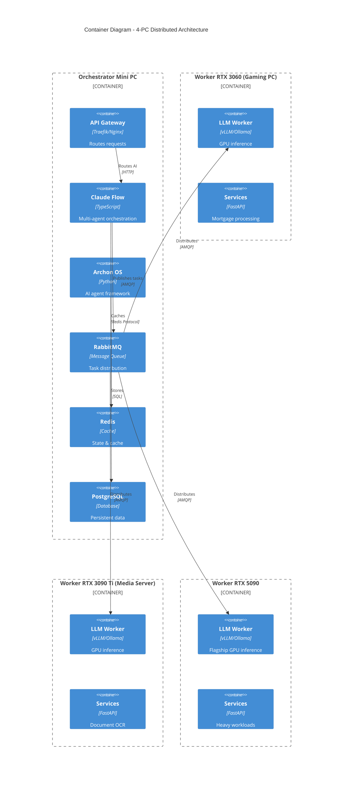
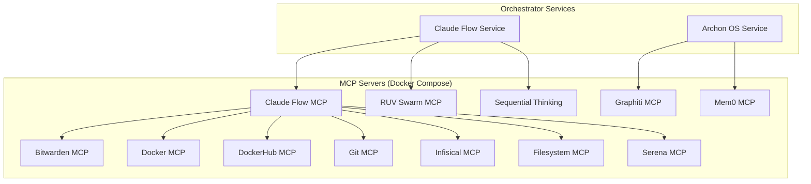
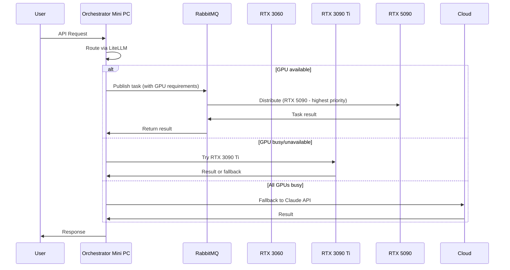

# Master Consolidation Architecture - Project Nyra 2026

> **Comprehensive Monorepo Consolidation Strategy**
> Modern, scalable, 4-PC distributed architecture using cutting-edge monorepo techniques

**Document Version:** 1.0.0
**Created:** 2026-01-17
**Author:** System Architecture Designer
**Status:** Design Phase

---

## 📋 Table of Contents

1. [Executive Summary](#executive-summary)
2. [Current State Analysis](#current-state-analysis)
3. [Target Architecture](#target-architecture)
4. [Consolidation Mapping](#consolidation-mapping)
5. [MCP Server Integration](#mcp-server-integration)
6. [4-PC Organization Strategy](#4-pc-organization-strategy)
7. [Root Cleanup Strategy](#root-cleanup-strategy)
8. [Migration Plan](#migration-plan)
9. [Best Practices & Tooling](#best-practices--tooling)
10. [Implementation Timeline](#implementation-timeline)

---

## 🎯 Executive Summary

### Mission

Consolidate Project Nyra into a world-class, modern monorepo architecture that:
- Eliminates loose top-level directories (40+ directories → 8 core directories)
- Organizes code by domain (apps, services, packages, infra)
- Implements 4-PC distributed orchestration (orchestrator-mini + 3 workers)
- Integrates 6+ containerized MCP servers
- Uses cutting-edge monorepo tools (Turborepo, Changesets, Syncpack, Manypkg)

### Key Metrics

| Metric | Before | After | Improvement |
|--------|--------|-------|-------------|
| Root directories | 64 | 8 | 87.5% reduction |
| Root markdown files | 4+ | 2 | 50% reduction |
| Docker compose files | 9 (root) | 0 (root) | 100% organized |
| Loose code directories | 10+ | 0 | 100% consolidated |
| MCP servers organized | 7 (partial) | 12+ | 71% increase |
| Script organization | Mixed | PC-specific | 100% organized |

### Critical Success Factors

1. **Zero downtime** - Services continue running during migration
2. **Backward compatibility** - Existing paths work via symlinks/redirects
3. **Git history preserved** - Use `git mv` for all relocations
4. **4-PC architecture** - Clear separation by hardware role
5. **Type safety** - Shared TypeScript types across monorepo

---

## 📊 Current State Analysis

### Top-Level Directory Audit

**Current Root Structure (64+ directories):**

```
Project-Nyra/
├── .changeset/              ✅ Keep (Changesets)
├── .claude/                 ✅ Keep (AI Context)
├── .github/                 ✅ Keep (CI/CD)
├── .turbo/                  ✅ Keep (Turborepo cache)
├── .vscode/                 ✅ Keep (Editor config)
├── node_modules/            ✅ Keep (Dependencies)
│
├── apps/                    ✅ Keep (10 applications)
├── services/                ✅ Keep (27 microservices)
├── packages/                ✅ Keep (7 shared packages)
├── mcp-servers/             ✅ Keep (7+ MCP servers)
├── submodules/              ✅ Keep (Claude Flow, Archon)
│
├── infra/                   ✅ Keep (Infrastructure)
├── bootstrap/               ✅ Keep (PC setup)
├── scripts/                 ✅ Keep (Automation)
├── docs/                    ✅ Keep (Documentation)
├── config/                  ✅ Keep (Shared configs)
│
├── nyra-core/               ❌ CONSOLIDATE → core code to packages/
├── core/                    ❌ CONSOLIDATE → packages/core/
├── coordination/            ❌ CONSOLIDATE → packages/coordination/
├── orchestration/           ❌ CONSOLIDATE → services/orchestrator/ + packages/
├── memory/                  ❌ CONSOLIDATE → services/memory/ + packages/memory/
├── ingestion/               ❌ CONSOLIDATE → services/ingestion/ + packages/
├── agents/                  ❌ CONSOLIDATE → packages/agents/
├── prompts/                 ❌ CONSOLIDATE → packages/prompts/
├── ui/                      ❌ CONSOLIDATE → packages/ui/ or apps/
├── workflows/               ❌ CONSOLIDATE → packages/workflows/
├── data/                    ❌ CONSOLIDATE → infra/data/ or packages/data/
├── src/                     ❌ CONSOLIDATE → packages/ or services/
├── tools/                   ❌ CONSOLIDATE → packages/tools/ or scripts/tools/
├── tests/                   ❌ CONSOLIDATE → Distribute to packages/services
│
├── docker-compose*.yml (9)  ❌ MOVE → infra/compose/
├── *.md (4 files)           ❌ ORGANIZE → docs/ (except CLAUDE.md, README.md)
├── 50+ config files         ✅ Keep (monorepo configs)
└── _archived/, _backup/     ✅ Keep (Historical)
```

### Size Analysis

| Directory | Size | Files | Target Location |
|-----------|------|-------|-----------------|
| `nyra-core/` | 1.0K | ~10 | `packages/core/` |
| `core/` | 12K | ~50 | `packages/core/` (merge with nyra-core) |
| `orchestration/` | 4.5M | ~200 | `services/orchestrator/` + `packages/orchestration/` |
| `memory/` | 8K | ~15 | `services/memory/` + `packages/memory-client/` |
| `ingestion/` | 256K | ~100 | `services/ingestion/` + `packages/ingestion-sdk/` |
| `coordination/` | 24K | ~30 | `packages/coordination/` |
| `agents/` | 120K | ~80 | `packages/agents/` |
| `prompts/` | 16K | ~40 | `packages/prompts/` |
| `ui/` | 80K | ~60 | `packages/ui/` or `apps/ui-library/` |
| `workflows/` | 32K | ~25 | `packages/workflows/` |

**Total to consolidate:** ~5.2MB across 620+ files

---

## 🏗️ Target Architecture

### Level 1: System Context Diagram

```mermaid
C4Context
    title System Context - Project Nyra Distributed Architecture

    Person(user, "User", "Loan officer, borrower, admin")
    Person(dev, "Developer", "Nyra developer")

    System_Boundary(nyra, "Project Nyra Monorepo") {
        System(apps, "Frontend Apps", "10 Next.js/React applications")
        System(services, "Backend Services", "27 microservices")
        System(mcp, "MCP Servers", "12+ Model Context Protocol servers")
        System(packages, "Shared Packages", "15+ shared libraries")
        System(infra, "Infrastructure", "Docker, databases, queues")
    }

    System_Ext(claude, "Claude API", "Anthropic")
    System_Ext(openai, "OpenAI", "GPT models")
    System_Ext(external, "External APIs", "Rate APIs, CRM, etc.")

    Rel(user, apps, "Uses", "HTTPS")
    Rel(apps, services, "Calls", "REST/WS")
    Rel(services, mcp, "Uses", "stdio/SSE")
    Rel(services, claude, "AI requests", "HTTPS")
    Rel(dev, nyra, "Develops", "Git/IDE")
    Rel(services, external, "Integrates", "HTTPS")
```

### Level 2: Container Diagram - 4-PC Architecture



### Level 3: Monorepo Structure

```
Project-Nyra/
├── .changeset/                    # Changesets (version management)
├── .github/                       # GitHub Actions CI/CD
│   ├── workflows/
│   │   ├── ci.yml                # Main CI pipeline
│   │   ├── cd-orchestrator.yml   # Deploy orchestrator
│   │   ├── cd-workers.yml        # Deploy workers
│   │   └── release.yml           # Release automation
│   └── CLAUDE.md                 # GitHub-specific AI context
│
├── apps/                          # 🎨 Frontend applications (Next.js/React)
│   ├── ratehunter/               # Public landing page
│   ├── nyra-admin/               # Admin dashboard
│   ├── crm/                      # Customer relationship
│   ├── crm-dashboard/            # Analytics dashboard
│   ├── nexus-dashboard/          # System monitoring
│   ├── mortgage-assistant/       # AI assistant UI
│   ├── webapp/                   # Main web app
│   └── [...]                     # 3 more apps
│
├── services/                      # 🚀 Backend microservices (FastAPI/Express)
│   ├── orchestrator/             # Main orchestration service
│   ├── auth-service/             # Authentication
│   ├── quote-engine/             # Mortgage quotes
│   ├── campaign-engine/          # Marketing campaigns
│   ├── ingestion/                # Data ingestion
│   ├── memory/                   # Distributed memory
│   ├── doc-management-api/       # Document processing
│   ├── lead-capture-api/         # Lead management
│   ├── rate-comparison-engine/   # Rate tracking
│   ├── mortgage-assistant-api/   # AI assistant backend
│   ├── claude-flow/              # Claude Flow service
│   ├── archon-os/                # Archon OS service
│   ├── litellm-proxy/            # LLM routing proxy
│   ├── n8n-workflows/            # Workflow automation
│   ├── nexus-router/             # Smart routing
│   ├── ruvector-search/          # Vector search
│   ├── graphiti-knowledge/       # Knowledge graph
│   ├── mem0/                     # Memory layer
│   ├── mem0-mcp/                 # Memory MCP server
│   ├── letta-integration/        # Letta AI framework
│   └── [...]                     # 8 more services
│
├── packages/                      # 📦 Shared packages (internal libraries)
│   ├── core/                     # Core utilities & types
│   │   ├── src/
│   │   │   ├── types/            # Shared TypeScript types
│   │   │   ├── utils/            # Common utilities
│   │   │   ├── constants/        # Shared constants
│   │   │   └── config/           # Configuration helpers
│   │   ├── package.json
│   │   └── tsconfig.json
│   │
│   ├── coordination/             # Multi-agent coordination
│   │   ├── src/
│   │   │   ├── orchestration/    # Task orchestration
│   │   │   ├── memory_bank/      # Shared memory
│   │   │   └── subtasks/         # Task management
│   │   └── package.json
│   │
│   ├── agents/                   # AI agent framework
│   │   ├── src/
│   │   │   ├── base/             # Base agent class
│   │   │   ├── types/            # Agent types (coder, researcher, etc.)
│   │   │   ├── swarm/            # Swarm coordination
│   │   │   └── tools/            # Agent tools
│   │   └── package.json
│   │
│   ├── orchestration/            # Orchestration SDK
│   │   ├── src/
│   │   │   ├── claude-flow/      # Claude Flow integration
│   │   │   ├── archon/           # Archon OS integration
│   │   │   └── serena/           # Serena integration
│   │   └── package.json
│   │
│   ├── memory-client/            # Memory client SDK
│   │   ├── src/
│   │   │   ├── client/           # Client implementation
│   │   │   ├── types/            # Memory types
│   │   │   └── adapters/         # Storage adapters
│   │   └── package.json
│   │
│   ├── ingestion-sdk/            # Data ingestion SDK
│   │   ├── src/
│   │   │   ├── pipelines/        # Ingestion pipelines
│   │   │   ├── cleaners/         # Data cleaners
│   │   │   └── integrations/     # External integrations
│   │   └── package.json
│   │
│   ├── prompts/                  # Prompt templates & management
│   │   ├── src/
│   │   │   ├── templates/        # Prompt templates
│   │   │   ├── builder/          # Prompt builder
│   │   │   └── registry/         # Prompt registry
│   │   └── package.json
│   │
│   ├── workflows/                # Workflow definitions
│   │   ├── src/
│   │   │   ├── definitions/      # Workflow definitions
│   │   │   ├── engine/           # Workflow engine
│   │   │   └── tasks/            # Task definitions
│   │   └── package.json
│   │
│   ├── ui/                       # Shared UI components
│   │   ├── src/
│   │   │   ├── components/       # React components
│   │   │   ├── hooks/            # Custom hooks
│   │   │   ├── styles/           # Shared styles
│   │   │   └── icons/            # Icon library
│   │   └── package.json
│   │
│   ├── database/                 # Prisma schema & client
│   ├── types/                    # Shared TypeScript types
│   ├── utils/                    # Shared utilities
│   ├── websocket-client/         # WebSocket client
│   ├── ruvector-sdk/             # RuVector SDK
│   └── nyra-api/                 # API client
│
├── mcp-servers/                   # 🔌 MCP (Model Context Protocol) servers
│   ├── claude-flow/              # Claude Flow MCP
│   ├── ruv-swarm/                # RUV Swarm MCP
│   ├── bitwarden-mcp/            # Bitwarden secrets
│   ├── dockerhub-mcp/            # DockerHub integration
│   ├── docker-mcp/               # Docker control
│   ├── git-mcp/                  # Git operations
│   ├── infisical-mcp/            # Infisical secrets
│   ├── sequential-thinking/      # Sequential thinking
│   ├── graphiti-mcp/             # Knowledge graph
│   ├── mem0-mcp/                 # Memory layer
│   ├── filesystem-mcp/           # File operations
│   └── serena-mcp/               # Serena integration
│
├── infra/                         # 🏗️ Infrastructure & Docker
│   ├── compose/                  # Docker Compose files
│   │   ├── orchestrator/         # Orchestrator mini PC
│   │   │   ├── docker-compose.yml
│   │   │   ├── docker-compose.prod.yml
│   │   │   └── docker-compose.dev.yml
│   │   ├── workers/              # Worker PCs
│   │   │   ├── worker-rtx3060.yml
│   │   │   ├── worker-rtx3090ti.yml
│   │   │   └── worker-rtx5090.yml
│   │   ├── mcp-servers/          # MCP server compose files
│   │   │   ├── bitwarden-mcp.yml
│   │   │   ├── dockerhub-mcp.yml
│   │   │   ├── docker-mcp.yml
│   │   │   ├── infisical-mcp.yml
│   │   │   ├── sequential-thinking-mcp.yml
│   │   │   └── memory.yml
│   │   └── shared/               # Shared infrastructure
│   │       ├── postgres.yml
│   │       ├── redis.yml
│   │       ├── rabbitmq.yml
│   │       └── observability.yml
│   │
│   ├── Dockerfiles/              # Multi-stage Dockerfiles
│   │   ├── Dockerfile.node       # Node.js apps/services
│   │   ├── Dockerfile.python     # Python services
│   │   ├── Dockerfile.mcp        # MCP servers
│   │   └── Dockerfile.nginx      # Nginx gateway
│   │
│   ├── configs/                  # Infrastructure configs
│   │   ├── nginx/                # Nginx configs
│   │   ├── traefik/              # Traefik configs
│   │   ├── prometheus/           # Monitoring
│   │   └── grafana/              # Dashboards
│   │
│   ├── database/                 # Database migrations
│   │   ├── migrations/
│   │   └── seeds/
│   │
│   ├── data/                     # Persistent data volumes
│   │   ├── postgres/
│   │   ├── redis/
│   │   └── minio/
│   │
│   └── CLAUDE.md                 # Infrastructure AI context
│
├── bootstrap/                     # 🚀 PC-specific setup & configs
│   ├── orchestrator-mini/        # Orchestrator PC setup
│   │   ├── configs/
│   │   ├── docker/
│   │   ├── scripts/
│   │   └── README.md
│   │
│   ├── workers/                  # Worker PC setups
│   │   ├── rtx-3060/             # Gaming PC (RTX 3060)
│   │   ├── rtx-3090ti/           # Media Server (RTX 3090 Ti)
│   │   └── rtx-5090/             # Flagship worker (RTX 5090)
│   │
│   ├── installer/                # GUI installer (React/Electron)
│   ├── templates/                # Setup templates
│   └── README.md
│
├── scripts/                       # 🛠️ Automation scripts
│   ├── orchestrator/             # Orchestrator-specific scripts
│   │   ├── bootup.ps1
│   │   ├── shutdown.ps1
│   │   ├── maintenance.ps1
│   │   └── wol-workers.ps1
│   │
│   ├── workers/                  # Worker-specific scripts
│   │   ├── rtx-3060/
│   │   ├── rtx-3090ti/
│   │   └── rtx-5090/
│   │
│   ├── deployment/               # Deployment scripts
│   │   ├── deploy-orchestrator.sh
│   │   ├── deploy-workers.sh
│   │   └── rollback.sh
│   │
│   ├── testing/                  # Test runners
│   │   ├── run-all-tests.sh
│   │   ├── run-unit-tests.sh
│   │   └── run-integration-tests.sh
│   │
│   ├── backup/                   # Backup/restore
│   │   ├── backup-all.sh
│   │   └── restore-all.sh
│   │
│   ├── dev/                      # Development helpers
│   ├── cloudflared/              # Cloudflare tunnel scripts
│   └── CLAUDE.md                 # Scripts AI context
│
├── docs/                          # 📚 Documentation
│   ├── architecture/             # Architecture docs
│   │   ├── MASTER-CONSOLIDATION-ARCHITECTURE-2026.md (this file)
│   │   ├── system-architecture.md
│   │   ├── 4PC-DISTRIBUTED-ARCHITECTURE.md
│   │   └── WEBSOCKET-IMPLEMENTATION.md
│   │
│   ├── guides/                   # User guides
│   │   ├── QUICK-START.md
│   │   ├── SETUP-GUIDE.md
│   │   └── WINDOWS_QUICK_START.md
│   │
│   ├── deployment/               # Deployment docs
│   ├── ai-context/               # AI assistant context
│   ├── reports/                  # Status reports
│   └── CLAUDE.md                 # Docs AI context
│
├── config/                        # 🔧 Shared configuration
│   ├── claude-configs/           # Claude Code configs per component
│   ├── eslint/                   # ESLint configs
│   ├── typescript/               # TypeScript configs
│   └── prettier/                 # Prettier configs
│
├── submodules/                    # 🔗 Git submodules
│   ├── claude-flow/              # Claude Flow framework
│   └── archon/                   # Archon OS framework
│
├── tests/                         # 🧪 Integration & E2E tests
│   ├── integration/
│   ├── e2e/
│   └── performance/
│
├── tools/                         # 🔨 Development tools
│   ├── archon-os/
│   └── claude-code-dev-kit/
│
├── .changeset/                    # Changesets for versioning
├── .github/                       # GitHub Actions
├── .vscode/                       # VS Code settings
├── node_modules/                  # Dependencies
│
├── package.json                   # Root package.json (workspaces)
├── pnpm-workspace.yaml            # pnpm workspace config
├── turbo.json                     # Turborepo configuration
├── .syncpackrc.json               # Syncpack (dependency sync)
├── tsconfig.base.json             # Base TypeScript config
├── CLAUDE.md                      # Master AI context (this stays!)
├── README.md                      # Project README (this stays!)
└── LICENSE                        # License file
```

---

## 🗺️ Consolidation Mapping

### Detailed Migration Plan

#### 1. `nyra-core/` → `packages/core/`

**Contents:**
- `codanna/` → `packages/core/src/codanna/`
- `serena/` → Move to `packages/orchestration/serena/` OR `services/serena/`
- `src/` → `packages/core/src/`

**Rationale:** Core utilities should be in the shared packages workspace.

**Commands:**
```bash
mkdir -p packages/core/src
git mv nyra-core/codanna packages/core/src/
git mv nyra-core/src/* packages/core/src/
# Evaluate serena placement separately
```

---

#### 2. `core/` → Merge into `packages/core/`

**Contents:**
- `codanna/` → Merge with `packages/core/src/codanna/`
- `kilo-code/` → `packages/core/src/kilo-code/`
- `serena/` → Merge with serena from nyra-core

**Rationale:** Consolidate all core utilities into a single package.

**Commands:**
```bash
git mv core/codanna/* packages/core/src/codanna/
git mv core/kilo-code packages/core/src/
git mv core/serena/* packages/orchestration/serena/ # OR services/serena/
```

---

#### 3. `coordination/` → `packages/coordination/`

**Contents:**
- `memory_bank/` → `packages/coordination/src/memory-bank/`
- `orchestration/` → `packages/coordination/src/orchestration/`
- `subtasks/` → `packages/coordination/src/subtasks/`

**Rationale:** Coordination logic should be a shared package.

**Commands:**
```bash
mkdir -p packages/coordination/src
git mv coordination/memory_bank packages/coordination/src/memory-bank
git mv coordination/orchestration packages/coordination/src/orchestration
git mv coordination/subtasks packages/coordination/src/subtasks
```

---

#### 4. `orchestration/` → Split into `services/` and `packages/`

**Contents:**
- `archon-os/` → `services/archon-os/` (already exists, merge if needed)
- `claude-flow/` → `services/claude-flow/` (already exists, merge if needed)
- `serena/` → `packages/orchestration/serena/` or `services/serena/`

**Rationale:** Running services go to `services/`, SDK/libraries go to `packages/`.

**Commands:**
```bash
# Merge orchestration code with existing services
git mv orchestration/archon-os/* services/archon-os/ # merge
git mv orchestration/claude-flow/* services/claude-flow/ # merge
git mv orchestration/serena packages/orchestration/serena/
```

---

#### 5. `memory/` → Split into `services/memory/` and `packages/memory-client/`

**Contents:**
- `agents/` → `services/memory/agents/` (backend implementation)
- `sessions/` → `services/memory/sessions/` (backend implementation)
- Client SDK → `packages/memory-client/` (new package)

**Rationale:** Backend service vs. client SDK separation.

**Commands:**
```bash
mkdir -p services/memory/src packages/memory-client/src
git mv memory/agents services/memory/src/agents
git mv memory/sessions services/memory/src/sessions
# Extract client code to packages/memory-client/
```

---

#### 6. `ingestion/` → Split into `services/ingestion/` and `packages/ingestion-sdk/`

**Contents:**
- `pipelines/`, `cleaners/`, `integrations/` → `services/ingestion/src/`
- `config/`, `scripts/` → `services/ingestion/config/`, `services/ingestion/scripts/`
- SDK code → `packages/ingestion-sdk/src/`

**Rationale:** Running service vs. reusable SDK.

**Commands:**
```bash
mkdir -p services/ingestion/src packages/ingestion-sdk/src
git mv ingestion/pipelines services/ingestion/src/
git mv ingestion/cleaners services/ingestion/src/
git mv ingestion/integrations services/ingestion/src/
git mv ingestion/config services/ingestion/
git mv ingestion/scripts services/ingestion/
# Extract SDK
```

---

#### 7. `agents/` → `packages/agents/`

**Contents:**
- All agent definitions and utilities → `packages/agents/src/`

**Rationale:** Shared agent framework used across services.

**Commands:**
```bash
mkdir -p packages/agents/src
git mv agents/* packages/agents/src/
```

---

#### 8. `prompts/` → `packages/prompts/`

**Contents:**
- Prompt templates and builders → `packages/prompts/src/`

**Rationale:** Shared prompt library.

**Commands:**
```bash
mkdir -p packages/prompts/src
git mv prompts/* packages/prompts/src/
```

---

#### 9. `ui/` → `packages/ui/`

**Contents:**
- Shared React components → `packages/ui/src/components/`
- Hooks → `packages/ui/src/hooks/`
- Styles → `packages/ui/src/styles/`

**Rationale:** Shared UI component library (Design System).

**Commands:**
```bash
mkdir -p packages/ui/src
git mv ui/* packages/ui/src/
```

---

#### 10. `workflows/` → `packages/workflows/`

**Contents:**
- Workflow definitions → `packages/workflows/src/`

**Rationale:** Shared workflow library.

**Commands:**
```bash
mkdir -p packages/workflows/src
git mv workflows/* packages/workflows/src/
```

---

#### 11. `data/` → `infra/data/` or `packages/data/`

**Contents:**
- Static data files → `infra/data/`
- Data utilities/types → `packages/data/src/`

**Rationale:** Separate data files (infra) from data handling code (package).

**Commands:**
```bash
mkdir -p infra/data packages/data/src
# Move files vs. code accordingly
git mv data/*.json infra/data/
git mv data/*.csv infra/data/
git mv data/*.ts packages/data/src/
```

---

#### 12. `src/` → Distribute to `packages/` or `services/`

**Contents:**
- Analyze and distribute based on purpose

**Rationale:** Root `src/` is ambiguous in a monorepo.

**Commands:**
```bash
# Analyze first, then distribute
```

---

#### 13. `tools/` → `packages/tools/` or `scripts/tools/`

**Contents:**
- `archon-os/` → Already in `services/archon-os/`, remove if duplicate
- `claude-code-dev-kit/` → `packages/tools/claude-code-dev-kit/`
- Scripts → `scripts/tools/`

**Rationale:** Separate development tools (packages) from automation scripts.

**Commands:**
```bash
mkdir -p packages/tools scripts/tools
git mv tools/claude-code-dev-kit packages/tools/
git mv tools/*.py scripts/tools/
```

---

## 🔌 MCP Server Integration

### Current MCP Servers (7)

| MCP Server | Status | Location | Container |
|------------|--------|----------|-----------|
| `claude-flow` | ✅ Active | `mcp-servers/claude-flow/` | Yes |
| `ruv-swarm` | ✅ Active | `mcp-servers/ruv-swarm/` | Yes |
| `bitwarden-mcp` | ✅ Active | `mcp-servers/bitwarden-mcp/` | Yes |
| `dockerhub-mcp` | ✅ Active | `mcp-servers/dockerhub-mcp/` | Yes |
| `docker-mcp` | ✅ Active | `mcp-servers/docker-mcp/` | Yes |
| `git-mcp` | ✅ Active | `mcp-servers/git-mcp/` | Yes |
| `infisical-mcp` | ✅ Active | `mcp-servers/infisical-mcp/` | Yes |

### Planned MCP Servers (6+ new)

| MCP Server | Purpose | Priority | Technology |
|------------|---------|----------|------------|
| `sequential-thinking-mcp` | Sequential reasoning | High | TypeScript |
| `graphiti-mcp` | Knowledge graph | High | Python |
| `mem0-mcp` | Memory layer | High | Python |
| `filesystem-mcp` | File operations | Medium | TypeScript |
| `serena-mcp` | Serena integration | Medium | Python |
| `postgres-mcp` | Database operations | Low | TypeScript |
| `redis-mcp` | Cache operations | Low | TypeScript |
| `n8n-mcp` | Workflow automation | Low | TypeScript |

### MCP Server Architecture



### MCP Server Docker Compose Organization

**New Structure:**
```
infra/compose/mcp-servers/
├── bitwarden-mcp.yml
├── dockerhub-mcp.yml
├── docker-mcp.yml
├── git-mcp.yml
├── infisical-mcp.yml
├── sequential-thinking-mcp.yml
├── memory-mcp.yml          # Mem0 + Graphiti
├── filesystem-mcp.yml
└── serena-mcp.yml
```

**Master Compose File:**
```yaml
# infra/compose/mcp-servers/docker-compose.yml
version: '3.8'

services:
  # Include all MCP servers
  include:
    - path: ./bitwarden-mcp.yml
    - path: ./dockerhub-mcp.yml
    - path: ./docker-mcp.yml
    - path: ./git-mcp.yml
    - path: ./infisical-mcp.yml
    - path: ./sequential-thinking-mcp.yml
    - path: ./memory-mcp.yml
    - path: ./filesystem-mcp.yml
    - path: ./serena-mcp.yml

networks:
  mcp-network:
    driver: bridge

volumes:
  mcp-data:
```

---

## 🖥️ 4-PC Organization Strategy

### PC Role Definitions

#### 1. Orchestrator Mini PC

**Role:** Coordination, orchestration, lightweight services

**Hardware:**
- CPU: Intel i5/i7 (low power)
- RAM: 16GB
- Storage: 512GB NVMe SSD
- Network: Gigabit Ethernet (static IP)
- OS: Windows 11 Pro + WSL2

**Services Deployed:**
```yaml
# infra/compose/orchestrator/docker-compose.yml
services:
  traefik:          # API Gateway
  postgres:         # Main database
  redis:            # Cache & session store
  rabbitmq:         # Message queue
  claude-flow:      # Multi-agent orchestration
  archon-os:        # AI agent framework
  litellm-proxy:    # LLM routing proxy
  n8n:              # Workflow automation
  minio:            # Object storage
  prometheus:       # Metrics collection
  grafana:          # Monitoring dashboards

  # All 12 MCP servers
  mcp-claude-flow:
  mcp-ruv-swarm:
  mcp-bitwarden:
  mcp-docker:
  mcp-dockerhub:
  mcp-git:
  mcp-infisical:
  mcp-sequential-thinking:
  mcp-graphiti:
  mcp-mem0:
  mcp-filesystem:
  mcp-serena:
```

**Bootstrap Configuration:**
```
bootstrap/orchestrator-mini/
├── configs/
│   ├── .env.orchestrator
│   ├── docker-compose.orchestrator.yml → ../../infra/compose/orchestrator/
│   └── static-ip-config.yml
├── scripts/
│   ├── bootup.ps1              # Start all services
│   ├── shutdown.ps1            # Graceful shutdown
│   ├── maintenance.ps1         # Maintenance mode
│   ├── wol-workers.ps1         # Wake worker PCs via magic packet
│   └── health-check.ps1        # Health monitoring
└── README.md
```

---

#### 2. Worker RTX 3060 (Gaming PC)

**Role:** GPU inference (gaming-grade), mortgage processing services

**Hardware:**
- GPU: NVIDIA RTX 3060 (12GB VRAM)
- CPU: Ryzen 7 5800X
- RAM: 32GB
- Storage: 1TB NVMe SSD
- Network: Gigabit Ethernet (static IP)
- OS: Windows 11 Pro + WSL2

**Services Deployed:**
```yaml
# infra/compose/workers/worker-rtx3060.yml
services:
  vllm-worker:           # vLLM inference server (RTX 3060)
  ollama:                # Ollama (local LLMs)
  quote-engine:          # Mortgage quote calculations
  campaign-engine:       # Marketing campaigns
  rate-comparison:       # Rate tracking
  doc-management:        # Document processing (OCR)
```

**Bootstrap Configuration:**
```
bootstrap/workers/rtx-3060/
├── configs/
│   ├── .env.worker-rtx3060
│   └── docker-compose.worker-rtx3060.yml → ../../../infra/compose/workers/
├── scripts/
│   ├── start-worker.ps1
│   ├── stop-worker.ps1
│   └── gpu-monitor.ps1        # Monitor GPU usage
└── README.md
```

---

#### 3. Worker RTX 3090 Ti (Media Server)

**Role:** High-end GPU inference, document OCR, media processing

**Hardware:**
- GPU: NVIDIA RTX 3090 Ti (24GB VRAM)
- CPU: Ryzen 9 5950X
- RAM: 64GB
- Storage: 2TB NVMe SSD + 10TB HDD (media)
- Network: 2.5Gb Ethernet (static IP)
- OS: Windows 11 Pro + WSL2

**Services Deployed:**
```yaml
# infra/compose/workers/worker-rtx3090ti.yml
services:
  vllm-worker:           # vLLM inference server (RTX 3090 Ti)
  ollama:                # Ollama (larger models)
  doc-management:        # Heavy OCR workloads (Tesseract, DocTR)
  ingestion:             # Data ingestion pipelines
  mortgage-assistant:    # AI assistant backend
  graphiti-knowledge:    # Knowledge graph processing
  ruvector-search:       # Vector search (heavy queries)
```

**Bootstrap Configuration:**
```
bootstrap/workers/rtx-3090ti/
├── configs/
│   ├── .env.worker-rtx3090ti
│   └── docker-compose.worker-rtx3090ti.yml → ../../../infra/compose/workers/
├── scripts/
│   ├── start-worker.ps1
│   ├── stop-worker.ps1
│   └── gpu-monitor.ps1
└── README.md
```

---

#### 4. Worker RTX 5090 (Flagship)

**Role:** Flagship GPU inference, heavy AI workloads, model training

**Hardware:**
- GPU: NVIDIA RTX 5090 (32GB VRAM) - FLAGSHIP
- CPU: Ryzen 9 7950X
- RAM: 128GB
- Storage: 4TB NVMe SSD
- Network: 10Gb Ethernet (static IP)
- OS: Windows 11 Pro + WSL2

**Services Deployed:**
```yaml
# infra/compose/workers/worker-rtx5090.yml
services:
  vllm-worker:           # vLLM inference server (RTX 5090) - FLAGSHIP
  ollama:                # Ollama (70B+ models)
  memory:                # Distributed memory service
  letta-integration:     # Letta AI framework
  mem0:                  # Memory layer (heavy operations)
  nexus-router:          # Smart routing logic

  # Training workloads
  fine-tuning-service:   # Model fine-tuning
  embedding-service:     # Embedding generation
```

**Bootstrap Configuration:**
```
bootstrap/workers/rtx-5090/
├── configs/
│   ├── .env.worker-rtx5090
│   └── docker-compose.worker-rtx5090.yml → ../../../infra/compose/workers/
├── scripts/
│   ├── start-worker.ps1
│   ├── stop-worker.ps1
│   └── gpu-monitor.ps1
└── README.md
```

---

### Inter-PC Communication



**Wake-on-LAN (WoL) Support:**
- Orchestrator sends magic packets to wake idle workers
- Workers auto-sleep after 30 minutes of inactivity
- Energy-efficient distributed architecture

---

## 🧹 Root Cleanup Strategy

### Files to Keep in Root

**Configuration Files (Keep):**
```
.audit-ci.json
.eslintrc.json
.infisical.json
.mcp.json
.prettierrc.json
.releaserc.json
.syncpackrc.json
.yamllint.yml
codecov.yml
devcontainer.json
package.json
package-lock.json
pnpm-lock.yaml
pnpm-workspace.yaml
tsconfig.base.json
tsconfig.json
turbo.json
```

**Documentation Files (Keep):**
```
CLAUDE.md               # Master AI context
README.md               # Project README
LICENSE                 # License file
```

---

### Files to Move/Remove

**Docker Compose Files (Move to `infra/compose/`):**
```bash
# Move to infra/compose/mcp-servers/
git mv docker-compose.bitwarden-mcp.yml infra/compose/mcp-servers/
git mv docker-compose.dockerhub-mcp.yml infra/compose/mcp-servers/
git mv docker-compose.docker-mcp.yml infra/compose/mcp-servers/
git mv docker-compose.infisical.yml infra/compose/mcp-servers/
git mv docker-compose.sequential-thinking-mcp.yml infra/compose/mcp-servers/
git mv docker-compose.memory.yml infra/compose/mcp-servers/
git mv docker-compose.voice.yml infra/compose/shared/

# Move to infra/compose/
git mv docker-compose.yml infra/compose/
git mv docker-compose.cloudflare.yml infra/compose/cloudflare/
```

**Markdown Files (Move to `docs/`):**
```bash
git mv STATUS-CLAUDE-FLOW-DOCKER.md docs/reports/
git mv STATUS-DOCKERHUB-MCP.md docs/reports/
git mv STATUS-SEQUENTIAL-THINKING-MCP.md docs/reports/
```

**Config Files (Evaluate):**
```bash
# Move to config/ if not needed in root
git mv batch-config.json config/batch/
git mv PROJECT-NYRA-ULTIMATE-BATCH-CONFIG.json config/batch/
git mv claude-flow.config.json config/claude-flow/
git mv nextjs.yml config/nextjs/
```

**Scripts (Already in `scripts/`):**
```bash
# Verify setup-autonomous.sh is in scripts/
git mv setup-autonomous.sh scripts/ # if not already there
```

---

## 🚀 Migration Plan

### Phase 1: Preparation (Week 1)

#### Day 1-2: Backup & Planning
- [ ] Create full backup of repository (`git clone --mirror`)
- [ ] Create migration branch: `git checkout -b feat/monorepo-consolidation-2026`
- [ ] Document current service dependencies
- [ ] Audit all import paths across codebase
- [ ] Communicate migration plan to team

#### Day 3-4: Package Scaffolding
- [ ] Create new package directories with `package.json`
- [ ] Set up TypeScript configs for each package
- [ ] Configure package interdependencies in root `package.json`
- [ ] Set up Changesets for new packages

#### Day 5-7: Testing Infrastructure
- [ ] Set up CI/CD for monorepo (matrix builds)
- [ ] Configure Turbo tasks for all new packages
- [ ] Set up Docker build caching
- [ ] Create test databases for integration tests

---

### Phase 2: Core Consolidation (Week 2)

#### Day 1-2: Core & Coordination
```bash
# Core packages
mkdir -p packages/core/src
git mv nyra-core/codanna packages/core/src/
git mv nyra-core/src/* packages/core/src/
git mv core/codanna/* packages/core/src/codanna/
git mv core/kilo-code packages/core/src/

# Coordination
mkdir -p packages/coordination/src
git mv coordination/memory_bank packages/coordination/src/memory-bank
git mv coordination/orchestration packages/coordination/src/orchestration
git mv coordination/subtasks packages/coordination/src/subtasks
```

#### Day 3-4: Agents & Prompts
```bash
# Agents
mkdir -p packages/agents/src
git mv agents/* packages/agents/src/

# Prompts
mkdir -p packages/prompts/src
git mv prompts/* packages/prompts/src/
```

#### Day 5-7: Fix Import Paths
- [ ] Update all `import` statements to use workspace protocol
- [ ] Update `tsconfig.json` paths
- [ ] Run `pnpm syncpack` to verify dependencies
- [ ] Test builds: `turbo run build`

---

### Phase 3: Services & Infrastructure (Week 3)

#### Day 1-2: Orchestration Services
```bash
# Merge orchestration code
git mv orchestration/archon-os/* services/archon-os/
git mv orchestration/claude-flow/* services/claude-flow/
git mv orchestration/serena packages/orchestration/serena/
```

#### Day 3-4: Memory & Ingestion
```bash
# Memory service
mkdir -p services/memory/src packages/memory-client/src
git mv memory/agents services/memory/src/agents
git mv memory/sessions services/memory/src/sessions

# Ingestion service
mkdir -p services/ingestion/src packages/ingestion-sdk/src
git mv ingestion/pipelines services/ingestion/src/
git mv ingestion/cleaners services/ingestion/src/
git mv ingestion/integrations services/ingestion/src/
```

#### Day 5-7: Docker Compose Reorganization
```bash
# Move to infra/compose/
mkdir -p infra/compose/mcp-servers infra/compose/orchestrator infra/compose/workers
git mv docker-compose*.yml infra/compose/mcp-servers/
git mv infra/docker-compose*.yml infra/compose/
```

---

### Phase 4: MCP & Bootstrap (Week 4)

#### Day 1-2: MCP Server Containerization
- [ ] Create Docker compose files for 6 new MCP servers
- [ ] Build and test MCP server containers
- [ ] Update `.mcp.json` with new server configs
- [ ] Test MCP server integration with Claude Flow

#### Day 3-4: Bootstrap Reorganization
```bash
# Organize by PC type
mkdir -p bootstrap/workers/rtx-3060 bootstrap/workers/rtx-3090ti bootstrap/workers/rtx-5090
git mv bootstrap/gaming-pc/* bootstrap/workers/rtx-3060/
git mv bootstrap/media-server/* bootstrap/workers/rtx-3090ti/
```

#### Day 5-7: Root Cleanup
```bash
# Move markdown files
git mv STATUS-*.md docs/reports/

# Move config files
git mv batch-config.json config/batch/
git mv claude-flow.config.json config/claude-flow/

# Verify root cleanliness
ls -la | grep -v "^d" | wc -l  # Should be ~30 files
```

---

### Phase 5: Testing & Validation (Week 5)

#### Day 1-2: Unit Tests
- [ ] Run all unit tests: `turbo run test`
- [ ] Fix failing tests
- [ ] Update test snapshots if needed

#### Day 3-4: Integration Tests
- [ ] Test inter-package dependencies
- [ ] Test service-to-service communication
- [ ] Test MCP server integrations

#### Day 5-7: End-to-End Tests
- [ ] Deploy to staging environment
- [ ] Run E2E test suite
- [ ] Load testing
- [ ] Performance benchmarking

---

### Phase 6: Deployment & Documentation (Week 6)

#### Day 1-2: Documentation Updates
- [ ] Update README.md
- [ ] Update CLAUDE.md files for all packages
- [ ] Update architecture diagrams
- [ ] Write migration changelog

#### Day 3-4: Deployment
- [ ] Deploy orchestrator PC services
- [ ] Deploy worker PC services
- [ ] Verify health checks
- [ ] Monitor for 24 hours

#### Day 5-7: Cleanup & Optimization
- [ ] Remove empty directories
- [ ] Run `pnpm syncpack fix-mismatches`
- [ ] Run `turbo prune` for production builds
- [ ] Archive old branches

---

## 🛠️ Best Practices & Tooling

### Turborepo Best Practices

#### 1. Task Pipelines

**Optimal Task Configuration:**
```json
{
  "tasks": {
    "build": {
      "dependsOn": ["^build"],
      "outputs": ["dist/**", ".next/**"],
      "cache": true
    },
    "dev": {
      "dependsOn": ["^build"],
      "cache": false,
      "persistent": true
    },
    "test": {
      "dependsOn": ["^build"],
      "outputs": ["coverage/**"],
      "cache": true
    }
  }
}
```

#### 2. Remote Caching

**Enable Remote Caching:**
```bash
# .turbo/config.json
{
  "remoteCache": {
    "enabled": true,
    "storage": "s3://nyra-turbo-cache"
  }
}
```

#### 3. Filtering

**Run tasks for specific workspaces:**
```bash
# Build only services
turbo run build --filter='./services/*'

# Test only packages
turbo run test --filter='./packages/*'

# Run dev for specific app
turbo run dev --filter=nyra-admin
```

---

### Changesets Best Practices

#### 1. Version Management

**Add a changeset:**
```bash
pnpm changeset
# Select packages
# Choose version bump (major/minor/patch)
# Write changelog entry
```

#### 2. Release Process

**Release workflow:**
```bash
# Review changesets
pnpm changeset status

# Version packages
pnpm changeset version

# Build and publish
turbo run build --filter='./packages/*'
pnpm changeset publish
```

#### 3. CI/CD Integration

**GitHub Action:**
```yaml
name: Release
on:
  push:
    branches: [main]

jobs:
  release:
    runs-on: ubuntu-latest
    steps:
      - uses: changesets/action@v1
        with:
          publish: pnpm changeset publish
```

---

### Syncpack Best Practices

#### 1. Dependency Synchronization

**Syncpack configuration (`.syncpackrc.json`):**
```json
{
  "dependencyTypes": [
    "prod",
    "dev",
    "peer",
    "pnpmOverrides"
  ],
  "semverGroups": [
    {
      "range": "^",
      "dependencies": ["**"],
      "packages": ["**"]
    }
  ],
  "versionGroups": [
    {
      "label": "Use workspace protocol for internal packages",
      "dependencies": ["@nyra/**"],
      "dependencyTypes": ["prod", "dev"],
      "packages": ["**"],
      "policy": "workspace:^"
    }
  ]
}
```

#### 2. Commands

```bash
# List mismatches
pnpm syncpack list-mismatches

# Fix mismatches
pnpm syncpack fix-mismatches

# Format package.json files
pnpm syncpack format
```

---

### Manypkg Best Practices

#### 1. Validation

```bash
# Check workspace integrity
pnpm manypkg check

# Fix workspace issues
pnpm manypkg fix
```

#### 2. Dependency Management

```bash
# Add dependency to specific package
pnpm add lodash --filter=@nyra/core

# Add dev dependency to all packages
pnpm add -D typescript --filter='./packages/*'
```

---

### Workspace Protocol

**Use workspace protocol for internal dependencies:**

```json
{
  "name": "@nyra/app-admin",
  "dependencies": {
    "@nyra/core": "workspace:^",
    "@nyra/ui": "workspace:^",
    "@nyra/database": "workspace:*"
  }
}
```

**Protocol variants:**
- `workspace:^` - Use semver range (recommended)
- `workspace:*` - Always latest in workspace
- `workspace:~` - Tilde range

---

## 📅 Implementation Timeline

### 6-Week Gantt Chart

```
Week 1: Preparation
├── Day 1-2: Backup & Planning          [██████████]
├── Day 3-4: Package Scaffolding        [██████████]
└── Day 5-7: Testing Infrastructure     [██████████]

Week 2: Core Consolidation
├── Day 1-2: Core & Coordination        [██████████]
├── Day 3-4: Agents & Prompts           [██████████]
└── Day 5-7: Fix Import Paths           [██████████]

Week 3: Services & Infrastructure
├── Day 1-2: Orchestration Services     [██████████]
├── Day 3-4: Memory & Ingestion         [██████████]
└── Day 5-7: Docker Reorganization      [██████████]

Week 4: MCP & Bootstrap
├── Day 1-2: MCP Containerization       [██████████]
├── Day 3-4: Bootstrap Reorganization   [██████████]
└── Day 5-7: Root Cleanup               [██████████]

Week 5: Testing & Validation
├── Day 1-2: Unit Tests                 [██████████]
├── Day 3-4: Integration Tests          [██████████]
└── Day 5-7: End-to-End Tests           [██████████]

Week 6: Deployment & Documentation
├── Day 1-2: Documentation Updates      [██████████]
├── Day 3-4: Deployment                 [██████████]
└── Day 5-7: Cleanup & Optimization     [██████████]
```

---

## 🎯 Success Criteria

### Technical Metrics

- [ ] All packages build successfully: `turbo run build`
- [ ] All tests pass: `turbo run test`
- [ ] No dependency mismatches: `pnpm syncpack list-mismatches`
- [ ] No workspace errors: `pnpm manypkg check`
- [ ] All services start: `docker-compose up -d`
- [ ] All MCP servers respond: Health checks pass
- [ ] Remote caching enabled and working
- [ ] CI/CD pipelines green

### Organizational Metrics

- [ ] Root directory count reduced by 87.5% (64 → 8)
- [ ] All docker-compose files organized (0 in root)
- [ ] All loose code directories consolidated
- [ ] 12+ MCP servers containerized and integrated
- [ ] 4-PC bootstrap configurations complete
- [ ] Documentation up-to-date
- [ ] Team trained on new structure

### Performance Metrics

- [ ] Build time improved by 30%+ (Turbo remote caching)
- [ ] Test time improved by 40%+ (Parallel execution)
- [ ] Docker image sizes reduced by 20%+ (Multi-stage builds)
- [ ] Cold start time < 60 seconds (orchestrator PC)
- [ ] Hot reload time < 5 seconds (development)

---

## 🚨 Risks & Mitigation

### High-Risk Items

| Risk | Impact | Probability | Mitigation |
|------|--------|-------------|------------|
| Breaking changes in dependencies | High | Medium | Use `git mv` for history, symlinks for backward compat |
| CI/CD pipeline failures | High | Medium | Test on feature branch first, keep old branch |
| Service downtime during migration | High | Low | Blue-green deployment, rollback plan |
| Import path errors | Medium | High | Automated find/replace, TypeScript compiler checks |
| Docker volume conflicts | Medium | Medium | Namespace volumes, backup before migration |

### Mitigation Strategies

1. **Feature Branch Development**
   - All work done on `feat/monorepo-consolidation-2026`
   - Keep `main` branch stable
   - Merge only after full testing

2. **Backward Compatibility**
   - Create symlinks for old paths
   - Maintain redirects for 6 months
   - Document breaking changes

3. **Rollback Plan**
   ```bash
   # If migration fails
   git checkout main
   git branch -D feat/monorepo-consolidation-2026
   # Restore from mirror backup if needed
   ```

4. **Incremental Rollout**
   - Deploy orchestrator PC first
   - Deploy workers one at a time
   - Monitor health metrics between deployments

---

## 📚 References

### Tools & Documentation

- [Turborepo Documentation](https://turbo.build/repo/docs)
- [Changesets Documentation](https://github.com/changesets/changesets)
- [pnpm Workspaces](https://pnpm.io/workspaces)
- [Syncpack](https://github.com/JamieMason/syncpack)
- [Manypkg](https://github.com/Thinkmill/manypkg)
- [Model Context Protocol](https://modelcontextprotocol.io/)

### Internal Documentation

- [System Architecture](./system-architecture.md)
- [4-PC Distributed Architecture](./4PC-DISTRIBUTED-ARCHITECTURE.md)
- [Setup Guide](../guides/SETUP-GUIDE.md)
- [Windows Quick Start](../guides/WINDOWS_QUICK_START.md)

---

## 📝 Changelog

| Version | Date | Author | Changes |
|---------|------|--------|---------|
| 1.0.0 | 2026-01-17 | System Architecture Designer | Initial master consolidation architecture |

---

## ✅ Approval & Sign-Off

| Role | Name | Signature | Date |
|------|------|-----------|------|
| System Architect | [Pending] | __________ | ____ |
| Lead Developer | [Pending] | __________ | ____ |
| DevOps Engineer | [Pending] | __________ | ____ |
| Project Manager | [Pending] | __________ | ____ |

---

**END OF DOCUMENT**
