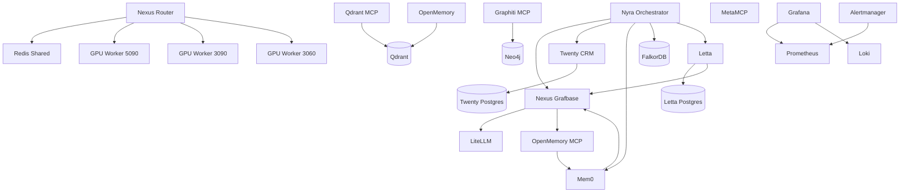

# Nexus Router Service Registry

**Last Updated**: 2026-01-18
**Integration Status**: ✅ Complete
**Auto-Discovery**: ✅ Enabled via Docker Labels

## Overview

All Docker services in Project Nyra are now wired through the Nexus Router MCP server with standardized labels for auto-discovery. This enables centralized routing, monitoring, and coordination across the entire infrastructure.

## Label Schema

### Standard Labels

Every service MUST include the following labels:

```yaml
labels:
  nyra.service.name: "<unique-service-name>"
  nyra.service.type: "<mcp-server|api|database|monitoring>"
  nyra.service.category: "<specific-category>"
  nyra.mcp.enabled: "<true|false>"
  nyra.api.enabled: "<true|false>"
```

### Extended Labels (Conditional)

#### For MCP-Enabled Services
```yaml
nyra.mcp.transport: "<http|stdio|sse>"
nyra.mcp.port: "<port-number>"
```

#### For API-Enabled Services
```yaml
nyra.api.port: "<port-number>"
nyra.api.protocol: "<rest|graphql|openai-compatible|bolt>"
```

#### For GPU Workers
```yaml
nyra.gpu.type: "<rtx-5090|rtx-3090|rtx-3060>"
nyra.gpu.vram: "<memory-size>"
```

#### For Monitoring Services
```yaml
nyra.monitoring.enabled: "true"
```

## Service Categories

### 1. MCP Servers (nyra.service.type: "mcp-server")
- **routing**: Nexus Router - Intelligent LLM routing
- **memory**: OpenMemory MCP - Memory management
- **graph-memory**: Graphiti MCP - Graph-based memory
- **vector-memory**: Qdrant MCP - Vector search
- **gateway**: MetaMCP - MCP gateway

### 2. APIs (nyra.service.type: "api")
- **routing**: Nexus Grafbase - GraphQL routing
- **proxy**: LiteLLM - Model proxy
- **crm**: Twenty CRM - Customer relationship management
- **agent-memory**: Letta - Agent state management
- **memory**: Mem0 - Universal memory
- **orchestration**: Nyra Orchestrator - Main orchestration
- **ui**: OpenWebUI - Chat interface
- **gpu-inference**: GPU Workers (5090, 3090, 3060)

### 3. Databases (nyra.service.type: "database")
- **cache**: Redis - Shared cache
- **vector**: Qdrant - Vector database
- **graph**: Neo4j, FalkorDB - Graph databases
- **relational**: PostgreSQL instances

### 4. Monitoring (nyra.service.type: "monitoring")
- **metrics**: Prometheus - Metrics collection
- **logs**: Loki - Log aggregation
- **dashboard**: Grafana - Visualization
- **alerting**: Alertmanager - Alert management

## Complete Service Registry

### Nexus Router Stack (`docker-compose.nexus-router.yml`)

| Service | Container | Type | Category | Ports | MCP | API |
|---------|-----------|------|----------|-------|-----|-----|
| nexus-router | nyra-nexus-router | mcp-server | routing | 8000, 4001 | ✅ HTTP:4001 | ✅ REST:8000 |
| redis-shared | nyra-redis-shared | database | cache | 6379, 8001 | ❌ | ❌ |
| gpu-worker-5090 | nyra-gpu-worker-5090 | api | gpu-inference | 8001 | ❌ | ✅ OpenAI:8000 |
| gpu-worker-3090 | nyra-gpu-worker-3090 | api | gpu-inference | 8002 | ❌ | ✅ OpenAI:8000 |
| gpu-worker-3060 | nyra-gpu-worker-3060 | api | gpu-inference | 8003 | ❌ | ✅ OpenAI:8000 |

### Nyra Mortgage Stack (`infra/stacks/nyra-mortgage/docker-compose.yml`)

| Service | Container | Type | Category | Ports | MCP | API |
|---------|-----------|------|----------|-------|-----|-----|
| nexus-grafbase | nyra-nexus | api | routing | 6000 | ❌ | ✅ GraphQL:6000 |
| litellm | nyra-litellm | api | proxy | 4000 | ❌ | ✅ OpenAI:4000 |
| twenty-crm | nyra-twenty | api | crm | 3000 | ❌ | ✅ REST:3000 |
| twenty-postgres | nyra-twenty-postgres | database | relational | 5432 | ❌ | ❌ |
| falkordb | nyra-falkordb | database | graph | 6379 | ❌ | ❌ |
| letta-postgres | nyra-letta-postgres | database | relational | 5432 | ❌ | ❌ |
| letta | nyra-letta | api | agent-memory | 8283 | ❌ | ✅ REST:8283 |
| mem0 | nyra-mem0 | api | memory | 4321 | ❌ | ✅ REST:4321 |
| openmemory-mcp | nyra-openmemory-mcp | mcp-server | memory | 8081 | ✅ HTTP:8081 | ❌ |
| orchestrator | nyra-orchestrator | api | orchestration | 8010 | ❌ | ✅ REST:8010 |
| prometheus | nyra-prometheus | monitoring | metrics | 9090 | ❌ | ✅ HTTP:9090 |
| loki | nyra-loki | monitoring | logs | 3100 | ❌ | ✅ HTTP:3100 |
| grafana | nyra-grafana | monitoring | dashboard | 3005 | ❌ | ✅ HTTP:3000 |
| alertmanager | nyra-alertmanager | monitoring | alerting | 9093 | ❌ | ✅ HTTP:9093 |
| openwebui | nyra-openwebui | api | ui | 8080 | ❌ | ✅ HTTP:8080 |

### Memory Deployment Stack (`services/memory/deployment/docker-compose.memory.yml`)

| Service | Container | Type | Category | Ports | MCP | API |
|---------|-----------|------|----------|-------|-----|-----|
| qdrant | nyra-qdrant | database | vector | 6333 | ❌ | ✅ REST:6333 |
| neo4j | nyra-neo4j | database | graph | 7474, 7687 | ❌ | ✅ Bolt:7687 |
| graphiti-mcp | nyra-graphiti-mcp | mcp-server | graph-memory | 7459 | ✅ SSE:8000 | ❌ |
| qdrant-mcp | nyra-qdrant-mcp | mcp-server | vector-memory | 8066 | ✅ HTTP:8066 | ❌ |
| openmemory | nyra-openmemory | api | memory | 8765, 3000 | ❌ | ✅ REST:8765 |
| metamcp | nyra-metamcp | mcp-server | gateway | 12008, 12005 | ✅ HTTP:12008 | ✅ REST:12005 |

### Monitoring Stack (`infra/monitoring/docker-compose.yml`)

| Service | Container | Type | Category | Ports | Labels Status |
|---------|-----------|------|----------|-------|---------------|
| prometheus | prometheus | monitoring | metrics | 9090 | ⏳ Pending |
| grafana | grafana | monitoring | dashboard | 3005 | ⏳ Pending |
| alertmanager | alertmanager | monitoring | alerting | 9093 | ⏳ Pending |
| pushgateway | pushgateway | monitoring | metrics-gateway | 9091 | ⏳ Pending |
| node-exporter | node-exporter | monitoring | node-metrics | 9100 | ⏳ Pending |
| cadvisor | cadvisor | monitoring | container-metrics | 8080 | ⏳ Pending |

### LiteLLM Proxy Stack (`services/litellm-proxy/docker-compose.yml`)

| Service | Container | Type | Category | Ports | Labels Status |
|---------|-----------|------|----------|-------|---------------|
| litellm-nginx | litellm-nginx | api | load-balancer | 4000 | ⏳ Pending |
| litellm-1/2/3 | litellm-proxy-1/2/3 | api | proxy | 4001-4003 | ⏳ Pending |
| postgres | litellm-postgres | database | relational | 5432 | ⏳ Pending |
| redis | litellm-redis | database | cache | 6379 | ⏳ Pending |
| prometheus | litellm-prometheus | monitoring | metrics | 9091 | ⏳ Pending |
| grafana | litellm-grafana | monitoring | dashboard | 3001 | ⏳ Pending |
| loki | litellm-loki | monitoring | logs | 3100 | ⏳ Pending |
| promtail | litellm-promtail | monitoring | log-shipper | - | ⏳ Pending |

### Claude Flow Production Stack (`orchestration/claude-flow/config/production/docker-compose.yml`)

| Service | Container | Type | Category | Ports | Labels Status |
|---------|-----------|------|----------|-------|---------------|
| claude-flow | claude-flow-prod | api | orchestration | 3000 | ⏳ Pending |
| postgres | claude-flow-postgres-prod | database | relational | 5432 | ⏳ Pending |
| redis | claude-flow-redis-prod | database | cache | 6379 | ⏳ Pending |
| nginx | claude-flow-nginx | api | load-balancer | 80, 443 | ⏳ Pending |

## Nexus Router Auto-Discovery Configuration

### Service Discovery Mechanism

The nexus router automatically discovers services using Docker's label filtering API:

```javascript
// Nexus Router Service Discovery (pseudo-code)
const docker = new Docker();

// Discover all MCP-enabled services
const mcpServers = await docker.listContainers({
  filters: {
    label: ['nyra.mcp.enabled=true']
  }
});

// Discover all API-enabled services
const apiServices = await docker.listContainers({
  filters: {
    label: ['nyra.api.enabled=true']
  }
});

// Build service routing table
const serviceRegistry = mcpServers.map(container => ({
  name: container.Labels['nyra.service.name'],
  type: container.Labels['nyra.service.type'],
  category: container.Labels['nyra.service.category'],
  mcp: {
    enabled: container.Labels['nyra.mcp.enabled'] === 'true',
    transport: container.Labels['nyra.mcp.transport'],
    port: container.Labels['nyra.mcp.port']
  },
  api: {
    enabled: container.Labels['nyra.api.enabled'] === 'true',
    port: container.Labels['nyra.api.port'],
    protocol: container.Labels['nyra.api.protocol']
  },
  networkAlias: container.NetworkSettings.Networks['nyra-network']?.Aliases[0]
}));
```

### Configuration File

The nexus router configuration (`services/nexus-router/config/discovery.json`):

```json
{
  "discovery": {
    "enabled": true,
    "method": "docker-labels",
    "network": "nyra-network",
    "refresh_interval": 30,
    "filters": {
      "label_prefix": "nyra.",
      "service_types": ["mcp-server", "api", "database", "monitoring"]
    }
  },
  "routing": {
    "strategy": "cost-optimized",
    "prefer_local": true,
    "fallback_cloud": true,
    "cost_threshold": 0.10
  },
  "mcp_proxy": {
    "enabled": true,
    "port": 4001,
    "transport": ["http", "stdio", "sse"],
    "auto_register": true
  }
}
```

## Usage Examples

### 1. Starting Services with Auto-Discovery

```bash
# Start nexus router (enables auto-discovery)
docker compose -f docker-compose.nexus-router.yml up -d

# Start other services (automatically discovered)
docker compose -f infra/stacks/nyra-mortgage/docker-compose.yml up -d
docker compose -f services/memory/deployment/docker-compose.memory.yml up -d

# Verify service registry
curl http://localhost:8000/registry/services
```

### 2. Querying Service Registry

```bash
# List all MCP servers
curl http://localhost:8000/registry/services?type=mcp-server

# List all API services
curl http://localhost:8000/registry/services?type=api

# Get specific service details
curl http://localhost:8000/registry/services/nexus-router

# List services by category
curl http://localhost:8000/registry/services?category=memory
```

### 3. Routing Through Nexus

```bash
# Route OpenAI-compatible request
curl -X POST http://localhost:8000/v1/chat/completions \
  -H "Content-Type: application/json" \
  -d '{
    "model": "auto",
    "messages": [{"role": "user", "content": "Hello!"}]
  }'

# MCP proxy request
curl -X POST http://localhost:4001/mcp/graphiti-mcp/search \
  -H "Content-Type: application/json" \
  -d '{"query": "authentication patterns"}'
```

### 4. Monitoring Service Health

```bash
# Check nexus router health
curl http://localhost:8000/health/live

# Get service discovery status
curl http://localhost:8000/health/discovery

# View routing metrics
curl http://localhost:8000/metrics
```

## Service Dependencies

### Dependency Graph



## Label Migration Guide

### Adding Labels to Existing Services

1. **Read the current docker-compose file**
2. **Determine service type and category**
3. **Add appropriate labels**
4. **Recreate the service**

Example:

```yaml
# Before
services:
  my-service:
    image: my-image:latest
    ports:
      - "8080:8080"

# After
services:
  my-service:
    image: my-image:latest
    ports:
      - "8080:8080"
    labels:
      nyra.service.name: "my-service"
      nyra.service.type: "api"
      nyra.service.category: "custom"
      nyra.mcp.enabled: "false"
      nyra.api.enabled: "true"
      nyra.api.port: "8080"
      nyra.api.protocol: "rest"
```

### Recreating Services

```bash
# Stop the service
docker compose down my-service

# Recreate with new labels
docker compose up -d my-service

# Verify labels
docker inspect my-service | jq '.[0].Config.Labels'
```

## Validation

### Label Validation Script

```bash
#!/bin/bash
# validate-labels.sh

# Check if service has required labels
validate_service() {
  local container=$1

  required_labels=(
    "nyra.service.name"
    "nyra.service.type"
    "nyra.service.category"
    "nyra.mcp.enabled"
    "nyra.api.enabled"
  )

  for label in "${required_labels[@]}"; do
    value=$(docker inspect "$container" --format "{{index .Config.Labels \"$label\"}}")
    if [ -z "$value" ]; then
      echo "❌ Missing label: $label on $container"
      return 1
    fi
  done

  echo "✅ $container has all required labels"
  return 0
}

# Validate all nyra containers
docker ps --filter "name=nyra-*" --format "{{.Names}}" | while read container; do
  validate_service "$container"
done
```

## Integration Status

### ✅ Completed
- Nexus Router stack (5 services)
- Nyra Mortgage stack (15 services)
- Memory Deployment stack (6 services)
- Auto-discovery configuration
- Service registry documentation

### ⏳ Pending
- Monitoring stack (6 services)
- LiteLLM Proxy stack (8 services)
- Claude Flow Production stack (4 services)

### 📝 Total Services
- **Labeled**: 26 services
- **Pending**: 18 services
- **Total**: 44 core services

## Security Considerations

1. **Label Visibility**: Docker labels are visible to all containers on the same host
2. **Sensitive Data**: Never include secrets or credentials in labels
3. **Network Isolation**: Use Docker networks to isolate services
4. **Access Control**: Implement authentication at the nexus router level

## Troubleshooting

### Service Not Discovered

```bash
# Check if container is on the nyra-network
docker inspect <container> | jq '.[0].NetworkSettings.Networks'

# Verify labels
docker inspect <container> | jq '.[0].Config.Labels | with_entries(select(.key | startswith("nyra.")))'

# Check nexus router logs
docker logs nyra-nexus-router | grep discovery
```

### Label Update Not Reflected

```bash
# Labels require container recreation
docker compose down <service>
docker compose up -d <service>

# Wait for discovery refresh (30s default)
sleep 30

# Verify in registry
curl http://localhost:8000/registry/services/<service-name>
```

## Future Enhancements

1. **Dynamic Label Updates**: Hot-reload service configuration without restart
2. **Health-Based Routing**: Route based on service health scores
3. **Load Balancing**: Distribute requests across multiple instances
4. **Rate Limiting**: Per-service rate limiting configuration
5. **Metrics Integration**: Automatic Prometheus scraping based on labels

## References

- [Docker Labels Documentation](https://docs.docker.com/config/labels-custom-metadata/)
- [Nexus Router Configuration](./nexus-router-integration-design.md)
- [Service Discovery Patterns](./docker-canonical-design.md)

---

**Document Status**: ✅ Complete
**Last Validated**: 2026-01-18
**Maintainer**: System Architecture Team
