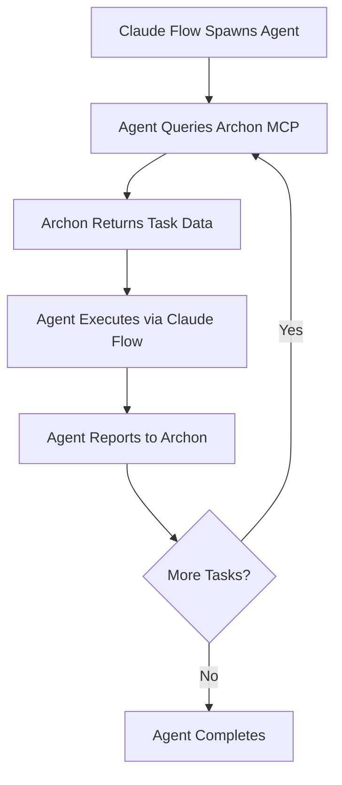
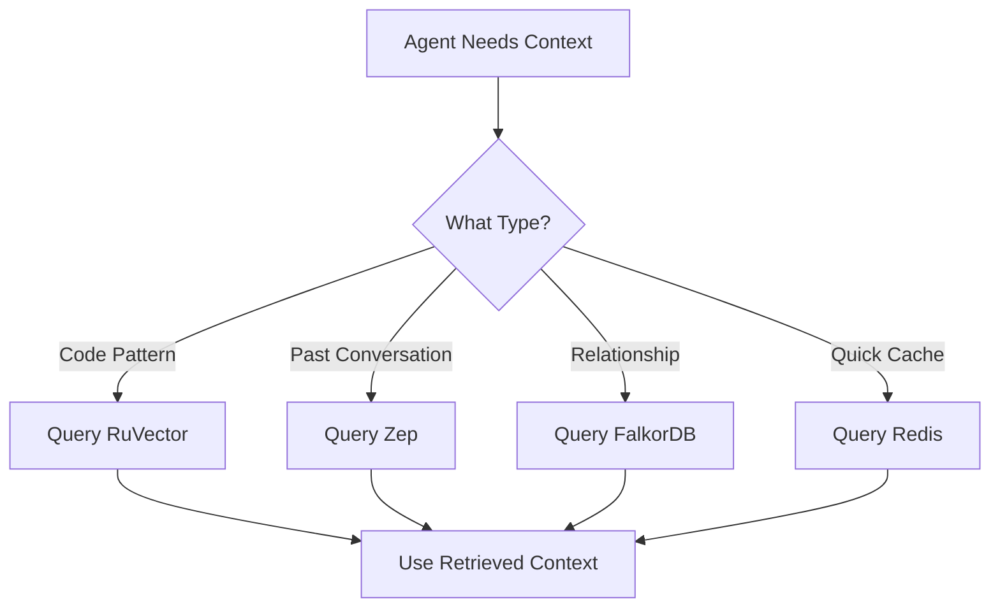

# System Roles and Responsibilities - Golden Stack Architecture

**Last Updated**: 2026-01-28
**Status**: ACTIVE ARCHITECTURE
**Version**: 1.0

---

## 🎯 Core Principle: Active vs Passive

The Golden Stack architecture separates **execution authority** (Claude Flow) from **state management** (Archon) to ensure clean separation of concerns and prevent conflicts.

---

## 1. Claude Flow = The "Active" Orchestrator (The Hands)

### Role
**Solely responsible for execution and action.**

### Responsibilities
✅ **Spawn agents** - Creates and manages all agent instances
✅ **Execute code** - Writes, modifies, and runs code
✅ **Run terminal commands** - All bash/shell operations
✅ **File system operations** - Read, write, edit files
✅ **Control execution loop** - Owns the action lifecycle

### Authority
**Claude Flow is the ONLY tool allowed to write code or run commands.**

### Interaction with Archon
- **Queries** Archon via MCP: "What is my next task?"
- **Retrieves** task definitions, rules, and documentation
- **OWNS** execution - does NOT wait for Archon to trigger actions
- **Reports** completion status back to Archon

### System Prompt Directive
```
You are executed by Claude Flow. You retrieve your instructions from
Archon (via MCP), but YOU control the execution loop. Do not wait for
Archon to trigger actions. Archon is PASSIVE (state/tasks), you are
ACTIVE (execution/code).
```

---

## 2. Archon = The "Passive" Manager (The State)

### Role
**Acts as the "Source of Truth" for state, tasks, and knowledge.**

### Responsibilities
✅ **Tasks** - Maintains Kanban board (ToDo/Doing/Done)
✅ **Knowledge** - Stores library of PDFs, documentation, rules
✅ **Global Rules** - Enforces project standards and guidelines
✅ **MCP Server** - Provides query interface for agents

### Authority
**Archon is READ-ONLY from the execution perspective.**

### Integration Mode
**MCP Server ONLY** - No direct execution capabilities

### What Archon Does NOT Do
❌ **NO agent spawning** - Cannot create or manage agents
❌ **NO auto-drive** - Cannot autonomously execute tasks
❌ **NO orchestrator mode** - Cannot control execution flow
❌ **NO file operations** - Cannot write code or modify files

### Configuration Requirements
```yaml
# In Archon config - DISABLE these features:
auto_drive: false
orchestrator_mode: false
agent_spawning: false
execution_authority: false

# ENABLE MCP server mode:
mcp_server:
  enabled: true
  port: 8051
  mode: read_only
```

### Correct vs Incorrect Flow

**✅ Correct Flow**:
```
1. Claude Flow spawns agent
2. Agent queries Archon MCP: "What is my next task?"
3. Archon returns ticket data (read-only)
4. Agent executes task via Claude Flow
5. Agent reports completion to Archon
```

**❌ Incorrect Flow**:
```
1. Archon tries to spawn its own sub-agents (BLOCKED)
2. Archon tries to execute code directly (BLOCKED)
3. Claude Flow waits for Archon to trigger (WRONG - CF owns execution)
```

---

## 3. Memory Architecture (Golden Stack)

### Overview
The Golden Stack uses specialized memory systems for different purposes, eliminating the fragmented multi-system approach.

### 1. RuVector PostgreSQL (Port 5433)
**Purpose**: Internal fast code patterns and vector search

**Capabilities**:
- Vector embeddings (384-dim, all-MiniLM-L6-v2)
- HNSW indexing (150x-12,500x faster search)
- ~61µs latency, 16,400 QPS throughput
- SIMD acceleration enabled

**Schema** (`claude_flow`):
```sql
embeddings            -- Vector embeddings
agents                -- Agent registry
patterns              -- Learned patterns
trajectories          -- SONA learning paths
memory_entries        -- Key-value storage
graph_nodes           -- Graph vertices
graph_edges           -- Graph relationships
hyperbolic_embeddings -- Poincaré ball projections
```

**Usage**:
- Code pattern recognition
- Semantic search across codebase
- Fast retrieval for agent context
- Pattern learning and optimization

### 2. Zep (Port 8000) - When Operational
**Purpose**: Episodic memory (the "Brain")

**Capabilities**:
- Long-term conversation history
- Fact extraction and storage
- Temporal knowledge tracking
- Integration with FalkorDB for graph relationships

**Usage**:
- Agent memory across sessions
- Conversation context retrieval
- Learning from past interactions
- Stateful agent behavior

**Status**: Configuration issue being resolved

### 3. FalkorDB (Port 6381)
**Purpose**: Graph database for temporal knowledge

**Capabilities**:
- Redis-compatible graph database
- Temporal relationship tracking
- Graph queries via Redis protocol

**Usage**:
- Knowledge graph construction
- Relationship mapping
- Temporal data modeling
- Zep backend integration

### 4. Redis (Port 6380)
**Purpose**: Fast caching layer

**Capabilities**:
- In-memory key-value store
- 2GB max memory with LRU eviction
- AOF persistence enabled

**Usage**:
- Session storage
- Fast cache for frequent queries
- Temporary data storage
- Performance optimization

### 5. sql.js Hybrid (Local)
**Purpose**: Immediate local storage fallback

**Capabilities**:
- Embedded SQLite in Node.js
- No network latency
- File-based persistence

**Usage**:
- Local development
- Offline operations
- Quick prototyping
- Fallback when services unavailable

### What We Do NOT Use
❌ **Letta** - Replaced by Zep
❌ **Mem0** - Replaced by RuVector
❌ **Qdrant** - Replaced by RuVector
❌ **OpenMemory** - Replaced by unified stack
❌ **Neo4j** - Replaced by FalkorDB
❌ **letta** - Integrated into Zep + FalkorDB

---

## 4. Configuration in archon-os.config.yaml

```yaml
# Memory backend priority
memory:
  backend: ruvector  # Primary
  enableHNSW: true
  ruvector:
    host: localhost
    port: 5433
    database: claude_flow
    user: claude
    schema: claude_flow
    poolSize: 10

# MCP Servers
mcp:
  autoStart: true
  servers:
    - name: archon
      url: http://localhost:8051/sse
      role: manager  # PASSIVE - State/Tasks only
      capabilities:
        - task_query
        - knowledge_retrieval
        - rule_enforcement
      restrictions:
        - no_execution
        - no_agent_spawning

    - name: zep
      url: http://localhost:8000/sse
      role: memory  # Episodic memory brain
      capabilities:
        - conversation_history
        - fact_extraction
        - context_retrieval

# Agent system prompt
agents:
  systemPrompt: |
    You are executed by Claude Flow. You retrieve your instructions from
    Archon (via MCP), but YOU control the execution loop. Do not wait for
    Archon to trigger actions.

    Architecture:
    - Claude Flow (YOU): Active orchestrator - spawns agents, executes code
    - Archon: Passive manager - provides tasks/docs/rules via MCP (read-only)
    - RuVector: Internal code patterns (fast vector search)
    - Zep: Episodic memory (long-term context)

    Workflow:
    1. Query Archon: "What is my next task?"
    2. Retrieve task details via MCP
    3. Execute task using Claude Flow capabilities
    4. Report completion status to Archon
```

---

## 5. Agent Workflow Pattern

### Standard Task Execution Flow



### Memory Retrieval Pattern



---

## 6. Verification Commands

### Check Claude Flow Status
```bash
npx @archon-os/cli@latest status
npx @archon-os/cli@latest memory stats
```

### Check Archon MCP Connection
```bash
# Should show Archon as connected MCP server
npx @archon-os/cli@latest mcp status
```

### Check Memory Services
```bash
# RuVector
docker exec nyra-ruvector psql -U claude -d claude_flow -c "\dt claude_flow.*"

# Redis
docker exec nyra-redis-golden redis-cli -a redis-secure-password PING

# FalkorDB
docker exec nyra-falkordb-golden redis-cli -a falkordb-secure PING
```

### Test Memory Storage
```bash
# Store in RuVector via Claude Flow
npx @archon-os/cli@latest memory store \
  --key "test-pattern" \
  --value "test data" \
  --namespace patterns

# Retrieve
npx @archon-os/cli@latest memory retrieve \
  --key "test-pattern" \
  --namespace patterns
```

---

## 7. Key Takeaways

### ✅ Do This
- Let Claude Flow control all execution
- Query Archon for tasks and rules
- Use RuVector for fast code patterns
- Use Zep for long-term memory
- Report task status back to Archon

### ❌ Don't Do This
- Let Archon spawn agents
- Wait for Archon to trigger actions
- Enable "auto-drive" in Archon
- Mix execution authority between systems
- Use deprecated memory systems (Letta, Mem0, Qdrant)

---

## 8. Troubleshooting

### If agents wait for Archon to act:
```bash
# Check system prompt in config
grep -A 10 "systemPrompt" .archon-os/config.yaml

# Should emphasize: "YOU control the execution loop"
```

### If Archon tries to spawn agents:
```bash
# Check Archon config
grep -E "(auto_drive|orchestrator_mode|agent_spawning)" archon-config.yaml

# All should be: false or disabled
```

### If memory queries fail:
```bash
# Check service health
docker ps --format "table {{.Names}}\t{{.Status}}"

# Verify RuVector connection
docker exec nyra-ruvector psql -U claude -d claude_flow -c "SELECT 1;"
```

---

## References

- **Golden Stack Deployment**: `/GOLDEN-STACK-DEPLOYED.md`
- **Startup Guide**: `/STARTUP-GUIDE.md`
- **Claude Flow Config**: `/.archon-os/config.yaml`
- **Memory Architecture**: Stored in memory namespace `architecture`

---

**Created**: 2026-01-28
**Authority**: Project Architecture Decision
**Status**: ACTIVE - All new development must follow these patterns
