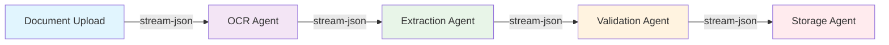

# Workflow Orchestration - Project Nyra

**Version**: 1.0.0
**Last Updated**: 2026-01-10
**Status**: Production Ready

## Table of Contents

1. [Overview](#overview)
2. [Core Concepts](#core-concepts)
3. [Orchestration Architecture](#orchestration-architecture)
4. [Execution Strategies](#execution-strategies)
5. [Task Decomposition](#task-decomposition)
6. [Integration Points](#integration-points)
7. [Implementation Examples](#implementation-examples)
8. [Best Practices](#best-practices)
9. [Monitoring and Debugging](#monitoring-and-debugging)
10. [Scaling Strategies](#scaling-strategies)

## Overview

Project Nyra's workflow orchestration leverages Claude Flow and Archon OS in a dual-orchestrator architecture to coordinate complex multi-agent workflows across the mortgage automation platform. This system enables sophisticated task coordination, parallel execution, intelligent resource allocation, and stream-json chaining for real-time agent-to-agent communication.

### Key Capabilities

- **Multi-Agent Coordination**: Coordinate specialized agents (researcher, coder, tester, reviewer)
- **Dual Orchestration**: Claude Flow for complex reasoning + Archon OS for workflow execution
- **Stream-JSON Chaining**: Real-time output piping between agents
- **Intelligent Routing**: Nexus Router for GPU → Cloud API optimization
- **Memory Systems**: Letta, Qdrant, FalkorDB for persistent state
- **Event-Driven**: Async workflows with message queues

### Architecture Stack

```
┌─────────────────────────────────────────────────────────┐
│                  Client Applications                     │
│  (Mortgage Assistant, Admin Dashboard, Mobile Apps)     │
└────────────────┬────────────────────────────────────────┘
                 │
                 ▼
┌─────────────────────────────────────────────────────────┐
│              Nexus Router (Port 8000)                    │
│  • LLM Request Routing (GPU → Cloud)                    │
│  • MCP Proxy Gateway (Port 4001)                        │
│  • Request Caching & Deduplication                      │
└──────┬────────────────────────────────┬─────────────────┘
       │                                │
       ▼                                ▼
┌─────────────────┐            ┌─────────────────┐
│  Claude Flow    │◄──────────►│   Archon OS     │
│  (Port 9000)    │            │   (Port 9001)   │
│                 │            │                 │
│ • Swarm Mgmt    │            │ • Task Queue    │
│ • Neural Train  │            │ • Workflows     │
│ • SPARC         │            │ • Integrations  │
└────────┬────────┘            └────────┬────────┘
         │                              │
         └──────────────┬───────────────┘
                        ▼
        ┌───────────────────────────────┐
        │      Integration Layer        │
        │ • MCP Servers                 │
        │ • Memory Systems              │
        │ • Business Services           │
        └───────────────────────────────┘
```

## Core Concepts

### 1. Task Decomposition

Breaking complex mortgage workflows into atomic units that can be distributed across specialized agents.

```javascript
// Example: Mortgage Application Processing
const mortgageApplicationWorkflow = {
  name: "Process Mortgage Application",
  subtasks: [
    {
      id: "verify_identity",
      agent: "compliance-agent",
      task: "Verify applicant identity and documents",
      priority: "critical",
      timeout: 300000 // 5 minutes
    },
    {
      id: "extract_income",
      agent: "doc-processor-agent",
      task: "Extract income data from W2s and pay stubs",
      dependencies: ["verify_identity"],
      priority: "high"
    },
    {
      id: "calculate_dti",
      agent: "calculator-agent",
      task: "Calculate debt-to-income ratio",
      dependencies: ["extract_income"],
      priority: "high"
    },
    {
      id: "check_credit",
      agent: "credit-agent",
      task: "Pull and analyze credit report",
      priority: "high",
      parallel: true // Can run parallel with income extraction
    },
    {
      id: "rate_shopping",
      agent: "rate-comparison-agent",
      task: "Compare rates across lenders",
      dependencies: ["calculate_dti", "check_credit"],
      priority: "medium"
    },
    {
      id: "generate_pre_approval",
      agent: "approval-agent",
      task: "Generate pre-approval letter",
      dependencies: ["rate_shopping"],
      priority: "high"
    }
  ]
};
```

### 2. Execution Strategies

#### Parallel Execution
Execute independent tasks simultaneously for maximum efficiency.

```bash
# Process multiple mortgage applications in parallel
npx claude-flow task orchestrate \
  --task "Process batch of 50 mortgage applications" \
  --strategy parallel \
  --max-concurrent 10 \
  --topology mesh
```

#### Sequential Execution
Execute tasks in order when dependencies exist.

```bash
# Compliance workflow (must be sequential)
npx claude-flow task orchestrate \
  --task "Complete regulatory compliance checks" \
  --strategy sequential \
  --checkpoint-on-error \
  --rollback-enabled
```

#### Adaptive Execution
Dynamically adjust strategy based on resource availability and load.

```bash
# Lead processing with adaptive scaling
npx claude-flow task orchestrate \
  --task "Process incoming leads and route to agents" \
  --strategy adaptive \
  --monitor-resources \
  --min-agents 3 \
  --max-agents 20
```

#### Stream-Chained Execution
Real-time output piping between agents for seamless information flow.

```bash
# Document processing pipeline with stream chaining
npx claude-flow automation run-workflow document-pipeline.json \
  --claude \
  --non-interactive \
  --output-format stream-json
```

### 3. Agent Coordination Patterns

#### Map-Reduce Pattern
Process data in parallel and aggregate results.

```javascript
// Example: Analyze 1000 loan documents
const documentAnalysisWorkflow = {
  pattern: "map-reduce",
  map: {
    task: "Analyze individual loan document",
    agents: 10,
    parallel: true,
    agentType: "doc-analyzer"
  },
  reduce: {
    task: "Consolidate findings and generate report",
    agent: "report-generator",
    parallel: false
  }
};
```

#### Pipeline Pattern
Chain operations with parallel stages.

```javascript
// Example: Lead nurture pipeline
const leadNurturePipeline = {
  stages: [
    {
      name: "capture",
      agents: ["lead-capture-agent"],
      parallel: false,
      timeout: 30000
    },
    {
      name: "enrich",
      agents: ["data-enrichment-agent", "credit-check-agent"],
      parallel: true,
      timeout: 60000
    },
    {
      name: "score",
      agents: ["lead-scoring-agent"],
      parallel: false,
      dependencies: ["enrich"]
    },
    {
      name: "route",
      agents: ["routing-agent"],
      parallel: false,
      dependencies: ["score"]
    }
  ]
};
```

#### Fork-Join Pattern
Split work, process in parallel, then merge.

```bash
# Multi-lender rate comparison
npx claude-flow task orchestrate \
  --task "Compare rates across 20 lenders" \
  --pattern fork-join \
  --lenders "quicken,rocket,better,guaranteed-rate,..."
```

## Orchestration Architecture

### Dual Orchestrator Setup

Project Nyra uses a dual-orchestrator architecture for optimal task distribution:

#### Claude Flow (Primary - Port 9000)

**Specializations:**
- Multi-agent swarm coordination
- Complex reasoning tasks
- Neural training workflows
- SPARC methodology
- Cross-agent memory management

**Configuration:**
```javascript
// services/claude-flow/.env.development
{
  orchestratorMode: "dual",
  archonOsUrl: "http://localhost:9001",
  enableArchonSync: true,
  taskDelegationRules: {
    workflowExecution: true,      // Delegate to Archon
    taskQueue: true,               // Delegate to Archon
    longRunningTasks: true,        // Delegate to Archon
    swarmCoordination: false,      // Keep in Claude Flow
    neuralTraining: false,         // Keep in Claude Flow
    complexReasoning: false        // Keep in Claude Flow
  }
}
```

**Use Claude Flow for:**
- Document intelligence extraction (OCR → structured data)
- Multi-step mortgage calculations
- Compliance rule interpretation
- Complex lead scoring algorithms
- Market analysis and predictions

#### Archon OS (Secondary - Port 9001)

**Specializations:**
- Task queue management
- Workflow execution engine
- Long-running processes
- External integrations (Twilio, TwentyCRM, n8n)
- Event-driven automation

**Configuration:**
```javascript
// services/archon-os/.env.development
{
  orchestratorMode: "dual",
  claudeFlowUrl: "http://localhost:9000",
  enableClaudeFlowSync: true,
  taskRouting: {
    swarmTasks: true,              // Route to Claude Flow
    multiAgentCoordination: true,  // Route to Claude Flow
    neuralTasks: true,             // Route to Claude Flow
    workflows: false,              // Handle locally
    queuedTasks: false,            // Handle locally
    integrations: false            // Handle locally
  }
}
```

**Use Archon OS for:**
- Lead capture webhook processing
- Scheduled rate updates
- CRM synchronization
- SMS/Email campaigns (Twilio)
- Document storage workflows

### Nexus Router Integration

**Role:** Intelligent LLM request routing and MCP gateway

```javascript
// services/nexus-router/config.js
{
  routing: {
    strategy: "cost-optimized",
    preferLocal: true,
    fallbackCloud: true,

    // Local GPU Workers
    workers: {
      rtx5090: {
        url: "http://gpu-worker-5090:8001",
        models: ["llama-3.3-70b", "qwen-2.5-72b"],
        maxConcurrent: 4
      },
      rtx3090: {
        url: "http://gpu-worker-3090:8002",
        models: ["llama-3.1-8b", "mistral-7b"],
        maxConcurrent: 8
      },
      rtx3060: {
        url: "http://gpu-worker-3060:8003",
        models: ["phi-3-mini", "gemma-7b"],
        maxConcurrent: 12
      }
    },

    // Cloud Fallback
    cloud: {
      anthropic: {
        apiKey: process.env.ANTHROPIC_API_KEY,
        models: ["claude-3-5-sonnet-20241022"],
        rateLimit: 50 // requests per minute
      },
      openrouter: {
        apiKey: process.env.OPENROUTER_API_KEY,
        baseUrl: "https://openrouter.ai/api/v1"
      }
    }
  },

  // MCP Gateway
  mcpGateway: {
    enabled: true,
    port: 4001,
    servers: [
      { name: "gemini", port: 8085 },
      { name: "serena", port: 8086 },
      { name: "mem0", port: 8080 },
      { name: "cdk", port: 8087 }
    ]
  }
}
```

### Memory Systems

#### Letta (Agent Memory - Port 8283)
```javascript
// Persistent agent memory for mortgage context
const lettaConfig = {
  baseUrl: "http://localhost:8283",
  agentMemory: {
    mortgage_agent: {
      coreMemory: {
        userProfile: "Mortgage officer specializing in FHA loans",
        guidelines: "Follow CFPB and RESPA regulations",
        preferences: "Prioritize first-time homebuyers"
      },
      archivalMemory: {
        enabled: true,
        maxEntries: 10000,
        ttl: "90d"
      }
    }
  }
};
```

#### Qdrant (Vector Search - Port 6333)
```javascript
// Vector search for similar mortgage scenarios
const qdrantConfig = {
  baseUrl: "http://localhost:6333",
  collections: {
    mortgage_documents: {
      vectorSize: 1536,
      distance: "Cosine",
      indexes: ["document_type", "loan_amount", "credit_score"]
    },
    successful_loans: {
      vectorSize: 1536,
      distance: "Cosine",
      description: "Embeddings of successful loan applications"
    }
  }
};
```

#### FalkorDB (Knowledge Graph - Port 6380)
```javascript
// Temporal knowledge graph for relationship tracking
const falkorDBConfig = {
  baseUrl: "redis://localhost:6380",
  graphs: {
    mortgage_network: {
      nodes: ["Borrower", "Property", "Lender", "Agent", "Document"],
      relationships: [
        "APPLIED_FOR",
        "OWNS",
        "FINANCED_BY",
        "ASSISTED_BY",
        "SUBMITTED"
      ],
      temporalTracking: true
    }
  }
};
```

## Execution Strategies

### 1. Parallel Execution

**Best For:** Independent tasks that can run simultaneously

**Example: Multi-Lender Rate Comparison**
```javascript
// services/rate-comparison-engine/workflows/rate-comparison.js
const parallelRateComparison = async (loanDetails) => {
  const workflow = {
    name: "Multi-Lender Rate Comparison",
    strategy: "parallel",
    maxConcurrent: 10,
    tasks: lenders.map(lender => ({
      id: `rate_check_${lender.id}`,
      agent: "rate-scraper-agent",
      task: `Fetch current rates from ${lender.name}`,
      input: { ...loanDetails, lender },
      timeout: 15000 // 15 seconds per lender
    }))
  };

  const results = await claudeFlow.workflow.execute(workflow);

  return {
    bestRate: Math.min(...results.map(r => r.rate)),
    allRates: results,
    comparisonTimestamp: new Date()
  };
};
```

**CLI Usage:**
```bash
# Parallel rate comparison
npx claude-flow task orchestrate \
  --task "Compare rates across 20 lenders for $450K 30yr fixed" \
  --strategy parallel \
  --max-concurrent 10 \
  --priority high \
  --timeout 30000
```

### 2. Sequential Execution

**Best For:** Tasks with strict dependencies

**Example: Compliance Workflow**
```javascript
// services/mortgage-assistant-api/workflows/compliance-check.js
const complianceWorkflow = {
  name: "Regulatory Compliance Check",
  strategy: "sequential",
  checkpointOnError: true,
  tasks: [
    {
      id: "verify_identity",
      agent: "kyc-agent",
      task: "Verify borrower identity (KYC)",
      required: true
    },
    {
      id: "ofac_check",
      agent: "sanctions-agent",
      task: "Check OFAC sanctions list",
      dependencies: ["verify_identity"],
      required: true
    },
    {
      id: "aml_screening",
      agent: "aml-agent",
      task: "Anti-money laundering screening",
      dependencies: ["ofac_check"],
      required: true
    },
    {
      id: "respa_compliance",
      agent: "respa-agent",
      task: "RESPA disclosure compliance check",
      dependencies: ["aml_screening"],
      required: true
    },
    {
      id: "generate_compliance_report",
      agent: "report-agent",
      task: "Generate compliance certification",
      dependencies: ["respa_compliance"]
    }
  ]
};
```

**CLI Usage:**
```bash
# Sequential compliance workflow
npx claude-flow task orchestrate \
  --task "Complete regulatory compliance for application APP-2024-001" \
  --strategy sequential \
  --checkpoint-on-error \
  --rollback-enabled \
  --audit-log true
```

### 3. Adaptive Execution

**Best For:** Dynamic workloads with variable resource needs

**Example: Lead Processing**
```javascript
// services/lead-capture-api/workflows/lead-processing.js
const adaptiveLeadProcessing = {
  name: "Adaptive Lead Processing",
  strategy: "adaptive",
  autoScaling: {
    enabled: true,
    minAgents: 3,
    maxAgents: 20,
    scaleThreshold: 0.75, // Scale up at 75% capacity
    scaleDownThreshold: 0.3, // Scale down below 30%
    scaleFactor: "queue.length / 100"
  },
  tasks: [
    {
      agent: "lead-capture-agent",
      task: "Capture and validate lead data",
      queueBased: true
    },
    {
      agent: "enrichment-agent",
      task: "Enrich lead with external data",
      dependencies: ["lead-capture-agent"]
    },
    {
      agent: "scoring-agent",
      task: "Score lead quality and intent",
      dependencies: ["enrichment-agent"]
    },
    {
      agent: "routing-agent",
      task: "Route to appropriate loan officer",
      dependencies: ["scoring-agent"]
    }
  ]
};
```

**CLI Usage:**
```bash
# Adaptive lead processing with auto-scaling
npx claude-flow task orchestrate \
  --task "Process incoming lead queue" \
  --strategy adaptive \
  --min-agents 3 \
  --max-agents 20 \
  --monitor-resources \
  --scale-metric queue_length
```

### 4. Stream-Chained Execution (NEW)

**Best For:** Real-time agent-to-agent communication without intermediate storage

**How It Works:**


**Configuration:**
```json
{
  "workflow": "document-processing-chain",
  "outputFormat": "stream-json",
  "tasks": [
    {
      "id": "ocr_extraction",
      "assignTo": "ocr-agent",
      "description": "Extract text from uploaded document",
      "claudePrompt": "Extract all text from the document. Output structured JSON for the next agent.",
      "streamOutput": true
    },
    {
      "id": "data_extraction",
      "assignTo": "extraction-agent",
      "depends": ["ocr_extraction"],
      "description": "Extract structured mortgage data",
      "claudePrompt": "You are receiving OCR text via stream-json. Extract borrower info, income, assets, and property details.",
      "streamOutput": true
    },
    {
      "id": "validation",
      "assignTo": "validation-agent",
      "depends": ["data_extraction"],
      "description": "Validate extracted data",
      "claudePrompt": "You are receiving extracted data via stream-json. Validate all fields against mortgage requirements.",
      "streamOutput": true
    },
    {
      "id": "storage",
      "assignTo": "storage-agent",
      "depends": ["validation"],
      "description": "Store validated data",
      "claudePrompt": "You are receiving validated data via stream-json. Store in database and generate confirmation.",
      "streamOutput": false
    }
  ]
}
```

**Benefits:**
- 40-60% faster than file-based handoffs
- No intermediate file storage needed
- Full conversation history flows between agents
- Real-time processing as upstream agents complete
- Rich metadata and reasoning preserved

**CLI Usage:**
```bash
# Stream-chained document processing
npx claude-flow automation run-workflow document-pipeline.json \
  --claude \
  --non-interactive \
  --output-format stream-json

# With custom configuration
npx claude-flow automation run-workflow \
  --config stream-chain-config.json \
  --enable-streaming \
  --buffer-size 4096
```

## Task Decomposition

### Functional Decomposition

Divide mortgage workflows by business function:

```javascript
const mortgagePlatformDecomposition = {
  "Lead Management": {
    capture: ["Landing page forms", "Chatbot conversations", "Referral links"],
    nurture: ["Email campaigns", "SMS follow-ups", "Retargeting"],
    qualification: ["Credit pre-check", "Income verification", "DTI calculation"]
  },

  "Application Processing": {
    documentation: ["Document upload", "OCR extraction", "Data validation"],
    underwriting: ["Credit analysis", "Income verification", "Asset verification"],
    approval: ["Risk assessment", "Rate locking", "Pre-approval generation"]
  },

  "Loan Servicing": {
    monitoring: ["Payment tracking", "Escrow management", "Insurance tracking"],
    customer_service: ["Payment inquiries", "Statement generation", "Modification requests"],
    collections: ["Late payment notices", "Loss mitigation", "Foreclosure prevention"]
  },

  "Compliance": {
    kyc: ["Identity verification", "Sanctions screening", "AML checks"],
    disclosures: ["TILA", "RESPA", "Privacy notices"],
    reporting: ["HMDA", "Fair lending", "Audit trails"]
  }
};
```

### Layer-Based Decomposition

Organize tasks by architectural layers:

```javascript
const layerBasedTasks = {
  presentation: {
    tasks: ["UI components", "Form validation", "Real-time updates"],
    agents: ["ui-developer", "frontend-specialist"]
  },

  business: {
    tasks: ["Mortgage calculations", "Eligibility rules", "Workflow logic"],
    agents: ["business-logic-agent", "calculator-agent"]
  },

  data: {
    tasks: ["Data persistence", "Query optimization", "Cache management"],
    agents: ["database-agent", "data-engineer"]
  },

  integration: {
    tasks: ["Credit bureau APIs", "TwentyCRM sync", "n8n workflows"],
    agents: ["integration-specialist", "api-connector"]
  }
};
```

### Feature-Based Decomposition

Break down by user-facing features:

```javascript
const featureTasks = {
  rate_comparison: {
    tasks: [
      "Scrape lender rates",
      "Calculate APR",
      "Generate comparison table",
      "Send rate alerts"
    ],
    priority: "high",
    agents: ["rate-scraper", "calculator", "email-sender"]
  },

  document_intelligence: {
    tasks: [
      "Upload handling",
      "OCR processing",
      "Data extraction",
      "Validation",
      "Storage"
    ],
    priority: "critical",
    agents: ["doc-uploader", "ocr-agent", "extractor", "validator"]
  },

  lead_scoring: {
    tasks: [
      "Collect lead data",
      "Enrich with external data",
      "Apply ML scoring model",
      "Route to agents"
    ],
    priority: "medium",
    agents: ["data-collector", "enricher", "ml-scorer", "router"]
  }
};
```

## Integration Points

### 1. Nexus Router Coordination

**Purpose:** Intelligent LLM request routing for cost optimization

```javascript
// services/nexus-router/middleware/orchestrator-integration.js
const routeOrchestrationRequest = async (req, res, next) => {
  const { task, complexity, urgency } = req.body;

  // Route based on task characteristics
  if (complexity === "swarm" || complexity === "neural") {
    // Complex tasks → Claude Flow
    req.orchestrator = {
      target: "claude-flow",
      url: "http://localhost:9000",
      reason: "Complex multi-agent coordination required"
    };
  } else if (task.includes("workflow") || task.includes("integration")) {
    // Workflow tasks → Archon OS
    req.orchestrator = {
      target: "archon-os",
      url: "http://localhost:9001",
      reason: "Workflow execution or external integration"
    };
  } else {
    // Adaptive routing based on load
    const claudeFlowLoad = await getOrchestratorLoad("claude-flow");
    const archonOsLoad = await getOrchestratorLoad("archon-os");

    req.orchestrator = {
      target: claudeFlowLoad < archonOsLoad ? "claude-flow" : "archon-os",
      reason: "Load-based routing"
    };
  }

  next();
};
```

### 2. MCP Server Orchestration

**Available MCP Servers:**
- **Gemini MCP (Port 8085)**: Multimodal analysis
- **Serena MCP (Port 8086)**: Codebase intelligence
- **Mem0 (Port 8080)**: User personalization
- **CDK MCP (Port 8087)**: Development tools

```javascript
// services/mortgage-assistant-api/integrations/mcp-orchestration.js
const mcpOrchestration = {
  documentAnalysis: {
    server: "gemini",
    port: 8085,
    capabilities: ["ocr", "image_analysis", "multimodal"],
    workflow: {
      input: "document_image",
      steps: [
        "Extract text via OCR",
        "Analyze document structure",
        "Identify document type",
        "Extract key fields"
      ],
      output: "structured_data"
    }
  },

  codebaseAnalysis: {
    server: "serena",
    port: 8086,
    capabilities: ["ast_parsing", "dependency_analysis", "security_scan"],
    workflow: {
      input: "code_repository",
      steps: [
        "Parse AST",
        "Generate dependency graph",
        "Scan for vulnerabilities",
        "Create documentation"
      ],
      output: "analysis_report"
    }
  },

  userPersonalization: {
    server: "mem0",
    port: 8080,
    capabilities: ["memory_storage", "preference_learning", "context_retrieval"],
    workflow: {
      input: "user_interaction",
      steps: [
        "Store conversation context",
        "Learn user preferences",
        "Retrieve relevant history",
        "Personalize responses"
      ],
      output: "personalized_context"
    }
  }
};

// Access all MCP servers through Nexus Router gateway
const mcpGatewayUrl = "http://localhost:4001/mcp";
```

### 3. GPU Worker Allocation

**Local GPU Workers Configuration:**

```javascript
// infra/gpu-workers/allocation-strategy.js
const gpuWorkerAllocation = {
  rtx5090: {
    url: "http://192.168.1.100:8001",
    models: ["llama-3.3-70b-instruct", "qwen-2.5-72b-instruct"],
    vram: "24GB",
    maxConcurrent: 4,
    priority: "high-complexity",
    useCases: [
      "Complex mortgage calculations",
      "Multi-document analysis",
      "Advanced reasoning tasks"
    ]
  },

  rtx3090: {
    url: "http://192.168.1.101:8002",
    models: ["llama-3.1-8b-instruct", "mistral-7b-instruct"],
    vram: "24GB",
    maxConcurrent: 8,
    priority: "medium-complexity",
    useCases: [
      "Document classification",
      "Lead scoring",
      "Email generation"
    ]
  },

  rtx3060: {
    url: "http://192.168.1.102:8003",
    models: ["phi-3-mini", "gemma-7b"],
    vram: "12GB",
    maxConcurrent: 12,
    priority: "low-complexity",
    useCases: [
      "Simple queries",
      "Text classification",
      "Sentiment analysis"
    ]
  }
};

// Intelligent allocation based on task complexity
const allocateGPU = (task) => {
  if (task.complexity > 0.7) return gpuWorkerAllocation.rtx5090;
  if (task.complexity > 0.4) return gpuWorkerAllocation.rtx3090;
  return gpuWorkerAllocation.rtx3060;
};
```

### 4. Database Transactions

**Coordinated database operations across workflow:**

```javascript
// services/mortgage-assistant-api/db/transaction-coordinator.js
const workflowTransaction = async (workflow) => {
  const prisma = new PrismaClient();

  try {
    return await prisma.$transaction(async (tx) => {
      // Create workflow record
      const workflowRecord = await tx.workflow.create({
        data: {
          name: workflow.name,
          status: "running",
          startedAt: new Date()
        }
      });

      // Create task records
      const tasks = await Promise.all(
        workflow.tasks.map(task =>
          tx.task.create({
            data: {
              workflowId: workflowRecord.id,
              agentId: task.agent,
              status: "pending",
              input: task.input
            }
          })
        )
      );

      // Execute workflow
      const results = await executeWorkflow(workflow, tasks);

      // Update workflow status
      await tx.workflow.update({
        where: { id: workflowRecord.id },
        data: {
          status: "completed",
          completedAt: new Date(),
          results: results
        }
      });

      return { workflowRecord, tasks, results };
    });
  } catch (error) {
    console.error("Workflow transaction failed:", error);
    throw error;
  }
};
```

**Integration with Memory Systems:**

```javascript
// Coordinated memory updates
const coordinatedMemoryUpdate = async (agentId, workflowContext) => {
  await Promise.all([
    // Letta: Agent core memory
    updateLettaMemory(agentId, {
      lastWorkflow: workflowContext.name,
      completedTasks: workflowContext.completedTasks,
      timestamp: new Date()
    }),

    // Qdrant: Store workflow embeddings
    storeWorkflowEmbedding({
      collectionName: "workflow_history",
      vector: await generateEmbedding(workflowContext),
      payload: workflowContext
    }),

    // FalkorDB: Update knowledge graph
    updateKnowledgeGraph({
      nodes: [
        { type: "Agent", id: agentId },
        { type: "Workflow", id: workflowContext.id }
      ],
      relationships: [
        { type: "EXECUTED", from: agentId, to: workflowContext.id }
      ]
    }),

    // Redis: Cache workflow state
    cacheWorkflowState(workflowContext.id, workflowContext, 3600)
  ]);
};
```

## Implementation Examples

### Example 1: Mortgage Application Workflow

**File:** `workflows/mortgage-application.json`

```json
{
  "name": "Complete Mortgage Application Processing",
  "description": "End-to-end mortgage application workflow with compliance checks",
  "orchestrator": "claude-flow",
  "strategy": "adaptive",
  "version": "1.0.0",

  "triggers": [
    {
      "type": "webhook",
      "event": "application.submitted",
      "source": "mortgage-assistant-api"
    }
  ],

  "stages": [
    {
      "id": "intake",
      "name": "Application Intake",
      "parallel": false,
      "tasks": [
        {
          "id": "validate_application",
          "agent": "validation-agent",
          "description": "Validate application completeness",
          "input": {
            "applicationId": "${trigger.applicationId}",
            "requiredFields": [
              "borrower_info",
              "property_info",
              "loan_details",
              "income_docs",
              "asset_docs"
            ]
          },
          "onFailure": "notify_borrower",
          "timeout": 30000
        },
        {
          "id": "create_loan_file",
          "agent": "loan-file-agent",
          "description": "Create loan file in system",
          "dependencies": ["validate_application"],
          "timeout": 15000
        }
      ]
    },

    {
      "id": "document_processing",
      "name": "Document Processing",
      "parallel": true,
      "streamChaining": true,
      "tasks": [
        {
          "id": "process_income_docs",
          "agent": "doc-processor-agent",
          "description": "Extract income data from W2s, pay stubs, tax returns",
          "claudePrompt": "Extract all income sources, amounts, and verification from the provided documents. Output structured JSON.",
          "streamOutput": true,
          "timeout": 120000
        },
        {
          "id": "process_asset_docs",
          "agent": "doc-processor-agent",
          "description": "Extract asset data from bank statements, investment accounts",
          "claudePrompt": "Extract all asset accounts, balances, and source of funds. Output structured JSON.",
          "streamOutput": true,
          "timeout": 120000
        },
        {
          "id": "process_credit_report",
          "agent": "credit-agent",
          "description": "Pull and analyze credit report",
          "apiCall": {
            "service": "credit-bureau",
            "endpoint": "/v1/credit-report",
            "method": "POST"
          },
          "timeout": 60000
        }
      ]
    },

    {
      "id": "calculations",
      "name": "Financial Calculations",
      "parallel": false,
      "dependencies": ["document_processing"],
      "tasks": [
        {
          "id": "calculate_income",
          "agent": "calculator-agent",
          "description": "Calculate qualifying income",
          "depends": ["process_income_docs"],
          "input": {
            "incomeData": "${process_income_docs.output}"
          }
        },
        {
          "id": "calculate_assets",
          "agent": "calculator-agent",
          "description": "Calculate verified assets",
          "depends": ["process_asset_docs"],
          "input": {
            "assetData": "${process_asset_docs.output}"
          }
        },
        {
          "id": "calculate_dti",
          "agent": "calculator-agent",
          "description": "Calculate debt-to-income ratio",
          "depends": ["calculate_income", "process_credit_report"],
          "input": {
            "income": "${calculate_income.output.monthlyIncome}",
            "debts": "${process_credit_report.output.monthlyDebts}"
          }
        },
        {
          "id": "calculate_ltv",
          "agent": "calculator-agent",
          "description": "Calculate loan-to-value ratio",
          "input": {
            "loanAmount": "${application.loanAmount}",
            "propertyValue": "${application.propertyValue}"
          }
        }
      ]
    },

    {
      "id": "compliance",
      "name": "Compliance Checks",
      "parallel": false,
      "dependencies": ["calculations"],
      "checkpointEnabled": true,
      "tasks": [
        {
          "id": "kyc_verification",
          "agent": "compliance-agent",
          "description": "KYC and identity verification",
          "required": true,
          "auditLog": true
        },
        {
          "id": "ofac_check",
          "agent": "sanctions-agent",
          "description": "OFAC sanctions screening",
          "dependencies": ["kyc_verification"],
          "required": true,
          "auditLog": true
        },
        {
          "id": "aml_screening",
          "agent": "aml-agent",
          "description": "Anti-money laundering checks",
          "dependencies": ["ofac_check"],
          "required": true,
          "auditLog": true
        }
      ]
    },

    {
      "id": "underwriting",
      "name": "Automated Underwriting",
      "parallel": false,
      "dependencies": ["compliance", "calculations"],
      "tasks": [
        {
          "id": "run_aus",
          "agent": "underwriting-agent",
          "description": "Run automated underwriting system",
          "input": {
            "income": "${calculate_income.output}",
            "assets": "${calculate_assets.output}",
            "dti": "${calculate_dti.output}",
            "ltv": "${calculate_ltv.output}",
            "creditScore": "${process_credit_report.output.score}"
          },
          "timeout": 180000
        },
        {
          "id": "risk_assessment",
          "agent": "risk-agent",
          "description": "Assess overall loan risk",
          "dependencies": ["run_aus"],
          "timeout": 60000
        }
      ]
    },

    {
      "id": "rate_locking",
      "name": "Rate Lock and Pricing",
      "parallel": true,
      "dependencies": ["underwriting"],
      "tasks": [
        {
          "id": "get_rate_sheet",
          "agent": "rate-agent",
          "description": "Retrieve current rate sheet",
          "timeout": 30000
        },
        {
          "id": "calculate_pricing",
          "agent": "pricing-agent",
          "description": "Calculate loan pricing adjustments",
          "dependencies": ["get_rate_sheet"],
          "input": {
            "baseRate": "${get_rate_sheet.output.baseRate}",
            "creditScore": "${process_credit_report.output.score}",
            "ltv": "${calculate_ltv.output}",
            "loanType": "${application.loanType}"
          }
        },
        {
          "id": "lock_rate",
          "agent": "rate-lock-agent",
          "description": "Lock interest rate",
          "dependencies": ["calculate_pricing"],
          "condition": "${underwriting.decision} === 'approved'",
          "timeout": 60000
        }
      ]
    },

    {
      "id": "approval",
      "name": "Generate Approval",
      "parallel": false,
      "dependencies": ["rate_locking"],
      "tasks": [
        {
          "id": "generate_approval_letter",
          "agent": "approval-agent",
          "description": "Generate pre-approval or full approval letter",
          "input": {
            "decision": "${run_aus.output.decision}",
            "loanAmount": "${application.loanAmount}",
            "rate": "${lock_rate.output.lockedRate}",
            "conditions": "${run_aus.output.conditions}"
          }
        },
        {
          "id": "send_approval",
          "agent": "notification-agent",
          "description": "Send approval to borrower and loan officer",
          "dependencies": ["generate_approval_letter"],
          "channels": ["email", "sms", "crm"]
        }
      ]
    }
  ],

  "errorHandling": {
    "retryStrategy": {
      "maxAttempts": 3,
      "backoff": "exponential",
      "initialDelay": 1000
    },
    "fallback": {
      "agent": "manual-review-agent",
      "notification": "loan-officer"
    },
    "circuitBreaker": {
      "threshold": 5,
      "timeout": 30000,
      "resetAfter": 60000
    }
  },

  "monitoring": {
    "metrics": ["duration", "success_rate", "agent_utilization"],
    "alerts": [
      {
        "condition": "duration > 600000",
        "action": "notify_supervisor",
        "message": "Workflow taking longer than 10 minutes"
      },
      {
        "condition": "stage === 'compliance' && status === 'failed'",
        "action": "escalate",
        "severity": "critical"
      }
    ]
  }
}
```

**Execution:**

```bash
# Start the workflow
npx claude-flow automation run-workflow workflows/mortgage-application.json \
  --claude \
  --output-format stream-json \
  --enable-monitoring

# Or trigger via API
curl -X POST http://localhost:9000/api/workflows/execute \
  -H "Content-Type: application/json" \
  -d @workflows/mortgage-application.json
```

**TypeScript Implementation:**

```typescript
// services/mortgage-assistant-api/workflows/mortgage-application.ts
import { ClaudeFlowClient } from '@claude-flow/client';
import { WorkflowDefinition, WorkflowResult } from '../types';

export class MortgageApplicationWorkflow {
  private claudeFlow: ClaudeFlowClient;

  constructor() {
    this.claudeFlow = new ClaudeFlowClient({
      baseUrl: process.env.CLAUDE_FLOW_URL || 'http://localhost:9000',
      apiKey: process.env.CLAUDE_FLOW_API_KEY
    });
  }

  async execute(applicationId: string): Promise<WorkflowResult> {
    const workflow: WorkflowDefinition = {
      name: 'mortgage-application',
      applicationId,
      // ... workflow definition
    };

    try {
      // Execute workflow with stream chaining
      const result = await this.claudeFlow.workflows.execute(workflow, {
        streamChaining: true,
        monitoring: true
      });

      // Store results
      await this.storeWorkflowResults(applicationId, result);

      // Update application status
      await this.updateApplicationStatus(applicationId, result.status);

      // Send notifications
      await this.sendNotifications(applicationId, result);

      return result;
    } catch (error) {
      console.error('Workflow execution failed:', error);
      await this.handleWorkflowFailure(applicationId, error);
      throw error;
    }
  }

  private async storeWorkflowResults(
    applicationId: string,
    result: WorkflowResult
  ): Promise<void> {
    await prisma.workflowExecution.create({
      data: {
        applicationId,
        workflowName: result.name,
        status: result.status,
        startedAt: result.startedAt,
        completedAt: result.completedAt,
        duration: result.duration,
        stageResults: result.stages,
        metrics: result.metrics
      }
    });
  }
}
```

### Example 2: Document Processing Pipeline

**File:** `workflows/document-processing.json`

```json
{
  "name": "Intelligent Document Processing Pipeline",
  "description": "Upload → OCR → Extract → Validate → Store with stream chaining",
  "orchestrator": "claude-flow",
  "strategy": "stream-chained",
  "version": "1.0.0",

  "input": {
    "documentUrl": "string",
    "documentType": "enum[w2, paystub, bank_statement, tax_return]",
    "applicationId": "string"
  },

  "tasks": [
    {
      "id": "download_document",
      "assignTo": "download-agent",
      "description": "Download document from S3/URL",
      "input": {
        "url": "${input.documentUrl}"
      },
      "streamOutput": true,
      "timeout": 30000
    },

    {
      "id": "ocr_processing",
      "assignTo": "ocr-agent",
      "depends": ["download_document"],
      "description": "Perform OCR on document",
      "claudePrompt": "Extract all text from this document. Preserve layout and structure. Output as structured JSON with pages, lines, and confidence scores.",
      "mcpServer": "gemini",
      "mcpPort": 8085,
      "streamOutput": true,
      "timeout": 120000
    },

    {
      "id": "classify_document",
      "assignTo": "classification-agent",
      "depends": ["ocr_processing"],
      "description": "Classify document type and verify",
      "claudePrompt": "You are receiving OCR text via stream-json. Classify this document type (W2, paystub, bank statement, tax return). Verify it matches the expected type: ${input.documentType}",
      "streamOutput": true,
      "timeout": 30000
    },

    {
      "id": "extract_data",
      "assignTo": "extraction-agent",
      "depends": ["classify_document"],
      "description": "Extract structured data based on document type",
      "claudePrompt": "You are receiving classified document data via stream-json. Extract all relevant financial data based on document type. For W2: employer, wages, taxes. For paystub: pay period, gross, net, YTD. For bank statement: account, balance, transactions. For tax return: AGI, income sources, deductions.",
      "streamOutput": true,
      "timeout": 180000
    },

    {
      "id": "validate_data",
      "assignTo": "validation-agent",
      "depends": ["extract_data"],
      "description": "Validate extracted data",
      "claudePrompt": "You are receiving extracted data via stream-json. Validate: 1) All required fields present, 2) Data formats correct, 3) Values within reasonable ranges, 4) Cross-field consistency. Flag any issues.",
      "streamOutput": true,
      "timeout": 60000
    },

    {
      "id": "calculate_metrics",
      "assignTo": "calculator-agent",
      "depends": ["validate_data"],
      "description": "Calculate derived metrics",
      "claudePrompt": "You are receiving validated data via stream-json. Calculate: monthly income (if income doc), debt payments (if credit doc), account balances (if asset doc), qualifying ratios.",
      "streamOutput": true,
      "timeout": 30000
    },

    {
      "id": "store_document",
      "assignTo": "storage-agent",
      "depends": ["calculate_metrics"],
      "description": "Store document and extracted data",
      "streamOutput": false,
      "tasks": [
        "Store original document in S3",
        "Store extracted data in PostgreSQL",
        "Store embeddings in Qdrant",
        "Update knowledge graph in FalkorDB",
        "Cache in Redis"
      ],
      "timeout": 60000
    },

    {
      "id": "notify_completion",
      "assignTo": "notification-agent",
      "depends": ["store_document"],
      "description": "Notify relevant parties",
      "channels": {
        "websocket": {
          "event": "document.processed",
          "payload": "${store_document.output}"
        },
        "email": {
          "to": "${application.borrower.email}",
          "template": "document_processed"
        },
        "crm": {
          "service": "twentycrm",
          "action": "update_activity"
        }
      },
      "streamOutput": false
    }
  ],

  "streamChaining": {
    "enabled": true,
    "bufferSize": 4096,
    "compressionEnabled": false,
    "preserveMetadata": true
  },

  "errorHandling": {
    "onOcrFailure": {
      "action": "manual_review",
      "notifyAgent": true
    },
    "onValidationFailure": {
      "action": "request_reupload",
      "notifyBorrower": true
    },
    "onStorageFailure": {
      "action": "retry",
      "maxAttempts": 3,
      "escalateAfter": 3
    }
  },

  "monitoring": {
    "trackMetrics": [
      "ocr_accuracy",
      "extraction_confidence",
      "validation_pass_rate",
      "processing_time"
    ],
    "logLevel": "info",
    "auditTrail": true
  }
}
```

**Execution:**

```bash
# Process a single document
npx claude-flow automation run-workflow workflows/document-processing.json \
  --claude \
  --non-interactive \
  --output-format stream-json \
  --input '{
    "documentUrl": "s3://nyra-docs/app123/w2-2023.pdf",
    "documentType": "w2",
    "applicationId": "APP-2024-001"
  }'

# Process multiple documents in parallel
npx claude-flow task orchestrate \
  --task "Process all documents for application APP-2024-001" \
  --strategy parallel \
  --max-concurrent 5 \
  --workflow workflows/document-processing.json
```

### Example 3: Lead Nurture Automation

**File:** `workflows/lead-nurture.json`

```json
{
  "name": "Automated Lead Nurture Campaign",
  "description": "Capture → Enrich → Score → Route → Nurture",
  "orchestrator": "archon-os",
  "strategy": "adaptive",
  "version": "1.0.0",

  "triggers": [
    {
      "type": "webhook",
      "event": "lead.captured",
      "source": "lead-capture-api"
    },
    {
      "type": "schedule",
      "cron": "0 */6 * * *",
      "description": "Re-score existing leads every 6 hours"
    }
  ],

  "stages": [
    {
      "id": "capture_and_validate",
      "name": "Lead Capture and Validation",
      "tasks": [
        {
          "id": "validate_lead_data",
          "agent": "validation-agent",
          "description": "Validate required lead fields",
          "input": {
            "requiredFields": [
              "email",
              "phone",
              "loanAmount",
              "propertyType"
            ]
          },
          "onFailure": "reject_lead"
        },
        {
          "id": "deduplicate_lead",
          "agent": "dedup-agent",
          "description": "Check for duplicate leads",
          "dependencies": ["validate_lead_data"],
          "apiCall": {
            "service": "twentycrm",
            "endpoint": "/v1/contacts/search",
            "method": "POST"
          }
        }
      ]
    },

    {
      "id": "enrichment",
      "name": "Data Enrichment",
      "parallel": true,
      "dependencies": ["capture_and_validate"],
      "tasks": [
        {
          "id": "enrich_contact",
          "agent": "enrichment-agent",
          "description": "Enrich contact data (Clearbit, FullContact)",
          "apiCalls": [
            {
              "service": "clearbit",
              "endpoint": "/v2/people/find",
              "params": { "email": "${lead.email}" }
            },
            {
              "service": "fullcontact",
              "endpoint": "/v3/person.enrich",
              "params": { "email": "${lead.email}" }
            }
          ],
          "mergeResults": true,
          "timeout": 30000
        },
        {
          "id": "check_credit_pre_qual",
          "agent": "credit-preq-agent",
          "description": "Soft credit pull for pre-qualification",
          "condition": "${lead.consent} === true",
          "apiCall": {
            "service": "credit-bureau-soft",
            "endpoint": "/v1/soft-pull",
            "method": "POST"
          },
          "optional": true,
          "timeout": 60000
        },
        {
          "id": "property_lookup",
          "agent": "property-agent",
          "description": "Lookup property details if address provided",
          "condition": "${lead.propertyAddress} !== null",
          "apiCall": {
            "service": "zillow-api",
            "endpoint": "/v1/property/lookup"
          },
          "optional": true,
          "timeout": 30000
        }
      ]
    },

    {
      "id": "scoring",
      "name": "Lead Scoring",
      "dependencies": ["enrichment"],
      "tasks": [
        {
          "id": "calculate_score",
          "agent": "scoring-agent",
          "description": "Calculate lead quality score",
          "input": {
            "factors": {
              "loanAmount": "${lead.loanAmount}",
              "creditScore": "${check_credit_pre_qual.output.score}",
              "employmentStatus": "${enrich_contact.output.employment}",
              "homeownerStatus": "${enrich_contact.output.homeowner}",
              "propertyValue": "${property_lookup.output.value}",
              "engagement": {
                "emailOpens": "${lead.emailOpens}",
                "pageViews": "${lead.pageViews}",
                "formSubmissions": "${lead.formSubmissions}"
              }
            }
          },
          "mlModel": "lead-scoring-v3",
          "timeout": 30000
        },
        {
          "id": "classify_intent",
          "agent": "intent-classifier",
          "description": "Classify purchase intent (buy now, refinance, research)",
          "dependencies": ["calculate_score"],
          "claudePrompt": "Based on the lead data and behavior, classify purchase intent: 1) Ready to buy (0-3 months), 2) Planning (3-6 months), 3) Researching (6+ months), 4) Refinancing, 5) Low intent",
          "timeout": 15000
        }
      ]
    },

    {
      "id": "routing",
      "name": "Lead Routing",
      "dependencies": ["scoring"],
      "tasks": [
        {
          "id": "determine_routing",
          "agent": "routing-agent",
          "description": "Determine optimal loan officer",
          "input": {
            "score": "${calculate_score.output.score}",
            "intent": "${classify_intent.output.intent}",
            "loanType": "${lead.loanType}",
            "location": "${lead.location}"
          },
          "rules": [
            {
              "condition": "score >= 80 && intent === 'buy_now'",
              "action": "assign_to_top_lo",
              "priority": "critical"
            },
            {
              "condition": "score >= 60",
              "action": "assign_to_available_lo",
              "priority": "high"
            },
            {
              "condition": "score < 60",
              "action": "nurture_sequence",
              "priority": "low"
            }
          ]
        },
        {
          "id": "create_crm_record",
          "agent": "crm-agent",
          "description": "Create or update CRM record",
          "dependencies": ["determine_routing"],
          "apiCall": {
            "service": "twentycrm",
            "endpoint": "/v1/contacts",
            "method": "POST",
            "body": {
              "email": "${lead.email}",
              "phone": "${lead.phone}",
              "leadScore": "${calculate_score.output.score}",
              "intent": "${classify_intent.output.intent}",
              "assignedTo": "${determine_routing.output.loanOfficerId}",
              "tags": ["mortgage", "${lead.loanType}", "${classify_intent.output.intent}"]
            }
          }
        }
      ]
    },

    {
      "id": "nurture",
      "name": "Automated Nurture",
      "dependencies": ["routing"],
      "condition": "${determine_routing.output.action} === 'nurture_sequence'",
      "tasks": [
        {
          "id": "enroll_email_campaign",
          "agent": "campaign-agent",
          "description": "Enroll in email nurture campaign",
          "apiCall": {
            "service": "n8n-workflows",
            "endpoint": "/webhook/email-nurture",
            "method": "POST",
            "body": {
              "leadId": "${lead.id}",
              "campaign": "general_mortgage_education",
              "segment": "${classify_intent.output.intent}",
              "personalization": {
                "loanType": "${lead.loanType}",
                "loanAmount": "${lead.loanAmount}",
                "location": "${lead.location}"
              }
            }
          }
        },
        {
          "id": "enroll_sms_campaign",
          "agent": "sms-agent",
          "description": "Enroll in SMS follow-up",
          "condition": "${lead.smsConsent} === true",
          "apiCall": {
            "service": "twilio-integration",
            "endpoint": "/v1/campaigns/enroll",
            "method": "POST",
            "body": {
              "phone": "${lead.phone}",
              "campaign": "mortgage_tips_sms",
              "frequency": "weekly"
            }
          },
          "optional": true
        },
        {
          "id": "schedule_follow_up",
          "agent": "scheduler-agent",
          "description": "Schedule automated follow-ups",
          "tasks": [
            {
              "delay": "2d",
              "action": "send_mortgage_calculator",
              "channel": "email"
            },
            {
              "delay": "5d",
              "action": "send_rate_comparison",
              "channel": "email"
            },
            {
              "delay": "7d",
              "action": "send_checklist",
              "channel": "email"
            },
            {
              "delay": "14d",
              "action": "human_outreach",
              "assignTo": "${determine_routing.output.loanOfficerId}"
            }
          ]
        }
      ]
    },

    {
      "id": "notification",
      "name": "Notifications",
      "dependencies": ["routing", "nurture"],
      "tasks": [
        {
          "id": "notify_loan_officer",
          "agent": "notification-agent",
          "description": "Notify assigned loan officer",
          "condition": "${determine_routing.output.action} !== 'nurture_sequence'",
          "channels": {
            "email": {
              "to": "${determine_routing.output.loanOfficerEmail}",
              "template": "new_lead_assigned",
              "priority": "${determine_routing.output.priority}"
            },
            "sms": {
              "to": "${determine_routing.output.loanOfficerPhone}",
              "message": "New lead assigned: ${lead.name} - Score: ${calculate_score.output.score}"
            },
            "slack": {
              "channel": "#new-leads",
              "message": "🎯 New high-value lead assigned to @${determine_routing.output.loanOfficerName}"
            }
          }
        },
        {
          "id": "send_welcome_email",
          "agent": "email-agent",
          "description": "Send welcome email to lead",
          "dependencies": ["create_crm_record"],
          "template": "welcome_mortgage_journey",
          "personalization": {
            "name": "${lead.name}",
            "loanType": "${lead.loanType}",
            "loanOfficerName": "${determine_routing.output.loanOfficerName}",
            "nextSteps": "${classify_intent.output.recommendedSteps}"
          }
        }
      ]
    }
  ],

  "autoScaling": {
    "enabled": true,
    "minAgents": 3,
    "maxAgents": 15,
    "scaleUpThreshold": 0.75,
    "scaleDownThreshold": 0.3,
    "cooldownPeriod": 300
  },

  "monitoring": {
    "metrics": [
      "lead_volume",
      "processing_time",
      "score_distribution",
      "routing_accuracy",
      "campaign_enrollment_rate"
    ],
    "dashboards": ["lead-operations", "loan-officer-performance"],
    "alerts": [
      {
        "condition": "lead_volume > 100/hour",
        "action": "scale_up"
      },
      {
        "condition": "processing_time > 60s",
        "action": "investigate"
      }
    ]
  }
}
```

**Execution:**

```bash
# Single lead processing
curl -X POST http://localhost:9001/api/workflows/execute \
  -H "Content-Type: application/json" \
  -d @workflows/lead-nurture.json

# Scheduled re-scoring (runs via cron)
npx archon-os schedule add \
  --workflow workflows/lead-nurture.json \
  --cron "0 */6 * * *" \
  --name "lead-rescoring"

# Process lead queue
npx archon-os task orchestrate \
  --task "Process lead queue" \
  --strategy adaptive \
  --workflow workflows/lead-nurture.json \
  --auto-scale
```

### Example 4: Rate Comparison Workflow

**File:** `workflows/rate-comparison.json`

```json
{
  "name": "Multi-Lender Rate Comparison",
  "description": "Scrape rates from multiple lenders and generate comparison",
  "orchestrator": "claude-flow",
  "strategy": "parallel",
  "version": "1.0.0",

  "input": {
    "loanAmount": "number",
    "loanType": "enum[conventional, fha, va, jumbo]",
    "loanTerm": "enum[15, 20, 30]",
    "creditScore": "number",
    "downPayment": "number",
    "zipCode": "string"
  },

  "lenders": [
    { "id": "quicken", "name": "Quicken Loans", "url": "https://www.quickenloans.com/rates" },
    { "id": "rocket", "name": "Rocket Mortgage", "url": "https://www.rocketmortgage.com/rates" },
    { "id": "better", "name": "Better.com", "url": "https://better.com/mortgage-rates" },
    { "id": "guaranteed_rate", "name": "Guaranteed Rate", "url": "https://www.rate.com/rates" },
    { "id": "loanDepot", "name": "loanDepot", "url": "https://www.loandepot.com/rates" },
    { "id": "caliber", "name": "Caliber Home Loans", "url": "https://www.caliberhomeloans.com/rates" },
    { "id": "pennymac", "name": "PennyMac", "url": "https://www.pennymac.com/rates" },
    { "id": "chase", "name": "Chase", "url": "https://www.chase.com/personal/mortgage/mortgage-rates" },
    { "id": "wells_fargo", "name": "Wells Fargo", "url": "https://www.wellsfargo.com/mortgage/rates" },
    { "id": "bofa", "name": "Bank of America", "url": "https://www.bankofamerica.com/mortgage/mortgage-rates" }
  ],

  "stages": [
    {
      "id": "rate_scraping",
      "name": "Scrape Rates from All Lenders",
      "parallel": true,
      "maxConcurrent": 10,
      "tasks": "${lenders.map(lender => ({
        id: `scrape_${lender.id}`,
        agent: 'rate-scraper-agent',
        description: `Scrape rates from ${lender.name}`,
        input: {
          lenderId: lender.id,
          lenderName: lender.name,
          lenderUrl: lender.url,
          loanAmount: input.loanAmount,
          loanType: input.loanType,
          loanTerm: input.loanTerm,
          creditScore: input.creditScore,
          zipCode: input.zipCode
        },
        timeout: 30000,
        retryOnFailure: true,
        maxRetries: 2
      }))}"
    },

    {
      "id": "rate_normalization",
      "name": "Normalize Rate Data",
      "dependencies": ["rate_scraping"],
      "tasks": [
        {
          "id": "normalize_rates",
          "agent": "normalization-agent",
          "description": "Normalize scraped rates to standard format",
          "input": {
            "rates": "${rate_scraping.*.output}"
          },
          "claudePrompt": "Normalize these mortgage rates to a standard format: { lender, interestRate, apr, points, fees, lockPeriod, updated }. Handle missing data gracefully.",
          "timeout": 30000
        }
      ]
    },

    {
      "id": "calculations",
      "name": "Calculate Comparisons",
      "dependencies": ["rate_normalization"],
      "tasks": [
        {
          "id": "calculate_payments",
          "agent": "calculator-agent",
          "description": "Calculate monthly payments for each lender",
          "input": {
            "rates": "${normalize_rates.output}",
            "loanAmount": "${input.loanAmount}",
            "loanTerm": "${input.loanTerm}",
            "downPayment": "${input.downPayment}"
          }
        },
        {
          "id": "calculate_total_cost",
          "agent": "calculator-agent",
          "description": "Calculate total loan cost over term",
          "dependencies": ["calculate_payments"],
          "input": {
            "payments": "${calculate_payments.output}",
            "loanTerm": "${input.loanTerm}"
          }
        },
        {
          "id": "calculate_break_even",
          "agent": "calculator-agent",
          "description": "Calculate break-even point for points",
          "dependencies": ["calculate_payments"],
          "input": {
            "payments": "${calculate_payments.output}"
          }
        }
      ]
    },

    {
      "id": "ranking",
      "name": "Rank Lenders",
      "dependencies": ["calculations"],
      "tasks": [
        {
          "id": "rank_by_rate",
          "agent": "ranking-agent",
          "description": "Rank lenders by interest rate",
          "input": {
            "rates": "${normalize_rates.output}"
          }
        },
        {
          "id": "rank_by_apr",
          "agent": "ranking-agent",
          "description": "Rank lenders by APR",
          "input": {
            "rates": "${normalize_rates.output}"
          }
        },
        {
          "id": "rank_by_total_cost",
          "agent": "ranking-agent",
          "description": "Rank lenders by total cost",
          "input": {
            "costs": "${calculate_total_cost.output}"
          }
        },
        {
          "id": "rank_by_monthly_payment",
          "agent": "ranking-agent",
          "description": "Rank lenders by monthly payment",
          "input": {
            "payments": "${calculate_payments.output}"
          }
        }
      ]
    },

    {
      "id": "analysis",
      "name": "Generate Analysis",
      "dependencies": ["ranking"],
      "tasks": [
        {
          "id": "identify_best_deal",
          "agent": "analysis-agent",
          "description": "Identify overall best deal",
          "input": {
            "rankings": {
              "byRate": "${rank_by_rate.output}",
              "byAPR": "${rank_by_apr.output}",
              "byTotalCost": "${rank_by_total_cost.output}",
              "byPayment": "${rank_by_monthly_payment.output}"
            }
          },
          "claudePrompt": "Analyze all rankings and identify the best overall deal. Consider: 1) Lowest APR, 2) Lowest total cost, 3) Lowest monthly payment, 4) Best value for points. Explain reasoning."
        },
        {
          "id": "generate_insights",
          "agent": "insights-agent",
          "description": "Generate market insights",
          "dependencies": ["identify_best_deal"],
          "claudePrompt": "Generate insights: 1) Rate spread (high-low), 2) Average market rate, 3) Recommendations based on borrower profile, 4) Trends vs historical data"
        }
      ]
    },

    {
      "id": "output",
      "name": "Generate Output",
      "dependencies": ["analysis"],
      "tasks": [
        {
          "id": "generate_comparison_table",
          "agent": "report-agent",
          "description": "Generate comparison table",
          "input": {
            "rates": "${normalize_rates.output}",
            "payments": "${calculate_payments.output}",
            "totalCosts": "${calculate_total_cost.output}",
            "rankings": "${ranking.*.output}",
            "bestDeal": "${identify_best_deal.output}",
            "insights": "${generate_insights.output}"
          },
          "formats": ["html", "pdf", "json"]
        },
        {
          "id": "store_comparison",
          "agent": "storage-agent",
          "description": "Store comparison for historical tracking",
          "dependencies": ["generate_comparison_table"],
          "storage": {
            "postgres": {
              "table": "rate_comparisons",
              "fields": "${generate_comparison_table.output}"
            },
            "qdrant": {
              "collection": "rate_history",
              "vector": "${embedComparison(generate_comparison_table.output)}"
            },
            "redis": {
              "key": "rate:${input.zipCode}:${input.loanType}:${input.loanTerm}",
              "ttl": 3600
            }
          }
        },
        {
          "id": "send_to_borrower",
          "agent": "notification-agent",
          "description": "Send comparison to borrower",
          "dependencies": ["generate_comparison_table"],
          "condition": "${input.borrowerId} !== null",
          "channels": {
            "email": {
              "template": "rate_comparison",
              "attachments": ["${generate_comparison_table.output.pdf}"]
            },
            "sms": {
              "message": "Your rate comparison is ready! Best rate: ${identify_best_deal.output.rate}% from ${identify_best_deal.output.lender}"
            }
          }
        }
      ]
    }
  ],

  "caching": {
    "enabled": true,
    "strategy": "by_input",
    "ttl": 3600,
    "key": "rate_comparison:${input.loanAmount}:${input.loanType}:${input.loanTerm}:${input.creditScore}:${input.zipCode}"
  },

  "errorHandling": {
    "onScraperFailure": {
      "action": "continue",
      "notification": "log_warning",
      "minimumSuccessfulLenders": 5
    },
    "onCalculationError": {
      "action": "fallback_to_estimates",
      "logError": true
    }
  },

  "monitoring": {
    "metrics": [
      "scraping_success_rate",
      "scraping_duration",
      "rate_spread",
      "avg_rate",
      "comparison_generation_time"
    ],
    "alerts": [
      {
        "condition": "scraping_success_rate < 0.7",
        "action": "alert_dev_team",
        "severity": "high"
      }
    ]
  }
}
```

**Execution:**

```bash
# Compare rates for a specific scenario
npx claude-flow automation run-workflow workflows/rate-comparison.json \
  --claude \
  --output-format json \
  --input '{
    "loanAmount": 450000,
    "loanType": "conventional",
    "loanTerm": 30,
    "creditScore": 760,
    "downPayment": 90000,
    "zipCode": "90210",
    "borrowerId": "USER-123"
  }'

# Scheduled rate updates (runs every hour)
npx claude-flow schedule add \
  --workflow workflows/rate-comparison.json \
  --cron "0 * * * *" \
  --name "hourly-rate-update" \
  --cache-results

# Real-time rate monitoring
npx claude-flow task orchestrate \
  --task "Monitor rates and alert on significant changes" \
  --strategy continuous \
  --workflow workflows/rate-comparison.json \
  --interval 3600 \
  --alert-threshold 0.125
```

**TypeScript Implementation:**

```typescript
// services/rate-comparison-engine/workflows/rate-comparison.ts
import { ClaudeFlowClient } from '@claude-flow/client';
import { RateComparisonInput, RateComparisonResult } from '../types';

export class RateComparisonWorkflow {
  private claudeFlow: ClaudeFlowClient;

  constructor() {
    this.claudeFlow = new ClaudeFlowClient({
      baseUrl: process.env.CLAUDE_FLOW_URL || 'http://localhost:9000'
    });
  }

  async compareRates(input: RateComparisonInput): Promise<RateComparisonResult> {
    // Check cache first
    const cached = await this.checkCache(input);
    if (cached && !this.isCacheStale(cached)) {
      return cached;
    }

    // Execute workflow
    const result = await this.claudeFlow.workflows.execute({
      name: 'rate-comparison',
      input
    });

    // Cache result
    await this.cacheResult(input, result);

    // Store in database
    await this.storeComparison(result);

    // Update knowledge graph
    await this.updateKnowledgeGraph(result);

    return result;
  }

  private async checkCache(input: RateComparisonInput): Promise<RateComparisonResult | null> {
    const cacheKey = this.generateCacheKey(input);
    return await redis.get(cacheKey);
  }

  private generateCacheKey(input: RateComparisonInput): string {
    return `rate:${input.loanAmount}:${input.loanType}:${input.loanTerm}:${input.creditScore}:${input.zipCode}`;
  }
}
```

## Best Practices

### 1. Workflow Design

#### Design for Parallelism
```javascript
// ❌ Bad: Sequential when parallel is possible
{
  tasks: [
    { id: "check_lender_1", dependencies: [] },
    { id: "check_lender_2", dependencies: ["check_lender_1"] },  // Unnecessary dependency
    { id: "check_lender_3", dependencies: ["check_lender_2"] }   // Unnecessary dependency
  ]
}

// ✅ Good: Truly parallel execution
{
  tasks: [
    { id: "check_lender_1", dependencies: [] },
    { id: "check_lender_2", dependencies: [] },  // No dependency
    { id: "check_lender_3", dependencies: [] }   // No dependency
  ]
}
```

#### Use Stream Chaining for Sequential Dependencies
```javascript
// ❌ Bad: File-based handoffs
{
  tasks: [
    { id: "extract", output: "file:///tmp/extracted.json" },
    { id: "validate", input: "file:///tmp/extracted.json" }  // Slow file I/O
  ]
}

// ✅ Good: Stream chaining
{
  tasks: [
    { id: "extract", streamOutput: true },
    { id: "validate", depends: ["extract"], streamInput: true }  // Real-time piping
  ]
}
```

#### Implement Proper Error Handling
```javascript
// ✅ Comprehensive error handling
{
  errorHandling: {
    retryStrategy: {
      maxAttempts: 3,
      backoff: "exponential",
      initialDelay: 1000
    },
    fallback: {
      agent: "manual-review-agent",
      notification: "supervisor"
    },
    circuitBreaker: {
      threshold: 5,
      timeout: 30000,
      resetAfter: 60000
    },
    rollback: {
      enabled: true,
      checkpoints: ["after_each_stage"]
    }
  }
}
```

### 2. Agent Coordination

#### Use Shared Memory for Coordination
```javascript
// Store shared state
await claudeFlow.memory.store({
  namespace: "mortgage_workflow",
  key: "application_123_state",
  value: {
    currentStage: "underwriting",
    completedTasks: ["document_extraction", "income_calculation"],
    pendingTasks: ["credit_check", "appraisal"],
    blockers: []
  },
  ttl: 86400  // 24 hours
});

// Read shared state in another agent
const state = await claudeFlow.memory.read({
  namespace: "mortgage_workflow",
  key: "application_123_state"
});
```

#### Implement Proper Agent Handoffs
```javascript
// ✅ Explicit handoff with context
{
  tasks: [
    {
      id: "analysis",
      agent: "researcher",
      output: {
        handoff: {
          nextAgent: "coder",
          context: "Implement based on analysis findings",
          artifacts: ["analysis_report", "architecture_diagram"]
        }
      }
    },
    {
      id: "implementation",
      agent: "coder",
      depends: ["analysis"],
      input: {
        context: "${analysis.output.handoff.context}",
        artifacts: "${analysis.output.handoff.artifacts}"
      }
    }
  ]
}
```

### 3. Resource Optimization

#### Pool Agents for Reuse
```bash
# Create reusable agent pool
npx claude-flow swarm init mortgage-processing-pool \
  --topology star \
  --agents "doc-processor:5,calculator:3,validator:2" \
  --idle-timeout 600 \
  --persistent

# Use pooled agents
npx claude-flow task orchestrate \
  --task "Process mortgage applications" \
  --use-pool mortgage-processing-pool
```

#### Implement Proper Caching
```javascript
// Multi-layer caching strategy
{
  caching: {
    // L1: In-memory cache (fastest)
    memory: {
      enabled: true,
      maxSize: "256MB",
      ttl: 300  // 5 minutes
    },

    // L2: Redis cache
    redis: {
      enabled: true,
      ttl: 3600,  // 1 hour
      compression: true
    },

    // L3: Database cache
    database: {
      enabled: true,
      ttl: 86400,  // 24 hours
      table: "workflow_cache"
    }
  }
}
```

#### Monitor Resource Usage
```javascript
// Enable resource monitoring
{
  monitoring: {
    resources: {
      cpu: { alert: "80%", action: "scale_up" },
      memory: { alert: "85%", action: "scale_up" },
      disk: { alert: "90%", action: "cleanup" },
      network: { alert: "bandwidth > 80%", action: "throttle" }
    },
    agents: {
      utilization: true,
      queueLength: true,
      responseTime: true
    }
  }
}
```

### 4. Testing and Validation

#### Test Workflows Incrementally
```bash
# Test individual stages
npx claude-flow workflow test \
  --workflow workflows/mortgage-application.json \
  --stage document_processing \
  --mock-dependencies

# Test with synthetic data
npx claude-flow workflow test \
  --workflow workflows/mortgage-application.json \
  --data test-data/sample-application.json \
  --dry-run

# Full integration test
npx claude-flow workflow test \
  --workflow workflows/mortgage-application.json \
  --environment staging \
  --verbose
```

#### Validate Workflow Definitions
```bash
# Lint workflow JSON
npx claude-flow workflow lint workflows/mortgage-application.json

# Validate against schema
npx claude-flow workflow validate \
  --workflow workflows/mortgage-application.json \
  --schema schemas/workflow-v1.json

# Analyze workflow for issues
npx claude-flow workflow analyze \
  --workflow workflows/mortgage-application.json \
  --checks parallelism,dependencies,timeouts,error-handling
```

### 5. Security and Compliance

#### Audit All Sensitive Operations
```javascript
{
  auditLog: {
    enabled: true,
    level: "detailed",
    logSensitiveData: false,  // Don't log PII
    storage: {
      database: "postgres",
      table: "workflow_audit_logs",
      retention: "7y"  // 7 years for compliance
    },
    events: [
      "workflow_started",
      "workflow_completed",
      "workflow_failed",
      "sensitive_data_accessed",
      "compliance_check_performed"
    ]
  }
}
```

#### Encrypt Sensitive Data
```javascript
{
  encryption: {
    enabled: true,
    algorithm: "AES-256-GCM",
    keyRotation: "90d",
    fields: [
      "ssn",
      "account_numbers",
      "credit_reports",
      "personal_info"
    ]
  }
}
```

#### Implement Access Control
```javascript
{
  accessControl: {
    rbac: {
      roles: ["loan_officer", "underwriter", "supervisor", "admin"],
      permissions: {
        loan_officer: ["read:applications", "update:applications"],
        underwriter: ["read:applications", "approve:applications"],
        supervisor: ["read:*", "update:*"],
        admin: ["*"]
      }
    },
    agentRestrictions: {
      "doc-processor-agent": ["read:documents", "write:extracted_data"],
      "approval-agent": ["read:applications", "write:approvals"]
    }
  }
}
```

## Monitoring and Debugging

### 1. Real-Time Monitoring

#### Workflow Status Dashboard
```bash
# Monitor active workflows
npx claude-flow workflow monitor \
  --live \
  --metrics progress,performance,errors \
  --interval 5

# Monitor specific workflow
npx claude-flow workflow status \
  --workflow-id "mortgage-app-123" \
  --detailed
```

#### Agent Metrics
```bash
# Agent performance metrics
npx claude-flow agent metrics \
  --agent-id "doc-processor-1" \
  --metrics cpu,memory,tasks,duration

# Swarm-wide metrics
npx claude-flow swarm monitor \
  --swarm-id "mortgage-processing" \
  --topology-view
```

### 2. Logging and Tracing

#### Structured Logging
```javascript
// Implement structured logging
{
  logging: {
    level: "info",
    format: "json",
    fields: {
      workflowId: true,
      taskId: true,
      agentId: true,
      timestamp: true,
      duration: true,
      status: true,
      error: true
    },
    destinations: [
      {
        type: "console",
        format: "pretty"
      },
      {
        type: "file",
        path: "/var/log/workflows/mortgage-processing.log",
        rotation: "daily",
        retention: "30d"
      },
      {
        type: "elasticsearch",
        url: "http://elasticsearch:9200",
        index: "workflow-logs"
      }
    ]
  }
}
```

#### Distributed Tracing
```javascript
// Enable tracing with Jaeger
{
  tracing: {
    enabled: true,
    provider: "jaeger",
    endpoint: "http://jaeger:14268/api/traces",
    samplingRate: 1.0,  // Trace 100% in development
    tags: {
      service: "mortgage-workflow",
      version: "1.0.0",
      environment: process.env.NODE_ENV
    }
  }
}
```

### 3. Debugging Tools

#### Interactive Debugging
```bash
# Debug workflow step-by-step
npx claude-flow workflow debug \
  --workflow workflows/mortgage-application.json \
  --breakpoints intake,document_processing,underwriting \
  --interactive

# Inspect workflow state
npx claude-flow workflow inspect \
  --workflow-id "mortgage-app-123" \
  --show-memory \
  --show-context
```

#### Replay Failed Workflows
```bash
# Replay from checkpoint
npx claude-flow workflow replay \
  --workflow-id "mortgage-app-123" \
  --from-checkpoint "stage-2-complete" \
  --fix-errors

# Replay with different parameters
npx claude-flow workflow replay \
  --workflow-id "mortgage-app-123" \
  --override-input '{
    "timeout": 300000,
    "maxRetries": 5
  }'
```

### 4. Performance Analysis

#### Bottleneck Detection
```bash
# Analyze workflow performance
npx claude-flow performance analyze \
  --workflow-id "mortgage-app-123" \
  --detect-bottlenecks \
  --suggest-optimizations

# Compare workflow executions
npx claude-flow performance compare \
  --workflow-ids "app-123,app-124,app-125" \
  --metrics duration,agent_utilization,parallelism
```

#### Resource Profiling
```bash
# Profile resource usage
npx claude-flow profile \
  --workflow workflows/mortgage-application.json \
  --metrics cpu,memory,network,disk \
  --duration 3600

# Generate performance report
npx claude-flow report generate \
  --workflow-id "mortgage-app-123" \
  --type performance \
  --format pdf
```

## Scaling Strategies

### 1. Horizontal Scaling

#### Auto-Scaling Configuration
```javascript
{
  autoScaling: {
    enabled: true,

    // Agent pool scaling
    agentPool: {
      minAgents: 5,
      maxAgents: 100,
      targetUtilization: 0.75,
      scaleUpCooldown: 60,    // seconds
      scaleDownCooldown: 300,  // seconds
      scaleUpIncrement: 5,
      scaleDownIncrement: 2
    },

    // Workflow-specific scaling
    workflows: {
      "mortgage-application": {
        minInstances: 2,
        maxInstances: 50,
        targetLatency: 120000,  // 2 minutes
        scaleMetric: "queue_length"
      }
    },

    // Load-based scaling
    triggers: [
      {
        metric: "queue_length",
        threshold: 100,
        action: "scale_up",
        amount: 10
      },
      {
        metric: "cpu_utilization",
        threshold: 80,
        action: "scale_up",
        amount: 5
      },
      {
        metric: "average_utilization",
        threshold: 30,
        action: "scale_down",
        amount: 3
      }
    ]
  }
}
```

#### Multi-Region Deployment
```javascript
{
  regions: [
    {
      name: "us-east-1",
      orchestrator: "http://claude-flow-us-east:9000",
      capacity: 40,
      priority: 1
    },
    {
      name: "us-west-2",
      orchestrator: "http://claude-flow-us-west:9000",
      capacity: 30,
      priority: 2
    },
    {
      name: "eu-west-1",
      orchestrator: "http://claude-flow-eu-west:9000",
      capacity: 20,
      priority: 3
    }
  ],

  routing: {
    strategy: "latency-based",
    fallback: "round-robin",
    healthCheckInterval: 30
  }
}
```

### 2. Load Balancing

#### Intelligent Task Distribution
```javascript
{
  loadBalancing: {
    strategy: "weighted-round-robin",

    weights: {
      "agent-pool-1": 40,  // 40% of traffic
      "agent-pool-2": 30,  // 30% of traffic
      "agent-pool-3": 30   // 30% of traffic
    },

    healthChecks: {
      enabled: true,
      interval: 10,
      timeout: 5,
      unhealthyThreshold: 3,
      healthyThreshold: 2
    },

    sessionAffinity: {
      enabled: true,
      type: "cookie",
      ttl: 3600
    }
  }
}
```

### 3. Performance Optimization

#### Query Optimization
```javascript
// Optimize database queries
{
  database: {
    connectionPool: {
      min: 10,
      max: 100,
      acquireTimeout: 30000,
      idleTimeout: 10000
    },

    queryOptimization: {
      preparedStatements: true,
      batchInserts: true,
      readReplicas: ["replica-1", "replica-2"],
      writeRetries: 3
    }
  }
}
```

#### Network Optimization
```javascript
{
  network: {
    compression: {
      enabled: true,
      algorithm: "gzip",
      level: 6
    },

    keepAlive: {
      enabled: true,
      timeout: 120000
    },

    connectionPooling: {
      maxSockets: 100,
      maxFreeSockets: 10,
      timeout: 30000
    }
  }
}
```

### 4. Cost Optimization

#### GPU Worker Allocation Strategy
```javascript
{
  costOptimization: {
    // Prefer local GPU workers
    preferLocal: true,

    // Fallback to cloud only when necessary
    cloudFallback: {
      enabled: true,
      triggers: [
        "local_workers_unavailable",
        "local_workers_overloaded",
        "task_requires_specific_model"
      ]
    },

    // Model routing for cost efficiency
    modelRouting: {
      "simple_tasks": "rtx3060",      // $0.00/hr (owned)
      "medium_tasks": "rtx3090",      // $0.00/hr (owned)
      "complex_tasks": "rtx5090",     // $0.00/hr (owned)
      "fallback": "claude-3-5-sonnet" // $15.00/1M tokens
    },

    // Request deduplication
    deduplication: {
      enabled: true,
      window: 300,  // 5 minutes
      hashFields: ["prompt", "model", "parameters"]
    },

    // Response caching
    caching: {
      enabled: true,
      ttl: 3600,
      estimatedSavings: "70%"
    }
  }
}
```

#### Budget Alerts
```javascript
{
  budgetAlerts: {
    enabled: true,

    thresholds: [
      {
        type: "daily",
        limit: 100,    // $100/day
        alert: "80%",  // Alert at 80%
        action: "throttle_cloud_requests"
      },
      {
        type: "monthly",
        limit: 2000,   // $2000/month
        alert: "90%",
        action: "require_approval_for_cloud"
      }
    ],

    notifications: ["email", "slack", "pagerduty"]
  }
}
```

---

## Next Steps

- [Dual Orchestrator Architecture](./DUAL-ORCHESTRATOR-ARCHITECTURE.md) - Claude Flow + Archon OS setup
- [System Architecture](./system-architecture.md) - Overall system design
- [API Contracts](./api-contracts.md) - Integration APIs
- [Memory Systems](./memory-systems.md) - Letta, Qdrant, FalkorDB integration

---

**Document Owner:** Architecture Team
**Last Review:** 2026-01-10
**Next Review:** 2026-04-10
**Version:** 1.0.0
