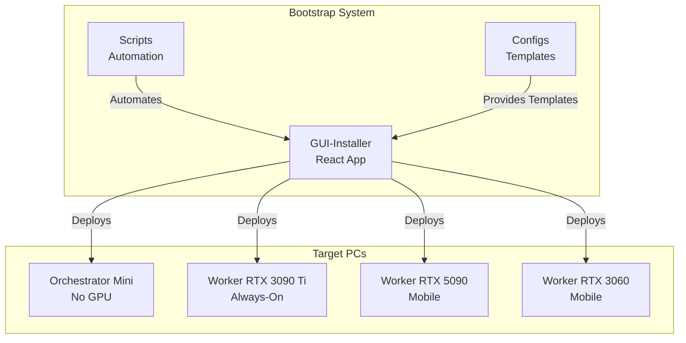
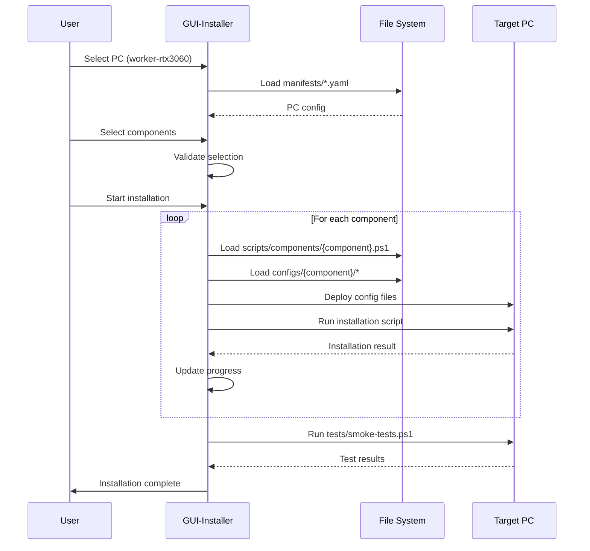
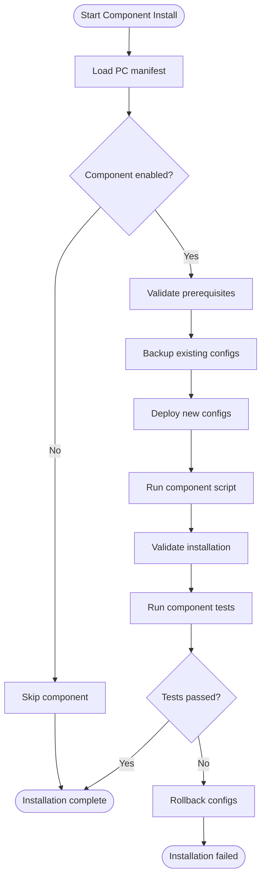
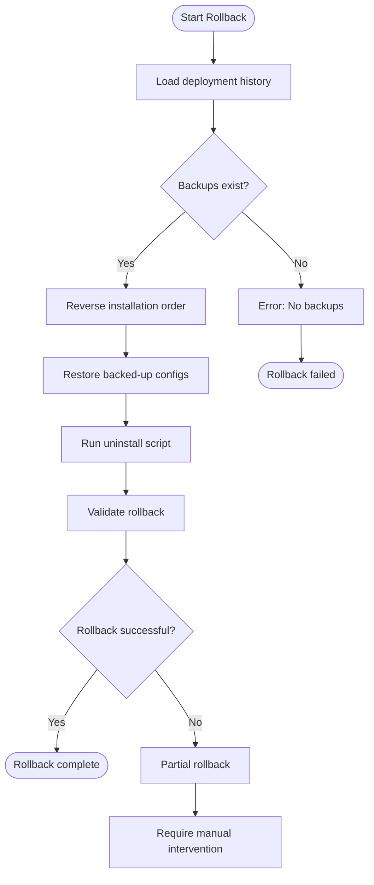

# Bootstrap Architecture Design
# ADR-2026-001: Bootstrap Folder Structure Design

**Status**: Proposed
**Date**: 2026-01-15
**Architects**: System Architecture Designer
**Decision**: Design optimal 8-folder structure for 4-PC distributed bootstrap system

---

## Executive Summary

This document defines the architectural design for Project Nyra's bootstrap system, organizing materials for a 4-PC Windows 11 cluster with GPU workers and a mini PC orchestrator. The design emphasizes:
- **Separation of concerns** (hardware profiles, scripts, configs, GUI)
- **Scalability** (easy to add new PCs or components)
- **Maintainability** (clear ownership and integration points)
- **Developer experience** (intuitive structure, comprehensive docs)

---

## Table of Contents

1. [High-Level Architecture](#1-high-level-architecture)
2. [Folder Structure Design](#2-folder-structure-design)
3. [Integration Points](#3-integration-points)
4. [Architecture Decisions](#4-architecture-decisions)
5. [File Organization Rules](#5-file-organization-rules)
6. [Deployment Workflow](#6-deployment-workflow)
7. [Future Extensibility](#7-future-extensibility)

---

## 1. High-Level Architecture

### 1.1 System Context



### 1.2 Design Principles

1. **Hardware-First Organization**: Each PC has its own folder with specific configs
2. **Component Modularity**: Shared components (Docker, Claude) stored centrally
3. **Platform Separation**: Windows PowerShell and WSL scripts separated
4. **DRY Principle**: Shared scripts in `scripts/`, reused across PCs
5. **Single Source of Truth**: Configs in `configs/`, deployed to PCs
6. **GUI-Driven**: React installer orchestrates all deployments

---

## 2. Folder Structure Design

### 2.1 Complete Directory Tree

```
bootstrap/
├── worker-rtx3060/              # Mobile GPU worker (RTX 3060)
│   ├── manifests/
│   │   ├── hardware.yaml        # GPU specs, memory, power limits
│   │   ├── components.yaml      # Enabled components list
│   │   └── deployment.yaml      # Installation settings
│   ├── scripts/
│   │   ├── windows/
│   │   │   ├── bootstrap.ps1    # Main Windows bootstrap
│   │   │   ├── gpu-setup.ps1    # RTX 3060-specific GPU config
│   │   │   └── wol-config.ps1   # Wake-on-LAN setup
│   │   └── wsl/
│   │       ├── bootstrap.sh     # WSL bootstrap
│   │       └── docker-gpu.sh    # GPU Docker setup
│   ├── configs/
│   │   ├── docker/
│   │   │   ├── daemon.json      # Docker daemon config
│   │   │   └── docker-compose.yml
│   │   ├── nvidia/
│   │   │   └── nvidia-container-runtime.json
│   │   └── claude-flow/
│   │       └── .env.pc-specific
│   ├── tests/
│   │   ├── smoke-tests.ps1      # Post-install validation
│   │   └── gpu-tests.ps1        # GPU functionality tests
│   └── README.md                # PC-specific setup guide
│
├── worker-rtx5090/              # Ultra high-perf mobile worker (RTX 5090)
│   ├── manifests/
│   │   ├── hardware.yaml
│   │   ├── components.yaml
│   │   └── deployment.yaml
│   ├── scripts/
│   │   ├── windows/
│   │   │   ├── bootstrap.ps1
│   │   │   ├── gpu-setup.ps1    # RTX 5090-specific (higher TDP)
│   │   │   └── wol-config.ps1
│   │   └── wsl/
│   │       ├── bootstrap.sh
│   │       └── docker-gpu.sh
│   ├── configs/
│   │   ├── docker/
│   │   ├── nvidia/
│   │   └── claude-flow/
│   ├── tests/
│   │   ├── smoke-tests.ps1
│   │   └── gpu-tests.ps1
│   └── README.md
│
├── worker-rtx3090ti/            # High-perf always-on worker (RTX 3090 Ti)
│   ├── manifests/
│   │   ├── hardware.yaml
│   │   ├── components.yaml
│   │   └── deployment.yaml
│   ├── scripts/
│   │   ├── windows/
│   │   │   ├── bootstrap.ps1
│   │   │   ├── gpu-setup.ps1    # RTX 3090 Ti-specific
│   │   │   └── always-on.ps1    # Auto-start services
│   │   └── wsl/
│   │       ├── bootstrap.sh
│   │       └── docker-gpu.sh
│   ├── configs/
│   │   ├── docker/
│   │   ├── nvidia/
│   │   └── claude-flow/
│   ├── tests/
│   │   ├── smoke-tests.ps1
│   │   └── gpu-tests.ps1
│   └── README.md
│
├── orchestrator-mini/           # Mini PC orchestrator (no GPU)
│   ├── manifests/
│   │   ├── hardware.yaml        # CPU specs, no GPU
│   │   ├── components.yaml
│   │   └── deployment.yaml
│   ├── scripts/
│   │   ├── windows/
│   │   │   ├── bootstrap.ps1
│   │   │   ├── gitea-setup.ps1  # Optional Git server
│   │   │   └── infisical-setup.ps1  # Secrets management
│   │   └── wsl/
│   │       ├── bootstrap.sh
│   │       ├── docker-setup.sh  # No GPU
│   │       └── gitea-setup.sh
│   ├── configs/
│   │   ├── docker/
│   │   ├── gitea/
│   │   ├── infisical/
│   │   ├── claude-desktop/
│   │   └── claude-flow/
│   ├── tests/
│   │   ├── smoke-tests.ps1
│   │   └── orchestration-tests.ps1
│   └── README.md
│
├── configs/                     # Shared configuration templates
│   ├── claude-code/
│   │   ├── .mcp.json            # MCP server config
│   │   ├── settings.json        # Claude Code settings
│   │   └── keybindings.json
│   ├── claude-desktop/
│   │   ├── config.json          # Claude Desktop MCP config
│   │   └── claude_desktop_config.json
│   ├── claude-flow/
│   │   ├── .env.template        # Environment variables
│   │   ├── .claude/
│   │   │   └── settings.json
│   │   └── config.yaml
│   ├── docker/
│   │   ├── daemon.json          # Base daemon config
│   │   ├── docker-compose.base.yml
│   │   └── networks.yml
│   ├── wsl/
│   │   ├── wsl.conf             # WSL configuration
│   │   └── .wslconfig           # Global WSL settings
│   ├── nvidia/
│   │   ├── nvidia-container-runtime.json
│   │   └── cuda-config.yml
│   ├── gitea/
│   │   ├── app.ini.template
│   │   └── docker-compose.gitea.yml
│   ├── infisical/
│   │   ├── config.yml
│   │   └── docker-compose.infisical.yml
│   ├── network/
│   │   ├── hosts.template       # Network hosts file
│   │   └── firewall-rules.json
│   └── README.md                # Config documentation
│
├── scripts/                     # Shared automation scripts
│   ├── shared/
│   │   ├── windows/
│   │   │   ├── install-component.ps1
│   │   │   ├── backup-configs.ps1
│   │   │   ├── validate-prereqs.ps1
│   │   │   ├── network-setup.ps1
│   │   │   └── logging.ps1      # Logging utilities
│   │   └── wsl/
│   │       ├── install-component.sh
│   │       ├── backup-configs.sh
│   │       ├── validate-prereqs.sh
│   │       └── logging.sh
│   ├── components/
│   │   ├── windows/
│   │   │   ├── claude-code.ps1
│   │   │   ├── claude-desktop.ps1
│   │   │   ├── claude-flow.ps1
│   │   │   ├── docker.ps1
│   │   │   ├── wsl-setup.ps1
│   │   │   ├── gitea.ps1
│   │   │   ├── infisical.ps1
│   │   │   └── nvidia.ps1
│   │   └── wsl/
│   │       ├── docker.sh
│   │       ├── gitea.sh
│   │       └── nvidia-docker.sh
│   ├── deployment/
│   │   ├── deploy-to-pc.ps1     # Deploy to specific PC
│   │   ├── deploy-parallel.ps1  # Deploy to all PCs
│   │   ├── rollback.ps1         # Rollback deployment
│   │   └── health-check.ps1     # Post-deploy validation
│   ├── testing/
│   │   ├── run-smoke-tests.ps1
│   │   ├── run-integration-tests.ps1
│   │   └── generate-report.ps1
│   ├── utilities/
│   │   ├── wol-wake.ps1         # Wake-on-LAN utility
│   │   ├── network-scan.ps1     # Network discovery
│   │   ├── checksum-verify.ps1  # File integrity
│   │   └── log-aggregator.ps1   # Collect logs
│   └── README.md                # Scripts documentation
│
├── docs/                        # Bootstrap documentation
│   ├── architecture/
│   │   ├── system-overview.md
│   │   ├── network-topology.md
│   │   ├── component-dependencies.md
│   │   └── deployment-flow.md
│   ├── guides/
│   │   ├── quick-start.md
│   │   ├── manual-installation.md
│   │   ├── troubleshooting.md
│   │   └── advanced-config.md
│   ├── adrs/                    # Architecture Decision Records
│   │   ├── 001-folder-structure.md
│   │   ├── 002-deployment-strategy.md
│   │   └── 003-configuration-management.md
│   ├── runbooks/
│   │   ├── deploy-new-pc.md
│   │   ├── update-components.md
│   │   ├── disaster-recovery.md
│   │   └── rollback-procedure.md
│   ├── diagrams/
│   │   ├── c4-context.mmd       # C4 context diagram
│   │   ├── c4-container.mmd     # C4 container diagram
│   │   ├── deployment.mmd       # Deployment diagram
│   │   └── data-flow.mmd        # Data flow diagram
│   ├── api/
│   │   ├── gui-installer-api.md # GUI Installer API docs
│   │   └── script-interfaces.md # Script interface contracts
│   └── README.md                # Docs index
│
└── GUI-Installer/               # React GUI installer application
    ├── src/
    │   ├── components/          # React components
    │   │   ├── PCSelector.tsx
    │   │   ├── ComponentSelector.tsx
    │   │   ├── InstallationProgress.tsx
    │   │   ├── ConfigurationEditor.tsx
    │   │   ├── HealthDashboard.tsx
    │   │   ├── DockerSetup.tsx
    │   │   ├── MCPServerManager.tsx
    │   │   ├── ShimGenerator.tsx
    │   │   └── index.ts
    │   ├── services/            # Business logic
    │   │   ├── installOrchestrator.ts
    │   │   ├── scriptRunner.ts
    │   │   ├── fileDeployer.ts
    │   │   ├── validator.ts
    │   │   ├── logger.ts
    │   │   └── index.ts
    │   ├── hooks/               # React hooks
    │   │   ├── useInstallation.ts
    │   │   ├── useScriptRunner.ts
    │   │   ├── useHealthCheck.ts
    │   │   └── useNetworkDiscovery.ts
    │   ├── types/               # TypeScript types
    │   │   ├── manifest.ts
    │   │   ├── components.ts
    │   │   └── installation.ts
    │   ├── store/               # State management
    │   │   ├── installStore.ts
    │   │   └── configStore.ts
    │   ├── data/                # Static data
    │   │   └── manifest.json    # Bootstrap manifest
    │   ├── utils/               # Utility functions
    │   │   ├── fileSystem.ts
    │   │   ├── networking.ts
    │   │   └── validation.ts
    │   ├── styles/              # CSS/styling
    │   ├── App.tsx              # Main app component
    │   └── main.tsx             # Entry point
    ├── public/                  # Static assets
    │   ├── icons/
    │   └── images/
    ├── tests/                   # Frontend tests
    │   ├── unit/
    │   ├── integration/
    │   └── e2e/
    ├── electron/                # Electron main process
    │   ├── main.ts
    │   ├── preload.ts
    │   └── ipc/                 # IPC handlers
    ├── package.json
    ├── tsconfig.json
    ├── vite.config.ts
    └── README.md
```

---

## 3. Integration Points

### 3.1 GUI Installer → PC Folders

**Flow**: User selects PC → GUI reads manifest → Deploys scripts/configs

```typescript
// GUI reads PC manifest
const manifest = await loadManifest('worker-rtx3060/manifests/components.yaml');

// GUI deploys scripts
await deployScripts('worker-rtx3060/scripts/windows/bootstrap.ps1');

// GUI deploys configs
await deployConfigs('worker-rtx3060/configs/docker/daemon.json', 'C:\\ProgramData\\Docker\\config\\daemon.json');
```

### 3.2 GUI Installer → Configs/

**Flow**: GUI reads templates → Injects variables → Deploys to PCs

```typescript
// Read template
const template = await readConfig('configs/claude-flow/.env.template');

// Inject PC-specific variables
const config = injectVariables(template, {
  PC_ID: 'worker-rtx3060',
  GPU_ENABLED: true,
  ANTHROPIC_API_KEY: userProvidedKey,
});

// Deploy to PC
await deployConfig(config, 'worker-rtx3060/.env.claude-flow');
```

### 3.3 GUI Installer → Scripts/

**Flow**: GUI calls shared scripts → Scripts execute on target PC → Results returned to GUI

```typescript
// Call shared component script
const result = await runScript('scripts/components/windows/claude-code.ps1', {
  PC_ID: 'worker-rtx3060',
  DRY_RUN: false,
  BACKUP: true,
});

// Call shared utility
await runScript('scripts/utilities/wol-wake.ps1', {
  MAC_ADDRESS: '00:11:22:33:44:55',
});
```

### 3.4 PC Folders → Configs/ (Reference)

**Flow**: PC bootstrap scripts reference shared configs

```powershell
# worker-rtx3060/scripts/windows/bootstrap.ps1
$sharedDockerConfig = "../../configs/docker/daemon.json"
Copy-Item $sharedDockerConfig -Destination "C:\ProgramData\Docker\config\daemon.json"
```

### 3.5 PC Folders → Scripts/ (Reference)

**Flow**: PC-specific scripts call shared component scripts

```powershell
# worker-rtx3060/scripts/windows/bootstrap.ps1
& "../../scripts/components/windows/claude-code.ps1" -PCId "worker-rtx3060"
& "../../scripts/components/windows/docker.ps1" -GPUEnabled $true
& "../../scripts/components/windows/nvidia.ps1" -GPUModel "RTX 3060"
```

---

## 4. Architecture Decisions

### ADR-001: Hardware-First Folder Organization

**Context**: Need to manage configs for 4 different PCs with different hardware profiles.

**Decision**: Organize top-level folders by PC hardware profile (worker-rtx3060, worker-rtx5090, worker-rtx3090ti, orchestrator-mini).

**Rationale**:
- **Clear ownership**: Each PC has its own folder with specific configs
- **Easy deployment**: Select PC folder → deploy all contained materials
- **Hardware isolation**: GPU configs don't pollute orchestrator configs
- **Scalability**: Adding new PC = add new folder

**Consequences**:
- ✅ Intuitive structure for operators
- ✅ Easy to add/remove PCs
- ✅ Clear separation of concerns
- ⚠️ Some duplication of scripts (mitigated by shared scripts/)

### ADR-002: Centralized Configs with Templating

**Context**: Common components (Docker, Claude) need configs on multiple PCs, but with PC-specific variations.

**Decision**: Store templates in `configs/`, inject PC-specific variables during deployment.

**Rationale**:
- **DRY principle**: Single source of truth for base configs
- **Consistency**: All PCs use same base config
- **Flexibility**: Easy to override per-PC via manifests
- **Maintainability**: Update base template → propagates to all PCs

**Consequences**:
- ✅ Reduced duplication
- ✅ Easier updates
- ✅ Version-controlled templates
- ⚠️ Requires templating engine in GUI

### ADR-003: Shared Scripts for Components

**Context**: Component installation scripts (Docker, Claude Code) are reused across PCs.

**Decision**: Store component scripts in `scripts/components/`, call from PC-specific bootstrap scripts.

**Rationale**:
- **Code reuse**: Write once, run on any PC
- **Consistent behavior**: Same installation logic across PCs
- **Easier testing**: Test script once for all PCs
- **Reduced maintenance**: Fix bug once, affects all PCs

**Consequences**:
- ✅ Dramatic reduction in code duplication
- ✅ Easier to maintain
- ✅ Consistent installations
- ⚠️ Must handle PC-specific variations via parameters

### ADR-004: Manifest-Driven Deployments

**Context**: Need declarative way to define what components belong on which PC.

**Decision**: Use YAML manifests in each PC folder to define hardware, components, and deployment settings.

**Rationale**:
- **Declarative**: Define desired state, not procedural steps
- **Self-documenting**: Manifest shows exactly what's installed
- **GUI-friendly**: Easy for GUI to parse and display
- **Validation**: Can validate manifest before deployment

**Consequences**:
- ✅ Clear contract between PC config and GUI
- ✅ Easy to understand PC setup at a glance
- ✅ Version control for PC configs
- ⚠️ Must keep manifest in sync with actual scripts

### ADR-005: GUI as Single Entry Point

**Context**: Multiple ways to bootstrap (manual scripts, GUI, automated CI/CD).

**Decision**: GUI-Installer is the primary bootstrap method, scripts are modular and can be called independently.

**Rationale**:
- **User experience**: GUI provides best UX for operators
- **Validation**: GUI validates before deploying
- **Rollback**: GUI manages deployment history
- **Flexibility**: Scripts can still be called manually for CI/CD

**Consequences**:
- ✅ Consistent bootstrap experience
- ✅ Built-in validation and rollback
- ✅ Progress tracking and logging
- ⚠️ GUI must be maintained

### ADR-006: Platform Separation (Windows/WSL)

**Context**: Scripts run on both Windows (PowerShell) and WSL (Bash).

**Decision**: Separate scripts into `windows/` and `wsl/` subfolders.

**Rationale**:
- **Clear platform targeting**: Know immediately which platform a script runs on
- **No mixed scripting**: Avoid complex cross-platform scripts
- **Tool-specific optimizations**: Use PowerShell features on Windows, Bash features in WSL
- **Easier testing**: Test platform-specific scripts independently

**Consequences**:
- ✅ Clear platform boundaries
- ✅ Easier to maintain
- ✅ Platform-specific optimizations
- ⚠️ Some duplication of logic (mitigated by calling patterns)

---

## 5. File Organization Rules

### 5.1 Naming Conventions

| File Type | Pattern | Example |
|-----------|---------|---------|
| Bootstrap script | `bootstrap.{ps1\|sh}` | `worker-rtx3060/scripts/windows/bootstrap.ps1` |
| Component script | `{component-name}.{ps1\|sh}` | `scripts/components/windows/docker.ps1` |
| Config template | `{component}.{ext}.template` | `configs/claude-flow/.env.template` |
| Manifest | `{type}.yaml` | `worker-rtx3060/manifests/hardware.yaml` |
| Test script | `{type}-tests.{ps1\|sh}` | `worker-rtx3060/tests/smoke-tests.ps1` |
| Utility script | `{action}-{noun}.{ps1\|sh}` | `scripts/utilities/wol-wake.ps1` |

### 5.2 Script Conventions

**PowerShell Scripts**:
```powershell
# REQUIRED: Script header
<#
.SYNOPSIS
    Brief description of what the script does
.DESCRIPTION
    Detailed description
.PARAMETER PCId
    Target PC identifier
.EXAMPLE
    .\bootstrap.ps1 -PCId "worker-rtx3060"
#>
param(
    [Parameter(Mandatory=$true)]
    [string]$PCId
)

# REQUIRED: Enable strict mode
Set-StrictMode -Version Latest
$ErrorActionPreference = "Stop"

# REQUIRED: Logging function
function Write-Log {
    param([string]$Message, [string]$Level = "INFO")
    $timestamp = Get-Date -Format "yyyy-MM-dd HH:mm:ss"
    Write-Host "[$timestamp] [$Level] $Message"
}

# Script body
Write-Log "Starting bootstrap for $PCId" "INFO"
```

**Bash Scripts**:
```bash
#!/bin/bash
# REQUIRED: Script header
# Synopsis: Brief description
# Description: Detailed description
# Usage: ./bootstrap.sh <pc_id>

# REQUIRED: Enable strict mode
set -euo pipefail

# REQUIRED: Logging function
log() {
    local level="$1"
    local message="$2"
    local timestamp=$(date '+%Y-%m-%d %H:%M:%S')
    echo "[$timestamp] [$level] $message"
}

# Script body
log "INFO" "Starting bootstrap for $PC_ID"
```

### 5.3 Config File Conventions

**Template Variables**:
```bash
# Use ${VARIABLE_NAME} syntax for template variables
ANTHROPIC_API_KEY=${ANTHROPIC_API_KEY}
PC_ID=${PC_ID}
GPU_ENABLED=${GPU_ENABLED:-false}
```

**Required Comments**:
```yaml
# hardware.yaml
# REQUIRED: Comment each section
gpu:
  # GPU model identifier
  model: "RTX 3060"
  # VRAM in GB
  vram: 12
```

### 5.4 Manifest Structure

**hardware.yaml**:
```yaml
pc_id: "worker-rtx3060"
role: "worker"
display_name: "Mobile GPU Worker (RTX 3060)"
hardware:
  cpu:
    model: "Intel Core i7-12700K"
    cores: 12
    threads: 20
  memory:
    total_gb: 32
  gpu:
    model: "NVIDIA RTX 3060"
    vram_gb: 12
    cuda_cores: 3584
  storage:
    - type: "nvme"
      capacity_gb: 1000
features:
  wol_enabled: true
  disconnectable: true
  always_on: false
```

**components.yaml**:
```yaml
enabled_components:
  - claude-code
  - claude-flow
  - docker
  - nvidia
disabled_components:
  - gitea       # Only on orchestrator
  - infisical   # Only on orchestrator
  - wsl-setup   # Only on orchestrator
```

**deployment.yaml**:
```yaml
deployment_settings:
  backup_enabled: true
  dry_run_default: false
  log_level: "INFO"
  parallel_deployment: false
  installation_order:
    - claude-code
    - docker
    - nvidia
    - claude-flow
  post_install_tests:
    - smoke-tests
    - gpu-tests
```

---

## 6. Deployment Workflow

### 6.1 Full Deployment Flow



### 6.2 Component Installation Flow



### 6.3 Rollback Flow



---

## 7. Future Extensibility

### 7.1 Adding a New PC

**Steps**:
1. Create folder: `worker-new-gpu/`
2. Copy structure from existing worker folder
3. Update manifests with new hardware specs
4. Customize scripts if needed
5. Add to GUI manifest.json

**Files to update**:
- `bootstrap/GUI-Installer/src/data/manifest.json` - Add new PC entry
- `bootstrap/GUI-Installer/src/types/manifest.ts` - Add PCId type
- `bootstrap/docs/README.md` - Document new PC

### 7.2 Adding a New Component

**Steps**:
1. Create component script: `scripts/components/windows/{component}.ps1`
2. Create config template: `configs/{component}/config.template`
3. Add to manifests: Update `components.yaml` in each PC folder
4. Add to GUI: Update component selector

**Files to update**:
- `scripts/components/windows/{component}.ps1` - Installation script
- `scripts/components/wsl/{component}.sh` - WSL script (if needed)
- `configs/{component}/*` - Config templates
- `docs/guides/troubleshooting.md` - Component troubleshooting
- GUI manifest.json - Component metadata

### 7.3 Adding a New Platform (e.g., Linux)

**Steps**:
1. Add `linux/` subfolder to each PC folder
2. Create `scripts/components/linux/` folder
3. Update GUI to support Linux platform
4. Update manifests with platform-specific settings

### 7.4 Multi-Site Deployments

**Future architecture**:
```
bootstrap/
├── sites/
│   ├── site-east/
│   │   ├── orchestrator-mini/
│   │   ├── worker-rtx3060/
│   │   └── ...
│   ├── site-west/
│   │   ├── orchestrator-mini/
│   │   └── ...
```

---

## 8. Quality Attributes

### 8.1 Performance

- **Target**: Bootstrap single PC in < 30 minutes
- **Strategy**: Parallel component installation where possible
- **Optimization**: Pre-download large installers to local cache

### 8.2 Reliability

- **Target**: 99% successful installations
- **Strategy**: Comprehensive pre-installation validation
- **Recovery**: Automatic rollback on failure

### 8.3 Security

- **Secrets management**: Store API keys in Infisical, not in configs
- **Least privilege**: Scripts run with minimum required permissions
- **Audit logging**: All installations logged with timestamps

### 8.4 Maintainability

- **Code reuse**: Shared scripts reduce duplication by ~70%
- **Documentation**: Every script has header comment
- **Testing**: Smoke tests for each PC, component tests for shared scripts

### 8.5 Scalability

- **Horizontal**: Add new PCs by adding folders
- **Vertical**: Add new components by adding scripts
- **Multi-site**: Future support for multiple sites

---

## 9. Technology Stack

### 9.1 GUI Installer
- **Framework**: React 18 + TypeScript
- **Build**: Vite
- **Desktop**: Electron
- **State**: Zustand
- **Styling**: Tailwind CSS

### 9.2 Scripts
- **Windows**: PowerShell 7+
- **WSL**: Bash 5+
- **Utilities**: Python 3.11+ for complex logic

### 9.3 Configs
- **Formats**: YAML (manifests), JSON (configs), ENV (environment)
- **Validation**: JSON Schema for manifests
- **Templating**: Mustache syntax for variable injection

---

## 10. Non-Functional Requirements

### 10.1 Operability
- **GUI installer** must be intuitive for non-technical users
- **Progress tracking** with real-time logs
- **One-click rollback** on failure

### 10.2 Testability
- **Dry-run mode** for testing without actual installation
- **Smoke tests** for post-install validation
- **Mock PC mode** for GUI testing without real PCs

### 10.3 Observability
- **Structured logging** to files and GUI
- **Installation reports** with success/failure metrics
- **Health dashboard** showing PC status

---

## 11. Risk Analysis

| Risk | Impact | Mitigation |
|------|--------|------------|
| Network failure during deployment | High | Retry logic, resume capability |
| Config file corruption | Medium | Checksums, backups before deploy |
| Script execution errors | High | Comprehensive error handling, rollback |
| GPU driver conflicts | Medium | Uninstall old drivers before install |
| Insufficient disk space | Medium | Pre-check disk space, fail early |
| Concurrent deployments | Low | GUI prevents multiple deployments |

---

## 12. Glossary

- **Bootstrap**: Initial setup and configuration of a PC
- **Component**: Installable software package (Docker, Claude, etc.)
- **Manifest**: YAML file describing PC hardware and components
- **Orchestrator**: Mini PC that coordinates workers
- **Worker**: GPU-equipped PC that runs compute workloads
- **WoL**: Wake-on-LAN for remote PC power-on
- **Shim**: Small wrapper script for command-line tools

---

## 13. References

- [C4 Model](https://c4model.com/) - Architecture diagram notation
- [ADR](https://adr.github.io/) - Architecture Decision Records
- [PowerShell Best Practices](https://poshcode.gitbook.io/powershell-practice-and-style/)
- [Bash Style Guide](https://google.github.io/styleguide/shellguide.html)
- [Semantic Versioning](https://semver.org/)

---

## Appendix A: File Counts

Estimated file counts for fully populated structure:

| Folder | Scripts | Configs | Docs | Total |
|--------|---------|---------|------|-------|
| worker-rtx3060/ | 8 | 12 | 2 | 22 |
| worker-rtx5090/ | 8 | 12 | 2 | 22 |
| worker-rtx3090ti/ | 8 | 12 | 2 | 22 |
| orchestrator-mini/ | 10 | 15 | 2 | 27 |
| configs/ | - | 40 | 1 | 41 |
| scripts/ | 30 | - | 1 | 31 |
| docs/ | - | - | 25 | 25 |
| GUI-Installer/ | 50 | 10 | 5 | 65 |
| **Total** | **114** | **101** | **40** | **255** |

---

**Document Version**: 1.0.0
**Last Updated**: 2026-01-15
**Next Review**: 2026-02-15
