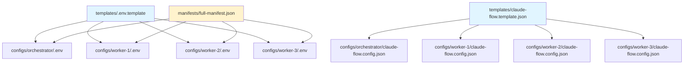

# Bootstrap Directory Structure - Visual Reference

**Version**: 1.0.0
**Date**: 2026-01-15
**Related**: [bootstrap-unified-architecture.md](./bootstrap-unified-architecture.md)

---

## Complete Directory Tree

```
bootstrap/
│
├── installer/                          # React GUI Installer (150 MB)
│   ├── src/
│   │   ├── components/                 # React Components
│   │   │   ├── PCSelector.tsx
│   │   │   ├── EnvironmentSelector.tsx
│   │   │   ├── ComponentSelector.tsx
│   │   │   ├── ConfigurationPanel.tsx
│   │   │   ├── InstallationProgress.tsx
│   │   │   └── ValidationResults.tsx
│   │   ├── services/                   # Business Logic
│   │   │   ├── dockerManager.ts
│   │   │   ├── shimGenerator.ts
│   │   │   ├── configDeployer.ts
│   │   │   ├── mcpOrchestrator.ts
│   │   │   ├── infisicalIntegrator.ts
│   │   │   ├── validator.ts
│   │   │   ├── rollbackManager.ts
│   │   │   ├── logger.ts
│   │   │   └── index.ts
│   │   ├── store/                      # State Management
│   │   │   └── installStore.ts
│   │   ├── hooks/                      # React Hooks
│   │   │   └── useInstallation.ts
│   │   ├── data/                       # Static Data
│   │   │   ├── manifest.json
│   │   │   └── templates/
│   │   ├── App.tsx
│   │   └── main.tsx
│   ├── electron/                       # Optional Desktop Wrapper
│   │   └── main.ts
│   ├── public/
│   ├── package.json
│   ├── tsconfig.json
│   └── vite.config.ts
│
├── docker/                             # Docker Configurations (5 GB images)
│   ├── compose/                        # Docker Compose Files
│   │   ├── docker-compose.base.yml     # Core infrastructure
│   │   ├── docker-compose.mcp.yml      # All MCP servers
│   │   ├── docker-compose.claude-flow.yml
│   │   ├── docker-compose.archon.yml
│   │   ├── docker-compose.orchestrator.yml
│   │   ├── docker-compose.worker.yml
│   │   └── docker-compose.full.yml     # Complete stack (imports all)
│   ├── images/                         # Dockerfiles
│   │   ├── claude-flow/
│   │   │   ├── Dockerfile.dev          # Hot-reload dev mode
│   │   │   ├── Dockerfile.prod         # Production optimized
│   │   │   └── entrypoint.sh
│   │   ├── archon-os/
│   │   │   ├── Dockerfile
│   │   │   └── entrypoint.sh
│   │   ├── mcp-servers/
│   │   │   ├── Dockerfile.infisical
│   │   │   ├── Dockerfile.graphiti
│   │   │   ├── Dockerfile.mem0
│   │   │   ├── Dockerfile.agentdb
│   │   │   ├── Dockerfile.flow-nexus
│   │   │   └── Dockerfile.metamcp-gateway
│   │   └── nyra/
│   │       ├── Dockerfile.orchestrator
│   │       └── Dockerfile.worker
│   └── scripts/                        # Docker Helper Scripts
│       ├── build-all.sh
│       ├── start-pc.sh
│       └── health-check.sh
│
├── shims/                              # Windows Command Shims (10 MB)
│   ├── templates/                      # Shim Templates (Handlebars)
│   │   ├── claude-flow.cmd.template
│   │   ├── archon.cmd.template
│   │   └── mcp-tool.cmd.template
│   ├── generated/                      # Generated Shims (per-PC)
│   │   ├── orchestrator/
│   │   │   ├── claude-flow.cmd
│   │   │   ├── archon.cmd
│   │   │   └── infisical.cmd
│   │   ├── worker-1/
│   │   │   ├── claude-flow.cmd
│   │   │   └── infisical.cmd
│   │   ├── worker-2/
│   │   │   ├── claude-flow.cmd
│   │   │   └── infisical.cmd
│   │   └── worker-3/
│   │       ├── claude-flow.cmd
│   │       └── infisical.cmd
│   └── lib/                            # PowerShell Helpers
│       ├── docker-exec.ps1
│       └── infisical-inject.ps1
│
├── configs/                            # PC-Specific Configurations (50 MB)
│   ├── orchestrator/
│   │   ├── .env                        # NYRA_PC_ID=orchestrator, etc.
│   │   ├── claude-flow.config.json     # Swarm topology, memory, hooks
│   │   ├── archon.config.json          # Master role, distributed mode
│   │   ├── infisical.json              # Secret management config
│   │   └── docker-compose.override.yml # Orchestrator profile activation
│   ├── worker-1/                       # RTX 3060 (mobile)
│   │   ├── .env
│   │   ├── claude-flow.config.json
│   │   ├── gpu.config.json             # GPU type, VRAM, optimization
│   │   └── docker-compose.override.yml
│   ├── worker-2/                       # RTX 5090 (mobile)
│   │   ├── .env
│   │   ├── claude-flow.config.json
│   │   ├── gpu.config.json
│   │   └── docker-compose.override.yml
│   ├── worker-3/                       # RTX 3090Ti (always-on)
│   │   ├── .env
│   │   ├── claude-flow.config.json
│   │   ├── gpu.config.json
│   │   └── docker-compose.override.yml
│   └── templates/                      # Config Templates (Handlebars)
│       ├── .env.template
│       ├── claude-flow.config.template.json
│       ├── archon.config.template.json
│       └── gpu.config.template.json
│
├── scripts/                            # Platform-Specific Bootstrap Scripts (20 MB)
│   ├── windows/                        # PowerShell Scripts
│   │   ├── 01-prerequisites.ps1        # Install Docker, WSL, etc.
│   │   ├── 02-docker-setup.ps1         # Docker daemon config
│   │   ├── 03-wsl-setup.ps1            # WSL2 setup (orchestrator only)
│   │   ├── 04-nvidia-setup.ps1         # NVIDIA Container Toolkit (workers)
│   │   ├── 05-build-images.ps1         # Build all Docker images
│   │   ├── 06-deploy-configs.ps1       # Deploy per-PC configs
│   │   ├── 07-generate-shims.ps1       # Generate command shims
│   │   ├── 08-start-services.ps1       # Start Docker Compose
│   │   └── 09-validate.ps1             # Post-install validation
│   ├── wsl/                            # Bash Scripts
│   │   ├── 01-system-setup.sh          # Ubuntu dependencies
│   │   ├── 02-docker-setup.sh          # Docker in WSL
│   │   └── 03-network-bridge.sh        # Windows-WSL networking
│   └── common/                         # Cross-Platform Utilities
│       ├── health-checks.ps1
│       ├── smoke-test.ps1
│       └── rollback.ps1
│
├── manifests/                          # Deployment Manifests
│   ├── full-manifest.json              # Complete component catalog
│   ├── orchestrator-manifest.json      # Orchestrator-specific
│   ├── worker-manifest.json            # Worker-specific
│   └── pc-topology.json                # 4-PC cluster topology
│
├── templates/                          # File Templates (Handlebars)
│   ├── docker/
│   │   └── .env.template
│   ├── configs/
│   │   ├── claude-flow.template.json
│   │   ├── archon.template.json
│   │   └── mcp-server.template.json
│   └── shims/
│       └── command.cmd.template
│
└── docs/                               # Bootstrap Documentation
    ├── README.md                       # Quick start guide
    ├── ARCHITECTURE.md                 # This architecture
    ├── DOCKER-ARCHITECTURE.md          # Docker-specific details
    ├── SHIM-DESIGN.md                  # Shim implementation
    ├── GUI-INSTALLER.md                # Installer user guide
    └── TROUBLESHOOTING.md              # Common issues
```

---

## Directory Purpose Matrix

| Directory | Size | Purpose | Used By |
|-----------|------|---------|---------|
| `installer/` | 150 MB | React GUI for installation | User (GUI) |
| `docker/` | 5 GB | All Docker images and compose files | Docker Engine |
| `shims/` | 10 MB | Windows command shims | Windows CLI |
| `configs/` | 50 MB | Per-PC configurations | Docker Compose, Services |
| `scripts/` | 20 MB | Automated installation scripts | Installer, Manual setup |
| `manifests/` | <1 MB | Component catalogs and topology | Installer |
| `templates/` | <1 MB | File generation templates | Installer services |
| `docs/` | <1 MB | Documentation | Developers, Users |
| **Total** | **~5.5 GB** | (excluding Docker volumes) | |

---

## File Flow During Installation

```mermaid
flowchart LR
    subgraph "Source Files"
        T1[templates/]
        M1[manifests/full-manifest.json]
        D1[docker/images/]
    end

    subgraph "Generation"
        G1[shimGenerator.ts]
        G2[configDeployer.ts]
        G3[docker build]
    end

    subgraph "Output Files"
        O1[shims/generated/]
        O2[configs/{pc-id}/]
        O3[Docker images]
    end

    T1 --> G1
    T1 --> G2
    M1 --> G2
    D1 --> G3

    G1 --> O1
    G2 --> O2
    G3 --> O3

    O1 --> P1[Windows PATH]
    O2 --> P2[docker-compose up]
    O3 --> P2
```

---

## PC-Specific File Deployment

### Orchestrator Deployment
```
bootstrap/configs/orchestrator/
├── .env                              # NYRA_PC_ID=orchestrator
├── claude-flow.config.json           # topology: hierarchical-mesh
├── archon.config.json                # role: master
├── infisical.json                    # project-id, token
└── docker-compose.override.yml       # profiles: [orchestrator]

bootstrap/shims/generated/orchestrator/
├── claude-flow.cmd                   # docker exec nyra-claude-flow-mcp
├── archon.cmd                        # docker exec nyra-archon-mcp
└── infisical.cmd                     # docker exec nyra-infisical-mcp
```

### Worker Deployment (Example: Worker-1)
```
bootstrap/configs/worker-1/
├── .env                              # NYRA_PC_ID=worker-1, GPU_TYPE=rtx_3060
├── claude-flow.config.json           # topology: mesh, maxAgents: 8
├── gpu.config.json                   # vram: 12GB, optimization settings
└── docker-compose.override.yml       # profiles: [worker], worker-id: 1

bootstrap/shims/generated/worker-1/
├── claude-flow.cmd                   # docker exec nyra-worker-1-claude-flow
└── infisical.cmd                     # docker exec nyra-infisical-mcp
```

---

## Key Files Reference

### Installer Entry Point
```
bootstrap/installer/src/main.tsx
└─> App.tsx
    ├─> PCSelector
    ├─> ComponentSelector
    └─> InstallationProgress
```

### Docker Stack Entry Point
```
bootstrap/docker/compose/docker-compose.full.yml
├─> imports: base.yml (Infisical, MetaMCP)
├─> imports: mcp.yml (All MCP servers)
├─> imports: claude-flow.yml
├─> imports: archon.yml
├─> imports: orchestrator.yml (profile: orchestrator)
└─> imports: worker.yml (profile: worker)
```

### Shim Execution Flow
```
Windows CLI: claude-flow swarm status
└─> Shim: bootstrap/shims/generated/{pc-id}/claude-flow.cmd
    └─> Docker Exec: docker exec -it nyra-claude-flow-mcp npx @claude-flow/cli@latest swarm status
        └─> Container: nyra-claude-flow-mcp
            └─> Output: Swarm status JSON
```

---

## Configuration Inheritance



---

## Disk Space Requirements

### By PC Type

**Orchestrator**:
- Docker Images: ~3.5 GB (all MCP servers + databases)
- Configs: ~50 MB
- Shims: ~5 MB
- Docker Volumes: ~2 GB (databases)
- **Total**: ~5.5 GB + 2 GB volumes

**Worker (any)**:
- Docker Images: ~2 GB (Claude Flow + core MCP servers)
- Configs: ~30 MB
- Shims: ~3 MB
- Docker Volumes: ~500 MB (cache)
- **Total**: ~2.5 GB + 500 MB volumes

### Installation Workspace
- Installer: ~150 MB (React app)
- Bootstrap scripts: ~20 MB
- Templates: ~1 MB
- **Total**: ~170 MB

---

## Generated vs Static Files

### Static Files (version-controlled)
- `bootstrap/installer/` - React app source
- `bootstrap/docker/images/` - Dockerfiles
- `bootstrap/docker/compose/` - Compose files
- `bootstrap/scripts/` - Installation scripts
- `bootstrap/templates/` - File templates
- `bootstrap/manifests/` - Component catalogs

### Generated Files (not version-controlled)
- `bootstrap/shims/generated/` - Per-PC shims
- `bootstrap/configs/{pc-id}/` - Per-PC configs (from templates)
- Docker images (built from Dockerfiles)
- Docker volumes (runtime data)

**.gitignore Entries**:
```gitignore
# Generated files
bootstrap/shims/generated/
bootstrap/configs/orchestrator/.env
bootstrap/configs/worker-*/.env

# Build artifacts
bootstrap/installer/dist/
bootstrap/installer/node_modules/

# Docker runtime
bootstrap/docker/.env.local
```

---

**End of Directory Structure Reference**
