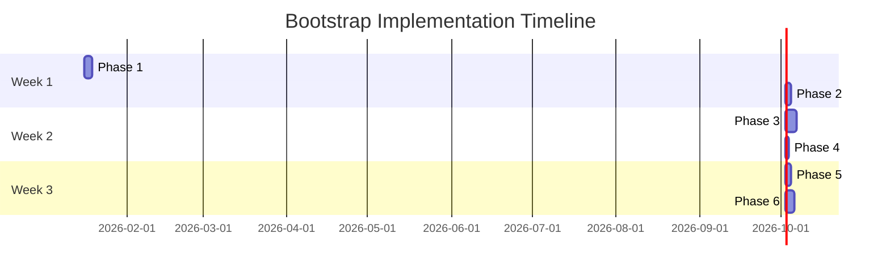

# Bootstrap Implementation Roadmap

**Version**: 1.0.0
**Date**: 2026-01-15
**Status**: Planning Phase
**Related**: [bootstrap-unified-architecture.md](./bootstrap-unified-architecture.md)

---

## Executive Summary

This roadmap provides a phased approach to implementing the unified bootstrap architecture for Project Nyra. The implementation is divided into 6 phases over 3 weeks, with clear deliverables and validation criteria for each phase.

---

## Implementation Phases

### Phase 1: Docker Images & Base Infrastructure (Week 1, Days 1-3)

**Objective**: Create all Docker images and base docker-compose infrastructure.

#### Tasks

**1.1 Create Docker Image Directory Structure**
- [ ] Create `bootstrap/docker/images/` directory
- [ ] Create subdirectories for each service type
- [ ] Copy existing Dockerfiles from `infra/docker/`
- [ ] Organize Dockerfiles by service category

**1.2 Build Claude Flow Images**
- [ ] Create `bootstrap/docker/images/claude-flow/Dockerfile.dev`
  - Hot-reload with volume mounts
  - Development dependencies included
  - Debugger support
- [ ] Create `bootstrap/docker/images/claude-flow/Dockerfile.prod`
  - Multi-stage build for smaller size
  - Production optimizations
  - Health check endpoint
- [ ] Create `bootstrap/docker/images/claude-flow/entrypoint.sh`
  - Environment variable validation
  - Infisical secret loading
  - Claude Flow daemon startup

**1.3 Build Archon OS Images**
- [ ] Create `bootstrap/docker/images/archon-os/Dockerfile`
  - Base image with dependencies
  - Distributed mode configuration
  - Role-based initialization (master/worker)
- [ ] Create `bootstrap/docker/images/archon-os/entrypoint.sh`
  - Role detection (ARCHON_ROLE env var)
  - Master/worker startup logic

**1.4 Build MCP Server Images**
- [ ] Create `Dockerfile.infisical` (port 8006)
  - Infisical CLI installation
  - MCP server wrapper
  - Secret volume mounting
- [ ] Create `Dockerfile.metamcp-gateway` (port 8005)
  - Gateway aggregation logic
  - Routing to downstream MCP servers
  - Health check aggregation
- [ ] Create `Dockerfile.graphiti` (port 8007)
- [ ] Create `Dockerfile.mem0` (port 8008)
- [ ] Create `Dockerfile.agentdb` (port 8009)
- [ ] Create `Dockerfile.flow-nexus` (port 8010)

**1.5 Build Nyra Service Images**
- [ ] Create `Dockerfile.orchestrator`
  - Node.js + TypeScript runtime
  - Database connection pooling
  - API server + management UI
- [ ] Create `Dockerfile.worker`
  - NVIDIA runtime base image
  - CUDA toolkit installation
  - GPU monitoring tools

**1.6 Create Docker Compose Files**
- [ ] Create `docker-compose.base.yml`
  - Infisical MCP
  - MetaMCP Gateway
  - Network definition (nyra-network)
  - Volume definitions (infisical_secrets)
- [ ] Create `docker-compose.mcp.yml`
  - All MCP servers (Graphiti, Mem0, AgentDB, Flow Nexus)
  - Dependencies on base services
- [ ] Create `docker-compose.claude-flow.yml`
  - Claude Flow MCP service
  - Config volume mounts
  - MCP mode flag
- [ ] Create `docker-compose.archon.yml`
  - Archon MCP service
  - Distributed configuration
- [ ] Create `docker-compose.orchestrator.yml`
  - Orchestrator service (profile: orchestrator)
  - PostgreSQL, FalkorDB, ChromaDB
  - Dependencies on MCP services
- [ ] Create `docker-compose.worker.yml`
  - Worker service template (profile: worker)
  - GPU device mappings
  - Worker-specific ports
- [ ] Create `docker-compose.full.yml`
  - Import all compose files
  - Override examples

**1.7 Build Scripts**
- [ ] Create `bootstrap/docker/scripts/build-all.sh`
  - Build all images in dependency order
  - Tag with version numbers
  - Progress logging
- [ ] Create `bootstrap/docker/scripts/start-pc.sh`
  - Start Docker Compose with PC-specific profile
  - Health check waiting
- [ ] Create `bootstrap/docker/scripts/health-check.sh`
  - Test all container health endpoints
  - Retry logic with timeout

#### Validation Criteria
- [ ] All Docker images build successfully
- [ ] All images tagged correctly
- [ ] docker-compose.full.yml validates with `docker-compose config`
- [ ] Base services start without errors
- [ ] Health checks pass for all containers

#### Estimated Time: 3 days

---

### Phase 2: Command Shim System (Week 1, Days 4-5)

**Objective**: Implement Windows command shims for transparent Docker execution.

#### Tasks

**2.1 Create Shim Templates**
- [ ] Create `bootstrap/shims/templates/claude-flow.cmd.template`
  - Docker daemon check
  - Container existence check
  - Docker exec with argument forwarding
  - Error handling
- [ ] Create `bootstrap/shims/templates/archon.cmd.template`
  - Similar to claude-flow template
  - Archon-specific commands
- [ ] Create `bootstrap/shims/templates/mcp-tool.cmd.template`
  - Generic MCP tool shim
  - Container name parameterization

**2.2 Create PowerShell Helpers**
- [ ] Create `bootstrap/shims/lib/docker-exec.ps1`
  - Reusable Docker exec wrapper
  - Input/output handling
  - Exit code forwarding
- [ ] Create `bootstrap/shims/lib/infisical-inject.ps1`
  - Fetch secrets from Infisical MCP
  - Build environment variable string
  - Inject into Docker exec command

**2.3 Implement Shim Generator Service**
- [ ] Create `bootstrap/installer/src/services/shimGenerator.ts`
  - TypeScript class with Handlebars integration
  - Template compilation
  - File writing with permissions
  - PATH registration (Windows registry)
- [ ] Add interface `ShimConfig`
  - Command name, container name, exec command
  - PC ID, install path
- [ ] Add method `generateShim(config: ShimConfig): Promise<string>`
- [ ] Add method `generateAllShims(pcId: string): Promise<string[]>`
- [ ] Add method `addToPath(directory: string): Promise<void>`

**2.4 Test Shim Execution**
- [ ] Generate test shims manually
- [ ] Test `claude-flow.cmd --version`
- [ ] Test `claude-flow.cmd swarm status`
- [ ] Test `archon.cmd status`
- [ ] Verify PATH registration

#### Validation Criteria
- [ ] Shim templates compile successfully
- [ ] Generated shims execute without errors
- [ ] Commands forward arguments correctly
- [ ] Exit codes propagate correctly
- [ ] PATH includes shim directory

#### Estimated Time: 2 days

---

### Phase 3: React GUI Installer (Week 2, Days 1-4)

**Objective**: Build complete React installer with all features.

#### Tasks

**3.1 Project Setup**
- [ ] Initialize Vite + React + TypeScript project
  ```bash
  cd bootstrap/installer
  npm create vite@latest . -- --template react-ts
  npm install
  ```
- [ ] Install dependencies
  ```bash
  npm install zustand handlebars fs-extra
  npm install @types/node @types/fs-extra --save-dev
  npm install tailwindcss postcss autoprefixer
  npx tailwindcss init -p
  ```
- [ ] Configure TailwindCSS
- [ ] Install shadcn/ui components (optional)

**3.2 Create Zustand Store**
- [ ] Create `src/store/installStore.ts`
  - State: `selectedPC`, `enabledComponents`, `currentPhase`, `progress`, `logs`, `isInstalling`, `error`
  - Actions: `setPC`, `toggleComponent`, `setPhase`, `setProgress`, `addLog`, `startInstallation`
- [ ] Add persistence (localStorage)
- [ ] Add TypeScript types

**3.3 Create React Components**
- [ ] Create `src/components/PCSelector.tsx`
  - Radio buttons for PC selection
  - Visual cards with PC specs
  - Orchestrator vs Worker distinction
- [ ] Create `src/components/EnvironmentSelector.tsx`
  - WSL + Windows vs Windows Only
  - Conditional on orchestrator selection
- [ ] Create `src/components/ComponentSelector.tsx`
  - Checkbox list of components
  - Required components disabled
  - Dependency checking
  - Size estimation
- [ ] Create `src/components/ConfigurationPanel.tsx`
  - Component-specific configuration inputs
  - Environment variable overrides
  - Port customization
- [ ] Create `src/components/InstallationProgress.tsx`
  - Progress bar (0-100%)
  - Phase indicators
  - Real-time log output
  - Action buttons (Retry, Rollback)
- [ ] Create `src/components/ValidationResults.tsx`
  - Post-install validation results
  - Container status
  - Health check results
  - Shim verification

**3.4 Create Service Layer**
- [ ] Create `src/services/dockerManager.ts`
  - `setupDocker(): Promise<void>`
  - `buildImages(components: string[]): Promise<void>`
  - `startServices(pcId: string, components: string[]): Promise<void>`
  - `stopAllServices(): Promise<void>`
  - `removeContainers(): Promise<void>`
  - `removeVolumes(): Promise<void>`
- [ ] Create `src/services/configDeployer.ts`
  - `deployConfigs(pcId: string, components: string[]): Promise<void>`
  - `generateFromTemplate(template: string, vars: object): string`
  - `writeConfigFile(path: string, content: string): Promise<void>`
- [ ] Create `src/services/mcpOrchestrator.ts`
  - `startMCPServer(name: string): Promise<void>`
  - `stopMCPServer(name: string): Promise<void>`
  - `checkMCPHealth(name: string): Promise<boolean>`
- [ ] Create `src/services/infisicalIntegrator.ts`
  - `setupInfisical(projectId: string, token: string): Promise<void>`
  - `fetchSecrets(path: string): Promise<Record<string, string>>`
  - `injectSecrets(containerName: string, secrets: object): Promise<void>`
- [ ] Create `src/services/validator.ts`
  - `validatePrerequisites(): Promise<ValidationResult>`
  - `validatePostInstallation(components: string[]): Promise<ValidationResult>`
  - `checkDockerRunning(): Promise<boolean>`
  - `checkContainersRunning(names: string[]): Promise<boolean>`
  - `checkHealthEndpoints(urls: string[]): Promise<boolean>`
  - `checkShimsWorking(commands: string[]): Promise<boolean>`
- [ ] Create `src/services/rollbackManager.ts`
  - `createBackup(): Promise<string>`
  - `rollback(backupPath: string): Promise<void>`
  - `backupDockerVolumes(path: string): Promise<void>`
  - `restoreDockerVolumes(path: string): Promise<void>`
- [ ] Create `src/services/logger.ts`
  - `info(message: string, details?: string): void`
  - `warn(message: string, details?: string): void`
  - `error(message: string, error?: Error): void`
  - `success(message: string): void`

**3.5 Create Installation Orchestrator**
- [ ] Create `src/services/installOrchestrator.ts`
  - `executeInstallation(pcId, components, environment): Promise<void>`
  - `installPrerequisites(environment): Promise<void>`
  - `rollback(): Promise<void>`
  - Progress tracking integration
  - Error handling and recovery

**3.6 Create Custom Hooks**
- [ ] Create `src/hooks/useInstallation.ts`
  - `startInstallation(): void`
  - `retryInstallation(): void`
  - `rollbackInstallation(): void`
  - Wraps InstallOrchestrator with store integration

**3.7 Create Main App**
- [ ] Create `src/App.tsx`
  - Multi-step wizard layout
  - Component routing based on currentPhase
  - Navigation controls

#### Validation Criteria
- [ ] React app builds without errors
- [ ] All components render correctly
- [ ] Store state updates propagate to UI
- [ ] Services can be called from components
- [ ] Mock installation completes successfully

#### Estimated Time: 4 days

---

### Phase 4: PC-Specific Configurations (Week 2, Day 5)

**Objective**: Create configuration templates and deployment system.

#### Tasks

**4.1 Create Configuration Templates**
- [ ] Create `bootstrap/configs/templates/.env.template`
  ```bash
  NYRA_PC_ID={{PC_ID}}
  NYRA_MODE={{MODE}}
  NYRA_ENVIRONMENT={{ENVIRONMENT}}
  COMPOSE_PROJECT_NAME=nyra-{{PC_ID}}
  COMPOSE_PROFILES={{PROFILES}}
  CLAUDE_FLOW_MODE={{CLAUDE_FLOW_MODE}}
  ...
  ```
- [ ] Create `bootstrap/configs/templates/claude-flow.config.template.json`
  ```json
  {
    "pc": {
      "id": "{{PC_ID}}",
      "role": "{{ROLE}}",
      "capabilities": {{CAPABILITIES}}
    },
    "swarm": {
      "topology": "{{TOPOLOGY}}",
      "maxAgents": {{MAX_AGENTS}}
    }
  }
  ```
- [ ] Create `bootstrap/configs/templates/archon.config.template.json`
- [ ] Create `bootstrap/configs/templates/gpu.config.template.json` (workers only)
- [ ] Create `bootstrap/configs/templates/docker-compose.override.template.yml`

**4.2 Create Per-PC Config Directories**
- [ ] Create `bootstrap/configs/orchestrator/`
- [ ] Create `bootstrap/configs/worker-1/`
- [ ] Create `bootstrap/configs/worker-2/`
- [ ] Create `bootstrap/configs/worker-3/`

**4.3 Create Deployment Manifest**
- [ ] Create `bootstrap/manifests/full-manifest.json`
  - Complete component catalog
  - Component metadata (required, dockerImage, port, dependencies)
  - Per-PC deployment profiles
- [ ] Create `bootstrap/manifests/orchestrator-manifest.json`
- [ ] Create `bootstrap/manifests/worker-manifest.json`
- [ ] Create `bootstrap/manifests/pc-topology.json`

**4.4 Implement Config Deployer**
- [ ] Add Handlebars template compilation
- [ ] Add variable substitution logic
- [ ] Add file writing with directory creation
- [ ] Test config generation for all PCs

#### Validation Criteria
- [ ] Templates compile with sample variables
- [ ] Generated configs are syntactically valid (JSON, YAML, env)
- [ ] All required files generated for each PC
- [ ] Manifests load and parse correctly

#### Estimated Time: 1 day

---

### Phase 5: PowerShell Bootstrap Scripts (Week 3, Days 1-2)

**Objective**: Create automated installation scripts for manual/automated setup.

#### Tasks

**5.1 Create Windows Prerequisites Script**
- [ ] Create `bootstrap/scripts/windows/01-prerequisites.ps1`
  - Check Windows version
  - Install Docker Desktop (if not installed)
  - Enable Hyper-V and Containers feature
  - Install WSL2 (if orchestrator)
  - Install Chocolatey (package manager)
  - Install Git, Node.js, etc.

**5.2 Create Docker Setup Script**
- [ ] Create `bootstrap/scripts/windows/02-docker-setup.ps1`
  - Configure Docker daemon
  - Enable experimental features
  - Set resource limits
  - Configure Docker network
  - Test Docker installation

**5.3 Create WSL Setup Script**
- [ ] Create `bootstrap/scripts/windows/03-wsl-setup.ps1`
  - Install Ubuntu on WSL2
  - Configure WSL networking
  - Install Docker in WSL
  - Create bridge between Windows and WSL
  - Test WSL Docker connectivity

**5.4 Create NVIDIA Setup Script**
- [ ] Create `bootstrap/scripts/windows/04-nvidia-setup.ps1`
  - Check NVIDIA driver installation
  - Install NVIDIA Container Toolkit
  - Configure Docker for GPU support
  - Test GPU access in container

**5.5 Create Image Build Script**
- [ ] Create `bootstrap/scripts/windows/05-build-images.ps1`
  - Build all Docker images
  - Tag with version numbers
  - Progress reporting
  - Error handling

**5.6 Create Config Deployment Script**
- [ ] Create `bootstrap/scripts/windows/06-deploy-configs.ps1`
  - Read PC ID from environment
  - Generate configs from templates
  - Copy configs to appropriate locations
  - Validate generated configs

**5.7 Create Shim Generation Script**
- [ ] Create `bootstrap/scripts/windows/07-generate-shims.ps1`
  - Generate shims for current PC
  - Add to PATH
  - Test shim execution

**5.8 Create Service Start Script**
- [ ] Create `bootstrap/scripts/windows/08-start-services.ps1`
  - Load PC-specific docker-compose files
  - Start services with appropriate profile
  - Wait for health checks
  - Display service URLs

**5.9 Create Validation Script**
- [ ] Create `bootstrap/scripts/windows/09-validate.ps1`
  - Run post-install validation
  - Check container status
  - Test health endpoints
  - Verify shims
  - Generate validation report

**5.10 Create WSL Scripts**
- [ ] Create `bootstrap/scripts/wsl/01-system-setup.sh`
- [ ] Create `bootstrap/scripts/wsl/02-docker-setup.sh`
- [ ] Create `bootstrap/scripts/wsl/03-network-bridge.sh`

**5.11 Create Common Utilities**
- [ ] Create `bootstrap/scripts/common/health-checks.ps1`
- [ ] Create `bootstrap/scripts/common/smoke-test.ps1`
- [ ] Create `bootstrap/scripts/common/rollback.ps1`

#### Validation Criteria
- [ ] All scripts execute without errors
- [ ] Scripts are idempotent (can run multiple times)
- [ ] Error handling works correctly
- [ ] Progress reporting is clear
- [ ] Scripts work on clean Windows 11 installation

#### Estimated Time: 2 days

---

### Phase 6: Integration Testing & Documentation (Week 3, Days 3-5)

**Objective**: End-to-end testing and comprehensive documentation.

#### Tasks

**6.1 Integration Testing**
- [ ] Test orchestrator installation (clean Windows 11)
  - Run GUI installer
  - Select orchestrator
  - Select all components
  - Complete installation
  - Validate all services running
  - Test command shims
- [ ] Test worker-1 installation (RTX 3060)
  - Run GUI installer
  - Select worker-1
  - Select worker components
  - Complete installation
  - Validate GPU access
  - Test Claude Flow worker mode
- [ ] Test worker-2 installation (RTX 5090)
- [ ] Test worker-3 installation (RTX 3090Ti)
- [ ] Test cross-PC communication
  - Orchestrator can reach all workers
  - Workers can reach orchestrator
  - Claude Flow swarm coordination works
  - Archon distributed mode works

**6.2 Performance Benchmarking**
- [ ] Measure installation time per PC
- [ ] Measure container startup time
- [ ] Measure resource usage (CPU, RAM, disk)
- [ ] Measure GPU utilization (workers)
- [ ] Document baseline performance metrics

**6.3 Create User Documentation**
- [ ] Create `bootstrap/docs/README.md`
  - Quick start guide
  - System requirements
  - Installation steps (GUI)
  - Installation steps (manual)
  - Common use cases
- [ ] Create `bootstrap/docs/GUI-INSTALLER.md`
  - GUI walkthrough with screenshots
  - Component selection guide
  - Configuration options explained
  - Troubleshooting common GUI issues
- [ ] Create `bootstrap/docs/DOCKER-ARCHITECTURE.md`
  - Docker networking explained
  - Volume management
  - Image management
  - Container lifecycle
- [ ] Create `bootstrap/docs/SHIM-DESIGN.md`
  - How shims work
  - Shim execution flow
  - Customizing shims
  - Troubleshooting shims
- [ ] Create `bootstrap/docs/TROUBLESHOOTING.md`
  - Common issues and solutions
  - Docker not starting
  - Container fails to start
  - Port conflicts
  - Shim not found
  - Health check failures
  - Infisical secrets missing
  - GPU not detected

**6.4 Create Developer Documentation**
- [ ] Document architecture decisions (ADRs)
- [ ] Document API contracts (MCP servers)
- [ ] Document configuration options
- [ ] Document extension points
- [ ] Document testing strategy

**6.5 Create Demo Materials**
- [ ] Record installation demo video
- [ ] Create screenshot gallery
- [ ] Create quick reference cards
- [ ] Create architecture diagrams (refined)

#### Validation Criteria
- [ ] All 4 PCs install successfully
- [ ] Cross-PC communication verified
- [ ] Performance meets expectations
- [ ] Documentation complete and accurate
- [ ] Demo video recorded

#### Estimated Time: 3 days

---

## Implementation Timeline



---

## Risk Management

### High-Risk Items

| Risk | Impact | Mitigation |
|------|--------|------------|
| Docker Desktop compatibility issues | High | Test on multiple Windows 11 versions, provide fallback options |
| GPU driver conflicts | High | Document specific NVIDIA driver versions, provide rollback |
| WSL2 networking issues | Medium | Provide detailed troubleshooting, test on multiple PCs |
| Infisical secret sync failures | Medium | Implement retry logic, provide manual secret entry option |
| Port conflicts on host | Low | Implement port availability check, allow customization |

### Contingency Plans

**If Docker Desktop doesn't work**:
- Provide alternative: Rancher Desktop or Podman Desktop
- Document manual Docker Engine setup

**If WSL2 causes issues**:
- Provide Windows-only installation path
- Document Docker Desktop without WSL2 backend

**If GPU access fails**:
- Provide CPU fallback mode for workers
- Document manual NVIDIA Container Toolkit setup

---

## Success Criteria

### Phase Completion Criteria
- [ ] Phase 1: All Docker images build and containers start
- [ ] Phase 2: Shims execute commands successfully
- [ ] Phase 3: GUI installer completes mock installation
- [ ] Phase 4: Configs generated for all PCs
- [ ] Phase 5: Scripts execute on clean Windows 11
- [ ] Phase 6: All 4 PCs operational and communicating

### Final Acceptance Criteria
- [ ] **Functional**: User can install orchestrator + 3 workers via GUI
- [ ] **Functional**: All containers start and pass health checks
- [ ] **Functional**: Command shims work from any terminal
- [ ] **Functional**: Cross-PC communication verified
- [ ] **Performance**: Installation completes in < 30 minutes per PC
- [ ] **Performance**: Container startup < 60 seconds
- [ ] **Documentation**: All documentation complete and accurate
- [ ] **Testing**: 100% of critical paths tested

---

## Post-Implementation Maintenance

### Version 1.1 (Future Enhancement)
- [ ] Remote installation support
- [ ] Update manager for in-place updates
- [ ] Monitoring dashboard in GUI installer
- [ ] Auto-discovery of PCs on network
- [ ] Cloud backup of configurations

### Version 2.0 (Future Major Update)
- [ ] Kubernetes support (optional K8s deployment)
- [ ] CI/CD integration (auto-deploy on Git push)
- [ ] Multi-cluster support
- [ ] AI-powered troubleshooting

---

## Resources Required

### Personnel
- **System Architect**: Architecture design, code review (ongoing)
- **Full-Stack Developer**: React installer, services layer (Week 2)
- **DevOps Engineer**: Docker images, scripts, testing (Week 1, Week 3)
- **Technical Writer**: Documentation (Week 3)

### Tools & Software
- Windows 11 Pro (for testing)
- Docker Desktop (latest stable)
- Visual Studio Code
- Node.js 20+ (for installer development)
- PowerShell 7+ (for scripts)

### Hardware for Testing
- Orchestrator Mini PC (testing WSL + databases)
- Worker PC with NVIDIA GPU (testing GPU access)

---

## Appendix: Quick Command Reference

### Build All Docker Images
```bash
cd bootstrap/docker
./scripts/build-all.sh
```

### Generate Shims for PC
```bash
cd bootstrap/scripts/windows
.\07-generate-shims.ps1 -PCId orchestrator
```

### Start Services for PC
```bash
cd bootstrap/scripts/windows
.\08-start-services.ps1 -PCId orchestrator
```

### Run Validation
```bash
cd bootstrap/scripts/windows
.\09-validate.ps1 -PCId orchestrator
```

### Launch GUI Installer
```bash
cd bootstrap/installer
npm run dev
```

---

**End of Implementation Roadmap**
