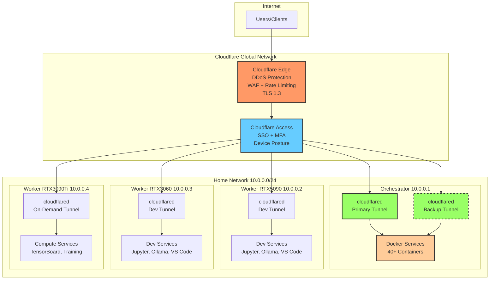
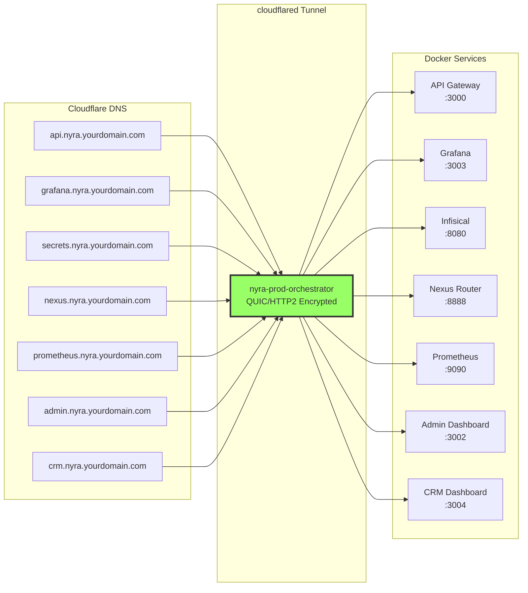
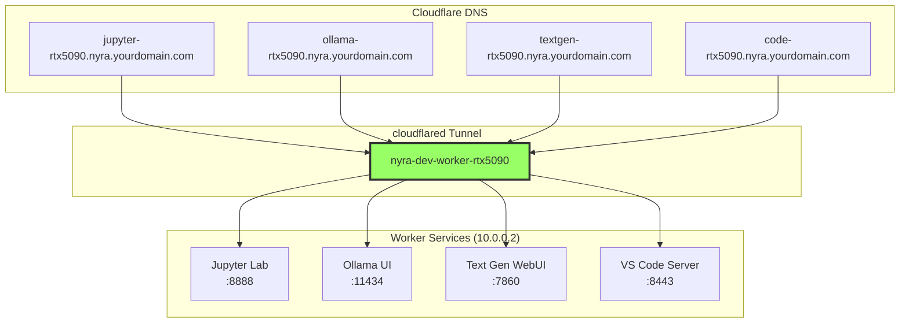
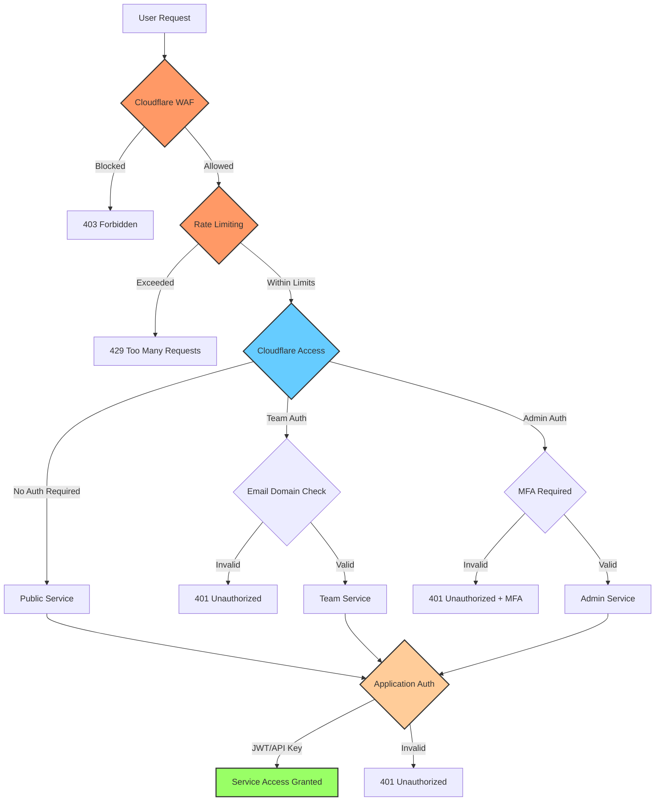
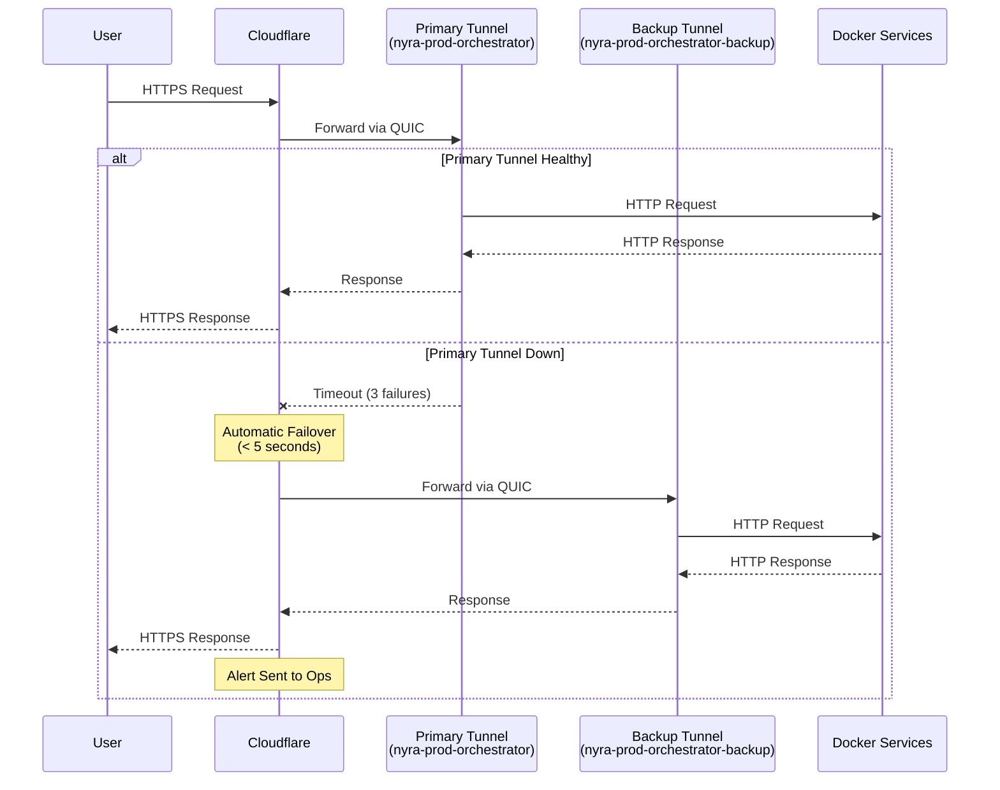
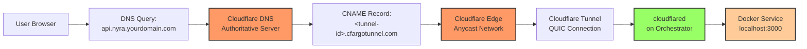
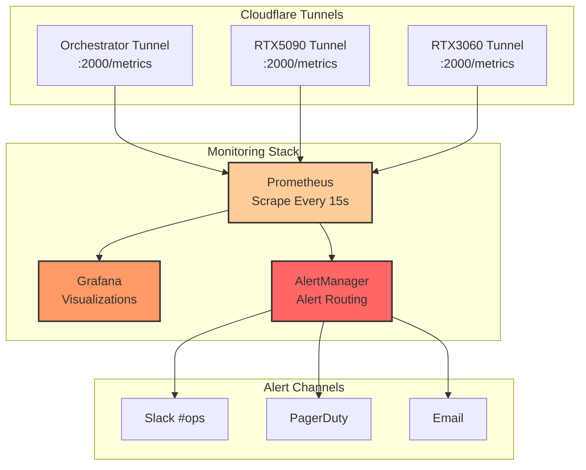
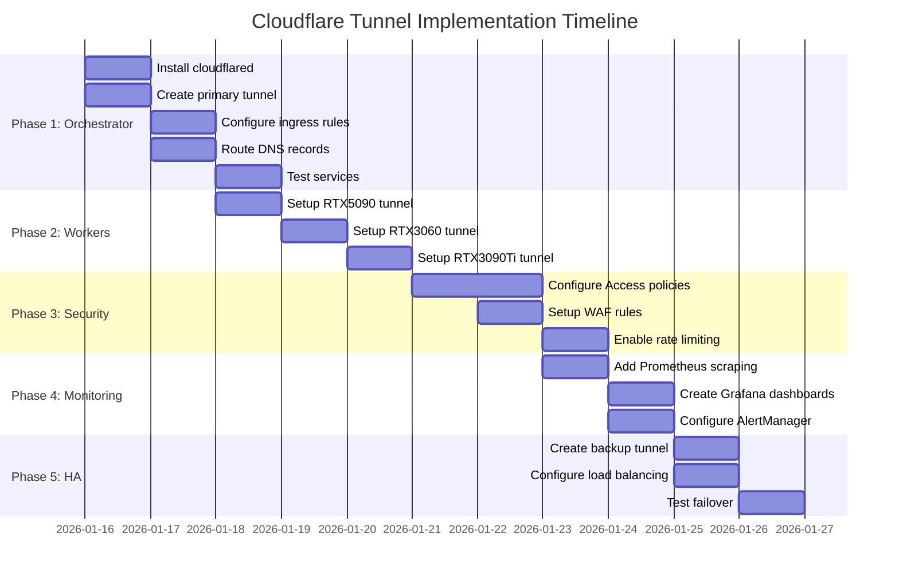
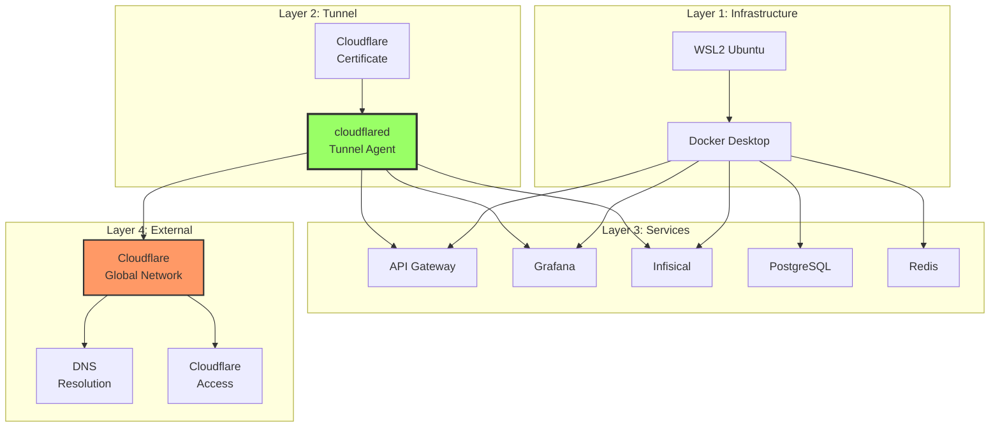
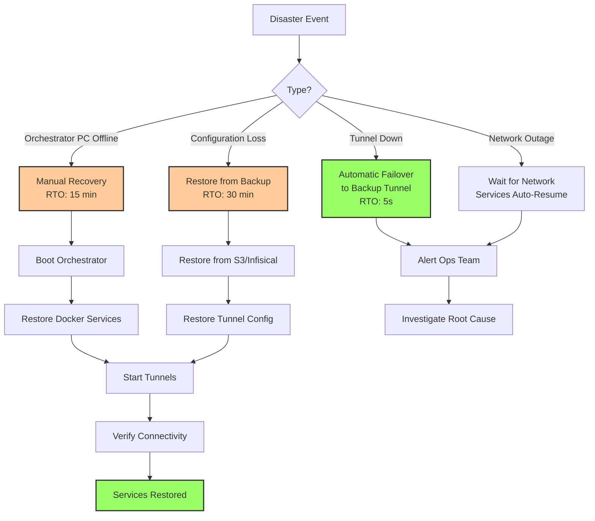

# Cloudflare Tunnel Architecture Diagrams

**Version:** 1.0.0
**Last Updated:** 2026-01-15

---

## 1. High-Level Network Architecture



---

## 2. Orchestrator Service Mapping



---

## 3. Worker Service Mapping



---

## 4. Security Layers



---

## 5. Tunnel Failover Flow



---

## 6. Access Policy Matrix

```mermaid
graph TB
    subgraph "Public Access (No Auth)"
        PUB1[ratehunter.nyra.yourdomain.com]
        PUB2[api.nyra.yourdomain.com]
        style PUB1 fill:#9f9,stroke:#333
        style PUB2 fill:#9f9,stroke:#333
    end

    subgraph "Team Access (Email + Optional MFA)"
        TEAM1[grafana.nyra.yourdomain.com]
        TEAM2[crm.nyra.yourdomain.com]
        TEAM3[claude-flow.nyra.yourdomain.com]
        TEAM4[jupyter-*.nyra.yourdomain.com]
        TEAM5[ollama-*.nyra.yourdomain.com]
        style TEAM1 fill:#9cf,stroke:#333
        style TEAM2 fill:#9cf,stroke:#333
        style TEAM3 fill:#9cf,stroke:#333
        style TEAM4 fill:#9cf,stroke:#333
        style TEAM5 fill:#9cf,stroke:#333
    end

    subgraph "Admin Access (Email + MFA Required)"
        ADM1[secrets.nyra.yourdomain.com]
        ADM2[admin-api.nyra.yourdomain.com]
        ADM3[pgadmin.nyra.yourdomain.com]
        ADM4[prometheus.nyra.yourdomain.com]
        style ADM1 fill:#f99,stroke:#333
        style ADM2 fill:#f99,stroke:#333
        style ADM3 fill:#f99,stroke:#333
        style ADM4 fill:#f99,stroke:#333
    end

    subgraph "Internal Access (Service Token)"
        INT1[mcp.nyra.yourdomain.com]
        style INT1 fill:#ccc,stroke:#333
    end

    PUB1 -.-> |No Auth| Allow1[✅ Allow]
    TEAM1 -.-> |@yourcompany.com| Allow2[✅ Allow]
    ADM1 -.-> |@yourcompany.com<br/>+ MFA| Allow3[✅ Allow]
    INT1 -.-> |Service Token| Allow4[✅ Allow]
```

---

## 7. DNS Resolution Flow



---

## 8. Monitoring & Alerting Flow



---

## 9. Deployment Timeline



---

## 10. Cost Comparison

```mermaid
graph LR
    subgraph "Traditional VPN Setup"
        VPN[VPN Server<br/>$20/month]
        IP[Static IP<br/>$10/month]
        LIC[VPN Licenses<br/>$15/user x 5<br/>$75/month]
        TOTAL1[Total:<br/>$105/month]
    end

    subgraph "Cloudflare Tunnel Setup"
        TEAM[Teams Plan<br/>$7/user x 5<br/>$35/month]
        LB[Load Balancer<br/>$15/month<br/>(optional)]
        TOTAL2[Total:<br/>$50/month]
    end

    VPN --> TOTAL1
    IP --> TOTAL1
    LIC --> TOTAL1

    TEAM --> TOTAL2
    LB --> TOTAL2

    TOTAL1 -.->|Savings| SAV[$55/month<br/>$660/year]

    style TOTAL1 fill:#f99,stroke:#333,stroke-width:2px
    style TOTAL2 fill:#9f9,stroke:#333,stroke-width:2px
    style SAV fill:#6cf,stroke:#333,stroke-width:3px
```

---

## 11. Service Dependencies



---

## 12. Disaster Recovery Flow



---

## Legend

| Color | Meaning |
|-------|---------|
| 🟩 Green | Active/Healthy/Production |
| 🟦 Blue | Security/Authentication |
| 🟧 Orange | Service/Application |
| 🟥 Red | Alert/Admin/Critical |
| ⬜ Gray | Internal/Private |
| - - - Dashed | Backup/Standby |

---

**See Also:**
- [Full Architecture Document](./cloudflare-tunnel-architecture.md)
- [Quick Start Guide](../deployment/CLOUDFLARE-TUNNEL-QUICK-START.md)
- [Setup Scripts](../../scripts/cloudflared/)

---

**Document Status:** ✅ Ready for Review
**Next Review:** 2026-04-15
