# Nyra Infisical MCP Integration Deployment Guide

## Overview

This guide provides comprehensive instructions for deploying the Nyra infrastructure with Infisical MCP integration, enabling secure per-PC environment management across the distributed GPU compute cluster.

## Architecture

```mermaid
graph TB
    subgraph "Orchestrator PC (Minisforum UH680)"
        O[Orchestrator] --> IMO[Infisical MCP]
        O --> MMO[MetaMCP Gateway]
        O --> CFO[Cloudflared Tunnel]
    end

    subgraph "Worker PC 1 (RTX 3060)"
        W1[Worker 1] --> IM1[Infisical Secrets]
        W1 --> CF1[Cloudflared Tunnel]
    end

    subgraph "Worker PC 2 (RTX 5090)"
        W2[Worker 2] --> IM2[Infisical Secrets]
        W2 --> CF2[Cloudflared Tunnel]
    end

    subgraph "Worker PC 3 (RTX 3090Ti)"
        W3[Worker 3] --> IM3[Infisical Secrets]
        W3 --> CF3[Cloudflared Tunnel]
    end

    subgraph "Infisical Cloud"
        IS[Infisical Server]
        IS --> ENV[Per-PC Environments]
    end

    IS -.-> IMO
    IS -.-> IM1
    IS -.-> IM2
    IS -.-> IM3

    subgraph "Cloudflare Edge"
        CF[Cloudflare Tunnels]
        CF --> CFO
        CF --> CF1
        CF --> CF2
        CF --> CF3
    end
```



## Prerequisites

### 1. Software Requirements

```bash
# Install Infisical CLI
curl -1sLf 'https://dl.cloudsmith.io/public/infisical/infisical-cli/setup.alpine.sh' | bash
apk add infisical

# Install Cloudflared
curl -L --output cloudflared.deb https://github.com/cloudflare/cloudflared/releases/latest/download/cloudflared-linux-amd64.deb
sudo dpkg -i cloudflared.deb

# Install Docker and Docker Compose
curl -fsSL https://get.docker.com -o get-docker.sh
sudo sh get-docker.sh

# Install Claude Code CLI
npm install -g @anthropic-ai/claude-3-5-sonnet
```

### 2. Account Setup

1. **Infisical Account**: Create account at https://app.infisical.com
2. **Cloudflare Account**: Create account at https://cloudflare.com
3. **Domain**: Register or transfer `ratehunter.net` to Cloudflare

## Step 1: Initial Setup

### Clone Repository and Setup Environment

```bash
cd /opt/nyra
git clone https://github.com/your-org/project-nyra.git
cd project-nyra

# Make scripts executable
chmod +x scripts/infisical/*.sh
chmod +x scripts/infisical/setup-pc-environments.sh
chmod +x scripts/infisical/setup-tunnels.sh
```

## Step 2: Infisical Configuration

### Login to Infisical

```bash
# Interactive login
infisical login

# Or with credentials
infisical login --email="your-email@domain.com" --password="your-password"
```

### Initialize Infisical Project

```bash
# Initialize in project directory
infisical init

# Create per-PC environments
./scripts/infisical/setup-pc-environments.sh
```

This script creates:
- Environment-specific secrets for each PC
- Docker environment files
- Access policies and role bindings
- Deployment automation scripts

### Environment Structure

```
/nyra/orchestrator/
├── development/
├── staging/
└── production/

/nyra/worker-1/
├── development/
├── staging/
└── production/

/nyra/worker-2/
├── development/
├── staging/
└── production/

/nyra/worker-3/
├── development/
├── staging/
└── production/

/nyra/shared/
├── development/
├── staging/
└── production/
```

## Step 3: Cloudflare Tunnel Setup

### Configure Cloudflare API Access

```bash
export CLOUDFLARE_API_TOKEN="your-api-token"
export CLOUDFLARE_ZONE_ID="your-zone-id"
```

### Setup Tunnels for All PCs

```bash
# Setup all tunnels
./scripts/infisical/setup-tunnels.sh

# Or setup specific PC
./scripts/infisical/setup-tunnels.sh orchestrator
./scripts/infisical/setup-tunnels.sh worker-1
./scripts/infisical/setup-tunnels.sh worker-2
./scripts/infisical/setup-tunnels.sh worker-3
```

This creates:
- Cloudflared tunnels for each PC
- DNS records pointing to tunnels
- Tunnel credentials stored in Infisical
- Systemd services for tunnel management

## Step 4: Deploy Services

### Orchestrator PC Deployment

```bash
# Set PC identification
export NYRA_PC_ID=orchestrator
export NYRA_ENVIRONMENT=production

# Deploy orchestrator with shared services
infisical run --env=production --path=/nyra/orchestrator -- \
    docker-compose -f docker-compose.infisical.yml \
    --profile orchestrator --profile shared up -d
```

### Worker PC Deployment

**Worker 1 (RTX 3060):**
```bash
export NYRA_PC_ID=worker-1
export NYRA_ENVIRONMENT=production

infisical run --env=production --path=/nyra/worker-1 -- \
    docker-compose -f docker-compose.infisical.yml \
    --profile worker-1 up -d
```

**Worker 2 (RTX 5090):**
```bash
export NYRA_PC_ID=worker-2
export NYRA_ENVIRONMENT=production

infisical run --env=production --path=/nyra/worker-2 -- \
    docker-compose -f docker-compose.infisical.yml \
    --profile worker-2 up -d
```

**Worker 3 (RTX 3090Ti):**
```bash
export NYRA_PC_ID=worker-3
export NYRA_ENVIRONMENT=production

infisical run --env=production --path=/nyra/worker-3 -- \
    docker-compose -f docker-compose.infisical.yml \
    --profile worker-3 up -d
```

## Step 5: Register MCP Servers with Claude Code

```bash
# Register MCP servers
./scripts/infisical/register-mcp.sh

# Verify registration
claude mcp list

# Test MCP servers
claude mcp test infisical-mcp
claude mcp test metamcp-gateway
```

## Step 6: Verification and Testing

### Health Checks

```bash
# Check all service health
./scripts/infisical/deploy-commands.sh health

# Individual service checks
curl -f http://localhost:8006/health  # Infisical MCP
curl -f http://localhost:8005/health  # MetaMCP Gateway
curl -f http://localhost:8000/health  # Orchestrator
```

### Tunnel Connectivity

```bash
# Test all tunnels
./scripts/infisical/setup-tunnels.sh test

# Test specific tunnel
./scripts/infisical/setup-tunnels.sh test orchestrator
```

### Secret Management

```bash
# Test secret retrieval
infisical secrets get POSTGRES_PASSWORD --env=production --path=/nyra/orchestrator

# Test secret injection
infisical run --env=production --path=/nyra/orchestrator -- echo $POSTGRES_PASSWORD
```

## Step 7: Claude Code Integration

### Initialize Claude Flow

```bash
# Initialize Claude Flow with SPARC
npx @claude-flow/cli@latest init --sparc

# Start UI
./claude-flow start --ui

# Check status
./claude-flow status
```

### Run Self-Bootstrap

```bash
# Self-bootstrap with 5 agents in parallel
infisical run --env=production -- \
    ./claude-flow swarm "RUN ./SELF_BOOTSTRAP_MISSION.md" --max-agents 5 --parallel
```

## Configuration Files

### Per-PC Environment Variables

Each PC has its own environment configuration stored in Infisical:

**Orchestrator:**
- Database connection strings
- Master API keys
- Cluster coordination secrets
- Web UI configuration

**Worker PCs:**
- GPU-specific settings
- Worker authentication tokens
- Resource allocation limits
- Performance monitoring configs

### Docker Compose Profiles

Services are organized by deployment profiles:
- `orchestrator`: Main coordination services
- `worker-1`, `worker-2`, `worker-3`: Worker-specific services
- `shared`: Database and storage services
- `tunnels`: Cloudflared tunnel services

## Security Features

### Access Control

1. **Role-Based Access**: Each PC has specific access policies
2. **Environment Isolation**: Separate secrets for dev/staging/production
3. **Secret Rotation**: Automated secret rotation capabilities
4. **Audit Logging**: Complete audit trail for secret access

### Network Security

1. **Zero Trust**: All communication through Cloudflare tunnels
2. **Mutual TLS**: End-to-end encryption for all services
3. **IP Allowlisting**: Restricted access to management interfaces
4. **DDoS Protection**: Cloudflare edge protection

## Troubleshooting

### Common Issues

**1. Infisical Authentication Fails**
```bash
# Re-authenticate
infisical login --interactive

# Check token validity
infisical secrets get __health_check__
```

**2. Docker Containers Not Starting**
```bash
# Check secret injection
infisical run --env=production --path=/nyra/orchestrator -- env | grep NYRA

# Check container logs
docker-compose -f docker-compose.infisical.yml logs infisical-mcp
```

**3. Tunnel Connection Issues**
```bash
# Check tunnel status
cloudflared tunnel list

# Test tunnel configuration
cloudflared tunnel --config /path/to/config.yml ingress validate

# Check DNS propagation
dig nyra-orchestrator.ratehunter.net
```

**4. MCP Server Registration Fails**
```bash
# Check MCP server health
curl -f http://localhost:8006/health

# Re-register MCP servers
claude mcp remove infisical-mcp
claude mcp add infisical-mcp docker exec nyra-infisical-mcp node src/mcp-server.js
```

### Log Locations

```bash
# Service logs
docker-compose -f docker-compose.infisical.yml logs -f infisical-mcp
docker-compose -f docker-compose.infisical.yml logs -f metamcp-gateway-enhanced

# Cloudflared logs
sudo journalctl -u cloudflared-orchestrator -f

# Infisical logs
tail -f logs/infisical/infisical-mcp.log
```

## Performance Optimization

### Resource Allocation

**Orchestrator PC:**
- CPU: 16 cores (Ryzen 7 6800H)
- Memory: 16GB DDR5
- Storage: 1TB SSD

**Worker PCs:**
- GPU-optimized containers
- NVIDIA runtime configuration
- Memory limits based on GPU VRAM

### Monitoring

Access monitoring dashboards:
- **Orchestrator**: https://app.projectnyra.com
- **GPU Metrics**: https://gpu-1.ratehunter.net, https://gpu-2.ratehunter.net, https://gpu-3.ratehunter.net
- **MCP Gateway**: https://mcp.ratehunter.net

## Backup and Recovery

### Secret Backup

```bash
# Export all secrets
./scripts/infisical/deploy-commands.sh export-secrets

# Backup to encrypted file
infisical export --env=production --path=/nyra > nyra-secrets-backup.json
gpg --encrypt nyra-secrets-backup.json
```

### Configuration Backup

```bash
# Backup Docker volumes
docker run --rm -v nyra_postgres_data:/data -v $(pwd):/backup alpine tar czf /backup/postgres-backup.tar.gz /data

# Backup configurations
tar czf nyra-config-backup.tar.gz config/ logs/ scripts/
```

## Advanced Configuration

### Custom Secret Injection

```javascript
// Custom secret injection in MetaMCP Gateway
app.use(async (req, res, next) => {
  const secrets = await secretManager.getAllSecrets({
    env: config.infisical.environment,
    path: config.infisical.path
  });

  // Inject as headers
  Object.entries(secrets).forEach(([key, value]) => {
    req.headers[`x-nyra-secret-${key.toLowerCase()}`] = value;
  });

  next();
});
```

### Load Balancing

```yaml
# Enhanced load balancing in MetaMCP Gateway
load_balancing:
  strategy: "round_robin"  # round_robin, least_connections, weighted
  health_check:
    interval: 30s
    timeout: 10s
    retries: 3
  failover:
    enabled: true
    backup_servers: ["worker-2", "worker-3"]
```

## Support and Maintenance

### Regular Maintenance Tasks

1. **Weekly**: Check service health and logs
2. **Monthly**: Update secrets and rotate tokens
3. **Quarterly**: Update Docker images and security patches

### Support Contacts

- **Infrastructure**: infrastructure@app.projectnyra.com
- **Security**: security@app.projectnyra.com
- **Emergency**: emergency@app.projectnyra.com

---

This deployment guide ensures secure, scalable, and maintainable infrastructure for the Nyra distributed GPU compute cluster with comprehensive secret management and zero-trust networking.