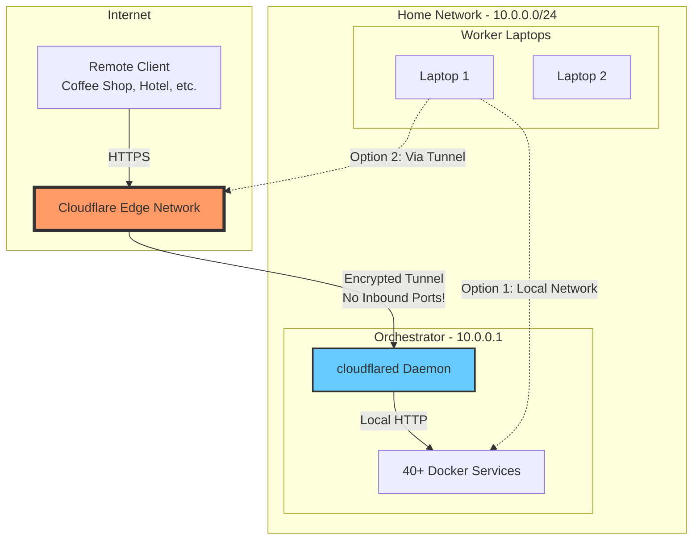

# Project Nyra - Distributed Development Setup Guide
## Orchestrator (24/7) + Worker Laptops (On-Demand)

**Last Updated**: 2026-01-15
**Setup Time**: ~4-6 hours total (one-time)

---

## 📋 Overview

This guide walks you through setting up a distributed development environment with:
- **Orchestrator PC** (Minisforum UH680) - Runs 24/7 with all Docker services + autonomous Claude Code
- **Worker Laptop 1** (RTX 5090) - Interactive development, connects to orchestrator on-demand
- **Worker Laptop 2** (Alienware M15R7 RTX 3060) - Interactive development, connects to orchestrator on-demand
- **Worker PC** (RTX 3090Ti) - GPU compute via wake-on-LAN

### Architecture Benefits

✅ **24/7 Autonomous Operation** - Orchestrator runs continuously without intervention
✅ **Low Power Consumption** - Only mini PC runs 24/7
✅ **Seamless Laptop Switching** - Identical workflow on either laptop
✅ **Centralized Services** - All 40+ Docker containers on orchestrator
✅ **Simple Connectivity** - SSH tunnel, no complex certificates
✅ **GPU On-Demand** - Wake RTX 3090Ti when compute needed

---

## 🛠️ Part 1: Orchestrator Setup (10.0.0.1)

### Prerequisites

- Windows with WSL2 capability
- 16GB RAM minimum (12GB for WSL2)
- 100GB+ free disk space
- Static IP: 10.0.0.1

### Step 1.1: Install WSL2

**Windows (PowerShell as Administrator)**:
```powershell
# Install WSL2 with Ubuntu
wsl --install -d Ubuntu-22.04
wsl --set-default-version 2

# Restart Windows after installation
Restart-Computer
```

After restart, create `C:\Users\<YourUser>\.wslconfig`:
```ini
[wsl2]
memory=12GB
processors=6
swap=4GB
localhostForwarding=true
```

**Restart WSL** to apply settings:
```powershell
wsl --shutdown
wsl
```

### Step 1.2: Configure WSL2 Ubuntu

**In WSL2 Ubuntu terminal**:
```bash
# Update system
sudo apt update && sudo apt upgrade -y

# Install required packages
sudo apt install -y \
  git curl wget build-essential \
  docker.io docker-compose-plugin \
  openssh-server openssh-client \
  net-tools vim nano

# Create nyra user for services
sudo useradd -m -s /bin/bash -G docker,sudo nyra
sudo passwd nyra  # Set a strong password

# Create directories
sudo mkdir -p /opt/nyra
sudo chown nyra:nyra /opt/nyra

# Add your regular user to docker group
sudo usermod -aG docker $USER

# Start Docker
sudo systemctl enable docker
sudo systemctl start docker

# Verify Docker
docker --version
docker ps
```

### Step 1.3: Clone Repository

**Switch to nyra user**:
```bash
sudo su - nyra
cd /opt/nyra
git clone https://github.com/<your-org>/Project-Nyra.git project-nyra
cd project-nyra
```

### Step 1.4: Configure Environment

```bash
# Copy environment template
cp infra/.env.example .env

# Edit environment file
nano .env
```

**Add these orchestrator-specific variables**:
```bash
# PC Identity
NYRA_PC_ID=orchestrator
NYRA_PC_IP=10.0.0.1
ORCHESTRATOR_URL=http://10.0.0.1:3000
DOCKER_HOST=unix:///var/run/docker.sock

# Claude Flow
CLAUDE_FLOW_MODE=orchestrator
CLAUDE_FLOW_CONFIG=/opt/nyra/project-nyra/config/claude-flow/orchestrator/claude-flow.config.json

# Set all CHANGE_ME values with strong passwords:
POSTGRES_PASSWORD=<strong-password>
REDIS_PASSWORD=<strong-password>
MONGO_ROOT_PASSWORD=<strong-password>
INFISICAL_ENCRYPTION_KEY=<32-char-hex-string>
INFISICAL_JWT_SECRET=<strong-password>
# ... (continue for all CHANGE_ME values)

# Add your API keys
ANTHROPIC_API_KEY=sk-ant-<your-key>
OPENAI_API_KEY=sk-<your-key>
```

**Generate secure passwords**:
```bash
# Random password
openssl rand -base64 32

# 32-char hex for Infisical
openssl rand -hex 32
```

### Step 1.5: Setup Auto-Start Docker Services

**The script is already created at `scripts/orchestrator/auto-start-docker.sh`**

Make it executable and add to crontab:
```bash
chmod +x scripts/orchestrator/auto-start-docker.sh

# Add to crontab
crontab -e
```

**Add this line to crontab**:
```bash
@reboot sleep 60 && /opt/nyra/project-nyra/scripts/orchestrator/auto-start-docker.sh
```

**Test the script manually**:
```bash
./scripts/orchestrator/auto-start-docker.sh
```

### Step 1.6: Configure SSH Server

```bash
# Generate SSH key
ssh-keygen -t ed25519 -C "nyra-orchestrator" -f ~/.ssh/id_ed25519 -N ""

# Configure SSH server
sudo nano /etc/ssh/sshd_config
```

**Update SSH config**:
```
Port 22
ListenAddress 10.0.0.1
PasswordAuthentication no
PubkeyAuthentication yes
AllowUsers nyra
PermitRootLogin no
```

```bash
# Start and enable SSH
sudo service ssh start
sudo systemctl enable ssh

# Check status
sudo service ssh status
```

### Step 1.7: Install Claude Code

```bash
# Install Node.js via nvm
curl -o- https://raw.githubusercontent.com/nvm-sh/nvm/v0.39.0/install.sh | bash
source ~/.bashrc
nvm install 20
nvm use 20
npm install -g pnpm

# Install Claude Code
npm install -g @anthropic-ai/claude-code

# Create config directory
mkdir -p ~/.claude-code
```

**Create `~/.claude-code/config.json`**:
```json
{
  "anthropicApiKey": "<your-anthropic-api-key>",
  "workspaceRoot": "/opt/nyra/project-nyra",
  "model": "claude-sonnet-4-5",
  "autoAcceptTasks": true,
  "enableMcp": true
}
```

**Create `~/.claude-code/.mcp.json`**:
```json
{
  "mcpServers": {
    "claude-flow": {
      "command": "npx",
      "args": ["-y", "@claude-flow/cli@latest", "mcp", "start"],
      "env": {
        "CLAUDE_FLOW_CONFIG": "/opt/nyra/project-nyra/config/claude-flow/orchestrator/claude-flow.config.json",
        "CLAUDE_FLOW_MODE": "orchestrator"
      }
    },
    "filesystem": {
      "command": "npx",
      "args": ["-y", "@modelcontextprotocol/server-filesystem", "/opt/nyra/project-nyra"]
    }
  }
}
```

### Step 1.8: Create systemd Service

**Create `/etc/systemd/system/claude-code-orchestrator.service`**:
```bash
sudo nano /etc/systemd/system/claude-code-orchestrator.service
```

**Service file content**:
```ini
[Unit]
Description=Claude Code Orchestrator - Autonomous Agent
After=network-online.target docker.service
Wants=network-online.target
Requires=docker.service

[Service]
Type=simple
User=nyra
Group=nyra
WorkingDirectory=/opt/nyra/project-nyra
EnvironmentFile=/opt/nyra/project-nyra/.env

# Wait for Docker containers
ExecStartPre=/bin/sleep 120

# Start Claude Code
ExecStart=/home/nyra/.nvm/versions/node/v20.18.1/bin/node \
  /home/nyra/.nvm/versions/node/v20.18.1/bin/claude-code \
  serve \
  --port 8080 \
  --workspace /opt/nyra/project-nyra \
  --log-level info

Restart=always
RestartSec=30s
StandardOutput=journal
StandardError=journal
SyslogIdentifier=claude-code

MemoryLimit=4G
CPUQuota=200%

[Install]
WantedBy=multi-user.target
```

**Note**: Update Node.js path to match your installation (`nvm which node`).

**Enable and start the service**:
```bash
sudo systemctl daemon-reload
sudo systemctl enable claude-code-orchestrator.service
sudo systemctl start claude-code-orchestrator.service

# Check status
sudo systemctl status claude-code-orchestrator.service

# View logs
sudo journalctl -u claude-code-orchestrator.service -f
```

### Step 1.9: Start Docker Services

```bash
cd /opt/nyra/project-nyra/infra

# Start all 40+ services
make up

# Or directly:
docker compose up -d

# Verify (should show 40+ containers)
docker ps

# Check health
make health

# View logs
make logs
```

### Step 1.10: Verify Orchestrator Setup

```bash
# 1. Check Docker containers
docker ps | wc -l  # Should be 40+

# 2. Check Claude Code service
sudo systemctl status claude-code-orchestrator

# 3. Check critical services
docker ps | grep -E "postgres|redis|claude-flow|nexus"

# 4. Test web UIs
curl http://localhost:3003  # Grafana
curl http://localhost:8080  # Infisical
curl http://localhost:9090  # Prometheus

# 5. Test SSH from Windows
# In Windows PowerShell:
ssh nyra@10.0.0.1
```

---

## 🖥️ Part 2: Worker Laptop Setup

### Prerequisites (Both Laptops)

- Windows with WSL2
- Adequate RAM (24GB+ recommended)
- Network access to orchestrator (10.0.0.1)

### Step 2.1: Install WSL2 (Repeat for Each Laptop)

**Windows (PowerShell as Administrator)**:
```powershell
wsl --install -d Ubuntu-22.04
Restart-Computer
```

**Create `.wslconfig`** (`C:\Users\<YourUser>\.wslconfig`):
```ini
[wsl2]
memory=24GB    # Adjust for laptop RAM
processors=12  # Adjust for CPU
swap=8GB
localhostForwarding=true
```

**Restart WSL**:
```powershell
wsl --shutdown
wsl
```

### Step 2.2: Configure WSL2 Ubuntu

```bash
sudo apt update && sudo apt upgrade -y
sudo apt install -y git curl wget openssh-client docker.io docker-compose-plugin

# Create directory
mkdir -p ~/nyra
cd ~/nyra
```

### Step 2.3: Clone Repository

```bash
cd ~/nyra
git clone https://github.com/<your-org>/Project-Nyra.git project-nyra
cd project-nyra
```

### Step 2.4: Configure Environment

**For RTX 5090 Laptop (worker-laptop-1)**:
```bash
cp infra/.env.example .env
nano .env
```

**Add worker-specific variables**:
```bash
NYRA_PC_ID=worker-laptop-1
NYRA_PC_IP=10.0.0.2
ORCHESTRATOR_URL=http://10.0.0.1:3000
DOCKER_HOST=tcp://localhost:2375
CLAUDE_FLOW_MODE=worker
CLAUDE_FLOW_CONFIG=/home/<your-user>/nyra/project-nyra/config/claude-flow/worker-laptop-1/claude-flow.config.json
GPU_ENABLED=true
GPU_TYPE=rtx_5090
GPU_MEMORY=24GB

# Copy API keys from orchestrator .env
ANTHROPIC_API_KEY=sk-ant-<your-key>
```

**For RTX 3060 Laptop (worker-laptop-2)**:
Same as above but use:
- `NYRA_PC_ID=worker-laptop-2`
- `NYRA_PC_IP=10.0.0.3`
- `CLAUDE_FLOW_CONFIG=.../worker-laptop-2/claude-flow.config.json`
- `GPU_TYPE=rtx_3060`
- `GPU_MEMORY=12GB`

### Step 2.5: Setup SSH Key

```bash
# Generate SSH key
ssh-keygen -t ed25519 -C "worker-laptop-1" -f ~/.ssh/id_ed25519 -N ""

# Display public key
cat ~/.ssh/id_ed25519.pub
```

**Copy the public key and add to orchestrator**:
```bash
# On orchestrator (10.0.0.1)
ssh nyra@10.0.0.1
echo "<paste-public-key-here>" >> ~/.ssh/authorized_keys
exit

# Test SSH connection
ssh nyra@10.0.0.1  # Should connect without password
```

### Step 2.6: Setup Docker Connection Script

**The script is already created at `scripts/worker-laptop/docker-connect.sh`**

Make it executable and add alias:
```bash
chmod +x scripts/worker-laptop/docker-connect.sh

# Add to .bashrc
cat >> ~/.bashrc << 'EOF'

# Nyra Orchestrator Docker Connection
alias docker-connect='~/nyra/project-nyra/scripts/worker-laptop/docker-connect.sh'
export DOCKER_HOST=tcp://localhost:2375
EOF

source ~/.bashrc
```

### Step 2.7: Install Claude Code

```bash
# Install Node.js
curl -o- https://raw.githubusercontent.com/nvm-sh/nvm/v0.39.0/install.sh | bash
source ~/.bashrc
nvm install 20
nvm use 20
npm install -g pnpm

# Install Claude Code
npm install -g @anthropic-ai/claude-code

mkdir -p ~/.claude-code
```

**Create `~/.claude-code/config.json`**:
```json
{
  "anthropicApiKey": "<your-api-key>",
  "workspaceRoot": "/home/<user>/nyra/project-nyra",
  "model": "claude-sonnet-4-5",
  "enableMcp": true
}
```

**Create `~/.claude-code/.mcp.json`**:
```json
{
  "mcpServers": {
    "claude-flow": {
      "command": "npx",
      "args": ["-y", "@claude-flow/cli@latest", "mcp", "start"],
      "env": {
        "CLAUDE_FLOW_CONFIG": "/home/<user>/nyra/project-nyra/config/claude-flow/worker-laptop-1/claude-flow.config.json",
        "CLAUDE_FLOW_MODE": "worker",
        "CLAUDE_FLOW_ORCHESTRATOR_URL": "http://10.0.0.1:3000"
      }
    },
    "filesystem": {
      "command": "npx",
      "args": ["-y", "@modelcontextprotocol/server-filesystem", "/home/<user>/nyra/project-nyra"]
    }
  }
}
```

**Note**: For worker-laptop-2, change the config path to `worker-laptop-2`.

### Step 2.8: Test Worker Setup

```bash
# 1. Test SSH
ssh nyra@10.0.0.1  # Should connect

# 2. Connect to orchestrator Docker
docker-connect

# 3. Verify Docker connection
docker ps  # Should show orchestrator's 40+ containers

# 4. Test Claude Code
claude-code --version

# 5. Test Claude Flow
npx @claude-flow/cli@latest swarm status
```

---

## 🌐 Part 3: Wake-on-LAN Setup (RTX 3090Ti Worker)

### Step 3.1: Enable WoL in BIOS

1. Boot into BIOS (usually Del or F2 key)
2. Navigate to Power Management or Advanced settings
3. Enable:
   - Wake-on-LAN
   - PCI-E Device Power-On
   - Network Boot (optional)
4. Save and exit

### Step 3.2: Configure Windows

**PowerShell as Administrator**:
```powershell
# List network adapters
Get-NetAdapter

# Enable WoL (replace "Ethernet" with your adapter name)
Set-NetAdapterPowerManagement -Name "Ethernet" `
  -WakeOnMagicPacket Enabled `
  -AllowDeviceToWakeComputer Enabled

# Verify settings
Get-NetAdapterPowerManagement -Name "Ethernet"

# Get MAC address
(Get-NetAdapter -Name "Ethernet").MacAddress
# Save this MAC address!
```

**Disable Fast Startup** (interferes with WoL):
```powershell
powercfg /h off
```

### Step 3.3: Configure Wake Script

**On orchestrator**, edit the wake script:
```bash
nano /opt/nyra/project-nyra/scripts/orchestrator/wake-gpu-worker.sh
```

**Update the MAC address**:
```bash
DEFAULT_MAC="<paste-your-mac-address-here>"
DEFAULT_IP="10.0.0.4"
```

**Make executable**:
```bash
chmod +x scripts/orchestrator/wake-gpu-worker.sh
```

### Step 3.4: Test Wake-on-LAN

```bash
# From orchestrator
ssh nyra@10.0.0.1
cd /opt/nyra/project-nyra
./scripts/orchestrator/wake-gpu-worker.sh

# Should show:
# ✅ Magic packet sent successfully
# ⏳ Waiting for GPU worker to boot...
# ✅ GPU worker is online! (boot time: ~45s)
```

---

## 🌐 Part 4: Cloudflare Tunnels (Optional - Remote Access)

**Setup Time**: ~30 minutes
**Cost**: $0 (Free plan)

Cloudflare Tunnels provide secure, external access to orchestrator services without exposing your home IP or opening firewall ports.

### Why Use Cloudflare Tunnels?

✅ **Remote Development** - Work from anywhere, not just home network
✅ **Zero Inbound Ports** - No firewall configuration needed
✅ **DDoS Protection** - Built-in Cloudflare protection
✅ **SSL/TLS Automatic** - Free HTTPS certificates
✅ **Access Control** - Email-based authentication
✅ **Service Isolation** - Expose only what you need

### Architecture with Cloudflare Tunnels



### Quick Setup Guide

**For detailed setup instructions, see**: [`bootstrap/docs/CLOUDFLARE-SETUP-ORCHESTRATOR.md`](../../bootstrap/docs/CLOUDFLARE-SETUP-ORCHESTRATOR.md)

#### Step 4.1: Prerequisites

- [ ] Cloudflare account (free) - [Sign up](https://dash.cloudflare.com/sign-up)
- [ ] Domain name (can use Cloudflare Registrar or transfer existing)
- [ ] Orchestrator running with Docker services

#### Step 4.2: Install cloudflared on Orchestrator

```bash
# SSH to orchestrator
ssh nyra@10.0.0.1

# Download and install
curl -L --output cloudflared.deb https://github.com/cloudflare/cloudflared/releases/latest/download/cloudflared-linux-amd64.deb
sudo dpkg -i cloudflared.deb

# Authenticate
cloudflared tunnel login

# Create tunnel
cloudflared tunnel create nyra-orchestrator
```

#### Step 4.3: Configure Services

```bash
# Create config
nano ~/.cloudflared/config.yml
```

**Example configuration**:
```yaml
tunnel: <YOUR-TUNNEL-ID>
credentials-file: /home/nyra/.cloudflared/<YOUR-TUNNEL-ID>.json

ingress:
  # Grafana - Monitoring
  - hostname: grafana.example.com
    service: http://localhost:3003

  # n8n - Workflow Automation
  - hostname: n8n.example.com
    service: http://localhost:5678

  # Infisical - Secrets Management
  - hostname: secrets.example.com
    service: http://localhost:8080

  # Quote API (if exposing publicly)
  - hostname: api.example.com
    service: http://localhost:8001

  # Catch-all (required)
  - service: http_status:404
```

#### Step 4.4: Setup DNS

```bash
# Create DNS records automatically
cloudflared tunnel route dns nyra-orchestrator grafana.example.com
cloudflared tunnel route dns nyra-orchestrator n8n.example.com
cloudflared tunnel route dns nyra-orchestrator secrets.example.com
```

#### Step 4.5: Configure Access Policies

**In Cloudflare Dashboard**:
```
Zero Trust → Access → Applications → Add Application

Name: Nyra Admin Services
Domain: example.com
Subdomains: grafana, n8n, secrets

Policies:
  - Allow: Email = your@email.com
  - Block: Countries = [high-risk countries]
```

#### Step 4.6: Auto-Start Tunnel

```bash
# Create systemd service
sudo nano /etc/systemd/system/cloudflared.service
```

**Service file**:
```ini
[Unit]
Description=Cloudflare Tunnel
After=network-online.target

[Service]
Type=simple
User=nyra
ExecStart=/usr/local/bin/cloudflared --config /home/nyra/.cloudflared/config.yml tunnel run
Restart=always

[Install]
WantedBy=multi-user.target
```

```bash
# Enable and start
sudo systemctl enable cloudflared
sudo systemctl start cloudflared

# Check status
sudo systemctl status cloudflared
```

### Step 4.7: Test Access

**From any device with internet**:
```bash
# Open browser
https://grafana.example.com

# Expected:
# 1. Cloudflare Access login page
# 2. Email OTP authentication
# 3. Redirect to Grafana
```

### Access Methods

| Method | Use Case | Setup Complexity |
|--------|----------|------------------|
| **Browser** | Access web UIs | ⭐ Easy (0 mins) |
| **WARP Client** | CLI tools, seamless access | ⭐⭐ Moderate (10 mins) |
| **Service Token** | CI/CD, automation | ⭐⭐ Moderate (5 mins) |

### Security Best Practices

1. **Enable Access Policies** - Don't expose services without authentication
2. **Use Email OTP** - Free, secure authentication
3. **Block High-Risk Countries** - Reduce attack surface
4. **Monitor Access Logs** - Review who accesses what
5. **Rotate Service Tokens** - Change tokens every 90 days
6. **Rate Limit Public APIs** - Prevent abuse

### Cost Breakdown

| Item | Cost | Notes |
|------|------|-------|
| Cloudflare Tunnel | $0/mo | Free tier: 50 tunnels, unlimited bandwidth |
| Cloudflare Access | $0/mo | Free tier: 50 users, email OTP |
| Domain (optional) | $8-15/yr | If using Cloudflare Registrar |
| **Total** | **$0-15/yr** | Domain only if you don't have one |

**Compare to alternatives**:
- VPN service: $60-180/year
- Static IP: $5-15/month ($60-180/year)
- DDoS protection: $200+/month

### Troubleshooting

**Tunnel won't start**:
```bash
# Check logs
sudo journalctl -u cloudflared -n 50

# Test manually
cloudflared tunnel run nyra-orchestrator
```

**DNS not resolving**:
```bash
# Check DNS records
dig grafana.example.com @1.1.1.1

# Verify tunnel routes
cloudflared tunnel route list
```

**Access denied**:
```
Dashboard → Zero Trust → Logs → Access
→ Check for blocked requests
→ Verify email is in policy allowlist
```

### Complete Documentation

For comprehensive guides, see:

1. **[Cloudflare Tunnels Overview](../../bootstrap/docs/CLOUDFLARE-TUNNELS.md)**
   - Architecture deep-dive
   - Security model
   - Cost analysis
   - Use cases

2. **[Orchestrator Setup Guide](../../bootstrap/docs/CLOUDFLARE-SETUP-ORCHESTRATOR.md)**
   - Step-by-step tunnel creation
   - Service configuration
   - Access policies
   - Monitoring setup

3. **[Worker Setup Guide](../../bootstrap/docs/CLOUDFLARE-SETUP-WORKERS.md)**
   - Browser access
   - WARP client setup
   - Service token configuration
   - CLI access

4. **[Troubleshooting Guide](../../bootstrap/docs/CLOUDFLARE-TROUBLESHOOTING.md)**
   - Common issues and solutions
   - Debug commands
   - Performance tuning
   - Error messages reference

### When to Skip Cloudflare Tunnels

Skip this step if:
- ✅ You only work from home network
- ✅ You don't need external access
- ✅ You already have a VPN solution you're happy with
- ✅ You prefer direct SSH tunneling

You can always add Cloudflare Tunnels later!

---

## 🚀 Daily Development Workflow

### Morning Routine (< 1 minute)

**On RTX 5090 Laptop** (or RTX 3060):
```bash
# 1. Open WSL
wsl

# 2. Connect to orchestrator
docker-connect

# 3. Start coding
cd ~/nyra/project-nyra
claude-code
```

**That's it!** All 40+ services running on orchestrator are now accessible.

### Switching Laptops

Close Claude Code on first laptop, then on second laptop:
```bash
wsl
docker-connect
cd ~/nyra/project-nyra
claude-code
```

**Completely seamless** - same environment, same services!

### Triggering GPU Compute

When you need the RTX 3090Ti for heavy compute:
```bash
# From orchestrator or worker laptop
ssh nyra@10.0.0.1 "./opt/nyra/project-nyra/scripts/orchestrator/wake-gpu-worker.sh"

# Wait ~45 seconds, then GPU worker is available
```

---

## 🧪 Verification Checklist

### Orchestrator

- [ ] Docker running: `docker ps | wc -l` (40+)
- [ ] Claude Code service: `sudo systemctl status claude-code-orchestrator`
- [ ] SSH accessible: `ssh nyra@10.0.0.1` from Windows
- [ ] Grafana: `curl http://localhost:3003`
- [ ] Prometheus: `curl http://localhost:9090`
- [ ] Auto-start: Reboot and verify containers start

### Worker Laptop

- [ ] SSH to orchestrator: `ssh nyra@10.0.0.1`
- [ ] Docker tunnel: `docker-connect && docker ps`
- [ ] Claude Code: `claude-code --version`
- [ ] Services accessible: `curl http://10.0.0.1:3003`

### Wake-on-LAN

- [ ] Magic packet sent: `./wake-gpu-worker.sh`
- [ ] Worker responds: `ping 10.0.0.4`

---

## 🚨 Troubleshooting

### Orchestrator Won't Auto-Start Docker

```bash
# Check crontab
crontab -l

# Check logs
cat /opt/nyra/logs/docker-autostart.log

# Test script manually
/opt/nyra/project-nyra/scripts/orchestrator/auto-start-docker.sh

# Check Docker service
sudo systemctl status docker
```

### Worker Can't Connect to Docker

```bash
# Verify SSH
ssh nyra@10.0.0.1

# Kill tunnels
pkill -f "ssh.*10.0.0.1"

# Reconnect
docker-connect

# On orchestrator, verify Docker socket permissions
ssh nyra@10.0.0.1 "sudo usermod -aG docker nyra"
```

### Claude Code Service Fails

```bash
# Check logs
sudo journalctl -u claude-code-orchestrator -n 100

# Check Node.js path
nvm which node

# Update service file with correct path
sudo nano /etc/systemd/system/claude-code-orchestrator.service

# Restart
sudo systemctl daemon-reload
sudo systemctl restart claude-code-orchestrator
```

### Wake-on-LAN Not Working

1. Verify BIOS settings
2. Check Windows adapter: `Get-NetAdapterPowerManagement`
3. Disable Fast Startup: `powercfg /h off`
4. Verify MAC address matches script
5. Test from orchestrator: `sudo apt install wakeonlan && wakeonlan <MAC>`

---

## 📚 Reference Links

- **Plan File**: `~/.claude/plans/delightful-soaring-lollipop.md`
- **Scripts**:
  - Orchestrator auto-start: `scripts/orchestrator/auto-start-docker.sh`
  - Worker Docker connect: `scripts/worker-laptop/docker-connect.sh`
  - Wake GPU worker: `scripts/orchestrator/wake-gpu-worker.sh`
- **Configs**:
  - Orchestrator: `config/claude-flow/orchestrator/claude-flow.config.json`
  - Worker Laptop 1: `config/claude-flow/worker-laptop-1/claude-flow.config.json`
  - Worker Laptop 2: `config/claude-flow/worker-laptop-2/claude-flow.config.json`
- **Infrastructure**: `infra/docker-compose.yml`, `infra/Makefile`

---

## 🎯 Next Steps After Setup

1. ✅ **Configure Cloudflare Tunnels** - External access to orchestrator services
   - See [Part 4: Cloudflare Tunnels](#-part-4-cloudflare-tunnels-optional---remote-access)
   - Comprehensive docs in [`bootstrap/docs/`](../../bootstrap/docs/)
2. **Set up Grafana Dashboards** - Monitor all 40+ services
3. **Implement Automated Backups** - Database backups via cron
4. **Claude Flow Auto-WoL** - Automatic GPU worker wake for compute tasks
5. **n8n Workflows** - Mortgage lead workflows

---

**Setup Complete!** You now have a production-ready, distributed development environment. 🎉
