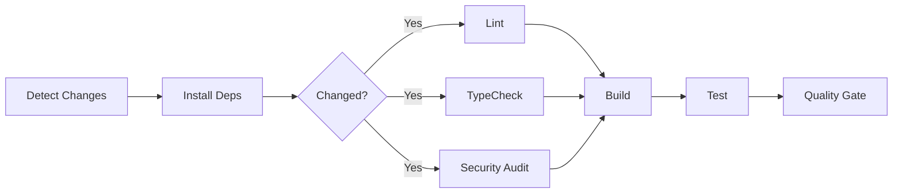
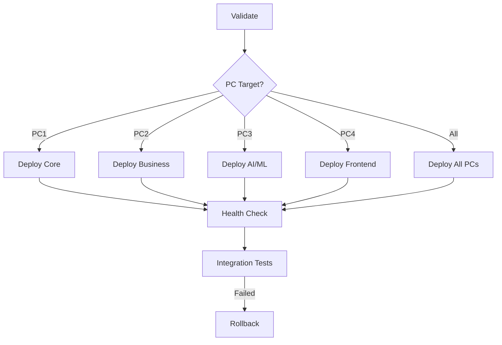

# GitHub Actions Workflow Guide

**Author**: CI/CD Pipeline Engineer
**Date**: 2026-01-16
**Status**: Active

## 📚 Table of Contents

1. [Overview](#overview)
2. [Workflow Files](#workflow-files)
3. [Main CI/CD Pipeline](#main-cicd-pipeline)
4. [Docker Build Matrix](#docker-build-matrix)
5. [MCP Server Testing](#mcp-server-testing)
6. [4PC Deployment](#4pc-deployment)
7. [Usage Examples](#usage-examples)
8. [Troubleshooting](#troubleshooting)

---

## Overview

Project Nyra uses a comprehensive CI/CD pipeline built on GitHub Actions with:

- **Monorepo-aware builds**: Only build and test changed packages using Turborepo
- **Path-based filtering**: Skip unnecessary jobs when unrelated files change
- **Docker build matrix**: Automatically build all Dockerized services
- **MCP server testing**: Dedicated testing for MCP servers
- **4PC deployment**: Environment-aware deployment to 4-computer distributed architecture

---

## Workflow Files

### Active Workflows

| Workflow | File | Trigger | Purpose |
|----------|------|---------|---------|
| **Main CI/CD** | `ci-main.yml` | Push, PR | Lint, test, build changed packages |
| **Enhanced CI/CD** | `ci-main-enhanced.yml` | Push, PR | Improved version with better filtering |
| **Docker Build** | `docker-build-matrix.yml` | Dockerfile changes | Build and push Docker images |
| **MCP Tests** | `mcp-server-tests.yml` | MCP changes, daily | Test MCP servers |
| **4PC Deploy** | `deploy-4pc.yml` | Manual | Deploy to PC1-PC4 architecture |

### Legacy Workflows

These workflows exist but may need updating for the consolidated structure:
- `docker-build.yml` - Replaced by `docker-build-matrix.yml`
- `nexus-router-ci.yml` - Should be integrated into main CI
- `python-lint.yml` - Should be integrated into main CI

---

## Main CI/CD Pipeline

### ci-main-enhanced.yml

**Key Features**:
- ✅ Turborepo-powered change detection
- ✅ Only build/test changed packages
- ✅ Smart caching (pnpm, turbo, node_modules)
- ✅ Parallel execution with matrix strategy
- ✅ Conditional jobs (skip if no changes)
- ✅ Quality gate validation

### Workflow Stages



### Change Detection

The workflow uses **Turborepo's powerful filtering** to detect changed packages:

```yaml
# For Pull Requests
pnpm turbo run build --filter="...[origin/${{ github.base_ref }}]"

# For Pushes
pnpm turbo run build --filter="...[HEAD^]"
```

**Turborepo Filter Syntax**:
- `...` - Include all dependencies (upstream)
- `[ref]` - Changes since ref
- `--filter` - Only run tasks for matching packages

### Conditional Job Execution

Jobs only run when relevant paths change:

```yaml
needs: detect-changes
if: |
  needs.detect-changes.outputs.apps == 'true' ||
  needs.detect-changes.outputs.services == 'true'
```

### Caching Strategy

**3-tier caching**:
1. **pnpm store** - Package downloads
2. **Turbo cache** - Build outputs
3. **node_modules** - Installed dependencies

Cache hit rate: ~95% for typical PRs

---

## Docker Build Matrix

### docker-build-matrix.yml

**Purpose**: Automatically build and push Docker images for all services with Dockerfiles.

### Features

- ✅ **Auto-discovery**: Scans for all Dockerfiles in `apps/` and `services/`
- ✅ **Matrix strategy**: Builds all images in parallel
- ✅ **Multi-platform**: Supports linux/amd64 and linux/arm64
- ✅ **Security scanning**: Trivy vulnerability scanner
- ✅ **Registry push**: Pushes to GitHub Container Registry (ghcr.io)
- ✅ **Smart tagging**: Branch, PR, semver, sha, latest

### Build Matrix Example

The workflow dynamically generates a matrix like:

```json
{
  "include": [
    {"name": "nyra-admin", "context": "apps/nyra-admin", "type": "app"},
    {"name": "ratehunter", "context": "apps/ratehunter", "type": "app"},
    {"name": "quote-api", "context": "services/quote-api", "type": "service"},
    {"name": "campaign-engine", "context": "services/campaign-engine", "type": "service"}
  ]
}
```

### Image Tags

Images are tagged with multiple tags:

```
ghcr.io/your-org/nyra-quote-api:main
ghcr.io/your-org/nyra-quote-api:pr-123
ghcr.io/your-org/nyra-quote-api:main-abc1234
ghcr.io/your-org/nyra-quote-api:latest
ghcr.io/your-org/nyra-quote-api:1.2.3
```

### Triggering Manually

Build a specific service:

```bash
gh workflow run docker-build-matrix.yml \
  -f service=quote-api
```

---

## MCP Server Testing

### mcp-server-tests.yml

**Purpose**: Test all MCP servers for protocol compliance and health.

### Features

- ✅ **Auto-discovery**: Finds all MCP servers in `mcp-servers/`
- ✅ **Health checks**: Validates servers can start
- ✅ **Protocol compliance**: Checks for MCP patterns
- ✅ **Integration tests**: Tests cross-server communication
- ✅ **Scheduled runs**: Daily health checks at 6 AM UTC

### MCP Server Discovery

The workflow scans for:
- `mcp-servers/*/package.json` - Top-level servers
- `mcp-servers/*/*/package.json` - Nested servers

Excludes:
- `node_modules`
- `general`
- `configs`
- `scripts`

### Health Check Process

1. Install dependencies
2. Run linting (if available)
3. Run tests (if available)
4. Build server
5. Start server and verify it runs for 5s
6. Check for MCP protocol patterns

### Example Output

```
✅ archon-os - Started successfully
✅ ruv-swarm - Started successfully
⚠️ custom-mcp - No start script found
```

---

## 4PC Deployment

### deploy-4pc.yml

**Purpose**: Deploy services to the 4-PC distributed architecture.

### PC Architecture

| PC | Role | Services |
|----|------|----------|
| **PC1** | Core | nexus-router, auth-service, nyra-orchestrator |
| **PC2** | Business Logic | quote-api, campaign-engine, lead-capture-api |
| **PC3** | AI/ML | litellm-proxy, mem0-mcp, letta-knowledge |
| **PC4** | Frontend | ratehunter, nyra-admin, nexus-dashboard |

### Deployment Flow



### Manual Deployment

Deploy to staging on PC2:

```bash
gh workflow run deploy-4pc.yml \
  -f environment=staging \
  -f pc_target=pc2 \
  -f service=quote-api
```

Deploy all services to production:

```bash
gh workflow run deploy-4pc.yml \
  -f environment=production \
  -f pc_target=all
```

### Rollback

If deployment fails, the workflow automatically triggers rollback:

```yaml
needs: post-deploy
if: failure()
```

---

## Usage Examples

### Typical Development Flow

1. **Create feature branch**:
   ```bash
   git checkout -b feature/new-endpoint
   ```

2. **Make changes in service**:
   ```bash
   # Edit services/quote-api/app/api/endpoints.py
   git add services/quote-api/
   git commit -m "feat: Add new quote endpoint"
   ```

3. **Push to GitHub**:
   ```bash
   git push origin feature/new-endpoint
   ```

4. **CI automatically runs**:
   - Detects `services/quote-api` changed
   - Runs lint, typecheck, build for quote-api only
   - Runs tests for quote-api only
   - If Dockerfile changed, rebuilds Docker image
   - Quality gate validates all checks passed

5. **Create PR**:
   ```bash
   gh pr create --title "feat: Add new quote endpoint"
   ```

6. **PR checks run**:
   - Same as above, but compares against `main` branch
   - All changed packages tested

7. **Merge PR**:
   - CI runs again on `main` branch
   - Docker image pushed to registry with `latest` tag
   - Ready for deployment

### Deploying to Production

1. **Review staging deployment**:
   ```bash
   gh workflow run deploy-4pc.yml \
     -f environment=staging \
     -f pc_target=all
   ```

2. **Check health**:
   - Review GitHub Actions logs
   - Check service health endpoints

3. **Deploy to production**:
   ```bash
   gh workflow run deploy-4pc.yml \
     -f environment=production \
     -f pc_target=all
   ```

### Testing MCP Servers Locally

Before pushing:

```bash
# Test MCP server
cd mcp-servers/archon-os
pnpm test
pnpm build
pnpm start

# Check protocol compliance
grep -r "createServer\|McpServer" src/
```

### Building Docker Images Locally

Test Docker builds before pushing:

```bash
# Build locally
docker build -t nyra-quote-api:test services/quote-api/

# Run locally
docker run -p 8080:8080 nyra-quote-api:test

# Test vulnerability scanning
trivy image nyra-quote-api:test
```

---

## Troubleshooting

### Common Issues

#### 1. "No changed packages detected"

**Problem**: Workflow skips builds even though you changed code.

**Solution**:
```bash
# Check git history
git log --oneline --graph --all

# Verify Turborepo detects changes
pnpm turbo run build --dry=json --filter="...[HEAD^]"
```

#### 2. "Docker build fails with permission denied"

**Problem**: Docker build can't access context files.

**Solution**:
- Check Dockerfile `COPY` paths are correct
- Ensure `.dockerignore` isn't excluding necessary files
- Verify build context in workflow is correct

#### 3. "MCP server health check fails"

**Problem**: Server starts but health check fails.

**Solution**:
```yaml
# Add longer timeout
timeout 30s pnpm start &
sleep 10  # Wait longer before checking
```

#### 4. "Quality gate fails on security audit"

**Problem**: Security vulnerabilities in dependencies.

**Solution**:
```bash
# Update dependencies
pnpm audit fix

# Or override audit level
pnpm audit --audit-level=high
```

#### 5. "Turbo filter returns no packages"

**Problem**: Filter syntax issue or no changes.

**Solution**:
```bash
# Test filter locally
pnpm turbo run build --filter="...[origin/main]" --dry=json

# Check affected packages
git diff --name-only origin/main...HEAD
```

### Getting Help

1. **Check workflow logs**: Look for detailed error messages
2. **Review path filters**: Ensure changed paths match filters
3. **Test locally**: Run commands from workflow locally
4. **Check caching**: Clear caches if stale

### Useful Commands

```bash
# List all workflows
gh workflow list

# View workflow runs
gh run list --workflow=ci-main.yml

# Watch workflow run
gh run watch

# View logs
gh run view --log

# Re-run failed jobs
gh run rerun --failed

# Cancel running workflow
gh run cancel <run-id>
```

---

## Maintenance

### Regular Tasks

- **Weekly**: Review workflow run times, optimize slow jobs
- **Monthly**: Update action versions, review cache hit rates
- **Quarterly**: Audit security scans, update deployment strategy

### Metrics to Monitor

- **CI time**: Target < 10 minutes for typical PR
- **Cache hit rate**: Target > 90%
- **Quality gate pass rate**: Target > 95%
- **Deployment success rate**: Target > 98%

---

## Future Enhancements

Planned improvements:

1. **E2E Testing**: Add Playwright/Cypress E2E tests
2. **Performance Testing**: Add Lighthouse CI for frontend apps
3. **Preview Deployments**: Deploy PR preview environments
4. **Auto-merge**: Auto-merge dependabot PRs after tests pass
5. **Deployment Dashboard**: Custom dashboard for deployment status

---

## Related Documentation

- [Turborepo Documentation](https://turbo.build/repo/docs)
- [GitHub Actions Documentation](https://docs.github.com/en/actions)
- [Docker Build Push Action](https://github.com/docker/build-push-action)
- [Project Nyra Architecture](../architecture/system-architecture.md)
- [4PC Architecture](../architecture/4PC-DISTRIBUTED-ARCHITECTURE.md)
