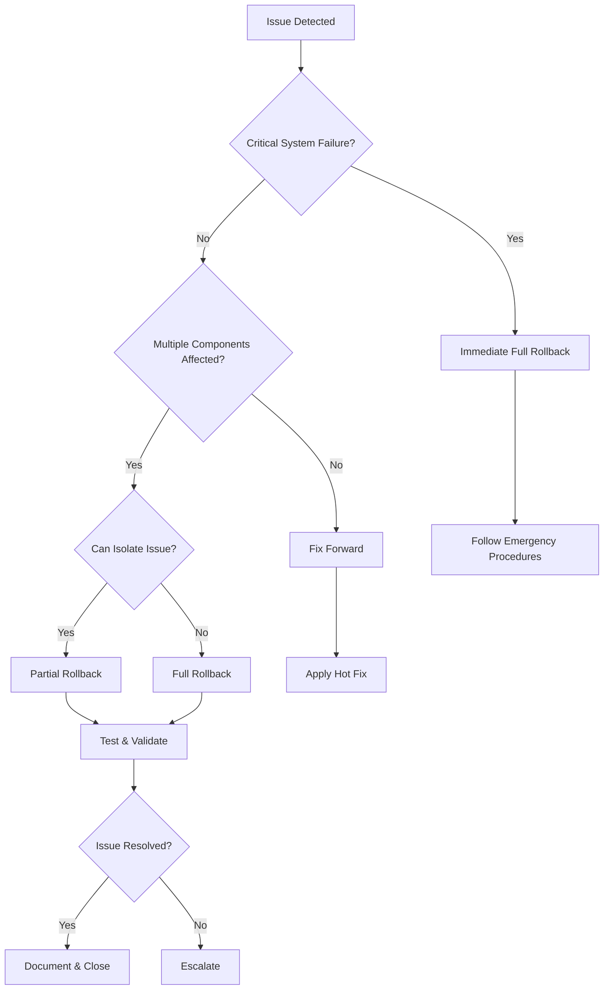

# Consolidation Rollback Procedures

**Version**: 1.0.0
**Last Updated**: 2026-01-18
**Status**: PRODUCTION READY

## Table of Contents

- [Overview](#overview)
- [When to Rollback](#when-to-rollback)
- [Prerequisites](#prerequisites)
- [Complete Rollback](#complete-rollback)
- [Partial Rollback](#partial-rollback)
- [Rollback Validation](#rollback-validation)
- [Recovery from Failed Rollback](#recovery-from-failed-rollback)
- [Common Issues](#common-issues)
- [Safety Checklist](#safety-checklist)

---

## Overview

This document provides comprehensive procedures for rolling back the Project Nyra repository consolidation. The consolidation moved and reorganized numerous files, and these procedures enable safe restoration to the pre-consolidation state.

### Key Facts

- **Pre-Consolidation Tag**: `cleanup-pre-consolidation-20260114`
- **Consolidation Merge**: `8f34e612` (Merge consolidation/nyra-monorepo-20251214 into main)
- **Files Affected**: 50+ renamed/moved files
- **Rollback Scripts**:
  - Bash: `infra/scripts/rollback-consolidation.sh`
  - PowerShell: `infra/scripts/rollback-consolidation.ps1`

### Rollback Capabilities

- ✅ Full repository rollback
- ✅ Partial file-specific rollback
- ✅ Dry-run mode for safety
- ✅ Automatic backup creation
- ✅ Comprehensive validation
- ✅ Detailed logging

---

## When to Rollback

### Decision Flowchart



### Rollback Scenarios

| Scenario | Recommendation | Type | Priority |
|----------|----------------|------|----------|
| Critical production failure | **Rollback immediately** | Full | P0 |
| Build/CI pipeline broken | **Rollback affected files** | Partial | P1 |
| Multiple services failing | **Full rollback** | Full | P0 |
| Documentation issues | Fix forward | N/A | P3 |
| Single service issue | **Partial rollback or fix** | Partial | P2 |
| Performance degradation | Investigate first, then decide | TBD | P1 |
| Security vulnerability discovered | **Immediate rollback + patch** | Full | P0 |

### Do NOT Rollback If:

- Issue is minor and easily fixable (e.g., typo in documentation)
- Only affects development environment
- Hot fix is faster than rollback
- Issue is unrelated to consolidation changes
- Changes have been in production for >7 days without issues

---

## Prerequisites

### Before Starting Rollback

#### 1. Verify System State

```bash
# Check Git status
git status

# Verify you're on main branch
git branch --show-current

# Check for uncommitted changes
git diff --quiet && echo "Clean" || echo "Uncommitted changes exist"

# Verify rollback tag exists
git tag -l | grep "cleanup-pre-consolidation"
```

#### 2. Create Emergency Backup

```bash
# Create manual backup (in addition to script's automatic backup)
git stash push -u -m "Emergency backup before rollback $(date +%Y%m%d)"

# Tag current state
git tag -a "before-rollback-$(date +%Y%m%d)" -m "State before consolidation rollback"
```

#### 3. Check System Resources

```bash
# Check disk space (bash)
df -h .

# Check disk space (PowerShell)
Get-PSDrive C | Select-Object Used,Free
```

#### 4. Notify Stakeholders

- [ ] Notify development team
- [ ] Alert DevOps/SRE team
- [ ] Update status page (if production)
- [ ] Create incident ticket

### Required Tools

- Git (2.x or higher)
- Bash (Linux/macOS/WSL) or PowerShell 5.1+ (Windows)
- Text editor
- ~500MB free disk space for backups

---

## Complete Rollback

A complete rollback restores ALL files to their pre-consolidation state.

### Step 1: Dry Run (MANDATORY)

Always perform a dry run first to see what will be changed:

**Bash:**
```bash
cd C:/Dev/Projects/Repos/Project-Nyra
./infra/scripts/rollback-consolidation.sh --full --dry-run
```

**PowerShell:**
```powershell
cd C:\Dev\Projects\Repos\Project-Nyra
.\infra\scripts\rollback-consolidation.ps1 -Mode Full -DryRun
```

#### Review Dry Run Output

Check for:
- Number of files to be changed
- List of renamed/moved files
- Any warnings or errors
- Estimated rollback scope

### Step 2: Execute Full Rollback

If dry run looks correct, execute the actual rollback:

**Bash:**
```bash
./infra/scripts/rollback-consolidation.sh --full
```

**PowerShell:**
```powershell
.\infra\scripts\rollback-consolidation.ps1 -Mode Full
```

#### Script Actions

The script will:
1. ✅ Verify Git repository state
2. ✅ Check rollback tag exists
3. ✅ Ensure working directory is clean
4. ✅ Create safety backup
5. ✅ Analyze files for rollback
6. ✅ Request confirmation
7. ✅ Execute rollback via `git checkout`
8. ✅ Validate results
9. ✅ Generate detailed log

### Step 3: Review Changes

```bash
# See what changed
git status

# Review diff
git diff

# Check specific directories
git status -- docs/
git status -- infra/
```

### Step 4: Test Critical Functionality

```bash
# Test build
npm run build

# Run tests
npm test

# Verify Docker configs
docker-compose config

# Check critical files
cat CLAUDE.md
cat README.md
```

### Step 5: Commit Rollback

If everything looks good:

```bash
# Stage all changes
git add -A

# Commit with descriptive message
git commit -m "Rollback consolidation to pre-consolidation state

- Restored files from tag: cleanup-pre-consolidation-20260114
- Rollback timestamp: $(date +%Y-%m-%d_%H:%M:%S)
- Reason: [DESCRIBE REASON]
- Files changed: [NUMBER]

See rollback log: infra/logs/rollback-*.log"

# Tag the rollback
git tag -a "rollback-$(date +%Y%m%d)" -m "Consolidation rollback"
```

---

## Partial Rollback

Partial rollback restores specific files without affecting the entire repository.

### When to Use Partial Rollback

- Only specific files/directories are problematic
- Want to preserve some consolidation benefits
- Need surgical fix for specific issue
- Full rollback is too disruptive

### Step 1: Identify Problem Files

```bash
# Find files that changed during consolidation
git diff --name-status cleanup-pre-consolidation-20260114 HEAD

# Filter by directory
git diff --name-status cleanup-pre-consolidation-20260114 HEAD -- docs/
```

### Step 2: Dry Run Partial Rollback

**Bash:**
```bash
./infra/scripts/rollback-consolidation.sh --partial \
  --files "docs/test-feature.md,MCP-ASSISTANT-RULES.md,THE-TRUTH.md" \
  --dry-run
```

**PowerShell:**
```powershell
.\infra\scripts\rollback-consolidation.ps1 -Mode Partial `
  -Files "docs/test-feature.md,MCP-ASSISTANT-RULES.md,THE-TRUTH.md" `
  -DryRun
```

### Step 3: Execute Partial Rollback

**Bash:**
```bash
./infra/scripts/rollback-consolidation.sh --partial \
  --files "docs/test-feature.md,MCP-ASSISTANT-RULES.md"
```

**PowerShell:**
```powershell
.\infra\scripts\rollback-consolidation.ps1 -Mode Partial `
  -Files "docs/test-feature.md,MCP-ASSISTANT-RULES.md"
```

### Step 4: Validate and Commit

```bash
# Verify changes
git status
git diff

# Test affected functionality
npm test

# Commit
git add -A
git commit -m "Partial rollback: restore [FILE LIST]"
```

### Example: Rollback Documentation Structure

```bash
# Rollback all documentation reorganization
./infra/scripts/rollback-consolidation.sh --partial \
  --files "$(git diff --name-only cleanup-pre-consolidation-20260114 HEAD -- docs/ | tr '\n' ',')"
```

---

## Rollback Validation

### Automated Validation

The rollback scripts include built-in validation:

1. **Git Status Check** - Verifies working directory state
2. **Critical Files** - Ensures CLAUDE.md, README.md exist
3. **Broken Symlinks** - Detects broken symbolic links
4. **Change Count** - Reports number of changes made

### Manual Validation Checklist

After rollback, verify:

#### Repository Structure
- [ ] Root files exist (CLAUDE.md, README.md, package.json)
- [ ] Directory structure is correct
- [ ] No broken symlinks
- [ ] Git status shows expected changes

#### Build & Test
- [ ] `npm install` succeeds
- [ ] `npm run build` succeeds
- [ ] `npm test` passes
- [ ] `docker-compose config` validates

#### Documentation
- [ ] README.md is accessible and correct
- [ ] CLAUDE.md is correct
- [ ] Documentation links work
- [ ] API documentation is intact

#### Services & Infrastructure
- [ ] Docker Compose files validate
- [ ] Service configurations are correct
- [ ] Environment variables are set
- [ ] Database connections work

#### Development Environment
- [ ] VS Code configuration works
- [ ] Git hooks function
- [ ] Pre-commit checks pass
- [ ] CI/CD pipeline validates

### Validation Commands

```bash
# Comprehensive validation
npm run validate                    # If available
docker-compose config              # Validate Docker configs
npm test                          # Run test suite
npm run lint                      # Check code quality

# Manual checks
git log -1                        # Verify commit
git diff cleanup-pre-consolidation-20260114  # Compare with target state
find . -type l ! -exec test -e {} \; -print  # Find broken symlinks
```

---

## Recovery from Failed Rollback

If rollback fails or produces unexpected results:

### Option 1: Restore from Automatic Backup

The rollback script creates automatic backups:

```bash
# Find latest backup
LATEST_BACKUP=$(ls -td _backup/rollback-* | head -1)
echo "Latest backup: $LATEST_BACKUP"

# Review backup manifest
cat "$LATEST_BACKUP/manifest.txt"

# Restore from backup
cp -r "$LATEST_BACKUP/docs" ./docs/

# Or restore specific files
cp "$LATEST_BACKUP/docs/README.md" ./docs/
```

### Option 2: Git Reset

If you haven't committed the rollback yet:

```bash
# Reset to HEAD (discard all changes)
git reset --hard HEAD

# Or reset to before rollback
git reset --hard before-rollback-$(date +%Y%m%d)
```

### Option 3: Manual Restoration

If automated methods fail:

```bash
# Checkout specific files from tag
git checkout cleanup-pre-consolidation-20260114 -- path/to/file

# Or restore from stash
git stash list
git stash apply stash@{0}

# Or use archive
tar -xzf _archive/pre-rollback-backup.tar.gz
```

### Option 4: Start Over

Complete reset to known good state:

```bash
# 1. Abandon current changes
git reset --hard HEAD

# 2. Pull from remote
git fetch origin
git reset --hard origin/main

# 3. Start rollback process again
./infra/scripts/rollback-consolidation.sh --full --dry-run
```

### Emergency Contact

If all recovery options fail:

1. **Stop making changes**
2. **Document current state**
3. **Create issue** with logs and error messages
4. **Contact DevOps team**
5. **Review logs**: `infra/logs/rollback-*.log`

---

## Common Issues

### Issue: "Working directory is not clean"

**Symptom**: Script refuses to run due to uncommitted changes

**Solution**:
```bash
# Option 1: Commit changes
git add -A
git commit -m "WIP: Changes before rollback"

# Option 2: Stash changes
git stash push -u -m "Stash before rollback"

# Option 3: Force rollback (with backup)
./infra/scripts/rollback-consolidation.sh --full --force
```

### Issue: "Rollback tag not found"

**Symptom**: `cleanup-pre-consolidation-20260114` tag doesn't exist

**Solution**:
```bash
# List available tags
git tag -l | grep pre-consolidation

# Find pre-consolidation commit manually
git log --oneline --all | grep -i "pre-consolidation\|snapshot"

# Update script with correct tag
# Edit: ROLLBACK_TAG variable in script
```

### Issue: "Permission denied" on Windows

**Symptom**: PowerShell script won't execute

**Solution**:
```powershell
# Check execution policy
Get-ExecutionPolicy

# Allow script execution (as Administrator)
Set-ExecutionPolicy -ExecutionPolicy RemoteSigned -Scope CurrentUser

# Or bypass for single execution
PowerShell.exe -ExecutionPolicy Bypass -File .\rollback-consolidation.ps1 -Mode Full -DryRun
```

### Issue: "Merge conflicts after rollback"

**Symptom**: Files have conflict markers after rollback

**Solution**:
```bash
# See conflicted files
git status | grep "both modified"

# Resolve conflicts
# Option 1: Keep rollback version (ours)
git checkout --ours path/to/file

# Option 2: Keep current version (theirs)
git checkout --theirs path/to/file

# Option 3: Manual merge
# Edit file, resolve conflicts, then:
git add path/to/file
```

### Issue: "Node modules or dependencies broken"

**Symptom**: Build fails after rollback

**Solution**:
```bash
# Clean and reinstall
rm -rf node_modules package-lock.json
npm install

# Or use pnpm
rm -rf node_modules pnpm-lock.yaml
pnpm install

# Rebuild
npm run build
```

### Issue: "Docker containers won't start"

**Symptom**: `docker-compose up` fails after rollback

**Solution**:
```bash
# Validate configs
docker-compose config

# Stop and remove all containers
docker-compose down -v

# Rebuild images
docker-compose build --no-cache

# Start fresh
docker-compose up -d
```

---

## Safety Checklist

### Pre-Rollback Checklist

- [ ] **Reviewed decision criteria** - Rollback is the right choice
- [ ] **Notified team** - Stakeholders are aware
- [ ] **Created manual backup** - Emergency restore point exists
- [ ] **Verified tag exists** - `cleanup-pre-consolidation-20260114` is present
- [ ] **Checked disk space** - At least 500MB available
- [ ] **Working directory clean** - No uncommitted changes (or stashed)
- [ ] **Performed dry run** - Reviewed what will change
- [ ] **Scheduled downtime** - If production system
- [ ] **Prepared rollback plan** - This document reviewed

### During Rollback Checklist

- [ ] **Script executed successfully** - No errors in output
- [ ] **Backup created** - `_backup/rollback-*` directory exists
- [ ] **Log file generated** - `infra/logs/rollback-*.log` exists
- [ ] **Changes reviewed** - `git status` and `git diff` checked
- [ ] **No broken symlinks** - Validation passed

### Post-Rollback Checklist

- [ ] **Build passes** - `npm run build` succeeds
- [ ] **Tests pass** - `npm test` succeeds
- [ ] **Docker validates** - `docker-compose config` passes
- [ ] **Critical files exist** - CLAUDE.md, README.md present
- [ ] **Changes committed** - Rollback committed to Git
- [ ] **Tagged** - Created rollback tag
- [ ] **Documented** - Incident documented
- [ ] **Team notified** - Stakeholders informed of completion
- [ ] **Monitoring** - Systems monitored for issues

---

## Reference Information

### Rollback Tag Information

```bash
# View tag details
git show cleanup-pre-consolidation-20260114

# Compare current state to tag
git diff cleanup-pre-consolidation-20260114 HEAD

# List files different from tag
git diff --name-status cleanup-pre-consolidation-20260114 HEAD
```

### Log File Locations

- **Rollback logs**: `infra/logs/rollback-*.log`
- **Backup location**: `_backup/rollback-*/`
- **Archive location**: `_archive/` (if exists)

### Script Locations

- **Bash script**: `infra/scripts/rollback-consolidation.sh`
- **PowerShell script**: `infra/scripts/rollback-consolidation.ps1`
- **Test script**: `infra/scripts/test-rollback.sh`
- **Validation script**: `infra/scripts/validate-consolidation.sh`

### Related Documentation

- [Infrastructure Status](../infra/INFRASTRUCTURE_STATUS.md)
- [Disaster Recovery Guide](./DISASTER-RECOVERY-GUIDE.md)
- [Consolidation Reports](../reports/)
- [Setup Guide](../guides/SETUP-GUIDE.md)

---

## Support & Escalation

### Getting Help

1. **Review logs**: Check `infra/logs/rollback-*.log` for detailed errors
2. **Check this guide**: Search Common Issues section
3. **Review Git history**: `git log --oneline -20`
4. **Check backups**: `ls -lh _backup/`

### Escalation Path

1. **Level 1**: Development team lead
2. **Level 2**: DevOps/SRE team
3. **Level 3**: Infrastructure architect
4. **Emergency**: CTO/Engineering Director

### Creating Support Ticket

Include:
- **Rollback mode**: Full or Partial
- **Timestamp**: When rollback was attempted
- **Error message**: Full error output
- **Log file**: Attach `infra/logs/rollback-*.log`
- **Git state**: Output of `git status`, `git log -5`
- **System info**: OS, Git version, disk space

---

## Appendix: Script Options

### Bash Script Options

```bash
./infra/scripts/rollback-consolidation.sh [OPTIONS]

OPTIONS:
  --full              Full rollback
  --partial           Partial rollback
  --files FILE...     Specific files (comma-separated)
  --dry-run           Dry run mode
  --skip-backup       Skip backup (NOT RECOMMENDED)
  --force             Skip confirmations
  --help              Show help
```

### PowerShell Script Parameters

```powershell
.\infra\scripts\rollback-consolidation.ps1
  -Mode {Full|Partial}
  [-Files <String>]
  [-DryRun]
  [-SkipBackup]
  [-Force]
  [-WhatIf]
  [-Verbose]
```

---

**Document Version**: 1.0.0
**Last Updated**: 2026-01-18
**Next Review**: 2026-02-18
**Owner**: Infrastructure Team
