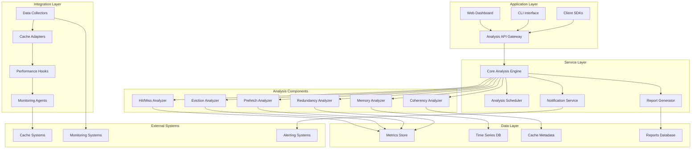

# 05 Caching Performance Analysis System Architecture

## Overview
Comprehensive architecture design for a modular, extensible caching performance analysis system that integrates seamlessly with existing cache implementations while providing real-time monitoring, analysis, and optimization capabilities.

## Architecture Principles

### Core Design Principles
1. **Modularity**: Loosely coupled components with clear interfaces
2. **Extensibility**: Plugin-based architecture for new analyzers
3. **Non-Intrusive**: Zero-impact integration with existing cache systems
4. **Scalability**: Horizontal scaling for large cache deployments
5. **Real-time**: Continuous monitoring with configurable intervals
6. **Fault Tolerance**: Graceful degradation and recovery mechanisms

### Quality Attributes
- **Performance**: <1% overhead on cache operations
- **Reliability**: 99.9% availability for monitoring components
- **Maintainability**: Clear separation of concerns, dependency injection
- **Testability**: Comprehensive test coverage with mocks and stubs
- **Security**: Secure handling of cache metrics and sensitive data

## High-Level System Architecture



## Component Architecture Details

### Core Analysis Engine Architecture

```typescript
interface IAnalysisEngine {
  // Analysis orchestration
  performAnalysis(config: AnalysisConfiguration): Promise<AnalysisResult>
  scheduleAnalysis(schedule: AnalysisSchedule): void
  cancelAnalysis(analysisId: string): void

  // Component management
  registerAnalyzer(analyzer: IAnalyzer): void
  unregisterAnalyzer(analyzerId: string): void
  listAnalyzers(): IAnalyzer[]

  // Configuration and state
  updateConfiguration(config: Partial<AnalysisConfiguration>): void
  getStatus(): AnalysisEngineStatus
  getMetrics(): EngineMetrics
}

interface IAnalyzer {
  id: string
  name: string
  version: string

  // Core analysis functionality
  analyze(context: AnalysisContext): Promise<AnalysisResult>
  canAnalyze(cacheSystem: ICacheSystem): boolean

  // Lifecycle management
  initialize(config: AnalyzerConfiguration): Promise<void>
  destroy(): Promise<void>

  // Health and metrics
  healthCheck(): Promise<HealthStatus>
  getMetrics(): AnalyzerMetrics
}
```

### Data Collection Architecture

```typescript
interface IDataCollector {
  // Data collection
  collect(source: IDataSource): Promise<MetricData>
  startContinuousCollection(interval: number): void
  stopContinuousCollection(): void

  // Filtering and preprocessing
  addFilter(filter: IMetricFilter): void
  addTransformer(transformer: IMetricTransformer): void

  // Event handling
  on(event: CollectorEvent, handler: EventHandler): void
  emit(event: CollectorEvent, data: any): void
}

interface ICacheAdapter {
  // Cache system integration
  connect(cacheSystem: ICacheSystem): Promise<void>
  disconnect(): Promise<void>
  isConnected(): boolean

  // Metrics extraction
  getHitMissMetrics(): Promise<HitMissMetrics>
  getEvictionMetrics(): Promise<EvictionMetrics>
  getMemoryMetrics(): Promise<MemoryMetrics>

  // Hook installation
  installPerformanceHooks(): Promise<void>
  uninstallPerformanceHooks(): Promise<void>
}
```

## Layered Architecture Design

### Layer 1: Integration Layer
**Purpose**: Non-intrusive integration with existing cache systems

```typescript
class CacheIntegrationLayer {
  private adapters: Map<string, ICacheAdapter> = new Map()
  private collectors: Map<string, IDataCollector> = new Map()
  private hooks: Map<string, IPerformanceHook> = new Map()

  // Adapter management
  async registerCacheSystem(
    systemId: string,
    adapter: ICacheAdapter,
    config: IntegrationConfig
  ): Promise<void> {
    await adapter.connect(config.cacheSystem)
    await adapter.installPerformanceHooks()
    this.adapters.set(systemId, adapter)

    // Start data collection
    const collector = this.createCollector(adapter, config)
    await collector.startContinuousCollection(config.collectionInterval)
    this.collectors.set(systemId, collector)
  }

  // Non-intrusive hook system
  private createPerformanceHooks(adapter: ICacheAdapter): IPerformanceHook[] {
    return [
      new CacheOperationHook(adapter),
      new MemoryUsageHook(adapter),
      new EvictionEventHook(adapter),
      new CoherencyEventHook(adapter)
    ]
  }
}
```

### Layer 2: Analysis Layer
**Purpose**: Modular analysis components with plugin architecture

```typescript
abstract class BaseAnalyzer implements IAnalyzer {
  protected config: AnalyzerConfiguration
  protected metricsStore: IMetricsStore
  protected logger: ILogger

  constructor(
    config: AnalyzerConfiguration,
    metricsStore: IMetricsStore,
    logger: ILogger
  ) {
    this.config = config
    this.metricsStore = metricsStore
    this.logger = logger
  }

  abstract analyze(context: AnalysisContext): Promise<AnalysisResult>

  // Common functionality
  protected async collectMetrics(
    timeRange: TimeRange,
    filters?: MetricFilter[]
  ): Promise<MetricData[]> {
    return this.metricsStore.query(timeRange, filters)
  }

  protected calculateStatistics(data: number[]): Statistics {
    return {
      mean: this.calculateMean(data),
      median: this.calculateMedian(data),
      standardDeviation: this.calculateStdDev(data),
      percentiles: this.calculatePercentiles(data, [50, 90, 95, 99])
    }
  }
}

// Plugin architecture for extensibility
class AnalyzerPluginManager {
  private plugins: Map<string, IAnalyzerPlugin> = new Map()

  registerPlugin(plugin: IAnalyzerPlugin): void {
    this.plugins.set(plugin.id, plugin)
  }

  createAnalyzer(pluginId: string, config: AnalyzerConfiguration): IAnalyzer {
    const plugin = this.plugins.get(pluginId)
    if (!plugin) {
      throw new Error(`Plugin not found: ${pluginId}`)
    }
    return plugin.createAnalyzer(config)
  }
}
```

### Layer 3: Service Layer
**Purpose**: Orchestration, scheduling, and reporting services

```typescript
class AnalysisOrchestrationService {
  private engine: IAnalysisEngine
  private scheduler: IAnalysisScheduler
  private reportGenerator: IReportGenerator
  private notificationService: INotificationService

  async executeAnalysisWorkflow(
    workflowId: string,
    config: WorkflowConfiguration
  ): Promise<WorkflowResult> {
    const workflow = new AnalysisWorkflow(workflowId, config)

    try {
      // Phase 1: Data collection and validation
      await workflow.addPhase('collection', async () => {
        return this.collectAndValidateData(config.dataSources)
      })

      // Phase 2: Parallel analysis execution
      await workflow.addPhase('analysis', async (collectionResult) => {
        const analysisPromises = config.analyzers.map(analyzerConfig =>
          this.engine.runAnalyzer(analyzerConfig, collectionResult)
        )
        return Promise.all(analysisPromises)
      })

      // Phase 3: Result integration and reporting
      await workflow.addPhase('reporting', async (analysisResults) => {
        const integratedResults = this.integrateResults(analysisResults)
        const report = await this.reportGenerator.generate(integratedResults)
        await this.notificationService.notifyStakeholders(report)
        return report
      })

      return await workflow.execute()

    } catch (error) {
      await this.notificationService.notifyError(workflowId, error)
      throw error
    }
  }
}
```

### Layer 4: Application Layer
**Purpose**: External interfaces and user interaction

```typescript
class AnalysisAPIGateway {
  private orchestrationService: AnalysisOrchestrationService
  private authService: IAuthService
  private rateLimiter: IRateLimiter

  // RESTful API endpoints
  @POST('/analysis/start')
  @Authorize('analysis:create')
  @RateLimit(10, '1m')
  async startAnalysis(@Body() request: StartAnalysisRequest): Promise<AnalysisResponse> {
    const workflowId = generateWorkflowId()
    const config = this.validateAndNormalizeConfig(request)

    const result = await this.orchestrationService.executeAnalysisWorkflow(workflowId, config)

    return {
      workflowId,
      status: 'completed',
      results: result,
      executionTime: result.executionTime,
      recommendations: result.recommendations
    }
  }

  @GET('/analysis/:workflowId/status')
  @Authorize('analysis:read')
  async getAnalysisStatus(@Param('workflowId') workflowId: string): Promise<StatusResponse> {
    return this.orchestrationService.getWorkflowStatus(workflowId)
  }

  @GET('/analysis/:workflowId/report')
  @Authorize('analysis:read')
  async getAnalysisReport(@Param('workflowId') workflowId: string): Promise<ReportResponse> {
    return this.orchestrationService.getWorkflowReport(workflowId)
  }
}
```

## Data Architecture

### Metrics Storage Design

```typescript
interface IMetricsStore {
  // Time-series data storage
  store(metrics: MetricData[]): Promise<void>
  query(timeRange: TimeRange, filters?: MetricFilter[]): Promise<MetricData[]>
  aggregate(
    timeRange: TimeRange,
    aggregation: AggregationType,
    interval: Duration
  ): Promise<AggregatedMetricData[]>

  // Retention and cleanup
  setRetentionPolicy(policy: RetentionPolicy): Promise<void>
  cleanup(olderThan: Date): Promise<number>
}

class MetricsStoreImplementation implements IMetricsStore {
  private timeSeriesDB: ITimeSeriesDatabase
  private metadataStore: IMetadataStore
  private compressionService: ICompressionService

  constructor(
    timeSeriesDB: ITimeSeriesDatabase,
    metadataStore: IMetadataStore,
    compressionService: ICompressionService
  ) {
    this.timeSeriesDB = timeSeriesDB
    this.metadataStore = metadataStore
    this.compressionService = compressionService
  }

  async store(metrics: MetricData[]): Promise<void> {
    // Batch processing for efficiency
    const batches = this.batchMetrics(metrics, BATCH_SIZE)

    for (const batch of batches) {
      // Compress data for storage efficiency
      const compressedBatch = await this.compressionService.compress(batch)

      // Store in time-series database
      await this.timeSeriesDB.insert(compressedBatch)

      // Update metadata
      await this.updateMetadata(batch)
    }
  }
}
```

### Caching Layer Architecture

```typescript
class AnalysisResultCache {
  private cache: IDistributedCache
  private ttlPolicy: ITTLPolicy
  private evictionPolicy: IEvictionPolicy

  constructor(
    cache: IDistributedCache,
    ttlPolicy: ITTLPolicy,
    evictionPolicy: IEvictionPolicy
  ) {
    this.cache = cache
    this.ttlPolicy = ttlPolicy
    this.evictionPolicy = evictionPolicy
  }

  async getCachedResult(analysisKey: string): Promise<AnalysisResult | null> {
    const cacheKey = this.generateCacheKey(analysisKey)
    const cachedData = await this.cache.get(cacheKey)

    if (cachedData) {
      // Update access statistics for eviction policy
      await this.cache.touch(cacheKey)
      return this.deserializeResult(cachedData)
    }

    return null
  }

  async cacheResult(
    analysisKey: string,
    result: AnalysisResult
  ): Promise<void> {
    const cacheKey = this.generateCacheKey(analysisKey)
    const ttl = this.ttlPolicy.calculateTTL(result)
    const serializedResult = this.serializeResult(result)

    await this.cache.set(cacheKey, serializedResult, ttl)
  }
}
```

## Integration Patterns

### Cache System Integration

```typescript
// Adapter pattern for different cache implementations
interface ICacheSystemAdapter {
  getSystemInfo(): CacheSystemInfo
  installMonitoring(): Promise<void>
  uninstallMonitoring(): Promise<void>
  extractMetrics(): Promise<SystemMetrics>
}

// Redis Cache Adapter
class RedisCacheAdapter implements ICacheSystemAdapter {
  private redisClient: Redis
  private monitoringHooks: MonitoringHook[] = []

  async installMonitoring(): Promise<void> {
    // Install performance hooks without modifying Redis
    this.monitoringHooks = [
      new RedisCommandHook(this.redisClient),
      new RedisMemoryHook(this.redisClient),
      new RedisEvictionHook(this.redisClient)
    ]

    for (const hook of this.monitoringHooks) {
      await hook.install()
    }
  }

  async extractMetrics(): Promise<SystemMetrics> {
    const info = await this.redisClient.info()
    const memory = await this.redisClient.memory('usage')
    const stats = await this.redisClient.info('stats')

    return this.parseRedisMetrics(info, memory, stats)
  }
}

// IntelligentCacheManager Adapter
class IntelligentCacheAdapter implements ICacheSystemAdapter {
  private cacheManager: IntelligentCacheManager

  async installMonitoring(): Promise<void> {
    // Hook into existing event system
    this.cacheManager.on('cacheHit', this.recordHit.bind(this))
    this.cacheManager.on('cacheMiss', this.recordMiss.bind(this))
    this.cacheManager.on('evictionCompleted', this.recordEviction.bind(this))
  }

  async extractMetrics(): Promise<SystemMetrics> {
    const statistics = this.cacheManager.getStatistics('all')
    return this.convertToSystemMetrics(statistics)
  }
}
```

### Event-Driven Architecture

```typescript
class AnalysisEventBus {
  private eventEmitter: EventEmitter
  private eventStore: IEventStore
  private handlers: Map<string, EventHandler[]> = new Map()

  constructor(eventEmitter: EventEmitter, eventStore: IEventStore) {
    this.eventEmitter = eventEmitter
    this.eventStore = eventStore
  }

  // Event publishing
  async publish(event: AnalysisEvent): Promise<void> {
    // Store event for audit and replay
    await this.eventStore.store(event)

    // Emit to registered handlers
    this.eventEmitter.emit(event.type, event)

    // Handle cross-component communication
    const handlers = this.handlers.get(event.type) || []
    await Promise.all(handlers.map(handler => handler.handle(event)))
  }

  // Event subscription
  subscribe(eventType: string, handler: EventHandler): void {
    if (!this.handlers.has(eventType)) {
      this.handlers.set(eventType, [])
    }
    this.handlers.get(eventType)!.push(handler)
  }
}

// Event-driven analysis workflow
class EventDrivenAnalysisWorkflow {
  private eventBus: AnalysisEventBus

  async startAnalysis(config: AnalysisConfiguration): Promise<void> {
    // Publish analysis started event
    await this.eventBus.publish(new AnalysisStartedEvent(config))
  }

  // Event handlers for analysis lifecycle
  @EventHandler('analysis.data.collected')
  async onDataCollected(event: DataCollectedEvent): Promise<void> {
    // Trigger analysis phase
    await this.eventBus.publish(new AnalysisTriggeredEvent(event.data))
  }

  @EventHandler('analysis.completed')
  async onAnalysisCompleted(event: AnalysisCompletedEvent): Promise<void> {
    // Generate report
    await this.eventBus.publish(new ReportGenerationRequestedEvent(event.results))
  }
}
```

## Scalability and Performance Architecture

### Horizontal Scaling Design

```typescript
class DistributedAnalysisCoordinator {
  private nodeRegistry: INodeRegistry
  private loadBalancer: ILoadBalancer
  private taskDistributor: ITaskDistributor

  async distributeAnalysis(
    analysisConfig: AnalysisConfiguration
  ): Promise<DistributedAnalysisResult> {
    // Get available analysis nodes
    const availableNodes = await this.nodeRegistry.getAvailableNodes()

    // Partition analysis tasks
    const tasks = this.partitionAnalysisTasks(analysisConfig)

    // Distribute tasks across nodes
    const taskAssignments = this.loadBalancer.assignTasks(tasks, availableNodes)

    // Execute distributed analysis
    const taskResults = await Promise.all(
      taskAssignments.map(assignment =>
        this.executeRemoteTask(assignment.node, assignment.task)
      )
    )

    // Aggregate results
    return this.aggregateResults(taskResults)
  }

  private partitionAnalysisTasks(
    config: AnalysisConfiguration
  ): AnalysisTask[] {
    const tasks: AnalysisTask[] = []

    // Partition by cache system
    for (const cacheSystem of config.cacheSystems) {
      tasks.push(new CacheAnalysisTask(cacheSystem, config.analyzers))
    }

    // Partition by time range for large datasets
    if (config.timeRange.duration > LARGE_TIMERANGE_THRESHOLD) {
      const timePartitions = this.partitionTimeRange(config.timeRange)
      for (const partition of timePartitions) {
        tasks.push(new TimeRangeAnalysisTask(partition, config))
      }
    }

    return tasks
  }
}
```

This architecture provides a comprehensive, scalable, and maintainable foundation for cache performance analysis while maintaining minimal impact on existing cache systems.