# Project Nyra - TODO Priority Analysis & Roadmap

**Generated**: 2026-01-10
**Analyst**: Claude Research Agent
**Status**: Comprehensive Analysis

---

## Executive Summary

This document provides a comprehensive analysis of all TODO items in `C:/Dev/NyraDocs/ToDo/`, categorized by priority, with actionable recommendations for implementing CI/CD, containerization, and production deployment strategies for Project Nyra - an AI-powered mortgage brokerage platform.

**Key Findings**:
- 25+ comprehensive documentation files identified
- 130,000+ words of requirements and technical specifications
- Critical path: MVP deployment within 4 weeks
- Estimated implementation: 12-16 weeks for full production system
- Technology stack validated and production-ready

---

## Table of Contents

1. [Priority Matrix](#priority-matrix)
2. [Critical Path Items (High Priority)](#critical-path-items-high-priority)
3. [Essential Infrastructure (High Priority)](#essential-infrastructure-high-priority)
4. [Enhancement Features (Medium Priority)](#enhancement-features-medium-priority)
5. [Future Optimization (Low Priority)](#future-optimization-low-priority)
6. [CI/CD Implementation Plan](#cicd-implementation-plan)
7. [Containerization Strategy](#containerization-strategy)
8. [Production Readiness Checklist](#production-readiness-checklist)
9. [Implementation Roadmap](#implementation-roadmap)
10. [Risk Assessment & Mitigation](#risk-assessment--mitigation)

---

## Priority Matrix

### High Priority (Weeks 1-4) - CRITICAL PATH
**Impact**: Business launch blockers
**Urgency**: Must complete for MVP
**Effort**: 200-400 hours

| Category | Items | Business Impact | Technical Debt Risk |
|----------|-------|-----------------|---------------------|
| Core Infrastructure | 8 | Critical | High |
| Lead Generation | 6 | Critical | Medium |
| Compliance | 5 | Critical | Critical |
| Security Setup | 7 | Critical | High |

### Medium Priority (Weeks 5-12) - ENHANCEMENT
**Impact**: Competitive differentiation
**Urgency**: Should have for market competitiveness
**Effort**: 300-500 hours

| Category | Items | Business Impact | Technical Debt Risk |
|----------|-------|-----------------|---------------------|
| AI Automation | 12 | High | Medium |
| Monitoring | 8 | High | Medium |
| Performance | 6 | Medium | Low |
| Integration | 10 | High | Medium |

### Low Priority (Weeks 13-24) - OPTIMIZATION
**Impact**: Nice to have, future growth
**Urgency**: Can defer without business impact
**Effort**: 400-600 hours

| Category | Items | Business Impact | Technical Debt Risk |
|----------|-------|-----------------|---------------------|
| Advanced Features | 15 | Medium | Low |
| White-Label | 8 | Low | Low |
| Multi-Region | 6 | Low | Medium |
| Franchise Model | 10 | Low | Low |

---

## Critical Path Items (High Priority)

### 1. Foundation Infrastructure Setup (Week 1)

#### 1.1 Docker & Container Orchestration
**Source**: `PRODUCTION-CICD.md`, `DOCKER_COMPOSE_STRATEGY.md`
**Priority**: CRITICAL
**Estimated Effort**: 40 hours
**Business Impact**: Enables all downstream development

**TODO Items**:
- [ ] Set up Docker Compose for local development
- [ ] Create multi-stage Dockerfiles for all services
- [ ] Implement `.dockerignore` for optimized builds
- [ ] Configure Docker networking (overlay networks)
- [ ] Set up NVIDIA Container Toolkit for GPU services
- [ ] Create development, staging, and production compose files
- [ ] Implement health checks for all containers
- [ ] Configure resource limits (CPU, memory, GPU)

**Acceptance Criteria**:
- All services start with `docker-compose up`
- Build time < 5 minutes for full stack
- Health checks pass for all critical services
- GPU passthrough working for Ollama/vLLM
- Local development mirrors production environment

**Dependencies**: None (foundational)

**Risks**:
- GPU driver compatibility issues (NVIDIA Container Toolkit)
- Docker Desktop on Windows limitations
- Network configuration complexity

**Mitigation**:
- Use WSL2 with Ubuntu for Windows development
- Pre-test GPU passthrough with simple CUDA containers
- Document network architecture clearly

---

#### 1.2 Cloudflare Tunnel & DNS Setup
**Source**: `DEPLOYMENT-GUIDE.md`, `INFRASTRUCTURE_DESIGN.md`
**Priority**: CRITICAL
**Estimated Effort**: 8 hours
**Business Impact**: Enables external access to RateHunter.net

**TODO Items**:
- [ ] Install and configure Cloudflared on orchestrator-mini
- [ ] Set up DNS records for `ratehunter.net`
  - `www.ratehunter.net` → Web UI
  - `api.ratehunter.net` → API Gateway
  - `chat.ratehunter.net` → Nyra AI Chatbot
- [ ] Configure Zero Trust policies for admin access
- [ ] Enable DDoS protection and WAF rules
- [ ] Set up SSL/TLS certificates (auto-renewal)
- [ ] Configure rate limiting (100 req/min per IP)
- [ ] Implement geoblocking (US-only initially)

**Acceptance Criteria**:
- `ratehunter.net` accessible from public internet
- SSL/TLS A+ rating on SSL Labs
- DDoS protection enabled
- Admin panel behind Zero Trust authentication
- No open ports on home network

**Dependencies**: Domain registration, Cloudflare account

**Cost**: $0 (Cloudflare Free Tier sufficient for MVP)

---

#### 1.3 Tailscale Mesh VPN
**Source**: `INFRASTRUCTURE_DESIGN.md`, `NETWORK_TOPOLOGY.md`
**Priority**: CRITICAL
**Estimated Effort**: 6 hours
**Business Impact**: Secure internal communication between nodes

**TODO Items**:
- [ ] Install Tailscale on all 4 nodes (orchestrator + 3 workers)
- [ ] Configure MagicDNS for human-readable hostnames
- [ ] Set up ACL policies for least-privilege access
- [ ] Enable subnet routing for LAN access
- [ ] Configure exit nodes for remote administration
- [ ] Test connectivity between all nodes
- [ ] Document IP assignments and hostnames

**Acceptance Criteria**:
- All nodes reachable via Tailscale IPs
- MagicDNS resolves hostnames correctly
- ACL policies tested and validated
- Latency < 10ms within same region
- No direct internet exposure of internal services

**Security Benefits**:
- Encrypted WireGuard tunneling
- No port forwarding required
- Granular access control
- Audit logging built-in

---

#### 1.4 PostgreSQL & Redis Setup
**Source**: `PRODUCTION-CICD.md`, `CRM_REQUIREMENTS.md`
**Priority**: CRITICAL
**Estimated Effort**: 12 hours
**Business Impact**: Core data storage for CRM and sessions

**TODO Items**:
- [ ] Deploy PostgreSQL 15+ with Docker
- [ ] Create databases: `crm_production`, `crm_staging`, `crm_development`
- [ ] Install pgvector extension for vector search
- [ ] Configure connection pooling (pgBouncer)
- [ ] Set up automated backups (daily full, hourly incremental)
- [ ] Deploy Redis 7+ with Docker
- [ ] Configure Redis persistence (AOF + RDB)
- [ ] Set up Redis Sentinel for high availability (3 nodes)
- [ ] Implement Redis ACL for security
- [ ] Test backup and restore procedures

**Acceptance Criteria**:
- PostgreSQL accepting connections on Tailscale network
- pgvector extension functional
- Redis cache hit rate > 80%
- Backup restoration tested successfully
- Connection limits: PostgreSQL (100), Redis (1000)

**Performance Targets**:
- PostgreSQL: < 10ms query latency (95th percentile)
- Redis: < 1ms cache lookup (99th percentile)

---

### 2. Lead Generation System (Weeks 1-2)

#### 2.1 RateHunter.net Landing Page MVP
**Source**: `RATEHUNTER_LANDING_PAGE.md`, `PROJECT_REQUIREMENTS/`
**Priority**: CRITICAL
**Estimated Effort**: 60 hours
**Business Impact**: Primary lead capture mechanism ($780K Year 1 revenue)

**TODO Items**:
- [ ] Design and implement Next.js/Nuxt landing page
  - Hero section with value proposition
  - Multi-step lead capture form (4 steps, <60 seconds)
  - Static mortgage calculator (JavaScript-based)
  - Educational content hub (SEO-optimized)
  - Footer with compliance links (Privacy, Terms, TCPA)
- [ ] Implement mobile-first responsive design
- [ ] Optimize for Core Web Vitals
  - LCP < 2.5s
  - FID < 100ms
  - CLS < 0.1
- [ ] Set up Google Analytics 4 tracking
- [ ] Implement heatmap tracking (Hotjar)
- [ ] Create 5-page static site
  - Home
  - About
  - Contact
  - Privacy Policy (CCPA/GDPR compliant)
  - Terms of Service (RESPA/TILA compliant)

**Acceptance Criteria**:
- PageSpeed Insights score > 90 (mobile and desktop)
- Load time < 3 seconds on 3G
- Conversion rate > 30% (visitor to lead)
- Accessible (WCAG 2.1 AA compliance)
- SSL/TLS enabled

**SEO Requirements**:
- Title tags optimized for local SEO
- Meta descriptions < 160 characters
- Structured data (Schema.org LocalBusiness)
- XML sitemap generated
- robots.txt configured

**Content Requirements** (from RATEHUNTER_LANDING_PAGE.md):
- 27,500+ words of requirements documented
- 80+ acceptance criteria defined
- Multi-channel lead capture (web, phone, SMS, email, chatbot)
- Real-time mortgage quote generation
- Interactive calculator
- Nyra AI chatbot integration planned

---

#### 2.2 CRM Lead Management System
**Source**: `CRM_REQUIREMENTS.md`, `MORTGAGE_BROKER_WORKFLOWS.md`
**Priority**: CRITICAL
**Estimated Effort**: 80 hours
**Business Impact**: Lead tracking and conversion optimization

**TODO Items**:
- [ ] Design PostgreSQL database schema
  - `leads` table (contact info, loan details, scoring)
  - `borrowers` table (personal info, employment, credit)
  - `loans` table (loan details, property, status, milestones)
  - `activities` table (timeline, notes, tasks)
  - `campaigns` table (drip campaign tracking)
- [ ] Build RESTful API (Node.js/TypeScript + Express)
  - POST `/api/leads` - Create lead
  - GET `/api/leads/:id` - Retrieve lead
  - PUT `/api/leads/:id` - Update lead
  - GET `/api/leads?status=new` - Filter leads
  - POST `/api/leads/:id/score` - Calculate lead score
- [ ] Implement lead scoring algorithm (0-100 scale)
  - Loan amount: 25%
  - Credit score estimate: 30%
  - Timeline urgency: 20%
  - Contact quality: 15%
  - Source attribution: 10%
- [ ] Create lead management dashboard
  - Kanban pipeline (New → Qualified → Applied → Closed)
  - Lead details panel
  - Activity timeline
  - Task assignments
  - Automated follow-up reminders
- [ ] Set up Elasticsearch for search
- [ ] Implement audit logging (7-year retention for TILA compliance)

**Acceptance Criteria**:
- API handles 100 req/sec
- Lead search < 200ms response time
- Automatic lead assignment (round-robin + rules engine)
- Real-time dashboard updates (WebSocket)
- Data encrypted at rest (AES-256)

**Security Requirements**:
- RBAC (Senior LO, Processor, Admin roles)
- API authentication (JWT tokens)
- PII encryption (SSN, bank accounts)
- HTTPS only
- CSRF protection

**Business Requirements** (from CRM_REQUIREMENTS.md):
- 15,000+ words of specifications
- Core entities defined (Leads, Borrowers, Loans)
- LOS integration planned (Encompass/Calyx bi-directional sync)
- Reporting and analytics dashboard
- 7-year data retention for compliance

---

#### 2.3 SendGrid/Twilio Integration
**Source**: `LEAD_DRIP_CAMPAIGNS.md`, `NYRA_ASSISTANT_FEATURES.md`
**Priority**: HIGH
**Estimated Effort**: 24 hours
**Business Impact**: Automated lead nurturing (30% conversion improvement)

**TODO Items**:
- [ ] Set up SendGrid account and API key
- [ ] Configure sender authentication (SPF, DKIM, DMARC)
- [ ] Design 4 email drip campaigns
  1. New Lead Nurture (7-day sequence)
  2. Pre-Approval Follow-Up (30-day sequence)
  3. Application In-Progress (weekly checklist)
  4. Post-Close Delight (12-month sequence)
- [ ] Create email templates (responsive HTML)
- [ ] Implement dynamic content personalization
- [ ] Set up Twilio account for SMS
- [ ] Create SMS message templates (TCPA compliant)
- [ ] Implement two-way SMS messaging
- [ ] Build flow-nexus workflow automation
- [ ] Set up A/B testing framework
- [ ] Implement CAN-SPAM and TCPA consent tracking

**Acceptance Criteria**:
- Email deliverability rate > 95%
- Email open rate > 25%
- Email click rate > 5%
- SMS response rate > 15%
- Unsubscribe rate < 2%
- All communications CAN-SPAM and TCPA compliant

**Performance Targets** (from LEAD_DRIP_CAMPAIGNS.md):
- 18,000+ words of campaign specifications
- Revenue impact: $69,600 from 1,000 leads (5.8% overall conversion at 364% ROI)
- Lead-to-qualified conversion: 30%+

**Compliance Requirements**:
- CAN-SPAM: Unsubscribe link in every email
- TCPA: Explicit consent for SMS (opt-in required)
- DNC (Do Not Call) registry check before calling
- TILA: APR disclosure in email communications

---

### 3. Compliance & Security (Weeks 1-2)

#### 3.1 Compliance Pages & Policies
**Source**: `RATEHUNTER_LANDING_PAGE.md`, `PROJECT_REQUIREMENTS/`
**Priority**: CRITICAL
**Estimated Effort**: 16 hours
**Business Impact**: Legal requirement before accepting leads

**TODO Items**:
- [ ] Create Privacy Policy (CCPA/GDPR compliant)
  - Data collection disclosure
  - Third-party sharing
  - Data retention policies
  - User rights (access, deletion, portability)
  - Cookie policy
- [ ] Create Terms of Service
  - Service description
  - User obligations
  - Limitation of liability
  - Dispute resolution
- [ ] Create TCPA Consent Form
  - Explicit consent language
  - Phone/SMS opt-in checkbox
  - Lead capture attribution
- [ ] Create Equal Housing Opportunity disclosure
- [ ] Create RESPA/TILA disclosures
- [ ] Implement cookie consent banner (granular controls)
- [ ] Add NMLS license number and DRE license to footer

**Acceptance Criteria**:
- Legal review by compliance attorney
- All required disclosures visible
- Cookie consent functional
- NMLS/DRE licenses displayed
- Accessible (WCAG 2.1 AA)

**Legal Review Checklist**:
- [ ] Privacy Policy reviewed
- [ ] Terms of Service reviewed
- [ ] TCPA consent language reviewed
- [ ] RESPA/TILA disclosures reviewed
- [ ] Fair Lending compliance verified

---

#### 3.2 Security Hardening
**Source**: `PRODUCTION-CICD.md`, `INFRASTRUCTURE_DESIGN.md`
**Priority**: CRITICAL
**Estimated Effort**: 24 hours
**Business Impact**: Prevent data breaches, maintain customer trust

**TODO Items**:
- [ ] Implement Web Application Firewall (WAF)
  - SQL injection prevention
  - XSS attack prevention
  - CSRF token validation
  - Rate limiting (100 req/min per IP)
- [ ] Set up SSL/TLS certificates (Let's Encrypt)
- [ ] Enable HSTS (HTTP Strict Transport Security)
- [ ] Implement Content Security Policy (CSP)
- [ ] Set up security headers
  - X-Frame-Options: DENY
  - X-Content-Type-Options: nosniff
  - X-XSS-Protection: 1; mode=block
- [ ] Configure secrets management (Infisical)
- [ ] Implement API authentication (JWT tokens)
- [ ] Set up intrusion detection (fail2ban)
- [ ] Configure automated security scanning (Trivy, Snyk)
- [ ] Implement data encryption at rest (AES-256)
- [ ] Set up audit logging

**Acceptance Criteria**:
- SSL Labs A+ rating
- OWASP Top 10 vulnerabilities mitigated
- Automated security scans passing
- No hardcoded secrets in codebase
- Audit logs capturing all sensitive operations

**Security Scans**:
- Dependency scanning (npm audit, Snyk)
- Container scanning (Trivy)
- Static application security testing (SAST - CodeQL)
- Dynamic application security testing (DAST - OWASP ZAP)

---

### 4. AI Infrastructure Setup (Weeks 2-3)

#### 4.1 Ollama & vLLM Deployment
**Source**: `INFRASTRUCTURE_DESIGN.md`, `NYRA_ASSISTANT_FEATURES.md`
**Priority**: HIGH
**Estimated Effort**: 20 hours
**Business Impact**: Core AI inference for Nyra Assistant

**TODO Items**:
- [ ] Install Ollama on all 3 worker nodes
  - worker-rtx3060 (12GB VRAM)
  - worker-rtx5090 (32GB VRAM)
  - worker-rtx3090ti (24GB VRAM)
- [ ] Download and configure models
  - llama2-7b (RTX3060)
  - llama2-13b (RTX3090ti)
  - llama2-70b (RTX5090)
  - mixtral-8x7b (RTX5090)
  - codellama-34b (RTX3090ti)
- [ ] Deploy vLLM for high-performance inference
- [ ] Configure model quantization (8-bit) for memory efficiency
- [ ] Set up load balancing across workers
- [ ] Implement health checks for GPU services
- [ ] Configure graceful degradation (fallback to smaller models)
- [ ] Test inference latency (target: < 2 seconds for responses)

**Acceptance Criteria**:
- All models loaded and functional
- Inference latency < 2 seconds (95th percentile)
- GPU utilization 60-80% under load
- Automatic failover working
- Model switching based on complexity

**Performance Benchmarks**:
- llama2-7b: 50 tokens/sec (RTX3060)
- llama2-13b: 40 tokens/sec (RTX3090ti)
- llama2-70b: 20 tokens/sec (RTX5090)
- mixtral-8x7b: 35 tokens/sec (RTX5090)

---

#### 4.2 Archon MCP & archon-os Setup
**Source**: `INITIALIZATION-GUIDE.md`, `NYRA_ASSISTANT_FEATURES.md`
**Priority**: HIGH
**Estimated Effort**: 40 hours
**Business Impact**: Multi-agent orchestration for complex workflows

**TODO Items**:
- [ ] Install archon-os v2.0.0-alpha.88
- [ ] Configure ruvector with HNSW indexing (150x faster search)
- [ ] Set up ReasoningBank for adaptive learning
- [ ] Install Archon MCP for coordination
- [ ] Configure ruv-swarm v1.0.14 for distributed execution
- [ ] Set up MCP servers
  - archon-os (Port 3000)
  - ruv-swarm (Port 3001)
  - flow-nexus (Port 3002)
  - infisical-mcp (secrets management)
- [ ] Implement Byzantine fault tolerance (66% consensus threshold)
- [ ] Configure swarm topologies
  - Mesh (P2P) for standard loans
  - Hierarchical for complex loans
  - Centralized (Queen-led) for critical decisions
- [ ] Test multi-agent coordination
- [ ] Benchmark performance (84.8% SWE-Bench target)

**Acceptance Criteria**:
- All MCP servers running and healthy
- Multi-agent swarm spawning in < 340ms
- Consensus reached in < 2.3 seconds
- Task success rate > 94.2%
- Memory efficiency > 67% vs traditional

**Performance Targets** (from NYRA_ASSISTANT_FEATURES.md):
- 32,000+ words of specifications
- 95%+ intent recognition accuracy
- 70%+ lead qualification rate
- 97%+ document OCR accuracy
- Response time: < 2 seconds
- 24/7 availability via AI
- Cost savings: $50K+/year

**Technology Stack Validated**:
- Claude 3.5 Sonnet (LLM)
- archon-os v2.0.0-alpha.88 (Orchestration)
- Archon MCP + ruv-swarm v1.0.14 (Multi-Agent)
- ruvector with HNSW indexing (Memory)
- AWS + Cloudflare (Infrastructure)

---

## Essential Infrastructure (High Priority)

### 5. Monitoring & Observability (Weeks 3-4)

#### 5.1 Prometheus & Grafana Setup
**Source**: `PRODUCTION-CICD.md`, `INFRASTRUCTURE_DESIGN.md`
**Priority**: HIGH
**Estimated Effort**: 24 hours
**Business Impact**: System health visibility, proactive issue detection

**TODO Items**:
- [ ] Deploy Prometheus on orchestrator-mini
- [ ] Configure Prometheus exporters
  - Node Exporter (system metrics)
  - NVIDIA GPU Exporter (GPU metrics)
  - Redis Exporter (cache metrics)
  - PostgreSQL Exporter (database metrics)
  - Docker Exporter (container metrics)
- [ ] Deploy Grafana
- [ ] Create dashboards
  1. Infrastructure Overview (all nodes, health, resources)
  2. GPU Performance (utilization, temperature, memory)
  3. Service Health (API gateway, Archon, Ollama, vLLM)
  4. Request Analytics (rate, latency, errors)
  5. Capacity Planning (trends, growth projections)
- [ ] Set up alerting rules
  - Critical: WorkerOffline, GPUOverheating, OrchestratorDown
  - Warning: HighGPUUtilization, DiskSpaceLow, HighErrorRate
- [ ] Configure Slack/email notifications
- [ ] Set up log aggregation (Grafana Loki or Elasticsearch)
- [ ] Implement distributed tracing (Jaeger or Tempo)

**Acceptance Criteria**:
- All metrics collected and visualized
- Alerts triggering correctly
- Dashboards accessible via Cloudflare Tunnel
- Log retention: 7 days debug, 30 days audit
- Alert response time < 5 minutes

**Custom Metrics**:
```
nyra_requests_total{worker="rtx3090ti",model="llama2-13b"}
nyra_inference_duration_seconds{worker="rtx5090",model="mixtral-8x7b"}
nyra_gpu_utilization{worker="rtx3060",gpu="0"}
nyra_worker_health{worker="rtx5090",status="online"}
nyra_failover_events_total{from="rtx3060",to="rtx3090ti"}
nyra_lead_conversion_rate{stage="qualified"}
nyra_email_open_rate{campaign="new_lead_nurture"}
nyra_api_latency_seconds{endpoint="/api/leads",method="POST"}
```

---

#### 5.2 Backup & Disaster Recovery
**Source**: `PRODUCTION-CICD.md`, `INFRASTRUCTURE_DESIGN.md`
**Priority**: HIGH
**Estimated Effort**: 16 hours
**Business Impact**: Data protection, business continuity

**TODO Items**:
- [ ] Set up PostgreSQL automated backups
  - Daily full backup (3 AM)
  - Hourly incremental backup
  - Point-in-time recovery (PITR) enabled
  - 30-day local retention, 90-day cloud retention
- [ ] Set up Redis persistence
  - RDB snapshots every 15 minutes
  - AOF (Append-Only File) enabled
- [ ] Configure MinIO backup strategy
  - Versioning enabled
  - Lifecycle policies (delete after 90 days)
  - Replication to second MinIO instance or S3
- [ ] Implement Docker volume backups (weekly)
- [ ] Create disaster recovery runbook
- [ ] Test backup restoration procedures
- [ ] Calculate and document RPO/RTO
  - RTO (Recovery Time Objective): 15 minutes
  - RPO (Recovery Point Objective): 1 hour
- [ ] Set up off-site backup location (S3 or Backblaze B2)

**Acceptance Criteria**:
- Backup restoration tested successfully
- Automated backup monitoring
- Off-site backups encrypted
- Restoration time < 15 minutes (RTO)
- Data loss < 1 hour (RPO)

**Backup Schedule**:
- PostgreSQL: Daily full, hourly incremental
- Redis: 15-minute RDB snapshots
- MinIO: Continuous versioning
- Docker volumes: Weekly snapshots
- Configuration files: Daily git commits

---

### 6. CI/CD Pipeline (Weeks 3-4)

#### 6.1 GitHub Actions Workflows
**Source**: `PRODUCTION-CICD.md` (Lines 1000-1466)
**Priority**: HIGH
**Estimated Effort**: 32 hours
**Business Impact**: Automated testing, faster deployments, reduced errors

**TODO Items**:
- [ ] Create GitHub Actions workflow `.github/workflows/cicd.yaml`
- [ ] Implement validation jobs
  - Lint (ESLint, Prettier)
  - Type check (TypeScript)
- [ ] Implement security jobs
  - Dependency scanning (npm audit)
  - SAST (CodeQL)
  - Container scanning (Trivy)
- [ ] Implement test jobs
  - Unit tests (Jest) with coverage
  - Integration tests (with PostgreSQL + Redis services)
  - E2E tests (Playwright)
- [ ] Implement build job
  - Build application artifacts
  - Upload to GitHub Artifacts
- [ ] Implement Docker build & push job
  - Multi-architecture builds (amd64, arm64)
  - Push to GitHub Container Registry (ghcr.io)
  - Scan Docker images with Trivy
- [ ] Implement deployment jobs
  - deploy-staging (on push to `develop`)
  - deploy-production (on tag `v*`)
- [ ] Implement release automation
  - Generate changelog
  - Create GitHub release
  - Notify Slack channel
- [ ] Set up branch protection rules
  - Require status checks to pass
  - Require pull request reviews
  - Enforce linear history

**Acceptance Criteria**:
- All tests passing on CI
- Builds completing in < 10 minutes
- Zero security vulnerabilities in production
- Automated deployments to staging
- Manual approval for production

**CI/CD Metrics**:
- Build success rate > 95%
- Mean time to recovery (MTTR) < 1 hour
- Deployment frequency: 5+ per week
- Lead time for changes: < 1 day

---

#### 6.2 Kubernetes/Kind Setup (Optional)
**Source**: `PRODUCTION-CICD.md` (Lines 768-993)
**Priority**: MEDIUM
**Estimated Effort**: 40 hours
**Business Impact**: Production-grade orchestration, horizontal scaling

**TODO Items**:
- [ ] Install Kind (Kubernetes in Docker) for local testing
- [ ] Create Kind multi-node cluster configuration
- [ ] Set up MetalLB for LoadBalancer support
- [ ] Configure local Docker registry for Kind
- [ ] Create Kubernetes manifests
  - Namespace (`production`, `staging`)
  - Deployments (app, worker, orchestrator)
  - Services (ClusterIP, LoadBalancer)
  - ConfigMaps (application config)
  - Secrets (from Infisical)
  - PersistentVolumeClaims (storage)
  - Ingress (NGINX Ingress Controller)
  - HorizontalPodAutoscaler (auto-scaling)
  - ServiceAccount + RBAC (security)
- [ ] Deploy cert-manager for SSL/TLS
- [ ] Implement blue-green deployment strategy
- [ ] Test rolling updates
- [ ] Create rollback procedures

**Acceptance Criteria**:
- Kind cluster running locally
- All services deployed and healthy
- Ingress routing working
- Auto-scaling triggered at 70% CPU
- Zero-downtime deployments

**Note**: Kubernetes is optional for initial MVP. Docker Compose sufficient for startup phase. Consider Kubernetes when scaling beyond 3 nodes or requiring advanced orchestration features.

---

## Enhancement Features (Medium Priority)

### 7. Advanced AI Features (Weeks 5-8)

#### 7.1 Nyra AI Chatbot Integration
**Source**: `NYRA_ASSISTANT_FEATURES.md`, `RATEHUNTER_LANDING_PAGE.md`
**Priority**: MEDIUM
**Estimated Effort**: 60 hours
**Business Impact**: 80% automation of repetitive tasks, $50K/year savings

**TODO Items**:
- [ ] Deploy Open-WebUI on worker-rtx3060
- [ ] Deploy LobeChat on worker-rtx5090
- [ ] Configure Dify as backup chatbot platform
- [ ] Create Nyra Assistant persona and system prompts
- [ ] Implement intent recognition (target: 95% accuracy)
- [ ] Build conversation flows for common scenarios
  - Mortgage pre-qualification
  - Rate inquiries
  - Document checklist
  - Application status check
  - General education questions
- [ ] Integrate with CRM API for lead creation
- [ ] Implement lead scoring within chatbot
- [ ] Add multi-channel support
  - Web chat (embedded on RateHunter.net)
  - SMS (via Twilio)
  - Email (via SendGrid)
  - Voice (future: Voicemod + Kyutai Unmute)
- [ ] Set up conversation logging and analytics
- [ ] Implement sentiment analysis
- [ ] Create admin dashboard for conversation review

**Acceptance Criteria**:
- Intent recognition accuracy > 95%
- Response time < 2 seconds
- Lead qualification rate > 70%
- Seamless handoff to human agent
- Multi-channel conversation threading

**Performance Targets**:
- Handle 50 concurrent conversations
- 24/7 availability
- Automatic fallback to human agent for complex queries
- Conversation context preserved across channels

---

#### 7.2 Document OCR Processing
**Source**: `NYRA_ASSISTANT_FEATURES.md`
**Priority**: MEDIUM
**Estimated Effort**: 40 hours
**Business Impact**: Automated document classification, 90% time savings

**TODO Items**:
- [ ] Integrate OCR engine (Tesseract or AWS Textract)
- [ ] Build document classification model
  - Pay stubs
  - W-2 forms
  - Bank statements
  - Tax returns
  - Credit reports
  - Property appraisals
- [ ] Implement data extraction pipeline
  - Income verification
  - Employment dates
  - Account balances
  - Credit score
- [ ] Set up document storage (MinIO S3)
- [ ] Create document review interface
- [ ] Implement compliance checks
  - TILA disclosure requirements
  - RESPA settlement statement validation
- [ ] Set up audit trail for document handling
- [ ] Build document request automation

**Acceptance Criteria**:
- OCR accuracy > 97%
- Document classification accuracy > 95%
- Processing time < 30 seconds per document
- Automatic extraction of key fields
- Secure document storage (encrypted)

---

#### 7.3 Voice Agent Integration
**Source**: `NYRA_ASSISTANT_FEATURES.md`, `MORTGAGE_BROKER_WORKFLOWS.md`
**Priority**: MEDIUM
**Estimated Effort**: 60 hours
**Business Impact**: 24/7 phone availability, improved lead response time

**TODO Items**:
- [ ] Set up Voicemod voice synthesis
- [ ] Integrate Kyutai Unmute for voice generation
- [ ] Configure Twilio Voice API
- [ ] Build voice conversation flows (Twilio Studio)
- [ ] Implement speech-to-text (Whisper or Google Speech-to-Text)
- [ ] Integrate with Nyra AI for response generation
- [ ] Set up call recording and transcription
- [ ] Implement voice biometrics for caller identification
- [ ] Create voicemail handling (transcription + callback queue)
- [ ] Build call analytics dashboard

**Acceptance Criteria**:
- Natural-sounding voice synthesis
- Speech recognition accuracy > 90%
- Call handling latency < 3 seconds
- Automatic escalation to human for complex queries
- TCPA compliant (consent tracking)

---

### 8. Performance Optimization (Weeks 9-10)

#### 8.1 Caching Strategy
**Source**: `PRODUCTION-CICD.md`, `INFRASTRUCTURE_DESIGN.md`
**Priority**: MEDIUM
**Estimated Effort**: 16 hours
**Business Impact**: Reduced latency, lower infrastructure costs

**TODO Items**:
- [ ] Implement Redis caching layers
  - API response caching (5-minute TTL)
  - Database query caching (15-minute TTL)
  - Session storage
  - Rate limiting counters
- [ ] Configure CDN caching (Cloudflare)
  - Static assets (images, CSS, JS) - 1 year cache
  - HTML pages - 5 minute cache
  - API responses - no cache
- [ ] Implement cache warming for popular queries
- [ ] Set up cache invalidation strategies
- [ ] Monitor cache hit rate (target: > 80%)

**Acceptance Criteria**:
- Cache hit rate > 80%
- API latency reduced by 50%
- Database load reduced by 70%
- Zero stale data issues

---

#### 8.2 Load Testing & Optimization
**Source**: `PRODUCTION-CICD.md`
**Priority**: MEDIUM
**Estimated Effort**: 24 hours
**Business Impact**: Ensure system handles peak loads

**TODO Items**:
- [ ] Set up load testing tools (k6 or Locust)
- [ ] Define load test scenarios
  - Normal load: 10 req/sec
  - Peak load: 50 req/sec
  - Stress test: 100 req/sec
- [ ] Run load tests and identify bottlenecks
- [ ] Optimize slow database queries
- [ ] Implement database connection pooling
- [ ] Configure auto-scaling rules
- [ ] Test failover scenarios
- [ ] Document system capacity

**Acceptance Criteria**:
- System handles 50 req/sec sustained
- 99th percentile latency < 500ms under load
- Zero errors under normal load
- Graceful degradation under stress
- Auto-scaling triggers correctly

---

### 9. Integration Enhancements (Weeks 11-12)

#### 9.1 LOS Integration (Encompass/Calyx)
**Source**: `CRM_REQUIREMENTS.md`, `MORTGAGE_BROKER_WORKFLOWS.md`
**Priority**: MEDIUM
**Estimated Effort**: 80 hours
**Business Impact**: Real-time rate pricing, automated pre-qualification

**TODO Items**:
- [ ] Set up Encompass or Calyx API credentials
- [ ] Build bi-directional sync service
  - Push leads to LOS
  - Pull loan status from LOS
  - Sync rate pricing
- [ ] Implement rate sheet import (daily at 6 AM)
- [ ] Build pre-qualification automation
- [ ] Create loan application data mapping
- [ ] Set up webhook listeners for LOS events
- [ ] Implement error handling and retry logic
- [ ] Test end-to-end loan creation flow

**Acceptance Criteria**:
- Lead data synced to LOS in < 1 minute
- Rate pricing updated daily
- Pre-qualification automated (24-hour turnaround)
- Zero data loss during sync
- Full audit trail maintained

---

#### 9.2 Advanced Analytics Dashboard
**Source**: `MORTGAGE_BROKER_WORKFLOWS.md`, `BUSINESS_GOALS.md`
**Priority**: MEDIUM
**Estimated Effort**: 40 hours
**Business Impact**: Data-driven decision making, 20%+ conversion improvement

**TODO Items**:
- [ ] Build analytics data warehouse (PostgreSQL + Metabase)
- [ ] Create executive dashboard
  - Leads generated (daily, weekly, monthly)
  - Conversion funnel visualization
  - Revenue metrics
  - Pipeline health
- [ ] Implement cohort analysis
- [ ] Build attribution modeling (which sources convert best)
- [ ] Create email campaign performance reports
- [ ] Implement predictive analytics
  - Lead score distribution
  - Conversion probability
  - Revenue forecasting
- [ ] Set up automated reports (weekly email)

**Acceptance Criteria**:
- Dashboard loads in < 3 seconds
- Real-time updates (< 1 minute delay)
- Exportable reports (PDF, CSV, Excel)
- Mobile-friendly dashboard
- Role-based access control

---

## Future Optimization (Low Priority)

### 10. Advanced Features (Weeks 13-24)

#### 10.1 White-Label Solution
**Source**: `BUSINESS_GOALS.md`
**Priority**: LOW
**Estimated Effort**: 120 hours
**Business Impact**: Additional revenue stream, market expansion

**TODO Items**:
- [ ] Design multi-tenant architecture
- [ ] Implement tenant isolation (separate databases)
- [ ] Create white-label configuration system
  - Custom branding (logo, colors, fonts)
  - Custom domain mapping
  - Custom email templates
- [ ] Build tenant provisioning automation
- [ ] Create tenant admin portal
- [ ] Implement usage-based billing
- [ ] Set up tenant monitoring

**Acceptance Criteria**:
- Tenant provisioning in < 5 minutes
- Full data isolation
- Custom branding functional
- Usage tracking accurate
- Billing automation working

**Business Model**:
- $50K/year per franchisee + 5% of gross commission
- Target: 50 franchisees by Year 5 ($2.5M ARR)

---

#### 10.2 Mobile App (iOS/Android)
**Source**: `BUSINESS_GOALS.md`, `RATEHUNTER_LANDING_PAGE.md`
**Priority**: LOW
**Estimated Effort**: 200 hours
**Business Impact**: Improved user experience, app store visibility

**TODO Items**:
- [ ] Design mobile app UI/UX
- [ ] Build React Native mobile app
  - Lead capture flow
  - Mortgage calculator
  - Document upload
  - Chat with Nyra AI
  - Application status tracking
- [ ] Implement push notifications
- [ ] Set up app store deployments (iOS + Android)
- [ ] Create app store listings
- [ ] Implement app analytics

**Acceptance Criteria**:
- App store approval (iOS + Android)
- App loads in < 2 seconds
- Offline functionality (basic calculator)
- Push notifications working
- 4.5+ star rating target

---

#### 10.3 Multi-Language Support
**Source**: `BUSINESS_GOALS.md`
**Priority**: LOW
**Estimated Effort**: 60 hours
**Business Impact**: Market expansion (Hispanic, Asian communities)

**TODO Items**:
- [ ] Implement internationalization (i18n)
- [ ] Translate content to Spanish
- [ ] Translate content to Mandarin
- [ ] Set up language detection
- [ ] Create language switcher UI
- [ ] Translate email templates
- [ ] Test cultural appropriateness

**Acceptance Criteria**:
- Translations accurate (native speaker review)
- Language switching instant
- All content translated (100%)
- SEO for Spanish/Mandarin keywords
- Multi-language email support

---

## CI/CD Implementation Plan

### Recommended CI/CD Architecture

```mermaid
graph TB
    subgraph "Development"
        DEV[Developer Push]
        BRANCH[Feature Branch]
    end

    subgraph "CI Pipeline - GitHub Actions"
        LINT[Lint & Format Check]
        TYPE[Type Check]
        UNIT[Unit Tests]
        INT[Integration Tests]
        SEC[Security Scan]
        BUILD[Build Artifacts]
        DOCKER[Build Docker Image]
        SCAN[Scan Image]
    end

    subgraph "Staging Environment"
        STAGE_DEPLOY[Deploy to Staging]
        E2E[E2E Tests]
        SMOKE[Smoke Tests]
    end

    subgraph "Production Environment"
        PROD_APPROVE[Manual Approval]
        PROD_DEPLOY[Blue-Green Deploy]
        HEALTH[Health Check]
        ROLLBACK{Success?}
    end

    subgraph "Monitoring"
        METRICS[Prometheus Metrics]
        LOGS[Centralized Logs]
        ALERTS[Alert Manager]
        NOTIFY[Slack Notification]
    end

    DEV --> BRANCH
    BRANCH --> LINT
    LINT --> TYPE
    TYPE --> UNIT
    UNIT --> INT
    INT --> SEC
    SEC --> BUILD
    BUILD --> DOCKER
    DOCKER --> SCAN
    SCAN --> STAGE_DEPLOY
    STAGE_DEPLOY --> E2E
    E2E --> SMOKE
    SMOKE --> PROD_APPROVE
    PROD_APPROVE --> PROD_DEPLOY
    PROD_DEPLOY --> HEALTH
    HEALTH --> ROLLBACK
    ROLLBACK -->|No| STAGE_DEPLOY
    ROLLBACK -->|Yes| METRICS
    METRICS --> LOGS
    LOGS --> ALERTS
    ALERTS --> NOTIFY

    style DEV fill:#e1f5ff
    style PROD_DEPLOY fill:#e1ffe1
    style ROLLBACK fill:#ffe1e1
```



### GitHub Actions Workflow Stages

#### Stage 1: Validation (Every Push)
**Duration**: 2-3 minutes
```yaml
jobs:
  lint:
    runs-on: ubuntu-latest
    steps:
      - uses: actions/checkout@v4
      - uses: actions/setup-node@v4
      - run: npm ci
      - run: npm run lint
      - run: npm run format:check

  typecheck:
    runs-on: ubuntu-latest
    steps:
      - uses: actions/checkout@v4
      - uses: actions/setup-node@v4
      - run: npm ci
      - run: npm run typecheck
```

#### Stage 2: Testing (Every Push)
**Duration**: 5-10 minutes
```yaml
jobs:
  unit-tests:
    runs-on: ubuntu-latest
    strategy:
      matrix:
        node-version: [18, 20]
    steps:
      - uses: actions/checkout@v4
      - uses: actions/setup-node@v4
      - run: npm ci
      - run: npm run test:unit -- --coverage

  integration-tests:
    runs-on: ubuntu-latest
    services:
      postgres:
        image: postgres:15
      redis:
        image: redis:7-alpine
    steps:
      - uses: actions/checkout@v4
      - run: npm ci
      - run: npm run test:integration
```

#### Stage 3: Security (Every Push)
**Duration**: 3-5 minutes
```yaml
jobs:
  security-scan:
    runs-on: ubuntu-latest
    steps:
      - uses: actions/checkout@v4
      - uses: aquasecurity/trivy-action@master
        with:
          scan-type: 'fs'
          format: 'sarif'
      - uses: github/codeql-action/upload-sarif@v2

  dependency-scan:
    runs-on: ubuntu-latest
    steps:
      - uses: actions/checkout@v4
      - run: npm audit --audit-level=high
```

#### Stage 4: Build & Deploy (On merge to main/develop)
**Duration**: 5-10 minutes
```yaml
jobs:
  docker:
    runs-on: ubuntu-latest
    steps:
      - uses: actions/checkout@v4
      - uses: docker/setup-buildx-action@v3
      - uses: docker/login-action@v3
      - uses: docker/build-push-action@v5
        with:
          push: true
          tags: ghcr.io/${{ github.repository }}:latest
          cache-from: type=gha
          cache-to: type=gha,mode=max

  deploy-staging:
    needs: [docker]
    if: github.ref == 'refs/heads/develop'
    runs-on: ubuntu-latest
    steps:
      - uses: azure/setup-kubectl@v3
      - run: kubectl set image deployment/app app=${{ needs.docker.outputs.image }}
      - run: kubectl rollout status deployment/app
```

### Recommended Tools

| Category | Tool | Justification | Cost |
|----------|------|---------------|------|
| CI/CD Platform | GitHub Actions | Native integration, free for public repos | $0-$60/mo |
| Container Registry | GitHub Container Registry | Integrated with Actions, generous free tier | $0 |
| Security Scanning | Trivy + CodeQL | Open source, GitHub native | $0 |
| E2E Testing | Playwright | Fast, reliable, great DX | $0 |
| Load Testing | k6 | Scriptable, performant | $0 |
| Monitoring | Prometheus + Grafana | Industry standard, self-hosted | $0 |

### Environment Strategy

**Development** (`develop` branch)
- Auto-deploy on merge
- Latest features
- May be unstable
- Accessible only via Tailscale

**Staging** (`main` branch)
- Auto-deploy on merge to main
- Release candidate testing
- Production-like environment
- Accessible via Cloudflare Tunnel (password protected)

**Production** (Git tags `v*`)
- Manual approval required
- Blue-green deployment
- Zero-downtime updates
- Public-facing via Cloudflare Tunnel

### Deployment Strategies

#### Blue-Green Deployment (Recommended for Production)
```bash
# Deploy to green environment
kubectl apply -f k8s/production/green/
kubectl rollout status deployment/app-green

# Run smoke tests
kubectl run smoke-test --image=curlimages/curl -- curl -f http://app-service-green/health

# Switch traffic
kubectl patch service app-service -p '{"spec":{"selector":{"version":"green"}}}'

# Monitor for 5 minutes
sleep 300

# If successful, scale down blue
kubectl scale deployment/app-blue --replicas=0
```

#### Canary Deployment (Optional for gradual rollouts)
- Deploy new version to 10% of traffic
- Monitor error rates and latency
- Gradually increase traffic: 10% → 25% → 50% → 100%
- Automatic rollback if error rate > 1%

### Rollback Procedures

**Automatic Rollback Triggers**:
- Error rate > 5% for 2 minutes
- P99 latency > 5 seconds for 2 minutes
- Health check failures > 10% of pods

**Manual Rollback**:
```bash
# Rollback to previous version
kubectl rollout undo deployment/app

# Rollback to specific version
kubectl rollout undo deployment/app --to-revision=3

# Check rollout history
kubectl rollout history deployment/app
```

---

## Containerization Strategy

### Multi-Stage Docker Build Pattern

#### Example: Next.js Application
```dockerfile
# Stage 1: Dependencies
FROM node:18-alpine AS deps
WORKDIR /app
COPY package*.json yarn.lock ./
RUN yarn install --frozen-lockfile --production=false

# Stage 2: Build
FROM node:18-alpine AS builder
WORKDIR /app
COPY --from=deps /app/node_modules ./node_modules
COPY . .
RUN yarn build

# Stage 3: Production
FROM node:18-alpine AS production
RUN addgroup -g 1001 -S nodejs && adduser -S nodejs -u 1001
WORKDIR /app
COPY --from=builder /app/public ./public
COPY --from=builder /app/.next/standalone ./
COPY --from=builder /app/.next/static ./.next/static
USER nodejs
EXPOSE 3000
ENV PORT 3000
CMD ["node", "server.js"]
```

**Benefits**:
- Final image size: 150MB (vs 800MB without multi-stage)
- No source code in production image
- No build tools in production image
- Faster deployment times

### Docker Compose Architecture

#### Development Environment
```yaml
# docker-compose.dev.yml
version: '3.8'

services:
  web:
    build:
      context: .
      target: development
    volumes:
      - ./src:/app/src:ro
      - /app/node_modules
    ports:
      - "3000:3000"
    environment:
      - NODE_ENV=development
    depends_on:
      - db
      - redis

  db:
    image: postgres:15-alpine
    ports:
      - "5432:5432"
    environment:
      - POSTGRES_PASSWORD=dev_password
    volumes:
      - postgres-data:/var/lib/postgresql/data

  redis:
    image: redis:7-alpine
    ports:
      - "6379:6379"

volumes:
  postgres-data:
```

#### Production Environment
```yaml
# docker-compose.prod.yml
version: '3.8'

services:
  web:
    image: ghcr.io/edane-llc/project-nyra:latest
    restart: unless-stopped
    environment:
      - NODE_ENV=production
      - DATABASE_URL=${DATABASE_URL}
      - REDIS_URL=${REDIS_URL}
    healthcheck:
      test: ["CMD", "curl", "-f", "http://localhost:3000/health"]
      interval: 30s
      timeout: 3s
      retries: 3
    networks:
      - app-network

  nginx:
    image: nginx:alpine
    ports:
      - "80:80"
      - "443:443"
    volumes:
      - ./nginx/nginx.conf:/etc/nginx/nginx.conf:ro
      - ./nginx/ssl:/etc/nginx/ssl:ro
    depends_on:
      - web
    networks:
      - app-network

networks:
  app-network:
    driver: bridge
```

### Image Optimization Techniques

#### 1. .dockerignore (Essential)
```
.git
.gitignore
.github
node_modules
npm-debug.log
README.md
.env
.env.*
dist
build
coverage
.vscode
.idea
*.md
Dockerfile
docker-compose*.yml
```

#### 2. Layer Caching Strategy
```dockerfile
# ❌ BAD - Invalidates cache on any file change
COPY . .
RUN yarn install

# ✅ GOOD - Caches dependencies separately
COPY package*.json yarn.lock ./
RUN yarn install --frozen-lockfile
COPY . .
```

#### 3. Alpine Base Images
```dockerfile
# ❌ Node.js full image: 940MB
FROM node:18

# ✅ Node.js Alpine image: 180MB
FROM node:18-alpine
```

#### 4. Combine RUN Commands
```dockerfile
# ❌ BAD - Creates 3 layers
RUN apt-get update
RUN apt-get install -y curl
RUN apt-get clean

# ✅ GOOD - Creates 1 layer
RUN apt-get update && \
    apt-get install -y curl && \
    apt-get clean && \
    rm -rf /var/lib/apt/lists/*
```

### GPU Container Configuration

#### Ollama Service
```yaml
services:
  ollama-rtx3090ti:
    image: ollama/ollama:latest
    container_name: ollama-primary
    restart: unless-stopped
    ports:
      - "11434:11434"
    volumes:
      - ollama-models:/root/.ollama
    environment:
      - OLLAMA_HOST=0.0.0.0
    deploy:
      resources:
        reservations:
          devices:
            - driver: nvidia
              count: 1
              capabilities: [gpu]
    networks:
      - ai-network

volumes:
  ollama-models:
    driver: local
```

### Health Check Best Practices

```dockerfile
# Application health check
HEALTHCHECK --interval=30s --timeout=3s --start-period=5s --retries=3 \
  CMD node healthcheck.js

# Alternative: curl-based
HEALTHCHECK --interval=30s --timeout=3s --start-period=5s --retries=3 \
  CMD curl -f http://localhost:3000/health || exit 1
```

**Health Check Endpoint** (`/health`):
```javascript
app.get('/health', async (req, res) => {
  const health = {
    uptime: process.uptime(),
    timestamp: Date.now(),
    status: 'ok',
    checks: {
      database: await checkDatabase(),
      redis: await checkRedis(),
      gpu: await checkGPU()
    }
  };

  const status = Object.values(health.checks).every(v => v === 'ok') ? 200 : 503;
  res.status(status).json(health);
});
```

### Container Security Best Practices

1. **Run as non-root user**
```dockerfile
RUN addgroup -g 1001 -S nodejs && adduser -S nodejs -u 1001
USER nodejs
```

2. **Read-only root filesystem**
```yaml
services:
  web:
    security_opt:
      - no-new-privileges:true
    read_only: true
    tmpfs:
      - /tmp
```

3. **Drop capabilities**
```yaml
services:
  web:
    cap_drop:
      - ALL
    cap_add:
      - NET_BIND_SERVICE
```

4. **Scan images regularly**
```bash
# Scan before deployment
trivy image ghcr.io/edane-llc/project-nyra:latest

# Fail on critical vulnerabilities
trivy image --exit-code 1 --severity CRITICAL ghcr.io/edane-llc/project-nyra:latest
```

---

## Production Readiness Checklist

### Infrastructure Readiness

#### Compute Resources
- [ ] orchestrator-mini: 64GB RAM, 1TB SSD, 8+ CPU cores
- [ ] worker-rtx3090ti: 32GB RAM, 1TB SSD, RTX 3090 Ti 24GB VRAM
- [ ] worker-rtx5090: 32GB RAM, 1TB SSD, RTX 5090 32GB VRAM
- [ ] worker-rtx3060: 16GB RAM, 512GB SSD, RTX 3060 12GB VRAM
- [ ] All nodes have Gigabit Ethernet connectivity
- [ ] UPS (uninterruptible power supply) for critical nodes

#### Network Infrastructure
- [ ] Tailscale mesh VPN configured on all nodes
- [ ] MagicDNS enabled and tested
- [ ] Cloudflare Tunnel operational
- [ ] DNS records configured (ratehunter.net)
- [ ] SSL/TLS certificates auto-renewing
- [ ] DDoS protection enabled
- [ ] WAF rules configured
- [ ] Rate limiting functional (100 req/min per IP)

#### Data Infrastructure
- [ ] PostgreSQL 15+ deployed with replication
- [ ] Redis 7+ deployed with Sentinel (high availability)
- [ ] MinIO S3 storage configured
- [ ] Backups automated (daily full, hourly incremental)
- [ ] Backup restoration tested successfully
- [ ] Off-site backups configured (S3 or Backblaze B2)
- [ ] Data retention policies implemented (7 years for compliance)

### Application Readiness

#### Core Services
- [ ] RateHunter.net landing page live
- [ ] Lead capture form functional
- [ ] CRM API operational
- [ ] Email drip campaigns configured
- [ ] SMS gateway functional (Twilio)
- [ ] Ollama inference working on all GPU nodes
- [ ] Archon MCP coordinating tasks
- [ ] archon-os orchestration functional
- [ ] ruvector with HNSW indexing operational

#### AI Services
- [ ] Ollama models loaded (llama2-7b, 13b, 70b, mixtral-8x7b)
- [ ] vLLM high-performance inference deployed
- [ ] Open-WebUI accessible
- [ ] LobeChat accessible
- [ ] Nyra AI chatbot functional
- [ ] Intent recognition > 95% accuracy
- [ ] Response time < 2 seconds
- [ ] Multi-agent swarm coordination tested

#### Integration Services
- [ ] SendGrid email sending functional
- [ ] Twilio SMS sending functional
- [ ] Google Analytics 4 tracking
- [ ] Hotjar heatmaps configured
- [ ] LOS integration (Encompass/Calyx) - Optional for MVP
- [ ] Infisical secrets management operational

### Security Readiness

#### Application Security
- [ ] All secrets stored in Infisical (no hardcoded credentials)
- [ ] JWT authentication implemented
- [ ] RBAC (role-based access control) functional
- [ ] API rate limiting enforced
- [ ] CORS configured correctly
- [ ] CSRF protection enabled
- [ ] SQL injection prevention tested
- [ ] XSS attack prevention tested
- [ ] Input validation on all forms
- [ ] Output sanitization functional

#### Infrastructure Security
- [ ] Firewalls configured on all nodes
- [ ] Only necessary ports open
- [ ] Tailscale ACL policies enforced
- [ ] Docker daemon secured (TLS)
- [ ] Non-root containers enforced
- [ ] Security scanning automated (Trivy, Snyk)
- [ ] Intrusion detection configured (fail2ban)
- [ ] Audit logging enabled
- [ ] Log retention configured (30 days minimum)

#### Data Security
- [ ] Encryption at rest (PostgreSQL, MinIO, Redis)
- [ ] Encryption in transit (TLS 1.3)
- [ ] PII fields encrypted (SSN, bank accounts)
- [ ] Access logs capturing all sensitive operations
- [ ] GDPR/CCPA compliance verified
- [ ] Data retention policies enforced
- [ ] Right to deletion functional
- [ ] Data breach response plan documented

### Compliance Readiness

#### Legal Compliance
- [ ] Privacy Policy published (CCPA/GDPR compliant)
- [ ] Terms of Service published
- [ ] TCPA consent form functional
- [ ] Equal Housing Opportunity disclosure visible
- [ ] RESPA/TILA disclosures visible
- [ ] NMLS license number displayed
- [ ] DRE license number displayed
- [ ] Cookie consent banner functional
- [ ] Compliance attorney reviewed all policies

#### Operational Compliance
- [ ] TILA disclosure automation functional
- [ ] HMDA data collection implemented
- [ ] Adverse action notice automation
- [ ] Fair Lending compliance checks
- [ ] RESPA settlement statement validation
- [ ] Audit trail for all loan decisions
- [ ] 7-year data retention enforced
- [ ] Compliance training completed

### Monitoring Readiness

#### Metrics Collection
- [ ] Prometheus collecting metrics from all services
- [ ] Node Exporter monitoring system resources
- [ ] NVIDIA GPU Exporter monitoring GPUs
- [ ] PostgreSQL Exporter monitoring database
- [ ] Redis Exporter monitoring cache
- [ ] Docker Exporter monitoring containers
- [ ] Custom application metrics defined
- [ ] Metrics retention: 30 days

#### Dashboards
- [ ] Grafana accessible via Cloudflare Tunnel
- [ ] Infrastructure Overview dashboard
- [ ] GPU Performance dashboard
- [ ] Service Health dashboard
- [ ] Request Analytics dashboard
- [ ] Capacity Planning dashboard
- [ ] Business Metrics dashboard (leads, conversions)

#### Alerting
- [ ] Alert rules configured (critical and warning)
- [ ] Slack notifications functional
- [ ] Email notifications functional
- [ ] PagerDuty integration (optional)
- [ ] Alert escalation policies defined
- [ ] On-call rotation scheduled

#### Logging
- [ ] Centralized logging configured (Loki or Elasticsearch)
- [ ] Application logs ingested
- [ ] System logs ingested
- [ ] Audit logs ingested
- [ ] Log retention: 7 days debug, 30 days audit
- [ ] Log search functional
- [ ] Log alerts configured

### Performance Readiness

#### Load Testing
- [ ] Load tests executed (normal load: 10 req/sec)
- [ ] Load tests executed (peak load: 50 req/sec)
- [ ] Load tests executed (stress test: 100 req/sec)
- [ ] System handles peak load without errors
- [ ] Auto-scaling triggers correctly
- [ ] Graceful degradation tested
- [ ] Failover scenarios tested

#### Performance Benchmarks
- [ ] API latency < 200ms (95th percentile)
- [ ] Database query latency < 10ms (95th percentile)
- [ ] Redis cache latency < 1ms (99th percentile)
- [ ] Ollama inference latency < 2 seconds (95th percentile)
- [ ] Page load time < 3 seconds
- [ ] Cache hit rate > 80%
- [ ] GPU utilization 60-80% under load

### Disaster Recovery Readiness

#### Backup Procedures
- [ ] PostgreSQL backups automated (daily full, hourly incremental)
- [ ] Redis persistence configured (RDB + AOF)
- [ ] MinIO backups configured (versioning enabled)
- [ ] Docker volume backups automated (weekly)
- [ ] Configuration backups automated (daily git commits)
- [ ] Backup restoration tested
- [ ] Off-site backups verified

#### Recovery Procedures
- [ ] Disaster recovery runbook documented
- [ ] RPO/RTO documented and tested
  - RTO (Recovery Time Objective): 15 minutes
  - RPO (Recovery Point Objective): 1 hour
- [ ] Database restoration procedure tested
- [ ] Application restoration procedure tested
- [ ] DNS failover procedure documented
- [ ] Communication plan documented (customer notifications)

#### High Availability
- [ ] PostgreSQL replication configured
- [ ] Redis Sentinel configured (3 nodes)
- [ ] Worker failover functional (disconnectable laptops)
- [ ] Wake-on-LAN tested for offline workers
- [ ] Load balancing functional across workers
- [ ] Health checks passing for all services
- [ ] Automatic recovery tested

### Operational Readiness

#### Documentation
- [ ] Architecture documentation complete
- [ ] Deployment procedures documented
- [ ] Runbooks created for common tasks
- [ ] Troubleshooting guides created
- [ ] API documentation published
- [ ] User guides created
- [ ] Admin guides created
- [ ] Incident response procedures documented

#### Team Readiness
- [ ] Ellis D Andersen trained on CRM
- [ ] Ellis D Andersen trained on Nyra AI interface
- [ ] Backup operator identified and trained
- [ ] On-call schedule defined
- [ ] Escalation procedures documented
- [ ] Communication channels established (Slack, email)

#### Business Readiness
- [ ] Marketing materials prepared
- [ ] Google Ads campaigns configured
- [ ] SEO optimization complete
- [ ] Social media accounts created
- [ ] Google My Business profile claimed
- [ ] Realtor partnerships initiated
- [ ] Launch announcement prepared
- [ ] Customer support processes defined

---

## Implementation Roadmap

### Phase 1: MVP Launch (Weeks 1-4) - CRITICAL PATH

#### Week 1: Foundation Infrastructure
**Goal**: Set up core infrastructure for all services
**Team**: 1 DevOps Engineer + 1 Backend Developer
**Effort**: 80 hours

**Deliverables**:
- Docker Compose configured (development + production)
- Cloudflare Tunnel operational
- Tailscale mesh VPN configured
- PostgreSQL + Redis deployed
- MinIO S3 storage configured
- Prometheus + Grafana monitoring
- Automated backups functional

**Success Metrics**:
- All services start with `docker-compose up`
- Health checks passing
- Monitoring dashboards accessible
- Backup restoration tested

---

#### Week 2: Lead Generation System
**Goal**: Launch RateHunter.net with lead capture
**Team**: 1 Frontend Developer + 1 Backend Developer
**Effort**: 100 hours

**Deliverables**:
- RateHunter.net landing page live
- Lead capture form functional
- CRM API operational
- Lead management dashboard
- Email integration (SendGrid)
- SMS integration (Twilio)
- Google Analytics tracking

**Success Metrics**:
- PageSpeed Insights score > 90
- Lead capture form < 60 seconds to complete
- Conversion rate > 30% (visitor to lead)
- API latency < 200ms

---

#### Week 3: AI Infrastructure
**Goal**: Deploy Nyra AI and multi-agent orchestration
**Team**: 1 AI Engineer + 1 DevOps Engineer
**Effort**: 80 hours

**Deliverables**:
- Ollama deployed on all 3 GPU workers
- vLLM high-performance inference
- Archon MCP coordination
- archon-os orchestration
- ruvector with HNSW indexing
- Open-WebUI accessible
- LobeChat accessible

**Success Metrics**:
- Inference latency < 2 seconds
- GPU utilization 60-80%
- Multi-agent swarm coordination functional
- Automatic failover working

---

#### Week 4: Testing & Launch
**Goal**: Security hardening, testing, and production launch
**Team**: 1 QA Engineer + 1 Security Engineer
**Effort**: 60 hours

**Deliverables**:
- Security scanning (Trivy, Snyk)
- Penetration testing
- Load testing (normal + peak + stress)
- Compliance review (TCPA, TILA, RESPA)
- Disaster recovery testing
- Production deployment
- Launch announcement

**Success Metrics**:
- Zero critical security vulnerabilities
- System handles 50 req/sec sustained
- All compliance checks passing
- RTO < 15 minutes, RPO < 1 hour
- Launch successful with zero downtime

---

### Phase 2: Enhancement & Optimization (Weeks 5-12)

#### Weeks 5-6: Nyra AI Chatbot
**Goal**: Deploy conversational AI for lead qualification
**Effort**: 80 hours

**Deliverables**:
- Nyra AI chatbot on RateHunter.net
- Intent recognition > 95% accuracy
- Multi-channel support (web, SMS, email)
- Lead scoring automation
- Conversation analytics dashboard

---

#### Weeks 7-8: Document OCR Processing
**Goal**: Automate document classification and extraction
**Effort**: 60 hours

**Deliverables**:
- OCR engine integrated (Tesseract or AWS Textract)
- Document classification model
- Data extraction pipeline
- Document review interface
- Compliance checks (TILA, RESPA)

---

#### Weeks 9-10: Performance Optimization
**Goal**: Reduce latency and improve throughput
**Effort**: 40 hours

**Deliverables**:
- Redis caching implemented
- CDN caching configured (Cloudflare)
- Database query optimization
- Connection pooling configured
- Load testing validated

---

#### Weeks 11-12: LOS Integration & Analytics
**Goal**: Real-time rate pricing and advanced analytics
**Effort**: 80 hours

**Deliverables**:
- LOS integration (Encompass/Calyx)
- Bi-directional sync operational
- Rate sheet import automated
- Pre-qualification automation
- Advanced analytics dashboard

---

### Phase 3: Scale & Advanced Features (Weeks 13-24)

#### Weeks 13-16: Voice Agent Integration
**Goal**: 24/7 phone availability via AI voice agent
**Effort**: 80 hours

**Deliverables**:
- Voicemod voice synthesis
- Kyutai Unmute integration
- Twilio Voice API configured
- Speech-to-text functional
- Call recording and transcription

---

#### Weeks 17-20: White-Label Solution
**Goal**: Enable franchisee model with multi-tenancy
**Effort**: 120 hours

**Deliverables**:
- Multi-tenant architecture
- Tenant provisioning automation
- Custom branding system
- Tenant admin portal
- Usage-based billing

---

#### Weeks 21-24: Mobile App & Multi-Language
**Goal**: Expand market reach with mobile and translations
**Effort**: 200 hours

**Deliverables**:
- React Native mobile app (iOS + Android)
- App store deployments
- Spanish translation
- Mandarin translation
- Multi-language email templates

---

## Risk Assessment & Mitigation

### Critical Risks (High Impact, High Probability)

#### Risk 1: GPU Worker Failover Complexity
**Probability**: Medium (40%)
**Impact**: High (system downtime)
**Description**: Disconnectable laptop workers (RTX3060, RTX5090) may cause inference failures if failover is not seamless.

**Mitigation Strategies**:
1. Implement robust health checks (30-second intervals)
2. Graceful degradation to primary worker (RTX3090ti)
3. Wake-on-LAN automation for quick recovery
4. State persistence to MinIO before disconnect
5. Regular failover testing (weekly drills)

**Contingency Plan**:
- Always-on primary worker (RTX3090ti) handles all critical workloads
- Cloud GPU burst capacity (AWS G5 instances) as emergency fallback
- Alert engineering team immediately on worker offline

---

#### Risk 2: Compliance Violation (TCPA/TILA/RESPA)
**Probability**: Medium (30%)
**Impact**: Critical (fines, lawsuits, license suspension)
**Description**: Mortgage industry heavily regulated. Non-compliance with TCPA (SMS consent), TILA (APR disclosure), or RESPA (kickback prohibition) can result in severe penalties.

**Mitigation Strategies**:
1. Legal review of all customer-facing content
2. Explicit opt-in for SMS/phone communications
3. TCPA consent tracking in database (audit trail)
4. Automated TILA disclosure generation
5. RESPA compliance checks before closing
6. Annual compliance training for staff
7. Compliance officer designated

**Contingency Plan**:
- Compliance attorney on retainer
- E&O (Errors & Omissions) insurance ($2M coverage)
- Immediate suspension of non-compliant processes
- Customer notification and remediation plan

---

#### Risk 3: Data Breach / Security Incident
**Probability**: Low (15%)
**Impact**: Critical (reputation damage, regulatory fines, customer loss)
**Description**: PII (SSN, bank accounts, credit reports) stored in system. Breach would be catastrophic.

**Mitigation Strategies**:
1. AES-256 encryption at rest for all PII
2. TLS 1.3 encryption in transit
3. Automated security scanning (Trivy, Snyk, CodeQL)
4. Penetration testing before production launch
5. WAF (Web Application Firewall) with OWASP rules
6. Intrusion detection (fail2ban)
7. Audit logging with 7-year retention
8. Regular security training for team
9. Bug bounty program (optional)

**Contingency Plan**:
- Incident response plan documented
- Cyber insurance ($1M coverage)
- Data breach notification procedures (within 72 hours)
- Forensic investigation team on standby
- Customer credit monitoring offered (if SSNs compromised)

---

### High Risks (High Impact, Medium Probability)

#### Risk 4: AI Model Hallucinations / Incorrect Information
**Probability**: Medium (35%)
**Impact**: High (customer complaints, lost business, liability)
**Description**: LLMs can generate incorrect mortgage information, leading to customer confusion or financial harm.

**Mitigation Strategies**:
1. Extensive prompt engineering with guardrails
2. Fact-checking layer for financial information
3. Human-in-the-loop for critical decisions (loan approval)
4. Disclaimer in all AI interactions ("informational only, not advice")
5. Conversation logging for review
6. Sentiment analysis to detect confusion
7. Escalation to human agent for complex queries

**Contingency Plan**:
- Manual review of 10% of AI conversations (random sampling)
- Customer feedback loop for corrections
- Clear disclaimers on all AI-generated content
- E&O insurance covers AI-related errors

---

#### Risk 5: LOS Integration API Changes
**Probability**: Medium (30%)
**Impact**: High (broken workflows, manual data entry required)
**Description**: Encompass or Calyx may change their APIs, breaking integration.

**Mitigation Strategies**:
1. API abstraction layer (don't couple directly to LOS)
2. Version pinning (use specific API versions)
3. Contract with LOS vendor for advance notice of changes
4. Automated integration testing (daily)
5. Fallback to manual data entry if API breaks
6. Monitor LOS vendor announcements

**Contingency Plan**:
- Maintain manual workflow documentation
- Budget for emergency API fixes ($5K-$10K)
- Consider multi-LOS support (Encompass + Calyx) for redundancy

---

### Medium Risks (Medium Impact, Medium Probability)

#### Risk 6: Scaling Bottlenecks (Database/Redis/GPU)
**Probability**: Medium (40%)
**Impact**: Medium (slow performance, poor user experience)
**Description**: As lead volume grows, database or GPU resources may become bottlenecks.

**Mitigation Strategies**:
1. Comprehensive load testing before launch
2. Auto-scaling rules configured
3. Database connection pooling (pgBouncer)
4. Redis caching (80%+ hit rate target)
5. GPU worker horizontal scaling (add more nodes)
6. Cloud burst capacity (AWS G5 instances)
7. Capacity planning dashboard (Grafana)

**Contingency Plan**:
- Budget for additional hardware ($5K-$10K)
- Cloud GPU fallback (AWS, RunPod, Vast.ai)
- Prioritize critical workloads (lead capture over analytics)

---

#### Risk 7: Cloudflare Tunnel Outage
**Probability**: Low (10%)
**Impact**: Medium (external access lost, lead generation stopped)
**Description**: Cloudflare service disruption would make RateHunter.net unreachable.

**Mitigation Strategies**:
1. Monitor Cloudflare status page
2. Backup tunnel configuration
3. Alternative access via direct IP (emergency only)
4. Static lead capture form on external host (Netlify)
5. Multi-CDN strategy (Cloudflare + Fastly)

**Contingency Plan**:
- Switch to direct IP access (temporary)
- Deploy static site on Netlify (3-hour recovery)
- SMS/email campaigns to notify customers of outage

---

### Low Risks (Low Impact or Low Probability)

#### Risk 8: Team Knowledge Loss (Bus Factor)
**Probability**: Low (20%)
**Impact**: Medium (slowed development, inability to fix critical issues)
**Description**: Ellis D Andersen is solo operator. If unavailable, system maintenance may be compromised.

**Mitigation Strategies**:
1. Comprehensive documentation (runbooks, architecture diagrams)
2. Automated operations (monitoring, backups, scaling)
3. Managed services where possible (Cloudflare, SendGrid, Twilio)
4. Backup operator identified and trained
5. Incident response procedures documented

**Contingency Plan**:
- Contractor on retainer for emergency support
- Claude Code can provide troubleshooting via documentation
- Automated recovery for common failures

---

## Conclusion & Next Steps

### Summary of Findings

**Critical Path (4 Weeks)**:
1. Foundation infrastructure setup
2. RateHunter.net launch with lead capture
3. Compliance pages and security hardening
4. AI infrastructure deployment

**Total TODO Items**: 150+ tasks identified across 25 documentation files

**Estimated Total Effort**: 1,200-1,600 hours (6-8 months with 1-2 developers)

**Critical Dependencies**:
- Domain registration (ratehunter.net)
- Cloudflare account setup
- GPU hardware procurement and setup
- SendGrid and Twilio API accounts
- Legal review of compliance pages

**Recommended Team Composition**:
- 1 Full-Stack Developer (40 hrs/week)
- 1 DevOps Engineer (20 hrs/week)
- 1 AI Engineer (Contractor, 20 hrs/week)
- 1 QA Engineer (Contractor, 10 hrs/week)
- 1 Compliance Attorney (Consultant, 10 hrs one-time)

### Immediate Next Steps (Next 30 Days)

#### Week 1: Planning & Setup
- [ ] Review and approve this TODO priority analysis
- [ ] Procure any missing hardware (if GPU nodes not ready)
- [ ] Set up GitHub repository with initial structure
- [ ] Register domain (ratehunter.net)
- [ ] Create Cloudflare account
- [ ] Create SendGrid account
- [ ] Create Twilio account
- [ ] Create Google Analytics 4 property
- [ ] Schedule legal review with compliance attorney

#### Week 2: Foundation Infrastructure
- [ ] Set up Docker Compose environments (dev, staging, prod)
- [ ] Configure Cloudflare Tunnel
- [ ] Configure Tailscale mesh VPN on all 4 nodes
- [ ] Deploy PostgreSQL and Redis
- [ ] Deploy MinIO S3 storage
- [ ] Set up Prometheus + Grafana monitoring
- [ ] Configure automated backups
- [ ] Test disaster recovery procedures

#### Week 3: Lead Generation System
- [ ] Build RateHunter.net landing page (Next.js)
- [ ] Implement lead capture form
- [ ] Create CRM database schema
- [ ] Build CRM API (Node.js + Express)
- [ ] Integrate SendGrid for email
- [ ] Integrate Twilio for SMS
- [ ] Set up Google Analytics tracking
- [ ] Test end-to-end lead capture flow

#### Week 4: Testing & Launch
- [ ] Security scanning (Trivy, Snyk, CodeQL)
- [ ] Load testing (normal, peak, stress scenarios)
- [ ] Compliance review (legal attorney)
- [ ] Penetration testing
- [ ] Create launch announcement materials
- [ ] Deploy to production
- [ ] Monitor for 48 hours
- [ ] Launch marketing campaigns (Google Ads)

### Success Criteria for MVP Launch

**Technical Success**:
- All services healthy and passing health checks
- System handles 50 req/sec sustained load
- API latency < 200ms (95th percentile)
- Page load time < 3 seconds
- Zero critical security vulnerabilities
- Backup restoration tested successfully

**Business Success**:
- 60+ leads generated in first month
- 30%+ visitor-to-lead conversion rate
- 70%+ lead qualification rate (via Nyra AI)
- 10+ closed loans in first quarter
- NPS score > 50 (customer satisfaction)

**Compliance Success**:
- All TCPA, TILA, RESPA requirements met
- Privacy Policy and Terms of Service published
- Legal attorney review completed
- Zero compliance violations in first 90 days

### Long-Term Vision (12-Month Roadmap)

**Q1 2025 (Months 1-3)**: Foundation
- MVP launch
- 200 leads/month generated
- 10-15 loans/month closed
- Nyra AI handling 80% of initial inquiries

**Q2 2025 (Months 4-6)**: Intelligence
- Multi-agent swarm orchestration
- Voice agent integration
- Document OCR processing
- LOS integration (Encompass/Calyx)
- 300 leads/month generated
- 15-20 loans/month closed

**Q3 2025 (Months 7-9)**: Scale
- Advanced analytics dashboard
- Predictive lead scoring
- A/B testing framework
- Mobile app (iOS + Android)
- 500 leads/month generated
- 20-25 loans/month closed

**Q4 2025 (Months 10-12)**: Expand
- White-label solution for franchisees
- Multi-language support (Spanish, Mandarin)
- API marketplace (Nyra-as-a-Service)
- 750+ leads/month generated
- 30+ loans/month closed

**Year 1 Financial Target**:
- 2,400 total leads
- 180 loans closed ($72M volume)
- $1.44M gross commission
- $780K net profit (54% margin)

---

## Appendix

### Document Sources Analyzed

1. `PRODUCTION-CICD.md` (28,145+ tokens)
2. `DEPLOYMENT-GUIDE.md` (423 lines)
3. `INITIALIZATION-GUIDE.md` (1,706 lines)
4. `ADVANCED-OPTIONS-GUIDE.md` (660 lines)
5. `INFRASTRUCTURE_DESIGN.md` (762 lines)
6. `NETWORK_TOPOLOGY.md`
7. `SERVICE_DISTRIBUTION.md`
8. `DOCKER_COMPOSE_STRATEGY.md`
9. `RATEHUNTER_LANDING_PAGE.md`
10. `NYRA_ASSISTANT_FEATURES.md`
11. `LEAD_DRIP_CAMPAIGNS.md`
12. `CRM_REQUIREMENTS.md`
13. `MORTGAGE_BROKER_WORKFLOWS.md`
14. `BUSINESS_GOALS.md`
15. `project-requirements/README.md`

**Total Documentation**: 130,000+ words across 25 files

### Technology Stack Summary

**Frontend**:
- Next.js or Nuxt.js (RateHunter.net)
- React Native (mobile app)
- Tailwind CSS (styling)

**Backend**:
- Node.js 18+ with TypeScript
- Express.js (API framework)
- PostgreSQL 15+ (primary database)
- Redis 7+ (caching, sessions, queues)

**AI/ML**:
- Claude 3.5 Sonnet (LLM)
- archon-os v2.0.0-alpha.88 (orchestration)
- Archon MCP (coordination)
- ruv-swarm v1.0.14 (multi-agent)
- ruvector with HNSW (vector search)
- Ollama (inference engine)
- vLLM (high-performance inference)

**Infrastructure**:
- Docker 24+ (containerization)
- Docker Compose (orchestration)
- Tailscale (mesh VPN)
- Cloudflare Tunnel (external access)
- Prometheus + Grafana (monitoring)
- MinIO (S3 storage)

**Integrations**:
- SendGrid or AWS SES (email)
- Twilio (SMS + voice)
- Google Analytics 4 (web analytics)
- Encompass or Calyx (LOS)
- Infisical (secrets management)

### Cost Estimates

**One-Time Costs**:
- Hardware (4 PCs with GPUs): $8,400
- Legal review (compliance attorney): $3,000-$5,000
- Domain registration (3 years): $50
- SSL certificates: $0 (Let's Encrypt free)
- Development (Weeks 1-4): $20,000-$40,000 (if outsourced)

**Total One-Time**: $31,450-$53,450

**Monthly Operating Costs**:
- Electricity (GPU nodes): $45
- Internet (Gigabit fiber): $80
- Cloudflare (Free Tier): $0
- Tailscale (Personal): $0
- SendGrid: $20-$100 (volume-based)
- Twilio: $50-$200 (volume-based)
- Google Workspace: $12
- Infisical: $0 (self-hosted)
- Backblaze B2 (off-site backup): $10-$30

**Total Monthly**: $217-$467

**Annual Operating Cost**: $2,600-$5,600

**Comparison to Cloud** (equivalent AWS infrastructure):
- AWS Annual Cost: ~$54,984
- Local Annual Cost: ~$5,600
- **Annual Savings**: ~$49,400

### Key Performance Indicators (KPIs)

**Technical KPIs**:
- System Uptime: 99.9% (< 9 hours downtime/year)
- API Latency: < 200ms (95th percentile)
- Page Load Time: < 3 seconds
- GPU Utilization: 60-80% under load
- Cache Hit Rate: > 80%
- Deployment Frequency: 5+ per week
- Mean Time to Recovery (MTTR): < 1 hour

**Business KPIs**:
- Leads Generated: 200/month (Year 1 target)
- Visitor-to-Lead Conversion: 30%+
- Lead Qualification Rate: 70%+
- Lead-to-Application Conversion: 30%
- Application-to-Close Rate: 50%
- Overall Conversion (Lead to Close): 10.5%
- Loans Closed: 15/month (Year 1 average)
- Gross Commission: $1.44M (Year 1)
- Net Profit: $780K (Year 1)

**Customer Experience KPIs**:
- NPS (Net Promoter Score): 60+
- Google Reviews: 4.8+ stars
- Referral Rate: 40%
- Response Time: < 2 minutes (AI automated)
- Email Open Rate: 25%+
- Email Click Rate: 5%+
- SMS Response Rate: 15%+

---

**End of TODO Priority Analysis & Roadmap**

*This document provides a comprehensive analysis of all TODO items for Project Nyra with prioritized recommendations, implementation roadmaps, and risk mitigation strategies.*

**Author**: Claude Research Agent
**Generated**: 2026-01-10
**Version**: 1.0
**Status**: Ready for Implementation
