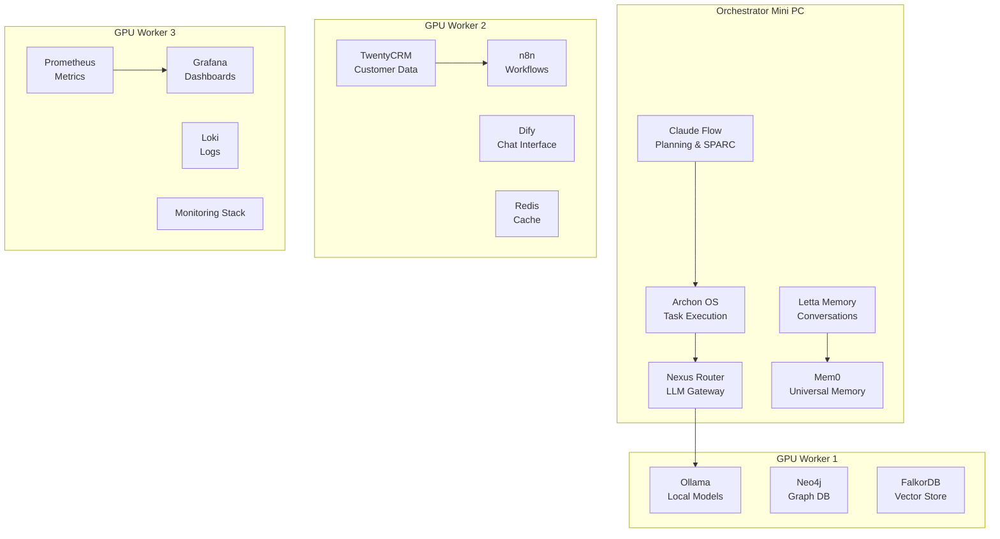
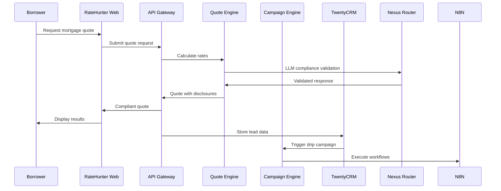
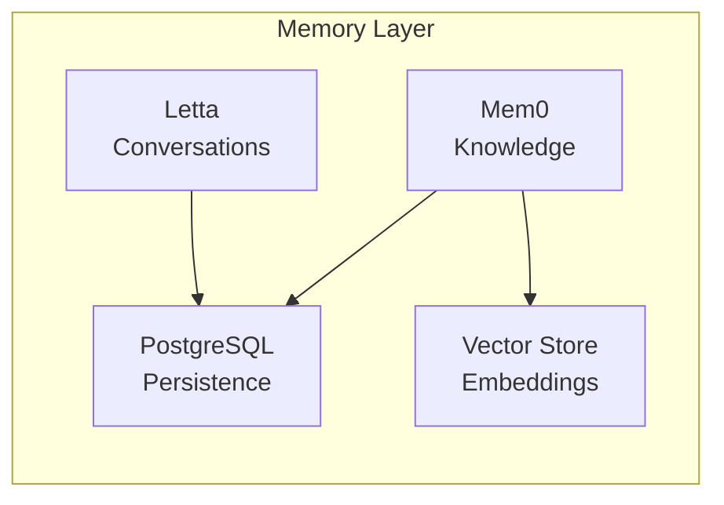
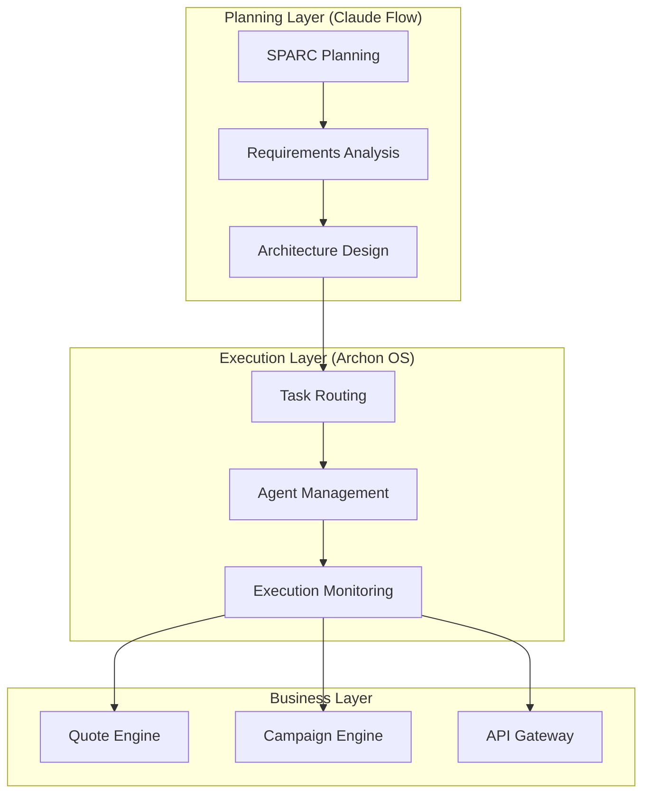
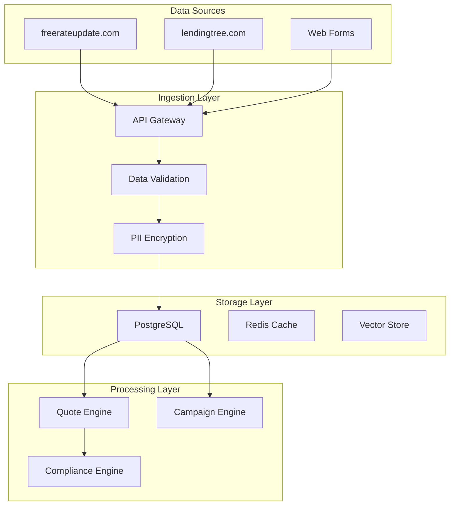

# Project Nyra - System Architecture

**Version**: 3.1.0 (Consolidated Architecture)
**Date**: March 3, 2026
**Status**: Production Architecture

> **Note**: This document consolidates and supersedes:
> - `ingest/ARCHITECTURE.md`
> - `ingest/ARCHITECTURE (2).md`
> - `ingest/ARCHITECTURE-ORCHESTRATOR.md`
> - `ingest/ARCHITECTURE-SUMMARY.md`
> - `ClaudeFinal/docs/ARCHITECTURE.md`

## 🎯 Executive Summary

Project Nyra is a **distributed, AI-powered mortgage platform** designed for high-compliance mortgage brokerage operations. The system processes leads, generates compliant quotes, executes drip campaigns, and provides borrower assistance through a **4-PC cluster architecture**.

### **Key Metrics**
- **Scale**: 100-500 monthly mortgage leads
- **Compliance**: TILA/RESPA, Fair Lending, 50-state regulations
- **Performance**: <2 seconds quote generation, 99.9% uptime
- **AI Integration**: Multi-model LLM routing with local inference

## 🏗 High-Level Architecture

### **Distributed Multi-Agent System**



### **Service Communication Flow**



## 🔄 Service Layer Architecture

### **Core Infrastructure Services**

#### **Nexus Router (Port 6000)**
**Purpose**: Multi-provider LLM gateway with intelligent routing

**Architecture**:
- **Primary**: Claude (Anthropic) for complex reasoning
- **Cost-Optimized**: Gemini 2.0 Flash for routine operations
- **Local Fallback**: Ollama models on GPU workers
- **Routing Logic**: Cost/performance optimization with circuit breakers

**Integration Points**:
```yaml
Upstreams:
  - Anthropic API (Claude 3.5 Sonnet)
  - OpenRouter API (model diversity)
  - Google AI API (Gemini 2.0 Flash)
  - Local Ollama (GPU Worker 1)

Downstreams:
  - Quote Engine (compliance validation)
  - Campaign Engine (content generation)
  - Nyra Orchestrator (decision making)
  - All frontend applications
```

#### **TwentyCRM (Port 3000)**
**Purpose**: Customer relationship management with PostgreSQL backend

**Schema Design**:
```sql
-- Core entities for mortgage CRM
Contacts (borrowers, co-borrowers, referral partners)
Opportunities (loan applications, quote requests)
Activities (calls, emails, meetings, document submissions)
Products (loan types, rate sheets, lender programs)
Pipelines (lead processing stages, compliance checkpoints)
```

**Integration Points**:
- **Lead Ingestion**: freerateupdate.com, lendingtree.com APIs
- **Campaign Engine**: Trigger automated workflows
- **Quote Engine**: Store rate calculations and decisions
- **Compliance**: Audit trail for all borrower interactions

#### **Memory System (Letta + Mem0)**

**Letta (Port 8283) - Conversation Memory**:
- Long-term conversation context
- Borrower interaction history
- Compliance conversation tracking
- Session state management

**Mem0 (Port 4321) - Universal Memory**:
- Knowledge base management
- Document embeddings and retrieval
- Rate trend analysis
- Regulatory update integration

**Memory Architecture**:


### **Business Logic Services**

#### **Quote Engine (Port 8001)**
**Purpose**: Mortgage rate calculations with TILA/RESPA compliance

**Core Logic**:
```python
class QuoteEngine:
    def calculate_quote(self, borrower_profile: BorrowerProfile) -> MortgageQuote:
        # 1. Rate discovery from multiple lenders
        rates = self.rate_service.get_current_rates(borrower_profile)

        # 2. TILA APR calculations (Regulation Z)
        apr = self.compliance.calculate_apr(rates, fees, points)

        # 3. Closing cost estimates by state
        closing_costs = self.estimate_closing_costs(
            borrower_profile.state,
            borrower_profile.loan_amount
        )

        # 4. Required disclosures generation
        disclosures = self.compliance.generate_disclosures(
            borrower_profile, rates, closing_costs
        )

        # 5. Fair lending validation
        self.compliance.validate_fair_lending(borrower_profile, rates)

        return MortgageQuote(
            rates=rates,
            apr=apr,
            closing_costs=closing_costs,
            disclosures=disclosures,
            compliance_validated=True
        )
```

**Compliance Integration**:
- **TILA Validation**: APR calculations per Regulation Z
- **RESPA Compliance**: Good faith estimates and timing
- **Fair Lending**: Anti-steering provision compliance
- **State Regulations**: 50-state disclosure variations

#### **Campaign Engine (Port 8002)**
**Purpose**: Automated drip campaigns with n8n workflow integration

**Workflow Architecture**:
```yaml
Lead Processing Pipeline:
  1. Lead Ingestion → CRM
  2. Lead Scoring → ML Model
  3. Drip Campaign Assignment → n8n
  4. Multi-channel Communication:
     - Email: SendGrid templates
     - SMS: Twilio messaging
     - Voice: Twilio voice calls
  5. Response Tracking → CRM
  6. Conversion Analytics → Grafana
```

**Campaign Types**:
- **First-Time Homebuyer**: Educational content, timeline guidance
- **Refinance**: Rate monitoring, break-even analysis
- **Jumbo Loans**: High-net-worth specific content
- **Non-QM**: Alternative documentation workflows

#### **Nyra Orchestrator (Port 8010)**
**Purpose**: Master coordination with Claude Flow integration

**Orchestration Pattern**:


### **Frontend Applications**

#### **RateHunter Web (Port 3100)**
**Purpose**: Customer-facing mortgage rate portal

**Architecture**: Next.js 14 with server components
**Features**:
- Real-time rate calculator
- Lead capture forms
- Dify chat integration
- Mobile-responsive design
- SEO optimized for mortgage keywords

#### **Nyra Admin (Port 3101)**
**Purpose**: Internal operations dashboard

**Modules**:
- **Lead Management**: CRM integration with TwentyCRM
- **Campaign Monitoring**: n8n workflow visibility
- **Compliance Dashboard**: Audit trails and regulatory reporting
- **Performance Analytics**: Quote metrics and conversion rates

## 🖥️ Infrastructure Architecture

### **4-PC Cluster Design**

#### **Orchestrator Mini PC**
```yaml
Role: Master coordination and planning
CPU: Intel i7 or equivalent
RAM: 32GB minimum
Storage: 1TB NVMe SSD
GPU: Optional (Intel Arc or entry NVIDIA)
OS: Ubuntu 22.04 LTS

Services:
  - Claude Flow (planning)
  - Archon OS (execution)
  - Nexus Router (LLM gateway)
  - Letta (memory)
  - Mem0 (knowledge)
  - API Gateway
```

#### **GPU Worker 1 (AI/ML)**
```yaml
Role: Local LLM inference and ML workloads
GPU: RTX 3060 Ti minimum
CPU: AMD Ryzen 7 or Intel i7
RAM: 64GB (for large models)
Storage: 2TB NVMe SSD
OS: Ubuntu 22.04 LTS with CUDA

Services:
  - Ollama (local models)
  - Neo4j (graph database)
  - FalkorDB (vector store)
  - ML training pipelines
```

#### **GPU Worker 2 (Business)**
```yaml
Role: Business applications and workflows
GPU: RTX 3090 Ti minimum
CPU: AMD Ryzen 7 or Intel i7
RAM: 64GB
Storage: 2TB NVMe SSD
OS: Ubuntu 22.04 LTS

Services:
  - TwentyCRM
  - n8n workflows
  - Dify chat interface
  - Redis cache
  - Background job processing
```

#### **GPU Worker 3 (Observability)**
```yaml
Role: Monitoring and observability
GPU: RTX 5090 (aspirational)
CPU: AMD Ryzen 7 or Intel i7
RAM: 64GB
Storage: 4TB NVMe SSD (logs)
OS: Ubuntu 22.04 LTS

Services:
  - Prometheus
  - Grafana
  - Loki
  - ElasticSearch (optional)
  - Long-term log storage
```

### **Network Architecture**

#### **Internal Networking**
```yaml
Primary Network: 192.168.1.0/24
Service Network: 172.20.0.0/16 (Docker)
VPN Mesh: Tailscale (cross-PC communication)

Inter-service Communication:
  - Docker bridge network (same PC)
  - Tailscale mesh (cross-PC)
  - mTLS for sensitive operations
```

#### **External Access**
```yaml
Production:
  - Cloudflare Tunnels (secure external access)
  - Domain: ratehunter.net
  - Subdomains:
    - api.ratehunter.net → API Gateway
    - admin.ratehunter.net → Nyra Admin
    - app.ratehunter.net → RateHunter Web

Development:
  - Direct IP access on LAN
  - Port forwarding for testing
  - ngrok for external demos
```

## 🔐 Security Architecture

### **Data Protection**
```yaml
PII Encryption:
  - At Rest: AES-256 encryption for all borrower data
  - In Transit: TLS 1.3 for all communications
  - Database: PostgreSQL transparent data encryption

Access Controls:
  - Service Mesh: mTLS between all services
  - API Authentication: JWT tokens with role-based access
  - Database: Row-level security for borrower data
  - Admin Access: MFA required for all admin operations
```

### **Compliance Security**
```yaml
Audit Logging:
  - All API requests logged with borrower consent
  - Compliance decisions logged with reasoning
  - Access patterns monitored for anomalies
  - Log retention: 7 years (regulatory requirement)

Data Sovereignty:
  - All data stored on-premises
  - No borrower PII sent to external LLM APIs
  - Local model inference for sensitive operations
  - Compliance-validated data retention policies
```

## 📊 Performance Architecture

### **Scalability Design**
```yaml
Horizontal Scaling:
  - Stateless services (Quote Engine, Campaign Engine)
  - Load balancing via Docker Swarm or Kubernetes
  - Database read replicas for query performance
  - Redis cluster for distributed caching

Vertical Scaling:
  - GPU workers can be upgraded independently
  - Memory scaling for LLM model size
  - Storage expansion for log retention
  - CPU scaling for computational workloads
```

### **Performance Targets**
```yaml
API Performance:
  - Quote Generation: < 2 seconds (p95)
  - API Gateway: < 500ms (p95)
  - Database Queries: < 100ms (p95)
  - Cache Hits: > 80% for repeated queries

System Performance:
  - Uptime: 99.9% for business hours
  - Recovery Time: < 5 minutes for service failures
  - Data Consistency: Eventually consistent with audit trail
  - Throughput: 10 concurrent quotes, 100 leads/day
```

## 🔄 Data Architecture

### **Database Design**
```sql
-- Core PostgreSQL schema structure
CREATE SCHEMA mortgage_core;
CREATE SCHEMA compliance;
CREATE SCHEMA analytics;

-- Borrower data (encrypted PII)
CREATE TABLE mortgage_core.borrowers (
    id UUID PRIMARY KEY,
    encrypted_ssn BYTEA,
    encrypted_income BYTEA,
    credit_score INTEGER,
    state VARCHAR(2),
    created_at TIMESTAMP WITH TIME ZONE
);

-- Quote history with audit trail
CREATE TABLE mortgage_core.quotes (
    id UUID PRIMARY KEY,
    borrower_id UUID REFERENCES mortgage_core.borrowers(id),
    loan_amount DECIMAL(12,2),
    interest_rate DECIMAL(5,4),
    apr DECIMAL(5,4),
    compliance_validated BOOLEAN,
    created_at TIMESTAMP WITH TIME ZONE
);

-- Compliance audit log
CREATE TABLE compliance.audit_log (
    id UUID PRIMARY KEY,
    event_type VARCHAR(100),
    borrower_id UUID,
    data_hash VARCHAR(64),
    compliance_status VARCHAR(20),
    created_at TIMESTAMP WITH TIME ZONE
);
```

### **Data Flow Architecture**


## 🚀 Deployment Architecture

### **Container Strategy**
```yaml
Container Platform: Docker Compose (development), Kubernetes (production)
Image Registry: Private registry on orchestrator
Image Security: Vulnerability scanning with Trivy
Resource Limits: CPU/memory limits per service
```

### **CI/CD Pipeline**
```yaml
Source Control: Git with feature branch workflow
Build Pipeline:
  1. Code quality checks (ESLint, Prettier, Black)
  2. Security scanning (SAST, dependency check)
  3. Unit and integration tests
  4. Compliance validation tests
  5. Docker image build and scan
  6. Staging deployment
  7. E2E tests with mortgage scenarios
  8. Production deployment (blue-green)

Deployment Strategy:
  - Rolling updates for stateless services
  - Blue-green deployment for customer-facing apps
  - Database migrations with rollback capability
  - Feature flags for gradual rollouts
```

### **Disaster Recovery**
```yaml
Backup Strategy:
  - Database: Continuous WAL archiving + daily snapshots
  - Configuration: Git-based infrastructure as code
  - Data: Encrypted offsite backups (compliance requirement)
  - Recovery Time Objective (RTO): 4 hours
  - Recovery Point Objective (RPO): 1 hour

Failover Strategy:
  - Service-level circuit breakers
  - Cross-PC service migration
  - Database read replica promotion
  - External API fallback chains
```

## 🎯 Integration Architecture

### **External API Integrations**
```yaml
Mortgage Rate APIs:
  - freerateupdate.com: Real-time rate feeds
  - lendingtree.com: Lead generation and processing
  - Direct lender APIs: Rate shopping and pre-approvals

Communication APIs:
  - Twilio: SMS, voice calls, and video
  - SendGrid: Email campaigns and transactional
  - Calendly: Appointment scheduling integration

Financial APIs:
  - Credit bureaus: Real-time credit score pulls
  - Bank verification: Asset and income verification
  - Document processing: OCR and data extraction
```

### **Internal Service Integration**
```yaml
Event-Driven Architecture:
  - Event Bus: Redis Streams or Apache Kafka
  - Event Types: lead_created, quote_generated, campaign_triggered
  - Event Processing: Async handlers with retry logic
  - Event Sourcing: Complete audit trail for compliance

API Design:
  - RESTful APIs with OpenAPI specifications
  - GraphQL for complex frontend queries
  - gRPC for high-performance inter-service communication
  - WebSocket for real-time updates (rate changes, campaign status)
```

## 📈 Monitoring Architecture

### **Observability Stack**
```yaml
Metrics: Prometheus with custom mortgage business metrics
Dashboards: Grafana with mortgage-specific dashboards
Logging: Loki with structured JSON logs
Tracing: Jaeger for distributed request tracing
Alerting: PagerDuty integration for critical issues

Key Metrics:
  - Business: Lead conversion rate, quote accuracy, campaign effectiveness
  - Technical: API latency, error rates, database performance
  - Compliance: Audit log completeness, disclosure generation success
  - Resource: CPU/memory/GPU utilization across cluster
```

### **Health Monitoring**
```yaml
Health Checks:
  - Service: /health endpoints for all services
  - Database: Connection pooling and query performance
  - External APIs: Circuit breaker patterns with fallbacks
  - Business Logic: Quote calculation accuracy validation

Alerting Rules:
  - Critical: Service down, database connection failure
  - Warning: High latency, elevated error rates
  - Info: Deployment completion, backup success
  - Compliance: Audit log failures, disclosure generation errors
```

## 🔮 Future Architecture Considerations

### **Scalability Roadmap**
```yaml
Phase 1 (Current): 4-PC cluster, 500 leads/month
Phase 2 (6 months): Kubernetes cluster, 2000 leads/month
Phase 3 (12 months): Multi-region deployment, 5000 leads/month
Phase 4 (18 months): Edge computing, white-label platform

Technology Evolution:
  - GPU Scaling: Add more GPU workers as needed
  - AI Enhancement: Larger local models, fine-tuning
  - Cloud Integration: Hybrid on-premises/cloud architecture
  - Compliance Automation: Full regulatory automation
```

### **Technology Debt Management**
```yaml
Regular Reviews:
  - Quarterly: Dependency updates and security patches
  - Bi-annual: Architecture review and optimization
  - Annual: Technology stack evaluation and planning

Migration Strategies:
  - Database: PostgreSQL → distributed SQL if needed
  - Container: Docker Compose → Kubernetes for scale
  - Monitoring: Add OpenTelemetry for vendor flexibility
  - AI: Local models → fine-tuned mortgage-specific models
```

---

## 📚 Appendices

### **A. Service Port Allocation**
```yaml
Core Infrastructure:
  - 6000: Nexus Router (LLM Gateway)
  - 3000: TwentyCRM
  - 8283: Letta (Memory)
  - 4321: Mem0 (Knowledge)
  - 5678: n8n (Workflows)
  - 3001: Dify (Chat)

Business Services:
  - 8001: Quote Engine
  - 8002: Campaign Engine
  - 8010: Nyra Orchestrator
  - 8003: RateHunter API

Frontend Apps:
  - 3100: RateHunter Web
  - 3101: Nyra Admin

Data & Monitoring:
  - 5432: PostgreSQL
  - 6379: Redis
  - 9090: Prometheus
  - 3005: Grafana
  - 3100: Loki
```

### **B. Environment Variables Reference**
See: `infra/env/.env.template` for comprehensive environment configuration

### **C. API Documentation**
- [Quote Engine API](../src/services/quote-engine/docs/api.md)
- [Campaign Engine API](../src/services/campaign-engine/docs/api.md)
- [RateHunter API](../src/services/ratehunter-api/docs/api.md)

### **D. Compliance Documentation**
- [TILA/RESPA Implementation](compliance/tila-respa.md)
- [Fair Lending Compliance](compliance/fair-lending.md)
- [State Regulation Matrix](compliance/state-regulations.md)

---

**Architecture Version**: 3.1.0
**Last Updated**: March 3, 2026
**Reviewed By**: Project Nyra Architecture Team
**Next Review**: June 3, 2026